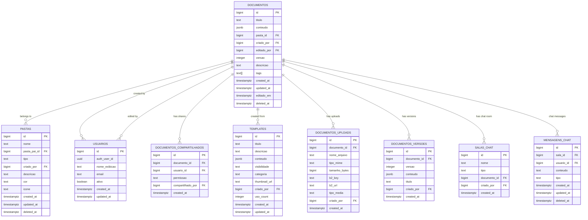

# Process-Document Relationships

<cite>
**Referenced Files in This Document**   
- [20251130220000_create_documentos_system.sql](file://supabase/migrations/aplicadas/20251130220000_create_documentos_system.sql)
- [route.ts](file://app/api/documentos/route.ts)
- [documentos-persistence.service.ts](file://backend/documentos/services/persistence/documentos-persistence.service.ts)
- [processos-toolbar-filters.tsx](file://app/(dashboard)/processos/components/processos-toolbar-filters.tsx)
- [document-list.tsx](file://components/documentos/document-list.tsx)
- [document-table.tsx](file://components/documentos/document-table.tsx)
- [document-card.tsx](file://components/documentos/document-card.tsx)
- [processo-relacionado.ts](file://types/domain/processo-relacionado.ts)
- [processo_partes.sql](file://supabase/migrations/aplicadas/20251127000000_create_processo_partes.sql)
- [logs_alteracao.sql](file://supabase/migrations/aplicadas/20251117015304_create_logs_alteracao.sql)
</cite>

## Table of Contents
1. [Introduction](#introduction)
2. [Database Schema for Document-Process Associations](#database-schema-for-document-process-process-associations)
3. [Generic Foreign Key Implementation](#generic-foreign-key-implementation)
4. [API Endpoints for Document-Process Operations](#api-endpoints-for-document-process-operations)
5. [Frontend Data Fetching and State Management](#frontend-data-fetching-and-state-management)
6. [User Interface for Document-Process Interactions](#user-interface-for-document-process-interactions)
7. [Permission System and Access Control](#permission-system-and-access-control)
8. [Performance Optimizations](#performance-optimizations)
9. [Conclusion](#conclusion)

## Introduction

The Sinesys system implements a sophisticated relationship between legal processes and documents through a generic foreign key system. This documentation details how documents are associated with legal processes using the `entidade_tipo` and `entidade_id` fields, which enable polymorphic relationships across different entity types within the system. The architecture allows documents to be linked not only to legal processes but also to various other entities such as clients, opposing parties, and third parties, creating a flexible and scalable document management system. This design supports the complex requirements of legal practice management by enabling documents to be organized and accessed in multiple contexts while maintaining data integrity and security.

**Section sources**
- [20251130220000_create_documentos_system.sql](file://supabase/migrations/aplicadas/20251130220000_create_documentos_system.sql)
- [processo-relacionado.ts](file://types/domain/processo-relacionado.ts)

## Database Schema for Document-Process Associations

The document-process relationship in Sinesys is implemented through a comprehensive database schema that supports flexible associations between documents and various legal entities. The core table `documentos` contains essential fields for document management, including `id`, `titulo`, `conteudo`, `criado_por`, `editado_por`, and timestamps for creation and modification. Documents can be organized into hierarchical folders through the `pasta_id` field, which references the `pastas` table. The schema includes soft delete functionality with the `deleted_at` field, allowing documents to be archived rather than permanently removed.

The relationship between documents and processes is established through a polymorphic association pattern, where documents can be linked to different types of entities through the combination of `tipo_entidade` and `entidade_id` fields. This design enables a single document to be associated with multiple contexts, such as being linked to both a specific legal process and a client entity. The schema includes comprehensive indexing strategies to optimize query performance, with indexes on frequently queried fields such as `criado_por`, `pasta_id`, `created_at`, and `updated_at`. Additionally, a trigram index on the `titulo` field enables efficient full-text search capabilities, allowing users to quickly locate documents based on their titles.

**Diagram sources**
- [20251130220000_create_documentos_system.sql](file://supabase/migrations/aplicadas/20251130220000_create_documentos_system.sql)

**Section sources**
- [20251130220000_create_documentos_system.sql](file://supabase/migrations/aplicadas/20251130220000_create_documentos_system.sql)

## Generic Foreign Key Implementation

The Sinesys system implements a generic foreign key system using the `entidade_tipo` and `entidade_id` fields to establish polymorphic relationships between documents and various legal entities. This design pattern allows a single document to be associated with different types of entities, such as legal processes, clients, opposing parties, or third parties, without requiring separate foreign key columns for each entity type. The `entidade_tipo` field stores the type of the associated entity as a string (e.g., "processo", "cliente", "parte_contraria"), while the `entidade_id` field stores the primary key value of the specific entity instance.

This implementation follows the "polymorphic association" pattern commonly used in relational databases when a model needs to belong to multiple other models. The system maintains data integrity through application-level validation rather than database constraints, as traditional foreign key constraints cannot be applied to polymorphic relationships. When creating or updating document associations, the backend services validate that the combination of `entidade_tipo` and `entidade_id` references an existing entity of the specified type. This approach provides maximum flexibility in document organization while maintaining referential integrity through business logic validation.

The generic foreign key system is used consistently across multiple tables in the Sinesys database, including `processo_partes`, `enderecos`, and `cadastros_pje`, creating a unified approach to polymorphic relationships throughout the application. This consistency simplifies development and reduces the cognitive load for developers working with different parts of the system. The implementation includes comprehensive error handling to manage cases where referenced entities are deleted or modified, ensuring that document associations remain consistent and reliable.

**Diagram sources**
- [20251130220000_create_documentos_system.sql](file://supabase/migrations/aplicadas/20251130220000_create_documentos_system.sql)
- [processo_partes.sql](file://supabase/migrations/aplicadas/20251127000000_create_processo_partes.sql)

**Section sources**
- [20251130220000_create_documentos_system.sql](file://supabase/migrations/aplicadas/20251130220000_create_documentos_system.sql)
- [processo_partes.sql](file://supabase/migrations/aplicadas/20251127000000_create_processo_partes.sql)

## API Endpoints for Document-Process Operations

The Sinesys system provides a comprehensive set of API endpoints for managing document-process associations, enabling clients to create, retrieve, update, and delete document relationships through RESTful interfaces. The primary endpoint for document operations is located at `/api/documentos`, which supports standard CRUD operations for document management. When creating a new document associated with a legal process, clients send a POST request with the document data including the `entidade_tipo` set to "processo" and the `entidade_id` set to the ID of the target process.

The API implements strict validation to ensure data integrity when establishing document-process associations. Before creating or updating a document association, the system verifies that the specified process exists and that the authenticated user has appropriate permissions to access that process. The endpoint also validates that the document title meets length requirements (between 1 and 500 characters) and that any specified folder exists and is accessible to the user. Response codes follow standard HTTP conventions, with 201 Created for successful document creation, 400 Bad Request for validation errors, 403 Forbidden for permission violations, and 404 Not Found for non-existent processes.

For retrieving documents associated with a specific process, the API provides a filtering mechanism that allows clients to query documents by `entidade_tipo` and `entidade_id`. This enables efficient retrieval of all documents linked to a particular legal process. The response includes comprehensive document metadata, including version information, creation and modification timestamps, and sharing status. The API also supports pagination, sorting, and full-text search capabilities, allowing clients to efficiently navigate large collections of process-related documents.

**Section sources**
- [route.ts](file://app/api/documentos/route.ts)
- [documentos-persistence.service.ts](file://backend/documentos/services/persistence/documentos-persistence.service.ts)

## Frontend Data Fetching and State Management

The frontend implementation of document-process relationships in Sinesys utilizes a sophisticated data fetching and state management system to provide a responsive and efficient user experience. The application leverages React Query for data fetching, caching, and synchronization, enabling automatic background updates and optimal performance. When a user navigates to a process details page, the frontend initiates a query to retrieve all documents associated with that process through the generic foreign key system, using the process ID as the `entidade_id` and "processo" as the `entidade_tipo`.

Data fetching follows a progressive loading pattern, where essential document metadata is retrieved first to populate the user interface quickly, followed by additional details and content as needed. This approach minimizes perceived latency and provides immediate feedback to users. The system implements intelligent caching strategies, storing frequently accessed document lists in memory and using cache invalidation patterns to ensure data consistency when documents are created, updated, or deleted.

State management is handled through a combination of React's built-in state hooks and custom hooks that encapsulate complex document-related logic. The `useDocumentos` hook provides a unified interface for accessing document data, handling loading states, errors, and pagination. This abstraction simplifies component development and ensures consistent behavior across different parts of the application. The system also implements optimistic updates for document operations, immediately reflecting changes in the UI before the server confirms the operation, providing a responsive experience while maintaining data integrity through error recovery mechanisms.

**Section sources**
- [document-list.tsx](file://components/documentos/document-list.tsx)
- [document-table.tsx](file://components/documentos/document-table.tsx)
- [document-card.tsx](file://components/documentos/document-card.tsx)

## User Interface for Document-Process Interactions

The user interface for document-process interactions in Sinesys is designed to provide an intuitive and efficient experience for managing legal documents within the context of specific cases. The primary interface for viewing process-related documents is integrated into the process details page, where documents are displayed in a tabular format with columns for document title, creation date, last modified date, version, and owner. Users can sort and filter documents based on various criteria, including document type, creation date range, and author, enabling quick navigation through potentially large document collections.

To add documents to a process, users can click an "Add Document" button that opens a modal dialog with multiple options: creating a new blank document, selecting from available templates, or uploading existing files. When creating a new document, the system automatically associates it with the current process by setting the `entidade_tipo` to "processo" and the `entidade_id` to the process ID. The document editor provides a rich text editing experience with support for formatting, tables, images, and other elements commonly used in legal documents.

The interface also includes a document preview feature that allows users to view document content without leaving the process context. For documents with multiple versions, a version history panel displays all previous versions with timestamps and authors, enabling users to compare changes and restore previous versions if needed. The sharing interface allows users to grant access to specific team members or groups, with permission levels for viewing or editing. Visual indicators show document status, such as whether a document is currently being edited by another user or if there are pending changes.

**Section sources**
- [document-list.tsx](file://components/documentos/document-list.tsx)
- [document-table.tsx](file://components/documentos/document-table.tsx)
- [document-card.tsx](file://components/documentos/document-card.tsx)

## Permission System and Access Control

The Sinesys system implements a comprehensive permission system to ensure that users can only access documents for processes they are authorized to view. The access control model is based on Row Level Security (RLS) policies in the PostgreSQL database, combined with application-level permission checks. Each document access operation is subject to multiple layers of validation to prevent unauthorized access and maintain data confidentiality.

The core of the permission system is the RLS policy on the `documentos` table, which restricts document visibility to the document's creator and users who have been explicitly granted access through the `documentos_compartilhados` table. For documents associated with legal processes, additional checks verify that the user has permission to access the related process. This is achieved through the `processo_partes` table, which defines the relationship between users and processes, including their role and level of access.

Permission checks are implemented at multiple levels: database, API, and UI. At the database level, RLS policies automatically filter query results based on the authenticated user's identity. At the API level, middleware functions validate that incoming requests are authorized to perform the requested operation on the target document and process. At the UI level, components conditionally render interface elements based on the user's permissions, hiding options for actions they cannot perform. The system also logs all document access attempts in the `logs_alteracao` table, providing an audit trail for security and compliance purposes.

**Diagram sources**
- [logs_alteracao.sql](file://supabase/migrations/aplicadas/20251117015304_create_logs_alteracao.sql)

**Section sources**
- [20251130220000_create_documentos_system.sql](file://supabase/migrations/aplicadas/20251130220000_create_documentos_system.sql)
- [logs_alteracao.sql](file://supabase/migrations/aplicadas/20251117015304_create_logs_alteracao.sql)

## Performance Optimizations

The Sinesys system implements several performance optimizations to ensure efficient querying and management of documents by process. The primary optimization strategy involves comprehensive indexing on the `documentos` table, with B-tree indexes on frequently queried columns such as `criado_por`, `pasta_id`, `created_at`, and `updated_at`. These indexes enable fast filtering and sorting operations, particularly important for large document collections associated with active legal processes.

For text-based searches within document titles, the system utilizes a trigram index with the `gin_trgm_ops` operator class, which allows for efficient fuzzy matching and partial string searches. This enables users to quickly locate documents even with incomplete or misspelled search terms. The trigram index is particularly valuable in legal contexts where document titles may contain complex case numbers or legal terminology.

The system also implements query optimization through careful selection of data retrieval patterns. When displaying documents for a specific process, the API uses targeted queries that leverage the `entidade_tipo` and `entidade_id` fields, which are indexed together for optimal performance. The frontend employs pagination and infinite scrolling to minimize initial load times and reduce memory usage, fetching document data in manageable chunks as needed.

Additional performance enhancements include client-side caching of frequently accessed document lists using React Query's built-in caching mechanism, and server-side caching of expensive queries through Supabase's query optimization features. The system also implements lazy loading for document content, retrieving only metadata initially and fetching full document content only when a user opens a specific document. These optimizations work together to provide a responsive user experience even with large volumes of process-related documents.

**Section sources**
- [20251130220000_create_documentos_system.sql](file://supabase/migrations/aplicadas/20251130220000_create_documentos_system.sql)

## Conclusion

The document-process relationship system in Sinesys represents a sophisticated and flexible approach to managing legal documents within the context of specific cases. By implementing a generic foreign key system using `entidade_tipo` and `entidade_id` fields, the system achieves remarkable flexibility in associating documents with various legal entities while maintaining data integrity through comprehensive validation and constraints. The database schema is thoughtfully designed with performance in mind, incorporating strategic indexing and optimization techniques to ensure efficient querying even with large document collections.

The integration of Row Level Security policies with application-level permission checks creates a robust access control system that protects sensitive legal information while enabling appropriate collaboration. The API endpoints provide a clean and consistent interface for managing document-process associations, supporting the full range of CRUD operations with proper validation and error handling. The frontend implementation delivers an intuitive user experience with efficient data fetching, intelligent caching, and responsive interactions.

This architecture demonstrates a balanced approach to the competing demands of flexibility, security, and performance in legal technology. The polymorphic association pattern allows documents to exist in multiple contexts, reflecting the complex reality of legal practice where a single document may be relevant to multiple cases or entities. At the same time, the system maintains strict access controls and audit capabilities necessary for compliance with legal ethics and data protection regulations. The result is a document management system that is both powerful enough for complex legal workflows and intuitive enough for daily use by legal professionals.