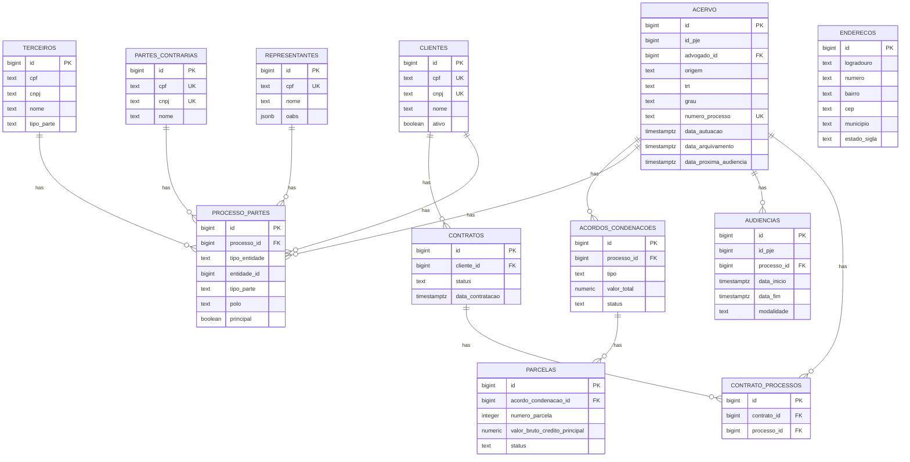
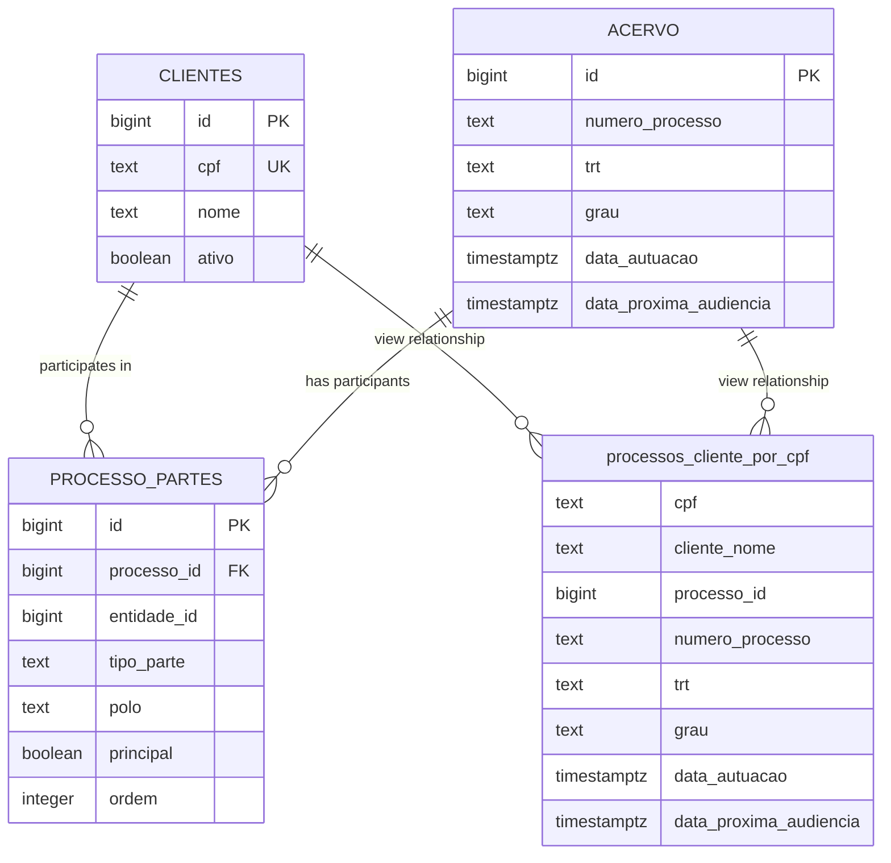
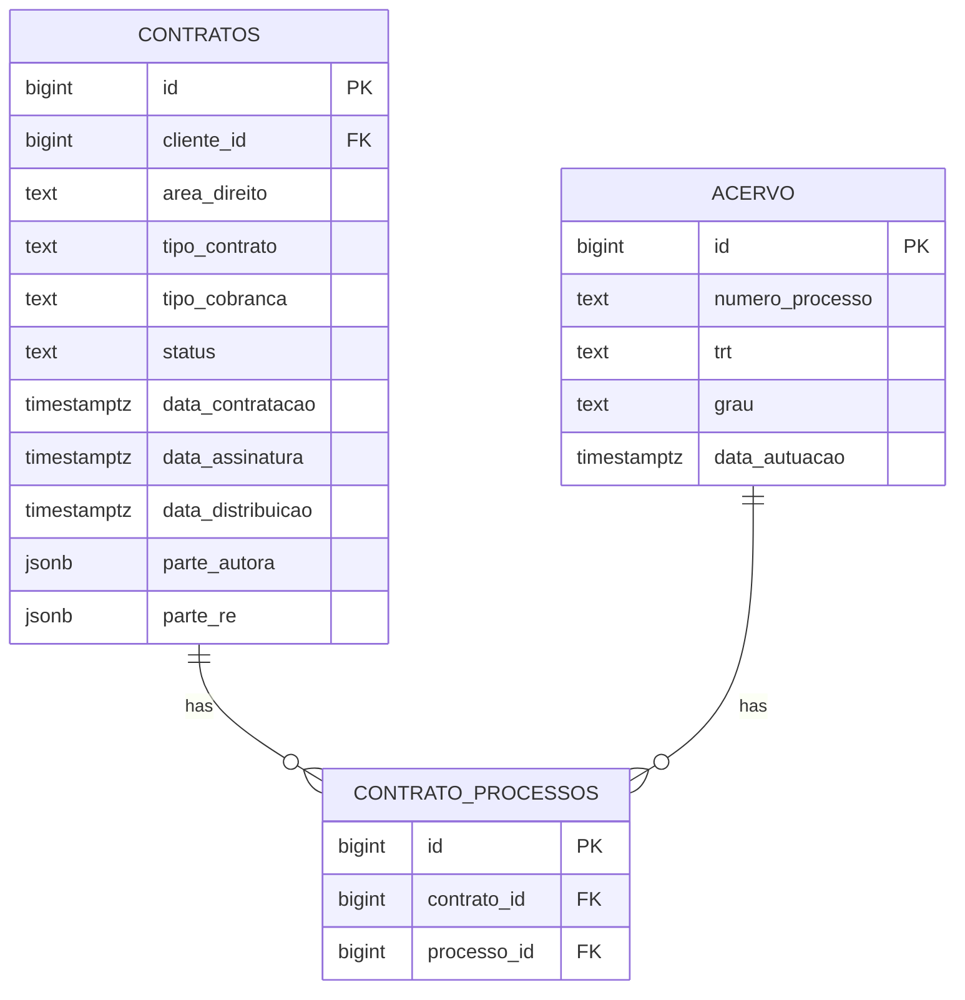
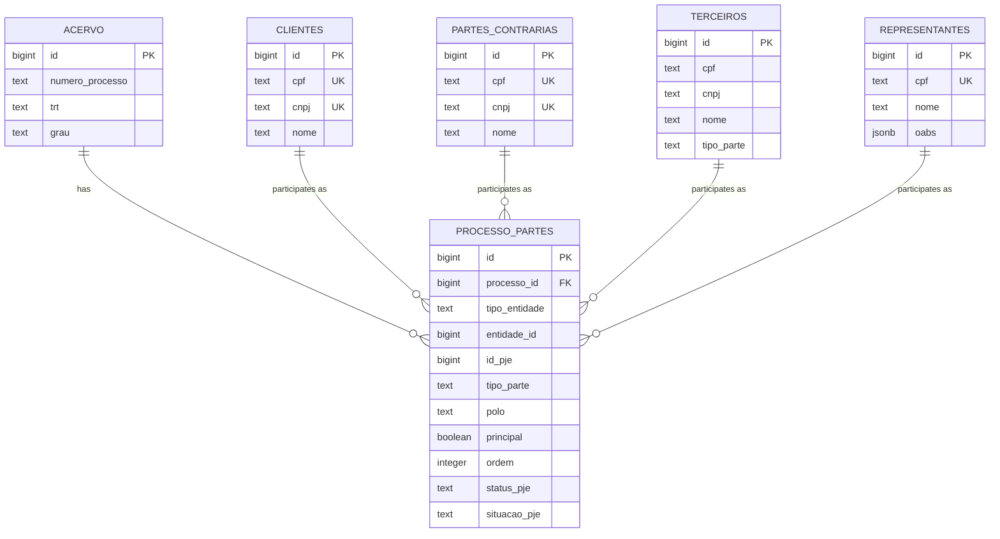
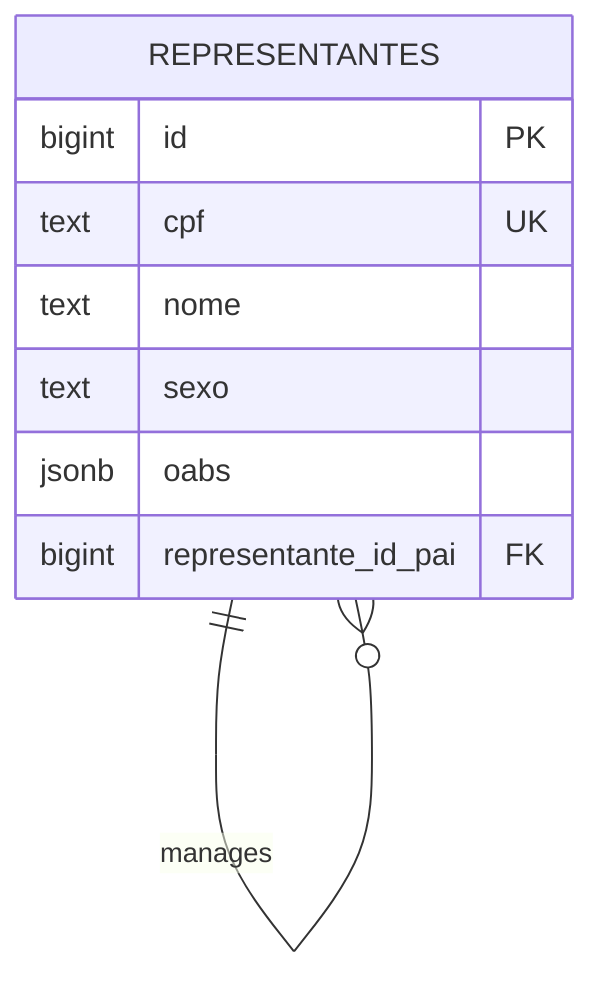
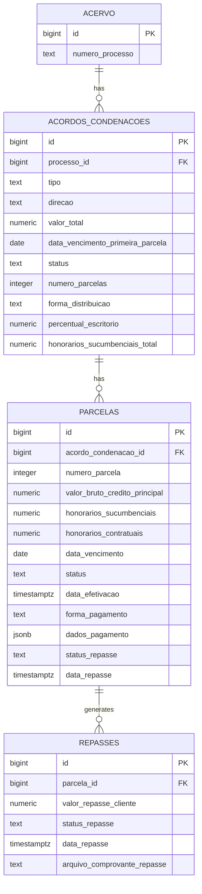
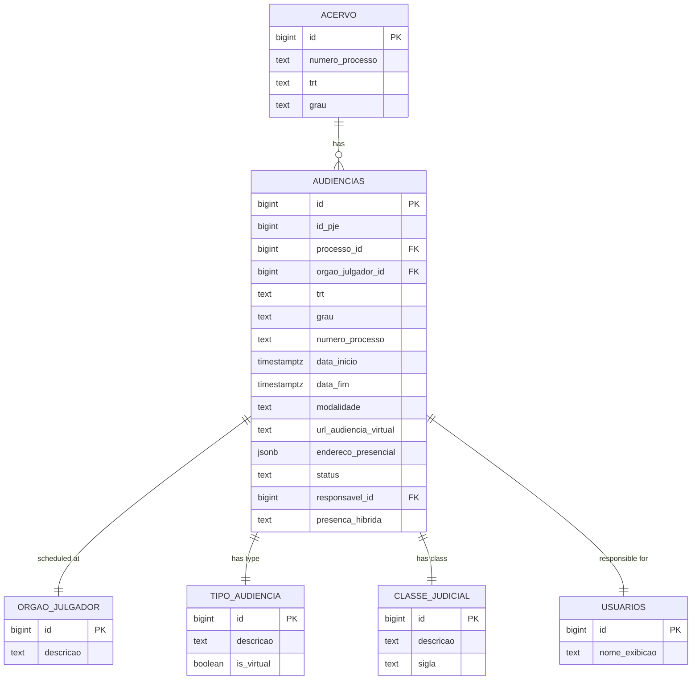
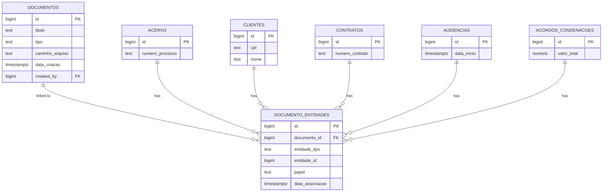
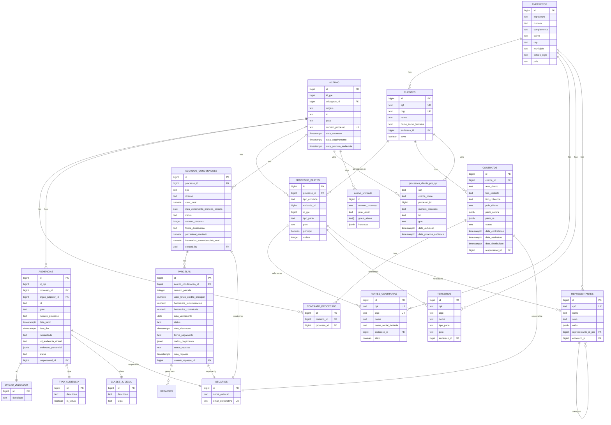

# Entity Relationships

<cite>
**Referenced Files in This Document**   
- [04_acervo.sql](file://supabase/schemas/04_acervo.sql)
- [09_clientes.sql](file://supabase/schemas/09_clientes.sql)
- [11_contratos.sql](file://supabase/schemas/11_contratos.sql)
- [12_contrato_processos.sql](file://supabase/schemas/12_contrato_processos.sql)
- [17_processo_partes.sql](file://supabase/schemas/17_processo_partes.sql)
- [18_representantes.sql](file://supabase/schemas/18_representantes.sql)
- [20_acordos_condenacoes.sql](file://supabase/schemas/20_acordos_condenacoes.sql)
- [07_audiencias.sql](file://supabase/schemas/07_audiencias.sql)
- [15_enderecos.sql](file://supabase/schemas/15_enderecos.sql)
- [10_partes_contrarias.sql](file://supabase/schemas/10_partes_contrarias.sql)
- [16_terceiros.sql](file://supabase/schemas/16_terceiros.sql)
- [34_financeiro_views.sql](file://supabase/schemas/34_financeiro_views.sql)
- [24_processos_cliente_por_cpf_view.sql](file://supabase/schemas/24_processos_cliente_por_cpf_view.sql)
- [05_acervo_unificado_view.sql](file://supabase/schemas/05_acervo_unificado_view.sql)
</cite>

## Table of Contents
1. [Introduction](#introduction)
2. [Core Entity Relationships](#core-entity-relationships)
3. [Process-Client Relationships](#process-client-relationships)
4. [Process-Contract Relationships](#process-contract-relationships)
5. [Process-Partes Relationships](#process-partes-relationships)
6. [Representantes Hierarchy](#representantes-hierarchy)
7. [Financial Relationships](#financial-relationships)
8. [Audiencias Relationships](#audiencias-relationships)
9. [Document Management Relationships](#document-management-relationships)
10. [Referential Integrity and Cascading Behaviors](#referential-integrity-and-cascading-behaviors)
11. [Complex Query Examples](#complex-query-examples)
12. [Entity Relationship Diagram](#entity-relationship-diagram)

## Introduction
This document provides comprehensive entity relationship documentation for the Sinesys database, detailing the relationships between core entities in the legal case management system. The database is designed to manage legal processes, clients, contracts, financial agreements, hearings, and related entities with robust referential integrity and cascading behaviors.

The system captures legal processes from the PJE (Processo Judicial Eletrônico) system and establishes relationships between processes and various entities including clients, contracts, parties, and financial agreements. The database design incorporates materialized views for optimized querying and implements row-level security for data protection.

This documentation covers the primary relationships between entities, hierarchical structures, financial relationships, document management patterns, referential integrity constraints, and provides examples of complex queries that traverse multiple relationships.

**Section sources**
- [04_acervo.sql](file://supabase/schemas/04_acervo.sql#L1-L77)
- [09_clientes.sql](file://supabase/schemas/09_clientes.sql#L1-L139)

## Core Entity Relationships
The Sinesys database centers around the Acervo (legal processes) entity, which serves as the primary hub connecting to various other entities in the system. The core relationships include connections to clients through a view, to contracts via a junction table, to hearings through foreign keys, and to parties through a many-to-many relationship.

The Acervo table stores all legal processes captured from the PJE system, including both active cases and archived cases. Each process record contains essential information such as process number, court code, legal class, filing date, and status. The table is designed with a composite unique constraint on (id_pje, trt, grau, numero_processo) to ensure process uniqueness while allowing multiple lawyers to view the same process.

The database implements a polymorphic relationship pattern through the processo_partes table, which establishes many-to-many relationships between processes and various party types (clients, opposing parties, third parties). This design allows flexible association of different entity types with legal processes while maintaining referential integrity.



**Diagram sources**
- [04_acervo.sql](file://supabase/schemas/04_acervo.sql#L1-L77)
- [09_clientes.sql](file://supabase/schemas/09_clientes.sql#L1-L139)
- [11_contratos.sql](file://supabase/schemas/11_contratos.sql#L1-L86)
- [12_contrato_processos.sql](file://supabase/schemas/12_contrato_processos.sql#L1-L29)
- [17_processo_partes.sql](file://supabase/schemas/17_processo_partes.sql#L1-L144)
- [18_representantes.sql](file://supabase/schemas/18_representantes.sql#L1-L63)
- [20_acordos_condenacoes.sql](file://supabase/schemas/20_acordos_condenacoes.sql#L1-L128)
- [07_audiencias.sql](file://supabase/schemas/07_audiencias.sql#L1-L159)
- [10_partes_contrarias.sql](file://supabase/schemas/10_partes_contrarias.sql#L1-L139)
- [16_terceiros.sql](file://supabase/schemas/16_terceiros.sql#L1-L119)
- [15_enderecos.sql](file://supabase/schemas/15_enderecos.sql#L1-L94)

**Section sources**
- [04_acervo.sql](file://supabase/schemas/04_acervo.sql#L1-L77)
- [17_processo_partes.sql](file://supabase/schemas/17_processo_partes.sql#L1-L144)

## Process-Client Relationships
The relationship between processes and clients is established through the processo_partes junction table, which implements a many-to-many relationship pattern. This design allows multiple clients to be associated with a single process and a single client to participate in multiple processes.

The relationship is further enhanced by the processos_cliente_por_cpf view, which materializes the relationship between clients (by CPF) and their processes for optimized querying. This materialized view is specifically designed for use by the WhatsApp AI agent to quickly retrieve process information for clients.

The processo_partes table includes critical information about the client's role in the process, including the type of party (cliente), the specific party type (tipo_parte such as RECLAMANTE, RECLAMADO), the procedural pole (polo such as ATIVO, PASSIVO), whether the client is the principal party in their pole, and their order of appearance within the pole.

The view processos_cliente_por_cpf includes comprehensive process information such as process number, court code, legal class, filing date, and next hearing date, making it a powerful tool for client-facing queries. The view is optimized with unique and non-unique indexes to ensure fast retrieval of process data by client CPF.



**Diagram sources**
- [09_clientes.sql](file://supabase/schemas/09_clientes.sql#L1-L139)
- [04_acervo.sql](file://supabase/schemas/04_acervo.sql#L1-L77)
- [17_processo_partes.sql](file://supabase/schemas/17_processo_partes.sql#L1-L144)
- [24_processos_cliente_por_cpf_view.sql](file://supabase/schemas/24_processos_cliente_por_cpf_view.sql#L1-L105)

**Section sources**
- [09_clientes.sql](file://supabase/schemas/09_clientes.sql#L1-L139)
- [24_processos_cliente_por_cpf_view.sql](file://supabase/schemas/24_processos_cliente_por_cpf_view.sql#L1-L105)

## Process-Contract Relationships
The relationship between processes and contracts is managed through the contrato_processos junction table, which establishes a many-to-many relationship between the contratos and acervo tables. This design allows a single contract to be associated with multiple processes and a single process to be linked to multiple contracts.

The contratos table contains comprehensive information about legal contracts, including area of law, contract type, billing method, client information, opposing party information, and contract status. The table includes JSONB fields for storing multiple parties (parte_autora and parte_re) which allows for complex party configurations within a single contract.

The contrato_processos table serves as a simple junction table with foreign key references to both the contratos and acervo tables, ensuring referential integrity. The table includes a unique constraint on (contrato_id, processo_id) to prevent duplicate associations between the same contract and process.

This relationship structure supports the common legal scenario where a single client engagement (contract) may involve multiple legal processes, such as when a labor dispute evolves from a first-instance case to an appeal. The design also accommodates situations where a single process may be covered by multiple contracts, such as when different aspects of a complex case are handled under separate fee arrangements.



**Diagram sources**
- [11_contratos.sql](file://supabase/schemas/11_contratos.sql#L1-L86)
- [12_contrato_processos.sql](file://supabase/schemas/12_contrato_processos.sql#L1-L29)
- [04_acervo.sql](file://supabase/schemas/04_acervo.sql#L1-L77)

**Section sources**
- [11_contratos.sql](file://supabase/schemas/11_contratos.sql#L1-L86)
- [12_contrato_processos.sql](file://supabase/schemas/12_contrato_processos.sql#L1-L29)

## Process-Partes Relationships
The relationship between processes and parties is implemented through the processo_partes table, which uses a polymorphic association pattern to connect processes with various party types including clients, opposing parties, and third parties. This design provides flexibility in representing different types of parties in legal processes while maintaining data integrity.

The processo_partes table includes foreign key references to the acervo table (processo_id) and implements a polymorphic relationship through the combination of tipo_entidade (which can be 'cliente', 'parte_contraria', or 'terceiro') and entidade_id (which references the corresponding entity in the respective table). This pattern allows the system to associate different types of parties with processes without requiring separate junction tables for each party type.

The table captures detailed information about each party's role in the process, including:
- The specific party type (tipo_parte such as AUTOR, REU, RECLAMANTE, RECLAMADO, EXEQUENTE, EXECUTADO, etc.)
- The procedural pole (polo such as ATIVO, PASSIVO, NEUTRO, TERCEIRO)
- Whether the party is the principal representative in their pole (principal)
- The order of appearance within the pole (ordem)
- PJE-specific identifiers and status information

The table includes a unique constraint on (processo_id, tipo_entidade, entidade_id, grau) to prevent duplicate entries for the same party in the same process and grade. This ensures data consistency while allowing the same party to participate in different grades of the same process.



**Diagram sources**
- [17_processo_partes.sql](file://supabase/schemas/17_processo_partes.sql#L1-L144)
- [04_acervo.sql](file://supabase/schemas/04_acervo.sql#L1-L77)
- [09_clientes.sql](file://supabase/schemas/09_clientes.sql#L1-L139)
- [10_partes_contrarias.sql](file://supabase/schemas/10_partes_contrarias.sql#L1-L139)
- [16_terceiros.sql](file://supabase/schemas/16_terceiros.sql#L1-L119)
- [18_representantes.sql](file://supabase/schemas/18_representantes.sql#L1-L63)

**Section sources**
- [17_processo_partes.sql](file://supabase/schemas/17_processo_partes.sql#L1-L144)

## Representantes Hierarchy
The representantes table implements a hierarchical structure through the representante_id_pai field, which creates a parent-child relationship between representatives. This design allows the system to model organizational hierarchies among legal representatives, such as partners and associates in a law firm.

Each representative is uniquely identified by their CPF (Cadastro de Pessoas Físicas), which serves as a business key constraint. The table stores comprehensive information about legal representatives including their name, gender, OAB (Ordem dos Advogados do Brasil) registrations, contact information, and address.

The hierarchical relationship is established through the representante_id_pai field, which is a self-referencing foreign key that points to another record in the same table. This design enables the representation of complex organizational structures where a senior representative (parent) may have multiple junior representatives (children) reporting to them.

The table includes a JSONB field (oabs) to store multiple OAB registrations, accommodating representatives who are registered in multiple states. This array structure allows a single representative to have inscriptions in different state OABs, which is common for lawyers who practice in multiple jurisdictions.



**Diagram sources**
- [18_representantes.sql](file://supabase/schemas/18_representantes.sql#L1-L63)

**Section sources**
- [18_representantes.sql](file://supabase/schemas/18_representantes.sql#L1-L63)

## Financial Relationships
The financial relationships in the Sinesys database are centered around the acordos_condenacoes (agreements and condemnations) table, which represents financial settlements, court-ordered payments, and legal costs associated with legal processes. This table establishes a direct relationship with the acervo table through the processo_id foreign key.

The acordos_condenacoes table captures key financial information including:
- The type of financial agreement (acordo, condenacao, or custas_processuais)
- The direction of payment (recebimento for amounts the firm receives, pagamento for amounts the firm pays)
- The total value of the agreement
- The due date of the first installment
- The current status of the agreement (pendente, pago_parcial, pago_total, atrasado)
- The number of installments
- The distribution method (integral or dividido)
- The firm's percentage of contractual fees (percentual_escritorio)
- The total amount of sucumbential fees (honorarios_sucumbenciais_total)

The financial structure is further detailed through the parcelas (installments) table, which implements a one-to-many relationship with acordos_condenacoes. Each installment record includes:
- The installment number
- The gross value of the principal credit
- The amount of sucumbential fees
- The amount of contractual fees
- The due date
- The payment status (pendente, recebida, paga, atrasado)
- The effective payment date
- The payment method (transferencia_direta, deposito_judicial, deposito_recursal)
- Payment data and documentation
- Repayment status to clients

The database also includes comprehensive financial views that aggregate data for reporting purposes, including views for pending transactions, monthly cash flow, account balances, budget vs. actual comparisons, and DRE (Demonstração do Resultado do Exercício).



**Diagram sources**
- [20_acordos_condenacoes.sql](file://supabase/schemas/20_acordos_condenacoes.sql#L1-L128)
- [34_financeiro_views.sql](file://supabase/schemas/34_financeiro_views.sql#L1-L472)

**Section sources**
- [20_acordos_condenacoes.sql](file://supabase/schemas/20_acordos_condenacoes.sql#L1-L128)

## Audiencias Relationships
The audiencias (hearings) table maintains a direct relationship with the acervo (processes) table through the processo_id foreign key, establishing a one-to-many relationship where a single process can have multiple hearings scheduled.

The audiencias table captures comprehensive information about scheduled hearings including:
- The hearing ID in the PJE system (id_pje)
- The process ID (processo_id)
- The court code (trt) and process grade (grau)
- The start and end times of the hearing (data_inicio, data_fim)
- The hearing modality (modalidade such as virtual, presencial, or híbrida)
- The virtual hearing URL (url_audiencia_virtual)
- The physical address for in-person hearings (endereco_presencial)
- The presiding judge or tribunal (orgao_julgador_id)
- The hearing type (tipo_audiencia_id)
- The legal class (classe_judicial_id)
- The status of the hearing (status such as M=Marked, R=Realized, C=Cancelled)
- Information about the active and passive poles (polo_ativo_nome, polo_passivo_nome)
- The responsible user (responsavel_id)
- Observations and previous data (observacoes, dados_anteriores)

The table includes a trigger function (populate_modalidade_audiencia) that automatically determines the hearing modality based on the presence of a virtual URL, the hearing type description, or a physical address. This ensures consistent classification of hearing modalities without requiring manual input.

The table is optimized with multiple indexes to support efficient querying by process, date, status, and other key attributes, facilitating the management of hearing schedules and notifications.



**Diagram sources**
- [07_audiencias.sql](file://supabase/schemas/07_audiencias.sql#L1-L159)

**Section sources**
- [07_audiencias.sql](file://supabase/schemas/07_audiencias.sql#L1-L159)

## Document Management Relationships
The document management relationships in the Sinesys database are implemented through a generic foreign key pattern that allows documents to be linked to various entities across the system. While the specific document tables are not included in the provided schema files, the relationship pattern can be inferred from the overall database design.

The system likely uses a polymorphic association pattern similar to the processo_partes table, where a single junction table can link documents to multiple entity types through a combination of entity type and entity ID fields. This design allows documents to be associated with processes, clients, contracts, hearings, and other entities without requiring separate junction tables for each relationship.

The enderecos (addresses) table demonstrates this pattern with its entidade_tipo and entidade_id fields, which allow addresses to be linked to different entity types (cliente, parte_contraria, terceiro). This same pattern is likely applied to document management, enabling flexible document associations across the system.

The database includes comprehensive views that aggregate document-related information, such as the acervo_unificado view which consolidates process instances and includes document timeline information. The system also includes functionality for document capture and management, as evidenced by the captura (capture) related tables and services.



**Diagram sources**
- [15_enderecos.sql](file://supabase/schemas/15_enderecos.sql#L1-L94)
- [05_acervo_unificado_view.sql](file://supabase/schemas/05_acervo_unificado_view.sql#L1-L223)

**Section sources**
- [15_enderecos.sql](file://supabase/schemas/15_enderecos.sql#L1-L94)

## Referential Integrity and Cascading Behaviors
The Sinesys database implements comprehensive referential integrity constraints and cascading behaviors to maintain data consistency across related entities. These constraints are defined through foreign key relationships with specific ON DELETE and ON UPDATE behaviors.

Key referential integrity constraints include:

**Cascade Deletion:**
- processo_partes: ON DELETE CASCADE for processo_id (when a process is deleted, all associated party relationships are automatically removed)
- contrato_processos: ON DELETE CASCADE for both contrato_id and processo_id (when a contract or process is deleted, the relationship is automatically removed)
- audiencias: ON DELETE CASCADE for processo_id (when a process is deleted, all associated hearings are automatically removed)
- parcelas: ON DELETE CASCADE for acordo_condenacao_id (when a financial agreement is deleted, all associated installments are automatically removed)

**Restrict Deletion:**
- contratos: ON DELETE RESTRICT for cliente_id (prevents deletion of a client who has active contracts)
- clientes: ON DELETE SET NULL for created_by (when a user is deleted, the created_by reference is set to null rather than preventing deletion)

**Set Null on Deletion:**
- acervo: ON DELETE SET NULL for created_by and updated_by (when a user is deleted, the audit trail references are preserved but set to null)
- contratos: ON DELETE SET NULL for responsavel_id and created_by
- audiencias: ON DELETE SET NULL for responsavel_id

The database also implements unique constraints to prevent data duplication:
- acervo: unique (id_pje, trt, grau, numero_processo) ensures process uniqueness
- clientes: unique CPF and CNPJ constraints prevent duplicate client records
- partes_contrarias: unique CPF and CNPJ constraints prevent duplicate opposing party records
- representantes: unique CPF constraint ensures each representative is unique
- processo_partes: unique (processo_id, tipo_entidade, entidade_id, grau) prevents duplicate party associations

These constraints work together to maintain data integrity while allowing appropriate flexibility in the relationships between entities. The cascading behaviors ensure that when a parent record is deleted, related child records are handled appropriately, either by being automatically removed or by having their references updated.

**Section sources**
- [04_acervo.sql](file://supabase/schemas/04_acervo.sql#L1-L77)
- [09_clientes.sql](file://supabase/schemas/09_clientes.sql#L1-L139)
- [11_contratos.sql](file://supabase/schemas/11_contratos.sql#L1-L86)
- [12_contrato_processos.sql](file://supabase/schemas/12_contrato_processos.sql#L1-L29)
- [17_processo_partes.sql](file://supabase/schemas/17_processo_partes.sql#L1-L144)
- [20_acordos_condenacoes.sql](file://supabase/schemas/20_acordos_condenacoes.sql#L1-L128)
- [07_audiencias.sql](file://supabase/schemas/07_audiencias.sql#L1-L159)

## Complex Query Examples
The Sinesys database supports complex queries that traverse multiple relationships to retrieve comprehensive information about legal cases and their associated entities. The following examples demonstrate common query patterns that leverage the database's relational structure.

**Find all contracts associated with a client's processes:**
```sql
SELECT DISTINCT c.*, cp.processo_id, a.numero_processo
FROM contratos c
JOIN contrato_processos cp ON c.id = cp.contrato_id
JOIN acervo a ON cp.processo_id = a.id
JOIN processo_partes pp ON a.id = pp.processo_id
WHERE pp.tipo_entidade = 'cliente' 
  AND pp.entidade_id = :cliente_id
  AND pp.ativo = true;
```

**Identify all hearings for processes with pending manifestations:**
```sql
SELECT a.*, ac.*, aud.*
FROM acervo a
JOIN acordos_condenacoes ac ON a.id = ac.processo_id
JOIN audiencias aud ON a.id = aud.processo_id
WHERE ac.status IN ('pendente', 'pago_parcial', 'atrasado')
  AND aud.data_inicio >= CURRENT_DATE
ORDER BY aud.data_inicio;
```

**Retrieve all financial agreements and installments for a specific client:**
```sql
SELECT ac.*, p.*, cli.nome as cliente_nome
FROM acordos_condenacoes ac
JOIN acervo a ON ac.processo_id = a.id
JOIN processo_partes pp ON a.id = pp.processo_id
JOIN clientes cli ON pp.entidade_id = cli.id
LEFT JOIN parcelas p ON ac.id = p.acordo_condenacao_id
WHERE pp.tipo_entidade = 'cliente'
  AND cli.id = :cliente_id
ORDER BY ac.created_at DESC, p.numero_parcela;
```

**Find all processes with their associated parties and representatives:**
```sql
SELECT a.numero_processo, a.classe_judicial, a.data_autuacao,
       cli.nome as cliente_nome, pc.nome as parte_contraria_nome,
       rep.nome as representante_nome, rep.oabs
FROM acervo a
LEFT JOIN processo_partes pp_cli ON a.id = pp_cli.processo_id 
  AND pp_cli.tipo_entidade = 'cliente'
LEFT JOIN clientes cli ON pp_cli.entidade_id = cli.id
LEFT JOIN processo_partes pp_pc ON a.id = pp_pc.processo_id 
  AND pp_pc.tipo_entidade = 'parte_contraria'
LEFT JOIN partes_contrarias pc ON pp_pc.entidade_id = pc.id
LEFT JOIN processo_partes pp_rep ON a.id = pp_rep.processo_id 
  AND pp_rep.tipo_entidade = 'representante'
LEFT JOIN representantes rep ON pp_rep.entidade_id = rep.id
WHERE a.advogado_id = :advogado_id
ORDER BY a.data_autuacao DESC;
```

**Get comprehensive process information including financial status and hearings:**
```sql
SELECT a.numero_processo, a.classe_judicial, a.data_autuacao,
       ac.tipo, ac.valor_total, ac.status as acordo_status,
       COUNT(p.id) as parcelas_count,
       SUM(CASE WHEN p.status = 'paga' THEN 1 ELSE 0 END) as parcelas_pagas,
       MIN(p.data_vencimento) as proxima_parcela,
       COUNT(aud.id) as audiencias_count,
       MAX(aud.data_inicio) as ultima_audiencia
FROM acervo a
LEFT JOIN acordos_condenacoes ac ON a.id = ac.processo_id
LEFT JOIN parcelas p ON ac.id = p.acordo_condenacao_id
LEFT JOIN audiencias aud ON a.id = aud.processo_id
WHERE a.advogado_id = :advogado_id
GROUP BY a.id, ac.id
ORDER BY a.data_autuacao DESC;
```

These query examples demonstrate the power of the database's relational structure, allowing for comprehensive data retrieval across multiple entities and relationships. The use of JOIN operations enables the system to provide holistic views of legal cases, combining process information with client details, contract data, financial agreements, and hearing schedules.

**Section sources**
- [04_acervo.sql](file://supabase/schemas/04_acervo.sql#L1-L77)
- [09_clientes.sql](file://supabase/schemas/09_clientes.sql#L1-L139)
- [11_contratos.sql](file://supabase/schemas/11_contratos.sql#L1-L86)
- [12_contrato_processos.sql](file://supabase/schemas/12_contrato_processos.sql#L1-L29)
- [17_processo_partes.sql](file://supabase/schemas/17_processo_partes.sql#L1-L144)
- [20_acordos_condenacoes.sql](file://supabase/schemas/20_acordos_condenacoes.sql#L1-L128)
- [07_audiencias.sql](file://supabase/schemas/07_audiencias.sql#L1-L159)

## Entity Relationship Diagram
The following comprehensive entity relationship diagram visualizes the core relationships in the Sinesys database, showing how the primary entities are interconnected through foreign key relationships and junction tables.



**Diagram sources**
- [04_acervo.sql](file://supabase/schemas/04_acervo.sql#L1-L77)
- [09_clientes.sql](file://supabase/schemas/09_clientes.sql#L1-L139)
- [11_contratos.sql](file://supabase/schemas/11_contratos.sql#L1-L86)
- [12_contrato_processos.sql](file://supabase/schemas/12_contrato_processos.sql#L1-L29)
- [17_processo_partes.sql](file://supabase/schemas/17_processo_partes.sql#L1-L144)
- [18_representantes.sql](file://supabase/schemas/18_representantes.sql#L1-L63)
- [20_acordos_condenacoes.sql](file://supabase/schemas/20_acordos_condenacoes.sql#L1-L128)
- [07_audiencias.sql](file://supabase/schemas/07_audiencias.sql#L1-L159)
- [10_partes_contrarias.sql](file://supabase/schemas/10_partes_contrarias.sql#L1-L139)
- [16_terceiros.sql](file://supabase/schemas/16_terceiros.sql#L1-L119)
- [15_enderecos.sql](file://supabase/schemas/15_enderecos.sql#L1-L94)
- [24_processos_cliente_por_cpf_view.sql](file://supabase/schemas/24_processos_cliente_por_cpf_view.sql#L1-L105)
- [05_acervo_unificado_view.sql](file://supabase/schemas/05_acervo_unificado_view.sql#L1-L223)

**Section sources**
- [04_acervo.sql](file://supabase/schemas/04_acervo.sql#L1-L77)
- [09_clientes.sql](file://supabase/schemas/09_clientes.sql#L1-L139)
- [11_contratos.sql](file://supabase/schemas/11_contratos.sql#L1-L86)
- [12_contrato_processos.sql](file://supabase/schemas/12_contrato_processos.sql#L1-L29)
- [17_processo_partes.sql](file://supabase/schemas/17_processo_partes.sql#L1-L144)
- [18_representantes.sql](file://supabase/schemas/18_representantes.sql#L1-L63)
- [20_acordos_condenacoes.sql](file://supabase/schemas/20_acordos_condenacoes.sql#L1-L128)
- [07_audiencias.sql](file://supabase/schemas/07_audiencias.sql#L1-L159)
- [10_partes_contrarias.sql](file://supabase/schemas/10_partes_contrarias.sql#L1-L139)
- [16_terceiros.sql](file://supabase/schemas/16_terceiros.sql#L1-L119)
- [15_enderecos.sql](file://supabase/schemas/15_enderecos.sql#L1-L94)
- [24_processos_cliente_por_cpf_view.sql](file://supabase/schemas/24_processos_cliente_por_cpf_view.sql#L1-L105)
- [05_acervo_unificado_view.sql](file://supabase/schemas/05_acervo_unificado_view.sql#L1-L223)