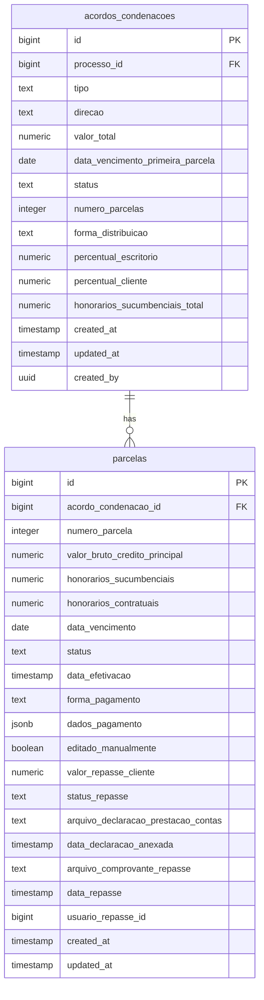
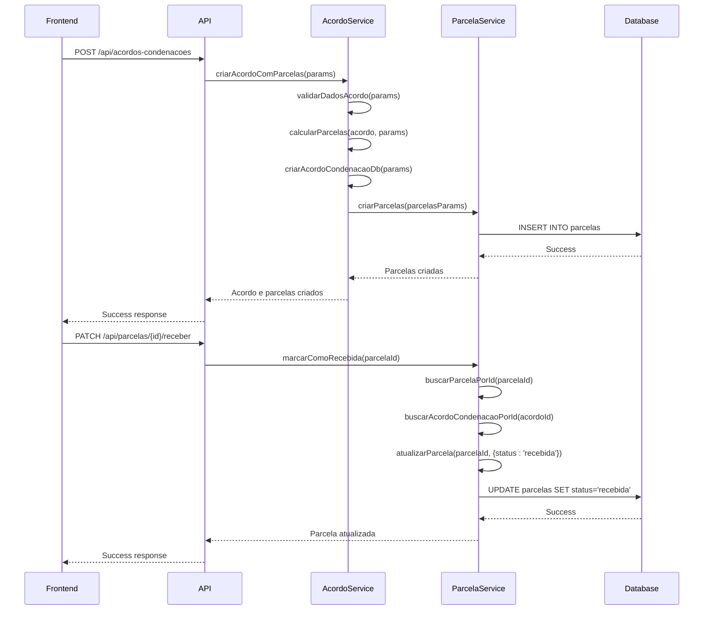
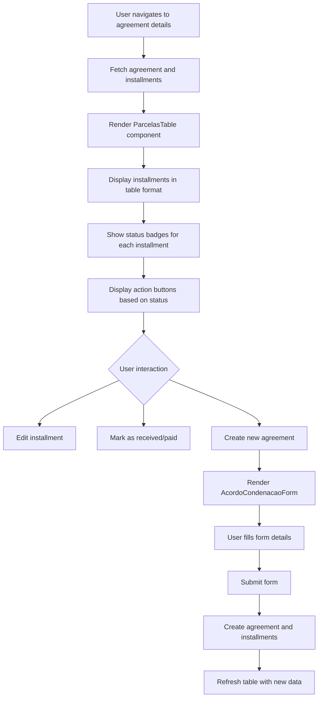

# Agreement-Installment Relationships

<cite>
**Referenced Files in This Document**   
- [acordo-condenacao-persistence.service.ts](file://backend/acordos-condenacoes/services/persistence/acordo-condenacao-persistence.service.ts)
- [parcela-persistence.service.ts](file://backend/acordos-condenacoes/services/persistence/parcela-persistence.service.ts)
- [recalcular-distribuicao.service.ts](file://backend/acordos-condenacoes/services/parcelas/recalcular-distribuicao.service.ts)
- [marcar-como-recebida.service.ts](file://backend/acordos-condenacoes/services/parcelas/marcar-como-recebida.service.ts)
- [criar-acordo-condenacao.service.ts](file://backend/acordos-condenacoes/services/acordos-condenacoes/criar-acordo-condenacao.service.ts)
- [20_acordos_condenacoes.sql](file://supabase/schemas/20_acordos_condenacoes.sql)
- [20250118120001_create_parcelas.sql](file://supabase/migrations/aplicadas/20250118120001_create_parcelas.sql)
- [acordo-condenacao-form.tsx](file://app/(dashboard)/acordos-condenacoes/components/acordo-condenacao-form.tsx)
- [parcelas-table.tsx](file://app/(dashboard)/acordos-condenacoes/components/parcelas-table.tsx)
- [edit-parcela-dialog.tsx](file://app/(dashboard)/acordos-condenacoes/components/edit-parcela-dialog.tsx)
- [route.ts](file://app/api/acordos-condenacoes/route.ts)
</cite>

## Table of Contents
1. [Introduction](#introduction)
2. [Database Schema](#database-schema)
3. [Data Model](#data-model)
4. [Service Layer Implementation](#service-layer-implementation)
5. [Business Logic](#business-logic)
6. [UI Representation](#ui-representation)
7. [Common Operations](#common-operations)
8. [Conclusion](#conclusion)

## Introduction
This document provides comprehensive documentation for the relationship between judgment agreements (acordos_condenacoes) and their installments (parcelas) in the Sinesys system. The system manages financial obligations related to legal cases, including agreements, condemnations, and court costs, with each agreement potentially containing multiple installments. The relationship is implemented with a parent-child structure where each agreement can have multiple installments, and the installments are automatically deleted when their parent agreement is removed due to the ON DELETE CASCADE constraint. This documentation covers the database schema, data model, service layer implementation, business logic for installment creation and status updates, and UI representation of installment data.

**Section sources**
- [20_acordos_condenacoes.sql](file://supabase/schemas/20_acordos_condenacoes.sql)
- [20250118120001_create_parcelas.sql](file://supabase/migrations/aplicadas/20250118120001_create_parcelas.sql)

## Database Schema
The relationship between agreements and installments is implemented through two main tables in the database: `acordos_condenacoes` and `parcelas`. The `acordos_condenacoes` table serves as the parent entity, storing information about agreements, condemnations, and court costs associated with legal cases. Each record in this table can have multiple related records in the `parcelas` table, which represents individual installments. The foreign key constraint from `parcelas` to `acordos_condenacoes` is defined with ON DELETE CASCADE behavior, ensuring that when an agreement is deleted, all its associated installments are automatically removed from the database.

The `acordos_condenacoes` table contains fields such as `id`, `processo_id` (referencing the legal case), `tipo` (type: agreement, condemnation, or court costs), `direcao` (direction: receipt or payment), `valor_total` (total value), `data_vencimento_primeira_parcela` (due date of the first installment), and `numero_parcelas` (number of installments). The `parcelas` table contains fields including `id`, `acordo_condenacao_id` (foreign key to the agreement), `numero_parcela` (installment number), `valor_bruto_credito_principal` (principal credit value), `honorarios_sucumbenciais` (sucumbential fees), `data_vencimento` (due date), and `status` (status: pending, received, paid, or overdue).



**Diagram sources **
- [20_acordos_condenacoes.sql](file://supabase/schemas/20_acordos_condenacoes.sql)
- [20250118120001_create_parcelas.sql](file://supabase/migrations/aplicadas/20250118120001_create_parcelas.sql)

**Section sources**
- [20_acordos_condenacoes.sql](file://supabase/schemas/20_acordos_condenacoes.sql)
- [20250118120001_create_parcelas.sql](file://supabase/migrations/aplicadas/20250118120001_create_parcelas.sql)

## Data Model
The data model for agreements and installments in the Sinesys system is designed to represent financial obligations in legal cases with a hierarchical structure. Each agreement (acordo_condenacao) contains multiple installments (parcelas) with fields for value, due date, status, and payment date. The agreement entity serves as the parent, containing high-level information about the financial obligation, while the installment entities represent the individual payments that make up the total obligation.

An agreement has a `status` field that is calculated based on the status of its installments, with possible values including 'pendente' (pending), 'pago_parcial' (partially paid), 'pago_total' (fully paid), and 'atrasado' (overdue). This status is automatically updated by database triggers when installment statuses change. Each installment has its own `status` field with values 'pendente' (pending), 'recebida' (received), 'paga' (paid), or 'atrasado' (overdue), and a `data_efetivacao` field that records when the installment was marked as received or paid.

The installments are linked to their parent agreement through the `acordo_condenacao_id` foreign key, which has an ON DELETE CASCADE constraint. This ensures data integrity by automatically removing all installments when their parent agreement is deleted. The installments are uniquely identified within an agreement by the combination of `acordo_condenacao_id` and `numero_parcela`, ensuring that each installment number is unique within an agreement.

**Section sources**
- [20_acordos_condenacoes.sql](file://supabase/schemas/20_acordos_condenacoes.sql)
- [20250118120001_create_parcelas.sql](file://supabase/migrations/aplicadas/20250118120001_create_parcelas.sql)

## Service Layer Implementation
The service layer implementation for agreement-installment relationships is divided between two main service files: `acordo-condenacao-persistence.service.ts` and `parcela-persistence.service.ts`. These services provide CRUD operations for agreements and installments, respectively, and are responsible for interacting with the database through the Supabase client.

The `acordo-condenacao-persistence.service.ts` file contains functions for creating, reading, updating, and deleting agreements. Key functions include `criarAcordoCondenacao` for creating new agreements, `listarAcordosCondenacoes` for retrieving agreements with optional filtering, `buscarAcordoCondenacaoPorId` for fetching a specific agreement, `atualizarAcordoCondenacao` for updating agreement details, and `deletarAcordoCondenacao` for removing agreements. When creating an agreement, this service validates input data and ensures that business rules are followed, such as requiring a distribution method for receipts but not for payments.

The `parcela-persistence.service.ts` file provides similar CRUD operations for installments, with functions like `criarParcela` and `criarParcelas` for creating single or multiple installments, `listarParcelasDoAcordo` for retrieving all installments for a specific agreement, `buscarParcelaPorId` for fetching a specific installment, `atualizarParcela` for modifying installment details, and `deletarParcela` for removing installments. The service also includes `deletarParcelasDoAcordo` for bulk deletion of all installments associated with an agreement.

```mermaid
classDiagram
class AcordoCondenacaoPersistenceService {
+criarAcordoCondenacao(dados : AcordoCondenacaoDados) Promise~OperacaoAcordoResult~
+listarAcordosCondenacoes(params : ListarAcordosParams) Promise~AcordosCondenacoesPaginado~
+buscarAcordoCondenacaoPorId(id : number) Promise~OperacaoAcordoResult~
+atualizarAcordoCondenacao(id : number, dados : AcordoCondenacaoAtualizacaoDados) Promise~OperacaoAcordoResult~
+deletarAcordoCondenacao(id : number) Promise~{sucesso : boolean, erro? : string}~
}
class ParcelaPersistenceService {
+criarParcela(dados : ParcelaDados) Promise~OperacaoParcelaResult~
+criarParcelas(parcelas : ParcelaDados[]) Promise~OperacaoParcelasResult~
+listarParcelasDoAcordo(acordoCondenacaoId : number) Promise~Parcela[]~
+buscarParcelaPorId(id : number) Promise~OperacaoParcelaResult~
+atualizarParcela(id : number, dados : ParcelaAtualizacaoDados) Promise~OperacaoParcelaResult~
+deletarParcela(id : number) Promise~{sucesso : boolean, erro? : string}~
+deletarParcelasDoAcordo(acordoCondenacaoId : number) Promise~{sucesso : boolean, erro? : string}~
}
AcordoCondenacaoPersistenceService --> ParcelaPersistenceService : "uses for cascade operations"
```

**Diagram sources **
- [acordo-condenacao-persistence.service.ts](file://backend/acordos-condenacoes/services/persistence/acordo-condenacao-persistence.service.ts)
- [parcela-persistence.service.ts](file://backend/acordos-condenacoes/services/persistence/parcela-persistence.service.ts)

**Section sources**
- [acordo-condenacao-persistence.service.ts](file://backend/acordos-condenacoes/services/persistence/acordo-condenacao-persistence.service.ts)
- [parcela-persistence.service.ts](file://backend/acordos-condenacoes/services/persistence/parcela-persistence.service.ts)

## Business Logic
The business logic for installment creation, recalculation of distribution, and status updates is implemented in several service files that coordinate the creation and management of installments within agreements. The primary service for creating agreements with installments is `criar-acordo-condenacao.service.ts`, which orchestrates the creation of both the agreement record and its associated installments in a coordinated manner.

When a new agreement is created, the `criarAcordoComParcelas` function first validates the input data, then creates the agreement record in the database, and finally calculates and creates the individual installments. The calculation of installments distributes the total value equally among the specified number of installments, with the last installment adjusted to account for any rounding differences. The due dates for installments are calculated based on the first installment's due date and the specified interval between installments.

The `recalcular-distribuicao.service.ts` file contains logic for recalculating the distribution of values among installments when one or more installments are edited manually. This service separates manually edited installments from those that haven't been edited, calculates the remaining balance, and redistributes it equally among the non-edited installments. This ensures that the sum of all installments always matches the total value of the agreement. The service also includes a `resetarDistribuicao` function that resets all manual edits and redistributes values equally across all installments.

For status updates, the `marcar-como-recebida.service.ts` file implements the logic for marking installments as received or paid. When an installment is marked as received (for receipts) or paid (for payments), the service updates the installment's status and records the effective date. For agreements with integral distribution, marking an installment as received automatically sets the disbursement status to 'pending declaration'. The service also includes validation to prevent marking already processed installments and to prevent reverting installments that have already had disbursements made.



**Diagram sources **
- [criar-acordo-condenacao.service.ts](file://backend/acordos-condenacoes/services/acordos-condenacoes/criar-acordo-condenacao.service.ts)
- [recalcular-distribuicao.service.ts](file://backend/acordos-condenacoes/services/parcelas/recalcular-distribuicao.service.ts)
- [marcar-como-recebida.service.ts](file://backend/acordos-condenacoes/services/parcelas/marcar-como-recebida.service.ts)

**Section sources**
- [criar-acordo-condenacao.service.ts](file://backend/acordos-condenacoes/services/acordos-condenacoes/criar-acordo-condenacao.service.ts)
- [recalcular-distribuicao.service.ts](file://backend/acordos-condenacoes/services/parcelas/recalcular-distribuicao.service.ts)
- [marcar-como-recebida.service.ts](file://backend/acordos-condenacoes/services/parcelas/marcar-como-recebida.service.ts)

## UI Representation
The UI representation of installment data in the Sinesys system is primarily handled by the `parcelas-table.tsx` component, which displays a table of installments for a specific agreement. This component provides a comprehensive view of all installments, including their values, due dates, statuses, and actions that can be performed on them. The table is designed to be user-friendly and informative, with visual indicators for different statuses and actions.

The `parcelas-table.tsx` component receives installment data as a prop and renders it in a table format with columns for installment number, principal credit value, contractual fees, sucumbential fees, due date, status, payment method, and actions. The status is displayed using colored badges that visually indicate whether an installment is pending, received, paid, or overdue. For agreements involving receipts, an additional column shows the disbursement status and the amount to be disbursed to the client.

Users can interact with installment data through several mechanisms in the UI. The table includes action buttons that allow users to edit installment details when the installment is pending, and to mark installments as received (for receipts) or paid (for payments). When an installment is edited manually, a visual indicator (asterisk) appears next to the installment number to show that it has been modified from the automatically calculated value.

The creation of new agreements and their installments is handled by the `acordo-condenacao-form.tsx` component, which provides a form interface for entering agreement details. This form includes fields for the agreement type, direction, total value, due date of the first installment, number of installments, payment method, and distribution method. When creating a new agreement, users can specify the interval between installments and the default payment method, which are used to automatically generate the installment schedule.



**Diagram sources **
- [parcelas-table.tsx](file://app/(dashboard)/acordos-condenacoes/components/parcelas-table.tsx)
- [acordo-condenacao-form.tsx](file://app/(dashboard)/acordos-condenacoes/components/acordo-condenacao-form.tsx)
- [edit-parcela-dialog.tsx](file://app/(dashboard)/acordos-condenacoes/components/edit-parcela-dialog.tsx)

**Section sources**
- [parcelas-table.tsx](file://app/(dashboard)/acordos-condenacoes/components/parcelas-table.tsx)
- [acordo-condenacao-form.tsx](file://app/(dashboard)/acordos-condenacoes/components/acordo-condenacao-form.tsx)
- [edit-parcela-dialog.tsx](file://app/(dashboard)/acordos-condenacoes/components/edit-parcela-dialog.tsx)

## Common Operations
This section describes common operations related to agreement-installment relationships in the Sinesys system, including creating installments for a new agreement, updating installment status upon payment, and querying all installments for a specific agreement.

Creating installments for a new agreement is performed through the `criarAcordoComParcelas` service function, which is typically called when a user submits the agreement creation form in the UI. The process begins with the user entering agreement details such as type, direction, total value, number of installments, and due date of the first installment. When the form is submitted, the frontend sends a request to the API endpoint, which invokes the service function. The service first validates the input data, ensuring that required fields are present and that business rules are followed (e.g., payment agreements cannot have a distribution method). After validation, the service creates the agreement record in the database and then calculates the installment amounts by dividing the total value equally among the specified number of installments. The due dates for subsequent installments are calculated by adding the specified interval (default 30 days) to the previous installment's due date. Finally, the service creates all installment records in a single database operation.

Updating installment status upon payment is handled by the `marcarComoRecebida` or `marcarComoPaga` service functions, depending on whether the agreement represents a receipt or payment. When a user marks an installment as received or paid in the UI, a request is sent to the appropriate API endpoint. The service first retrieves the installment and its parent agreement to validate the operation. It checks that the installment is currently pending and has not already been processed. For receipts, the service also verifies the agreement's distribution method to determine the next steps for disbursement. Once validated, the service updates the installment's status to 'recebida' or 'paga' and sets the `data_efetivacao` field to the current timestamp. This change triggers database updates to recalculate the agreement's overall status based on the status of all its installments.

Querying all installments for a specific agreement is accomplished through the `listarParcelasDoAcordo` service function. This function takes the agreement ID as a parameter and returns all installments associated with that agreement, ordered by installment number. The function uses a direct database query with a filter on the `acordo_condenacao_id` field to retrieve the relevant records. The results are returned as an array of installment objects, which can then be displayed in the UI or used for further processing. This operation is commonly used when displaying the details of an agreement or when performing calculations that require access to all installments.

**Section sources**
- [criar-acordo-condenacao.service.ts](file://backend/acordos-condenacoes/services/acordos-condenacoes/criar-acordo-condenacao.service.ts)
- [marcar-como-recebida.service.ts](file://backend/acordos-condenacoes/services/parcelas/marcar-como-recebida.service.ts)
- [parcela-persistence.service.ts](file://backend/acordos-condenacoes/services/persistence/parcela-persistence.service.ts)
- [route.ts](file://app/api/acordos-condenacoes/route.ts)

## Conclusion
The agreement-installment relationship in the Sinesys system is a well-structured and comprehensive implementation for managing financial obligations in legal cases. The system uses a parent-child database schema with proper foreign key constraints and ON DELETE CASCADE behavior to maintain data integrity. The service layer provides robust CRUD operations for both agreements and installments, with additional business logic for creating agreements with automatically generated installments, recalculating distributions when installments are edited, and updating statuses when payments are received.

The data model effectively represents the hierarchical nature of agreements and their installments, with calculated fields and status indicators that provide valuable information to users. The UI components offer an intuitive interface for viewing and managing installment data, with visual cues and actionable buttons that streamline common operations. The system's design allows for both automated processing of standard installment schedules and manual adjustments when necessary, providing flexibility while maintaining data consistency.

Overall, the implementation demonstrates a thoughtful approach to managing complex financial relationships in a legal context, with careful attention to data integrity, user experience, and business requirements. The separation of concerns between database schema, service layer, and UI components creates a maintainable and extensible architecture that can accommodate future enhancements to the agreement-installment functionality.