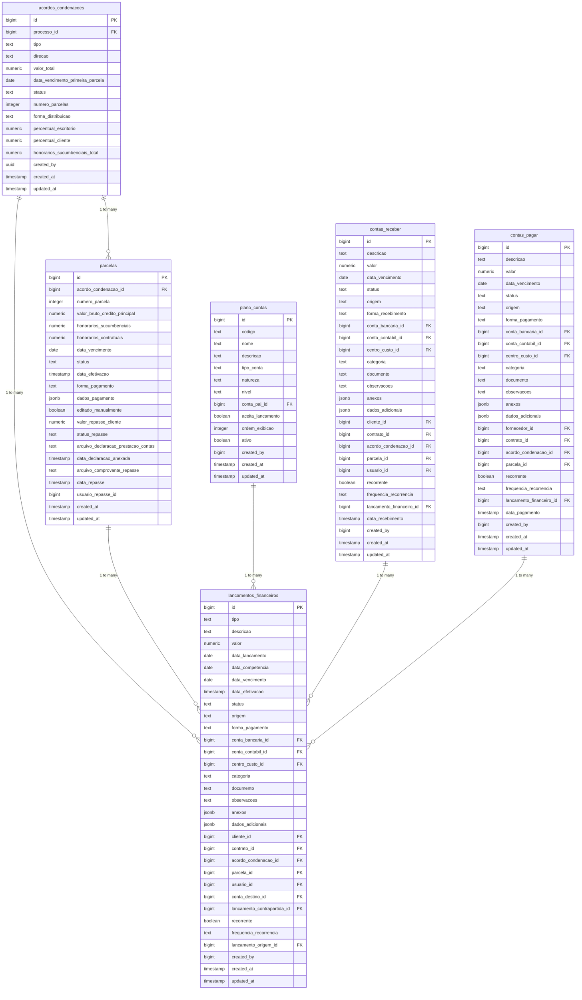
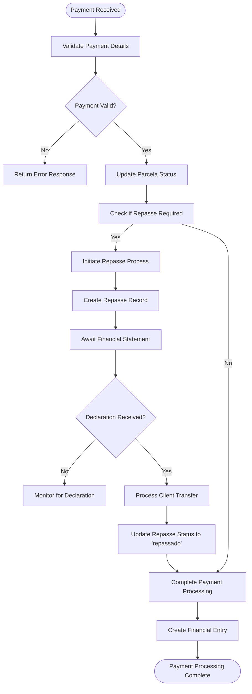
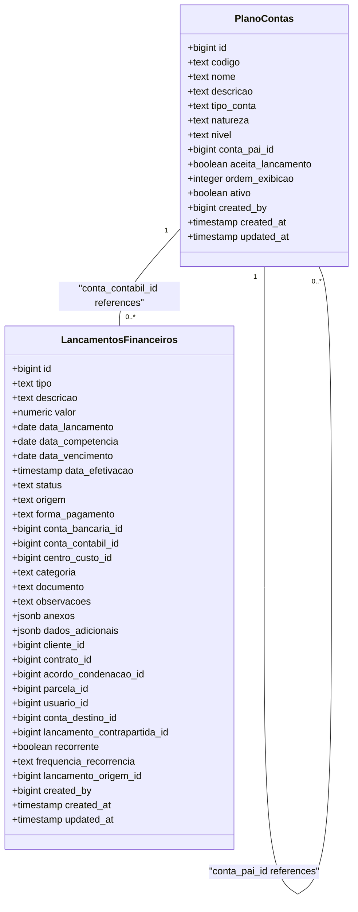
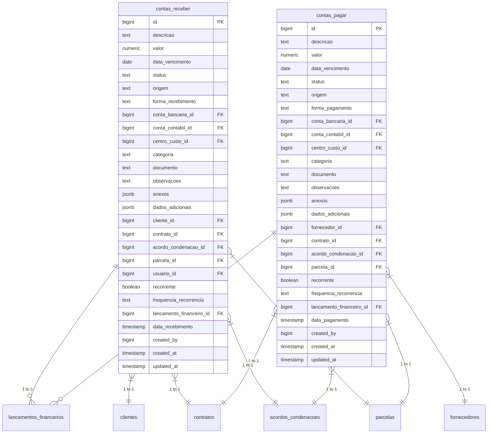
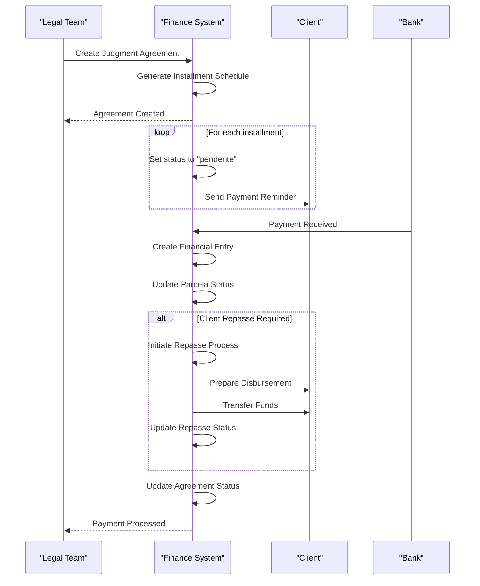

# Financial Relationships

<cite>
**Referenced Files in This Document**   
- [20_acordos_condenacoes.sql](file://supabase/schemas/20_acordos_condenacoes.sql)
- [26_plano_contas.sql](file://supabase/schemas/26_plano_contas.sql)
- [29_lancamentos_financeiros.sql](file://supabase/schemas/29_lancamentos_financeiros.sql)
- [33_financeiro_functions.sql](file://supabase/schemas/33_financeiro_functions.sql)
- [34_financeiro_views.sql](file://supabase/schemas/34_financeiro_views.sql)
- [parcelas-table.tsx](file://app/(dashboard)/acordos-condenacoes/components/parcelas-table.tsx)
- [repasses-pendentes-list.tsx](file://app/(dashboard)/acordos-condenacoes/components/repasses-pendentes-list.tsx)
- [plano-contas-toolbar-filters.tsx](file://app/(dashboard)/financeiro/plano-contas/components/plano-contas-toolbar-filters.tsx)
- [contas-receber-toolbar-filters.tsx](file://app/(dashboard)/financeiro/contas-receber/components/contas-receber-toolbar-filters.tsx)
- [contas-pagar-toolbar-filters.tsx](file://app/(dashboard)/financeiro/contas-pagar/components/contas-pagar-toolbar-filters.tsx)
- [financeiro.ts](file://backend/types/financeiro/plano-contas.types.ts)
- [contas-receber.types.ts](file://backend/types/financeiro/contas-receber.types.ts)
- [contas-pagar.types.ts](file://backend/types/financeiro/contas-pagar.types.ts)
</cite>

## Table of Contents
1. [Introduction](#introduction)
2. [Core Financial Entities](#core-financial-entities)
3. [Judgment Agreements and Installments](#judgment-agreements-and-installments)
4. [Payment Processing and Repasses](#payment-processing-and-repasses)
5. [Chart of Accounts Integration](#chart-of-accounts-integration)
6. [Accounts Receivable and Payable](#accounts-receivable-and-payable)
7. [Financial Workflow](#financial-workflow)
8. [Financial Queries and Examples](#financial-queries-and-examples)
9. [Conclusion](#conclusion)

## Introduction

The Sinesys financial system provides a comprehensive framework for managing legal financial obligations, payments, and accounting relationships. This documentation details the core financial relationships within the system, focusing on the connections between judgment agreements (acordos_condenacoes), their installments (parcelas), payment processing (repasses), and integration with the chart of accounts (plano_contas) system. The system is designed to track financial obligations from agreement creation through installment scheduling to payment processing and accounting categorization.

The financial module integrates with various components of the legal practice management system, including client management, contract tracking, and payroll processing. It supports both receivables (when the firm receives payments) and payables (when the firm makes payments), with special handling for legal-specific scenarios such as honorarium distribution and judicial deposits.

**Section sources**
- [20_acordos_condenacoes.sql](file://supabase/schemas/20_acordos_condenacoes.sql)
- [26_plano_contas.sql](file://supabase/schemas/26_plano_contas.sql)
- [29_lancamentos_financeiros.sql](file://supabase/schemas/29_lancamentos_financeiros.sql)

## Core Financial Entities

The Sinesys financial system revolves around several core entities that form the foundation of financial tracking and reporting. These entities are interconnected through well-defined relationships and foreign key constraints that ensure data integrity and enable comprehensive financial analysis.

The primary financial entities include:
- **acordos_condenacoes**: Represents judgment agreements, condemnations, and court costs linked to legal processes
- **parcelas**: Individual installments of agreements, condenations, or court costs
- **lancamentos_financeiros**: Financial entries that record all monetary movements
- **plano_contas**: The chart of accounts used for financial categorization
- **contas_receber**: Accounts receivable tracking
- **contas_pagar**: Accounts payable tracking

These entities are supported by various auxiliary tables and views that provide additional functionality such as financial reporting, reconciliation, and workflow management.



**Diagram sources**
- [20_acordos_condenacoes.sql](file://supabase/schemas/20_acordos_condenacoes.sql)
- [26_plano_contas.sql](file://supabase/schemas/26_plano_contas.sql)
- [29_lancamentos_financeiros.sql](file://supabase/schemas/29_lancamentos_financeiros.sql)

**Section sources**
- [20_acordos_condenacoes.sql](file://supabase/schemas/20_acordos_condenacoes.sql)
- [26_plano_contas.sql](file://supabase/schemas/26_plano_contas.sql)
- [29_lancamentos_financeiros.sql](file://supabase/schemas/29_lancamentos_financeiros.sql)

## Judgment Agreements and Installments

The relationship between judgment agreements (acordos_condenacoes) and their installments (parcelas) forms the core of the legal financial tracking system in Sinesys. This relationship is implemented through a parent-child database structure with cascading behaviors that ensure data integrity.

### Agreement-Installment Relationship

The `acordos_condenacoes` table serves as the parent entity, representing a judgment agreement, condemnation, or court costs associated with a legal process. Each agreement can have multiple installments, which are stored in the `parcelas` table. The relationship is established through a foreign key constraint:

```sql
acordo_condenacao_id bigint not null references public.acordos_condenacoes(id) on delete cascade
```

This foreign key creates a one-to-many relationship where one agreement can have many installments, but each installment belongs to exactly one agreement. The `on delete cascade` clause ensures that when an agreement is deleted, all of its associated installments are automatically deleted as well, maintaining referential integrity.

### Agreement Entity Structure

The `acordos_condenacoes` table contains the following key fields:
- **processo_id**: References the legal process to which the agreement is linked
- **tipo**: Specifies the type of agreement (acordo, condenacao, or custas_processuais)
- **direcao**: Indicates the financial direction (recebimento for firm income, pagamento for firm expenses)
- **valor_total**: The total value of the agreement
- **data_vencimento_primeira_parcela**: The due date for the first installment
- **status**: The overall status of the agreement (pendente, pago_parcial, pago_total, atrasado)
- **numero_parcelas**: The number of installments
- **forma_distribuicao**: How the value is distributed (integral or dividido)
- **percentual_escritorio**: The firm's percentage of contractual fees
- **percentual_cliente**: The client's percentage (calculated as 100 - percentual_escritorio)
- **honorarios_sucumbenciais_total**: Total value of sucumbential fees (100% to the firm)

### Installment Entity Structure

The `parcelas` table contains detailed information about individual installments:
- **acordo_condenacao_id**: Foreign key linking to the parent agreement
- **numero_parcela**: Sequential number of the installment (1, 2, 3, etc.)
- **valor_bruto_credito_principal**: The gross value of the principal credit
- **honorarios_sucumbenciais**: Value of sucumbential fees for this installment
- **honorarios_contratuais**: Contractual fees calculated via trigger
- **data_vencimento**: Due date for the installment
- **status**: Status of the installment (pendente, recebida, paga, atrasado)
- **forma_pagamento**: Payment method (transferencia_direta, deposito_judicial, deposito_recursal)
- **status_repasse**: Status of client disbursement (nao_aplicavel, pendente_declaracao, pendente_transferencia, repassado)

### Cascading Behaviors and Constraints

The system implements several constraints and cascading behaviors to maintain data integrity:
- **Cascade Delete**: When an agreement is deleted, all associated installments are automatically deleted
- **Unique Constraint**: Ensures that each combination of agreement and installment number is unique (`unique (acordo_condenacao_id, numero_parcela)`)
- **Status Synchronization**: The status of the parent agreement is automatically updated based on the status of its installments
- **Calculated Fields**: The `percentual_cliente` field is automatically calculated as the complement of `percentual_escritorio`

The system also includes Row Level Security (RLS) policies that control access to these financial records, ensuring that only authorized users can view or modify agreement and installment data.

**Section sources**
- [20_acordos_condenacoes.sql](file://supabase/schemas/20_acordos_condenacoes.sql)
- [parcelas-table.tsx](file://app/(dashboard)/acordos-condenacoes/components/parcelas-table.tsx)

## Payment Processing and Repasses

The payment processing system in Sinesys, particularly the handling of repasses (client disbursements), is a critical component of the financial workflow. This system ensures proper tracking of payments received from judicial sources and their subsequent distribution to clients.

### Repasse Lifecycle

The repasse process follows a structured lifecycle that begins with the receipt of funds and ends with the disbursement to the client. This lifecycle is tracked through the `parcelas` table, which includes specific fields for repasse management:

- **valor_repasse_cliente**: The amount to be disbursed to the client
- **status_repasse**: The current status of the disbursement process
- **arquivo_declaracao_prestacao_contas**: Path to the financial statement declaration document
- **data_declaracao_anexada**: Date when the declaration was attached
- **arquivo_comprovante_repasse**: Path to the disbursement proof document
- **data_repasse**: Date when the disbursement was made
- **usuario_repasse_id**: ID of the user who performed the disbursement

The `status_repasse` field can have one of four values:
- **nao_aplicavel**: No disbursement is required (e.g., for firm income)
- **pendente_declaracao**: Awaiting financial statement declaration
- **pendente_transferencia**: Declaration completed, awaiting disbursement
- **repassado**: Disbursement completed

### Repasse Persistence Service

The repasse_persistence service manages the entire disbursement process, ensuring that all necessary documentation is properly recorded and that funds are distributed according to legal and contractual requirements. This service interacts with the `parcelas` table to update the repasse status and record relevant documentation.

When a payment is received against an installment, the system automatically updates the installment status and triggers the repasse workflow if applicable. For agreements where the firm receives funds on behalf of a client, the system calculates the client's share based on the agreement terms and initiates the disbursement process.

### Payment-Installment Linkage

Payments are linked to installments through the financial entry system. When a payment is recorded, it creates a `lancamentos_financeiros` record that references the specific `parcela` through the `parcela_id` foreign key. This linkage enables comprehensive tracking of payment history and outstanding balances.

The system supports multiple payment methods, including direct transfers, judicial deposits, and appellate deposits, each with specific documentation requirements. The `forma_pagamento` field in the `parcelas` table captures this information, while the `dados_pagamento` JSONB field stores additional payment details such as court order numbers or deposit references.



**Diagram sources**
- [20_acordos_condenacoes.sql](file://supabase/schemas/20_acordos_condenacoes.sql)
- [repasses-pendentes-list.tsx](file://app/(dashboard)/acordos-condenacoes/components/repasses-pendentes-list.tsx)

**Section sources**
- [20_acordos_condenacoes.sql](file://supabase/schemas/20_acordos_condenacoes.sql)
- [repasses-pendentes-list.tsx](file://app/(dashboard)/acordos-condenacoes/components/repasses-pendentes-list.tsx)

## Chart of Accounts Integration

The integration between financial transactions and the chart of accounts (plano_contas) system is fundamental to the Sinesys financial architecture. This integration enables proper categorization of all financial activities for accounting, reporting, and analysis purposes.

### Plano Contas Structure

The `plano_contas` table implements a hierarchical chart of accounts with the following key characteristics:

- **Hierarchical Design**: Accounts can have parent-child relationships through the `conta_pai_id` foreign key
- **Account Types**: Supports standard accounting categories (ativo, passivo, receita, despesa, patrimonio_liquido)
- **Nature Classification**: Distinguishes between debit (devedora) and credit (credora) accounts
- **Account Levels**: Differentiates between synthetic (sintetica) and analytical (analitica) accounts
- **Lancamento Control**: Only analytical accounts can receive direct financial entries (`aceita_lancamento = true`)

The hierarchical structure allows for flexible reporting, where synthetic accounts serve as grouping categories for analytical accounts. For example, a synthetic account "Honorários" might group multiple analytical accounts like "Honorários Contratuais" and "Honorários Sucumbenciais."

### Financial Entry Categorization

All financial entries in the `lancamentos_financeiros` table are categorized through the `conta_contabil_id` foreign key, which references the `plano_contas` table. This linkage ensures that every financial transaction is properly classified according to the organization's accounting structure.

The system includes validation mechanisms to ensure data integrity:
- **Trigger Validation**: The `validar_conta_aceita_lancamento` trigger prevents entries from being assigned to synthetic accounts that don't accept direct postings
- **Constraint Enforcement**: Database constraints ensure that only valid account types and natures are used
- **Hierarchical Integrity**: The `validar_hierarquia_plano_contas` function prevents circular references in the account hierarchy

### Integration with Financial Transactions

The integration between financial transactions and the chart of accounts occurs at multiple levels:

1. **Direct Assignment**: Each financial entry is directly assigned to a specific analytical account
2. **Automatic Categorization**: Certain transaction types (e.g., agreement payments) may have default account assignments
3. **Reporting Aggregation**: Reports aggregate data across the account hierarchy, allowing for both detailed and summarized views

The system also supports additional categorization through:
- **Centers of Cost (centros_custo)**: For departmental or project-based tracking
- **Categories (categoria)**: Additional classification for reporting purposes
- **Flexible Data (dados_adicionais)**: JSONB field for storing transaction-specific metadata



**Diagram sources**
- [26_plano_contas.sql](file://supabase/schemas/26_plano_contas.sql)
- [29_lancamentos_financeiros.sql](file://supabase/schemas/29_lancamentos_financeiros.sql)
- [plano-contas-toolbar-filters.tsx](file://app/(dashboard)/financeiro/plano-contas/components/plano-contas-toolbar-filters.tsx)

**Section sources**
- [26_plano_contas.sql](file://supabase/schemas/26_plano_contas.sql)
- [29_lancamentos_financeiros.sql](file://supabase/schemas/29_lancamentos_financeiros.sql)
- [plano-contas-toolbar-filters.tsx](file://app/(dashboard)/financeiro/plano-contas/components/plano-contas-toolbar-filters.tsx)

## Accounts Receivable and Payable

The Sinesys system implements comprehensive accounts receivable (contas_receber) and accounts payable (contas_pagar) functionality to manage the firm's financial obligations and receivables. These components provide specialized interfaces for tracking outstanding payments and receipts.

### Accounts Receivable (Contas a Receber)

The accounts receivable system tracks amounts owed to the firm from various sources, including:
- Client payments for legal services
- Judicial awards and settlements
- Insurance claims
- Other receivables

The system is designed to handle both one-time and recurring receivables, with features for:
- Due date tracking and reminders
- Payment status management
- Integration with client and contract records
- Documentation attachment (invoices, agreements, etc.)
- Reporting on outstanding balances and aging

### Accounts Payable (Contas a Pagar)

The accounts payable system manages the firm's financial obligations, including:
- Vendor and supplier payments
- Court costs and fees
- Employee salaries and benefits
- Office expenses
- Tax payments

Key features of the accounts payable system include:
- Due date tracking and payment scheduling
- Approval workflows for payments
- Integration with vendor and contract records
- Documentation attachment (invoices, receipts, etc.)
- Reporting on upcoming payments and cash flow

### Integration with Core Financial Entities

Both accounts receivable and payable systems are tightly integrated with the core financial entities:

- **Link to Financial Entries**: Each receivable or payable record is linked to a corresponding `lancamentos_financeiros` entry through the `lancamento_financeiro_id` field
- **Connection to Agreements**: Receivables can be linked to specific `acordos_condenacoes` and their `parcelas`
- **Client and Vendor Tracking**: Receivables are associated with `clientes` while payables are associated with vendors or suppliers
- **Contract Integration**: Both systems can be linked to specific `contratos` for better financial tracking

The system also supports recurring payments and receipts through the `recorrente` flag and `frequencia_recorrencia` field, which can be set to monthly, quarterly, semi-annual, or annual frequencies.



**Diagram sources**
- [29_lancamentos_financeiros.sql](file://supabase/schemas/29_lancamentos_financeiros.sql)
- [contas-receber-toolbar-filters.tsx](file://app/(dashboard)/financeiro/contas-receber/components/contas-receber-toolbar-filters.tsx)
- [contas-pagar-toolbar-filters.tsx](file://app/(dashboard)/financeiro/contas-pagar/components/contas-pagar-toolbar-filters.tsx)

**Section sources**
- [29_lancamentos_financeiros.sql](file://supabase/schemas/29_lancamentos_financeiros.sql)
- [contas-receber-toolbar-filters.tsx](file://app/(dashboard)/financeiro/contas-receber/components/contas-receber-toolbar-filters.tsx)
- [contas-pagar-toolbar-filters.tsx](file://app/(dashboard)/financeiro/contas-pagar/components/contas-pagar-toolbar-filters.tsx)

## Financial Workflow

The financial workflow in Sinesys follows a structured process from agreement creation to payment processing and accounting. This workflow ensures that all financial activities are properly documented, tracked, and reported.

### Agreement Creation

The financial workflow begins with the creation of a judgment agreement (acordo_condenacao):
1. A legal process is identified as having a financial component
2. An agreement record is created with details including total value, payment direction, and number of installments
3. The system automatically calculates the firm's and client's percentages of fees
4. The agreement is linked to the relevant legal process

### Installment Scheduling

Once an agreement is created, the system generates the installment schedule:
1. Based on the number of installments and first due date, the system calculates due dates for all installments
2. Individual `parcela` records are created for each installment
3. The system allocates the total value across installments according to the distribution method
4. Each installment is assigned a status of "pendente" (pending)

### Payment Processing

When payments are received against installments:
1. The payment is recorded in the system, creating a financial entry
2. The corresponding `parcela` status is updated to "recebida" or "paga"
3. If the payment is for a client's share, the repasse process is initiated
4. The parent agreement status is updated based on the payment status of its installments

### Accounting Integration

Throughout the workflow, financial entries are created and categorized:
1. Each payment or receipt generates a `lancamentos_financeiros` record
2. The entry is assigned to the appropriate account in the `plano_contas`
3. The entry is linked to the relevant agreement, installment, client, and contract
4. The entry status is updated as the transaction progresses from pending to confirmed

### Reporting and Reconciliation

The system provides various reports and reconciliation tools:
- **Pending Payments Report**: Shows all outstanding installments
- **Repasse Tracking**: Monitors the status of client disbursements
- **Cash Flow Analysis**: Projects future income and expenses
- **Account Reconciliation**: Matches system records with bank statements



**Diagram sources**
- [20_acordos_condenacoes.sql](file://supabase/schemas/20_acordos_condenacoes.sql)
- [29_lancamentos_financeiros.sql](file://supabase/schemas/29_lancamentos_financeiros.sql)
- [33_financeiro_functions.sql](file://supabase/schemas/33_financeiro_functions.sql)

**Section sources**
- [20_acordos_condenacoes.sql](file://supabase/schemas/20_acordos_condenacoes.sql)
- [29_lancamentos_financeiros.sql](file://supabase/schemas/29_lancamentos_financeiros.sql)
- [33_financeiro_functions.sql](file://supabase/schemas/33_financeiro_functions.sql)

## Financial Queries and Examples

The Sinesys financial system supports various queries for analyzing financial data and generating reports. These queries leverage the relationships between financial entities to provide meaningful insights.

### Calculating Total Value of Pending Installments

To calculate the total value of pending installments for a specific agreement, the following SQL query can be used:

```sql
SELECT SUM(p.valor_bruto_credito_principal) as total_pending_value
FROM parcelas p
WHERE p.acordo_condenacao_id = :agreement_id
  AND p.status = 'pendente';
```

This query sums the principal credit value of all installments that belong to a specific agreement and have a "pending" status. The result represents the total amount still owed on that agreement.

### Identifying Payments for a Specific Installment

To identify all payments made against a particular installment, use:

```sql
SELECT lf.*
FROM lancamentos_financeiros lf
WHERE lf.parcela_id = :installment_id
  AND lf.tipo IN ('receita', 'despesa')
  AND lf.status = 'confirmado';
```

This query retrieves all confirmed financial entries linked to a specific installment, showing the complete payment history for that installment.

### Finding Repasses by Status

To find all repasses in a specific status, such as those pending declaration:

```sql
SELECT p.*, ac.tipo, ac.direcao
FROM parcelas p
JOIN acordos_condenacoes ac ON p.acordo_condenacao_id = ac.id
WHERE p.status_repasse = 'pendente_declaracao'
  AND ac.direcao = 'recebimento';
```

This query identifies all installments where funds have been received but the financial statement declaration is still pending, specifically for agreements where the firm is receiving funds.

### Generating Aging Report

For an aging report of accounts receivable:

```sql
SELECT 
  CASE 
    WHEN data_vencimento < CURRENT_DATE THEN 'Overdue'
    WHEN data_vencimento = CURRENT_DATE THEN 'Due Today'
    WHEN data_vencimento <= CURRENT_DATE + 7 THEN 'Due in 7 Days'
    WHEN data_vencimento <= CURRENT_DATE + 30 THEN 'Due in 30 Days'
    ELSE 'Future'
  END as due_status,
  COUNT(*) as count,
  SUM(valor) as total_value
FROM contas_receber
WHERE status = 'pendente'
GROUP BY due_status
ORDER BY MIN(data_vencimento);
```

This query categorizes pending receivables by their due date status, providing a clear view of upcoming and overdue payments.

### Analyzing Financial Performance

To analyze financial performance by account category:

```sql
SELECT 
  pc.nome as account_name,
  SUM(CASE WHEN lf.tipo = 'receita' THEN lf.valor ELSE 0 END) as total_revenue,
  SUM(CASE WHEN lf.tipo = 'despesa' THEN lf.valor ELSE 0 END) as total_expenses,
  SUM(CASE WHEN lf.tipo = 'receita' THEN lf.valor ELSE -lf.valor END) as net_result
FROM lancamentos_financeiros lf
JOIN plano_contas pc ON lf.conta_contabil_id = pc.id
WHERE lf.data_competencia BETWEEN :start_date AND :end_date
  AND lf.status = 'confirmado'
GROUP BY pc.id, pc.nome
ORDER BY net_result DESC;
```

This comprehensive query analyzes financial performance by account, showing revenue, expenses, and net results for a specified period.

**Section sources**
- [20_acordos_condenacoes.sql](file://supabase/schemas/20_acordos_condenacoes.sql)
- [29_lancamentos_financeiros.sql](file://supabase/schemas/29_lancamentos_financeiros.sql)
- [34_financeiro_views.sql](file://supabase/schemas/34_financeiro_views.sql)

## Conclusion

The Sinesys financial system provides a comprehensive framework for managing legal financial relationships, from judgment agreements and installments to payment processing and accounting integration. The system's architecture is built on well-defined relationships between core entities, ensuring data integrity and enabling sophisticated financial analysis.

Key strengths of the financial system include:
- **Robust Agreement-Installment Relationship**: The parent-child structure with cascading deletes ensures data consistency
- **Comprehensive Repasse Management**: Detailed tracking of client disbursements with status monitoring
- **Flexible Chart of Accounts**: Hierarchical account structure supporting both detailed and aggregated reporting
- **Integrated Receivables and Payables**: Specialized systems for managing the firm's financial obligations
- **Structured Financial Workflow**: Clear process from agreement creation to payment processing
- **Powerful Query Capabilities**: Support for complex financial analysis and reporting

The system's design reflects best practices in financial software development, with attention to data integrity, security, and usability. The integration between legal and financial data enables law firms to maintain accurate financial records while providing excellent client service.

Future enhancements could include advanced forecasting capabilities, integration with external accounting systems, and enhanced mobile access for field staff. However, the current system provides a solid foundation for effective financial management in a legal practice environment.