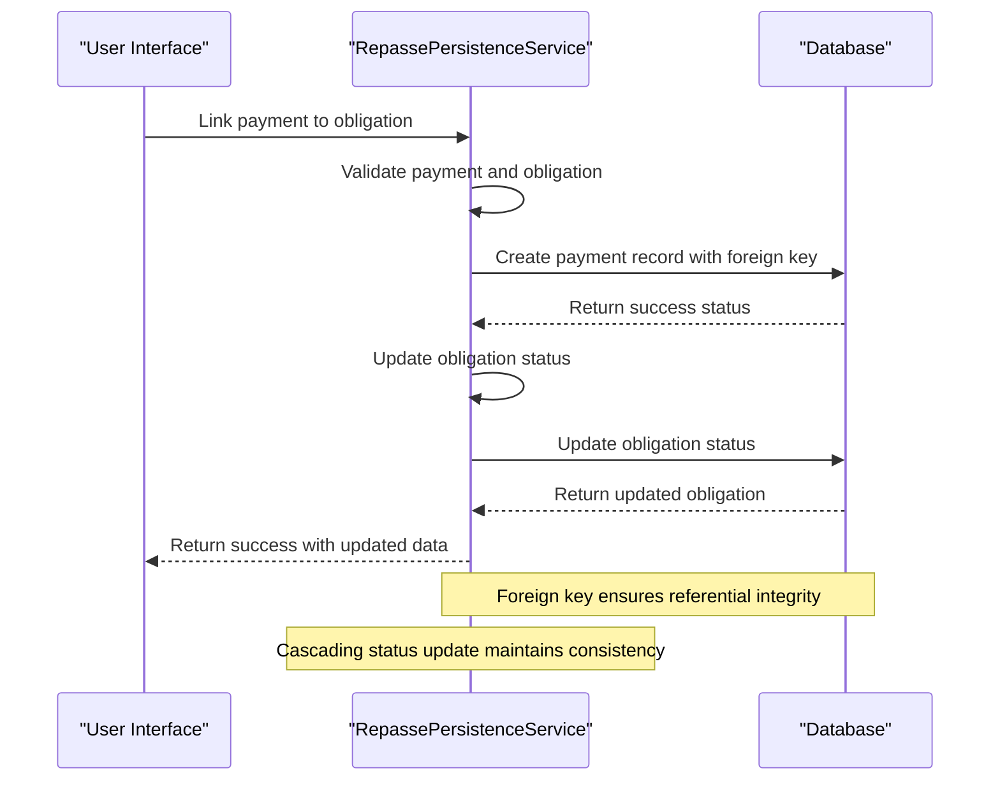
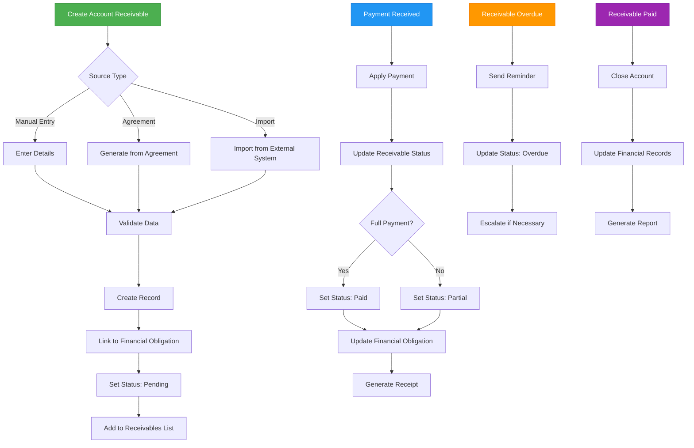
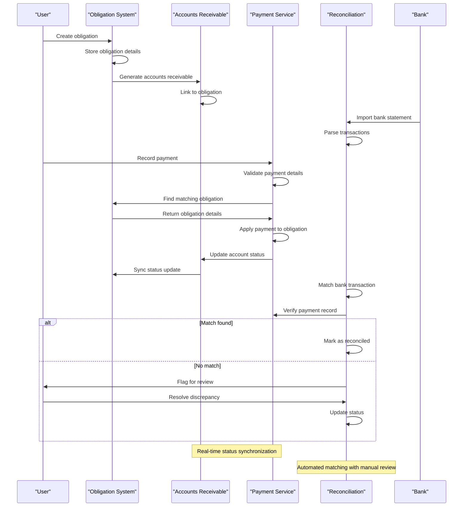
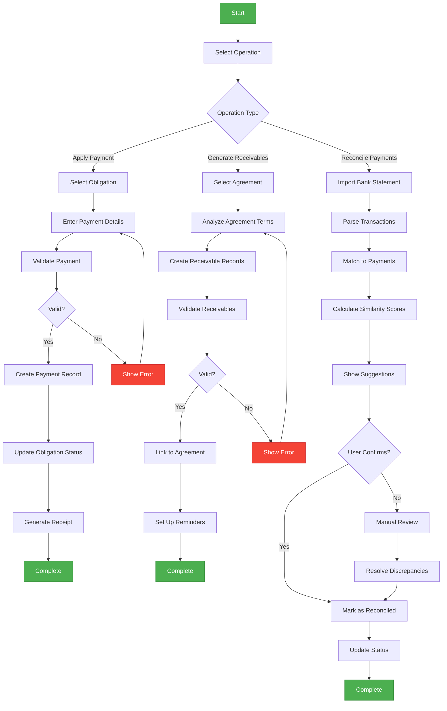

# Payment-Obligation Relationships

<cite>
**Referenced Files in This Document**   
- [parcela-persistence.service.ts](file://backend/acordos-condenacoes/services/persistence/parcela-persistence.service.ts)
- [repasse-persistence.service.ts](file://backend/acordos-condenacoes/services/persistence/repasse-persistence.service.ts)
- [contas-receber-persistence.service.ts](file://backend/financeiro/contas-receber/services/persistence/contas-receber-persistence.service.ts)
- [obrigacoes-persistence.service.ts](file://backend/financeiro/obrigacoes/services/persistence/obrigacoes-persistence.service.ts)
- [obrigacoes-integracao.service.ts](file://backend/financeiro/obrigacoes/services/integracao/obrigacoes-integracao.service.ts)
- [listar-obrigacoes.service.ts](file://backend/financeiro/obrigacoes/services/obrigacoes/listar-obrigacoes.service.ts)
- [obrigacoes.types.ts](file://backend/types/financeiro/obrigacoes.types.ts)
- [use-obrigacoes.ts](file://app/_lib/hooks/use-obrigacoes.ts)
- [use-contas-receber.ts](file://app/_lib/hooks/use-contas-receber.ts)
- [plano_contas.sql](file://supabase/schemas/26_plano_contas.sql)
- [35_financeiro_integracao.sql](file://supabase/schemas/35_financeiro_integracao.sql)
- [36_financeiro_seed.sql](file://supabase/schemas/36_financeiro_seed.sql)
</cite>

## Table of Contents
1. [Introduction](#introduction)
2. [Core Entities and Data Model](#core-entities-and-data-model)
3. [Payment-Obligation Linkage Mechanism](#payment-obligation-linkage-mechanism)
4. [Chart of Accounts Integration](#chart-of-accounts-integration)
5. [Accounts Receivable System](#accounts-receivable-system)
6. [Data Flow and Processing](#data-flow-and-processing)
7. [Service Layer Implementation](#service-layer-implementation)
8. [Financial Operations Examples](#financial-operations-examples)
9. [Conclusion](#conclusion)

## Introduction
This document provides comprehensive documentation for the relationship between payments (repasses) and financial obligations in the Sinesys system. It details how the repasse_persistence service links payments to specific installment obligations through foreign key relationships, explains the connection between financial obligations and the plano_contas (chart of accounts) system, and describes how transactions are categorized using account codes. The document covers the relationship between contas_receber (accounts receivable) and core financial entities, including how obligations are created and tracked. It also describes the data flow from obligation creation to payment processing and reconciliation, including the service layer implementation that handles payment application to obligations and the cascading effects on obligation status.

**Section sources**
- [obrigacoes.types.ts](file://backend/types/financeiro/obrigacoes.types.ts#L1-L50)
- [parcela-persistence.service.ts](file://backend/acordos-condenacoes/services/persistence/parcela-persistence.service.ts#L1-L50)

## Core Entities and Data Model
The Sinesys financial system is built around several core entities that form the foundation of payment and obligation management. The primary entities include financial obligations, payments (repasses), accounts receivable, and the chart of accounts (plano_contas). These entities are interconnected through well-defined relationships that ensure data consistency and integrity.

Financial obligations represent outstanding amounts that need to be collected or paid, typically arising from legal agreements, contracts, or judicial decisions. These obligations are tracked through the obligations system, which provides a consolidated view of all financial commitments. Payments (repasses) are the actual monetary transfers that satisfy these obligations, creating a direct link between the obligation and its fulfillment.

The chart of accounts (plano_contas) serves as the accounting framework that categorizes all financial transactions. It provides a hierarchical structure for organizing accounts, with each account having a unique code that determines its classification. This system enables detailed financial reporting and ensures that all transactions are properly categorized according to accounting standards.

Accounts receivable (contas_receber) represent the amounts owed to the organization by clients or other parties. These are specific instances of financial obligations that are tracked individually, with detailed information about due dates, amounts, and payment status. The system maintains a clear distinction between different types of receivables, allowing for targeted management and reporting.

```mermaid
erDiagram
OBRIGACOES {
string id PK
string tipoEntidade
number entidadeId
string tipo
string status
string origem
string statusSincronizacao
string descricao
number valor
date dataVencimento
date dataEfetivacao
date dataLancamento
date dataCompetencia
number diasAteVencimento
number percentualHonorarios
number clienteId FK
number processoId FK
number acordoId FK
number parcelaId FK
number lancamentoId FK
number contaContabilId FK
number centroCustoId FK
number contaBancariaId FK
timestamp createdAt
timestamp updatedAt
number createdBy
}
CONTAS_RECEBER {
number id PK
string descricao
number valor
date dataLancamento
date dataCompetencia
date dataVencimento
date dataEfetivacao
string status
string origem
string formaRecebimento
number contaBancariaId FK
number contaContabilId FK
number centroCustoId FK
string categoria
string documento
string observacoes
jsonb anexos
jsonb dadosAdicionais
number clienteId FK
number contratoId FK
number acordoCondenacaoId FK
number parcelaId FK
number usuarioId FK
boolean recorrente
string frequenciaRecorrencia
number lancamentoOrigemId FK
number createdBy
timestamp createdAt
timestamp updatedAt
}
PLANO_CONTAS {
number id PK
string codigo
string nome
string descricao
string tipo_conta
string natureza
string nivel
number conta_pai_id FK
boolean aceita_lancamento
number ordem_exibicao
boolean ativo
number created_by
timestamp created_at
timestamp updated_at
}
PARCELAS {
number id PK
number acordo_condenacao_id FK
number numero_parcela
number valor_bruto_credito_principal
number honorarios_contratuais
number honorarios_sucumbenciais
date data_vencimento
date data_efetivacao
string status
string forma_pagamento
string status_repasse
timestamp created_at
timestamp updated_at
string created_by
}
LANCAMENTOS_FINANCEIROS {
number id PK
string tipo
string descricao
number valor
date data_lancamento
date data_competencia
date data_vencimento
date data_efetivacao
string status
string origem
string forma_pagamento
number conta_bancaria_id FK
number conta_contabil_id FK
number centro_custo_id FK
string categoria
string documento
string observacoes
jsonb anexos
jsonb dados_adicionais
number cliente_id FK
number contrato_id FK
number acordo_condenacao_id FK
number parcela_id FK
number usuario_id FK
boolean recorrente
string frequencia_recorrencia
number lancamento_origem_id FK
number created_by
timestamp created_at
timestamp updated_at
}
OBRIGACOES ||--o{ LANCAMENTOS_FINANCEIROS : "has"
OBRIGACOES ||--o{ PARCELAS : "has"
CONTAS_RECEBER ||--o{ LANCAMENTOS_FINANCEIROS : "maps to"
PLANO_CONTAS ||--o{ CONTAS_RECEBER : "categorizes"
PLANO_CONTAS ||--o{ LANCAMENTOS_FINANCEIROS : "categorizes"
PARCELAS }|--|| CONTAS_RECEBER : "linked via"
```



**Diagram sources **
- [obrigacoes.types.ts](file://backend/types/financeiro/obrigacoes.types.ts#L150-L300)
- [contas-receber-persistence.service.ts](file://backend/financeiro/contas-receber/services/persistence/contas-receber-persistence.service.ts#L48-L80)
- [plano_contas.sql](file://supabase/schemas/26_plano_contas.sql#L1-L70)
- [parcela-persistence.service.ts](file://backend/acordos-condenacoes/services/persistence/parcela-persistence.service.ts#L24-L47)

**Section sources**
- [obrigacoes.types.ts](file://backend/types/financeiro/obrigacoes.types.ts#L150-L300)
- [contas-receber-persistence.service.ts](file://backend/financeiro/contas-receber/services/persistence/contas-receber-persistence.service.ts#L48-L80)
- [plano_contas.sql](file://supabase/schemas/26_plano_contas.sql#L1-L70)

## Payment-Obligation Linkage Mechanism
The Sinesys system implements a robust mechanism for linking payments to financial obligations through foreign key relationships. This linkage is primarily managed through the repasse_persistence service, which establishes connections between payment records and their corresponding installment obligations. The system ensures that each payment is properly associated with a specific obligation, enabling accurate tracking of financial commitments and their fulfillment.

The core of this mechanism lies in the foreign key relationship between the payment records and the installment obligations. When a payment is processed, the system creates a record that references the specific installment obligation through its unique identifier. This relationship is enforced at the database level, ensuring data integrity and preventing orphaned records. The foreign key constraint guarantees that a payment cannot be linked to a non-existent obligation, maintaining the consistency of the financial data.

The repasse_persistence service handles the creation and management of these relationships, providing methods for linking payments to obligations, updating the linkage when necessary, and retrieving the connected records for reporting and analysis. This service acts as an intermediary layer between the user interface and the database, ensuring that all operations on the payment-obligation relationships follow the defined business rules and validation procedures.

The system also implements cascading effects when payments are applied to obligations. When a payment is successfully linked to an obligation, the status of the obligation is automatically updated to reflect its new state. For example, if an obligation was previously marked as "pending" and a full payment is applied, the obligation status is updated to "fulfilled". This automatic status update ensures that the financial records remain current and accurate without requiring manual intervention.



**Diagram sources **
- [repasse-persistence.service.ts](file://backend/acordos-condenacoes/services/persistence/repasse-persistence.service.ts#L1-L50)
- [obrigacoes-persistence.service.ts](file://backend/financeiro/obrigacoes/services/persistence/obrigacoes-persistence.service.ts#L152-L292)

**Section sources**
- [repasse-persistence.service.ts](file://backend/acordos-condenacoes/services/persistence/repasse-persistence.service.ts#L1-L50)
- [obrigacoes-persistence.service.ts](file://backend/financeiro/obrigacoes/services/persistence/obrigacoes-persistence.service.ts#L152-L292)

## Chart of Accounts Integration
The integration between financial obligations and the plano_contas (chart of accounts) system is a critical component of the Sinesys financial architecture. This integration enables the categorization of transactions using standardized account codes, ensuring consistent financial reporting and compliance with accounting principles. The chart of accounts serves as the foundation for organizing all financial activities within the system.

The plano_contas table defines a hierarchical structure of accounts, where each account is identified by a unique code and has specific attributes that determine its behavior and classification. The key attributes include the account code, name, description, account type (asset, liability, revenue, expense, or equity), nature (debit or credit), level (synthetic or analytical), and whether it accepts financial entries. This structure allows for both broad categorization at higher levels and detailed tracking at lower levels.

When a financial obligation is created or a payment is processed, the system assigns it to a specific account in the chart of accounts. This assignment is typically done through the conta_contabil_id field, which serves as a foreign key linking the transaction to the appropriate account. The system enforces business rules to ensure that only analytical accounts (those that accept financial entries) are used for transaction recording, while synthetic accounts are reserved for aggregation and reporting purposes.

The integration also includes validation rules to maintain data quality. For example, when creating a new account receivable, the system verifies that the selected account exists, is active, and is of the analytical type. If these conditions are not met, the system prevents the transaction from being recorded and provides appropriate error messages to guide the user. This validation ensures that all financial entries are properly categorized and that the integrity of the accounting system is maintained.

```mermaid
classDiagram
class PlanoContas {
+number id
+string codigo
+string nome
+string descricao
+string tipo_conta
+string natureza
+string nivel
+number conta_pai_id
+boolean aceita_lancamento
+number ordem_exibicao
+boolean ativo
+number created_by
+timestamp created_at
+timestamp updated_at
+validateAccount() : boolean
+isAnalytical() : boolean
+isActive() : boolean
}
class ContaReceber {
+number id
+string descricao
+number valor
+date dataLancamento
+date dataCompetencia
+date dataVencimento
+date dataEfetivacao
+string status
+string origem
+string formaRecebimento
+number contaBancariaId
+number contaContabilId
+number centroCustoId
+string categoria
+string documento
+string observacoes
+jsonb anexos
+jsonb dadosAdicionais
+number clienteId
+number contratoId
+number acordoCondenacaoId
+number parcelaId
+number usuarioId
+boolean recorrente
+string frequenciaRecorrencia
+number lancamentoOrigemId
+number createdBy
+timestamp createdAt
+timestamp updatedAt
+validate() : boolean
+assignToAccount(accountId) : boolean
}
class Obrigacao {
+string id
+string tipoEntidade
+number entidadeId
+string tipo
+string status
+string origem
+string statusSincronizacao
+string descricao
+number valor
+date dataVencimento
+date dataEfetivacao
+date dataLancamento
+date dataCompetencia
+number diasAteVencimento
+number percentualHonorarios
+number clienteId
+number processoId
+number acordoId
+number parcelaId
+number lancamentoId
+number contaContabilId
+number centroCustoId
+number contaBancariaId
+timestamp createdAt
+timestamp updatedAt
+number createdBy
+categorize() : boolean
}
PlanoContas <-- ContaReceber : "uses"
PlanoContas <-- Obrigacao : "uses"
ContaReceber <-- Obrigacao : "extends"
note right of PlanoContas
Account hierarchy with
synthetic (aggregation) and
analytical (transaction) levels
end note
note right of ContaReceber
Specific implementation of
financial obligation with
detailed payment information
end note
note right of Obrigacao
Abstract representation of
financial commitments with
categorization capabilities
end note
```

**Diagram sources **
- [plano_contas.sql](file://supabase/schemas/26_plano_contas.sql#L53-L67)
- [36_financeiro_seed.sql](file://supabase/schemas/36_financeiro_seed.sql#L25-L43)
- [contas-receber-persistence.service.ts](file://backend/financeiro/contas-receber/services/persistence/contas-receber-persistence.service.ts#L654-L683)

**Section sources**
- [plano_contas.sql](file://supabase/schemas/26_plano_contas.sql#L53-L67)
- [36_financeiro_seed.sql](file://supabase/schemas/36_financeiro_seed.sql#L25-L43)
- [contas-receber-persistence.service.ts](file://backend/financeiro/contas-receber/services/persistence/contas-receber-persistence.service.ts#L654-L683)

## Accounts Receivable System
The contas_receber (accounts receivable) system in Sinesys is designed to manage and track all amounts owed to the organization by clients and other parties. This system serves as a critical component of the financial management framework, providing comprehensive functionality for creating, tracking, and reconciling receivables. The accounts receivable module is tightly integrated with other financial components, ensuring a cohesive and consistent financial management experience.

The system allows for the creation of accounts receivable through multiple channels, including manual entry, automatic generation from agreements, and import from external systems. Each account receivable record contains detailed information about the obligation, including the amount, due date, client information, and payment status. The system supports both one-time and recurring receivables, enabling flexible billing arrangements that accommodate various business models.

A key feature of the accounts receivable system is its integration with the obligation management framework. When an account receivable is created, it is automatically linked to a financial obligation, creating a unified view of all outstanding amounts. This integration enables consolidated reporting and analysis, allowing users to view all obligations regardless of their source. The system maintains synchronization between the account receivable and its corresponding obligation, ensuring that updates to one are reflected in the other.

The user interface for managing accounts receivable provides a comprehensive dashboard with filtering, sorting, and search capabilities. Users can view receivables by status (pending, overdue, paid), client, date range, and other criteria. The system also includes alerting functionality to notify users of upcoming due dates and overdue accounts, helping to ensure timely collection and minimize bad debt.



**Diagram sources **
- [use-contas-receber.ts](file://app/_lib/hooks/use-contas-receber.ts#L1-L55)
- [contas-receber-persistence.service.ts](file://backend/financeiro/contas-receber/services/persistence/contas-receber-persistence.service.ts#L238-L389)
- [page.tsx](file://app/(dashboard)/financeiro/contas-receber/page.tsx#L353-L397)

**Section sources**
- [use-contas-receber.ts](file://app/_lib/hooks/use-contas-receber.ts#L1-L55)
- [contas-receber-persistence.service.ts](file://backend/financeiro/contas-receber/services/persistence/contas-receber-persistence.service.ts#L238-L389)
- [page.tsx](file://app/(dashboard)/financeiro/contas-receber/page.tsx#L353-L397)

## Data Flow and Processing
The data flow from obligation creation to payment processing and reconciliation in the Sinesys system follows a well-defined sequence of operations that ensures data consistency and integrity throughout the financial lifecycle. This process begins with the creation of a financial obligation and concludes with the reconciliation of payments, with each step carefully orchestrated to maintain accurate financial records.

The process starts with the creation of a financial obligation, typically through the agreement or contract management system. When an obligation is created, it is recorded in the obligations system with all relevant details such as amount, due date, client information, and payment terms. This initial record serves as the foundation for all subsequent financial operations related to the obligation.

Once the obligation is established, the system generates corresponding accounts receivable records if applicable. This generation can occur automatically based on predefined rules or manually through user intervention. The accounts receivable records are linked to the original obligation through foreign key relationships, creating a traceable connection between the obligation and its financial representation.

When a payment is received, the system processes it through the payment application workflow. This workflow begins with the validation of payment details, including amount, date, and method. The system then identifies the corresponding obligation or obligations to which the payment should be applied, using matching algorithms that consider factors such as client, amount, and due date.

After the payment is applied, the system updates the status of the affected obligations and accounts receivable. This update includes changing the status from "pending" to "paid" or "partially paid," recording the payment date, and updating any related financial metrics. The system also generates audit trails and notifications to document the payment application and inform relevant stakeholders.

The final step in the process is reconciliation, where the system verifies that the recorded payments match the actual bank transactions. This reconciliation can be performed automatically using bank statement imports or manually through user verification. The system identifies any discrepancies and provides tools for resolving them, ensuring that the financial records accurately reflect the organization's actual financial position.



**Diagram sources **
- [obrigacoes-persistence.service.ts](file://backend/financeiro/obrigacoes/services/persistence/obrigacoes-persistence.service.ts#L709-L805)
- [obrigacoes-integracao.service.ts](file://backend/financeiro/obrigacoes/services/integracao/obrigacoes-integracao.service.ts#L156-L350)
- [35_financeiro_integracao.sql](file://supabase/schemas/35_financeiro_integracao.sql#L15-L145)

**Section sources**
- [obrigacoes-persistence.service.ts](file://backend/financeiro/obrigacoes/services/persistence/obrigacoes-persistence.service.ts#L709-L805)
- [obrigacoes-integracao.service.ts](file://backend/financeiro/obrigacoes/services/integracao/obrigacoes-integracao.service.ts#L156-L350)
- [35_financeiro_integracao.sql](file://supabase/schemas/35_financeiro_integracao.sql#L15-L145)

## Service Layer Implementation
The service layer implementation in the Sinesys system handles the application of payments to obligations and manages the cascading effects on obligation status. This implementation is distributed across multiple services that work together to ensure consistent and reliable financial processing. The primary services involved include the obligations persistence service, the payment integration service, and the listing service for obligations.

The obligations persistence service (obrigacoes-persistence.service.ts) provides the foundational methods for managing obligation data. It includes functions for listing obligations with various filters, retrieving obligation details, and handling the relationship between obligations and their underlying data sources (such as installments and financial entries). This service acts as the data access layer, abstracting the database operations and providing a clean interface for higher-level services.

The payment integration service (obrigacoes-integracao.service.ts) handles the synchronization between payment records and financial obligations. This service implements the business logic for applying payments to obligations, including validation of payment details, matching algorithms to identify the correct obligations, and updating the status of affected obligations. The service also manages error conditions and provides detailed feedback on the success or failure of payment application operations.

The listing service for obligations (listar-obrigacoes.service.ts) provides a consolidated view of all financial obligations in the system. This service combines data from multiple sources, including installment agreements and standalone financial entries, to present a unified view of all obligations. It includes functionality for filtering, sorting, and aggregating obligation data, enabling comprehensive reporting and analysis.

The service layer also implements cascading effects on obligation status. When a payment is applied to an obligation, the system automatically updates the status of the obligation and any related records. For example, if an obligation is fully paid, its status is changed from "pending" to "fulfilled," and this change is propagated to all related views and reports. The system also handles partial payments, updating the obligation status accordingly and creating new obligations for any remaining balance.

```mermaid
classDiagram
class ObrigacoesPersistenceService {
+listarObrigacoesConsolidadas(params) : Promise~ObrigacaoComDetalhes[]~
+buscarObrigacoesVencidas() : Promise~ObrigacaoComDetalhes[]~
+buscarObrigacoesVencendoEm(dias) : Promise~ObrigacaoComDetalhes[]~
+buscarObrigacoesPorCliente(clienteId) : Promise~ObrigacaoComDetalhes[]~
+buscarObrigacoesPorProcesso(processoId) : Promise~ObrigacaoComDetalhes[]~
+calcularTotaisObrigacoes(obrigacoes) : ResumoObrigacoes
+buscarParcelasComLancamentos(filtros) : Promise~ParcelaRecord[]~
+buscarParcelasPorAcordo(acordoId) : Promise~ParcelaRecord[]~
+buscarParcelaPorId(parcelaId) : Promise~ParcelaRecord | null~
+buscarLancamentosAvulsos(filtros, tipo) : Promise~LancamentoRecord[]~
+buscarLancamentoPorParcela(parcelaId) : Promise~LancamentoRecord | null~
+buscarTodosLancamentosPorParcela(parcelaId) : Promise~LancamentoRecord[]~
+invalidateObrigacoesCache() : Promise~void~
}
class ObrigacoesIntegracaoService {
+sincronizarParcelaParaFinanceiro(parcelaId, forcar) : Promise~ItemSincronizacaoResult~
+sincronizarAcordoCompleto(acordoId, forcar) : Promise~SincronizarObrigacoesResult~
+verificarConsistencia(acordoId) : Promise~VerificarConsistenciaResult~
+reverterSincronizacao(parcelaId, motivo) : Promise~{ sucesso : boolean; mensagem : string }~
+sincronizarAcordosEmLote(acordoIds, forcar) : Promise~{ sucesso : boolean; totalAcordos : number; ... }~
+buscarHistoricoSincronizacoes(acordoId) : Promise~{ parcelaId : number; ... }[]~
}
class ListarObrigacoesService {
+listarObrigacoes(params) : Promise~ListarObrigacoesResponse~
+obterResumoObrigacoes(filtros) : Promise~ResumoObrigacoes~
+listarObrigacoesCliente(clienteId, params) : Promise~ListarObrigacoesResponse~
+listarObrigacoesProcesso(processoId, params) : Promise~ListarObrigacoesResponse~
+listarObrigacoesVencidas(params) : Promise~ListarObrigacoesResponse~
+listarObrigacoesInconsistentes(params) : Promise~ListarObrigacoesResponse~
+listarObrigacoesVencendoEm(dias, params) : Promise~ListarObrigacoesResponse~
+obterAlertasObrigacoes() : Promise~{ vencidas : { quantidade : number; ... }~
+obterEstatisticasObrigacoes() : Promise~{ totalGeral : number; ... }~
}
class ValidarSincronizacaoService {
+validarSincronizacaoParcela(parcelaId, forcar) : Promise~ValidacaoCompleta~
+validarSincronizacaoAcordo(acordoId, forcar) : Promise~ValidacaoCompleta~
+formatarResultadoValidacao(resultado) : string
}
ObrigacoesPersistenceService <|-- ObrigacoesIntegracaoService : "uses"
ObrigacoesPersistenceService <|-- ListarObrigacoesService : "uses"
ObrigacoesIntegracaoService <|-- ValidarSincronizacaoService : "uses"
ListarObrigacoesService <|-- ObrigacoesPersistenceService : "delegates"
note right of ObrigacoesPersistenceService
Data access layer for obligations
Handles database operations and
caching
end note
note right of ObrigacoesIntegracaoService
Business logic for payment
application and synchronization
between modules
end note
note right of ListarObrigacoesService
Presentation layer for obligations
Provides consolidated views and
summaries
end note
note right of ValidarSincronizacaoService
Validation layer ensuring data
integrity and business rule
compliance
end note
```

**Diagram sources **
- [obrigacoes-persistence.service.ts](file://backend/financeiro/obrigacoes/services/persistence/obrigacoes-persistence.service.ts#L1-L800)
- [obrigacoes-integracao.service.ts](file://backend/financeiro/obrigacoes/services/integracao/obrigacoes-integracao.service.ts#L1-L655)
- [listar-obrigacoes.service.ts](file://backend/financeiro/obrigacoes/services/obrigacoes/listar-obrigacoes.service.ts#L1-L456)
- [validar-sincronizacao.service.ts](file://backend/financeiro/obrigacoes/services/validacao/validar-sincronizacao.service.ts#L1-L637)

**Section sources**
- [obrigacoes-persistence.service.ts](file://backend/financeiro/obrigacoes/services/persistence/obrigacoes-persistence.service.ts#L1-L800)
- [obrigacoes-integracao.service.ts](file://backend/financeiro/obrigacoes/services/integracao/obrigacoes-integracao.service.ts#L1-L655)
- [listar-obrigacoes.service.ts](file://backend/financeiro/obrigacoes/services/obrigacoes/listar-obrigacoes.service.ts#L1-L456)
- [validar-sincronizacao.service.ts](file://backend/financeiro/obrigacoes/services/validacao/validar-sincronizacao.service.ts#L1-L637)

## Financial Operations Examples
This section provides concrete examples of financial operations in the Sinesys system, demonstrating how the payment-obligation relationships are applied in real-world scenarios. These examples illustrate the practical application of the system's features and help users understand how to perform common financial tasks.

### Applying a Payment to an Outstanding Obligation
When applying a payment to an outstanding obligation, the system follows a structured process to ensure accuracy and consistency. The user first identifies the obligation that needs to be paid, typically through the obligations dashboard or accounts receivable list. Once the obligation is selected, the user initiates the payment application process.

The system then prompts for payment details, including the payment amount, date, and method. It validates these details against the obligation to ensure they are consistent. For example, it checks that the payment amount does not exceed the outstanding balance and that the payment date is appropriate. If the validation passes, the system creates a payment record linked to the obligation through the parcela_id foreign key.

After the payment is recorded, the system updates the status of the obligation. If the payment covers the full amount, the obligation status is changed from "pending" to "fulfilled." If it's a partial payment, the status is updated to "partially paid," and a new obligation is created for the remaining balance. The system also updates any related financial reports and generates a receipt for the payment.

### Generating Accounts Receivable from Agreements
The system can automatically generate accounts receivable from agreements, streamlining the billing process. When a new agreement is created, the system analyzes its terms to determine the payment schedule. For each installment in the agreement, it creates a corresponding accounts receivable record with the appropriate due date and amount.

The generation process includes validation to ensure that all required information is present and correct. The system checks that the client information is complete, the payment amounts are accurate, and the due dates are valid. If any issues are detected, the system alerts the user and prevents the generation of incorrect receivables.

Once the accounts receivable records are created, they are linked to the original agreement and appear in the accounts receivable list. The system also sets up reminders for upcoming due dates and can automatically send payment reminders to clients according to predefined rules. This automation reduces manual work and helps ensure timely payments.

### Reconciling Payments Against Obligations
Payment reconciliation is a critical process that ensures the accuracy of financial records. The system supports both automatic and manual reconciliation methods. For automatic reconciliation, the system imports bank statements and uses matching algorithms to identify transactions that correspond to recorded payments.

The matching algorithm considers multiple factors, including payment amount, date, and reference information. It calculates a similarity score for each potential match and suggests the most likely matches to the user. The user can then review these suggestions and confirm or reject them.

For manual reconciliation, the user can directly link bank transactions to payment records through the user interface. The system provides tools to help identify potential matches, such as filtering by date range and amount. When a reconciliation is completed, the system updates the status of the affected payments and obligations, marking them as reconciled.

The reconciliation process also includes discrepancy resolution. If a payment is recorded in the system but not found in the bank statement (or vice versa), the system flags it for review. The user can investigate the discrepancy, make corrections if necessary, and update the reconciliation status accordingly.



**Diagram sources **
- [use-obrigacoes.ts](file://app/_lib/hooks/use-obrigacoes.ts#L556-L626)
- [obrigacoes-integracao.service.ts](file://backend/financeiro/obrigacoes/services/integracao/obrigacoes-integracao.service.ts#L156-L350)
- [35_financeiro_integracao.sql](file://supabase/schemas/35_financeiro_integracao.sql#L15-L145)

**Section sources**
- [use-obrigacoes.ts](file://app/_lib/hooks/use-obrigacoes.ts#L556-L626)
- [obrigacoes-integracao.service.ts](file://backend/financeiro/obrigacoes/services/integracao/obrigacoes-integracao.service.ts#L156-L350)
- [35_financeiro_integracao.sql](file://supabase/schemas/35_financeiro_integracao.sql#L15-L145)

## Conclusion
The Sinesys system provides a comprehensive framework for managing the relationship between payments and financial obligations. Through its well-designed architecture and robust implementation, the system ensures accurate tracking of financial commitments and their fulfillment. The integration of the repasse_persistence service with the obligation management system creates a seamless linkage between payments and their corresponding installment obligations through foreign key relationships.

The connection between financial obligations and the plano_contas (chart of accounts) system enables effective categorization of transactions using standardized account codes. This integration ensures consistent financial reporting and compliance with accounting principles. The accounts receivable system provides a comprehensive solution for managing amounts owed to the organization, with features for creation, tracking, and reconciliation of receivables.

The data flow from obligation creation to payment processing and reconciliation is carefully orchestrated to maintain data consistency and integrity. The service layer implementation handles the application of payments to obligations and manages the cascading effects on obligation status, ensuring that all financial records remain accurate and up-to-date. The system supports various financial operations, including applying payments to outstanding obligations, generating accounts receivable from agreements, and reconciling payments against obligations.

Overall, the Sinesys financial system demonstrates a thoughtful approach to financial management, combining robust technical implementation with user-friendly interfaces and comprehensive functionality. This documentation provides a detailed understanding of the system's architecture and operations, enabling users and developers to effectively utilize and extend its capabilities.

[No sources needed since this section summarizes without analyzing specific files]