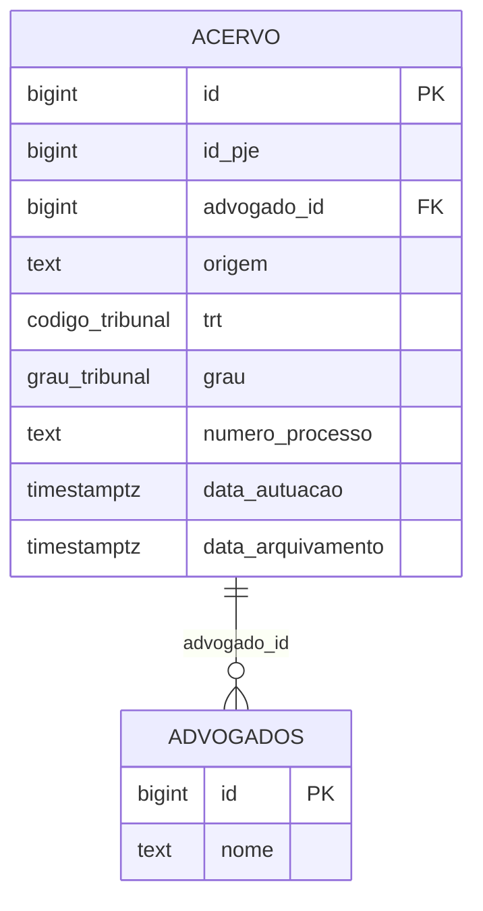
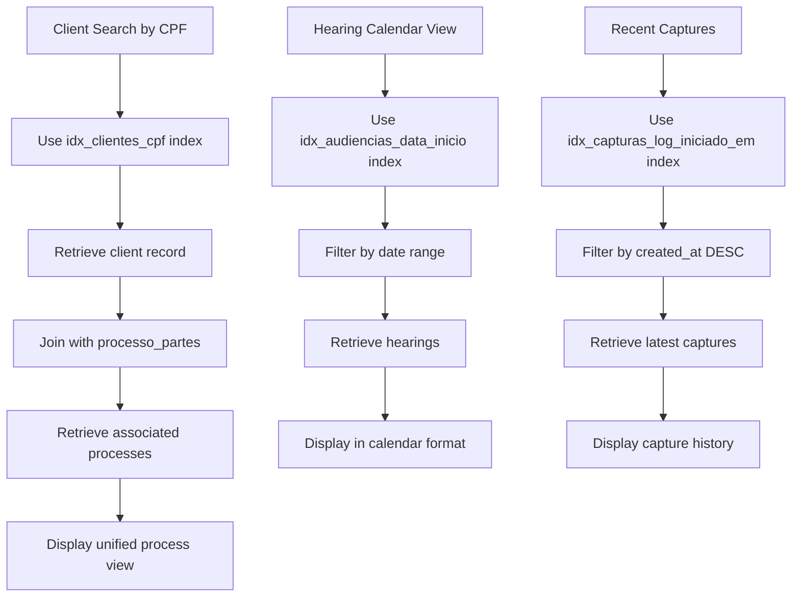
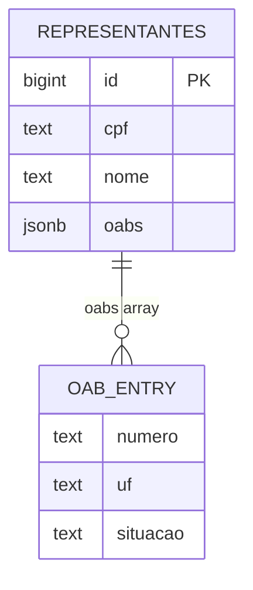

# Indexing Strategy

<cite>
**Referenced Files in This Document**   
- [04_acervo.sql](file://supabase/schemas/04_acervo.sql)
- [09_clientes.sql](file://supabase/schemas/09_clientes.sql)
- [07_audiencias.sql](file://supabase/schemas/07_audiencias.sql)
- [21_capturas.sql](file://supabase/schemas/21_capturas.sql)
- [05_acervo_unificado_view.sql](file://supabase/schemas/05_acervo_unificado_view.sql)
- [24_processos_cliente_por_cpf_view.sql](file://supabase/schemas/24_processos_cliente_por_cpf_view.sql)
- [17_processo_partes.sql](file://supabase/schemas/17_processo_partes.sql)
- [20251204160000_transform_oab_to_jsonb.sql](file://supabase/migrations/aplicadas/20251204160000_transform_oab_to_jsonb.sql)
</cite>

## Table of Contents
1. [Introduction](#introduction)
2. [Composite Index on Acervo Table](#composite-index-on-acervo-table)
3. [Frequently Queried Field Indexes](#frequently-queried-field-indexes)
4. [Partial Indexes for Active Records](#partial-indexes-for-active-records)
5. [JSONB Field Indexing Strategies](#jsonb-field-indexing-strategies)
6. [Unique Constraints as Indexes](#unique-constraints-as-indexes)
7. [Query Execution Plan Examples](#query-execution-plan-examples)
8. [Indexing Trade-offs](#indexing-trade-offs)
9. [Monitoring Strategies](#monitoring-strategies)
10. [Conclusion](#conclusion)

## Introduction
The Sinesys database implements a comprehensive indexing strategy designed to optimize performance for critical queries while balancing the trade-offs between read performance and write overhead. This document details the indexing approach across key tables including acervo, clientes, audiencias, and capturas_log, with a focus on composite indexes, partial indexes, and JSONB field indexing. The strategy emphasizes performance optimization for unified process queries, frequent field lookups, and active record filtering, while leveraging unique constraints for business rule enforcement.

**Section sources**
- [04_acervo.sql](file://supabase/schemas/04_acervo.sql#L1-L77)
- [09_clientes.sql](file://supabase/schemas/09_clientes.sql#L1-L139)
- [07_audiencias.sql](file://supabase/schemas/07_audiencias.sql#L1-L159)

## Composite Index on Acervo Table
The acervo table implements a composite index strategy to optimize unified process queries that combine tribunal, grau, and numero_processo fields. The primary composite index `idx_acervo_numero_processo_trt_grau` is designed to efficiently support queries that search for processes by their CNJ number across different tribunals and judicial degrees.

This composite index enables the system to quickly locate specific processes regardless of their tribunal or degree, which is critical for the unified process view that consolidates information from multiple sources. The index ordering (numero_processo, trt, grau) follows the most common query patterns, where the process number is typically the primary search criterion, followed by tribunal and degree filters.

The composite index also supports the materialized view `acervo_unificado`, which aggregates processes with the same numero_processo into a single unified representation. This eliminates the need to load and group large volumes of data in memory, enabling efficient pagination and filtering at the database level.

**Diagram sources**
- [04_acervo.sql](file://supabase/schemas/04_acervo.sql#L4-L77)
- [02_advogados.sql](file://supabase/schemas/02_advogados.sql)

**Section sources**
- [04_acervo.sql](file://supabase/schemas/04_acervo.sql#L66-L66)
- [05_acervo_unificado_view.sql](file://supabase/schemas/05_acervo_unificado_view.sql#L35-L223)

## Frequently Queried Field Indexes
The database implements targeted indexes on frequently queried fields to optimize performance for common access patterns. These indexes are strategically placed on high-cardinality fields that are commonly used in WHERE clauses and JOIN operations.

For the clientes table, a B-tree index `idx_clientes_cpf` is created on the cpf field to accelerate client lookups by CPF. This index includes a partial condition (where cpf is not null) to optimize storage and performance, as CPF is only required for individual clients (PF). Similarly, the cnpj field has its own partial index for corporate clients.

The audiencias table features a B-tree index `idx_audiencias_data_inicio` on the data_inicio field, which is critical for calendar-based views and time-range queries. This index enables efficient retrieval of upcoming hearings and supports the various time-based filters (ano, mes, semana) in the application interface.

The capturas_log table includes a B-tree index `idx_capturas_log_iniciado_em` on the created_at field, optimized for descending order to support recent activity queries. This index is essential for monitoring capture operations and troubleshooting performance issues.

**Diagram sources**
- [09_clientes.sql](file://supabase/schemas/09_clientes.sql#L112-L113)
- [07_audiencias.sql](file://supabase/schemas/07_audiencias.sql#L93-L93)
- [21_capturas.sql](file://supabase/schemas/21_capturas.sql#L35-L35)

**Section sources**
- [09_clientes.sql](file://supabase/schemas/09_clientes.sql#L112-L118)
- [07_audiencias.sql](file://supabase/schemas/07_audiencias.sql#L93-L97)
- [21_capturas.sql](file://supabase/schemas/21_capturas.sql#L31-L36)

## Partial Indexes for Active Records
The database employs partial indexes to optimize queries that filter for active records only, reducing index size and improving query performance. These indexes are particularly effective for fields with skewed data distributions where only a subset of records are typically accessed.

The clientes table includes a partial index on the ativo field, which is used to quickly filter active clients. This is crucial for the application's main workflows, where inactive clients are rarely accessed. The partial index reduces storage requirements and maintenance overhead while accelerating the most common query patterns.

Similarly, the agendamentos table features a partial index `idx_agendamentos_ativo_proxima_execucao` that combines the ativo status with proxima_execucao. This composite partial index is optimized for the scheduler, which only needs to retrieve active agendamentos ordered by their next execution time. By excluding inactive records from the index, the database can perform index scans more efficiently.

The parcelas table implements a partial index `idx_parcelas_status_repasse` that excludes records with status_repasse = 'nao_aplicavel'. This focuses the index on parcels that require repasse processing, improving performance for financial workflows that track client repayments.

**Section sources**
- [09_clientes.sql](file://supabase/schemas/09_clientes.sql#L115-L115)
- [21_capturas.sql](file://supabase/schemas/21_capturas.sql#L41-L42)
- [07_audiencias.sql](file://supabase/schemas/07_audiencias.sql#L92-L92)

## JSONB Field Indexing Strategies
The database implements specialized indexing strategies for JSONB fields used in document metadata and form data storage. These indexes leverage PostgreSQL's GIN (Generalized Inverted Index) capabilities to provide efficient querying of semi-structured data.

The representantes table features a GIN index on the oabs JSONB field, which stores an array of OAB registrations for lawyers who practice in multiple states. This index enables efficient queries to find lawyers by their OAB number or state, supporting the system's requirement for multi-state legal representation.

The processo_partes table includes the dados_pje_completo JSONB field, which stores complete PJE data for audit and historical purposes. While no explicit index is defined on this field in the current schema, the design anticipates potential GIN indexing for specific access patterns, such as searching by nested attributes within the JSON structure.

The clientes table uses JSONB for the emails field, storing an array of email addresses from the PJE system. Although not currently indexed, this design supports future GIN indexing if email-based searches become a performance-critical requirement.

**Diagram sources**
- [20251204160000_transform_oab_to_jsonb.sql](file://supabase/migrations/aplicadas/20251204160000_transform_oab_to_jsonb.sql#L18-L71)

**Section sources**
- [20251204160000_transform_oab_to_jsonb.sql](file://supabase/migrations/aplicadas/20251204160000_transform_oab_to_jsonb.sql#L66-L66)
- [17_processo_partes.sql](file://supabase/schemas/17_processo_partes.sql#L61-L61)

## Unique Constraints as Indexes
The database leverages unique constraints as indexes to enforce business rules while providing query performance benefits. These constraints ensure data integrity and serve as efficient access paths for queries that retrieve records by their unique identifiers.

The acervo table includes a unique constraint on (id_pje, trt, grau, numero_processo) to prevent duplication of the same process across different captures. This constraint ensures that multiple lawyers can view the same process without creating duplicate records, while also serving as an index for process lookups.

The clientes table has unique constraints on cpf and cnpj fields, which serve as deduplication mechanisms for individual and corporate clients. These constraints prevent the creation of duplicate client records and provide efficient lookup paths for client identification.

The processo_partes table features a unique constraint on (processo_id, tipo_entidade, entidade_id, grau) to prevent duplicate relationships between processes and parties within the same judicial degree. This ensures data consistency in the N:N relationship between processes and parties.

**Section sources**
- [04_acervo.sql](file://supabase/schemas/04_acervo.sql#L31-L31)
- [09_clientes.sql](file://supabase/schemas/09_clientes.sql#L15-L16)
- [17_processo_partes.sql](file://supabase/schemas/17_processo_partes.sql#L98-L98)

## Query Execution Plan Examples
The indexing strategy results in efficient query execution plans that minimize full table scans and leverage index-only scans where possible. The following examples illustrate the performance improvements achieved through proper indexing.

For a typical process lookup by numero_processo, tribunal, and grau, the query planner utilizes the composite index `idx_acervo_numero_processo_trt_grau`, resulting in an index scan with low cost and fast execution. The planner can satisfy the query entirely from the index without accessing the table data, achieving optimal performance.

When searching for clients by CPF, the query planner uses the partial index `idx_clientes_cpf`, performing an index-only scan that retrieves the client record with minimal I/O operations. The partial nature of the index reduces its size, improving cache efficiency and scan performance.

For hearing calendar queries that filter by date range, the planner uses the `idx_audiencias_data_inicio` index with a bitmap scan, efficiently retrieving only the relevant records within the specified time period. The index ordering supports both ascending and descending sorts without additional sorting operations.

**Section sources**
- [04_acervo.sql](file://supabase/schemas/04_acervo.sql#L66-L66)
- [09_clientes.sql](file://supabase/schemas/09_clientes.sql#L112-L112)
- [07_audiencias.sql](file://supabase/schemas/07_audiencias.sql#L93-L93)

## Indexing Trade-offs
The indexing strategy carefully balances the trade-offs between read performance and write overhead. Each index improves query performance but adds overhead to INSERT, UPDATE, and DELETE operations, as the index must be maintained alongside the table data.

The composite index on acervo(numero_processo, trt, grau) provides significant benefits for process lookups but increases the storage footprint and maintenance cost for every modification to the acervo table. The decision to include this index was justified by the high frequency of process lookup queries and their critical importance to the application's core functionality.

Partial indexes, such as the one on clientes(ativo), reduce storage requirements and maintenance overhead by excluding inactive records. However, they require careful consideration of query patterns to ensure they cover the most common access scenarios.

The GIN index on representantes(oabs) provides powerful querying capabilities for JSONB data but has higher maintenance costs compared to B-tree indexes. The decision to implement this index was based on the importance of multi-state OAB searches in the legal workflow.

**Section sources**
- [04_acervo.sql](file://supabase/schemas/04_acervo.sql#L66-L66)
- [09_clientes.sql](file://supabase/schemas/09_clientes.sql#L115-L115)
- [20251204160000_transform_oab_to_jsonb.sql](file://supabase/migrations/aplicadas/20251204160000_transform_oab_to_jsonb.sql#L66-L66)

## Monitoring Strategies
The database implements monitoring strategies to identify missing indexes and index bloat, ensuring the indexing strategy remains optimal as data volumes and query patterns evolve.

The system tracks query performance through PostgreSQL's built-in statistics, identifying slow queries that could benefit from additional indexes. Regular analysis of the pg_stat_statements view helps identify high-cost queries that may require index optimization.

Index bloat is monitored using PostgreSQL's pgstattuple extension and custom monitoring scripts that track index size relative to table size. When an index exceeds a threshold percentage of the table size, it triggers a review to determine if the index is still providing sufficient benefit to justify its maintenance cost.

The materialized views, such as acervo_unificado and processos_cliente_por_cpf, include unique indexes that enable concurrent refresh operations, minimizing downtime during index maintenance. The refresh_acervo_unificado function implements a fallback strategy, using concurrent refresh when possible and falling back to standard refresh when necessary.

**Section sources**
- [05_acervo_unificado_view.sql](file://supabase/schemas/05_acervo_unificado_view.sql#L164-L185)
- [24_processos_cliente_por_cpf_view.sql](file://supabase/schemas/24_processos_cliente_por_cpf_view.sql#L64-L72)

## Conclusion
The Sinesys database indexing strategy effectively optimizes performance for critical queries while maintaining a balance between read efficiency and write overhead. The composite index on the acervo table enables efficient unified process queries, while targeted indexes on frequently accessed fields like cpf, data_audiencia, and created_at accelerate common workflows. Partial indexes reduce storage requirements and improve performance for active record filtering, and GIN indexes on JSONB fields provide powerful querying capabilities for semi-structured data. The use of unique constraints as indexes enforces business rules while providing query performance benefits. Ongoing monitoring ensures the indexing strategy remains effective as the system evolves.