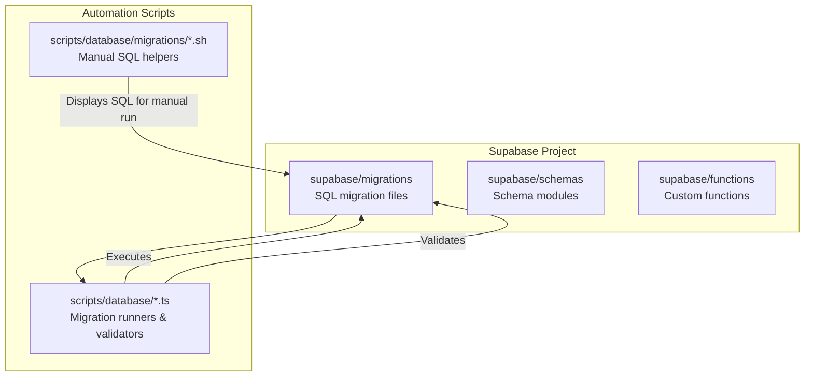
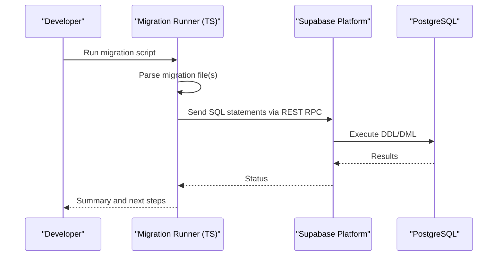
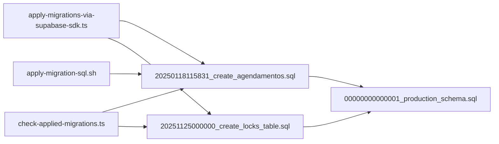

# Migration Management

<cite>
**Referenced Files in This Document**
- [supabase/migrations/00000000000001_production_schema.sql](file://supabase/migrations/00000000000001_production_schema.sql)
- [supabase/migrations/20250118115831_create_agendamentos.sql](file://supabase/migrations/20250118115831_create_agendamentos.sql)
- [supabase/migrations/20251125000000_create_locks_table.sql](file://supabase/migrations/20251125000000_create_locks_table.sql)
- [scripts/database/apply-migrations-via-supabase-sdk.ts](file://scripts/database/apply-migrations-via-supabase-sdk.ts)
- [scripts/database/check-applied-migrations.ts](file://scripts/database/check-applied-migrations.ts)
- [scripts/database/migrations/apply-migration-sql.sh](file://scripts/database/migrations/apply-migration-sql.sh)
- [supabase/migrations/APPLY_MANUALLY_add_chatflow_to_dify_apps.sql](file://supabase/migrations/APPLY_MANUALLY_add_chatflow_to_dify_apps.sql)
- [supabase/migrations/DISABLED_20250101000000_create_embeddings_conhecimento.sql](file://supabase/migrations/DISABLED_20250101000000_create_embeddings_conhecimento.sql)
- [scripts/database/populate-database.ts](file://scripts/database/populate-database.ts)
- [scripts/database/reset-and-pull-migrations.sh](file://scripts/database/reset-and-pull-migrations.sh)
- [scripts/database/sync-migrations.sh](file://scripts/database/sync-migrations.sh)
- [scripts/database/organize-migrations.ts](file://scripts/database/organize-migrations.ts)
- [scripts/database/create-base-migration.sh](file://scripts/database/create-base-migration.sh)
- [scripts/database/create-final-base-migration.sh](file://scripts/database/create-final-base-migration.sh)
- [scripts/database/fix-migrations.sh](file://scripts/database/fix-migrations.sh)
- [scripts/database/apply-locks-migration.ts](file://scripts/database/apply-locks-migration.ts)
- [scripts/database/apply-rls-simple.ts](file://scripts/database/apply-rls-simple.ts)
- [scripts/database/dump-production-schema.sh](file://scripts/database/dump-production-schema.sh)
- [scripts/database/migrations/apply-migrations-manual.ts](file://scripts/database/migrations/apply-migrations-manual.ts)
- [supabase/QUICK_START.md](file://supabase/QUICK_START.md)
- [supabase/README.md](file://supabase/README.md)
- [supabase/SCHEMA_EXPORT_README.md](file://supabase/SCHEMA_EXPORT_README.md)
- [supabase/useful_queries.sql](file://supabase/useful_queries.sql)
- [supabase/full_schema_dump.sql](file://supabase/full_schema_dump.sql)
- [scripts/database/README.md](file://scripts/database/README.md)
</cite>

## Table of Contents
1. [Introduction](#introduction)
2. [Project Structure](#project-structure)
3. [Core Components](#core-components)
4. [Architecture Overview](#architecture-overview)
5. [Detailed Component Analysis](#detailed-component-analysis)
6. [Dependency Analysis](#dependency-analysis)
7. [Performance Considerations](#performance-considerations)
8. [Troubleshooting Guide](#troubleshooting-guide)
9. [Conclusion](#conclusion)
10. [Appendices](#appendices)

## Introduction
This document describes the ZattarOS database evolution system built on Supabase. It explains how migrations are organized, named, and executed; how to create and maintain them; and how to validate, rollback, and troubleshoot them safely. It also covers production deployment workflows, shadow database usage, and testing procedures.

## Project Structure
ZattarOS organizes database migrations under the Supabase project directory with two primary categories:
- supabase/migrations: SQL migration files that evolve the schema and data model
- scripts/database/migrations: TypeScript and shell scripts that automate migration application, verification, and maintenance

**Diagram sources**
- [supabase/migrations/00000000000001_production_schema.sql:1-50](file://supabase/migrations/00000000000001_production_schema.sql#L1-L50)
- [scripts/database/apply-migrations-via-supabase-sdk.ts:1-162](file://scripts/database/apply-migrations-via-supabase-sdk.ts#L1-L162)
- [scripts/database/migrations/apply-migration-sql.sh:1-23](file://scripts/database/migrations/apply-migration-sql.sh#L1-L23)

**Section sources**
- [supabase/migrations/00000000000001_production_schema.sql:1-120](file://supabase/migrations/00000000000001_production_schema.sql#L1-L120)
- [scripts/database/apply-migrations-via-supabase-sdk.ts:1-162](file://scripts/database/apply-migrations-via-supabase-sdk.ts#L1-L162)
- [scripts/database/migrations/apply-migration-sql.sh:1-23](file://scripts/database/migrations/apply-migration-sql.sh#L1-L23)

## Core Components
- Migration files: SQL scripts under supabase/migrations with strict naming conventions and sequential ordering.
- Migration runners: TypeScript scripts that apply, validate, and manage migrations programmatically.
- Manual SQL helpers: Shell scripts that print SQL for manual execution in the Supabase Dashboard.
- Schema modules: Modular SQL files under supabase/schemas that define logical units of the schema.

Key responsibilities:
- Naming and ordering: Ensures deterministic execution order.
- Validation: Confirms applied vs pending migrations.
- Execution: Applies migrations via Supabase SDK or manual SQL.
- Rollback and safety: Provides rollback comments and disabled markers for future use.

**Section sources**
- [supabase/migrations/20250118115831_create_agendamentos.sql:1-77](file://supabase/migrations/20250118115831_create_agendamentos.sql#L1-L77)
- [supabase/migrations/20251125000000_create_locks_table.sql:1-77](file://supabase/migrations/20251125000000_create_locks_table.sql#L1-L77)
- [scripts/database/check-applied-migrations.ts:1-223](file://scripts/database/check-applied-migrations.ts#L1-L223)
- [scripts/database/apply-migrations-via-supabase-sdk.ts:1-162](file://scripts/database/apply-migrations-via-supabase-sdk.ts#L1-L162)

## Architecture Overview
The migration lifecycle integrates Supabase’s platform capabilities with local automation scripts:

**Diagram sources**
- [scripts/database/apply-migrations-via-supabase-sdk.ts:39-116](file://scripts/database/apply-migrations-via-supabase-sdk.ts#L39-L116)
- [supabase/migrations/20251125000000_create_locks_table.sql:1-77](file://supabase/migrations/20251125000000_create_locks_table.sql#L1-L77)

## Detailed Component Analysis

### Migration File Organization and Naming Conventions
- Base schema: A foundational migration initializes extensions, enums, schema, and core functions.
- Feature migrations: Named with a timestamp prefix followed by a descriptive slug, ensuring chronological ordering.
- Special markers:
  - APPLY_MANUALLY: Indicates migrations requiring manual intervention in the dashboard.
  - DISABLED: Marks migrations that are intentionally skipped or deferred.

Examples:
- Base schema: [supabase/migrations/00000000000001_production_schema.sql:1-120](file://supabase/migrations/00000000000001_production_schema.sql#L1-L120)
- Feature migration: [supabase/migrations/20250118115831_create_agendamentos.sql:1-77](file://supabase/migrations/20250118115831_create_agendamentos.sql#L1-L77)
- Manual-only: [supabase/migrations/APPLY_MANUALLY_add_chatflow_to_dify_apps.sql](file://supabase/migrations/APPLY_MANUALLY_add_chatflow_to_dify_apps.sql)
- Disabled: [supabase/migrations/DISABLED_20250101000000_create_embeddings_conhecimento.sql](file://supabase/migrations/DISABLED_20250101000000_create_embeddings_conhecimento.sql)

Sequential execution order:
- Deterministic by filename sorting.
- Base schema runs first, followed by feature migrations in timestamp order.

**Section sources**
- [supabase/migrations/00000000000001_production_schema.sql:1-120](file://supabase/migrations/00000000000001_production_schema.sql#L1-L120)
- [supabase/migrations/20250118115831_create_agendamentos.sql:1-77](file://supabase/migrations/20250118115831_create_agendamentos.sql#L1-L77)
- [supabase/migrations/APPLY_MANUALLY_add_chatflow_to_dify_apps.sql](file://supabase/migrations/APPLY_MANUALLY_add_chatflow_to_dify_apps.sql)
- [supabase/migrations/DISABLED_20250101000000_create_embeddings_conhecimento.sql](file://supabase/migrations/DISABLED_20250101000000_create_embeddings_conhecimento.sql)

### Migration Creation Process Using Supabase CLI and Custom Scripts
- Supabase CLI: Use the CLI to scaffold and manage migrations within the Supabase project context.
- Local scripts:
  - Manual SQL helper: Prints migration SQL for dashboard execution.
  - Migration runner: Applies SQL statements programmatically via REST RPC.
  - Validators: Confirm applied vs pending migrations by checking schema objects.

Recommended workflow:
- Create base schema and feature migrations locally.
- Use the manual SQL helper to review and execute targeted migrations in the dashboard when needed.
- Use the migration runner for automated application in CI/CD or staging environments.

**Section sources**
- [scripts/database/migrations/apply-migration-sql.sh:1-23](file://scripts/database/migrations/apply-migration-sql.sh#L1-L23)
- [scripts/database/apply-migrations-via-supabase-sdk.ts:1-162](file://scripts/database/apply-migrations-via-supabase-sdk.ts#L1-L162)
- [supabase/QUICK_START.md](file://supabase/QUICK_START.md)
- [supabase/README.md](file://supabase/README.md)

### Rollback Strategies and Conflict Resolution
Rollback indicators in migration files:
- Rollback comments: Provide step-by-step DROP statements for tables, functions, and indexes.
- Example: [supabase/migrations/20251125000000_create_locks_table.sql:65-77](file://supabase/migrations/20251125000000_create_locks_table.sql#L65-L77)

Conflict resolution patterns:
- Use IF NOT EXISTS checks to avoid errors when re-applying idempotent statements.
- Ignore benign errors (e.g., “already exists”) during automated application.
- For non-idempotent changes, rely on rollback comments to revert safely.

**Section sources**
- [supabase/migrations/20251125000000_create_locks_table.sql:65-77](file://supabase/migrations/20251125000000_create_locks_table.sql#L65-L77)
- [scripts/database/apply-migrations-via-supabase-sdk.ts:102-108](file://scripts/database/apply-migrations-via-supabase-sdk.ts#L102-L108)

### Testing Procedures and Validation
Validation pipeline:
- Automated check: [scripts/database/check-applied-migrations.ts:131-148](file://scripts/database/check-applied-migrations.ts#L131-L148) verifies presence of tables/columns and writes a status report.
- Manual verification: Use Supabase Dashboard to inspect schema state after applying migrations.
- Utility resources: [supabase/useful_queries.sql](file://supabase/useful_queries.sql) and [supabase/full_schema_dump.sql](file://supabase/full_schema_dump.sql) support inspection and comparison.

Testing checklist:
- Confirm applied vs pending migrations.
- Verify RLS policies and triggers are active.
- Validate indexes and performance-related changes.
- Cross-check against production schema dumps.

**Section sources**
- [scripts/database/check-applied-migrations.ts:1-223](file://scripts/database/check-applied-migrations.ts#L1-L223)
- [supabase/useful_queries.sql](file://supabase/useful_queries.sql)
- [supabase/full_schema_dump.sql](file://supabase/full_schema_dump.sql)

### Production Deployment Workflow
Production-grade practices:
- Shadow database: Use a separate Supabase project for pre-flight validation before applying to production.
- Controlled rollout: Apply migrations in small batches with validation between steps.
- Backup and rollback: Keep rollback comments and consider snapshot backups prior to major schema changes.
- Post-deploy verification: Run the validation script and review metrics.

Operational scripts:
- Reset and pull: [scripts/database/reset-and-pull-migrations.sh](file://scripts/database/reset-and-pull-migrations.sh)
- Sync migrations: [scripts/database/sync-migrations.sh](file://scripts/database/sync-migrations.sh)
- Populate database: [scripts/database/populate-database.ts](file://scripts/database/populate-database.ts)

**Section sources**
- [scripts/database/reset-and-pull-migrations.sh](file://scripts/database/reset-and-pull-migrations.sh)
- [scripts/database/sync-migrations.sh](file://scripts/database/sync-migrations.sh)
- [scripts/database/populate-database.ts](file://scripts/database/populate-database.ts)

### Migration Validation and Compliance
- Enum and type definitions: Centralized in the base schema for consistency across migrations.
- RLS and grants: Enforce row-level security and least-privilege access in feature migrations.
- Function coverage: Core functions are defined in the base schema and referenced by later migrations.

**Section sources**
- [supabase/migrations/00000000000001_production_schema.sql:32-120](file://supabase/migrations/00000000000001_production_schema.sql#L32-L120)
- [supabase/migrations/20250118115831_create_agendamentos.sql:50-77](file://supabase/migrations/20250118115831_create_agendamentos.sql#L50-L77)

### Common Migration Patterns and Anti-Patterns
Patterns:
- Idempotent DDL: Use IF NOT EXISTS and defensive checks.
- Incremental changes: Small, focused migrations with clear descriptions.
- RLS-first: Enable row-level security early and define policies alongside schema changes.
- Index hygiene: Add indexes alongside data volume increases; remove unused indexes post-merge.

Anti-patterns:
- Large monolithic migrations: Break into smaller, reversible steps.
- Unsafe assumptions: Avoid relying on implicit schema state; explicitly check and assert.
- Ignoring RLS: Always enforce row-level security for sensitive tables.
- No rollback comments: Include DROP statements and comments for future maintainers.

**Section sources**
- [supabase/migrations/20251125000000_create_locks_table.sql:65-77](file://supabase/migrations/20251125000000_create_locks_table.sql#L65-L77)
- [supabase/migrations/20250118115831_create_agendamentos.sql:37-48](file://supabase/migrations/20250118115831_create_agendamentos.sql#L37-L48)

## Dependency Analysis
The migration system exhibits low coupling between files, with clear separation of concerns:
- Migration files depend on the base schema and each other via timestamp ordering.
- Automation scripts depend on environment variables and the Supabase REST API.
- Manual helpers depend on the presence of specific migration files.

**Diagram sources**
- [supabase/migrations/00000000000001_production_schema.sql:1-120](file://supabase/migrations/00000000000001_production_schema.sql#L1-L120)
- [supabase/migrations/20250118115831_create_agendamentos.sql:1-77](file://supabase/migrations/20250118115831_create_agendamentos.sql#L1-L77)
- [supabase/migrations/20251125000000_create_locks_table.sql:1-77](file://supabase/migrations/20251125000000_create_locks_table.sql#L1-L77)
- [scripts/database/apply-migrations-via-supabase-sdk.ts:1-162](file://scripts/database/apply-migrations-via-supabase-sdk.ts#L1-L162)
- [scripts/database/check-applied-migrations.ts:1-223](file://scripts/database/check-applied-migrations.ts#L1-L223)
- [scripts/database/migrations/apply-migration-sql.sh:1-23](file://scripts/database/migrations/apply-migration-sql.sh#L1-L23)

**Section sources**
- [scripts/database/apply-migrations-via-supabase-sdk.ts:1-162](file://scripts/database/apply-migrations-via-supabase-sdk.ts#L1-L162)
- [scripts/database/check-applied-migrations.ts:1-223](file://scripts/database/check-applied-migrations.ts#L1-L223)

## Performance Considerations
- Use indexes introduced by migrations to improve query performance.
- Monitor disk I/O and query performance using Supabase diagnostics and the provided scripts.
- Keep migrations minimal and incremental to reduce downtime and risk.

[No sources needed since this section provides general guidance]

## Troubleshooting Guide
Common issues and resolutions:
- Migration fails due to existing resources: The runner ignores benign “already exists” errors and continues. Review the failure output and apply rollback comments if necessary.
- RLS or grants missing: Re-run the RLS application script and confirm policies.
- Manual-only migrations: Use the SQL helper to copy and paste the SQL into the Supabase Dashboard.

Diagnostic resources:
- Disk I/O diagnostics: [scripts/database/README.md:1-37](file://scripts/database/README.md#L1-L37)
- Useful queries: [supabase/useful_queries.sql](file://supabase/useful_queries.sql)
- Full schema dump: [supabase/full_schema_dump.sql](file://supabase/full_schema_dump.sql)

**Section sources**
- [scripts/database/apply-migrations-via-supabase-sdk.ts:94-108](file://scripts/database/apply-migrations-via-supabase-sdk.ts#L94-L108)
- [scripts/database/apply-rls-simple.ts](file://scripts/database/apply-rls-simple.ts)
- [scripts/database/README.md:1-37](file://scripts/database/README.md#L1-L37)
- [supabase/useful_queries.sql](file://supabase/useful_queries.sql)
- [supabase/full_schema_dump.sql](file://supabase/full_schema_dump.sql)

## Conclusion
ZattarOS employs a disciplined migration strategy combining timestamped SQL migrations, automated runners, and manual dashboards. By following the naming conventions, validation steps, and rollback practices outlined here, teams can evolve the database safely and predictably across development, staging, and production environments.

[No sources needed since this section summarizes without analyzing specific files]

## Appendices

### Migration Checklist
- [ ] Migration file follows naming convention and timestamp ordering.
- [ ] Includes idempotent DDL and rollback comments.
- [ ] Validates RLS and grants.
- [ ] Adds indexes and constraints as needed.
- [ ] Tested in staging with validation script.
- [ ] Verified in shadow database before production.
- [ ] Documented impact and rollback procedure.

[No sources needed since this section provides general guidance]

### Best Practices for Schema Changes
- Keep migrations small and focused.
- Use descriptive filenames and comments.
- Define RLS policies alongside schema changes.
- Add indexes proactively; remove unused ones post-merge.
- Back up before applying large migrations.

[No sources needed since this section provides general guidance]