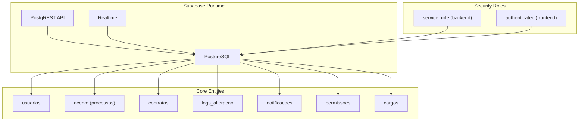
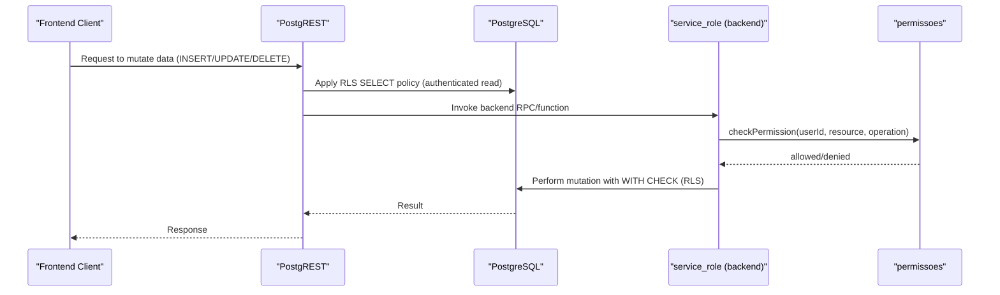
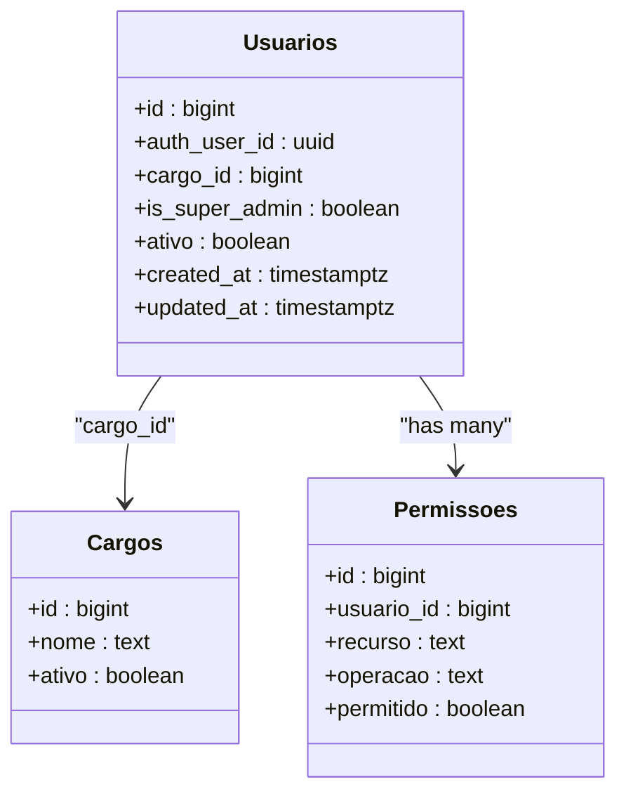
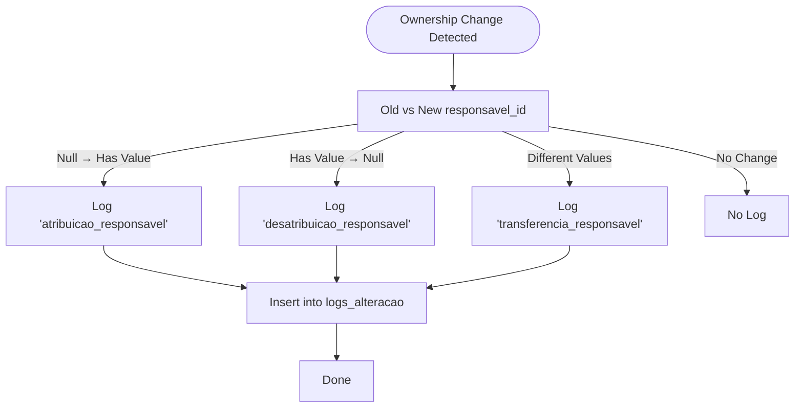
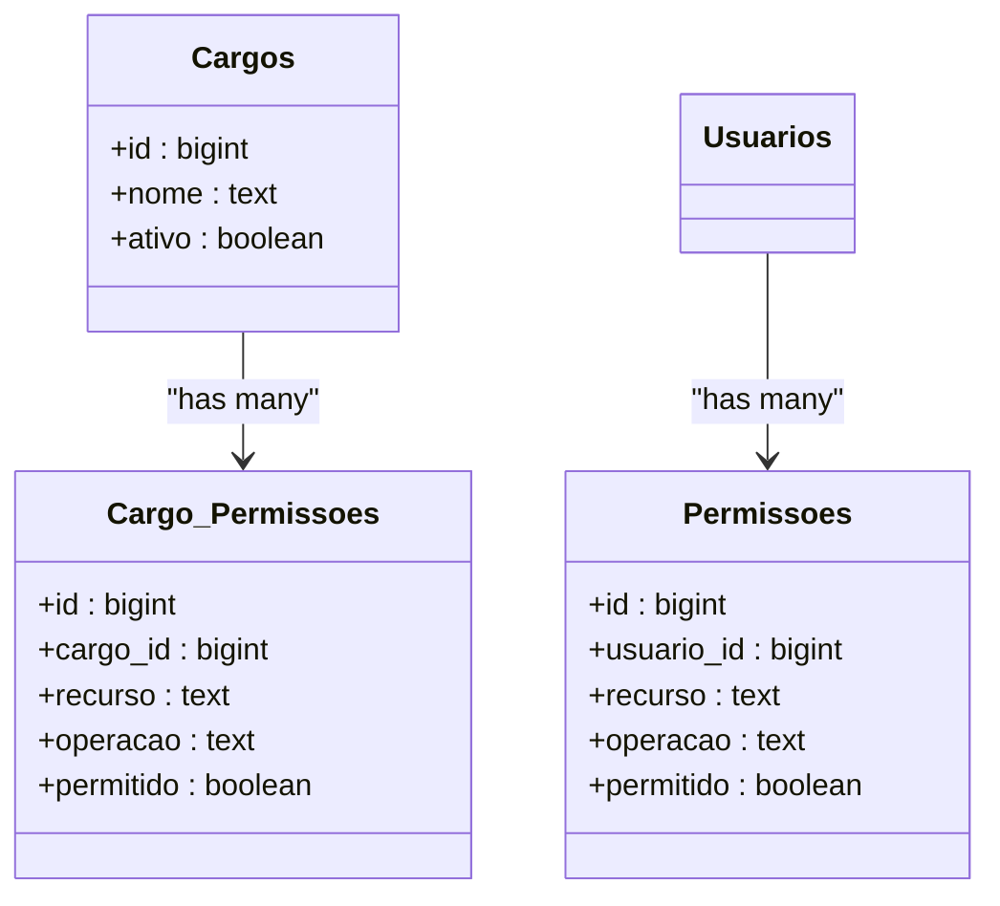
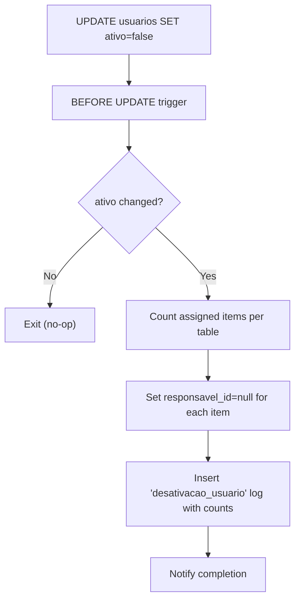
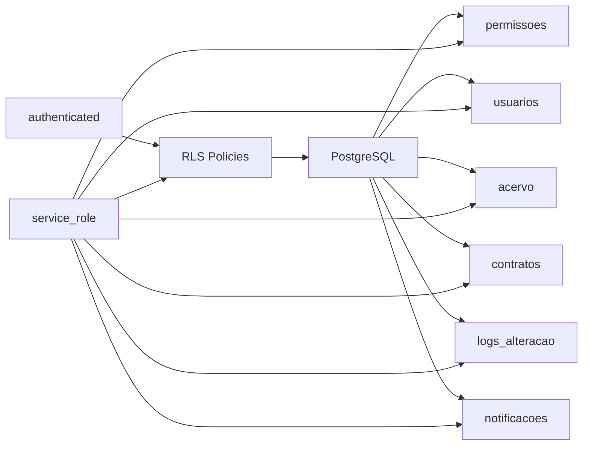

# Row Level Security (RLS)

<cite>
**Referenced Files in This Document**
- [config.toml](file://supabase/config.toml)
- [create_cargos.sql](file://supabase/migrations/20250118120003_create_cargos.sql)
- [create_permissoes.sql](file://supabase/migrations/20250118120100_create_permissoes.sql)
- [alter_usuarios_add_permissions_fields.sql](file://supabase/migrations/20250118120200_alter_usuarios_add_permissions_fields.sql)
- [fix_rls_policies_granular_permissions.sql](file://supabase/migrations/20250120000001_fix_rls_policies_granular_permissions.sql)
- [create_logs_alteracao.sql](file://supabase/migrations/20251117015304_create_logs_alteracao.sql)
- [create_triggers_log_atribuicao.sql](file://supabase/migrations/20251117015306_create_triggers_log_atribuicao.sql)
- [trigger_desativacao_usuario.sql](file://supabase/migrations/20251121190001_trigger_desativacao_usuario.sql)
- [fix_notificacoes_realtime_rls.sql](file://supabase/migrations/20260105151305_fix_notificacoes_realtime_rls.sql)
- [08_usuarios.sql](file://supabase/schemas/08_usuarios.sql)
- [11_contratos.sql](file://supabase/schemas/11_contratos.sql)
- [14_logs_alteracao.sql](file://supabase/schemas/14_logs_alteracao.sql)
- [22_cargos_permissoes.sql](file://supabase/schemas/22_cargos_permissoes.sql)
- [50_notificacoes.sql](file://supabase/schemas/50_notificacoes.sql)
</cite>

## Table of Contents
1. [Introduction](#introduction)
2. [Project Structure](#project-structure)
3. [Core Components](#core-components)
4. [Architecture Overview](#architecture-overview)
5. [Detailed Component Analysis](#detailed-component-analysis)
6. [Dependency Analysis](#dependency-analysis)
7. [Performance Considerations](#performance-considerations)
8. [Troubleshooting Guide](#troubleshooting-guide)
9. [Conclusion](#conclusion)

## Introduction
This document explains the Row Level Security (RLS) implementation in ZattarOS, focusing on how access control is enforced across major entities such as Processos (acervo), Contratos, Documentos, and Usuarios. It details the granular permission system using Cargos and Permissoes, the audit logging system via LogsAlteracao, automatic user deactivation triggers, and the Realtime-compatible RLS policies for notifications. It also provides policy creation syntax, permission inheritance patterns, security considerations, enforcement examples, and troubleshooting guidance.

## Project Structure
ZattarOS uses Supabase’s Postgres with RLS enabled on core tables. Policies are defined in migrations and schema files, while backend services (service_role) enforce granular permissions via the Permissoes table and super admin bypass logic.

**Diagram sources**
- [fix_rls_policies_granular_permissions.sql:36-47](file://supabase/migrations/20250120000001_fix_rls_policies_granular_permissions.sql#L36-L47)
- [08_usuarios.sql:81-99](file://supabase/schemas/08_usuarios.sql#L81-L99)
- [11_contratos.sql:58-59](file://supabase/schemas/11_contratos.sql#L58-L59)
- [14_logs_alteracao.sql:34-46](file://supabase/schemas/14_logs_alteracao.sql#L34-L46)
- [50_notificacoes.sql:38-62](file://supabase/schemas/50_notificacoes.sql#L38-L62)

**Section sources**
- [config.toml:7-18](file://supabase/config.toml#L7-L18)
- [fix_rls_policies_granular_permissions.sql:447-455](file://supabase/migrations/20250120000001_fix_rls_policies_granular_permissions.sql#L447-L455)

## Core Components
- Service Role (backend): Full access to all tables via RLS policies. Backend enforces granular checks using Permissoes and is_super_admin.
- Authenticated Users: Read-only access to most tables for collaboration; write operations require backend permission checks.
- Granular Permissions: Permissoes table stores user-specific resource-operation allowances. Unique constraint ensures one rule per user-resource-operation.
- Cargo-Based Permission Templates: cargo_permissoes defines default permissions per cargo, applied as templates when creating users.
- Audit Logging: LogsAlteracao captures ownership changes and other events with JSONB flexibility.
- Automatic Deactivation: Trigger removes a deactivated user from assigned items and logs counts.

**Section sources**
- [fix_rls_policies_granular_permissions.sql:9-12](file://supabase/migrations/20250120000001_fix_rls_policies_granular_permissions.sql#L9-L12)
- [create_permissoes.sql:14-16](file://supabase/migrations/20250118120100_create_permissoes.sql#L14-L16)
- [22_cargos_permissoes.sql:101-139](file://supabase/schemas/22_cargos_permissoes.sql#L101-L139)
- [create_logs_alteracao.sql:10-29](file://supabase/migrations/20251117015304_create_logs_alteracao.sql#L10-L29)
- [trigger_desativacao_usuario.sql:24-134](file://supabase/migrations/20251121190001_trigger_desativacao_usuario.sql#L24-L134)

## Architecture Overview
The RLS architecture follows a layered approach:
- RLS policies grant coarse-grained access (service_role full, authenticated read).
- Backend performs fine-grained authorization using Permissoes and is_super_admin.
- Triggers and functions enforce audit trails and ownership transitions.
- Realtime compatibility is ensured by optimized policies for notification visibility.

**Diagram sources**
- [fix_rls_policies_granular_permissions.sql:18-26](file://supabase/migrations/20250120000001_fix_rls_policies_granular_permissions.sql#L18-L26)
- [fix_rls_policies_granular_permissions.sql:406-418](file://supabase/migrations/20250120000001_fix_rls_policies_granular_permissions.sql#L406-L418)

## Detailed Component Analysis

### Usuarios (Users)
- Purpose: Stores employee and collaborator profiles, including OAB info, contact details, and security flags.
- RLS Policies:
  - service_role: full access.
  - authenticated: read access.
  - authenticated: update only their own profile via auth_user_id match.
- Key Fields for Security:
  - auth_user_id links to Supabase Auth.
  - cargo_id references internal organizational cargo.
  - is_super_admin bypasses all permission checks in backend.
- Indexes: Unique constraints on CPF/email; GIN on JSONB address for performance.

**Diagram sources**
- [08_usuarios.sql:6-41](file://supabase/schemas/08_usuarios.sql#L6-L41)
- [create_cargos.sql:5-16](file://supabase/migrations/20250118120003_create_cargos.sql#L5-L16)
- [create_permissoes.sql:5-16](file://supabase/migrations/20250118120100_create_permissoes.sql#L5-L16)

**Section sources**
- [08_usuarios.sql:81-99](file://supabase/schemas/08_usuarios.sql#L81-L99)
- [alter_usuarios_add_permissions_fields.sql:4-10](file://supabase/migrations/20250118120200_alter_usuarios_add_permissions_fields.sql#L4-L10)

### Acervo (Processos)
- Purpose: Captured PJE processes; central entity for ownership and auditing.
- RLS Policies:
  - service_role: full access.
  - authenticated: read access.
  - Backend handles create/update/delete via granular checks.
- Ownership Tracking:
  - responsavel_id references Usuarios.
  - Triggers log ownership changes to LogsAlteracao.

**Diagram sources**
- [create_triggers_log_atribuicao.sql:6-71](file://supabase/migrations/20251117015306_create_triggers_log_atribuicao.sql#L6-L71)

**Section sources**
- [fix_rls_policies_granular_permissions.sql:32-54](file://supabase/migrations/20250120000001_fix_rls_policies_granular_permissions.sql#L32-L54)
- [create_triggers_log_atribuicao.sql:75-101](file://supabase/migrations/20251117015306_create_triggers_log_atribuicao.sql#L75-L101)

### Contratos
- Purpose: Legal contracts managed by the firm.
- RLS: Full service_role access; authenticated read; backend controls mutations.
- Ownership: responsavel_id references Usuarios; created_by references Usuarios.

**Section sources**
- [11_contratos.sql:58-59](file://supabase/schemas/11_contratos.sql#L58-L59)
- [fix_rls_policies_granular_permissions.sql:200-222](file://supabase/migrations/20250120000001_fix_rls_policies_granular_permissions.sql#L200-L222)

### Notificações (Notifications)
- Purpose: User-centric alerts related to assigned entities.
- RLS Policies:
  - service_role: full access.
  - authenticated: read/update restricted to their own records.
- Realtime Compatibility: Optimized policies avoid function-based checks that may fail under Realtime evaluation.

**Section sources**
- [50_notificacoes.sql:38-62](file://supabase/schemas/50_notificacoes.sql#L38-L62)
- [fix_notificacoes_realtime_rls.sql:16-37](file://supabase/migrations/20260105151305_fix_notificacoes_realtime_rls.sql#L16-L37)

### LogsAlteracao (Audit Trail)
- Purpose: Generic audit log for ownership and other events across entities.
- RLS: service_role full access; authenticated read.
- Schema supports JSONB for flexible event data and indices for performance.

**Section sources**
- [create_logs_alteracao.sql:6-49](file://supabase/migrations/20251117015304_create_logs_alteracao.sql#L6-L49)
- [14_logs_alteracao.sql:34-46](file://supabase/schemas/14_logs_alteracao.sql#L34-L46)

### Cargos e Permissoes (Granular Permissions)
- Cargos: Internal organizational roles (e.g., Administrador, Gerente, Funcionário).
- Permissoes: User-specific resource-operation grants with unique constraint (usuario_id, recurso, operacao).
- Cargo_Permissoes: Default permission templates per cargo, applied as user creation templates.
- Backend Behavior:
  - Service role bypasses checks.
  - Super admins (is_super_admin) bypass checks.
  - Other users: backend verifies Permissoes before allowing mutations.

**Diagram sources**
- [22_cargos_permissoes.sql:101-139](file://supabase/schemas/22_cargos_permissoes.sql#L101-L139)
- [create_permissoes.sql:5-16](file://supabase/migrations/20250118120100_create_permissoes.sql#L5-L16)

**Section sources**
- [create_cargos.sql:4-65](file://supabase/migrations/20250118120003_create_cargos.sql#L4-L65)
- [create_permissoes.sql:4-60](file://supabase/migrations/20250118120100_create_permissoes.sql#L4-L60)
- [22_cargos_permissoes.sql:101-139](file://supabase/schemas/22_cargos_permissoes.sql#L101-L139)

### Automatic User Deactivation and Ownership Cleanup
- Trigger fires when a user’s ativo changes from true to false.
- Backend attempts to detect the acting user from application context; otherwise uses the target user.
- Unassigns the user from:
  - Processos (acervo)
  - Audiências
  - Pendentes de Manifestação
  - Expedientes Manuais
  - Contratos
- Logs the action with counts in LogsAlteracao.

**Diagram sources**
- [trigger_desativacao_usuario.sql:9-154](file://supabase/migrations/20251121190001_trigger_desativacao_usuario.sql#L9-L154)

**Section sources**
- [trigger_desativacao_usuario.sql:9-154](file://supabase/migrations/20251121190001_trigger_desativacao_usuario.sql#L9-L154)
- [create_logs_alteracao.sql:10-29](file://supabase/migrations/20251117015304_create_logs_alteracao.sql#L10-L29)

## Dependency Analysis
- RLS depends on Supabase Auth roles (service_role, authenticated) and PostgREST evaluation.
- Backend depends on Permissoes and is_super_admin to authorize mutations.
- Triggers depend on application context variables (e.g., app.current_user_id) to populate audit logs.
- Realtime depends on simplified policies that avoid function-based checks.

**Diagram sources**
- [fix_rls_policies_granular_permissions.sql:36-47](file://supabase/migrations/20250120000001_fix_rls_policies_granular_permissions.sql#L36-L47)
- [50_notificacoes.sql:47-62](file://supabase/schemas/50_notificacoes.sql#L47-L62)

**Section sources**
- [config.toml:7-18](file://supabase/config.toml#L7-L18)
- [fix_rls_policies_granular_permissions.sql:447-455](file://supabase/migrations/20250120000001_fix_rls_policies_granular_permissions.sql#L447-L455)

## Performance Considerations
- RLS overhead is minimal due to coarse-grained policies (service_role full, authenticated select) with backend enforcement for writes.
- Indexes on frequently filtered columns (e.g., responsavel_id, created_by, usuario_id) improve query performance.
- JSONB fields (e.g., logs_alteracao.dados_evento) benefit from GIN indexing for flexible searches.
- Realtime compatibility requires avoiding function-based policies; the notification policies were refactored accordingly.

[No sources needed since this section provides general guidance]

## Troubleshooting Guide
Common RLS issues and resolutions:
- Authenticated users cannot mutate data:
  - Expected: RLS allows read; backend authorization via Permissoes controls writes.
  - Verify service_role is used for backend operations and that Permissoes permits the requested operation.
- Notifications not visible in Realtime:
  - Use the optimized policies that avoid function-based checks.
  - Confirm the user’s auth.uid matches the record’s usuario_id.
- Ownership logs not appearing:
  - Ensure app.current_user_id is set before updates so the trigger can capture the actor.
  - Verify triggers exist on responsavel_id updates for acervo, audiencias, and pendentes_manifestacao.
- User deactivation did not unassign items:
  - Confirm the trigger is attached to the usuarios table and that ativo changed from true to false.
  - Check for exceptions in the trigger function and review logs_alteracao entries.

**Section sources**
- [fix_notificacoes_realtime_rls.sql:10-44](file://supabase/migrations/20260105151305_fix_notificacoes_realtime_rls.sql#L10-L44)
- [create_triggers_log_atribuicao.sql:75-101](file://supabase/migrations/20251117015306_create_triggers_log_atribuicao.sql#L75-L101)
- [trigger_desativacao_usuario.sql:144-154](file://supabase/migrations/20251121190001_trigger_desativacao_usuario.sql#L144-L154)

## Conclusion
ZattarOS employs a robust RLS model: coarse-grained policies grant safe baseline access, while backend services enforce granular permissions via Permissoes and super admin bypass. Ownership changes are audited automatically, and deactivated users are cleanly unassigned from all assigned items. Realtime compatibility is achieved through optimized policies for notifications. This layered approach balances security, performance, and usability across Processos, Contratos, Documentos, and Usuarios.