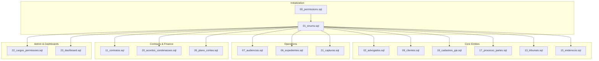
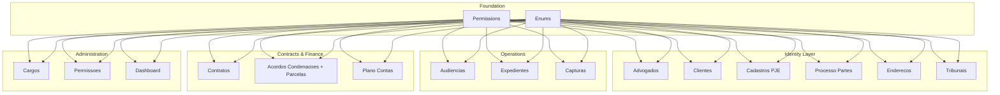
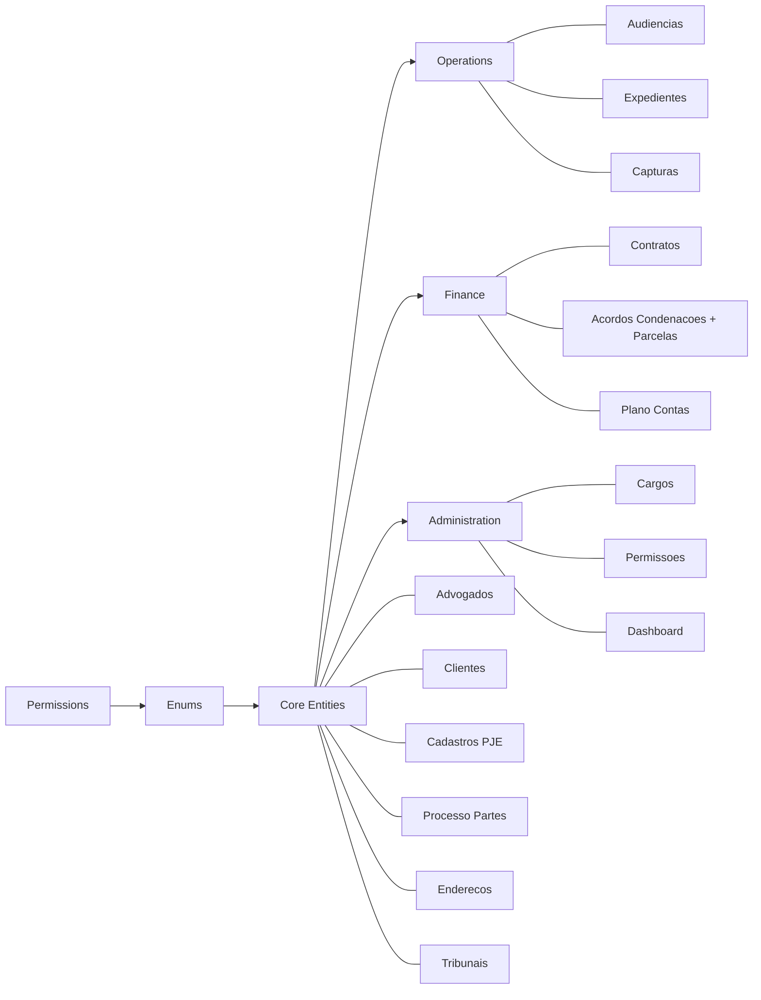

# Schema Overview

<cite>
**Referenced Files in This Document**
- [00_permissions.sql](file://supabase/schemas/00_permissions.sql)
- [01_enums.sql](file://supabase/schemas/01_enums.sql)
- [02_advogados.sql](file://supabase/schemas/02_advogados.sql)
- [09_clientes.sql](file://supabase/schemas/09_clientes.sql)
- [11_contratos.sql](file://supabase/schemas/11_contratos.sql)
- [07_audiencias.sql](file://supabase/schemas/07_audiencias.sql)
- [06_expedientes.sql](file://supabase/schemas/06_expedientes.sql)
- [13_tribunais.sql](file://supabase/schemas/13_tribunais.sql)
- [15_enderecos.sql](file://supabase/schemas/15_enderecos.sql)
- [17_processo_partes.sql](file://supabase/schemas/17_processo_partes.sql)
- [19_cadastros_pje.sql](file://supabase/schemas/19_cadastros_pje.sql)
- [20_acordos_condenacoes.sql](file://supabase/schemas/20_acordos_condenacoes.sql)
- [21_capturas.sql](file://supabase/schemas/21_capturas.sql)
- [22_cargos_permissoes.sql](file://supabase/schemas/22_cargos_permissoes.sql)
- [23_dashboard.sql](file://supabase/schemas/23_dashboard.sql)
- [26_plano_contas.sql](file://supabase/schemas/26_plano_contas.sql)
</cite>

## Table of Contents
1. [Introduction](#introduction)
2. [Project Structure](#project-structure)
3. [Core Components](#core-components)
4. [Architecture Overview](#architecture-overview)
5. [Detailed Component Analysis](#detailed-component-analysis)
6. [Dependency Analysis](#dependency-analysis)
7. [Performance Considerations](#performance-considerations)
8. [Troubleshooting Guide](#troubleshooting-guide)
9. [Conclusion](#conclusion)

## Introduction
This document presents a comprehensive schema overview of the ZattarOS database. It explains the main schema organization, including permissions, enums, legal entities (advogados, clientes, partes), financial entities (contratos, financeiro), and operational entities (audiencias, expedientes). It also documents the schema hierarchy, naming conventions, entity categorization, interconnections, dependency relationships, and initialization order. Visual schema organization charts illustrate the modular structure and entity grouping patterns.

## Project Structure
The ZattarOS database schema is organized into discrete SQL files under the Supabase schemas directory. Each file corresponds to a logical module or domain area, enabling incremental deployment and clear separation of concerns. The typical order of creation follows a dependency-aware sequence: permissions and enums first, followed by core entities, operational tables, and finally financial and administrative modules.

```mermaid
graph TB
subgraph "Initialization"
P["00_permissions.sql"]
E["01_enums.sql"]
end
subgraph "Core Entities"
A["02_advogados.sql"]
C["09_clientes.sql"]
AC["19_cadastros_pje.sql"]
PP["17_processo_partes.sql"]
TR["13_tribunais.sql"]
ED["15_enderecos.sql"]
end
subgraph "Operations"
AU["07_audiencias.sql"]
EX["06_expedientes.sql"]
CAP["21_capturas.sql"]
end
subgraph "Contracts & Finance"
CT["11_contratos.sql"]
ACC["20_acordos_condenacoes.sql"]
PC["26_plano_contas.sql"]
end
subgraph "Admin & Dashboards"
CP["22_cargos_permissoes.sql"]
DB["23_dashboard.sql"]
end
P --> E
E --> A
E --> C
E --> AC
E --> PP
E --> TR
E --> ED
E --> AU
E --> EX
E --> CAP
E --> CT
E --> ACC
E --> PC
E --> CP
E --> DB
```

**Diagram sources**
- [00_permissions.sql:1-21](file://supabase/schemas/00_permissions.sql#L1-L21)
- [01_enums.sql:1-435](file://supabase/schemas/01_enums.sql#L1-L435)
- [02_advogados.sql:1-45](file://supabase/schemas/02_advogados.sql#L1-L45)
- [09_clientes.sql:1-139](file://supabase/schemas/09_clientes.sql#L1-L139)
- [19_cadastros_pje.sql:1-71](file://supabase/schemas/19_cadastros_pje.sql#L1-L71)
- [17_processo_partes.sql:1-144](file://supabase/schemas/17_processo_partes.sql#L1-L144)
- [13_tribunais.sql:1-94](file://supabase/schemas/13_tribunais.sql#L1-L94)
- [15_enderecos.sql:1-94](file://supabase/schemas/15_enderecos.sql#L1-L94)
- [07_audiencias.sql:1-159](file://supabase/schemas/07_audiencias.sql#L1-L159)
- [06_expedientes.sql:1-249](file://supabase/schemas/06_expedientes.sql#L1-L249)
- [21_capturas.sql:1-103](file://supabase/schemas/21_capturas.sql#L1-L103)
- [11_contratos.sql:1-61](file://supabase/schemas/11_contratos.sql#L1-L61)
- [20_acordos_condenacoes.sql:1-128](file://supabase/schemas/20_acordos_condenacoes.sql#L1-L128)
- [26_plano_contas.sql:1-191](file://supabase/schemas/26_plano_contas.sql#L1-L191)
- [22_cargos_permissoes.sql:1-262](file://supabase/schemas/22_cargos_permissoes.sql#L1-L262)
- [23_dashboard.sql:1-284](file://supabase/schemas/23_dashboard.sql#L1-L284)

**Section sources**
- [00_permissions.sql:1-21](file://supabase/schemas/00_permissions.sql#L1-L21)
- [01_enums.sql:1-435](file://supabase/schemas/01_enums.sql#L1-L435)

## Core Components
This section outlines the major schema components and their roles:

- Permissions and Roles
  - Purpose: Establish service_role privileges and baseline RLS policies for secure access.
  - Key elements: Grant usage/select on schema/public, default privileges, function execution grants, and RLS enablement on tables.
  - Initialization order: First (00_).

- Enumerations
  - Purpose: Centralized type definitions for tribunal, person, contract, hearing, capture, expense, notification, task, financial, and interview types.
  - Key elements: Strongly typed enums for statuses, modalities, origins, and financial classifications.
  - Initialization order: Second (01_).

- Legal Entities
  - Advogados: Lawyers with CPF/OAB uniqueness and audit timestamps.
  - Clientes: Unified client table with PF/PJ attributes, PJE integration fields, and address linkage.
  - Cadastros PJE: Polymorphic mapping of entities to judicial IDs across systems and tribunals.
  - Processo Partes: N:N relationship between processes and parties (clients, adverse parties, third parties) with PJE alignment.
  - Enderecos: Address records for clients, adverse parties, and third parties, aligned with PJE structure.
  - Tribunais: Judicial courts registry and tribunal configurations for scraping.

- Operational Entities
  - Audiencias: Scheduled hearings with modalities (virtual/presencial/hibrida), responsible user tracking, and triggers for modalities.
  - Expedientes: Unified procedural acts (captured/manual/CNJ), responsible user tracking, and baixa logging.

- Contracts and Finance
  - Contratos: Legal contracts with segment, billing type, client, role, status, and responsible user.
  - Acordos Condenacoes + Parcelas: Agreements, condemnations, and fees with distribution logic and client repass tracking.
  - Plano Contas: Hierarchical chart of accounts for SGF with parent-child relationships and validation.

- Administration and Dashboards
  - Cargos e Permissoes: Job positions, default permission templates, and granular user permissions.
  - Dashboard: User dashboards, tasks, notes, and labels.

**Section sources**
- [02_advogados.sql:1-45](file://supabase/schemas/02_advogados.sql#L1-L45)
- [09_clientes.sql:1-139](file://supabase/schemas/09_clientes.sql#L1-L139)
- [19_cadastros_pje.sql:1-71](file://supabase/schemas/19_cadastros_pje.sql#L1-L71)
- [17_processo_partes.sql:1-144](file://supabase/schemas/17_processo_partes.sql#L1-L144)
- [15_enderecos.sql:1-94](file://supabase/schemas/15_enderecos.sql#L1-L94)
- [13_tribunais.sql:1-94](file://supabase/schemas/13_tribunais.sql#L1-L94)
- [07_audiencias.sql:1-159](file://supabase/schemas/07_audiencias.sql#L1-L159)
- [06_expedientes.sql:1-249](file://supabase/schemas/06_expedientes.sql#L1-L249)
- [11_contratos.sql:1-61](file://supabase/schemas/11_contratos.sql#L1-L61)
- [20_acordos_condenacoes.sql:1-128](file://supabase/schemas/20_acordos_condenacoes.sql#L1-L128)
- [26_plano_contas.sql:1-191](file://supabase/schemas/26_plano_contas.sql#L1-L191)
- [22_cargos_permissoes.sql:1-262](file://supabase/schemas/22_cargos_permissoes.sql#L1-L262)
- [23_dashboard.sql:1-284](file://supabase/schemas/23_dashboard.sql#L1-L284)

## Architecture Overview
The schema is designed around a layered architecture:
- Foundation: Permissions and enums define access and types.
- Core Entities: Lawyers, clients, addresses, and PJE mappings form the identity layer.
- Operations: Hearing and procedural act management.
- Contracts and Finance: Contract lifecycle and financial accounting.
- Administration: Roles, permissions, and user dashboards.

```mermaid
graph TB
subgraph "Foundation"
PERM["Permissions"]
ENUM["Enums"]
end
subgraph "Identity Layer"
ADV["Advogados"]
CLI["Clientes"]
CAD["Cadastros PJE"]
PART["Processo Partes"]
END["Enderecos"]
TRIB["Tribunais"]
end
subgraph "Operations"
AUD["Audiencias"]
EXP["Expedientes"]
CAP["Capturas"]
end
subgraph "Contracts & Finance"
CONTR["Contratos"]
FIN["Acordos Condenacoes + Parcelas"]
PC["Plano Contas"]
end
subgraph "Administration"
POS["Cargos"]
PERM2["Permissoes"]
DASH["Dashboard"]
end
PERM --> ADV
PERM --> CLI
PERM --> CAD
PERM --> PART
PERM --> END
PERM --> TRIB
PERM --> AUD
PERM --> EXP
PERM --> CAP
PERM --> CONTR
PERM --> FIN
PERM --> PC
PERM --> POS
PERM --> PERM2
PERM --> DASH
ENUM --> ADV
ENUM --> CLI
ENUM --> CAD
ENUM --> PART
ENUM --> END
ENUM --> TRIB
ENUM --> AUD
ENUM --> EXP
ENUM --> CAP
ENUM --> CONTR
ENUM --> FIN
ENUM --> PC
ENUM --> POS
ENUM --> PERM2
ENUM --> DASH
```

**Diagram sources**
- [00_permissions.sql:1-21](file://supabase/schemas/00_permissions.sql#L1-L21)
- [01_enums.sql:1-435](file://supabase/schemas/01_enums.sql#L1-L435)
- [02_advogados.sql:1-45](file://supabase/schemas/02_advogados.sql#L1-L45)
- [09_clientes.sql:1-139](file://supabase/schemas/09_clientes.sql#L1-L139)
- [19_cadastros_pje.sql:1-71](file://supabase/schemas/19_cadastros_pje.sql#L1-L71)
- [17_processo_partes.sql:1-144](file://supabase/schemas/17_processo_partes.sql#L1-L144)
- [15_enderecos.sql:1-94](file://supabase/schemas/15_enderecos.sql#L1-L94)
- [13_tribunais.sql:1-94](file://supabase/schemas/13_tribunais.sql#L1-L94)
- [07_audiencias.sql:1-159](file://supabase/schemas/07_audiencias.sql#L1-L159)
- [06_expedientes.sql:1-249](file://supabase/schemas/06_expedientes.sql#L1-L249)
- [21_capturas.sql:1-103](file://supabase/schemas/21_capturas.sql#L1-L103)
- [11_contratos.sql:1-61](file://supabase/schemas/11_contratos.sql#L1-L61)
- [20_acordos_condenacoes.sql:1-128](file://supabase/schemas/20_acordos_condenacoes.sql#L1-L128)
- [26_plano_contas.sql:1-191](file://supabase/schemas/26_plano_contas.sql#L1-L191)
- [22_cargos_permissoes.sql:1-262](file://supabase/schemas/22_cargos_permissoes.sql#L1-L262)
- [23_dashboard.sql:1-284](file://supabase/schemas/23_dashboard.sql#L1-L284)

## Detailed Component Analysis

### Permissions and Roles
- Purpose: Enable service_role to bypass RLS for backend operations while enforcing row-level security for authenticated users.
- Implementation highlights:
  - Grants usage on schema/public, table privileges, default privileges on future tables/sequences/functions, and function execution rights.
  - Enables RLS on all tables and defines baseline policies for service_role and authenticated users.
- Initialization order: Must run before other schema files.

**Section sources**
- [00_permissions.sql:1-21](file://supabase/schemas/00_permissions.sql#L1-L21)

### Enumerations
- Purpose: Provide strongly typed, centralized enumerations for tribunal classification, person types, contract categories, hearing modalities, capture types, financial account types, and more.
- Implementation highlights:
  - Comprehensive coverage of tribunal codes, instance/grau, access types, and legacy enums.
  - Person-related enums (gender, marital status).
  - Contract enums (type, billing type, status, party role).
  - Hearing enums (status, modality, situation).
  - Capture enums (type, status).
  - Financial enums (account type, nature, level, transaction type, status, origin, bank account type, status, payment method, reconciliation status, budget period, budget status).
  - Interview enums (type, status).
- Initialization order: After permissions.

**Section sources**
- [01_enums.sql:1-435](file://supabase/schemas/01_enums.sql#L1-L435)

### Legal Entities

#### Advogados
- Purpose: Store lawyer identities with CPF/OAB uniqueness and audit timestamps.
- Key features:
  - Unique constraints on CPF.
  - Indexes on CPF and OAB+UF.
  - Trigger to update timestamps.

**Section sources**
- [02_advogados.sql:1-45](file://supabase/schemas/02_advogados.sql#L1-L45)

#### Clientes
- Purpose: Global client registry with PF/PJ support, PJE integration, and address linkage.
- Key features:
  - Unique constraints on CPF/CNPJ.
  - Extensive PJE-aligned fields (emails, status, login, nationality, etc.).
  - Address foreign key and audit fields.
  - RLS policies for service_role and authenticated users.

**Section sources**
- [09_clientes.sql:1-139](file://supabase/schemas/09_clientes.sql#L1-L139)

#### Cadastros PJE
- Purpose: Polymorphic mapping of entities to judicial IDs across systems and tribunals.
- Key features:
  - Unique constraint on (entity type, PJE person ID, system, tribunal, degree).
  - Indices for efficient lookups by entity and PJE ID.
  - RLS policies for service_role and authenticated users.

**Section sources**
- [19_cadastros_pje.sql:1-71](file://supabase/schemas/19_cadastros_pje.sql#L1-L71)

#### Processo Partes
- Purpose: N:N relationship between processes and parties with PJE alignment.
- Key features:
  - Unique constraint to prevent duplicate participation in the same process/degree.
  - Indices on process, entity, polo, tribunal/degree, and number.
  - RLS policies for service_role and authenticated users.

**Section sources**
- [17_processo_partes.sql:1-144](file://supabase/schemas/17_processo_partes.sql#L1-L144)

#### Enderecos
- Purpose: Addresses for clients, adverse parties, and third parties, aligned with PJE.
- Key features:
  - Unique partial index for PJE upsert deduplication.
  - Indices on entity and process context.
  - RLS policies for service_role and authenticated users.

**Section sources**
- [15_enderecos.sql:1-94](file://supabase/schemas/15_enderecos.sql#L1-L94)

#### Tribunais
- Purpose: Registry of courts and tribunal configurations for scraping.
- Key features:
  - Tribunais: court registry.
  - Tribunais Config: scraping URLs and access types.
  - Orgaos Tribunais: court branches.

**Section sources**
- [13_tribunais.sql:1-94](file://supabase/schemas/13_tribunais.sql#L1-L94)

### Operational Entities

#### Audiencias
- Purpose: Scheduled hearings with modalities and responsible user tracking.
- Key features:
  - Uniqueness on (PJE ID, TRT, degree, process number).
  - Modalities populated automatically via trigger based on virtual URL, type description, or presence of address.
  - Indices on key lookup fields.
  - RLS policies for service_role and authenticated users.

**Section sources**
- [07_audiencias.sql:1-159](file://supabase/schemas/07_audiencias.sql#L1-L159)

#### Expedientes
- Purpose: Unified procedural acts (captured/manual/CNJ) with responsible user tracking and baixa logging.
- Key features:
  - Uniqueness on (PJE ID, TRT, degree, process number).
  - Trigger to fill process ID based on process number.
  - Functions to log baixa and reversal of baixa.
  - Indices on responsibility, origin, and status.
  - RLS policies for service_role and authenticated users.

**Section sources**
- [06_expedientes.sql:1-249](file://supabase/schemas/06_expedientes.sql#L1-L249)

#### Capturas
- Purpose: History and scheduling of scraping runs for processes, hearings, and procedural acts.
- Key features:
  - Capturas Log: execution history with status and results.
  - Agendamentos: automated scheduling with periodicity and timing.
  - RLS policies for service_role and authenticated users.

**Section sources**
- [21_capturas.sql:1-103](file://supabase/schemas/21_capturas.sql#L1-L103)

### Contracts and Finance

#### Contratos
- Purpose: Legal contracts with segment, billing type, client, role, status, and responsible user.
- Key features:
  - References to clients and users.
  - Indices on segment, type, status, client, responsible, and creator.
  - RLS policies for service_role and authenticated users.

**Section sources**
- [11_contratos.sql:1-61](file://supabase/schemas/11_contratos.sql#L1-L61)

#### Acordos Condenacoes + Parcelas
- Purpose: Agreements, condemnations, and fees with distribution logic and client repass tracking.
- Key features:
  - Acordos Condenacoes: total value, direction, status, number of installments, distribution mode, percentages, and honoraries.
  - Parcelas: individual installments with status, payment method, repass tracking, and audit fields.
  - Indices on process, type, status, direction, and repass status.
  - RLS policies for service_role and authenticated users.

**Section sources**
- [20_acordos_condenacoes.sql:1-128](file://supabase/schemas/20_acordos_condenacoes.sql#L1-L128)

#### Plano Contas
- Purpose: Hierarchical chart of accounts for SGF with parent-child relationships and validation.
- Key features:
  - Hierarchical structure with synthetic/analytics levels.
  - Validation to prevent cycles in parent-child relationships.
  - Indices on code, type, parent, activity, and analytic acceptance.
  - RLS policies for service_role and authenticated users.

**Section sources**
- [26_plano_contas.sql:1-191](file://supabase/schemas/26_plano_contas.sql#L1-L191)

### Administration and Dashboards

#### Cargos e Permissoes
- Purpose: Job positions, default permission templates, and granular user permissions.
- Key features:
  - Cargos: job titles with audit fields.
  - Permissoes: user-specific permissions with unique constraints.
  - Cargo Permissoes: default permission templates applied to positions.
  - RLS policies for service_role and authenticated users.

**Section sources**
- [22_cargos_permissoes.sql:1-262](file://supabase/schemas/22_cargos_permissoes.sql#L1-L262)

#### Dashboard
- Purpose: User dashboards, tasks, notes, and labels.
- Key features:
  - Layouts Painel: user dashboard widget configuration.
  - Links Personalizados: user-defined bookmarks.
  - Tarefas: Kanban-style tasks with sequence-generated IDs.
  - Notas e Etiquetas: note-taking with labels and items.
  - RLS policies for service_role and authenticated users.

**Section sources**
- [23_dashboard.sql:1-284](file://supabase/schemas/23_dashboard.sql#L1-L284)

## Dependency Analysis
The schema exhibits clear dependency relationships:
- Foundation depends on Permissions and Enums.
- Core Entities depend on Enums for typed fields.
- Operations depend on Core Entities (e.g., audiencias reference advogados and acervo; expedientes reference acervo and tipos_expedientes).
- Contracts depend on Clients and Users.
- Finance depends on Contracts and Core Entities.
- Administration depends on Users.

```mermaid
graph LR
PERM["Permissions"] --> ENUM["Enums"]
ENUM --> CORE["Core Entities"]
CORE --> OPS["Operations"]
CORE --> FIN["Finance"]
CORE --> ADM["Administration"]
CORE --- ADV["Advogados"]
CORE --- CLI["Clientes"]
CORE --- CAD["Cadastros PJE"]
CORE --- PART["Processo Partes"]
CORE --- END["Enderecos"]
CORE --- TRIB["Tribunais"]
OPS --- AUD["Audiencias"]
OPS --- EXP["Expedientes"]
OPS --- CAP["Capturas"]
FIN --- CONTR["Contratos"]
FIN --- ACC["Acordos Condenacoes + Parcelas"]
FIN --- PC["Plano Contas"]
ADM --- POS["Cargos"]
ADM --- PERM2["Permissoes"]
ADM --- DASH["Dashboard"]
```

**Diagram sources**
- [00_permissions.sql:1-21](file://supabase/schemas/00_permissions.sql#L1-L21)
- [01_enums.sql:1-435](file://supabase/schemas/01_enums.sql#L1-L435)
- [02_advogados.sql:1-45](file://supabase/schemas/02_advogados.sql#L1-L45)
- [09_clientes.sql:1-139](file://supabase/schemas/09_clientes.sql#L1-L139)
- [19_cadastros_pje.sql:1-71](file://supabase/schemas/19_cadastros_pje.sql#L1-L71)
- [17_processo_partes.sql:1-144](file://supabase/schemas/17_processo_partes.sql#L1-L144)
- [15_enderecos.sql:1-94](file://supabase/schemas/15_enderecos.sql#L1-L94)
- [13_tribunais.sql:1-94](file://supabase/schemas/13_tribunais.sql#L1-L94)
- [07_audiencias.sql:1-159](file://supabase/schemas/07_audiencias.sql#L1-L159)
- [06_expedientes.sql:1-249](file://supabase/schemas/06_expedientes.sql#L1-L249)
- [21_capturas.sql:1-103](file://supabase/schemas/21_capturas.sql#L1-L103)
- [11_contratos.sql:1-61](file://supabase/schemas/11_contratos.sql#L1-L61)
- [20_acordos_condenacoes.sql:1-128](file://supabase/schemas/20_acordos_condenacoes.sql#L1-L128)
- [26_plano_contas.sql:1-191](file://supabase/schemas/26_plano_contas.sql#L1-L191)
- [22_cargos_permissoes.sql:1-262](file://supabase/schemas/22_cargos_permissoes.sql#L1-L262)
- [23_dashboard.sql:1-284](file://supabase/schemas/23_dashboard.sql#L1-L284)

**Section sources**
- [00_permissions.sql:1-21](file://supabase/schemas/00_permissions.sql#L1-L21)
- [01_enums.sql:1-435](file://supabase/schemas/01_enums.sql#L1-L435)
- [02_advogados.sql:1-45](file://supabase/schemas/02_advogados.sql#L1-L45)
- [09_clientes.sql:1-139](file://supabase/schemas/09_clientes.sql#L1-L139)
- [19_cadastros_pje.sql:1-71](file://supabase/schemas/19_cadastros_pje.sql#L1-L71)
- [17_processo_partes.sql:1-144](file://supabase/schemas/17_processo_partes.sql#L1-L144)
- [15_enderecos.sql:1-94](file://supabase/schemas/15_enderecos.sql#L1-L94)
- [13_tribunais.sql:1-94](file://supabase/schemas/13_tribunais.sql#L1-L94)
- [07_audiencias.sql:1-159](file://supabase/schemas/07_audiencias.sql#L1-L159)
- [06_expedientes.sql:1-249](file://supabase/schemas/06_expedientes.sql#L1-L249)
- [21_capturas.sql:1-103](file://supabase/schemas/21_capturas.sql#L1-L103)
- [11_contratos.sql:1-61](file://supabase/schemas/11_contratos.sql#L1-L61)
- [20_acordos_condenacoes.sql:1-128](file://supabase/schemas/20_acordos_condenacoes.sql#L1-L128)
- [26_plano_contas.sql:1-191](file://supabase/schemas/26_plano_contas.sql#L1-L191)
- [22_cargos_permissoes.sql:1-262](file://supabase/schemas/22_cargos_permissoes.sql#L1-L262)
- [23_dashboard.sql:1-284](file://supabase/schemas/23_dashboard.sql#L1-L284)

## Performance Considerations
- Indexing strategy:
  - Use targeted B-tree indices on frequently filtered columns (e.g., CPF/CNPJ, tribunal codes, degree, process number, responsible user).
  - Partial unique indices for deduplication (e.g., cadastros_pje, enderecos).
- Triggers:
  - Keep triggers minimal and focused; avoid heavy computations inside triggers.
  - Consider deferrable constraints where appropriate to reduce contention.
- RLS:
  - Policies should be selective and leverage existing indices.
  - Prefer coarse-grained policies for service_role and fine-grained for authenticated users.
- Hierarchical data:
  - For plano_contas, maintain strict parent-child checks to prevent cycles and ensure efficient traversal.

## Troubleshooting Guide
- Permission issues:
  - Verify service_role grants and default privileges are applied after permissions initialization.
  - Confirm RLS policies are enabled and correctly scoped.
- Data integrity:
  - Check unique constraints on CPF/CNPJ, cadastros_pje, and audiencias/expedientes uniqueness keys.
  - Validate plano_contas parent-child relationships to prevent cycles.
- Auditing:
  - Use logs_alteracao (referenced in expedientes) to track responsibility changes and baixas.
- Scraping:
  - Review capturas_log for execution status and errors; adjust agendamentos timing and credentials.

**Section sources**
- [00_permissions.sql:1-21](file://supabase/schemas/00_permissions.sql#L1-L21)
- [06_expedientes.sql:156-222](file://supabase/schemas/06_expedientes.sql#L156-L222)
- [21_capturas.sql:1-103](file://supabase/schemas/21_capturas.sql#L1-L103)
- [26_plano_contas.sql:103-154](file://supabase/schemas/26_plano_contas.sql#L103-L154)

## Conclusion
The ZattarOS schema is structured to support a comprehensive legal practice management system. It separates concerns across permissions, enums, identity, operations, contracts, finance, and administration. The modular organization, strong typing via enums, and robust RLS ensure scalability, maintainability, and security. Adhering to the documented initialization order and dependency relationships will facilitate reliable deployments and upgrades.