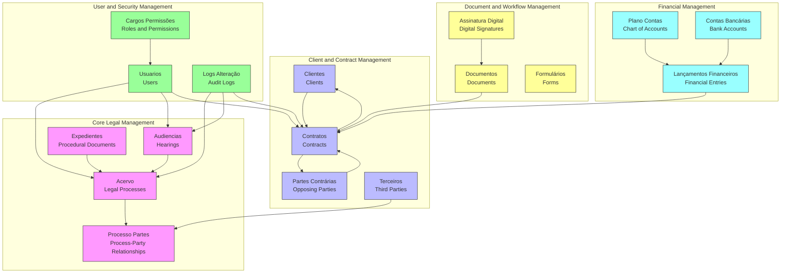
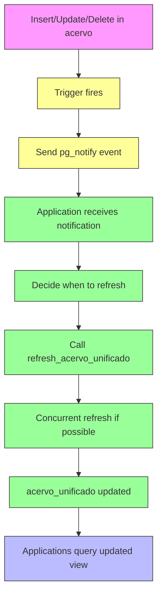

# Schema Overview

<cite>
**Referenced Files in This Document**   
- [00_permissions.sql](file://supabase/schemas/00_permissions.sql)
- [01_enums.sql](file://supabase/schemas/01_enums.sql)
- [04_acervo.sql](file://supabase/schemas/04_acervo.sql)
- [07_audiencias.sql](file://supabase/schemas/07_audiencias.sql)
- [08_usuarios.sql](file://supabase/schemas/08_usuarios.sql)
- [09_clientes.sql](file://supabase/schemas/09_clientes.sql)
- [10_partes_contrarias.sql](file://supabase/schemas/10_partes_contrarias.sql)
- [11_contratos.sql](file://supabase/schemas/11_contratos.sql)
- [14_logs_alteracao.sql](file://supabase/schemas/14_logs_alteracao.sql)
- [17_processo_partes.sql](file://supabase/schemas/17_processo_partes.sql)
- [18_representantes.sql](file://supabase/schemas/18_representantes.sql)
- [25_assinatura_digital.sql](file://supabase/schemas/25_assinatura_digital.sql)
- [26_plano_contas.sql](file://supabase/schemas/26_plano_contas.sql)
- [05_acervo_unificado_view.sql](file://supabase/schemas/05_acervo_unificado_view.sql)
</cite>

## Table of Contents
1. [Introduction](#introduction)
2. [Core Domain Entities](#core-domain-entities)
3. [System Context and Schema Groupings](#system-context-and-schema-groupings)
4. [Data Lifecycle and Workflow Support](#data-lifecycle-and-workflow-support)
5. [Cross-Cutting Concerns](#cross-cutting-concerns)
6. [PostgreSQL Features Utilization](#postgresql-features-utilization)
7. [Conclusion](#conclusion)

## Introduction

The Sinesys database schema is a comprehensive system designed to manage legal workflows for law firms, with a focus on labor law (TRT) processes. The schema consists of 36 SQL files that define tables, views, enums, and functions, organized to support the full lifecycle of legal case management. The system captures data from the PJE (Processo Judicial Eletrônico) platform, manages client relationships, tracks hearings, handles document workflows, and integrates financial management.

The database is built on PostgreSQL and leverages advanced features such as Row Level Security (RLS), materialized views, JSONB for flexible data storage, and enum types for data integrity. The schema is designed to support a multi-tenant architecture where multiple lawyers can access the same legal processes while maintaining appropriate data isolation and security.

The core purpose of the Sinesys system is to provide a unified platform for law firms to manage their legal cases, clients, contracts, hearings, and documents, while ensuring compliance with data privacy regulations and providing robust audit capabilities.

**Section sources**
- [01_enums.sql](file://supabase/schemas/01_enums.sql#L1-L400)
- [04_acervo.sql](file://supabase/schemas/04_acervo.sql#L1-L77)

## Core Domain Entities

The Sinesys database schema is centered around several core domain entities that represent the fundamental business concepts of a law firm's operations. These entities are implemented as tables in the database and are interconnected through well-defined relationships.

### Acervo (Legal Processes)

The `acervo` table is the central entity in the Sinesys schema, representing legal processes (cases) captured from the PJE system. It stores comprehensive information about each legal process, including its identification number, tribunal code, judicial class, parties involved, filing date, and current status. The table is designed to handle both active cases and archived cases, with a unified structure that supports processes from different TRT jurisdictions.

The `acervo` table uses a composite uniqueness constraint on `(id_pje, trt, grau, numero_processo)` to ensure that each process is uniquely identified across different instances, allowing multiple lawyers to view the same process without duplication. This design reflects the reality that multiple lawyers from the same firm may be involved in the same legal case.

**Section sources**
- [04_acervo.sql](file://supabase/schemas/04_acervo.sql#L1-L77)

### Clientes (Clients)

The `clientes` table manages client information for the law firm. It stores both personal and corporate client data, with support for CPF (individual taxpayer registry) and CNPJ (corporate taxpayer registry) as unique identifiers. The table includes extensive fields for personal information, contact details, and PJE-specific data, enabling comprehensive client management.

The schema distinguishes between individual (PF) and corporate (PJ) clients through the `tipo_pessoa` enum field. For individual clients, it captures personal details such as date of birth, gender, and marital status, while for corporate clients, it stores business-related information like opening date, business activity, and company size.

**Section sources**
- [09_clientes.sql](file://supabase/schemas/09_clientes.sql#L1-L139)

### Contratos (Contracts)

The `contratos` table manages legal contracts between the law firm and its clients. It captures essential contract information including the area of law, contract type, billing method, and the parties involved. The table supports various contract types such as litigation, defense, procedural acts, advisory services, and consultations.

The contract entity is linked to clients through the `cliente_id` field and can reference opposing parties through the `parte_contraria_id` field. It also includes JSONB fields (`parte_autora` and `parte_re`) to store multiple parties involved in the contract, providing flexibility for complex legal arrangements.

**Section sources**
- [11_contratos.sql](file://supabase/schemas/11_contratos.sql#L1-L86)

### Audiencias (Hearings)

The `audiencias` table manages scheduled hearings for legal processes. It captures detailed information about each hearing, including start and end times, modality (virtual, in-person, or hybrid), location, and status. The table is linked to the `acervo` table through the `processo_id` field, establishing the relationship between hearings and legal processes.

A notable feature of the hearings schema is the use of a trigger function `populate_modalidade_audiencia()` that automatically determines the hearing modality based on available information such as virtual meeting URLs or physical addresses. This automation reduces data entry errors and ensures consistency in how hearing modalities are recorded.

**Section sources**
- [07_audiencias.sql](file://supabase/schemas/07_audiencias.sql#L1-L159)

### Usuarios (Users)

The `usuarios` table manages system users, representing employees and collaborators within the law firm. Each user has a unique identifier and is associated with authentication credentials through the `auth_user_id` field, which references Supabase Auth users. The table stores personal information, professional details (including OAB registration for lawyers), and contact information.

Users can be assigned roles and permissions through the `cargo_id` field, which references the `cargos` table, and the `is_super_admin` flag, which grants elevated privileges. This structure supports a hierarchical organizational model where users have different levels of access and responsibilities within the system.

**Section sources**
- [08_usuarios.sql](file://supabase/schemas/08_usuarios.sql#L1-L94)

### Partes (Parties) and Representantes (Representatives)

The schema distinguishes between different types of parties involved in legal processes through separate tables: `clientes` for clients, `partes_contrarias` for opposing parties, and `terceiros` for third parties. This separation allows for specialized data collection for each type of party while maintaining data consistency through shared fields.

The `representantes` table manages legal representatives, uniquely identified by CPF. It supports multiple OAB registrations for lawyers who are registered in different states, storing this information as a JSONB array. This design accommodates the reality that lawyers may practice in multiple jurisdictions.

**Section sources**
- [10_partes_contrarias.sql](file://supabase/schemas/10_partes_contrarias.sql#L1-L139)
- [18_representantes.sql](file://supabase/schemas/18_representantes.sql#L1-L63)

### Documentos (Documents)

The document management system is implemented through the `assinatura_digital` schema, which includes tables for digital signatures, templates, and forms. The `assinatura_digital_templates` table stores PDF templates used for document generation, while the `assinatura_digital_formularios` table manages forms associated with specific business segments.

The system supports a complete digital signature workflow, with tables for signature sessions (`assinatura_digital_sessoes_assinatura`) and completed signatures (`assinatura_digital_assinaturas`). This enables the creation, signing, and tracking of legal documents within the platform, supporting the firm's digital transformation.

**Section sources**
- [25_assinatura_digital.sql](file://supabase/schemas/25_assinatura_digital.sql#L1-L207)

## System Context and Schema Groupings

The Sinesys database schema can be organized into several major groupings that reflect the system's architectural domains. These groupings help to understand how different components of the system interact and support various business functions.

**Diagram sources **
- [04_acervo.sql](file://supabase/schemas/04_acervo.sql#L1-L77)
- [07_audiencias.sql](file://supabase/schemas/07_audiencias.sql#L1-L159)
- [09_clientes.sql](file://supabase/schemas/09_clientes.sql#L1-L139)
- [10_partes_contrarias.sql](file://supabase/schemas/10_partes_contrarias.sql#L1-L139)
- [11_contratos.sql](file://supabase/schemas/11_contratos.sql#L1-L86)
- [17_processo_partes.sql](file://supabase/schemas/17_processo_partes.sql#L1-L144)
- [25_assinatura_digital.sql](file://supabase/schemas/25_assinatura_digital.sql#L1-L207)
- [26_plano_contas.sql](file://supabase/schemas/26_plano_contas.sql#L1-L191)

## Data Lifecycle and Workflow Support

The Sinesys database schema is designed to support the complete data lifecycle of legal case management, from initial data capture to archival. The system captures data from external sources (primarily the PJE platform) and manages it through various stages of processing, collaboration, and eventual archiving.

### Data Capture and Integration

The data lifecycle begins with data capture from the PJE system, which is facilitated by the `capturas` table and related services. The system supports different types of captures, including general case inventory (`acervo_geral`), archived cases (`arquivados`), hearings (`audiencias`), pending matters (`pendentes`), and party information (`partes`). This modular approach allows for targeted data synchronization based on specific needs.

The captured data is stored in the core tables (`acervo`, `audiencias`, `clientes`, etc.) and enriched with additional information from the firm's internal systems. The schema includes fields for tracking the origin of data (`origem` in the `acervo` table) and synchronization status, enabling auditability and data provenance.

### Processing and Collaboration

Once data is captured, it enters the processing phase where lawyers and staff collaborate on cases. The schema supports this through several mechanisms:

1. **Responsibility Assignment**: Users can be assigned as responsible for specific cases or hearings through the `responsavel_id` field in relevant tables. Changes to responsibility are tracked in the `logs_alteracao` table.

2. **Document Collaboration**: The document management system supports collaborative editing and digital signatures, enabling multiple parties to work on legal documents simultaneously.

3. **Hearing Management**: The hearings system provides tools for tracking upcoming hearings, their modalities, and responsible parties, facilitating coordination among team members.

### Archival and Retention

The schema includes support for case archival through the `data_arquivamento` field in the `acervo` table and the `StatusArquivamento` enum. This allows the system to track when cases are archived and manage them according to retention policies. The distinction between active and archived cases enables efficient querying and reporting, with archived cases potentially being moved to cold storage for long-term retention.

## Cross-Cutting Concerns

The Sinesys database schema addresses several cross-cutting concerns that are essential for a secure, compliant, and auditable legal management system.

### Data Privacy

Data privacy is a critical concern in legal systems, and the Sinesys schema implements several measures to protect sensitive information:

1. **Row Level Security (RLS)**: Most tables have RLS enabled, ensuring that users can only access data they are authorized to see. The `service_role` has full access for backend operations, while authenticated users have read access to relevant data.

2. **Data Minimization**: The schema captures only the data necessary for legal case management, avoiding unnecessary collection of personal information.

3. **Sensitive Data Handling**: Fields containing sensitive information (such as CPF, CNPJ, and personal details) are stored with appropriate constraints and access controls.

**Section sources**
- [00_permissions.sql](file://supabase/schemas/00_permissions.sql#L1-L21)
- [04_acervo.sql](file://supabase/schemas/04_acervo.sql#L75)
- [09_clientes.sql](file://supabase/schemas/09_clientes.sql#L126)

### Audit Logging

The `logs_alteracao` table provides comprehensive audit logging capabilities, tracking changes to key entities in the system. It records the type of entity changed, the specific record ID, the type of event, the user who executed the action, and any changes to responsibility assignments.

This audit trail is essential for compliance with legal and regulatory requirements, enabling the firm to demonstrate accountability and trace the history of case management activities. The log includes both the previous and new responsible parties for actions like responsibility assignment or transfer, providing a complete record of case ownership changes.

**Section sources**
- [14_logs_alteracao.sql](file://supabase/schemas/14_logs_alteracao.sql#L1-L71)

### Security Enforcement

Security is enforced through a combination of PostgreSQL features and application-level controls:

1. **Row Level Security**: As mentioned, RLS policies are implemented on all major tables, restricting data access based on user roles and permissions.

2. **Service Role**: The `service_role` is granted comprehensive permissions to bypass RLS for backend operations, while regular users are subject to RLS policies.

3. **Authentication Integration**: The system integrates with Supabase Auth through the `auth_user_id` field in the `usuarios` table, leveraging a robust authentication system.

4. **Permission System**: The `cargos_permissoes` schema implements a role-based permission system, allowing fine-grained control over user capabilities within the application.

## PostgreSQL Features Utilization

The Sinesys database schema makes extensive use of PostgreSQL's advanced features to enhance data integrity, performance, and functionality.

### Enums

The schema defines numerous enum types in the `01_enums.sql` file to ensure data consistency and integrity. These include:

- `codigo_tribunal`: For TRT and TST codes
- `grau_tribunal`: For process levels (first degree, second degree, superior court)
- `tipo_pessoa`: For individual vs. corporate entities
- `area_direito`: For legal practice areas
- `status_audiencia`: For hearing statuses

These enums prevent invalid data entry and make the schema self-documenting by clearly defining the valid values for key fields.

**Section sources**
- [01_enums.sql](file://supabase/schemas/01_enums.sql#L1-L400)

### Views

The schema uses materialized views to optimize complex queries and improve performance. The `acervo_unificado` materialized view aggregates processes with the same case number, identifying the current instance based on the most recent filing date. This view eliminates the need to load and group large volumes of data in application memory, enabling efficient pagination and filtering.

The view includes a refresh function that can operate concurrently to avoid locking, and a trigger function that notifies when a refresh is needed. This design balances data freshness with system performance, allowing the application to decide when to refresh the view based on its needs.

**Diagram sources **
- [05_acervo_unificado_view.sql](file://supabase/schemas/05_acervo_unificado_view.sql#L1-L223)

### Row-Level Security

Row-Level Security (RLS) is implemented on all major tables to enforce data access controls. The policy structure typically includes:

1. **Service Role Access**: The `service_role` has full access to all data, enabling backend services to perform necessary operations.

2. **Authenticated User Access**: Regular authenticated users have read access to relevant data, with the ability to insert, update, and delete records based on their permissions.

3. **Specific Policies**: Some tables have additional policies, such as allowing users to update only their own profile information.

This security model ensures that data is protected at the database level, providing an additional layer of security beyond application-level controls.

**Section sources**
- [00_permissions.sql](file://supabase/schemas/00_permissions.sql#L1-L21)
- [04_acervo.sql](file://supabase/schemas/04_acervo.sql#L75)
- [08_usuarios.sql](file://supabase/schemas/08_usuarios.sql#L76)

## Conclusion

The Sinesys database schema represents a comprehensive and well-structured system for managing legal workflows in a law firm environment. By organizing data around core domain entities such as legal processes, clients, contracts, hearings, and users, the schema provides a solid foundation for building a robust legal management application.

The use of PostgreSQL's advanced features—enums for data integrity, materialized views for performance optimization, JSONB for flexible data storage, and Row-Level Security for access control—demonstrates a sophisticated understanding of database design principles. The schema effectively balances the need for data normalization with the practical requirements of a real-world legal practice.

Key strengths of the schema include its support for the complete data lifecycle from capture to archival, its comprehensive audit logging capabilities, and its robust security model. The system is designed to handle the complexities of legal case management while ensuring data privacy and compliance with regulatory requirements.

The modular organization of the 36 schema files into logical groupings makes the system maintainable and extensible, allowing for the addition of new features and capabilities as the needs of law firms evolve. Overall, the Sinesys database schema provides a solid foundation for a modern legal technology platform.