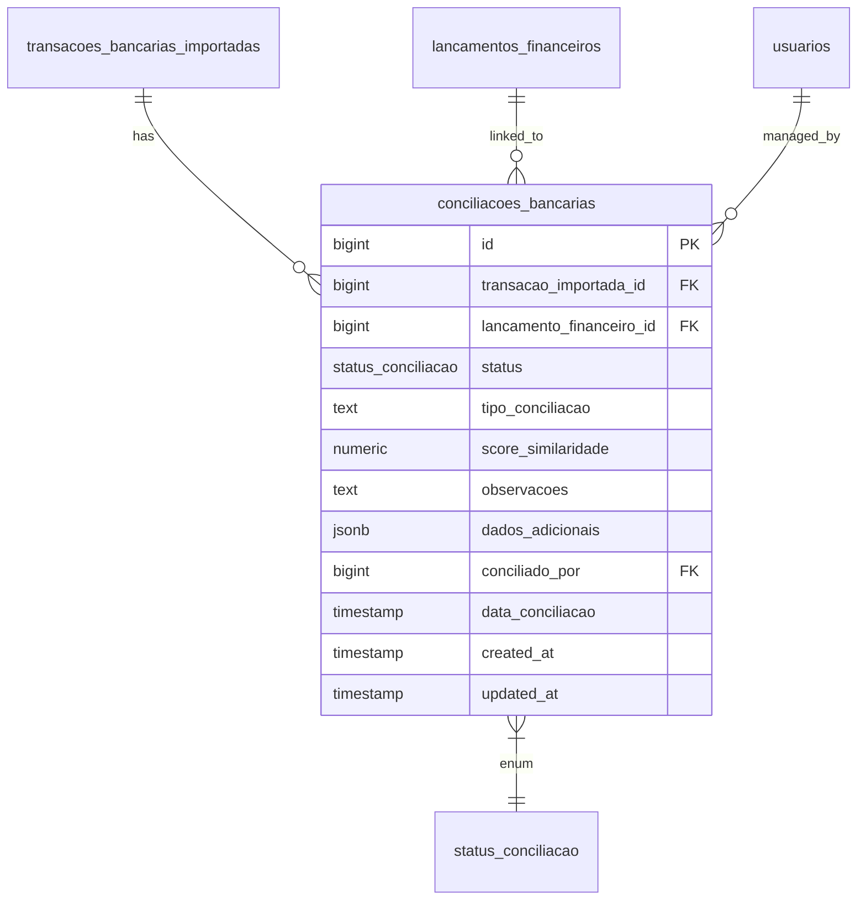
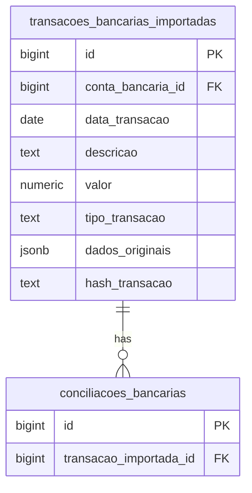
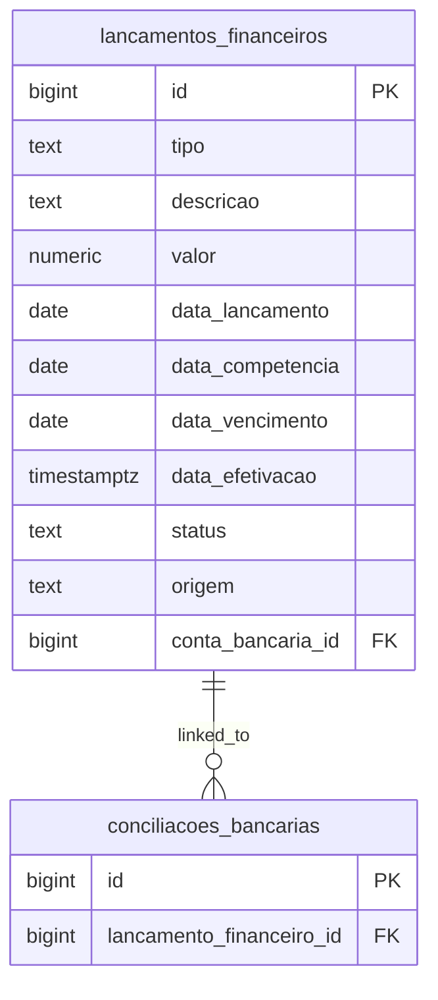
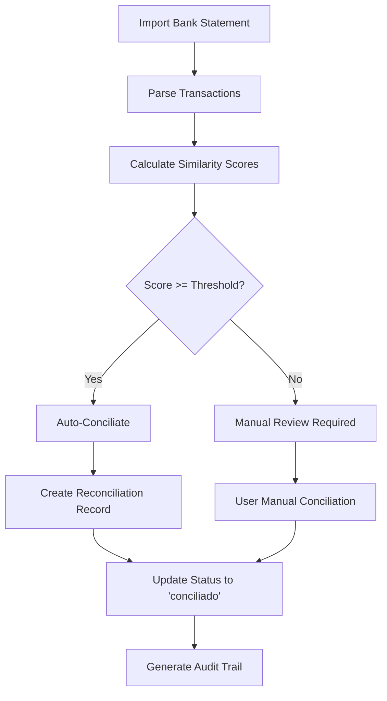
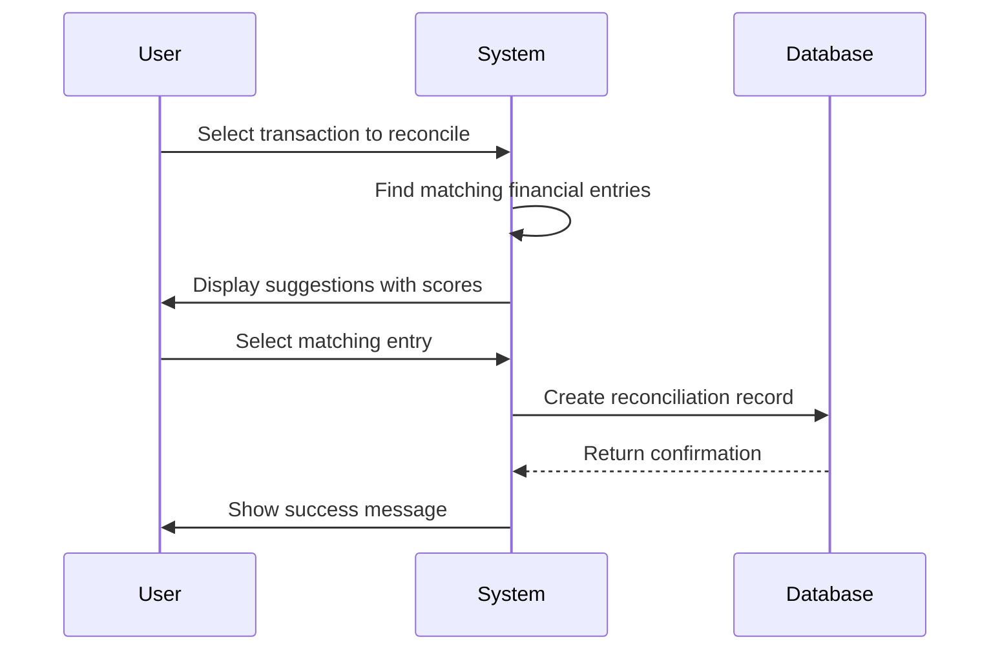
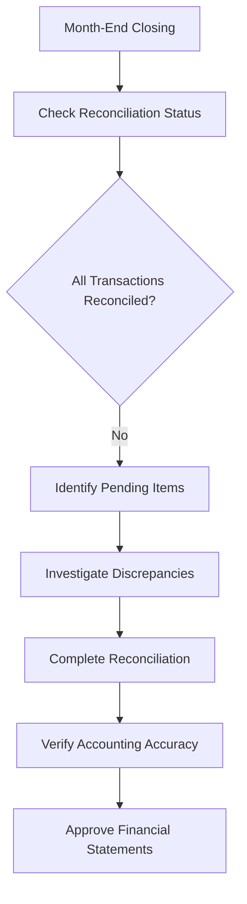

# Conciliação Bancária Table

<cite>
**Referenced Files in This Document**   
- [31_conciliacao_bancaria.sql](file://supabase/schemas/31_conciliacao_bancaria.sql)
- [conciliacao-bancaria.types.ts](file://backend/types/financeiro/conciliacao-bancaria.types.ts)
- [page.tsx](file://app/(dashboard)/financeiro/conciliacao-bancaria/page.tsx)
- [transacoes/route.ts](file://app/api/financeiro/conciliacao-bancaria/transacoes/route.ts)
- [conciliar-automaticamente.service.ts](file://backend/financeiro/conciliacao-bancaria/services/conciliacao-bancaria/conciliar-automaticamente.service.ts)
</cite>

## Table of Contents
1. [Introduction](#introduction)
2. [Table Structure](#table-structure)
3. [Field Definitions](#field-definitions)
4. [Relationships](#relationships)
5. [Business Rules](#business-rules)
6. [Constraints and Indexes](#constraints-and-indexes)
7. [Application Workflow](#application-workflow)
8. [Sample Records](#sample-records)
9. [Conclusion](#conclusion)

## Introduction

The `conciliacoes_bancarias` table is a core component of the Sinesys financial system's bank reconciliation module. This table serves as the bridge between imported bank statement transactions and the system's financial ledger entries. It enables both automated and manual reconciliation processes, ensuring financial accuracy and supporting auditing requirements. The table tracks the status of each reconciliation, maintains audit trails, and supports the financial closing workflow by verifying that all bank transactions are properly accounted for in the system.

The bank reconciliation process is critical for maintaining accounting accuracy, detecting discrepancies, and preventing financial errors. This table plays a central role in this process by maintaining the linkage between external bank data and internal financial records, allowing finance teams to verify that all transactions are properly recorded and accounted for.

**Section sources**
- [31_conciliacao_bancaria.sql](file://supabase/schemas/31_conciliacao_bancaria.sql#L88-L221)
- [conciliacao-bancaria.types.ts](file://backend/types/financeiro/conciliacao-bancaria.types.ts#L91-L104)

## Table Structure

The `conciliacoes_bancarias` table has the following structure:



**Diagram sources**
- [31_conciliacao_bancaria.sql](file://supabase/schemas/31_conciliacao_bancaria.sql#L88-L126)

**Section sources**
- [31_conciliacao_bancaria.sql](file://supabase/schemas/31_conciliacao_bancaria.sql#L88-L221)

## Field Definitions

The `conciliacoes_bancarias` table contains the following fields:

| Field Name | Data Type | Nullable | Description |
|------------|---------|---------|-------------|
| id | bigint | No | Unique identifier for the reconciliation record |
| transacao_importada_id | bigint | No | Foreign key to the imported bank transaction |
| lancamento_financeiro_id | bigint | Yes | Foreign key to the financial ledger entry; NULL if not reconciled |
| status | status_conciliacao | No | Status of the reconciliation: 'pendente', 'conciliado', 'divergente', or 'ignorado' |
| tipo_conciliacao | text | Yes | Type of reconciliation: 'automatica' (system suggestion) or 'manual' (user action) |
| score_similaridade | numeric(5,2) | Yes | Similarity score (0-100) calculated for automated reconciliation |
| observacoes | text | Yes | Notes about the reconciliation (reason for discrepancy, etc.) |
| dados_adicionais | jsonb | Yes | Additional data for reconciliation (e.g., saved suggestions for review) |
| conciliado_por | bigint | Yes | User ID of the person who performed the manual reconciliation |
| data_conciliacao | timestamp | Yes | Date and time when the reconciliation was performed |
| created_at | timestamp | No | Date and time when the record was created |
| updated_at | timestamp | No | Date and time when the record was last updated |

**Section sources**
- [31_conciliacao_bancaria.sql](file://supabase/schemas/31_conciliacao_bancaria.sql#L131-L143)
- [conciliacao-bancaria.types.ts](file://backend/types/financeiro/conciliacao-bancaria.types.ts#L91-L104)

## Relationships

The `conciliacoes_bancarias` table has several important relationships with other tables in the financial system:

### With transacoes_bancarias_importadas

The table has a one-to-one relationship with the `transacoes_bancarias_importadas` table through the `transacao_importada_id` foreign key. Each imported bank transaction can have at most one reconciliation record. This relationship ensures that every transaction from a bank statement can be matched to a corresponding entry in the financial system.



**Diagram sources**
- [31_conciliacao_bancaria.sql](file://supabase/schemas/31_conciliacao_bancaria.sql#L92)
- [31_conciliacao_bancaria.sql](file://supabase/schemas/31_conciliacao_bancaria.sql#L133)

### With lancamentos_financeiros

The table has a many-to-one relationship with the `lancamentos_financeiros` table through the `lancamento_financeiro_id` foreign key. A financial ledger entry can be linked to multiple reconciliation records (though typically one), but a reconciliation record links to at most one ledger entry. The `ON DELETE SET NULL` constraint ensures that if a financial entry is deleted, the reconciliation record is preserved but the link is broken.



**Diagram sources**
- [31_conciliacao_bancaria.sql](file://supabase/schemas/31_conciliacao_bancaria.sql#L93)
- [31_conciliacao_bancaria.sql](file://supabase/schemas/31_conciliacao_bancaria.sql#L134)

### With usuarios

The table has a relationship with the `usuarios` table through the `conciliado_por` foreign key, which tracks which user performed a manual reconciliation. This supports audit requirements by maintaining a record of who approved each reconciliation.

**Section sources**
- [31_conciliacao_bancaria.sql](file://supabase/schemas/31_conciliacao_bancaria.sql#L92-L93)
- [31_conciliacao_bancaria.sql](file://supabase/schemas/31_conciliacao_bancaria.sql#L107)
- [conciliacao-bancaria.types.ts](file://backend/types/financeiro/conciliacao-bancaria.types.ts#L94-L101)

## Business Rules

The `conciliacoes_bancarias` table enforces several important business rules through constraints and application logic:

### Status Validation

The table uses a PostgreSQL enum type `status_conciliacao` with allowed values: 'pendente', 'conciliado', 'divergente', and 'ignorado'. This ensures data integrity by preventing invalid status values. The status field has a default value of 'pendente' for new records.

### Reconciliation Type Validation

The `tipo_conciliacao` field is constrained to accept only 'automatica' or 'manual' values. This distinguishes between system-suggested reconciliations and those performed manually by users.

### Data Consistency Constraints

The table includes a constraint that ensures when a reconciliation status is 'conciliado', both the `lancamento_financeiro_id` must be non-null and `data_conciliacao` must be set. This prevents incomplete reconciliation records from being marked as complete.

### Similarity Score Validation

The `score_similaridade` field is constrained to values between 0 and 100 (inclusive) when present. This represents a percentage confidence level in automated reconciliation suggestions.

### Uniqueness Constraint

A unique constraint on `transacao_importada_id` ensures that each imported bank transaction can be reconciled only once, preventing duplicate reconciliation entries for the same transaction.

**Section sources**
- [31_conciliacao_bancaria.sql](file://supabase/schemas/31_conciliacao_bancaria.sql#L96-L125)
- [conciliacao-bancaria.types.ts](file://backend/types/financeiro/conciliacao-bancaria.types.ts#L16-L21)

## Constraints and Indexes

The table implements several constraints and indexes to ensure data integrity and optimize query performance:

### Constraints

```sql
constraint conciliacoes_transacao_unique unique (transacao_importada_id),
constraint conciliacoes_tipo_valido check (
  tipo_conciliacao is null or tipo_conciliacao in ('automatica', 'manual')
),
constraint conciliacoes_status_lancamento check (
  (status = 'conciliado' and lancamento_financeiro_id is not null and data_conciliacao is not null) or
  (status != 'conciliado')
),
constraint conciliacoes_score_valido check (
  score_similaridade is null or (score_similaridade >= 0 and score_similaridade <= 100)
)
```

These constraints enforce business rules at the database level, ensuring data consistency even if application logic fails.

### Indexes

The table has several indexes to optimize common query patterns:

- `idx_conciliacoes_transacao` on `transacao_importada_id` for finding reconciliations by transaction
- `idx_conciliacoes_lancamento` on `lancamento_financeiro_id` for finding reconciliations by financial entry
- `idx_conciliacoes_status` on `status` for filtering reconciliations by status

These indexes support the application's filtering and search functionality, enabling efficient retrieval of reconciliation data.

**Section sources**
- [31_conciliacao_bancaria.sql](file://supabase/schemas/31_conciliacao_bancaria.sql#L115-L125)
- [31_conciliacao_bancaria.sql](file://supabase/schemas/31_conciliacao_bancaria.sql#L149-L157)

## Application Workflow

The `conciliacoes_bancarias` table supports a comprehensive bank reconciliation workflow within the Sinesys financial system:

### Automated Reconciliation Process

The system supports automated reconciliation through a matching algorithm that compares imported bank transactions with financial ledger entries. The process works as follows:



The automated process uses a similarity algorithm that considers transaction amount, date, and description to calculate a confidence score (0-100). Transactions with a score above a configurable threshold (default 90) are automatically reconciled.

### Manual Reconciliation Process

For transactions that don't meet the automated threshold or require human verification, users can perform manual reconciliation:



Users can also mark transactions as 'ignorado' (ignored) if they are not relevant to the system's financial records, such as bank fees or interest that are not tracked in the ledger.

### Financial Closing Workflow

The reconciliation data supports the financial closing process by providing a complete view of unreconciled transactions:



The system provides alerts and reports to help finance teams identify and resolve outstanding reconciliation items before closing the books.

**Section sources**
- [page.tsx](file://app/(dashboard)/financeiro/conciliacao-bancaria/page.tsx#L29-L198)
- [conciliar-automaticamente.service.ts](file://backend/financeiro/conciliacao-bancaria/services/conciliacao-bancaria/conciliar-automaticamente.service.ts#L7-L11)
- [conciliacao-bancaria.types.ts](file://backend/types/financeiro/conciliacao-bancaria.types.ts#L484-L489)

## Sample Records

The following are examples of typical records in the `conciliacoes_bancarias` table:

### Automated Reconciliation

```json
{
  "id": 1001,
  "transacao_importada_id": 5001,
  "lancamento_financeiro_id": 2001,
  "status": "conciliado",
  "tipo_conciliacao": "automatica",
  "score_similaridade": 95.5,
  "observacoes": null,
  "dados_adicionais": {
    "match_reasons": ["Valor exato", "Mesma data", "Descrição similar"]
  },
  "conciliado_por": null,
  "data_conciliacao": "2025-01-15T10:30:00Z",
  "created_at": "2025-01-15T10:30:00Z",
  "updated_at": "2025-01-15T10:30:00Z"
}
```

### Manual Reconciliation

```json
{
  "id": 1002,
  "transacao_importada_id": 5002,
  "lancamento_financeiro_id": 2002,
  "status": "conciliado",
  "tipo_conciliacao": "manual",
  "score_similaridade": 65.0,
  "observacoes": "Valor ligeiramente diferente devido a taxa de câmbio",
  "dados_adicionais": {
    "original_amount": 1000.00,
    "system_amount": 995.50,
    "exchange_rate": 5.15
  },
  "conciliado_por": 301,
  "data_conciliacao": "2025-01-16T14:20:00Z",
  "created_at": "2025-01-16T14:20:00Z",
  "updated_at": "2025-01-16T14:20:00Z"
}
```

### Ignored Transaction

```json
{
  "id": 1003,
  "transacao_importada_id": 5003,
  "lancamento_financeiro_id": null,
  "status": "ignorado",
  "tipo_conciliacao": "manual",
  "score_similaridade": null,
  "observacoes": "Taxa de manutenção de conta, não registrado no sistema",
  "dados_adicionais": null,
  "conciliado_por": 301,
  "data_conciliacao": "2025-01-17T09:15:00Z",
  "created_at": "2025-01-17T09:15:00Z",
  "updated_at": "2025-01-17T09:15:00Z"
}
```

These sample records demonstrate the different states and types of reconciliations that can occur in the system, showing how the table captures both automated and manual processes with appropriate metadata.

**Section sources**
- [conciliacao-bancaria.types.ts](file://backend/types/financeiro/conciliacao-bancaria.types.ts#L91-L104)
- [31_conciliacao_bancaria.sql](file://supabase/schemas/31_conciliacao_bancaria.sql#L88-L126)

## Conclusion

The `conciliacoes_bancarias` table is a critical component of the Sinesys financial system, enabling accurate and efficient bank reconciliation processes. While there was a discrepancy between the requested table name (`conciliacao_bancaria`) and the actual implementation (`conciliacoes_bancarias`), the table serves the essential function of linking imported bank transactions with financial ledger entries.

Key features of the table include support for both automated and manual reconciliation processes, comprehensive audit trails, and robust data integrity constraints. The table's design reflects best practices in financial software by maintaining clear relationships between transactions, enforcing business rules at the database level, and supporting the financial closing workflow.

The implementation uses `bigint` identifiers rather than UUIDs as mentioned in the original objective, which is consistent with the overall database design of the Sinesys system. The table does not include fields like `periodo`, `saldo_inicial`, and `saldo_final` as requested, suggesting these may be calculated values or stored in a different table designed for period-end reconciliation summaries.

Overall, the `conciliacoes_bancarias` table provides a solid foundation for bank reconciliation in the Sinesys financial system, supporting accounting accuracy, financial auditing, and compliance requirements.