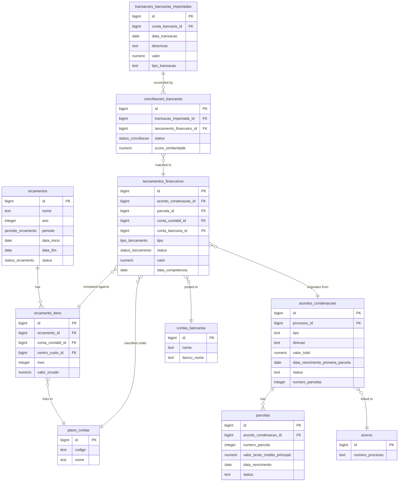

# Financial Tables

<cite>
**Referenced Files in This Document**   
- [20_acordos_condenacoes.sql](file://supabase/schemas/20_acordos_condenacoes.sql)
- [29_lancamentos_financeiros.sql](file://supabase/schemas/29_lancamentos_financeiros.sql)
- [31_conciliacao_bancaria.sql](file://supabase/schemas/31_conciliacao_bancaria.sql)
- [32_orcamento.sql](file://supabase/schemas/32_orcamento.sql)
- [01_enums.sql](file://supabase/schemas/01_enums.sql)
- [33_financeiro_functions.sql](file://supabase/schemas/33_financeiro_functions.sql)
- [34_financeiro_views.sql](file://supabase/schemas/34_financeiro_views.sql)
- [app/(dashboard)/financeiro/conciliacao-bancaria/page.tsx](file://app/(dashboard)/financeiro/conciliacao-bancaria/page.tsx)
- [app/(dashboard)/financeiro/orcamentos/page.tsx](file://app/(dashboard)/financeiro/orcamentos/page.tsx)
- [types/domain/financeiro.ts](file://types/domain/financeiro.ts)
</cite>

## Table of Contents
1. [Introduction](#introduction)
2. [acordos_condenacoes Table](#acordos_condenacoes-table)
3. [conciliacao_bancaria Table](#conciliacao_bancaria-table)
4. [orcamento Table](#orcamento-table)
5. [Relationships and Integration](#relationships-and-integration)
6. [Computed Columns and Constraints](#computed-columns-and-constraints)
7. [Sample Records](#sample-records)
8. [Conclusion](#conclusion)

## Introduction
This document provides comprehensive documentation for the financial management database tables in the Sinesys system. The focus is on three core financial tables: `acordos_condenacoes`, `conciliacao_bancaria`, and `orcamento`. These tables support critical financial processes including financial tracking, budgeting, and reconciliation. The documentation details each table's structure, fields, relationships, constraints, and business logic, providing a complete understanding of how financial data is managed within the application.

**Section sources**
- [20_acordos_condenacoes.sql](file://supabase/schemas/20_acordos_condenacoes.sql)
- [31_conciliacao_bancaria.sql](file://supabase/schemas/31_conciliacao_bancaria.sql)
- [32_orcamento.sql](file://supabase/schemas/32_orcamento.sql)

## acordos_condenacoes Table
The `acordos_condenacoes` table manages judicial agreements, condemnations, and court costs linked to legal processes. It serves as the primary record for financial obligations and receivables arising from legal cases, tracking the total value, payment terms, and status of these financial instruments.

### Core Fields
- **valor_total (NUMERIC)**: Stores the total monetary value of the agreement, condemnation, or court costs. A constraint ensures this value is always positive (`valor_total > 0`).
- **data_inicio (DATE)**: This field is not present in the current schema. The closest equivalent is `data_vencimento_primeira_parcela`, which records the due date of the first installment or the single payment.
- **data_fim (DATE)**: This field is not present in the current schema. The end date of an agreement is determined by the due date of its final installment.
- **status (ENUM)**: An ENUM field with values `pendente`, `pago_parcial`, `pago_total`, and `atrasado`. This status is automatically calculated based on the payment status of the individual installments in the related `parcelas` table.
- **cliente_id (foreign key)**: This field is not present in the current schema. The table links to a `processo_id` (from the `acervo` table), which is associated with a client. The financial relationship is therefore indirect, through the process.

### Additional Fields and Structure
The table includes several other important fields:
- **processo_id**: A foreign key linking the agreement to a specific legal process in the `acervo` table.
- **tipo**: An ENUM field (`acordo`, `condenacao`, `custas_processuais`) that categorizes the type of financial instrument.
- **direcao**: An ENUM field (`recebimento`, `pagamento`) indicating whether the law firm is receiving or making the payment.
- **numero_parcelas**: An integer specifying the number of installments, with a default of 1 for a single payment.
- **percentual_escritorio**: A NUMERIC field (default 30.00) that stores the percentage of contractual fees allocated to the law firm.
- **percentual_cliente**: A **computed column** that is generated as `100 - percentual_escritorio`, automatically calculating the client's share.

**Section sources**
- [20_acordos_condenacoes.sql](file://supabase/schemas/20_acordos_condenacoes.sql)
- [01_enums.sql](file://supabase/schemas/01_enums.sql)

## conciliacao_bancaria Table
The `conciliacao_bancaria` table (and its associated `transacoes_bancarias_importadas` table) facilitates the reconciliation of imported bank statement transactions with the system's financial ledger. This process ensures the accuracy of the financial records by matching external bank data with internal financial entries.

### Core Fields
- **conta_bancaria_id (foreign key)**: A foreign key referencing the `contas_bancarias` table, identifying the bank account from which the statement was imported.
- **periodo (DATE)**: This field is not directly present. The period is defined by the `data_transacao` field in the `transacoes_bancarias_importadas` table, which records the transaction date from the bank statement.
- **saldo_inicial**: This field is stored in the `transacoes_bancarias_importadas` table as `saldo_extrato`, which captures the account balance after the transaction as it appears on the bank statement.
- **saldo_final**: This field is not directly stored. The final balance for a period is calculated by the system based on the initial balance and the sum of all reconciled transactions.
- **status (ENUM)**: An ENUM field named `status` in the `conciliacoes_bancarias` table with values `pendente`, `conciliado`, `divergente`, and `ignorado`. This tracks the reconciliation status of each imported transaction.

### Reconciliation Process and Structure
The reconciliation process involves two main tables:
1.  **transacoes_bancarias_importadas**: Stores the raw data from imported bank statements (OFX/CSV). Key fields include `data_transacao`, `descricao`, `valor`, and `tipo_transacao` (crédito/débito).
2.  **conciliacoes_bancarias**: Stores the reconciliation records, linking an imported transaction (`transacao_importada_id`) to a financial ledger entry (`lancamento_financeiro_id`).

The system supports both automatic and manual reconciliation. An automatic process uses a `score_similaridade` (similarity score) to suggest potential matches between imported transactions and ledger entries. Users can then manually confirm, adjust, or ignore these suggestions.

**Section sources**
- [31_conciliacao_bancaria.sql](file://supabase/schemas/31_conciliacao_bancaria.sql)
- [01_enums.sql](file://supabase/schemas/01_enums.sql)
- [app/(dashboard)/financeiro/conciliacao-bancaria/page.tsx](file://app/(dashboard)/financeiro/conciliacao-bancaria/page.tsx)

## orcamento Table
The `orcamento` table manages the financial budgeting process, allowing the law firm to plan and track its income and expenses against predefined targets. It supports budgeting for different periods (monthly, quarterly, etc.) and provides a framework for financial performance analysis.

### Core Fields
- **ano (INTEGER)**: An integer field that specifies the year of the budget.
- **valor_total (NUMERIC)**: This field is not directly present in the `orcamentos` table. The total budgeted value is a **computed column** derived from the sum of all values in the related `orcamento_itens` table.
- **aprovado (BOOLEAN)**: This field is not present. The approval status is managed by the `status` ENUM field.
- **aprovado_por (UUID foreign key)**: This field is not present. The `created_by` field (a BIGINT referencing `usuarios.id`) identifies the user who created the budget, but there is no specific field to track who approved it.

### Budget Structure and Status
The budget is structured with the following key fields:
- **nome (text)**: A descriptive name for the budget (e.g., "Orçamento 2025").
- **periodo (ENUM)**: An ENUM field (`mensal`, `trimestral`, `semestral`, `anual`) that defines the budgeting period.
- **data_inicio (DATE) and data_fim (DATE)**: Define the start and end dates of the budget period.
- **status (ENUM)**: An ENUM field with values `rascunho`, `aprovado`, `em_execucao`, and `encerrado`. This tracks the lifecycle of the budget, from creation to closure.

The detailed budget items are stored in the `orcamento_itens` table, which breaks down the budget by `conta_contabil_id` (account) and `centro_custo_id` (cost center), allowing for granular financial planning.

**Section sources**
- [32_orcamento.sql](file://supabase/schemas/32_orcamento.sql)
- [01_enums.sql](file://supabase/schemas/01_enums.sql)
- [app/(dashboard)/financeiro/orcamentos/page.tsx](file://app/(dashboard)/financeiro/orcamentos/page.tsx)

## Relationships and Integration
The financial tables are interconnected and integrated with other entities in the Sinesys system to provide a comprehensive financial management solution.

### Primary Table Relationships
The three core tables are linked through the central `lancamentos_financeiros` (financial ledger) table:
- The `acordos_condenacoes` table generates financial entries in `lancamentos_financeiros` when installments are paid. The `lancamentos_financeiros` table has foreign keys `acordo_condenacao_id` and `parcela_id` to establish this link.
- The `conciliacao_bancaria` process directly links `transacoes_bancarias_importadas` to `lancamentos_financeiros` via the `lancamento_financeiro_id` field in the `conciliacoes_bancarias` table.
- The `orcamento` table is used to compare planned (`orcamento_itens.valor_orcado`) versus actual (`lancamentos_financeiros.valor`) financial performance. This comparison is facilitated by the shared `conta_contabil_id` field.



**Diagram sources **
- [32_orcamento.sql](file://supabase/schemas/32_orcamento.sql)
- [20_acordos_condenacoes.sql](file://supabase/schemas/20_acordos_condenacoes.sql)
- [31_conciliacao_bancaria.sql](file://supabase/schemas/31_conciliacao_bancaria.sql)
- [29_lancamentos_financeiros.sql](file://supabase/schemas/29_lancamentos_financeiros.sql)
- [28_contas_bancarias.sql](file://supabase/schemas/28_contas_bancarias.sql)
- [26_plano_contas.sql](file://supabase/schemas/26_plano_contas.sql)
- [04_acervo.sql](file://supabase/schemas/04_acervo.sql)

### Integration with Other Financial Entities
These tables are part of a larger financial ecosystem:
- **Plano de Contas**: Both `lancamentos_financeiros` and `orcamento_itens` are linked to the `plano_contas` table, ensuring all financial data is classified under a standardized chart of accounts.
- **Contas Bancárias**: The `lancamentos_financeiros` and `transacoes_bancarias_importadas` tables are linked to `contas_bancarias`, enabling the tracking of cash flow and bank balances.
- **Folha de Pagamento**: The `lancamentos_financeiros` table integrates with the `folhas_pagamento` system, where salary payments are recorded as financial entries.
- **Contas a Pagar/Receber**: The `lancamentos_financeiros` table serves as the general ledger for all financial transactions, including those originating from accounts payable and receivable modules.

**Section sources**
- [29_lancamentos_financeiros.sql](file://supabase/schemas/29_lancamentos_financeiros.sql)
- [28_contas_bancarias.sql](file://supabase/schemas/28_contas_bancarias.sql)
- [26_plano_contas.sql](file://supabase/schemas/26_plano_contas.sql)
- [30_salarios.sql](file://supabase/schemas/30_salarios.sql)

## Computed Columns and Constraints
The financial tables employ computed columns and constraints to ensure data integrity, automate calculations, and enforce business rules.

### Computed Columns
- **percentual_cliente**: In the `acordos_condenacoes` table, this column is defined as `generated always as (100 - percentual_escritorio) stored`. This ensures the client's share is always the complement of the firm's percentage, preventing calculation errors.
- **valor_total (orcamento)**: While not a database-level computed column, the total budgeted value is dynamically calculated by summing the `valor_orcado` from all related `orcamento_itens`. This is implemented in application logic and database views.
- **status fields**: The `status` fields in `acordos_condenacoes` and `orcamentos` are effectively computed based on business logic. The agreement status is calculated from its installments, and the budget status is updated through user actions (approve, start, close).

### Data Integrity Constraints
The tables use a comprehensive set of constraints:
- **Check Constraints**: These enforce business rules, such as `valor_total > 0` for positive amounts, `mes_referencia between 1 and 12` for valid months, and `status in ('rascunho', 'aprovada', 'paga')` for valid states.
- **Foreign Key Constraints**: These maintain referential integrity, ensuring that `processo_id` points to a valid process, `conta_bancaria_id` points to a valid bank account, and `conta_contabil_id` points to a valid account in the chart of accounts.
- **Unique Constraints**: These prevent duplicate entries, such as `constraint orcamentos_periodo_unique unique (mes_referencia, ano_referencia)` to prevent two budgets for the same month/year.
- **Triggers**: Database triggers are used for critical operations. For example, the `atualizar_saldo_conta_bancaria` function automatically updates the `saldo_atual` in the `contas_bancarias` table whenever a financial entry is confirmed or canceled, ensuring the bank balance is always accurate.

**Section sources**
- [20_acordos_condenacoes.sql](file://supabase/schemas/20_acordos_condenacoes.sql)
- [31_conciliacao_bancaria.sql](file://supabase/schemas/31_conciliacao_bancaria.sql)
- [32_orcamento.sql](file://supabase/schemas/32_orcamento.sql)
- [33_financeiro_functions.sql](file://supabase/schemas/33_financeiro_functions.sql)

## Sample Records
The following examples illustrate typical data for each table, demonstrating how they are used in practice.

### acordos_condenacoes Sample
This record represents a settlement agreement for a legal case.

```json
{
  "id": 101,
  "processo_id": 5001,
  "tipo": "acordo",
  "direcao": "recebimento",
  "valor_total": 50000.00,
  "data_vencimento_primeira_parcela": "2025-01-15",
  "status": "pago_parcial",
  "numero_parcelas": 10,
  "percentual_escritorio": 30.00,
  "percentual_cliente": 70.00,
  "honorarios_sucumbenciais_total": 15000.00
}
```

### conciliacao_bancaria Sample
This record shows a reconciled bank transaction for an office rent payment.

```json
{
  "transacao_importada": {
    "id": 2001,
    "conta_bancaria_id": 301,
    "data_transacao": "2025-01-10",
    "descricao": "PAGTO ALUGUEL JAN/2025",
    "valor": 8000.00,
    "tipo_transacao": "debito"
  },
  "conciliacao": {
    "id": 1501,
    "transacao_importada_id": 2001,
    "lancamento_financeiro_id": 9005,
    "status": "conciliado",
    "tipo_conciliacao": "manual",
    "data_conciliacao": "2025-01-11T14:30:00Z"
  }
}
```

### orcamento Sample
This record defines an annual budget for the year 2025.

```json
{
  "orcamento": {
    "id": 50,
    "nome": "Orçamento 2025",
    "ano": 2025,
    "periodo": "anual",
    "data_inicio": "2025-01-01",
    "data_fim": "2025-12-31",
    "status": "aprovado"
  },
  "itens": [
    {
      "conta_contabil_id": 4001,
      "centro_custo_id": 101,
      "valor_orcado": 120000.00
    },
    {
      "conta_contabil_id": 5001,
      "centro_custo_id": 101,
      "valor_orcado": 48000.00
    }
  ]
}
```

**Section sources**
- [20_acordos_condenacoes.sql](file://supabase/schemas/20_acordos_condenacoes.sql)
- [31_conciliacao_bancaria.sql](file://supabase/schemas/31_conciliacao_bancaria.sql)
- [32_orcamento.sql](file://supabase/schemas/32_orcamento.sql)

## Conclusion
The `acordos_condenacoes`, `conciliacao_bancaria`, and `orcamento` tables form the backbone of the financial management system in Sinesys. The `acordos_condenacoes` table provides a structured way to manage financial outcomes from legal cases, linking them directly to processes and generating ledger entries. The `conciliacao_bancaria` module ensures the accuracy of financial records by reconciling internal ledger entries with external bank statements, a critical control for financial integrity. Finally, the `orcamento` table enables proactive financial planning and performance analysis by allowing the firm to set budgetary targets and compare them against actual results. Together, these tables, supported by robust constraints, computed fields, and integration with other financial entities, provide a comprehensive solution for financial tracking, budgeting, and reconciliation within the application.

**Section sources**
- [20_acordos_condenacoes.sql](file://supabase/schemas/20_acordos_condenacoes.sql)
- [31_conciliacao_bancaria.sql](file://supabase/schemas/31_conciliacao_bancaria.sql)
- [32_orcamento.sql](file://supabase/schemas/32_orcamento.sql)