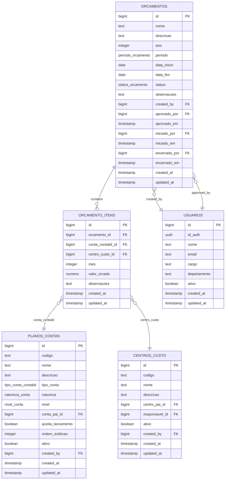

# Orçamento Table

<cite>
**Referenced Files in This Document**   
- [32_orcamento.sql](file://supabase/schemas/32_orcamento.sql)
- [orcamento-persistence.service.ts](file://backend/financeiro/orcamento/services/persistence/orcamento-persistence.service.ts)
- [export-orcamento.ts](file://app/_lib/orcamentos/export-orcamento.ts)
- [orcamento.types.ts](file://backend/types/financeiro/orcamento.types.ts)
- [aprovar-orcamento.service.ts](file://backend/financeiro/orcamento/services/orcamento/aprovar-orcamento.service.ts)
- [centros_custo.sql](file://supabase/schemas/27_centros_custo.sql)
- [plano_contas.sql](file://supabase/schemas/26_plano_contas.sql)
</cite>

## Table of Contents
1. [Introduction](#introduction)
2. [Core Fields](#core-fields)
3. [Business Rules and Constraints](#business-rules-and-constraints)
4. [Relationships with Other Tables](#relationships-with-other-tables)
5. [Data Usage and Application](#data-usage-and-application)
6. [Sample Records](#sample-records)
7. [Conclusion](#conclusion)

## Introduction
The `orcamentos` table in the Sinesys financial planning system serves as the central component for managing annual and periodic budgets within a law firm or legal practice. This comprehensive data model enables detailed financial planning, budget approval workflows, and expenditure tracking across various accounting periods. The table supports both annual and segmented budgeting (monthly, quarterly, semi-annual) through its flexible period definition, allowing organizations to plan finances according to their specific operational cycles.

The system is designed to support the complete budget lifecycle from creation through execution and closure. Each budget has a defined status that controls its progression: draft (rascunho) for creation, approved (aprovado) for validation, in execution (em_execucao) during the current period, and closed (encerrado) when the period is finalized. This status-driven workflow ensures proper governance and control over financial planning processes.

**Section sources**
- [32_orcamento.sql](file://supabase/schemas/32_orcamento.sql#L1-L45)

## Core Fields
The `orcamentos` table contains several key fields that define the essential characteristics of each budget:

- **id**: A unique identifier for each budget record, automatically generated as a bigint identity value. This serves as the primary key for the table.
- **nome**: A text field containing the name of the budget (e.g., "Orçamento 2025", "Orçamento 1º Semestre 2025"), providing a human-readable identifier.
- **descricao**: An optional text field for detailed description of the budget's purpose and scope.
- **ano**: An integer field representing the reference year of the budget, with a constraint ensuring values are 2020 or later.
- **periodo**: A field of type `public.periodo_orcamento` enum that specifies the budget period: monthly, quarterly, semi-annual, or annual.
- **data_inicio** and **data_fim**: Date fields defining the start and end dates of the budget period, with a constraint ensuring the end date is after the start date.
- **status**: A field of type `public.status_orcamento` enum that tracks the budget lifecycle: rascunho (draft), aprovado (approved), em_execucao (in execution), or encerrado (closed).
- **observacoes**: An optional text field for additional notes about the budget.
- **created_by**: A foreign key reference to the `usuarios` table, identifying the user who created the budget.
- **created_at** and **updated_at**: Timestamp fields with time zone that automatically record creation and last update times, with triggers to update `updated_at` on modifications.

The table also includes foreign key relationships to track approval and execution details, including `aprovado_por` (who approved the budget), `aprovado_em` (when it was approved), `iniciado_por` (who initiated execution), and `encerrado_por` (who closed the budget).

**Section sources**
- [32_orcamento.sql](file://supabase/schemas/32_orcamento.sql#L15-L60)
- [orcamento-persistence.service.ts](file://backend/financeiro/orcamento/services/persistence/orcamento-persistence.service.ts#L45-L64)

## Business Rules and Constraints
The `orcamentos` table implements several business rules and constraints to ensure data integrity and enforce financial planning policies:

- **Year Validation**: A check constraint `orcamentos_ano_valido` ensures that the `ano` field contains values of 2020 or later, preventing historical budget planning that might not conform to current accounting standards.
- **Period Validation**: A check constraint `orcamentos_periodo_valido` ensures that `data_fim` is always after `data_inicio`, preventing invalid date ranges.
- **Unique Year Constraint**: While not explicitly stated in the schema, the application logic prevents duplicate annual budgets through business rules validation.
- **Status Transitions**: The system enforces proper workflow progression, where budgets must be in "rascunho" status before approval, and cannot be modified once closed.
- **Approval Rules**: When a budget is approved (`aprovado` status), the `aprovado_por` field cannot be null and must reference a valid user. This ensures accountability in the approval process.
- **Positive Value Validation**: The related `orcamento_itens` table has a constraint `orcamento_itens_valor_valido` that ensures all budgeted values are non-negative, effectively requiring positive values for meaningful budgeting.

The system also includes validation in the application layer, where a budget cannot be approved if it has no items or if the total budgeted value is zero or negative. Additionally, budgets cannot be approved if their start date has already passed, ensuring forward-looking financial planning.

**Diagram sources **
- [32_orcamento.sql](file://supabase/schemas/32_orcamento.sql#L15-L114)
- [27_centros_custo.sql](file://supabase/schemas/27_centros_custo.sql#L15-L40)
- [26_plano_contas.sql](file://supabase/schemas/26_plano_contas.sql#L15-L48)

**Section sources**
- [32_orcamento.sql](file://supabase/schemas/32_orcamento.sql#L39-L60)
- [aprovar-orcamento.service.ts](file://backend/financeiro/orcamento/services/orcamento/aprovar-orcamento.service.ts#L100-L149)
- [orcamento.types.ts](file://backend/types/financeiro/orcamento.types.ts#L503-L533)

## Relationships with Other Tables
The `orcamentos` table maintains critical relationships with several other tables in the financial system, creating a comprehensive budgeting and financial tracking framework:

- **orcamento_itens**: This is a one-to-many relationship where each budget can have multiple budget items. The `orcamento_id` field in `orcamento_itens` references the `id` field in `orcamentos` with cascade delete, ensuring that when a budget is deleted, all its items are automatically removed. This relationship allows for detailed budget breakdowns by accounting category and cost center.
- **plano_contas**: The budget items are linked to the chart of accounts through the `conta_contabil_id` field, which references the `plano_contas` table. This integration enables budgeting by specific accounting categories such as revenue, expenses, assets, and liabilities.
- **centros_custo**: Budget items can be allocated to specific cost centers through the `centro_custo_id` field, which references the `centros_custo` table. This allows for budget tracking by department, project, or business unit, supporting decentralized financial management.
- **usuarios**: The budget table maintains relationships with users for audit and accountability purposes. The `created_by` field identifies who created the budget, while `aprovado_por`, `iniciado_por`, and `encerrado_por` fields track who performed key workflow actions.

The `orcamento_itens` table itself has a composite unique constraint on `(orcamento_id, conta_contabil_id, centro_custo_id, mes)`, preventing duplicate budget entries for the same account, cost center, and month combination. This ensures data integrity in the budget allocation process.

**Section sources**
- [32_orcamento.sql](file://supabase/schemas/32_orcamento.sql#L93-L113)
- [centros_custo.sql](file://supabase/schemas/27_centros_custo.sql#L15-L40)
- [plano_contas.sql](file://supabase/schemas/26_plano_contas.sql#L15-L48)

## Data Usage and Application
The `orcamentos` table plays a central role in the financial planning and control processes within the Sinesys system. It supports several key business functions:

- **Financial Planning**: The table enables comprehensive budget creation for annual or periodic financial planning. Users can create budgets with specific timeframes and allocate funds across different accounting categories and cost centers.
- **Budget Approval Workflows**: The status field and approval tracking fields support a formal budget approval process. Budgets start as drafts, require approval before execution, and maintain an audit trail of who approved them and when.
- **Expenditure Tracking**: By linking budget items to specific accounts and cost centers, the system enables detailed tracking of actual expenditures against budgeted amounts, facilitating variance analysis.
- **Financial Forecasting**: Historical budget data can be used for financial forecasting and trend analysis, helping organizations make informed decisions about future resource allocation.
- **Reporting and Analysis**: The system provides various reports that leverage budget data, including budget vs. actual comparisons, trend analysis, and executive summaries. The `export-orcamento.ts` file contains functionality for exporting budget data in CSV and PDF formats for external analysis.

The data is used throughout the application's financial control processes, from initial budget creation through execution monitoring and final closure. The system supports comparison between budgeted and actual figures, enabling financial managers to identify variances and take corrective actions when necessary.

**Section sources**
- [export-orcamento.ts](file://app/_lib/orcamentos/export-orcamento.ts#L1-L800)
- [32_orcamento.sql](file://supabase/schemas/32_orcamento.sql#L44-L45)

## Sample Records
The following examples illustrate typical records in the `orcamentos` table:

**Annual Budget Record:**
- id: 1001
- nome: "Orçamento Anual 2025"
- descricao: "Orçamento principal para o ano fiscal de 2025"
- ano: 2025
- periodo: "anual"
- data_inicio: "2025-01-01"
- data_fim: "2025-12-31"
- status: "aprovado"
- observacoes: "Inclui aumento de 10% em despesas operacionais"
- created_by: 501
- aprovado_por: 502
- aprovado_em: "2024-11-15 14:30:00"
- created_at: "2024-10-01 09:15:00"
- updated_at: "2024-11-15 14:30:00"

**Quarterly Budget Record:**
- id: 1002
- nome: "Orçamento Q1 2025"
- descricao: "Planejamento financeiro para o primeiro trimestre de 2025"
- ano: 2025
- periodo: "trimestral"
- data_inicio: "2025-01-01"
- data_fim: "2025-03-31"
- status: "rascunho"
- observacoes: "Em revisão com departamentos"
- created_by: 503
- created_at: "2024-12-01 10:20:00"
- updated_at: "2024-12-01 10:20:00"

These records demonstrate how the table supports different budgeting periods and tracks the complete lifecycle of each budget, from creation through approval and execution.

**Section sources**
- [32_orcamento.sql](file://supabase/schemas/32_orcamento.sql#L15-L60)

## Conclusion
The `orcamentos` table in the Sinesys financial planning system provides a robust foundation for comprehensive budget management. Its well-designed schema supports the complete budget lifecycle, from initial planning through approval, execution, and closure. The table's relationships with accounting categories and cost centers enable detailed financial planning and tracking, while its built-in constraints and business rules ensure data integrity and enforce proper financial governance.

The system's design facilitates both strategic annual planning and tactical periodic budgeting, making it adaptable to various organizational needs. The integration with user management provides accountability through audit trails, and the support for detailed budget items allows for granular financial control. This comprehensive approach to budget management helps organizations maintain financial discipline, track performance against plans, and make informed decisions based on accurate financial data.

**Section sources**
- [32_orcamento.sql](file://supabase/schemas/32_orcamento.sql#L1-L216)