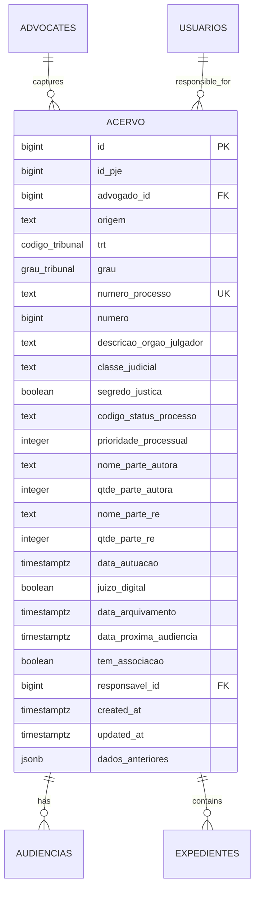
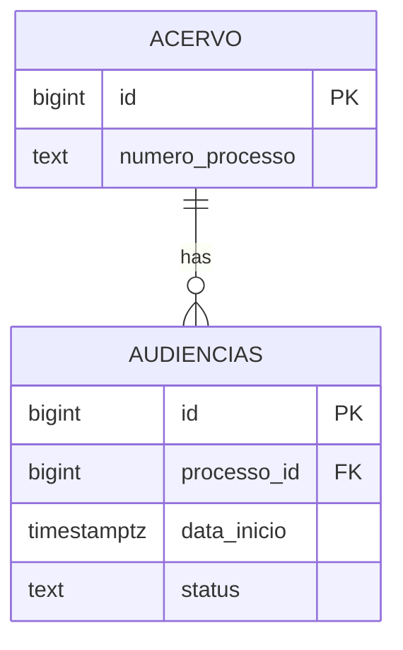
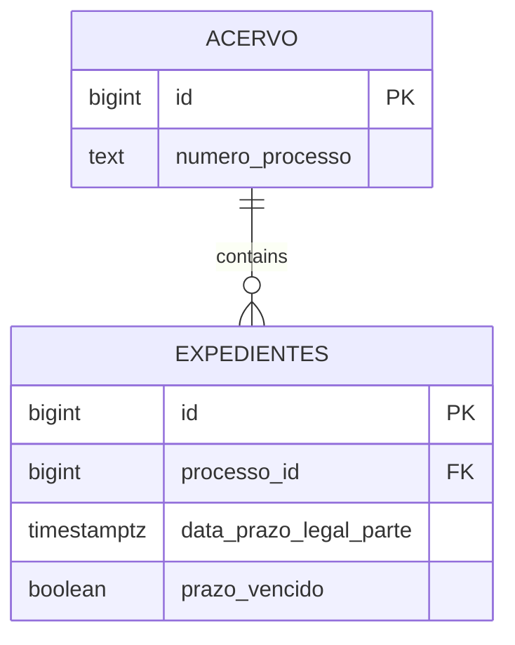

# Acervo Table

<cite>
**Referenced Files in This Document**   
- [04_acervo.sql](file://supabase/schemas/04_acervo.sql)
- [05_acervo_unificado_view.sql](file://supabase/schemas/05_acervo_unificado_view.sql)
- [acervo.ts](file://types/domain/acervo.ts)
- [acervo.ts](file://types/contracts/acervo.ts)
- [07_audiencias.sql](file://supabase/schemas/07_audiencias.sql)
- [06_expedientes.sql](file://supabase/schemas/06_expedientes.sql)
- [add_dados_anteriores_auditoria.sql](file://supabase/migrations/aplicadas/add_dados_anteriores_auditoria.sql)
- [fix_acervo_classe_judicial.sql](file://supabase/migrations/aplicadas/20251122000001_fix_acervo_classe_judicial.sql)
</cite>

## Table of Contents
1. [Introduction](#introduction)
2. [Entity Structure](#entity-structure)
3. [Field Definitions](#field-definitions)
4. [Constraints and Indexes](#constraints-and-indexes)
5. [Relationships with Other Tables](#relationships-with-other-tables)
6. [Data Integrity Triggers](#data-integrity-triggers)
7. [Integration with PJE-TRT System](#integration-with-pje-trt-system)
8. [Dashboard Integration and Visualizations](#dashboard-integration-and-visualizations)
9. [Data Lifecycle and Performance Optimization](#data-lifecycle-and-performance-optimization)
10. [Sample Records](#sample-records)

## Introduction

The acervo table is the central data structure in the Sinesys legal management system, serving as the primary repository for all legal processes captured from the PJE-TRT (Processo Judicial Eletrônico - Tribunal Regional do Trabalho) system. This comprehensive data model tracks legal cases throughout their lifecycle, from initial filing to final disposition, providing a unified view of case information across multiple jurisdictions and instances.

The table is designed to support complex legal workflows by capturing essential case metadata, maintaining relationships with related entities such as hearings (audiencias) and procedural documents (expedientes), and enabling efficient data retrieval for both operational and analytical purposes. The acervo table plays a critical role in the system's ability to provide real-time insights into case status, facilitate compliance monitoring, and support strategic decision-making for legal teams.

This documentation provides a detailed analysis of the acervo table's structure, functionality, and integration points within the broader Sinesys ecosystem.

## Entity Structure

The acervo table represents the core entity for legal process tracking in the Sinesys system, containing comprehensive information about each legal case. The table is structured to capture both static case attributes and dynamic process information, enabling holistic case management.



**Diagram sources**
- [04_acervo.sql](file://supabase/schemas/04_acervo.sql#L4-L32)
- [07_audiencias.sql](file://supabase/schemas/07_audiencias.sql#L4-L46)
- [06_expedientes.sql](file://supabase/schemas/06_expedientes.sql#L6-L50)

**Section sources**
- [04_acervo.sql](file://supabase/schemas/04_acervo.sql#L4-L32)
- [acervo.ts](file://types/domain/acervo.ts#L15-L42)

## Field Definitions

The acervo table contains a comprehensive set of fields that capture essential information about legal processes. Each field serves a specific purpose in tracking and managing cases within the legal system.

### Primary Key and Identification Fields
- **id**: Auto-generated primary key for the record (bigint, generated always as identity)
- **id_pje**: Unique identifier of the process within the PJE system (bigint, not null)
- **numero_processo**: Official case number in CNJ format (text, not null, unique constraint with trt and grau)

### Jurisdiction and Classification Fields
- **trt**: Code of the Regional Labor Court where the case is being processed (codigo_tribunal enum, not null)
- **grau**: Judicial instance of the case, either first or second degree (grau_tribunal enum, not null)
- **classe_judicial**: Legal classification of the case (text, not null)
- **descricao_orgao_julgador**: Full description of the adjudicating body (text, not null)

### Party Information Fields
- **nome_parte_autora**: Name of the plaintiff party (text, not null)
- **qtde_parte_autora**: Number of plaintiffs in the case (integer, not null, default 1)
- **nome_parte_re**: Name of the defendant party (text, not null)
- **qtde_parte_re**: Number of defendants in the case (integer, not null, default 1)

### Temporal and Status Fields
- **data_autuacao**: Date and time when the case was filed (timestamptz, not null)
- **data_arquivamento**: Date and time when the case was archived (timestamptz, nullable)
- **data_proxima_audiencia**: Scheduled date and time of the next hearing (timestamptz, nullable)
- **codigo_status_processo**: Current status code of the case (text, not null)
- **prioridade_processual**: Priority level assigned to the case (integer, not null, default 0)
- **segredo_justica**: Boolean flag indicating if the case is under judicial secrecy (boolean, not null, default false)
- **juizo_digital**: Boolean flag indicating if the case is being processed in a digital court (boolean, not null, default false)

### Management and Metadata Fields
- **advogado_id**: Foreign key referencing the attorney who captured the case (bigint, references advogados table)
- **responsavel_id**: Foreign key referencing the user responsible for managing the case (bigint, references usuarios table, nullable)
- **origem**: Source of the case record, either "acervo_geral" (active cases) or "arquivado" (archived cases) (text, not null, check constraint)
- **created_at**: Timestamp when the record was created (timestamptz, default now(), not null)
- **updated_at**: Timestamp when the record was last updated (timestamptz, default now(), not null)
- **dados_anteriores**: JSONB field storing the previous state of the record before updates, used for audit purposes (jsonb, nullable)

**Section sources**
- [04_acervo.sql](file://supabase/schemas/04_acervo.sql#L4-L43)
- [acervo.ts](file://types/domain/acervo.ts#L15-L42)
- [fix_acervo_classe_judicial.sql](file://supabase/migrations/aplicadas/20251122000001_fix_acervo_classe_judicial.sql#L1-L27)

## Constraints and Indexes

The acervo table implements several constraints and indexes to ensure data integrity, enforce business rules, and optimize query performance.

### Primary Key and Unique Constraints
The table has a primary key constraint on the auto-generated `id` field, ensuring each record has a unique identifier. Additionally, a composite unique constraint is defined on the combination of `id_pje`, `trt`, `grau`, and `numero_processo` fields to prevent duplicate entries for the same case across different instances.

```sql
unique (id_pje, trt, grau, numero_processo)
```

This constraint ensures that even if multiple attorneys are handling the same case, there will be only one record per case instance in the system.

### Check Constraints
The table includes check constraints to validate data integrity:
- The `origem` field is constrained to accept only two values: 'acervo_geral' or 'arquivado'
- The `grau` field references the `grau_tribunal` enum type, ensuring only valid judicial instances are recorded

### Indexes for Performance Optimization
Multiple indexes have been created to optimize query performance for common access patterns:

```sql
create index idx_acervo_advogado_id on public.acervo using btree (advogado_id);
create index idx_acervo_origem on public.acervo using btree (origem);
create index idx_acervo_trt on public.acervo using btree (trt);
create index idx_acervo_grau on public.acervo using btree (grau);
create index idx_acervo_numero_processo on public.acervo using btree (numero_processo);
create index idx_acervo_id_pje on public.acervo using btree (id_pje);
create index idx_acervo_data_autuacao on public.acervo using btree (data_autuacao);
create index idx_acervo_data_arquivamento on public.acervo using btree (data_arquivamento);
create index idx_acervo_advogado_trt_grau on public.acervo using btree (advogado_id, trt, grau);
create index idx_acervo_numero_processo_trt_grau on public.acervo using btree (numero_processo, trt, grau);
```

These indexes support efficient filtering by attorney, court, case number, status, and date ranges, which are common query patterns in the application.

**Section sources**
- [04_acervo.sql](file://supabase/schemas/04_acervo.sql#L31-L67)
- [04_acervo.sql](file://supabase/schemas/04_acervo.sql#L57-L67)

## Relationships with Other Tables

The acervo table serves as the central hub in the legal process data model, establishing relationships with several other entities that represent different aspects of case management.

### One-to-Many Relationships
The acervo table has one-to-many relationships with the following tables:

#### Audiencias (Hearings)
Each legal process can have multiple scheduled hearings. The relationship is established through the `processo_id` foreign key in the audiencias table, which references the `id` field in the acervo table.



This relationship enables tracking of all scheduled hearings for a case, including their dates, statuses, and other relevant details.

#### Expedientes (Procedural Documents)
Each legal process can contain multiple procedural documents or pending actions. The relationship is established through the `processo_id` foreign key in the expedientes table, which references the `id` field in the acervo table.



This relationship allows for comprehensive tracking of all pending actions and procedural documents associated with a case.

### Foreign Key Relationships
The acervo table also establishes relationships with reference tables:

#### Advogados (Attorneys)
The `advogado_id` field references the advogados table, establishing which attorney captured and is responsible for monitoring the case.

#### Usuarios (Users)
The `responsavel_id` field references the usuarios table, indicating which system user is currently responsible for managing the case.

**Diagram sources**
- [07_audiencias.sql](file://supabase/schemas/07_audiencias.sql#L8)
- [06_expedientes.sql](file://supabase/schemas/06_expedientes.sql#L10)

**Section sources**
- [07_audiencias.sql](file://supabase/schemas/07_audiencias.sql#L4-L46)
- [06_expedientes.sql](file://supabase/schemas/06_expedientes.sql#L6-L50)

## Data Integrity Triggers

The acervo table implements several triggers to maintain data integrity and automate routine maintenance tasks.

### Updated Timestamp Trigger
A trigger is defined to automatically update the `updated_at` timestamp whenever a record is modified:

```sql
create trigger update_acervo_updated_at
before update on public.acervo
for each row
execute function public.update_updated_at_column();
```

This trigger ensures that the `updated_at` field always reflects the most recent modification time of the record, providing an audit trail for when changes were made.

### Audit Trail Trigger
The table includes a column `dados_anteriores` of type JSONB that stores the previous state of the record before updates. This field is populated by a mechanism that captures the pre-update state of the record, enabling comprehensive audit capabilities.

```sql
alter table public.acervo
add column dados_anteriores jsonb;
```

This audit functionality allows tracking of changes to case information over time, which is critical for compliance and accountability in legal practice.

### Row Level Security
The table has Row Level Security (RLS) enabled to control access to case data:

```sql
alter table public.acervo enable row level security;
```

This security feature ensures that users can only access case records according to their permissions, protecting sensitive legal information.

**Section sources**
- [04_acervo.sql](file://supabase/schemas/04_acervo.sql#L69-L75)
- [add_dados_anteriores_auditoria.sql](file://supabase/migrations/aplicadas/add_dados_anteriores_auditoria.sql#L6-L9)
- [04_acervo.sql](file://supabase/schemas/04_acervo.sql#L74-L75)

## Integration with PJE-TRT System

The acervo table is central to the integration between the Sinesys system and the PJE-TRT (Processo Judicial Eletrônico - Tribunal Regional do Trabalho) platform. This integration enables automated data capture and synchronization of legal process information from the official court system.

### Data Capture Process
The integration follows a systematic process for capturing case data:

1. **Authentication**: The system authenticates with the PJE-TRT platform using credentials stored securely in the database.
2. **Case Identification**: The system identifies cases to capture based on user configurations and monitoring criteria.
3. **Data Extraction**: Case details are extracted from the PJE-TRT interface through automated scraping or API calls.
4. **Data Normalization**: Extracted data is normalized and mapped to the acervo table schema.
5. **Record Creation/Update**: New cases are inserted into the acervo table, while existing cases are updated with the latest information.

### Synchronization Mechanism
The system implements a periodic synchronization process that ensures the acervo table remains up-to-date with the latest case information from PJE-TRT. This process includes:

- **Incremental Updates**: Only changed records are synchronized, minimizing network traffic and processing time.
- **Conflict Resolution**: When discrepancies are detected between local and remote data, the system applies predefined rules to resolve conflicts.
- **Error Handling**: Failed synchronization attempts are logged and retried according to a backoff strategy.

### Data Enrichment
Beyond basic case information, the integration enriches the acervo records with additional context:

- **Timeline Integration**: The system captures the complete history of case events and stores references to this timeline.
- **Document References**: Links to important case documents are extracted and stored for quick access.
- **Hearing Schedules**: Upcoming hearings are identified and linked to the corresponding case record.

This integration enables legal teams to have a comprehensive, real-time view of their cases without manually monitoring the PJE-TRT platform.

**Section sources**
- [04_acervo.sql](file://supabase/schemas/04_acervo.sql)
- [07_audiencias.sql](file://supabase/schemas/07_audiencias.sql)
- [06_expedientes.sql](file://supabase/schemas/06_expedientes.sql)

## Dashboard Integration and Visualizations

The acervo table serves as the primary data source for various dashboard visualizations that provide insights into case portfolios and workflow metrics.

### Unified Process View
The system implements a materialized view called `acervo_unificado` that consolidates multiple instances of the same case (e.g., first degree and second degree) into a single, coherent representation:

```sql
create materialized view public.acervo_unificado as
with instancias_agrupadas as (
  select
    a.id,
    a.id_pje,
    a.advogado_id,
    a.origem,
    a.trt,
    a.grau,
    a.numero_processo,
    -- ... other fields
    row_number() over (
      partition by a.numero_processo, a.advogado_id
      order by a.data_autuacao desc, a.updated_at desc
    ) as rn_grau_atual,
    jsonb_agg(
      jsonb_build_object(
        'id', a.id,
        'grau', a.grau,
        'origem', a.origem,
        'trt', a.trt,
        'data_autuacao', a.data_autuacao,
        'updated_at', a.updated_at
      )
    ) over (
      partition by a.numero_processo, a.advogado_id
    ) as instances_json
  from public.acervo a
)
-- ... additional CTEs and final select
```

This view enables dashboards to display cases in a unified manner, showing the current status across all instances while preserving the complete history.

### Performance Metrics
The acervo table supports various performance metrics tracked in the system's dashboards:

- **Case Volume**: Total number of active and archived cases
- **Jurisdiction Distribution**: Cases grouped by TRT (Regional Labor Court)
- **Status Distribution**: Cases grouped by current status
- **Temporal Trends**: Cases grouped by filing date (monthly, quarterly)
- **Workload Distribution**: Cases assigned to different responsible users

These metrics are calculated using aggregate queries on the acervo table, often combined with filtering by date ranges, jurisdictions, or user assignments.

### Interactive Filtering
Dashboards leverage the indexes on the acervo table to provide responsive, interactive filtering capabilities:

- **Quick Search**: Full-text search across case numbers and party names
- **Advanced Filters**: Combination filters by court, status, date ranges, and responsible users
- **Real-time Updates**: Changes to case status are reflected in dashboards with minimal latency

The combination of comprehensive indexing and optimized queries ensures that even with large datasets, dashboard interactions remain responsive.

**Section sources**
- [05_acervo_unificado_view.sql](file://supabase/schemas/05_acervo_unificado_view.sql#L35-L142)
- [dashboard-metricas.persistence.ts](file://backend/dashboard/services/persistence/dashboard-metricas.persistence.ts#L32-L50)

## Data Lifecycle and Performance Optimization

The acervo table is designed with considerations for both data lifecycle management and performance optimization, particularly when handling large datasets.

### Data Lifecycle Management
The table supports a comprehensive data lifecycle that tracks cases from initial filing through final disposition:

1. **Active Cases**: Cases in the "acervo_geral" originate as active matters requiring ongoing attention.
2. **Archived Cases**: When cases are concluded, they are moved to the "arquivado" origin, preserving historical information while separating active from inactive matters.
3. **Audit Trail**: The `dados_anteriores` field maintains a history of changes, allowing reconstruction of the case state at any point in time.

This lifecycle approach enables efficient management of case portfolios, with clear separation between active and historical matters.

### Performance Optimization Strategies
Several strategies are employed to ensure optimal performance with large datasets:

#### Materialized Views
The `acervo_unificado` materialized view pre-computes the aggregation of multiple case instances, significantly improving query performance for unified case views:

```sql
create materialized view public.acervo_unificado as
-- ... complex aggregation query
```

This view is refreshed periodically or on-demand, balancing data freshness with query performance.

#### Comprehensive Indexing
The table employs a multi-faceted indexing strategy to support various query patterns:

- **Single-column indexes** for individual field filtering
- **Composite indexes** for common filter combinations
- **Partial indexes** for frequently queried subsets

#### Query Optimization
The system implements several query optimization techniques:

- **Pagination**: Large result sets are paginated to minimize memory usage
- **Selective Field Projection**: Queries retrieve only the fields needed for the specific use case
- **Caching**: Frequently accessed data is cached at multiple levels (database, application, client)

### Scalability Considerations
The design accommodates scalability requirements through:

- **Partitioning Strategy**: While not explicitly shown, the structure supports potential partitioning by date or jurisdiction
- **Concurrency Control**: The use of row-level security and proper indexing supports concurrent access by multiple users
- **Data Archiving**: The distinction between active and archived cases allows for potential archival of older records to separate storage

These optimizations ensure that the system remains responsive and reliable even as the volume of legal cases grows over time.

**Section sources**
- [05_acervo_unificado_view.sql](file://supabase/schemas/05_acervo_unificado_view.sql)
- [04_acervo.sql](file://supabase/schemas/04_acervo.sql#L57-L67)
- [add_dados_anteriores_auditoria.sql](file://supabase/migrations/aplicadas/add_dados_anteriores_auditoria.sql#L6-L9)

## Sample Records

The following examples illustrate typical records in the acervo table, demonstrating how the data model represents real-world legal processes.

### Active Labor Case
```json
{
  "id": 1001,
  "id_pje": 500123,
  "advogado_id": 201,
  "origem": "acervo_geral",
  "trt": "TRT1",
  "grau": "primeiro_grau",
  "numero_processo": "0101450-28.2025.5.01.0431",
  "numero": 1450,
  "descricao_orgao_julgador": "Vara do Trabalho de São Paulo",
  "classe_judicial": "ATOrd",
  "segredo_justica": false,
  "codigo_status_processo": "DISTRIBUIDO",
  "prioridade_processual": 1,
  "nome_parte_autora": "João Silva",
  "qtde_parte_autora": 1,
  "nome_parte_re": "Empresa ABC Ltda",
  "qtde_parte_re": 1,
  "data_autuacao": "2025-01-15T10:30:00Z",
  "juizo_digital": true,
  "data_arquivamento": null,
  "data_proxima_audiencia": "2025-02-20T14:00:00Z",
  "tem_associacao": false,
  "responsavel_id": 305,
  "created_at": "2025-01-15T10:35:00Z",
  "updated_at": "2025-01-15T10:35:00Z"
}
```

### Archived Appeal Case
```json
{
  "id": 2005,
  "id_pje": 800456,
  "advogado_id": 203,
  "origem": "arquivado",
  "trt": "TRT1",
  "grau": "segundo_grau",
  "numero_processo": "0000123-45.2024.5.01.0000",
  "numero": 123,
  "descricao_orgao_julgador": "Tribunal Regional do Trabalho da 1ª Região",
  "classe_judicial": "AGReg",
  "segredo_justica": false,
  "codigo_status_processo": "ENCERRADO",
  "prioridade_processual": 0,
  "nome_parte_autora": "Maria Santos",
  "qtde_parte_autora": 1,
  "nome_parte_re": "Indústria XYZ S.A.",
  "qtde_parte_re": 1,
  "data_autuacao": "2024-03-10T09:15:00Z",
  "juizo_digital": true,
  "data_arquivamento": "2025-01-08T16:45:00Z",
  "data_proxima_audiencia": null,
  "tem_associacao": true,
  "responsavel_id": 308,
  "created_at": "2024-03-10T09:20:00Z",
  "updated_at": "2025-01-08T16:45:00Z"
}
```

### Case Under Judicial Secrecy
```json
{
  "id": 3012,
  "id_pje": 900789,
  "advogado_id": 205,
  "origem": "acervo_geral",
  "trt": "TRT3",
  "grau": "primeiro_grau",
  "numero_processo": "0300567-89.2025.5.03.0123",
  "numero": 567,
  "descricao_orgao_julgador": "Vara do Trabalho de Belo Horizonte",
  "classe_judicial": "ATSum",
  "segredo_justica": true,
  "codigo_status_processo": "EM_ANDAMENTO",
  "prioridade_processual": 2,
  "nome_parte_autora": "Confidencial",
  "qtde_parte_autora": 1,
  "nome_parte_re": "Confidencial",
  "qtde_parte_re": 1,
  "data_autuacao": "2025-02-01T11:20:00Z",
  "juizo_digital": false,
  "data_arquivamento": null,
  "data_proxima_audiencia": "2025-03-15T10:00:00Z",
  "tem_associacao": false,
  "responsavel_id": 312,
  "created_at": "2025-02-01T11:25:00Z",
  "updated_at": "2025-02-01T11:25:00Z"
}
```

These sample records demonstrate the range of cases tracked in the system, from active labor disputes to concluded appeals, including special cases under judicial secrecy.

**Section sources**
- [04_acervo.sql](file://supabase/schemas/04_acervo.sql)
- [acervo.ts](file://types/domain/acervo.ts)