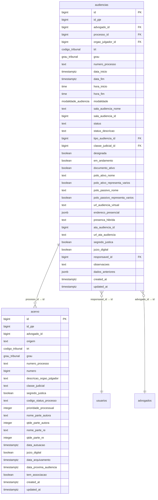
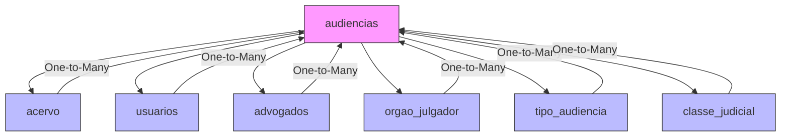
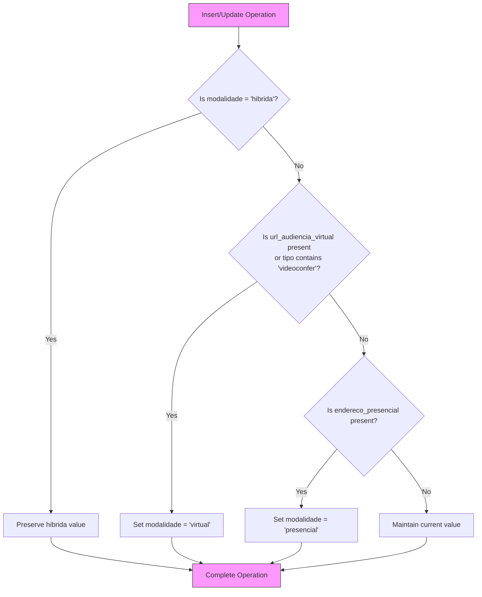
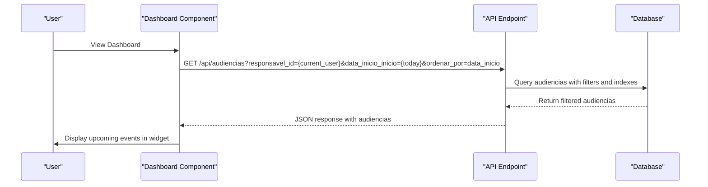
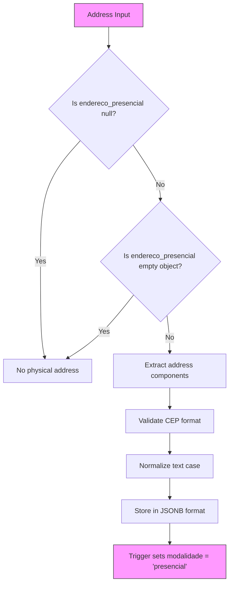

# Audiencias Table

<cite>
**Referenced Files in This Document**   
- [07_audiencias.sql](file://supabase/schemas/07_audiencias.sql)
- [audiencias.ts](file://types/domain/audiencias.ts)
- [audiencias.ts](file://types/contracts/audiencias.ts)
- [criar-audiencia.service.ts](file://backend/audiencias/services/criar-audiencia.service.ts)
- [listar-audiencias.service.ts](file://backend/audiencias/services/listar-audiencias.service.ts)
- [route.ts](file://app/api/audiencias/route.ts)
- [04_acervo.sql](file://supabase/schemas/04_acervo.sql)
- [acervo.ts](file://types/domain/acervo.ts)
- [01_enums.sql](file://supabase/schemas/01_enums.sql)
</cite>

## Table of Contents
1. [Introduction](#introduction)
2. [Entity Structure](#entity-structure)
3. [Field Definitions](#field-definitions)
4. [Relationships](#relationships)
5. [Constraints and Indexes](#constraints-and-indexes)
6. [Triggers and Data Integrity](#triggers-and-data-integrity)
7. [Sample Records](#sample-records)
8. [Calendar Integration](#calendar-integration)
9. [Virtual Hearing Management](#virtual-hearing-management)
10. [Physical Address Storage](#physical-address-storage)

## Introduction

The `audiencias` table in the Sinesys legal management system serves as the central repository for managing judicial hearings associated with legal processes. This table stores comprehensive information about scheduled hearings, including their temporal, spatial, and organizational attributes. The design supports both automatically captured hearings from external systems (PJE) and manually created hearings within the Sinesys platform.

The table plays a critical role in the system's hearing calendar visualization and dashboard integration, providing the foundation for tracking upcoming events and managing hearing logistics. It maintains a one-to-many relationship with the `acervo` table, allowing multiple hearings to be associated with a single legal process.

**Section sources**
- [07_audiencias.sql](file://supabase/schemas/07_audiencias.sql#L1-L159)
- [audiencias.ts](file://types/domain/audiencias.ts#L1-L77)

## Entity Structure

The `audiencias` table is designed with a comprehensive set of fields to capture all relevant aspects of a judicial hearing. The primary key is an auto-generated `id` field of type `bigint`, ensuring unique identification of each hearing record. The table structure includes fields for temporal information, location details, participant information, and administrative metadata.



**Diagram sources **
- [07_audiencias.sql](file://supabase/schemas/07_audiencias.sql#L4-L46)
- [04_acervo.sql](file://supabase/schemas/04_acervo.sql#L4-L32)

## Field Definitions

The `audiencias` table contains a comprehensive set of fields designed to capture all relevant information about judicial hearings. Each field serves a specific purpose in the hearing management workflow.

### Core Identification Fields
- **id**: Auto-generated primary key (bigint) that uniquely identifies each hearing record in the system.
- **id_pje**: The hearing ID from the PJE (Processo Judicial Eletrônico) system, used for synchronization and reference.
- **processo_id**: Foreign key referencing the `acervo` table, establishing the relationship between a hearing and its associated legal process.
- **numero_processo**: The process number in CNJ format, used for identification and display purposes.

### Temporal Fields
- **data_inicio**: Timestamp indicating the start date and time of the hearing.
- **data_fim**: Timestamp indicating the end date and time of the hearing.
- **hora_inicio**: Time component extracted from the start timestamp, representing the beginning of the hearing.
- **hora_fim**: Time component extracted from the end timestamp, representing the conclusion of the hearing.

### Location and Modality Fields
- **modalidade**: ENUM field indicating the hearing modality (virtual, presencial, or hibrida), automatically populated by a trigger.
- **url_audiencia_virtual**: Text field storing the URL for virtual hearings (Zoom, Google Meet, etc.).
- **endereco_presencial**: JSONB field containing the physical address for in-person hearings.
- **sala_audiencia_nome**: Name of the physical hearing room for in-person proceedings.
- **sala_audiencia_id**: ID of the hearing room in the PJE system.

### Status and Administrative Fields
- **status**: Current status of the hearing (M=Marcada, R=Realizada, C=Cancelada).
- **responsavel_id**: Foreign key referencing the `usuarios` table, indicating the user responsible for the hearing.
- **observacoes**: Text field for additional notes and observations about the hearing.
- **created_at**: Timestamp of record creation, automatically set to current time.
- **updated_at**: Timestamp of last record update, automatically updated by trigger.

### Participant and Context Fields
- **polo_ativo_nome**: Name of the plaintiff party in the hearing.
- **polo_passivo_nome**: Name of the defendant party in the hearing.
- **tipo_audiencia_id**: Foreign key referencing the type of hearing (e.g., instrução, julgamento).
- **classe_judicial_id**: Foreign key referencing the judicial class of the associated process.
- **segredo_justica**: Boolean indicating whether the process is under judicial secrecy.
- **juizo_digital**: Boolean indicating whether the process is in a digital court.

**Section sources**
- [07_audiencias.sql](file://supabase/schemas/07_audiencias.sql#L4-L83)
- [audiencias.ts](file://types/domain/audiencias.ts#L25-L76)

## Relationships

The `audiencias` table maintains several critical relationships with other tables in the Sinesys system, enabling comprehensive hearing management and data integration.

### Relationship with Acervo Table
The primary relationship is with the `acervo` table, which stores information about legal processes. This relationship is established through the `processo_id` foreign key, creating a one-to-many association where a single legal process can have multiple associated hearings. This design reflects the real-world scenario where a legal case typically involves multiple hearings throughout its lifecycle.

The relationship is defined with `on delete cascade`, ensuring that when a process is removed from the system, all associated hearings are automatically deleted to maintain data integrity. The `numero_processo` field is duplicated from the `acervo` table to facilitate efficient queries without requiring joins in many common scenarios.

### Relationship with Usuarios Table
The `responsavel_id` field creates a relationship with the `usuarios` table, identifying the system user responsible for managing a particular hearing. This relationship uses `on delete set null` to preserve hearing records even if the responsible user is removed from the system, while maintaining referential integrity.

### Relationship with Advogados Table
The `advogado_id` field establishes a relationship with the `advogados` table, identifying the attorney who captured or created the hearing information. This relationship also uses `on delete cascade` to maintain consistency when attorneys are removed from the system.

### Relationship with Auxiliary Tables
The table also references several auxiliary tables:
- `orgao_julgador` for information about the adjudicating body
- `tipo_audiencia` for hearing type classification
- `classe_judicial` for judicial class information

These relationships use `on delete set null` to preserve hearing records even if referenced classification data is modified or removed.



**Diagram sources **
- [07_audiencias.sql](file://supabase/schemas/07_audiencias.sql#L7-L23)
- [04_acervo.sql](file://supabase/schemas/04_acervo.sql#L7-L11)

## Constraints and Indexes

The `audiencias` table implements several constraints and indexes to ensure data integrity, enforce business rules, and optimize query performance.

### Constraints
The table includes a unique constraint on the combination of `id_pje`, `trt`, `grau`, and `numero_processo` fields. This constraint ensures that each hearing is uniquely identified across the system, preventing duplication of hearing records from external sources. The comment in the schema explains that this design allows multiple attorneys to view the same hearing for a process without creating duplicate records.

The table also includes check constraints on the `presenca_hibrida` field, which restricts its values to 'advogado', 'cliente', or null, ensuring data consistency for hybrid hearings.

### Indexes
A comprehensive set of indexes has been created to optimize common query patterns:

- **idx_audiencias_processo_id**: B-tree index on `processo_id` for efficient retrieval of all hearings for a specific process.
- **idx_audiencias_data_inicio**: B-tree index on `data_inicio` for calendar-based queries and date range filtering.
- **idx_audiencias_responsavel_id**: B-tree index on `responsavel_id` for filtering hearings by responsible user.
- **idx_audiencias_modalidade**: B-tree index on `modalidade` for filtering by hearing type (virtual, presencial, hibrida).
- **idx_audiencias_status**: B-tree index on `status` for filtering by hearing status.
- **idx_audiencias_advogado_trt_grau**: Composite index on `advogado_id`, `trt`, and `grau` for attorney-specific queries across tribunals.
- **idx_audiencias_processo_data**: Composite index on `processo_id` and `data_inicio` for efficient retrieval of process hearings in chronological order.

These indexes support the system's hearing calendar visualization and dashboard widgets by enabling fast retrieval of upcoming events and filtered views.

**Section sources**
- [07_audiencias.sql](file://supabase/schemas/07_audiencias.sql#L44-L98)

## Triggers and Data Integrity

The `audiencias` table employs several triggers to maintain data integrity and automate business logic, reducing the burden on application code and ensuring consistent behavior.

### Modalidade Population Trigger
The most significant trigger is `trigger_set_modalidade_audiencia`, which automatically populates the `modalidade` field based on other field values. This trigger executes before insert or update operations and follows a specific priority order:

1. If the modalidade is already set to 'hibrida', it preserves this value (allowing manual override)
2. If a virtual URL is present or the hearing type description contains 'videoconfer', it sets modalidade to 'virtual'
3. If a physical address is provided, it sets modalidade to 'presencial'
4. Otherwise, it maintains the current value

This trigger ensures that the hearing modality is always consistent with the available location information, preventing contradictory data states.

### Updated Timestamp Trigger
The `update_audiencias_updated_at` trigger automatically updates the `updated_at` field whenever a record is modified. This provides an audit trail of when records were last changed, which is valuable for tracking changes and debugging issues.

### Row Level Security
The table has Row Level Security (RLS) enabled, which restricts data access based on user permissions. This security feature ensures that users can only access hearings they are authorized to view, maintaining data privacy and compliance with legal requirements.



**Diagram sources **
- [07_audiencias.sql](file://supabase/schemas/07_audiencias.sql#L100-L148)

## Sample Records

The following sample records illustrate typical hearing data patterns in the `audiencias` table:

### Virtual Hearing Record
```json
{
  "id": 1001,
  "id_pje": 5001,
  "advogado_id": 201,
  "processo_id": 3001,
  "trt": "TRT3",
  "grau": "primeiro_grau",
  "numero_processo": "0101450-28.2025.5.01.0431",
  "data_inicio": "2025-12-15T14:00:00Z",
  "data_fim": "2025-12-15T15:30:00Z",
  "modalidade": "virtual",
  "url_audiencia_virtual": "https://meet.google.com/abc-defg-hij",
  "status": "M",
  "responsavel_id": 501,
  "observacoes": "Confirmar presença do perito antes da audiência"
}
```

### In-Person Hearing Record
```json
{
  "id": 1002,
  "id_pje": 5002,
  "advogado_id": 201,
  "processo_id": 3002,
  "trt": "TRT3",
  "grau": "primeiro_grau",
  "numero_processo": "0101451-29.2025.5.01.0432",
  "data_inicio": "2025-12-16T10:00:00Z",
  "data_fim": "2025-12-16T12:00:00Z",
  "modalidade": "presencial",
  "sala_audiencia_nome": "Sala de Audiências 3",
  "endereco_presencial": {
    "logradouro": "Praça da Sé",
    "numero": "100",
    "complemento": "3º andar",
    "bairro": "Sé",
    "cidade": "São Paulo",
    "estado": "SP",
    "pais": "Brasil",
    "cep": "01001-000"
  },
  "status": "M",
  "responsavel_id": 502,
  "observacoes": "Levar documentos originais para autenticação"
}
```

### Hybrid Hearing Record
```json
{
  "id": 1003,
  "id_pje": 5003,
  "advogado_id": 202,
  "processo_id": 3003,
  "trt": "TRT1",
  "grau": "segundo_grau",
  "numero_processo": "0101452-30.2025.5.01.0433",
  "data_inicio": "2025-12-17T16:00:00Z",
  "data_fim": "2025-12-17T17:30:00Z",
  "modalidade": "hibrida",
  "presenca_hibrida": "advogado",
  "url_audiencia_virtual": "https://zoom.us/j/123456789",
  "sala_audiencia_nome": "Sala de Audiências 1",
  "endereco_presencial": {
    "logradouro": "Avenida Paulista",
    "numero": "1000",
    "bairro": "Bela Vista",
    "cidade": "São Paulo",
    "estado": "SP",
    "pais": "Brasil",
    "cep": "01310-100"
  },
  "status": "M",
  "responsavel_id": 503,
  "observacoes": "Cliente participará virtualmente, advogado comparecerá presencialmente"
}
```

These sample records demonstrate the flexibility of the table structure in accommodating different hearing types while maintaining consistent data organization.

**Section sources**
- [07_audiencias.sql](file://supabase/schemas/07_audiencias.sql#L31-L32)
- [audiencias.ts](file://types/domain/audiencias.ts#L61-L70)

## Calendar Integration

The `audiencias` table is central to the hearing calendar visualization and dashboard integration in the Sinesys system. The table's structure and indexing strategy are specifically optimized to support efficient calendar-based queries and real-time event display.

### Calendar Visualization
The hearing calendar, accessible through the `/audiencias/semana` route, retrieves hearing data using the API endpoint at `/api/audiencias`. The calendar view queries the database using date range filters on the `data_inicio` field, leveraging the `idx_audiencias_data_inicio` index for optimal performance. The calendar displays hearings in chronological order, grouped by date, with visual indicators for different hearing modalities.

The `data_inicio` and `data_fim` fields provide the temporal boundaries for calendar placement, while the `hora_inicio` and `hora_fim` fields supply the time-specific display information. The `modalidade` field determines the visual styling of calendar events, with different colors or icons for virtual, in-person, and hybrid hearings.

### Dashboard Integration
The dashboard's upcoming events widget queries the `audiencias` table to display the user's scheduled hearings. This widget uses the `responsavel_id` field to filter hearings assigned to the current user and the `data_inicio` field to identify upcoming events. The query is optimized with the `idx_audiencias_responsavel_id` and `idx_audiencias_data_inicio` indexes to ensure fast loading times.

The widget displays key information including the process number, parties involved, hearing time, and modality. Clicking on a widget item navigates to the detailed hearing view. The integration also respects the RLS policies, ensuring users only see hearings they are authorized to access.



**Diagram sources **
- [route.ts](file://app/api/audiencias/route.ts#L225-L313)
- [listar-audiencias.service.ts](file://backend/audiencias/services/listar-audiencias.service.ts#L77-L272)

## Virtual Hearing Management

The `audiencias` table provides comprehensive support for managing virtual hearings through dedicated fields and automated processes.

### Virtual Hearing URL Handling
The `url_audiencia_virtual` field stores the complete URL for virtual hearings, supporting various video conferencing platforms such as Zoom, Google Meet, and Microsoft Teams. When this field is populated, the `populate_modalidade_audiencia` trigger automatically sets the `modalidade` field to 'virtual', ensuring consistency between the URL presence and hearing type.

The system validates URLs during the creation process to ensure they follow standard web address formats. The field is designed to store the complete join URL, including any necessary meeting codes or passcodes, allowing participants to access the hearing with a single click.

### Hybrid Hearing Configuration
For hybrid hearings, where some participants attend in person while others join virtually, the table provides the `presenca_hibrida` field to specify which party will attend physically. This field accepts values of 'advogado' or 'cliente', indicating whether the attorney or client will be present in person.

The system supports hybrid hearings by storing both the virtual meeting URL and the physical address, allowing participants to access the appropriate connection method based on their attendance mode. This dual-location capability is essential for modern legal proceedings that accommodate remote participation while maintaining the option for in-person attendance.

### Automated Modality Detection
The trigger-based modality detection system ensures that virtual hearings are properly identified even when the modality is not explicitly specified. The system checks for virtual meeting indicators in multiple ways:

1. Presence of a URL in the `url_audiencia_virtual` field
2. Keywords in the hearing type description (e.g., 'videoconferência', 'virtual')
3. Explicit manual setting of 'virtual' modality

This multi-factor approach ensures reliable detection of virtual hearings from various sources, including automated data imports from external systems.

**Section sources**
- [07_audiencias.sql](file://supabase/schemas/07_audiencias.sql#L31-L32)
- [01_enums.sql](file://supabase/schemas/01_enums.sql#L138-L143)

## Physical Address Storage

The `audiencias` table handles physical address information for in-person hearings through the `endereco_presencial` field, which uses the JSONB data type for flexible and efficient storage.

### JSONB Structure
The `endereco_presencial` field stores address information as a JSON object with the following optional properties:
- **logradouro**: Street or avenue name
- **numero**: Building number
- **complemento**: Additional address information (apartment, suite, etc.)
- **bairro**: Neighborhood or district
- **cidade**: City
- **estado**: State or province
- **pais**: Country
- **cep**: Postal code (CEP in Brazil)

This JSONB structure provides several advantages:
- Flexibility to accommodate incomplete addresses (not all fields are required)
- Easy querying of specific address components
- Efficient storage with PostgreSQL's JSONB compression
- Support for future address field additions without schema changes

### Address Validation and Normalization
When creating or updating a hearing with a physical address, the system validates the address components to ensure data quality. The validation includes:
- Checking for valid CEP format (XXXXX-XXX)
- Ensuring required components are present (at least cidade and estado)
- Normalizing text case and whitespace

The system may also integrate with external address validation services to verify and complete address information, improving accuracy for calendar invitations and navigation purposes.

### Modality Determination
The presence of a non-empty `endereco_presencial` field triggers the automatic setting of `modalidade` to 'presencial' through the `populate_modalidade_audiencia` trigger. The trigger checks if the JSONB field is not null and not an empty object (`{}`) before making this determination.

This automated process ensures that hearings with physical locations are correctly classified, preventing inconsistencies between the address information and hearing modality. The system also prevents contradictory states where both a virtual URL and physical address are present without explicitly setting the modality to 'hibrida'.



**Diagram sources **
- [07_audiencias.sql](file://supabase/schemas/07_audiencias.sql#L32-L33)
- [audiencias.ts](file://types/domain/audiencias.ts#L61-L70)