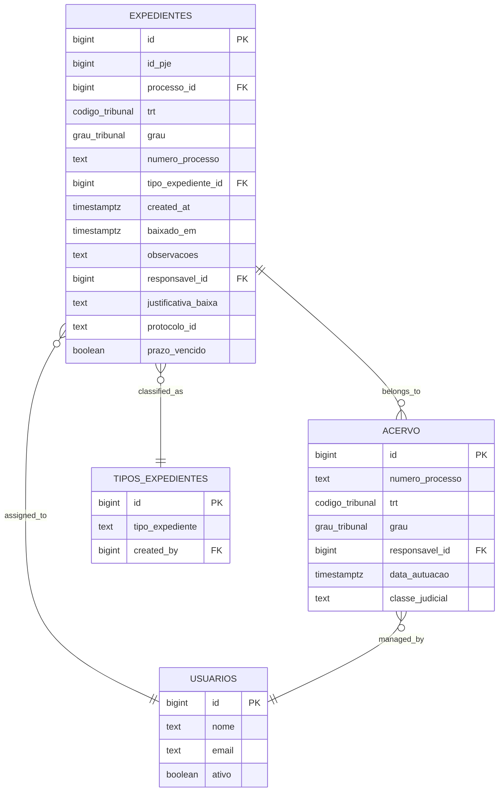
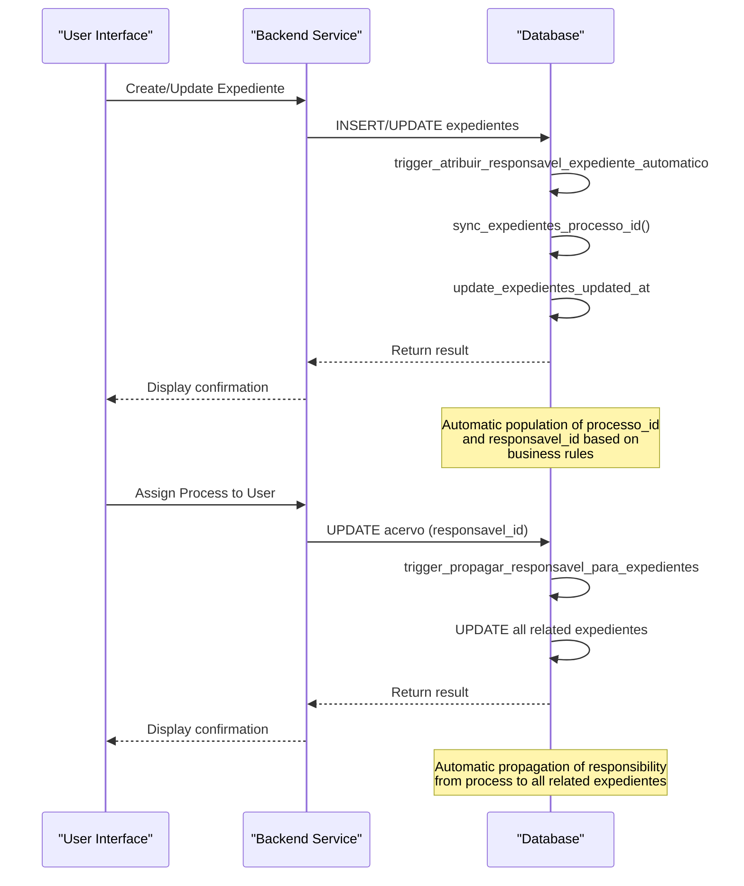
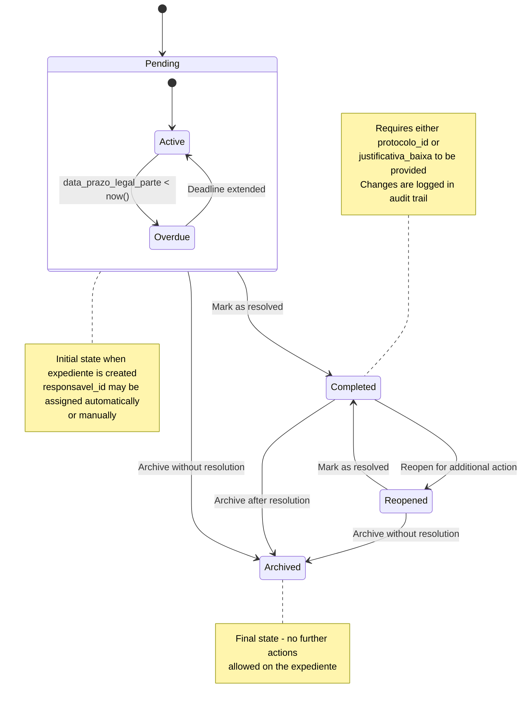

# Expedientes Table

<cite>
**Referenced Files in This Document**   
- [06_expedientes.sql](file://supabase/schemas/06_expedientes.sql)
- [20251121000002_create_expedientes_manuais_system.sql](file://supabase/migrations/aplicadas/20251121000002_create_expedientes_manuais_system.sql)
- [20251124112131_trigger_atribuicao_automatica_expedientes.sql](file://supabase/migrations/aplicadas/20251124112131_trigger_atribuicao_automatica_expedientes.sql)
- [baixa-expediente.service.ts](file://backend/expedientes/services/baixa-expediente.service.ts)
- [reverter-baixa.service.ts](file://backend/expedientes/services/reverter-baixa.service.ts)
- [atribuir-responsavel.service.ts](file://backend/expedientes/services/atribuir-responsavel.service.ts)
- [atualizar-tipo-descricao.service.ts](file://backend/expedientes/services/atualizar-tipo-descricao.service.ts)
- [listar-pendentes.service.ts](file://backend/expedientes/services/listar-pendentes.service.ts)
- [baixa-expediente-persistence.service.ts](file://backend/expedientes/services/persistence/baixa-expediente-persistence.service.ts)
- [listar-pendentes.service.ts](file://backend/expedientes/services/persistence/listar-pendentes.service.ts)
- [registrar-baixa-log.service.ts](file://backend/expedientes/services/persistence/registrar-baixa-log.service.ts)
- [reverter-baixa-persistence.service.ts](file://backend/expedientes/services/persistence/reverter-baixa-persistence.service.ts)
</cite>

## Table of Contents
1. [Introduction](#introduction)
2. [Entity Structure and Fields](#entity-structure-and-fields)
3. [Relationships](#relationships)
4. [Constraints and Indexes](#constraints-and-indexes)
5. [Triggers and Business Logic](#triggers-and-business-logic)
6. [Data Validation Rules](#data-validation-rules)
7. [Status Transitions](#status-transitions)
8. [Integration with Dashboard](#integration-with-dashboard)
9. [Sample Records](#sample-records)
10. [Conclusion](#conclusion)

## Introduction

The `expedientes` table in the Sinesys system serves as a central repository for managing legal document deadlines and pending manifestations. This table consolidates expedientes from multiple sources including PJE (Processo Judicial Eletrônico) captures, manual entries by users, and communications from CNJ (National Council of Justice). The primary purpose of this table is to track pending legal obligations, manage deadlines for responses, and ensure proper assignment of responsibilities within legal teams. Each record represents a pending legal action that requires attention, with comprehensive tracking of creation, assignment, completion, and audit history.

**Section sources**
- [06_expedientes.sql](file://supabase/schemas/06_expedientes.sql#L1-L249)

## Entity Structure and Fields

The `expedientes` table contains comprehensive information about pending legal manifestations, with fields designed to capture all relevant metadata and tracking information. The core fields include:

- **id**: `bigint` generated always as identity primary key - Unique identifier for each expediente record
- **id_pje**: `bigint` not null - ID of the expediente in the PJE system (not the process ID)
- **processo_id**: `bigint` references public.acervo(id) on delete set null - Foreign key linking to the acervo table, establishing the one-to-many relationship between processes and their expedientes
- **trt**: `public.codigo_tribunal` not null - Code of the Regional Labor Court where the process is being handled
- **grau**: `public.grau_tribunal` not null - Court level (first_grau or second_grau)
- **numero_processo**: `text` not null - CNJ format process number used for relating with the acervo table
- **tipo_expediente_id**: `bigint` references public.tipos_expedientes(id) on delete set null - Foreign key to the tipos_expedientes table, categorizing the type of expediente
- **data_criacao**: `timestamptz` default now() not null - Timestamp of when the expediente was created (mapped to created_at in the schema)
- **data_baixa**: `timestamptz` - Timestamp of when the expediente was completed or responded to (mapped to baixado_em in the schema)
- **observacoes**: `text` - Internal notes and observations about the pending expediente
- **responsavel_id**: `bigint` references public.usuarios(id) on delete set null - Foreign key to the usuarios table, identifying the user responsible for handling the expediente
- **arquivado**: `boolean` - Indicates whether the expediente has been archived (represented by data_arquivamento field in the schema)

Additional fields provide detailed context about the legal process:
- **descricao_orgao_julgador**: Text description of the judicial body
- **classe_judicial**: Judicial class of the process (e.g., ATOrd, ATSum)
- **data_autuacao**: Date of process filing/distribution
- **data_ciencia_parte**: Date when the party became aware of the expediente
- **data_prazo_legal_parte**: Legal deadline for party response
- **prazo_vencido**: Boolean indicating if the response deadline has expired
- **segredo_justica**: Boolean indicating if the process is under judicial secrecy
- **justificativa_baixa**: Text justification for closing the expediente without protocoling a document

The table also includes metadata fields for audit and tracking purposes, including updated_at for change tracking and dados_anteriores for storing previous state information before updates.

**Section sources**
- [06_expedientes.sql](file://supabase/schemas/06_expedientes.sql#L6-L100)

## Relationships

The `expedientes` table maintains several critical relationships with other tables in the Sinesys system, forming the backbone of the legal case management functionality.

### Relationship with Acervo Table

The `expedientes` table has a one-to-many relationship with the `acervo` table, where one process in the acervo can have multiple expedientes. This relationship is established through the `processo_id` foreign key field, which references the `id` field in the `acervo` table. This design allows for comprehensive tracking of all pending actions associated with a specific legal process. The relationship is defined with `on delete set null` semantics, meaning that if a process is deleted from the acervo, the associated expedientes are not deleted but their processo_id is set to null, preserving the historical record of the pending action.

The relationship is automatically maintained through a database trigger (`sync_expedientes_processo_id_trigger`) that populates the `processo_id` field based on the `numero_processo`, `trt`, and `grau` fields. This ensures that when an expediente is created or updated with a process number, it is automatically linked to the corresponding process in the acervo if one exists.

### Relationship with Tipos_Expedientes Table

The `expedientes` table has a many-to-one relationship with the `tipos_expedientes` table through the `tipo_expediente_id` foreign key. This relationship allows for categorization of expedientes into specific types such as Contestação, Recurso, or Impugnação. The `tipos_expedientes` table stores user-defined types that can be reused across multiple expedientes, providing consistency in classification. This relationship is also defined with `on delete set null` semantics, allowing types to be removed without deleting associated expedientes.

### Relationship with Usuarios Table

The `expedientes` table has a many-to-one relationship with the `usuarios` table through the `responsavel_id` foreign key. This relationship identifies which user is responsible for handling a particular expediente. Multiple expedientes can be assigned to the same user, but each expediente can have only one responsible user at a time. This relationship supports the assignment and tracking of workloads within legal teams.

### Automatic Responsibility Assignment

A key business rule implemented through database triggers ensures that when a process in the acervo is assigned to a user, all associated expedientes are automatically assigned to the same user. This is achieved through two complementary triggers:

1. When a new expediente is created or updated with a processo_id, a BEFORE INSERT/UPDATE trigger checks if the expediente has a responsible user. If not, it automatically assigns the same responsible user as the linked process.

2. When a process in the acervo has its responsible user changed, an AFTER UPDATE trigger propagates this change to all expedientes linked to that process, ensuring consistency across the system.

This automatic assignment mechanism ensures that responsibility for pending actions is always aligned with responsibility for the overall case, reducing the risk of missed deadlines due to misassignment.



**Diagram sources**
- [06_expedientes.sql](file://supabase/schemas/06_expedientes.sql#L6-L60)
- [20251121000002_create_expedientes_manuais_system.sql](file://supabase/migrations/aplicadas/20251121000002_create_expedientes_manuais_system.sql#L9-L15)
- [20251124112131_trigger_atribuicao_automatica_expedientes.sql](file://supabase/migrations/aplicadas/20251124112131_trigger_atribuicao_automatica_expedientes.sql#L18-L48)

**Section sources**
- [06_expedientes.sql](file://supabase/schemas/06_expedientes.sql#L6-L60)
- [20251121000002_create_expedientes_manuais_system.sql](file://supabase/migrations/aplicadas/20251121000002_create_expedientes_manuais_system.sql#L9-L15)
- [20251124112131_trigger_atribuicao_automatica_expedientes.sql](file://supabase/migrations/aplicadas/20251124112131_trigger_atribuicao_automatica_expedientes.sql#L18-L48)

## Constraints and Indexes

The `expedientes` table implements several constraints and indexes to ensure data integrity, enforce business rules, and optimize query performance.

### Constraints

The table includes multiple constraints to maintain data quality and enforce business rules:

- **Primary Key Constraint**: The `id` field is defined as a generated identity primary key, ensuring each record has a unique identifier.
- **Foreign Key Constraints**: Relationships with other tables are enforced through foreign key constraints on `processo_id` (referencing acervo), `tipo_expediente_id` (referencing tipos_expedientes), and `responsavel_id` (referencing usuarios).
- **Uniqueness Constraint**: A composite unique constraint on `(id_pje, trt, grau, numero_processo)` ensures that duplicate expedientes from the PJE system are not created.
- **Check Constraint**: A check constraint named `check_baixa_valida` enforces the business rule that when an expediente is marked as completed (baixado_em is not null), either the protocolo_id or justificativa_baixa field must be populated. This ensures that every completed expediente has a record of how it was resolved.

### Indexes

Multiple indexes have been created to optimize query performance for common access patterns:

- **idx_expedientes_processo_id**: B-tree index on processo_id for efficient filtering by process
- **idx_expedientes_responsavel_id**: B-tree index on responsavel_id for efficient filtering by responsible user
- **idx_expedientes_tipo_expediente_id**: B-tree index on tipo_expediente_id for efficient filtering by expediente type
- **idx_expedientes_prazo_vencido**: B-tree index on prazo_vencido for quickly identifying overdue deadlines
- **idx_expedientes_data_prazo_legal**: B-tree index on data_prazo_legal_parte for sorting and filtering by deadline
- **idx_expedientes_baixado_em**: Partial index on baixado_em where baixado_em is not null, optimizing queries for completed expedientes
- **idx_expedientes_advogado_baixado**: Partial index on (advogado_id, baixado_em) where baixado_em is null, optimizing queries for pending expedientes by attorney

These indexes support the dashboard's pending items visualization by enabling fast retrieval of expedientes based on status, responsible user, deadline, and other filtering criteria.

**Section sources**
- [06_expedientes.sql](file://supabase/schemas/06_expedientes.sql#L49-L117)

## Triggers and Business Logic

The `expedientes` table implements several triggers that enforce critical business logic and automate routine operations.

### Automatic Updated Timestamp

A trigger named `update_expedientes_updated_at` executes before any update operation on the table. This trigger calls the `update_updated_at_column()` function to automatically update the `updated_at` field with the current timestamp whenever a record is modified. This provides a reliable audit trail of when each record was last changed.

### Automatic Process ID Population

The `sync_expedientes_processo_id_trigger` executes before insert or update operations when the processo_id is null. This trigger calls the `sync_expedientes_processo_id()` function, which queries the acervo table to find a matching process based on the numero_processo, trt, and grau fields. If a matching process is found, the trigger automatically populates the processo_id field, establishing the relationship between the expediente and its parent process.

### Automatic Responsibility Assignment

Two complementary triggers handle the automatic assignment of responsibilities:

1. **trigger_atribuir_responsavel_expediente_automatico**: This BEFORE INSERT/UPDATE trigger on the expedientes table checks if a new expediente is being linked to a process and doesn't already have a responsible user. If so, it queries the acervo table to find the responsible user for the linked process and assigns that user to the expediente.

2. **trigger_propagar_responsavel_para_expedientes**: This AFTER UPDATE trigger on the acervo table fires when a process has its responsible user changed. It updates all expedientes linked to that process, setting their responsavel_id to match the new responsible user of the process. This ensures that responsibility for pending actions is always aligned with responsibility for the overall case.

### Audit Logging Functions

The table integrates with the system's audit logging through two database functions:

- **registrar_baixa_expediente()**: This function is called when an expediente is marked as completed. It creates a record in the logs_alteracao table with details of the completion, including the protocol ID or justification, and the user who performed the action.

- **registrar_reversao_baixa_expediente()**: This function is called when a previously completed expediente is reopened. It creates a record in the logs_alteracao table with details of the reversal, including the previous completion data and the user who performed the reversal.

These triggers and functions implement the core business logic for managing expedientes, ensuring data consistency, automating routine assignments, and maintaining a complete audit trail of all changes.



**Diagram sources**
- [06_expedientes.sql](file://supabase/schemas/06_expedientes.sql#L119-L154)
- [20251124112131_trigger_atribuicao_automatica_expedientes.sql](file://supabase/migrations/aplicadas/20251124112131_trigger_atribuicao_automatica_expedientes.sql#L18-L88)

**Section sources**
- [06_expedientes.sql](file://supabase/schemas/06_expedientes.sql#L119-L249)
- [20251124112131_trigger_atribuicao_automatica_expedientes.sql](file://supabase/migrations/aplicadas/20251124112131_trigger_atribuicao_automatica_expedientes.sql#L18-L124)

## Data Validation Rules

The `expedientes` table implements several data validation rules through both database constraints and application-level business logic to ensure data integrity and compliance with business requirements.

### Database-Level Validation

At the database level, validation is enforced through constraints and triggers:

- **Mandatory Fields**: The table requires several fields to be populated, including id_pje, trt, grau, numero_processo, and descricao_orgao_julgador. These fields are marked as NOT NULL to prevent incomplete records.
- **Check Constraint**: The check_baixa_valida constraint ensures that when an expediente is marked as completed (baixado_em is not null), either the protocolo_id or justificativa_baixa field must be populated. This prevents situations where an expediente is closed without proper documentation of how it was resolved.
- **Foreign Key Constraints**: All foreign key relationships are enforced at the database level, preventing orphaned records and ensuring referential integrity.

### Application-Level Validation

The backend services implement additional validation rules:

- **Responsibility Assignment Validation**: Before assigning a responsible user to an expediente, the system validates that both the expediente and the user exist and are active. This is implemented in the atribuir-responsavel.service.ts file.
- **Completion Validation**: When marking an expediente as completed, the system validates that either a protocol ID or justification is provided. This validation is implemented in the baixa-expediente.service.ts file and serves as an additional layer beyond the database constraint.
- **Type Validation**: When updating the type of an expediente, the system validates that the specified tipo_expediente_id exists in the tipos_expedientes table. This prevents assignment of non-existent or invalid types.

### Input Normalization

The system also implements input normalization to ensure data consistency:

- **Text Trimming**: Protocol IDs and justifications are trimmed of whitespace before being stored, preventing issues with extra spaces affecting data integrity.
- **Null Normalization**: Empty strings for protocol IDs and justifications are converted to null values to maintain consistency in the data model.

These validation rules work together to ensure that all data in the expedientes table is accurate, complete, and compliant with the system's business requirements.

**Section sources**
- [06_expedientes.sql](file://supabase/schemas/06_expedientes.sql#L53-L59)
- [baixa-expediente.service.ts](file://backend/expedientes/services/baixa-expediente.service.ts#L40-L46)
- [atribuir-responsavel.service.ts](file://backend/expedientes/services/atribuir-responsavel.service.ts#L98-L123)

## Status Transitions

The `expedientes` table supports a clear lifecycle for pending legal actions through well-defined status transitions. These transitions are managed through specific business operations that update the state of expedientes.

### Creation

An expediente is created when a new pending action is identified, either through automated capture from PJE, manual entry by a user, or creation from a CNJ communication. Upon creation, the expediente is in a "pending" state with baixado_em set to null. The system automatically populates relevant fields such as processo_id (if a matching process exists), and may automatically assign a responsible user based on the linked process.

### Assignment

The responsible user for an expediente can be assigned or changed through the assignment operation. This can occur automatically when the linked process is assigned to a user, or manually by a user with appropriate permissions. The assignment is tracked through the responsavel_id field, and all changes are logged in the logs_alteracao table.

### Completion (Baixa)

An expediente transitions to a "completed" state when it is marked as resolved through the completion operation. This operation requires either a protocol ID (indicating a document was filed) or a justification (explaining why no document was filed). The completion is recorded by setting the baixado_em field to the current timestamp and populating either protocolo_id or justificativa_baixa. This operation triggers the creation of an audit log entry through the registrar_baixa_expediente function.

### Reopening (Reversão de Baixa)

A completed expediente can be reopened if it is determined that additional action is required. This reversal operation clears the baixado_em, protocolo_id, and justificativa_baixa fields, returning the expediente to a "pending" state. The system records the previous completion data in the audit log through the registrar_reversao_baixa_expediente function, preserving the history of the expediente's status changes.

### Status Tracking

The table includes several fields that support status tracking:

- **prazo_vencido**: A generated column that automatically indicates whether the response deadline has passed, calculated as data_prazo_legal_parte < now()
- **baixado_em**: Null indicates pending status, while a timestamp indicates completed status
- **data_arquivamento**: Indicates when the expediente was archived, if applicable

These status transitions are managed through dedicated backend services that enforce business rules and maintain audit trails, ensuring that all changes to expediente status are properly documented and compliant with legal requirements.



**Diagram sources**
- [06_expedientes.sql](file://supabase/schemas/06_expedientes.sql#L47-L48)
- [baixa-expediente.service.ts](file://backend/expedientes/services/baixa-expediente.service.ts#L34-L83)
- [reverter-baixa.service.ts](file://backend/expedientes/services/reverter-baixa.service.ts#L34-L77)

**Section sources**
- [baixa-expediente.service.ts](file://backend/expedientes/services/baixa-expediente.service.ts#L1-L83)
- [reverter-baixa.service.ts](file://backend/expedientes/services/reverter-baixa.service.ts#L1-L77)
- [06_expedientes.sql](file://supabase/schemas/06_expedientes.sql#L47-L48)

## Integration with Dashboard

The `expedientes` table plays a central role in the dashboard's pending items visualization, providing the data foundation for tracking and managing legal deadlines.

### Data Aggregation

The dashboard retrieves expediente data through backend services that aggregate information from the expedientes table with related data from other tables. The listar-pendentes.service.ts file implements the business logic for retrieving pending expedientes with filtering, pagination, and sorting capabilities. This service supports various filtering options including by responsible user, TRT, court level, and deadline status.

### Pending Items Visualization

The dashboard displays pending expedientes in multiple views organized by time periods (week, month, year) to help users prioritize their workload. The data model supports this visualization through several key fields:

- **data_prazo_legal_parte**: Used to sort and group expedientes by their response deadlines
- **prazo_vencido**: Used to highlight overdue deadlines in red or with warning indicators
- **responsavel_id**: Used to filter the view to show only expedientes assigned to the current user
- **tipo_expediente_id**: Used to categorize and color-code different types of pending actions

### Real-time Updates

The system implements cache invalidation mechanisms to ensure the dashboard displays up-to-date information. After key operations such as completing an expediente or changing its assignment, the backend services call invalidatePendentesCache() to clear the cached data. This ensures that subsequent dashboard views retrieve fresh data from the database, providing real-time visibility into the status of pending actions.

### Performance Optimization

The indexes on the expedientes table are specifically designed to support the dashboard's query patterns. For example, the idx_expedientes_responsavel_id index optimizes queries for filtering by responsible user, while the idx_expedientes_data_prazo_legal index supports sorting by deadline. The partial index on baixado_em (where baixado_em is null) specifically optimizes queries for pending expedientes, which are the primary focus of the dashboard.

### User Interaction

The dashboard enables users to perform key actions directly from the pending items view:

- **Completing Expedientes**: Users can mark expedientes as completed, which triggers the baixa-expediente.service.ts workflow
- **Assigning Responsibilities**: Users can assign or reassign responsible users through the atribuir-responsavel.service.ts workflow
- **Updating Information**: Users can update the type and description of expedientes through the atualizar-tipo-descricao.service.ts workflow

These integrations create a seamless workflow where users can monitor their pending deadlines and take necessary actions without leaving the dashboard interface.

**Section sources**
- [listar-pendentes.service.ts](file://backend/expedientes/services/listar-pendentes.service.ts#L1-L36)
- [baixa-expediente.service.ts](file://backend/expedientes/services/baixa-expediente.service.ts#L68-L69)
- [atribuir-responsavel.service.ts](file://backend/expedientes/services/atribuir-responsavel.service.ts#L142-L143)
- [atualizar-tipo-descricao.service.ts](file://backend/expedientes/services/atualizar-tipo-descricao.service.ts#L152-L153)

## Sample Records

The following sample records illustrate typical data patterns in the `expedientes` table, demonstrating how the system manages different types of pending legal actions.

### Sample Record 1: PJE-Captured Expediente

```json
{
  "id": 1001,
  "id_pje": 5001,
  "processo_id": 2001,
  "trt": "RJ",
  "grau": "primeiro_grau",
  "numero_processo": "1000001-20.2023.5.01.0001",
  "tipo_expediente_id": 101,
  "descricao_orgao_julgador": "Vara do Trabalho de Botafogo",
  "classe_judicial": "ATOrd",
  "data_autuacao": "2023-01-15T09:30:00Z",
  "data_ciencia_parte": "2023-01-16T14:22:00Z",
  "data_prazo_legal_parte": "2023-01-23T23:59:59Z",
  "prazo_vencido": false,
  "responsavel_id": 3001,
  "baixado_em": null,
  "protocolo_id": null,
  "justificativa_baixa": null,
  "observacoes": "Aguardando análise do advogado responsável",
  "origem": "captura",
  "created_at": "2023-01-16T14:22:00Z",
  "updated_at": "2023-01-16T14:22:00Z"
}
```

This record represents a pending manifestation captured automatically from the PJE system. It is linked to an existing process in the acervo and has been automatically assigned to a responsible user. The deadline is still pending, and no completion action has been taken.

### Sample Record 2: Manually Created Expediente

```json
{
  "id": 1002,
  "id_pje": null,
  "processo_id": 2002,
  "trt": "SP",
  "grau": "segundo_grau",
  "numero_processo": "0000002-11.2022.5.02.0002",
  "tipo_expediente_id": 102,
  "descricao_orgao_julgador": "Tribunal Regional do Trabalho da 2ª Região",
  "classe_judicial": "RO",
  "data_autuacao": "2022-11-10T10:15:00Z",
  "data_ciencia_parte": "2023-02-01T09:00:00Z",
  "data_prazo_legal_parte": "2023-02-08T23:59:59Z",
  "prazo_vencido": false,
  "responsavel_id": 3002,
  "baixado_em": null,
  "protocolo_id": null,
  "justificativa_baixa": null,
  "observacoes": "Petição de agravo a ser protocolada",
  "origem": "manual",
  "created_at": "2023-02-01T09:00:00Z",
  "updated_at": "2023-02-01T09:00:00Z"
}
```

This record represents a pending action created manually by a user. It might correspond to an internal deadline that is not captured from the PJE system, such as preparing an appeal or response to a court order. The record is linked to a process in the acervo and assigned to a responsible user.

### Sample Record 3: Completed Expediente

```json
{
  "id": 1003,
  "id_pje": 5003,
  "processo_id": 2003,
  "trt": "MG",
  "grau": "primeiro_grau",
  "numero_processo": "2000003-33.2023.5.03.0003",
  "tipo_expediente_id": 103,
  "descricao_orgao_julgador": "Vara do Trabalho de Belo Horizonte",
  "classe_judicial": "ATSum",
  "data_autuacao": "2023-03-05T11:45:00Z",
  "data_ciencia_parte": "2023-03-06T16:30:00Z",
  "data_prazo_legal_parte": "2023-03-13T23:59:59Z",
  "prazo_vencido": false,
  "responsavel_id": 3003,
  "baixado_em": "2023-03-12T15:20:00Z",
  "protocolo_id": "PH20230312001",
  "justificativa_baixa": null,
  "observacoes": "Contestação protocolada com sucesso",
  "origem": "captura",
  "created_at": "2023-03-06T16:30:00Z",
  "updated_at": "2023-03-12T15:20:00Z"
}
```

This record represents a completed pending action where a document was successfully filed. The baixado_em field contains the timestamp of completion, and the protocolo_id field contains the reference number of the filed document. The prazo_vencido field is false, indicating the deadline was met.

### Sample Record 4: Expediente Closed with Justification

```json
{
  "id": 1004,
  "id_pje": 5004,
  "processo_id": 2004,
  "trt": "RS",
  "grau": "segundo_grau",
  "numero_processo": "3000004-44.2023.5.04.0004",
  "tipo_expediente_id": 104,
  "descricao_orgao_julgador": "Tribunal Regional do Trabalho da 4ª Região",
  "classe_judicial": "AC",
  "data_autuacao": "2023-04-10T08:20:00Z",
  "data_ciencia_parte": "2023-04-11T13:15:00Z",
  "data_prazo_legal_parte": "2023-04-18T23:59:59Z",
  "prazo_vencido": false,
  "responsavel_id": 3004,
  "baixado_em": "2023-04-15T10:45:00Z",
  "protocolo_id": null,
  "justificativa_baixa": "Manifestação não necessária conforme orientação do cliente",
  "observacoes": "Cliente optou por não responder ao expediente",
  "origem": "captura",
  "created_at": "2023-04-11T13:15:00Z",
  "updated_at": "2023-04-15T10:45:00Z"
}
```

This record represents a pending action that was closed without filing a document. The justificativa_baixa field contains the reason for not responding, which is preserved for audit and compliance purposes.

These sample records demonstrate the flexibility of the expedientes table in handling different scenarios while maintaining a consistent data model for tracking legal deadlines and actions.

**Section sources**
- [06_expedientes.sql](file://supabase/schemas/06_expedientes.sql#L6-L60)

## Conclusion

The `expedientes` table in the Sinesys system provides a comprehensive solution for managing legal document deadlines and pending manifestations. Through its well-designed data model, the table effectively tracks all pending legal actions from multiple sources, including automated captures from PJE, manual entries, and CNJ communications.

The table's structure supports critical business requirements through carefully designed fields that capture essential information about each pending action, including its relationship to the parent process, deadline information, responsible user, and completion status. The implementation of foreign key relationships with the acervo, tipos_expedientes, and usuarios tables ensures data integrity and enables powerful querying capabilities.

Business logic is enforced through a combination of database triggers and application-level services, automating key processes such as responsibility assignment and deadline tracking. The automatic propagation of responsibility from processes to their associated expedientes ensures that workloads are properly distributed and that no pending actions are left unassigned.

The integration with the dashboard's pending items visualization provides legal teams with real-time visibility into their workload, enabling effective prioritization and management of deadlines. The system's cache invalidation mechanisms ensure that users always have access to up-to-date information.

Data validation rules at both the database and application levels ensure the integrity and completeness of the information stored in the table. The audit logging functionality provides a complete history of all changes, supporting compliance and accountability requirements.

Overall, the `expedientes` table serves as a critical component of the Sinesys legal case management system, providing a reliable foundation for tracking and managing legal deadlines, ensuring that no important actions are missed, and supporting the efficient operation of legal teams.