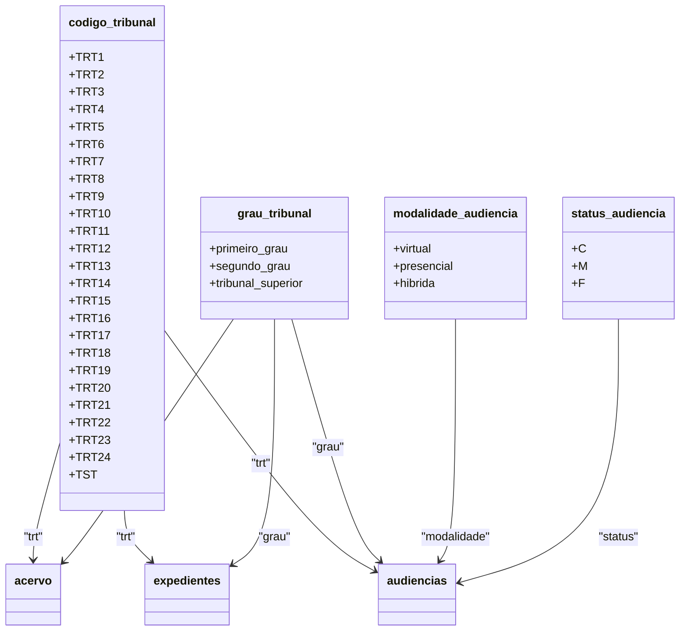
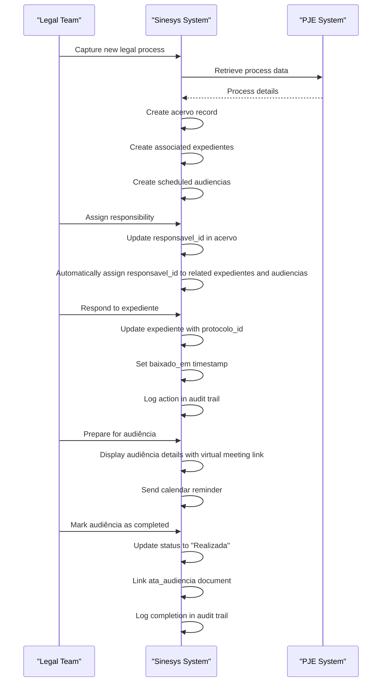

# Legal Process Tables

<cite>
**Referenced Files in This Document**   
- [04_acervo.sql](file://supabase/schemas/04_acervo.sql)
- [06_expedientes.sql](file://supabase/schemas/06_expedientes.sql)
- [07_audiencias.sql](file://supabase/schemas/07_audiencias.sql)
- [13_tribunais.sql](file://supabase/schemas/13_tribunais.sql)
- [01_enums.sql](file://supabase/schemas/01_enums.sql)
- [07_tipos_expedientes.sql](file://supabase/schemas/07_tipos_expedientes.sql)
- [acervo.ts](file://types/domain/acervo.ts)
- [audiencias.ts](file://types/domain/audiencias.ts)
- [route.ts](file://app/api/acervo/route.ts)
- [route.ts](file://app/api/audiencias/route.ts)
- [acervo-persistence.service.ts](file://backend/captura/services/persistence/acervo-persistence.service.ts)
</cite>

## Table of Contents
1. [Introduction](#introduction)
2. [Acervo Table](#acervo-table)
3. [Expedientes Table](#expedientes-table)
4. [Audiencias Table](#audiencias-table)
5. [Relationships and Dependencies](#relationships-and-dependencies)
6. [Data Integrity and Constraints](#data-integrity-and-constraints)
7. [Sample Records](#sample-records)
8. [Conclusion](#conclusion)

## Introduction
This document provides comprehensive documentation for the legal process-related database tables in the Sinesys system. The core tables documented are `acervo`, `expedientes`, and `audiencias`, which form the foundation of the system's legal process tracking functionality. These tables store critical information about legal cases, procedural documents, and court hearings, enabling comprehensive case management and workflow automation. The documentation covers table structures, field definitions, relationships, constraints, triggers, and sample data patterns to illustrate typical usage.

## Acervo Table

The `acervo` table serves as the central repository for all legal processes captured from the PJE (Processo Judicial Eletrônico) system, including both active cases and archived cases. It stores comprehensive metadata about each legal process, enabling efficient tracking and management.

### Field Definitions
The acervo table contains the following fields:

| Field Name | Data Type | Nullable | Default Value | Description |
|------------|---------|---------|---------------|-------------|
| id | bigint | No | Generated identity | Primary key, auto-incrementing identifier |
| id_pje | bigint | No | None | ID of the process in the PJE system |
| advogado_id | bigint | No | None | Foreign key to advogados table, identifies the lawyer who captured the process |
| origem | text | No | None | Source of the process: 'acervo_geral' (active cases) or 'arquivado' (archived cases) |
| trt | public.codigo_tribunal | No | None | Tribunal code (ENUM: TRT1-TRT24, TST) |
| grau | public.grau_tribunal | No | None | Degree of jurisdiction (ENUM: primeiro_grau, segundo_grau, tribunal_superior) |
| numero_processo | text | No | None | Process number in CNJ format (e.g., 0101450-28.2025.5.01.0431) |
| numero | bigint | No | None | Sequential process number |
| descricao_orgao_julgador | text | No | None | Full description of the judicial body |
| classe_judicial | text | No | None | Judicial classification of the process (e.g., ATOrd, ATSum) |
| segredo_justica | boolean | No | false | Indicates if the process is under judicial secrecy |
| codigo_status_processo | text | No | None | Status code of the process (e.g., DISTRIBUIDO) |
| prioridade_processual | integer | No | 0 | Process priority level |
| nome_parte_autora | text | No | None | Name of the plaintiff party |
| qtde_parte_autora | integer | No | 1 | Quantity of plaintiff parties |
| nome_parte_re | text | No | None | Name of the defendant party |
| qtde_parte_re | integer | No | 1 | Quantity of defendant parties |
| data_autuacao | timestamptz | No | None | Date of process filing |
| juizo_digital | boolean | No | false | Indicates if the process is from a digital court |
| data_arquivamento | timestamptz | Yes | None | Date of process archiving |
| data_proxima_audiencia | timestamptz | Yes | None | Date of the next scheduled hearing |
| tem_associacao | boolean | No | false | Indicates if the process has associated processes |
| created_at | timestamptz | No | now() | Timestamp of record creation |
| updated_at | timestamptz | No | now() | Timestamp of last record update |

### Constraints and Indexes
The acervo table includes several constraints and indexes to ensure data integrity and optimize query performance:

- **Primary Key**: `id` (auto-generated identity)
- **Foreign Key**: `advogado_id` references `advogados(id)` with cascade delete
- **Unique Constraint**: `(id_pje, trt, grau, numero_processo)` ensures process uniqueness across different degrees and tribunals
- **Check Constraint**: `origem` must be either 'acervo_geral' or 'arquivado'
- **Row Level Security**: Enabled to control data access based on user roles

The table includes multiple indexes to optimize common query patterns:
- `idx_acervo_advogado_id` on advogado_id
- `idx_acervo_origem` on origem
- `idx_acervo_trt` on trt
- `idx_acervo_grau` on grau
- `idx_acervo_numero_processo` on numero_processo
- `idx_acervo_id_pje` on id_pje
- `idx_acervo_data_autuacao` on data_autuacao
- `idx_acervo_data_arquivamento` on data_arquivamento
- `idx_acervo_advogado_trt_grau` on (advogado_id, trt, grau)
- `idx_acervo_numero_processo_trt_grau` on (numero_processo, trt, grau)

### Triggers
The acervo table has a trigger that automatically updates the `updated_at` timestamp whenever a record is modified:

```sql
create trigger update_acervo_updated_at
before update on public.acervo
for each row
execute function public.update_updated_at_column();
```

This trigger ensures that the `updated_at` field always reflects the most recent modification time of each record, providing an audit trail for changes to process information.

**Section sources**
- [04_acervo.sql](file://supabase/schemas/04_acervo.sql#L4-L77)
- [acervo.ts](file://types/domain/acervo.ts#L1-L81)
- [route.ts](file://app/api/acervo/route.ts#L1-L448)
- [acervo-persistence.service.ts](file://backend/captura/services/persistence/acervo-persistence.service.ts#L1-L292)

## Expedientes Table

The `expedientes` table consolidates procedural documents from multiple sources, including those captured from the PJE system, created manually by users, and generated through CNJ communications. This unified approach provides a comprehensive view of all pending procedural actions across all cases.

### Field Definitions
The expedientes table contains the following fields:

| Field Name | Data Type | Nullable | Default Value | Description |
|------------|---------|---------|---------------|-------------|
| id | bigint | No | Generated identity | Primary key, auto-incrementing identifier |
| id_pje | bigint | No | None | ID of the expedient in the PJE system |
| advogado_id | bigint | Yes | None | Foreign key to advogados table, identifies the capturing lawyer (nullable for manual/CNJ entries) |
| processo_id | bigint | Yes | None | Foreign key to acervo table, links to the associated process |
| trt | public.codigo_tribunal | No | None | Tribunal code |
| grau | public.grau_tribunal | No | None | Degree of jurisdiction |
| numero_processo | text | No | None | Process number in CNJ format |
| descricao_orgao_julgador | text | No | None | Full description of the judicial body |
| classe_judicial | text | No | None | Judicial classification of the process |
| numero | bigint | No | None | Sequential process number |
| segredo_justica | boolean | No | false | Indicates if the process is under judicial secrecy |
| codigo_status_processo | text | No | None | Status code of the process |
| prioridade_processual | integer | No | 0 | Process priority level |
| nome_parte_autora | text | No | None | Name of the plaintiff party |
| qtde_parte_autora | integer | No | 1 | Quantity of plaintiff parties |
| nome_parte_re | text | No | None | Name of the defendant party |
| qtde_parte_re | integer | No | 1 | Quantity of defendant parties |
| data_autuacao | timestamptz | Yes | None | Date of process filing |
| juizo_digital | boolean | No | false | Indicates if the process is from a digital court |
| data_arquivamento | timestamptz | Yes | None | Date of process archiving |
| id_documento | bigint | Yes | None | ID of the pending document |
| data_ciencia_parte | timestamptz | Yes | None | Date when the party became aware of the expedient |
| data_prazo_legal_parte | timestamptz | Yes | None | Legal deadline for party response |
| data_criacao_expediente | timestamptz | Yes | None | Date of expedient creation |
| prazo_vencido | boolean | No | false | Indicates if the response deadline has expired |
| sigla_orgao_julgador | text | Yes | None | Abbreviation of the judicial body |
| dados_anteriores | jsonb | Yes | None | Stores previous state of the record before last update |
| responsavel_id | bigint | Yes | None | Foreign key to usuarios table, identifies the user responsible for the expedient |
| baixado_em | timestamptz | Yes | None | Date and time when the expedient was resolved |
| protocolo_id | text | Yes | None | ID of the filed document in response to the expedient |
| justificativa_baixa | text | Yes | None | Justification for resolving without filing a document |
| tipo_expediente_id | bigint | Yes | None | Foreign key to tipos_expedientes table, classifies the expedient type |
| descricao_arquivos | text | Yes | None | Description of related files |
| arquivo_nome | text | Yes | None | Name of the file in Backblaze B2 storage |
| arquivo_url | text | Yes | None | Public URL of the file in Backblaze B2 |
| arquivo_bucket | text | Yes | None | Name of the bucket in Backblaze B2 |
| arquivo_key | text | Yes | None | Key of the file in Backblaze B2 |
| observacoes | text | Yes | None | Internal notes about the pending expedient |
| origem | public.origem_expediente | No | 'captura' | Source of the expedient: 'captura' (PJE), 'manual', or 'comunica_cnj' |
| created_at | timestamptz | No | now() | Timestamp of record creation |
| updated_at | timestamptz | No | now() | Timestamp of last record update |

### Constraints and Indexes
The expedientes table includes several constraints and indexes:

- **Primary Key**: `id` (auto-generated identity)
- **Foreign Keys**: 
  - `advogado_id` references `advogados(id)` with cascade delete
  - `processo_id` references `acervo(id)` with set null on delete
  - `tipo_expediente_id` references `tipos_expedientes(id)` with set null on delete
  - `responsavel_id` references `usuarios(id)` with set null on delete
- **Unique Constraint**: `(id_pje, trt, grau, numero_processo)` ensures expedient uniqueness
- **Check Constraint**: Ensures that if `baixado_em` is not null, then either `protocolo_id` or `justificativa_baixa` must be provided
- **Row Level Security**: Enabled with policies for service role (full access) and authenticated users (read, insert, update)

The table includes numerous indexes to optimize query performance:
- `idx_expedientes_advogado_id` on advogado_id
- `idx_expedientes_processo_id` on processo_id
- `idx_expedientes_trt` on trt
- `idx_expedientes_grau` on grau
- `idx_expedientes_numero_processo` on numero_processo
- `idx_expedientes_id_pje` on id_pje
- `idx_expedientes_prazo_vencido` on prazo_vencido
- `idx_expedientes_data_prazo_legal` on data_prazo_legal_parte
- `idx_expedientes_advogado_trt_grau` on (advogado_id, trt, grau)
- `idx_expedientes_numero_processo_advogado` on (numero_processo, advogado_id)
- `idx_expedientes_baixado_em` on baixado_em (where not null)
- `idx_expedientes_advogado_baixado` on (advogado_id, baixado_em) (where baixado_em is null)
- `idx_expedientes_responsavel_id` on responsavel_id
- `idx_expedientes_tipo_expediente_id` on tipo_expediente_id
- `idx_expedientes_origem` on origem

### Triggers and Functions
The expedientes table has several triggers and functions to automate business logic:

1. **Automatic Timestamp Update**:
```sql
create trigger update_expedientes_updated_at
before update on public.expedientes
for each row
execute function public.update_updated_at_column();
```

2. **Automatic Process ID Population**:
A trigger calls the `sync_expedientes_processo_id()` function before insert or update operations to automatically populate the `processo_id` field by looking up the corresponding process in the `acervo` table based on `numero_processo`, `trt`, and `grau`.

3. **Logging Functions**:
- `registrar_baixa_expediente()`: Registers expedient resolution in the audit log
- `registrar_reversao_baixa_expediente()`: Registers reversal of expedient resolution in the audit log

These functions ensure that all changes to expedient status are properly logged for audit and tracking purposes.

**Section sources**
- [06_expedientes.sql](file://supabase/schemas/06_expedientes.sql#L6-L249)
- [07_tipos_expedientes.sql](file://supabase/schemas/07_tipos_expedientes.sql#L4-L28)

## Audiencias Table

The `audiencias` table stores information about scheduled court hearings for legal processes. It captures comprehensive details about each hearing, including scheduling, location, participants, and status, enabling effective hearing management and preparation.

### Field Definitions
The audiencias table contains the following fields:

| Field Name | Data Type | Nullable | Default Value | Description |
|------------|---------|---------|---------------|-------------|
| id | bigint | No | Generated identity | Primary key, auto-incrementing identifier |
| id_pje | bigint | No | None | ID of the hearing in the PJE system |
| advogado_id | bigint | No | None | Foreign key to advogados table, identifies the capturing lawyer |
| processo_id | bigint | No | None | Foreign key to acervo table, links to the associated process |
| orgao_julgador_id | bigint | Yes | None | Foreign key to orgao_julgador table, identifies the judicial body |
| trt | public.codigo_tribunal | No | None | Tribunal code |
| grau | public.grau_tribunal | No | None | Degree of jurisdiction |
| numero_processo | text | No | None | Process number in CNJ format |
| data_inicio | timestamptz | No | None | Start date and time of the hearing |
| data_fim | timestamptz | No | None | End date and time of the hearing |
| hora_inicio | time | Yes | None | Start time of the hearing (extracted from PJE) |
| hora_fim | time | Yes | None | End time of the hearing (extracted from PJE) |
| modalidade | public.modalidade_audiencia | Yes | None | Mode of participation: virtual, presencial, or hibrida |
| sala_audiencia_nome | text | Yes | None | Name of the hearing room |
| sala_audiencia_id | bigint | Yes | None | ID of the hearing room in PJE |
| status | text | No | None | Status of the hearing (M=Marked, R=Realized, C=Cancelled) |
| status_descricao | text | Yes | None | Description of the hearing status |
| tipo_audiencia_id | bigint | Yes | None | Foreign key to tipo_audiencia table, identifies the hearing type |
| classe_judicial_id | bigint | Yes | None | Foreign key to classe_judicial table, identifies the judicial classification |
| designada | boolean | No | false | Indicates if the hearing is scheduled |
| em_andamento | boolean | No | false | Indicates if the hearing is currently in progress |
| documento_ativo | boolean | No | false | Indicates if there is an active document related to the hearing |
| polo_ativo_nome | text | Yes | None | Name of the plaintiff party |
| polo_ativo_representa_varios | boolean | No | false | Indicates if the plaintiff represents multiple parties |
| polo_passivo_nome | text | Yes | None | Name of the defendant party |
| polo_passivo_representa_varios | boolean | No | false | Indicates if the defendant represents multiple parties |
| url_audiencia_virtual | text | Yes | None | URL for virtual hearings (Zoom, Google Meet, etc.) |
| endereco_presencial | jsonb | Yes | None | Address for in-person hearings in JSON format |
| presenca_hibrida | text | Yes | None | For hybrid hearings: indicates who attends in person (advogado or cliente) |
| ata_audiencia_id | bigint | Yes | None | ID of the hearing minutes document in PJE |
| url_ata_audiencia | text | Yes | None | URL for downloading the hearing minutes |
| segredo_justica | boolean | No | false | Indicates if the process is under judicial secrecy |
| juizo_digital | boolean | No | false | Indicates if the process is from a digital court |
| responsavel_id | bigint | Yes | None | Foreign key to usuarios table, identifies the user responsible for the hearing |
| observacoes | text | Yes | None | Notes about the hearing |
| dados_anteriores | jsonb | Yes | None | Stores previous state of the record before last update |
| created_at | timestamptz | No | now() | Timestamp of record creation |
| updated_at | timestamptz | No | now() | Timestamp of last record update |

### Constraints and Indexes
The audiencias table includes several constraints and indexes:

- **Primary Key**: `id` (auto-generated identity)
- **Foreign Keys**:
  - `advogado_id` references `advogados(id)` with cascade delete
  - `processo_id` references `acervo(id)` with cascade delete
  - `orgao_julgador_id` references `orgao_julgador(id)` with set null on delete
  - `tipo_audiencia_id` references `tipo_audiencia(id)` with set null on delete
  - `classe_judicial_id` references `classe_judicial(id)` with set null on delete
  - `responsavel_id` references `usuarios(id)` with set null on delete
- **Unique Constraint**: `(id_pje, trt, grau, numero_processo)` ensures hearing uniqueness
- **Check Constraint**: `presenca_hibrida` must be null or one of 'advogado', 'cliente'
- **Row Level Security**: Enabled to control data access based on user roles

The table includes multiple indexes to optimize query performance:
- `idx_audiencias_advogado_id` on advogado_id
- `idx_audiencias_processo_id` on processo_id
- `idx_audiencias_orgao_julgador_id` on orgao_julgador_id
- `idx_audiencias_trt` on trt
- `idx_audiencias_grau` on grau
- `idx_audiencias_id_pje` on id_pje
- `idx_audiencias_numero_processo` on numero_processo
- `idx_audiencias_status` on status
- `idx_audiencias_data_inicio` on data_inicio
- `idx_audiencias_data_fim` on data_fim
- `idx_audiencias_responsavel_id` on responsavel_id
- `idx_audiencias_advogado_trt_grau` on (advogado_id, trt, grau)
- `idx_audiencias_processo_data` on (processo_id, data_inicio)
- `idx_audiencias_modalidade` on modalidade

### Triggers and Functions
The audiencias table has several triggers and functions to automate business logic:

1. **Automatic Modalidade Population**:
The `populate_modalidade_audiencia()` function automatically determines the hearing mode based on available information:
- If `url_audiencia_virtual` is provided, mode is set to 'virtual'
- If `endereco_presencial` is provided, mode is set to 'presencial'
- If the hearing type description contains 'videoconfer', mode is set to 'virtual'
- Hybrid mode must be set manually

This function is called by the `trigger_set_modalidade_audiencia` trigger before insert or update operations.

2. **Automatic Timestamp Update**:
```sql
create trigger update_audiencias_updated_at
before update on public.audiencias
for each row
execute function public.update_updated_at_column();
```

This trigger ensures that the `updated_at` field always reflects the most recent modification time of each record.

**Section sources**
- [07_audiencias.sql](file://supabase/schemas/07_audiencias.sql#L4-L159)
- [audiencias.ts](file://types/domain/audiencias.ts#L1-L77)
- [route.ts](file://app/api/audiencias/route.ts#L1-L499)

## Relationships and Dependencies

The legal process tables in the Sinesys system are interconnected through a well-defined relationship structure that enables comprehensive case management and data consistency.

### Entity Relationship Diagram

```mermaid
erDiagram
ACERVO ||--o{ EXPEDIENTES : "has"
ACERVO ||--o{ AUDIENCIAS : "has"
ACERVO }|--|| ADVOCADOS : "captured by"
ACERVO }|--|| USUARIOS : "responsible for"
EXPEDIENTES }|--|| TIPOS_EXPEDIENTES : "classified as"
EXPEDIENTES }|--|| USUARIOS : "responsible for"
AUDIENCIAS }|--|| TIPO_AUDIENCIA : "type"
AUDIENCIAS }|--|| CLASSE_JUDICIAL : "classification"
AUDIENCIAS }|--|| USUARIOS : "responsible for"
AUDIENCIAS }|--|| ORGAO_JULGADOR : "held at"
ADVOCADOS ||--o{ ACERVO : "captures"
ADVOCADOS ||--o{ EXPEDIENTES : "captures"
ADVOCADOS ||--o{ AUDIENCIAS : "captures"
USUARIOS ||--o{ EXPEDIENTES : "manages"
USUARIOS ||--o{ AUDIENCIAS : "manages"
ACERVO {
bigint id PK
bigint id_pje
bigint advogado_id FK
text origem
text trt
text grau
text numero_processo
text descricao_orgao_julgador
text classe_judicial
boolean segredo_justica
text codigo_status_processo
integer prioridade_processual
text nome_parte_autora
integer qtde_parte_autora
text nome_parte_re
integer qtde_parte_re
timestamptz data_autuacao
boolean juizo_digital
timestamptz data_arquivamento
timestamptz data_proxima_audiencia
boolean tem_associacao
bigint responsavel_id FK
timestamptz created_at
timestamptz updated_at
}
EXPEDIENTES {
bigint id PK
bigint id_pje
bigint advogado_id FK
bigint processo_id FK
text trt
text grau
text numero_processo
text descricao_orgao_julgador
text classe_judicial
bigint numero
boolean segredo_justica
text codigo_status_processo
integer prioridade_processual
text nome_parte_autora
integer qtde_parte_autora
text nome_parte_re
integer qtde_parte_re
timestamptz data_autuacao
boolean juizo_digital
timestamptz data_arquivamento
bigint id_documento
timestamptz data_ciencia_parte
timestamptz data_prazo_legal_parte
timestamptz data_criacao_expediente
boolean prazo_vencido
text sigla_orgao_julgador
jsonb dados_anteriores
bigint responsavel_id FK
timestamptz baixado_em
text protocolo_id
text justificativa_baixa
bigint tipo_expediente_id FK
text descricao_arquivos
text arquivo_nome
text arquivo_url
text arquivo_bucket
text arquivo_key
text observacoes
text origem
timestamptz created_at
timestamptz updated_at
}
AUDIENCIAS {
bigint id PK
bigint id_pje
bigint advogado_id FK
bigint processo_id FK
bigint orgao_julgador_id FK
text trt
text grau
text numero_processo
timestamptz data_inicio
timestamptz data_fim
time hora_inicio
time hora_fim
text modalidade
text sala_audiencia_nome
bigint sala_audiencia_id
text status
text status_descricao
bigint tipo_audiencia_id FK
bigint classe_judicial_id FK
boolean designada
boolean em_andamento
boolean documento_ativo
text polo_ativo_nome
boolean polo_ativo_representa_varios
text polo_passivo_nome
boolean polo_passivo_representa_varios
text url_audiencia_virtual
jsonb endereco_presencial
text presenca_hibrida
bigint ata_audiencia_id
text url_ata_audiencia
boolean segredo_justica
boolean juizo_digital
bigint responsavel_id FK
text observacoes
jsonb dados_anteriores
timestamptz created_at
timestamptz updated_at
}
```


**Diagram sources**
- [04_acervo.sql](file://supabase/schemas/04_acervo.sql#L4-L77)
- [06_expedientes.sql](file://supabase/schemas/06_expedientes.sql#L6-L249)
- [07_audiencias.sql](file://supabase/schemas/07_audiencias.sql#L4-L159)
- [13_tribunais.sql](file://supabase/schemas/13_tribunais.sql#L6-L94)

### Relationship Details
The core relationships between the legal process tables are:

1. **Acervo to Expedientes (One-to-Many)**:
   - Each process in the `acervo` table can have multiple associated expedients in the `expedientes` table
   - The relationship is established through the `processo_id` foreign key in the `expedientes` table
   - When a process is deleted, associated expedients have their `processo_id` set to null (set null on delete)

2. **Acervo to Audiencias (One-to-Many)**:
   - Each process in the `acervo` table can have multiple associated hearings in the `audiencias` table
   - The relationship is established through the `processo_id` foreign key in the `audiencias` table
   - When a process is deleted, associated hearings are also deleted (cascade delete)

3. **Cross-Table Relationships**:
   - Both `expedientes` and `audiencias` tables reference the `acervo` table through `numero_processo`, `trt`, and `grau` fields, allowing for process identification even when the direct foreign key relationship is not available
   - The `responsavel_id` field in all three tables references the `usuarios` table, enabling assignment of responsibility for processes, expedients, and hearings
   - The `advogado_id` field in all three tables references the `advogados` table, identifying the capturing lawyer

These relationships enable the system to provide a comprehensive view of each legal process, including all associated procedural documents and scheduled hearings, while maintaining data integrity through proper foreign key constraints.

## Data Integrity and Constraints

The legal process tables in the Sinesys system implement comprehensive data integrity constraints to ensure accuracy, consistency, and reliability of legal process information.

### ENUM Types and Domain Constraints
The system uses several ENUM types to enforce data consistency across tables:



**Diagram sources**
- [01_enums.sql](file://supabase/schemas/01_enums.sql#L10-L143)

### Data Validation Rules
The tables implement several validation rules to ensure data quality:

1. **Acervo Table**:
   - `origem` must be either 'acervo_geral' or 'arquivado'
   - Process uniqueness is enforced by the composite unique constraint on `(id_pje, trt, grau, numero_processo)`
   - Multiple indexes support efficient querying by common search criteria

2. **Expedientes Table**:
   - `origem` must be one of 'captura', 'manual', or 'comunica_cnj'
   - Business rule constraint: If `baixado_em` is not null, then either `protocolo_id` or `justificativa_baixa` must be provided
   - Expedient uniqueness is enforced by the composite unique constraint on `(id_pje, trt, grau, numero_processo)`

3. **Audiencias Table**:
   - `presenca_hibrida` must be null or one of 'advogado', 'cliente'
   - Hearing uniqueness is enforced by the composite unique constraint on `(id_pje, trt, grau, numero_processo)`
   - The `populate_modalidade_audiencia()` function automatically determines hearing mode based on available information

### Audit and Change Tracking
The system implements comprehensive audit and change tracking mechanisms:

1. **Timestamp Automation**:
   - All three tables have `created_at` and `updated_at` fields
   - Triggers automatically update the `updated_at` field on every record modification
   - This provides a complete audit trail of when records were created and last modified

2. **Change History**:
   - The `dados_anteriores` field in both `expedientes` and `audiencias` tables stores the previous state of the record before the last update
   - This JSONB field captures all changed fields, enabling detailed change tracking and rollback capabilities

3. **Action Logging**:
   - The system uses the `logs_alteracao` table to record significant actions
   - Functions like `registrar_baixa_expediente()` and `registrar_reversao_baixa_expediente()` create audit entries for expedient status changes
   - This provides a complete history of all important actions taken on legal processes

These integrity constraints and validation rules ensure that the legal process data remains accurate, consistent, and reliable throughout its lifecycle in the system.

**Section sources**
- [01_enums.sql](file://supabase/schemas/01_enums.sql#L10-L143)
- [04_acervo.sql](file://supabase/schemas/04_acervo.sql#L4-L77)
- [06_expedientes.sql](file://supabase/schemas/06_expedientes.sql#L6-L249)
- [07_audiencias.sql](file://supabase/schemas/07_audiencias.sql#L4-L159)

## Sample Records

This section provides sample records that illustrate typical data patterns in the legal process tables. These examples demonstrate how the tables work together to represent real-world legal scenarios.

### Sample Acervo Record
```json
{
  "id": 12345,
  "id_pje": 67890,
  "advogado_id": 501,
  "origem": "acervo_geral",
  "trt": "TRT3",
  "grau": "primeiro_grau",
  "numero_processo": "0010014-94.2025.5.03.0022",
  "numero": 10014,
  "descricao_orgao_julgador": "3ª Vara do Trabalho de São Paulo",
  "classe_judicial": "ATOrd",
  "segredo_justica": false,
  "codigo_status_processo": "DISTRIBUIDO",
  "prioridade_processual": 0,
  "nome_parte_autora": "João Silva",
  "qtde_parte_autora": 1,
  "nome_parte_re": "Empresa XYZ Ltda",
  "qtde_parte_re": 1,
  "data_autuacao": "2025-01-10T13:03:15.862Z",
  "juizo_digital": true,
  "data_arquivamento": null,
  "data_proxima_audiencia": "2025-02-15T14:00:00.000Z",
  "tem_associacao": false,
  "responsavel_id": 21,
  "created_at": "2025-01-10T13:05:22.123Z",
  "updated_at": "2025-01-15T09:30:45.678Z"
}
```

### Sample Expedientes Record
```json
{
  "id": 54321,
  "id_pje": 98765,
  "advogado_id": 501,
  "processo_id": 12345,
  "trt": "TRT3",
  "grau": "primeiro_grau",
  "numero_processo": "0010014-94.2025.5.03.0022",
  "descricao_orgao_julgador": "3ª Vara do Trabalho de São Paulo",
  "classe_judicial": "ATOrd",
  "numero": 10014,
  "segredo_justica": false,
  "codigo_status_processo": "DISTRIBUIDO",
  "prioridade_processual": 0,
  "nome_parte_autora": "João Silva",
  "qtde_parte_autora": 1,
  "nome_parte_re": "Empresa XYZ Ltda",
  "qtde_parte_re": 1,
  "data_autuacao": "2025-01-10T13:03:15.862Z",
  "juizo_digital": true,
  "data_arquivamento": null,
  "id_documento": 11111,
  "data_ciencia_parte": "2025-01-12T10:00:00.000Z",
  "data_prazo_legal_parte": "2025-01-26T23:59:59.000Z",
  "data_criacao_expediente": "2025-01-12T09:30:00.000Z",
  "prazo_vencido": false,
  "sigla_orgao_julgador": "VT3SP",
  "dados_anteriores": null,
  "responsavel_id": 21,
  "baixado_em": null,
  "protocolo_id": null,
  "justificativa_baixa": null,
  "tipo_expediente_id": 7,
  "descricao_arquivos": "Petição de contestação anexada",
  "arquivo_nome": "contestacao_joao_silva.pdf",
  "arquivo_url": "https://storage.example.com/files/contestacao_joao_silva.pdf",
  "arquivo_bucket": "sinesys-docs",
  "arquivo_key": "expedientes/54321/contestacao_joao_silva.pdf",
  "observacoes": "Cliente solicitou análise urgente do processo",
  "origem": "captura",
  "created_at": "2025-01-12T09:35:22.456Z",
  "updated_at": "2025-01-12T09:35:22.456Z"
}
```

### Sample Audiencias Record
```json
{
  "id": 98765,
  "id_pje": 54321,
  "advogado_id": 501,
  "processo_id": 12345,
  "orgao_julgador_id": 301,
  "trt": "TRT3",
  "grau": "primeiro_grau",
  "numero_processo": "0010014-94.2025.5.03.0022",
  "data_inicio": "2025-02-15T14:00:00.000Z",
  "data_fim": "2025-02-15T16:00:00.000Z",
  "hora_inicio": "14:00:00",
  "hora_fim": "16:00:00",
  "modalidade": "virtual",
  "sala_audiencia_nome": "Sala Virtual 3",
  "sala_audiencia_id": 203,
  "status": "M",
  "status_descricao": "Audiência designada",
  "tipo_audiencia_id": 15,
  "classe_judicial_id": 8,
  "designada": true,
  "em_andamento": false,
  "documento_ativo": true,
  "polo_ativo_nome": "João Silva",
  "polo_ativo_representa_varios": false,
  "polo_passivo_nome": "Empresa XYZ Ltda",
  "polo_passivo_representa_varios": false,
  "url_audiencia_virtual": "https://meet.google.com/abc-defg-hij",
  "endereco_presencial": null,
  "presenca_hibrida": null,
  "ata_audiencia_id": null,
  "url_ata_audiencia": null,
  "segredo_justica": false,
  "juizo_digital": true,
  "responsavel_id": 21,
  "observacoes": "Cliente será representado pelo advogado na audiência virtual",
  "dados_anteriores": null,
  "created_at": "2025-01-15T14:30:22.789Z",
  "updated_at": "2025-01-15T14:30:22.789Z"
}
```

### Data Flow Scenario
The following sequence diagram illustrates how these tables work together in a typical workflow:



**Diagram sources**
- [04_acervo.sql](file://supabase/schemas/04_acervo.sql#L4-L77)
- [06_expedientes.sql](file://supabase/schemas/06_expedientes.sql#L6-L249)
- [07_audiencias.sql](file://supabase/schemas/07_audiencias.sql#L4-L159)

These sample records and scenarios demonstrate how the legal process tables work together to provide a comprehensive case management system, tracking all aspects of legal proceedings from initial capture through resolution.

**Section sources**
- [04_acervo.sql](file://supabase/schemas/04_acervo.sql#L4-L77)
- [06_expedientes.sql](file://supabase/schemas/06_expedientes.sql#L6-L249)
- [07_audiencias.sql](file://supabase/schemas/07_audiencias.sql#L4-L159)

## Conclusion
The legal process tables in the Sinesys system—`acervo`, `expedientes`, and `audiencias`—form a robust foundation for comprehensive case management. These tables work together to provide a complete view of legal proceedings, from initial process capture through procedural actions and scheduled hearings.

The `acervo` table serves as the central repository for all legal processes, storing essential metadata and establishing the foundation for case tracking. The `expedientes` table extends this functionality by managing all procedural documents and pending actions, with support for multiple sources including PJE captures, manual entries, and CNJ communications. The `audiencias` table provides detailed management of court hearings, supporting both virtual and in-person proceedings with comprehensive scheduling and tracking capabilities.

Key strengths of this design include:
- **Data Integrity**: Comprehensive constraints, ENUM types, and validation rules ensure data accuracy and consistency
- **Auditability**: Automatic timestamp updates, change history tracking, and action logging provide complete audit trails
- **Scalability**: Efficient indexing and query optimization support large volumes of legal cases
- **Flexibility**: Support for multiple capture sources and manual entries accommodates diverse workflow needs
- **Integration**: Well-defined relationships enable comprehensive case views and automated workflows

The system's architecture supports the core legal process tracking functionality by providing a unified view of all case-related information, enabling legal teams to efficiently manage their caseload, meet deadlines, and ensure compliance with procedural requirements. The combination of automated data capture from external systems and flexible manual entry options creates a powerful tool for modern legal practice management.

**Section sources**
- [04_acervo.sql](file://supabase/schemas/04_acervo.sql#L4-L77)
- [06_expedientes.sql](file://supabase/schemas/06_expedientes.sql#L6-L249)
- [07_audiencias.sql](file://supabase/schemas/07_audiencias.sql#L4-L159)
- [01_enums.sql](file://supabase/schemas/01_enums.sql#L10-L143)
- [13_tribunais.sql](file://supabase/schemas/13_tribunais.sql#L6-L94)