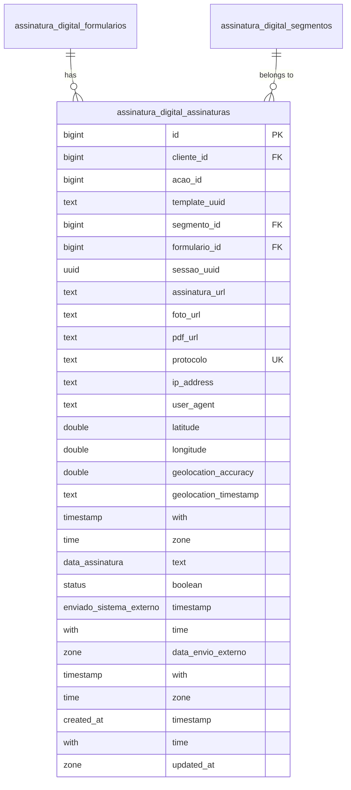
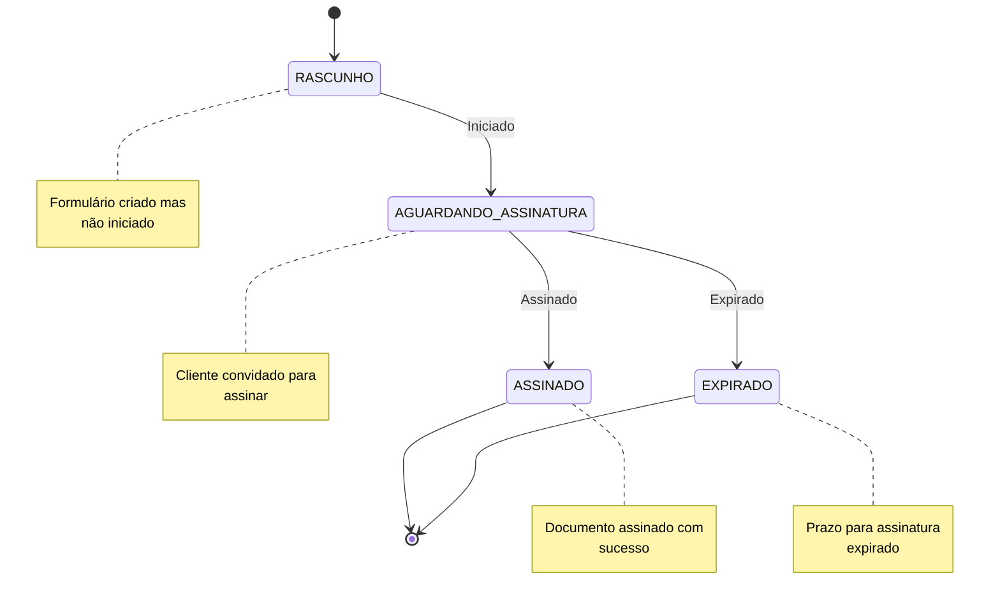
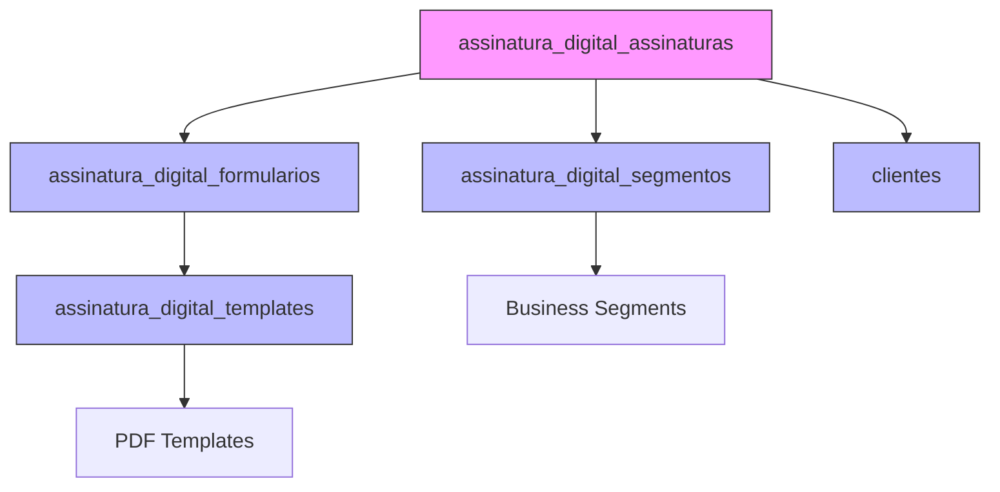
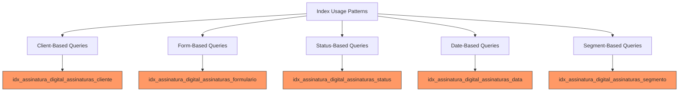
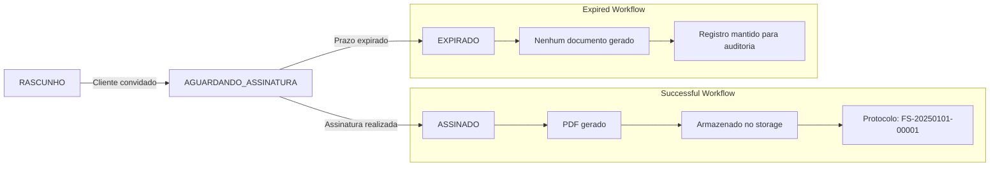
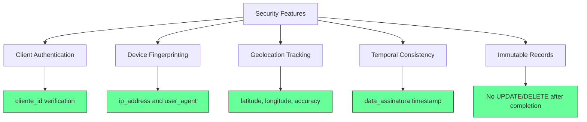

# Assinatura Digital Table

<cite>
**Referenced Files in This Document**   
- [25_assinatura_digital.sql](file://supabase/schemas/25_assinatura_digital.sql)
- [signature.service.ts](file://backend/assinatura-digital/services/signature.service.ts)
- [data.service.ts](file://backend/assinatura-digital/services/data.service.ts)
- [formularios.service.ts](file://backend/assinatura-digital/services/formularios.service.ts)
- [constants.ts](file://backend/assinatura-digital/services/constants.ts)
- [formulario-entity.types.ts](file://types/assinatura-digital/formulario-entity.types.ts)
- [formulario.types.ts](file://types/assinatura-digital/formulario.types.ts)
- [20251203120000_rename_formsign_to_assinatura_digital.sql](file://supabase/migrations/aplicadas/20251203120000_rename_formsign_to_assinatura_digital.sql)
</cite>

## Table of Contents
1. [Introduction](#introduction)
2. [Table Structure](#table-structure)
3. [Field Definitions](#field-definitions)
4. [Status Lifecycle](#status-lifecycle)
5. [Relationships](#relationships)
6. [Indexes and Performance](#indexes-and-performance)
7. [Constraints and Data Integrity](#constraints-and-data-integrity)
8. [Sample Records](#sample-records)
9. [Security and Audit Trail](#security-and-audit-trail)
10. [Expiration Policies](#expiration-policies)

## Introduction

The `assinatura_digital_assinaturas` table in the Sinesys system serves as the central repository for completed digital signature workflows. This table captures the final state of digital signature processes, storing critical metadata, document references, and audit information for legal and compliance purposes. The table is part of a comprehensive digital signature system that enables secure, auditable, and legally valid electronic signing of documents across various business segments.

The digital signature workflow begins with form creation and template association, progresses through client data collection and signature capture, and culminates in the creation of a permanent record in this table. Each record represents a successfully completed signature process, containing references to the originating form, the signed document, and comprehensive metadata about the signing context.

This documentation provides a comprehensive overview of the `assinatura_digital_assinaturas` table, detailing its structure, relationships, business rules, and operational characteristics to support system understanding, development, and maintenance.

**Section sources**
- [25_assinatura_digital.sql](file://supabase/schemas/25_assinatura_digital.sql)
- [signature.service.ts](file://backend/assinatura-digital/services/signature.service.ts)

## Table Structure

The `assinatura_digital_assinaturas` table is designed to store completed digital signature records with comprehensive metadata for audit and compliance purposes. The table structure includes fields for entity relationships, document references, geolocation data, timestamps, and status tracking.

**Diagram sources**
- [25_assinatura_digital.sql](file://supabase/schemas/25_assinatura_digital.sql)

**Section sources**
- [25_assinatura_digital.sql](file://supabase/schemas/25_assinatura_digital.sql)

## Field Definitions

The `assinatura_digital_assinaturas` table contains the following fields, each serving a specific purpose in the digital signature workflow:

| Field Name | Data Type | Nullable | Default Value | Description |
|------------|-----------|----------|---------------|-------------|
| id | bigint | NO | Generated | Primary key, auto-incrementing identifier |
| cliente_id | bigint | NO | - | Foreign key to the clients table, identifies the signing party |
| acao_id | bigint | NO | - | Business action identifier associated with the signature |
| template_uuid | text | NO | - | Reference to the template used for document generation |
| segmento_id | bigint | NO | - | Foreign key to assinatura_digital_segmentos, categorizes the business context |
| formulario_id | bigint | NO | - | Foreign key to assinatura_digital_formularios, links to the source form |
| sessao_uuid | uuid | NO | Generated | Unique identifier for the signing session |
| assinatura_url | text | NO | - | URL reference to the stored signature image |
| foto_url | text | YES | - | URL reference to the stored client photo (if captured) |
| pdf_url | text | NO | - | URL reference to the final signed PDF document |
| protocolo | text | NO | Generated | Unique protocol number for the signed document |
| ip_address | text | YES | - | IP address of the client during signing |
| user_agent | text | YES | - | User agent string of the client's browser/device |
| latitude | double precision | YES | - | Geolocation latitude coordinate |
| longitude | double precision | YES | - | Geolocation longitude coordinate |
| geolocation_accuracy | double precision | YES | - | Accuracy radius of geolocation data in meters |
| geolocation_timestamp | text | YES | - | Timestamp of geolocation capture |
| data_assinatura | timestamp with time zone | NO | - | Date and time when the document was signed |
| status | text | NO | 'concluida' | Current status of the signature process |
| enviado_sistema_externo | boolean | NO | false | Flag indicating if sent to external systems |
| data_envio_externo | timestamp with time zone | YES | - | Date and time when sent to external systems |
| created_at | timestamp with time zone | NO | now() | Record creation timestamp |
| updated_at | timestamp with time zone | NO | now() | Record last update timestamp |

**Section sources**
- [25_assinatura_digital.sql](file://supabase/schemas/25_assinatura_digital.sql)
- [formulario-entity.types.ts](file://types/assinatura-digital/formulario-entity.types.ts)

## Status Lifecycle

The `status` field in the `assinatura_digital_assinaturas` table represents the current state of the digital signature process. The system implements a state machine pattern to manage the progression of signature workflows from initiation to completion.

The status lifecycle begins with 'RASCUNHO' (Draft) when a new signature process is initiated. When the client is invited to sign, the status transitions to 'AGUARDANDO_ASSINATURA' (Waiting for Signature). Upon successful completion of the signing process, the status changes to 'ASSINADO' (Signed). If the client fails to complete the signing within the allowed timeframe, the status transitions to 'EXPIRADO' (Expired).

The system enforces business rules through status transitions, preventing invalid state changes. For example, a record cannot transition from 'EXPIRADO' back to 'AGUARDANDO_ASSINATURA' without creating a new signature request. The status field is critical for workflow management, reporting, and user interface display, allowing users to quickly identify the current state of each signature process.

**Diagram sources**
- [signature.service.ts](file://backend/assinatura-digital/services/signature.service.ts)

**Section sources**
- [25_assinatura_digital.sql](file://supabase/schemas/25_assinatura_digital.sql)
- [signature.service.ts](file://backend/assinatura-digital/services/signature.service.ts)

## Relationships

The `assinatura_digital_assinaturas` table maintains critical relationships with other entities in the digital signature system, forming a comprehensive workflow from form creation to final document storage.

The primary relationship is with the `assinatura_digital_formularios` table through the `formulario_id` foreign key. This relationship connects each completed signature to the specific form that initiated the process, preserving the context of the data collected. The form itself is associated with one or more templates that define the document structure.

The relationship with `assinatura_digital_segmentos` through the `segmento_id` foreign key categorizes signatures by business segment (e.g., labor law, civil law, previdentiary), enabling segment-specific workflows and reporting. This segmentation allows the system to apply different rules, templates, and processes based on the legal domain.

The table also maintains a direct relationship with the clients table through `cliente_id`, identifying the individual or entity that performed the signature. This relationship ensures data consistency and enables client-specific reporting and audit trails.

These relationships create a complete chain of custody for digital signatures, from the business context (segment) through the data collection mechanism (form) to the final signed document, providing a robust foundation for legal validity and compliance.

**Diagram sources**
- [25_assinatura_digital.sql](file://supabase/schemas/25_assinatura_digital.sql)

**Section sources**
- [25_assinatura_digital.sql](file://supabase/schemas/25_assinatura_digital.sql)
- [formularios.service.ts](file://backend/assinatura-digital/services/formularios.service.ts)

## Indexes and Performance

The `assinatura_digital_assinaturas` table is optimized for efficient querying through a comprehensive indexing strategy that supports common access patterns in the digital signature workflow.

The table features the following indexes to optimize query performance:

- `idx_assinatura_digital_assinaturas_cliente` on `cliente_id`: Optimizes queries for all signatures associated with a specific client, supporting client history views and audit trails.
- `idx_assinatura_digital_assinaturas_formulario` on `formulario_id`: Enables efficient retrieval of all signatures for a specific form type, supporting form usage analytics and template management.
- `idx_assinatura_digital_assinaturas_status` on `status`: Accelerates queries for signatures in specific states (e.g., pending, completed, expired), crucial for workflow management interfaces.
- `idx_assinatura_digital_assinaturas_data` on `data_assinatura`: Optimizes date-range queries for signatures, supporting reporting and compliance requirements.
- `idx_assinatura_digital_assinaturas_segmento` on `segmento_id`: Facilitates queries for signatures within specific business segments, enabling segment-specific reporting and analysis.

These indexes are designed to support the most common query patterns in the application, ensuring responsive performance even as the volume of signature records grows. The indexing strategy balances query performance with write performance, avoiding excessive indexing that could impact insertion speed during signature completion.

**Diagram sources**
- [25_assinatura_digital.sql](file://supabase/schemas/25_assinatura_digital.sql)

**Section sources**
- [25_assinatura_digital.sql](file://supabase/schemas/25_assinatura_digital.sql)

## Constraints and Data Integrity

The `assinatura_digital_assinaturas` table implements comprehensive constraints to ensure data consistency and integrity throughout the digital signature process. These constraints enforce business rules at the database level, providing a reliable foundation for the system's legal and compliance requirements.

The table includes foreign key constraints that maintain referential integrity with related entities:
- `segmento_id` references `assinatura_digital_segmentos(id)` with `ON DELETE RESTRICT`, preventing deletion of segments that have associated signatures.
- `formulario_id` references `assinatura_digital_formularios(id)` with `ON DELETE RESTRICT`, ensuring forms cannot be deleted if they have completed signatures.

The `protocolo` field has a unique constraint (`UNIQUE`), guaranteeing that each signed document has a globally unique identifier. This prevents duplicate processing and ensures reliable document tracking across the system.

The `status` field, while not explicitly defined with a CHECK constraint in the provided schema, follows a controlled lifecycle managed by the application logic in `signature.service.ts`. The service enforces valid state transitions and prevents invalid status values.

Row-level security (RLS) policies are implemented on the table, allowing the `service_role` full access while granting authenticated users appropriate permissions for insert and select operations. This security model ensures that only authorized components and users can modify or access signature data.

These constraints work together to create a tamper-evident record of digital signature processes, supporting the legal validity of signed documents and meeting regulatory requirements for electronic signatures.

**Section sources**
- [25_assinatura_digital.sql](file://supabase/schemas/25_assinatura_digital.sql)
- [signature.service.ts](file://backend/assinatura-digital/services/signature.service.ts)

## Sample Records

The following sample records illustrate different signature workflow scenarios from creation to completion, demonstrating the data captured in the `assinatura_digital_assinaturas` table.

**Scenario 1: Successful Signature Completion**
- `status`: 'ASSINADO'
- `data_assinatura`: '2025-01-15 14:30:25+00'
- `ip_address`: '192.168.1.100'
- `user_agent`: 'Mozilla/5.0 (iPhone; CPU iPhone OS 18_0 like Mac OS X)'
- `latitude`: -23.55052
- `longitude`: -46.633308
- `pdf_url`: 'https://storage.example.com/signed/contract-001.pdf'
- `protocolo`: 'FS-20250115-00001'

**Scenario 2: Expired Signature Request**
- `status`: 'EXPIRADO'
- `data_assinatura`: NULL
- `ip_address`: NULL
- `user_agent`: NULL
- `latitude`: NULL
- `longitude`: NULL
- `pdf_url`: NULL
- `protocolo`: 'FS-20250110-00002'
- `created_at`: '2025-01-10 09:15:00+00'
- `updated_at`: '2025-01-17 09:15:00+00' (7 days later)

These sample records demonstrate how the table captures both successful and failed signature workflows, maintaining a complete audit trail regardless of outcome. The successful scenario shows comprehensive metadata capture, while the expired scenario preserves the request context for auditing purposes.

**Diagram sources**
- [signature.service.ts](file://backend/assinatura-digital/services/signature.service.ts)

**Section sources**
- [signature.service.ts](file://backend/assinatura-digital/services/signature.service.ts)
- [data.service.ts](file://backend/assinatura-digital/services/data.service.ts)

## Security and Audit Trail

The `assinatura_digital_assinaturas` table serves as a critical component of the system's security and audit infrastructure, capturing comprehensive metadata that establishes the authenticity and integrity of digital signatures.

The table captures multiple security-relevant data points that collectively form a robust audit trail:
- Network context through `ip_address` and `user_agent`, identifying the client's device and browser
- Geospatial context through `latitude`, `longitude`, and `geolocation_accuracy`, providing physical location evidence
- Temporal context through `data_assinatura`, establishing when the signature occurred
- Entity relationships through foreign keys, connecting the signature to the client, form, and business segment

The audit trail is further strengthened by the immutability of completed records. Once a signature is marked as 'ASSINADO', the record becomes effectively immutable, with business logic preventing modifications that could compromise the integrity of the audit trail. The `created_at` and `updated_at` timestamps provide additional temporal verification, while the unique `protocolo` serves as a verifiable identifier for the signed document.

This comprehensive audit capability supports compliance with legal requirements for electronic signatures, providing evidence of the signing context that can be used to verify the authenticity of signed documents in legal proceedings.

**Diagram sources**
- [25_assinatura_digital.sql](file://supabase/schemas/25_assinatura_digital.sql)

**Section sources**
- [25_assinatura_digital.sql](file://supabase/schemas/25_assinatura_digital.sql)
- [signature.service.ts](file://backend/assinatura-digital/services/signature.service.ts)

## Expiration Policies

The digital signature system implements expiration policies to manage the lifecycle of signature requests and ensure timely completion of legal processes. While the `assinatura_digital_assinaturas` table itself stores completed signatures, the expiration logic is managed through related tables and application services.

The `assinatura_digital_sessoes_assinatura` table contains an `expires_at` timestamp field that defines when a signature session expires. When this timestamp is reached without completion, the associated signature process is marked as 'EXPIRADO' in the workflow. This expiration mechanism prevents indefinite pending states and ensures that signature requests are either completed or formally closed.

The expiration policy is configurable at the form level through the `assinatura_digital_formularios` table, which can define default expiration periods for different types of documents. Business logic in the `signature.service.ts` file enforces these policies by checking session expiration times and updating statuses accordingly.

For completed signatures, the system maintains the records indefinitely to satisfy legal retention requirements for signed documents. The `created_at` timestamp provides the basis for archival policies, while the `enviado_sistema_externo` flag and `data_envio_externo` timestamp track integration with external document management systems.

These expiration policies balance usability with legal compliance, ensuring that signature processes are completed in a timely manner while preserving a permanent record of both successful and expired requests for audit and compliance purposes.

**Section sources**
- [25_assinatura_digital.sql](file://supabase/schemas/25_assinatura_digital.sql)
- [signature.service.ts](file://backend/assinatura-digital/services/signature.service.ts)