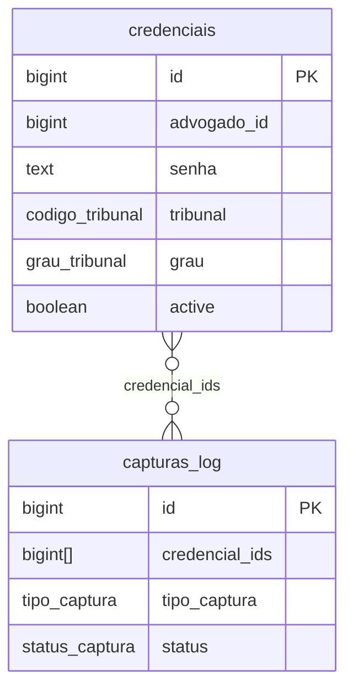
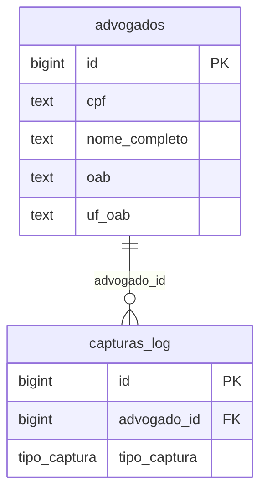
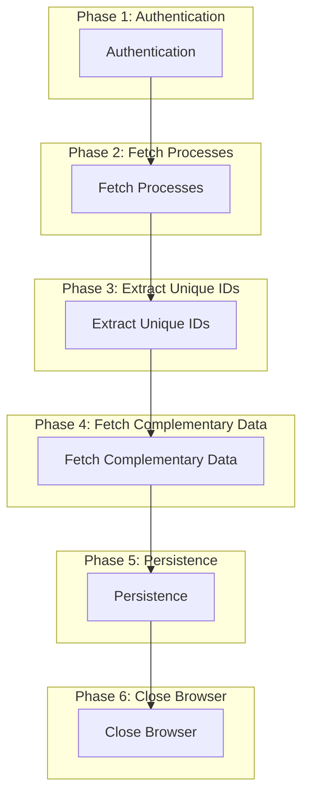
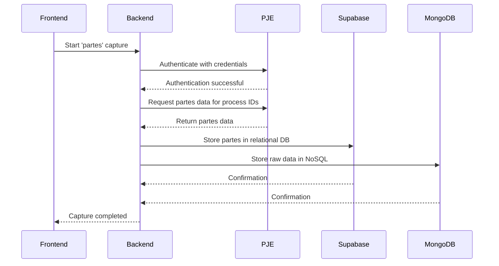
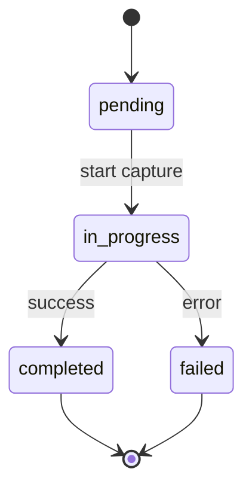
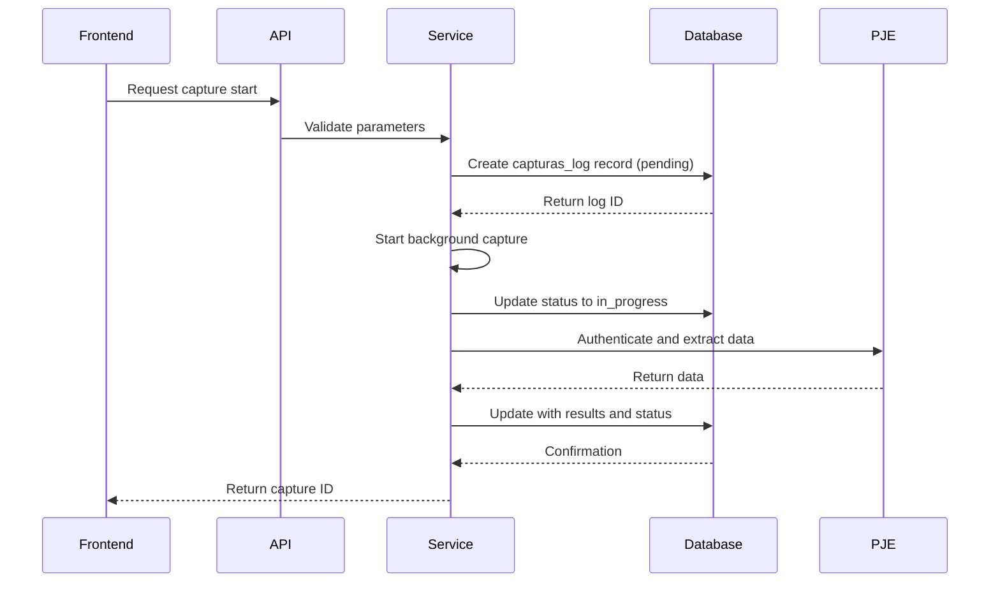

# Capturas Table

<cite>
**Referenced Files in This Document**   
- [21_capturas.sql](file://supabase/schemas/21_capturas.sql)
- [01_enums.sql](file://supabase/schemas/01_enums.sql)
- [captura-log-persistence.service.ts](file://backend/captura/services/persistence/captura-log-persistence.service.ts)
- [captura-log.service.ts](file://backend/captura/services/captura-log.service.ts)
- [credential.service.ts](file://backend/captura/credentials/credential.service.ts)
- [acervo-geral.service.ts](file://backend/captura/services/trt/acervo-geral.service.ts)
- [partes-capture.service.ts](file://backend/captura/services/partes/partes-capture.service.ts)
</cite>

## Table of Contents
1. [Introduction](#introduction)
2. [Table Structure](#table-structure)
3. [Field Definitions](#field-definitions)
4. [Relationships](#relationships)
5. [Workflow Processing](#workflow-processing)
6. [Indexes](#indexes)
7. [Constraints and Triggers](#constraints-and-triggers)
8. [Sample Records](#sample-records)
9. [Data Capture Coordination](#data-capture-coordination)
10. [Conclusion](#conclusion)

## Introduction
The `capturas_log` table in the Sinesys system serves as the central repository for tracking all data capture operations from judicial systems, particularly the PJE-TRT (Processo Judicial Eletrônico do Tribunal Regional do Trabalho). This table records metadata about each capture execution, including type, status, credentials used, and execution logs. It plays a critical role in the automated data extraction pipeline, enabling systematic monitoring and management of data synchronization between external judicial platforms and the internal system.

**Section sources**
- [21_capturas.sql](file://supabase/schemas/21_capturas.sql#L1-L18)
- [01_enums.sql](file://supabase/schemas/01_enums.sql#L149-L167)

## Table Structure
The `capturas_log` table is designed to maintain a comprehensive history of all capture operations performed within the Sinesys system. It uses a combination of relational and semi-structured data types to store both metadata and detailed results of capture processes.

```mermaid
erDiagram
capturas_log {
bigint id PK
tipo_captura tipo_captura FK
bigint advogado_id FK
bigint[] credencial_ids
status_captura status PK
jsonb resultado
text erro
text mongodb_id
timestamp with time zone iniciado_em
timestamp with time zone concluido_em
timestamp with time zone created_at
}
advogados ||--o{ capturas_log : "advogado_id"
credenciais }o--o{ capturas_log : "credencial_ids"
tipo_captura }|--|| capturas_log : "tipo_captura"
status_captura }|--|| capturas_log : "status"
```

**Diagram sources**
- [21_capturas.sql](file://supabase/schemas/21_capturas.sql#L6-L18)
- [01_enums.sql](file://supabase/schemas/01_enums.sql#L149-L167)

**Section sources**
- [21_capturas.sql](file://supabase/schemas/21_capturas.sql#L6-L18)

## Field Definitions
The `capturas_log` table contains the following fields that define the characteristics and state of each capture operation:

| Field | Type | Description |
|-------|------|-------------|
| `id` | bigint | Primary key, auto-generated identity |
| `tipo_captura` | tipo_captura (ENUM) | Type of capture: 'acervo_geral', 'arquivados', 'audiencias', 'pendentes', 'partes' |
| `advogado_id` | bigint | Foreign key referencing the lawyer associated with the capture |
| `credencial_ids` | bigint[] | Array of credential IDs used in the capture process |
| `status` | status_captura (ENUM) | Current status: 'pending', 'in_progress', 'completed', 'failed' |
| `resultado` | jsonb | JSON structure containing the detailed results of the capture |
| `erro` | text | Error message if the capture failed |
| `mongodb_id` | text | Reference to the raw log document in MongoDB |
| `iniciado_em` | timestamp with time zone | Timestamp when the capture was initiated |
| `concluido_em` | timestamp with time zone | Timestamp when the capture was completed |
| `created_at` | timestamp with time zone | Creation timestamp of the record |

The `tipo_captura` ENUM field supports five distinct capture types that correspond to different data extraction workflows from judicial systems. The `status` ENUM field tracks the lifecycle of each capture operation through four possible states, enabling precise monitoring of execution progress.

**Section sources**
- [21_capturas.sql](file://supabase/schemas/21_capturas.sql#L8-L17)
- [01_enums.sql](file://supabase/schemas/01_enums.sql#L149-L167)

## Relationships
The `capturas_log` table maintains critical relationships with other entities in the Sinesys system, primarily through foreign key associations and credential-based access patterns.

### Credential Relationship
The `credencial_ids` field establishes a many-to-many relationship between captures and credentials, allowing multiple credentials to be used in a single capture operation. Each credential contains authentication information (CPF and password) required to access specific judicial systems on behalf of lawyers.



**Diagram sources**
- [21_capturas.sql](file://supabase/schemas/21_capturas.sql#L10)
- [credential.service.ts](file://backend/captura/credentials/credential.service.ts#L118-L138)

**Section sources**
- [21_capturas.sql](file://supabase/schemas/21_capturas.sql#L10)
- [credential.service.ts](file://backend/captura/credentials/credential.service.ts#L118-L138)

### Lawyer Relationship
The `advogado_id` field creates a direct relationship between capture operations and the lawyers who own the credentials used in those captures. This enables user-specific data segmentation and access control.



**Diagram sources**
- [21_capturas.sql](file://supabase/schemas/21_capturas.sql#L9)
- [credential.service.ts](file://backend/captura/credentials/credential.service.ts#L129-L133)

**Section sources**
- [21_capturas.sql](file://supabase/schemas/21_capturas.sql#L9)
- [credential.service.ts](file://backend/captura/credentials/credential.service.ts#L129-L133)

## Workflow Processing
Different capture types trigger specific processing workflows in the backend system, each tailored to extract and process data from specific sections of the PJE-TRT platform.

### Acervo Geral Workflow
The 'acervo_geral' capture type initiates a comprehensive data extraction process that follows a six-phase workflow:



**Diagram sources**
- [acervo-geral.service.ts](file://backend/captura/services/trt/acervo-geral.service.ts#L6-L45)

**Section sources**
- [acervo-geral.service.ts](file://backend/captura/services/trt/acervo-geral.service.ts#L6-L45)

### Partes Workflow
The 'partes' capture type focuses specifically on extracting party information from legal processes, following a targeted workflow that integrates with the acervo geral process.



**Diagram sources**
- [partes-capture.service.ts](file://backend/captura/services/partes/partes-capture.service.ts)
- [acervo-geral.service.ts](file://backend/captura/services/trt/acervo-geral.service.ts#L269-L281)

**Section sources**
- [partes-capture.service.ts](file://backend/captura/services/partes/partes-capture.service.ts)
- [acervo-geral.service.ts](file://backend/captura/services/trt/acervo-geral.service.ts#L269-L281)

## Indexes
The `capturas_log` table is optimized for monitoring and management queries through strategically designed indexes that support common access patterns.

```sql
-- Index on tipo_captura for filtering by capture type
create index if not exists idx_capturas_log_tipo on public.capturas_log(tipo_captura);

-- Index on status for monitoring capture progress
create index if not exists idx_capturas_log_status on public.capturas_log(status);

-- Index on advogado_id for user-specific queries
create index if not exists idx_capturas_log_advogado on public.capturas_log(advogado_id);

-- Index on iniciado_em for time-based queries
create index if not exists idx_capturas_log_iniciado_em on public.capturas_log(iniciado_em);
```

These indexes enable efficient querying for:
- Monitoring all captures of a specific type (e.g., 'audiencias')
- Identifying captures in a particular state (e.g., 'in_progress')
- Retrieving capture history for a specific lawyer
- Analyzing capture performance over time periods

**Section sources**
- [21_capturas.sql](file://supabase/schemas/21_capturas.sql#L32-L36)

## Constraints and Triggers
The `capturas_log` table incorporates several constraints and triggers to maintain data integrity throughout the capture process.

### Row Level Security (RLS)
The table implements Row Level Security policies to control access:

```sql
-- Service role has full access
create policy "Service role tem acesso total a capturas_log"
on public.capturas_log for all
to service_role
using (true)
with check (true);

-- Authenticated users can read
create policy "Usuários autenticados podem ler capturas_log"
on public.capturas_log for select
to authenticated
using (true);
```

### Status Transition Logic
The system enforces proper status transitions through application-level logic in the persistence layer. When a capture status is updated to 'completed' or 'failed', the `concluido_em` timestamp is automatically set if not already provided.



**Diagram sources**
- [21_capturas.sql](file://supabase/schemas/21_capturas.sql#L38-L49)
- [captura-log-persistence.service.ts](file://backend/captura/services/persistence/captura-log-persistence.service.ts#L66-L71)

**Section sources**
- [21_capturas.sql](file://supabase/schemas/21_capturas.sql#L38-L49)
- [captura-log-persistence.service.ts](file://backend/captura/services/persistence/captura-log-persistence.service.ts#L66-L71)

## Sample Records
The following examples illustrate different capture scenarios and their lifecycle states:

### Successful Acervo Geral Capture
```json
{
  "id": 1001,
  "tipo_captura": "acervo_geral",
  "advogado_id": 501,
  "credencial_ids": [2001],
  "status": "completed",
  "resultado": {
    "processos": 150,
    "inseridos": 25,
    "atualizados": 125
  },
  "erro": null,
  "mongodb_id": "64a1b2c3d4e5f6a7b8c9d0e1",
  "iniciado_em": "2025-01-15T08:30:00Z",
  "concluido_em": "2025-01-15T09:45:30Z",
  "created_at": "2025-01-15T08:30:00Z"
}
```

### Failed Partes Capture
```json
{
  "id": 1002,
  "tipo_captura": "partes",
  "advogado_id": 502,
  "credencial_ids": [2002],
  "status": "failed",
  "resultado": null,
  "erro": "Authentication failed: Invalid credentials",
  "mongodb_id": null,
  "iniciado_em": "2025-01-15T10:15:00Z",
  "concluido_em": "2025-01-15T10:15:30Z",
  "created_at": "2025-01-15T10:15:00Z"
}
```

### In-Progress Audiencias Capture
```json
{
  "id": 1003,
  "tipo_captura": "audiencias",
  "advogado_id": 501,
  "credencial_ids": [2001],
  "status": "in_progress",
  "resultado": null,
  "erro": null,
  "mongodb_id": null,
  "iniciado_em": "2025-01-15T14:20:00Z",
  "concluido_em": null,
  "created_at": "2025-01-15T14:20:00Z"
}
```

**Section sources**
- [captura-log-persistence.service.ts](file://backend/captura/services/persistence/captura-log-persistence.service.ts)
- [captura-log.service.ts](file://backend/captura/services/captura-log.service.ts)

## Data Capture Coordination
The `capturas_log` table serves as the central coordination point for automated data extraction from PJE-TRT systems, integrating multiple components into a cohesive workflow.

### Capture Initiation Flow


The table coordinates the capture process by:
1. Creating an initial record with 'pending' status when a capture is requested
2. Updating to 'in_progress' when the extraction begins
3. Storing detailed results in the `resultado` field upon success
4. Recording error messages in the `erro` field upon failure
5. Setting completion timestamps when the process finishes

This design enables asynchronous processing, where the frontend receives an immediate response with a capture ID while the actual data extraction occurs in the background. Users can then monitor the progress through the status field and retrieve results when complete.

**Diagram sources**
- [captura-log.service.ts](file://backend/captura/services/captura-log.service.ts)
- [acervo-geral.service.ts](file://backend/captura/services/trt/acervo-geral.service.ts)

**Section sources**
- [captura-log.service.ts](file://backend/captura/services/captura-log.service.ts)
- [acervo-geral.service.ts](file://backend/captura/services/trt/acervo-geral.service.ts)

## Conclusion
The `capturas_log` table is a critical component of the Sinesys system's data integration architecture, providing a robust framework for managing automated data extraction from judicial systems. By tracking capture operations with detailed metadata, status information, and execution logs, it enables reliable synchronization of legal data while maintaining auditability and traceability. The table's design supports multiple capture types, integrates with credential management, and provides the foundation for monitoring, troubleshooting, and optimizing the data capture pipeline.