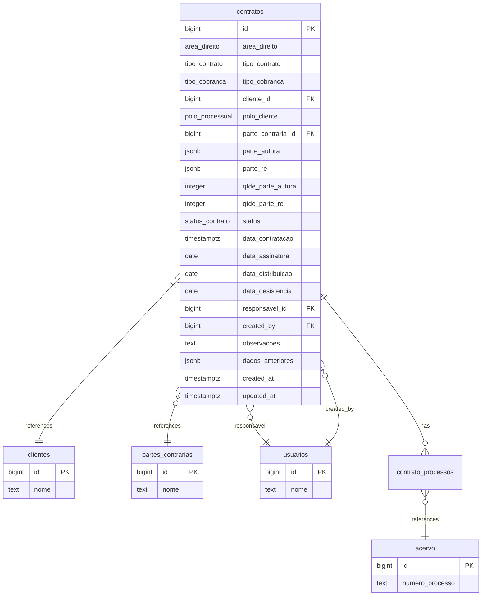
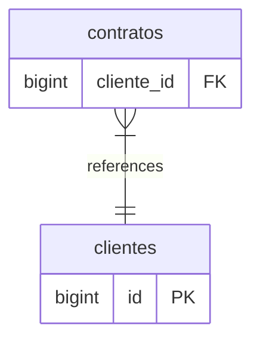
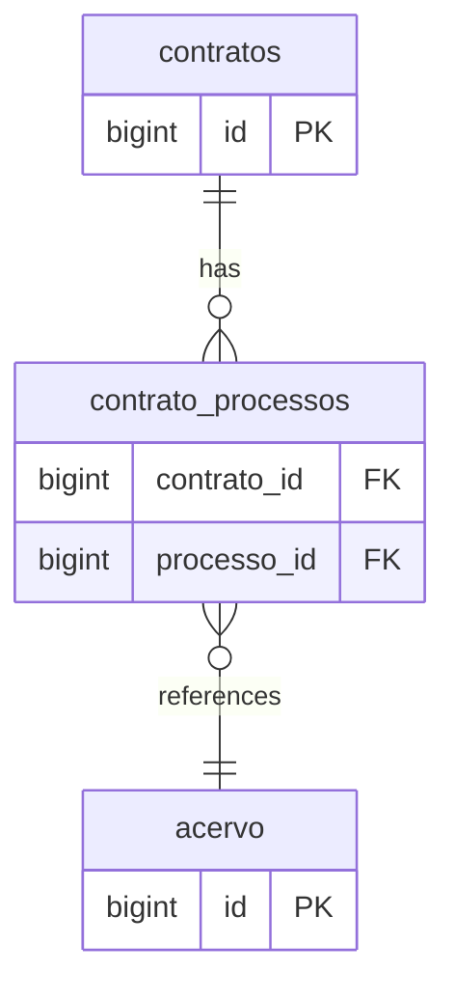
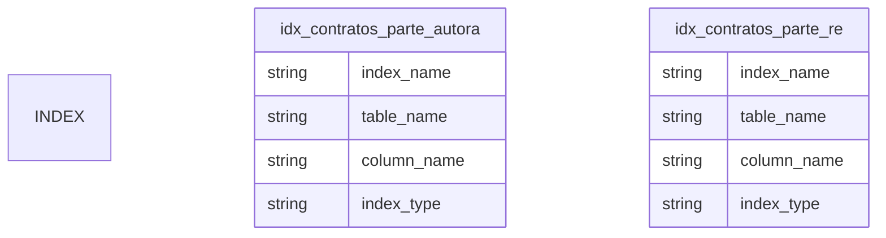
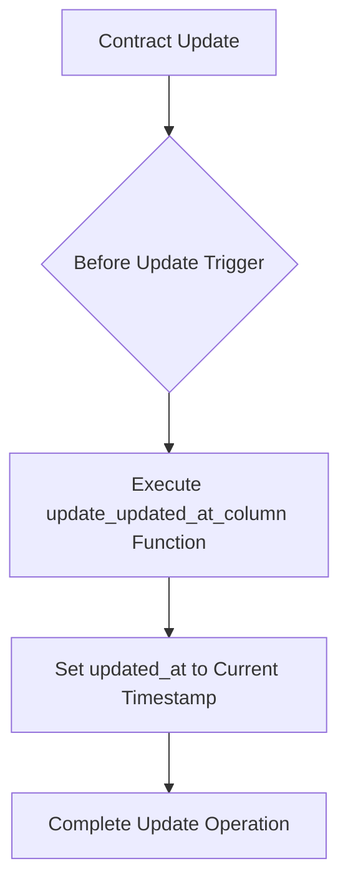
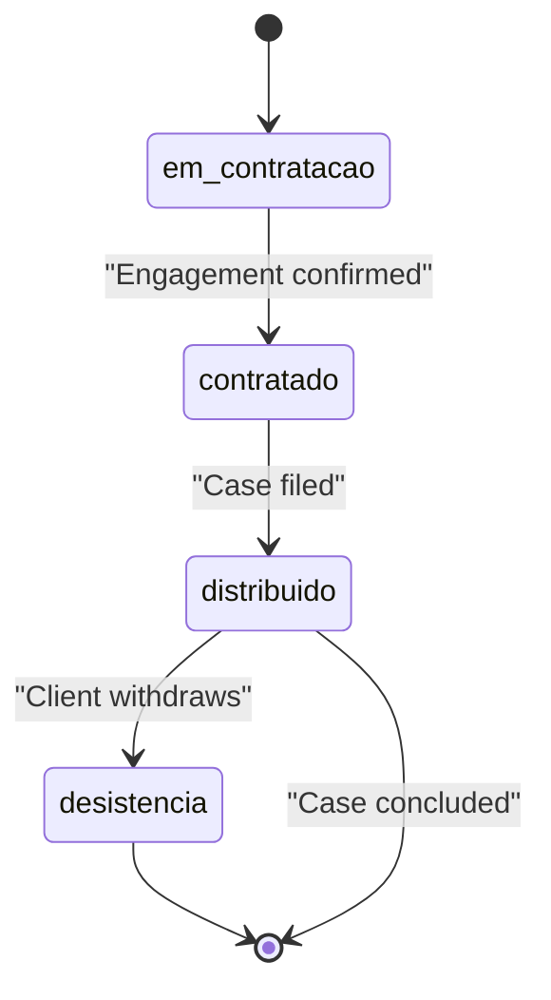

# Contratos Table

<cite>
**Referenced Files in This Document**   
- [11_contratos.sql](file://supabase/schemas/11_contratos.sql)
- [12_contrato_processos.sql](file://supabase/schemas/12_contrato_processos.sql)
- [01_enums.sql](file://supabase/schemas/01_enums.sql)
- [contrato-persistence.service.ts](file://backend/contratos/services/persistence/contrato-persistence.service.ts)
- [contrato-processo-persistence.service.ts](file://backend/contratos/services/persistence/contrato-processo-persistence.service.ts)
- [page.tsx](file://app/(dashboard)/contratos/page.tsx)
- [spec.md](file://openspec/specs/contratos/spec.md)
</cite>

## Table of Contents
1. [Introduction](#introduction)
2. [Table Structure](#table-structure)
3. [Field Definitions](#field-definitions)
4. [Relationships](#relationships)
5. [Business Rules and Validation](#business-rules-and-validation)
6. [Indexes and Performance](#indexes-and-performance)
7. [Triggers and Data Consistency](#triggers-and-data-consistency)
8. [Row Level Security (RLS)](#row-level-security-rls)
9. [Sample Records](#sample-records)
10. [Contract Lifecycle Management](#contract-lifecycle-management)
11. [Billing Automation](#billing-automation)

## Introduction

The `contratos` table is a core component of the Sinesys legal management system, serving as the central repository for all legal contracts managed by the law firm. This table stores comprehensive information about each contract, including its legal area, type, parties involved, status, and associated dates. The table is designed to support the full contract lifecycle from initial engagement through to completion or termination, while also enabling billing automation based on contract terms.

The data model is optimized for both operational efficiency and analytical queries, with appropriate indexing strategies and relationship management. The table is part of a larger ecosystem that includes clients, processes, and financial management components, enabling seamless integration across different aspects of legal practice management.

**Section sources**
- [11_contratos.sql](file://supabase/schemas/11_contratos.sql#L1-L86)
- [spec.md](file://openspec/specs/contratos/spec.md#L1-L231)

## Table Structure

The `contratos` table is structured to capture all essential aspects of a legal contract while maintaining data integrity through appropriate constraints and relationships. The table uses a combination of native PostgreSQL data types and custom ENUM types to ensure data consistency and enforce business rules at the database level.



**Diagram sources**
- [11_contratos.sql](file://supabase/schemas/11_contratos.sql#L4-L37)
- [12_contrato_processos.sql](file://supabase/schemas/12_contrato_processos.sql#L4-L12)

## Field Definitions

The `contratos` table contains a comprehensive set of fields that capture all relevant information about a legal contract. Each field is designed to support specific business requirements and operational workflows within the legal management system.

### Core Contract Information

The core fields define the fundamental characteristics of the contract, including its legal domain, type, and billing model.

| Field | Type | Nullable | Default | Description |
|-------|------|----------|---------|-------------|
| area_direito | area_direito (ENUM) | NOT NULL | - | Legal area of the contract: trabalhista (Labor), civil (Civil), previdenciario (Social Security), criminal (Criminal), empresarial (Corporate), administrativo (Administrative) |
| tipo_contrato | tipo_contrato (ENUM) | NOT NULL | - | Type of legal contract: ajuizamento (Filing), defesa (Defense), ato_processual (Legal Action), assessoria (Advisory), consultoria (Consulting), extrajudicial (Extrajudicial), parecer (Opinion) |
| tipo_cobranca | tipo_cobranca (ENUM) | NOT NULL | - | Billing type: pro_exito (Success Fee), pro_labore (Fixed Fee) |

### Parties and Representation

These fields capture information about the parties involved in the contract and their representation in legal proceedings.

| Field | Type | Nullable | Default | Description |
|-------|------|----------|---------|-------------|
| cliente_id | bigint | NOT NULL | - | Foreign key to the clientes table, representing the primary client of the contract. Uses ON DELETE RESTRICT to prevent deletion of clients with active contracts. |
| polo_cliente | polo_processual (ENUM) | NOT NULL | - | The client's position in the legal proceeding: autor (Plaintiff) or re (Defendant) |
| parte_contraria_id | bigint | NULL | - | Foreign key to the partes_contrarias table, representing the opposing party in the contract. Uses ON DELETE SET NULL to maintain contract history even if the opposing party is deleted. |
| parte_autora | jsonb | NULL | - | Array of plaintiff parties in JSONB format: [{ tipo: "cliente" \| "parte_contraria", id: number, nome: string }]. Allows for multiple plaintiffs in a single contract. |
| parte_re | jsonb | NULL | - | Array of defendant parties in JSONB format: [{ tipo: "cliente" \| "parte_contraria", id: number, nome: string }]. Allows for multiple defendants in a single contract. |
| qtde_parte_autora | integer | NOT NULL | 1 | Quantity of plaintiff parties. Maintained automatically based on parte_autora array length. |
| qtde_parte_re | integer | NOT NULL | 1 | Quantity of defendant parties. Maintained automatically based on parte_re array length. |

### Status and Dates

These fields track the contract's lifecycle status and important dates associated with its execution.

| Field | Type | Nullable | Default | Description |
|-------|------|----------|---------|-------------|
| status | status_contrato (ENUM) | NOT NULL | em_contratacao | Current status of the contract: em_contratacao (In Engagement), contratado (Engaged), distribuido (Filed), desistencia (Withdrawn) |
| data_contratacao | timestamptz | NOT NULL | now() | Date of contract engagement (start of the engagement process) |
| data_assinatura | date | NULL | - | Date when the contract was signed |
| data_distribuicao | date | NULL | - | Date when the legal case was filed with the court |
| data_desistencia | date | NULL | - | Date when the contract was withdrawn or terminated |

### Control and Audit Information

These fields provide administrative control and audit trail capabilities for the contract record.

| Field | Type | Nullable | Default | Description |
|-------|------|----------|---------|-------------|
| responsavel_id | bigint | NULL | - | Foreign key to the usuarios table, representing the user responsible for managing the contract. Uses ON DELETE SET NULL to maintain contract history even if the responsible user is deleted. |
| created_by | bigint | NULL | - | Foreign key to the usuarios table, representing the user who created the contract record. Uses ON DELETE SET NULL to maintain audit trail even if the creating user is deleted. |
| observacoes | text | NULL | - | General observations or notes about the contract |
| dados_anteriores | jsonb | NULL | - | Stores the previous state of the record before the last update. Used for audit purposes and change tracking. Null when the record was inserted or when no changes occurred. |
| created_at | timestamptz | NOT NULL | now() | Timestamp when the record was created |
| updated_at | timestamptz | NOT NULL | now() | Timestamp when the record was last updated |

**Section sources**
- [11_contratos.sql](file://supabase/schemas/11_contratos.sql#L8-L36)
- [01_enums.sql](file://supabase/schemas/01_enums.sql#L82-L123)
- [contrato-persistence.service.ts](file://backend/contratos/services/persistence/contrato-persistence.service.ts#L10-L30)

## Relationships

The `contratos` table is designed with a rich set of relationships that connect it to other core entities in the legal management system. These relationships enable comprehensive contract management by linking contracts to clients, processes, and users.

### Client Relationship

The `contratos` table has a mandatory relationship with the `clientes` table through the `cliente_id` foreign key. This relationship ensures that every contract is associated with a valid client in the system. The relationship uses `ON DELETE RESTRICT` to prevent the deletion of clients who have active contracts, maintaining data integrity and preventing orphaned contract records.



**Diagram sources**
- [11_contratos.sql](file://supabase/schemas/11_contratos.sql#L13)
- [contrato-persistence.service.ts](file://backend/contratos/services/persistence/contrato-persistence.service.ts#L48)

### Process Relationship

The relationship between contracts and legal processes is managed through a junction table called `contrato_processos`. This many-to-many relationship allows a single contract to be associated with multiple legal processes, which is common in complex legal cases. The junction table ensures data integrity through foreign key constraints and prevents duplicate associations.



**Diagram sources**
- [12_contrato_processos.sql](file://supabase/schemas/12_contrato_processos.sql#L4-L12)
- [contrato-processo-persistence.service.ts](file://backend/contratos/services/persistence/contrato-processo-persistence.service.ts#L60-L155)

### Opposing Party Relationship

The `contratos` table has an optional relationship with the `partes_contrarias` table through the `parte_contraria_id` foreign key. This relationship allows the system to track the primary opposing party in a legal contract. The relationship uses `ON DELETE SET NULL` to maintain contract history even if the opposing party record is later deleted from the system.

### User Relationships

The table maintains two relationships with the `usuarios` table:
- `responsavel_id`: References the user responsible for managing the contract
- `created_by`: References the user who created the contract record

Both relationships use `ON DELETE SET NULL` to preserve contract records and their audit trails even when users leave the organization or are removed from the system.

**Section sources**
- [11_contratos.sql](file://supabase/schemas/11_contratos.sql#L13-L15)
- [12_contrato_processos.sql](file://supabase/schemas/12_contrato_processos.sql#L4-L12)
- [contrato-processo-persistence.service.ts](file://backend/contratos/services/persistence/contrato-processo-persistence.service.ts#L60-L155)

## Business Rules and Validation

The `contratos` table enforces several business rules and validation constraints to ensure data quality and consistency throughout the contract lifecycle.

### Mandatory Fields

The following fields are required when creating a new contract:
- `area_direito`: The legal area must be specified
- `tipo_contrato`: The contract type must be specified
- `tipo_cobranca`: The billing type must be specified
- `cliente_id`: The primary client must be specified
- `polo_cliente`: The client's position in the legal proceeding must be specified

These requirements ensure that every contract has the essential information needed for proper management and billing.

### Data Validation

The system performs validation on several fields to ensure data quality:
- Client and opposing party IDs are validated against their respective tables to ensure they reference existing records
- Date fields are parsed and validated to ensure they contain valid date values
- JSONB arrays for parties are validated to ensure they contain properly formatted objects with required fields (tipo, id, nome)
- The `qtde_parte_autora` and `qtde_parte_re` fields are automatically updated based on the length of their corresponding JSONB arrays

### Status Transitions

The contract status follows a specific lifecycle with defined transitions:
- New contracts start with status `em_contratacao` (In Engagement)
- Contracts can progress to `contratado` (Engaged) when the engagement is confirmed
- Contracts can move to `distribuido` (Filed) when the legal case is filed with the court
- Contracts can be marked as `desistencia` (Withdrawn) if the client decides to withdraw from the case

These status transitions help track the progress of legal matters and trigger appropriate workflows in the system.

### Partes JSONB Structure

The `parte_autora` and `parte_re` fields use JSONB to store arrays of parties, with each party represented as an object containing:
- `tipo`: Either "cliente" (client) or "parte_contraria" (opposing party)
- `id`: The ID of the party in the corresponding table
- `nome`: The name of the party

This flexible structure allows for multiple parties on both sides of a legal matter while maintaining referential integrity through the `tipo` and `id` fields.

**Section sources**
- [contrato-persistence.service.ts](file://backend/contratos/services/persistence/contrato-persistence.service.ts#L206-L257)
- [contrato-persistence.service.ts](file://backend/contratos/services/persistence/contrato-persistence.service.ts#L148-L164)

## Indexes and Performance

The `contratos` table is optimized for query performance with a comprehensive set of indexes that support common access patterns and filtering criteria.

### B-Tree Indexes

B-tree indexes are used for fields that are frequently used in equality and range queries:

```mermaid
erDiagram
INDEX "idx_contratos_area_direito" {
string index_name
string table_name
string column_name
string index_type
}
INDEX "idx_contratos_tipo_contrato" {
string index_name
string table_name
string column_name
string index_type
}
INDEX "idx_contratos_status" {
string index_name
string table_name
string column_name
string index_type
}
INDEX "idx_contratos_cliente_id" {
string index_name
string table_name
string column_name
string index_type
}
INDEX "idx_contratos_parte_contraria_id" {
string index_name
string table_name
string column_name
string index_type
}
INDEX "idx_contratos_responsavel_id" {
string index_name
string table_name
string column_name
string index_type
}
INDEX "idx_contratos_created_by" {
string index_name
string table_name
string column_name
string index_type
}
INDEX "idx_contratos_data_assinatura" {
string index_name
string table_name
string column_name
string index_type
}
INDEX "idx_contratos_data_distribuicao" {
string index_name
string table_name
string column_name
string index_type
}
```



**Diagram sources**
- [11_contratos.sql](file://supabase/schemas/11_contratos.sql#L63-L71)

### GIN Indexes

GIN (Generalized Inverted Index) indexes are used for the JSONB fields to enable efficient querying of the nested party data:



**Diagram sources**
- [11_contratos.sql](file://supabase/schemas/11_contratos.sql#L74-L75)

### Index Usage

The indexes support the following common query patterns:
- Filtering contracts by legal area, contract type, or status
- Finding all contracts for a specific client
- Locating contracts by responsible user or creator
- Searching for contracts signed or filed within specific date ranges
- Querying contracts based on parties involved using JSONB operators

The conditional indexes on `data_assinatura` and `data_distribuicao` improve performance by only indexing non-null values, reducing index size and maintenance overhead.

**Section sources**
- [11_contratos.sql](file://supabase/schemas/11_contratos.sql#L62-L75)

## Triggers and Data Consistency

The `contratos` table employs database triggers to maintain data consistency and automate certain aspects of contract management.

### Updated Timestamp Trigger

A trigger is implemented to automatically update the `updated_at` field whenever a contract record is modified:



**Diagram sources**
- [11_contratos.sql](file://supabase/schemas/11_contratos.sql#L77-L81)

This trigger ensures that the `updated_at` field always reflects the most recent modification time of the record, providing an accurate audit trail without requiring application-level code to manage this timestamp.

### Data Integrity Enforcement

The trigger mechanism works in conjunction with other database constraints to enforce data integrity:
- Foreign key constraints ensure referential integrity with related tables
- NOT NULL constraints prevent missing essential information
- ENUM types restrict field values to predefined options
- Unique constraints prevent duplicate process associations in the junction table

These mechanisms work together to maintain data quality and prevent inconsistent states in the contract management system.

**Section sources**
- [11_contratos.sql](file://supabase/schemas/11_contratos.sql#L77-L81)
- [contrato-persistence.service.ts](file://backend/contratos/services/persistence/contrato-persistence.service.ts#L206-L257)

## Row Level Security (RLS)

Row Level Security (RLS) is enabled on the `contratos` table to enforce data access controls at the database level:

```sql
alter table public.contratos enable row level security;
```

While the specific RLS policies are not included in the provided schema files, the enablement of RLS indicates that access to contract data is controlled based on user roles and permissions. This security measure ensures that users can only access contracts they are authorized to view or modify, protecting sensitive client information and maintaining confidentiality.

The RLS implementation likely works in conjunction with the `responsavel_id` field to determine which users have access to specific contracts, potentially allowing:
- Contract managers to access contracts they are responsible for
- Administrators to access all contracts
- Team members to access contracts within their department or practice area

**Section sources**
- [11_contratos.sql](file://supabase/schemas/11_contratos.sql#L83-L84)

## Sample Records

The following sample records illustrate different contract types and their configurations:

### Labor Law Success Fee Contract

```json
{
  "id": 1001,
  "area_direito": "trabalhista",
  "tipo_contrato": "ajuizamento",
  "tipo_cobranca": "pro_exito",
  "cliente_id": 5001,
  "polo_cliente": "autor",
  "parte_contraria_id": 3001,
  "parte_autora": [
    {
      "tipo": "cliente",
      "id": 5001,
      "nome": "João Silva"
    }
  ],
  "parte_re": [
    {
      "tipo": "parte_contraria",
      "id": 3001,
      "nome": "Empresa ABC Ltda"
    }
  ],
  "qtde_parte_autora": 1,
  "qtde_parte_re": 1,
  "status": "contratado",
  "data_contratacao": "2025-01-15T10:30:00Z",
  "data_assinatura": "2025-01-16",
  "data_distribuicao": "2025-01-20",
  "responsavel_id": 101,
  "created_by": 101,
  "observacoes": "Contrato de ajuizamento trabalhista com cláusula de honorários de sucesso",
  "created_at": "2025-01-15T10:30:00Z",
  "updated_at": "2025-01-16T14:20:00Z"
}
```

### Civil Law Fixed Fee Contract

```json
{
  "id": 1002,
  "area_direito": "civil",
  "tipo_contrato": "assessoria",
  "tipo_cobranca": "pro_labore",
  "cliente_id": 5002,
  "polo_cliente": "re",
  "parte_contraria_id": 3002,
  "parte_autora": [
    {
      "tipo": "parte_contraria",
      "id": 3002,
      "nome": "Maria Oliveira"
    }
  ],
  "parte_re": [
    {
      "tipo": "cliente",
      "id": 5002,
      "nome": "Indústria XYZ S.A."
    }
  ],
  "qtde_parte_autora": 1,
  "qtde_parte_re": 1,
  "status": "em_contratacao",
  "data_contratacao": "2025-02-01T09:15:00Z",
  "responsavel_id": 102,
  "created_by": 102,
  "observacoes": "Contrato de assessoria jurídica empresarial, valor fixo mensal",
  "created_at": "2025-02-01T09:15:00Z",
  "updated_at": "2025-02-01T09:15:00Z"
}
```

### Multi-Party Social Security Contract

```json
{
  "id": 1003,
  "area_direito": "previdenciario",
  "tipo_contrato": "defesa",
  "tipo_cobranca": "pro_exito",
  "cliente_id": 5003,
  "polo_cliente": "autor",
  "parte_autora": [
    {
      "tipo": "cliente",
      "id": 5003,
      "nome": "Ana Souza"
    },
    {
      "tipo": "cliente",
      "id": 5004,
      "nome": "Carlos Souza"
    }
  ],
  "parte_re": [
    {
      "tipo": "parte_contraria",
      "id": 3003,
      "nome": "INSS"
    }
  ],
  "qtde_parte_autora": 2,
  "qtde_parte_re": 1,
  "status": "distribuido",
  "data_contratacao": "2025-01-10T14:45:00Z",
  "data_assinatura": "2025-01-11",
  "data_distribuicao": "2025-01-12",
  "responsavel_id": 103,
  "created_by": 103,
  "observacoes": "Ação coletiva previdenciária com dois autores",
  "created_at": "2025-01-10T14:45:00Z",
  "updated_at": "2025-01-12T16:30:00Z"
}
```

**Section sources**
- [contrato-persistence.service.ts](file://backend/contratos/services/persistence/contrato-persistence.service.ts#L68-L90)
- [page.tsx](file://app/(dashboard)/contratos/page.tsx#L20)

## Contract Lifecycle Management

The `contratos` table is designed to support comprehensive contract lifecycle management, tracking contracts from initial engagement through to completion or termination.

### Lifecycle Stages

The contract lifecycle is managed through the `status` field, which progresses through the following stages:



**Diagram sources**
- [11_contratos.sql](file://supabase/schemas/11_contratos.sql#L24)
- [01_enums.sql](file://supabase/schemas/01_enums.sql#L113-L118)

### Status Transitions

The system supports the following status transitions:
- **In Engagement to Engaged**: When the client confirms the engagement and signs the contract
- **Engaged to Filed**: When the legal case is filed with the court
- **Any status to Withdrawn**: When the client decides to withdraw from the case

These transitions are managed through the application layer, with appropriate validation to ensure that status changes follow the expected business rules.

### Date Tracking

The table tracks key dates throughout the contract lifecycle:
- `data_contratacao`: When the engagement process begins
- `data_assinatura`: When the contract is signed
- `data_distribuicao`: When the case is filed with the court
- `data_desistencia`: When the contract is terminated

These dates enable the system to calculate important metrics such as engagement duration, time to filing, and overall case duration.

**Section sources**
- [11_contratos.sql](file://supabase/schemas/11_contratos.sql#L24-L29)
- [contrato-persistence.service.ts](file://backend/contratos/services/persistence/contrato-persistence.service.ts#L25-L29)

## Billing Automation

The `contratos` table supports billing automation through its structure and integration with the financial management system.

### Billing Type Integration

The `tipo_cobranca` field determines the billing model for the contract:
- **pro_exito (Success Fee)**: Billing is contingent on the outcome of the case
- **pro_labore (Fixed Fee)**: Billing follows a predetermined fee structure

This information is used by the financial system to determine how and when to generate invoices and track revenue.

### Process-Based Billing

The relationship between contracts and processes through the `contrato_processos` junction table enables process-based billing. When a contract is associated with one or more legal processes, the financial system can:
- Generate invoices based on process milestones
- Track time and expenses against specific processes
- Allocate revenue to specific cases

### Financial Integration

The `contratos` table integrates with the financial management system through the `origem_lancamento` ENUM in the financial tables, which includes 'contrato' as a possible value. This allows financial transactions to be traced back to their originating contract, providing complete audit trails and enabling accurate financial reporting.

The system likely includes services that automatically generate financial entries based on contract terms and status changes, such as:
- Creating initial invoices when a contract is signed
- Generating milestone-based payments as the case progresses
- Recording success fees when a favorable outcome is achieved

**Section sources**
- [11_contratos.sql](file://supabase/schemas/11_contratos.sql#L10)
- [01_enums.sql](file://supabase/schemas/01_enums.sql#L106-L109)
- [contrato-persistence.service.ts](file://backend/contratos/services/persistence/contrato-persistence.service.ts#L20-L21)