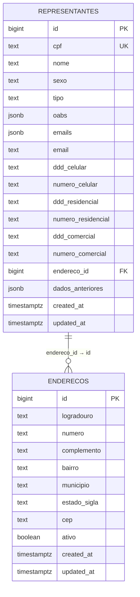
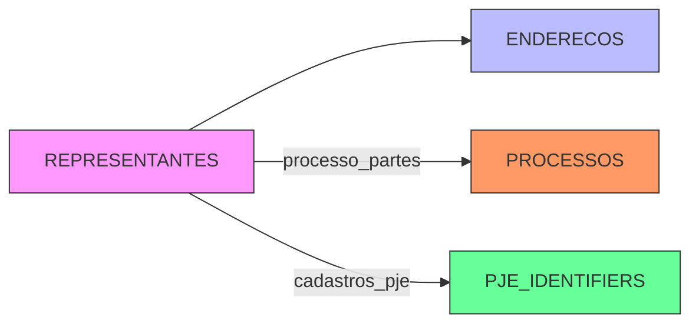
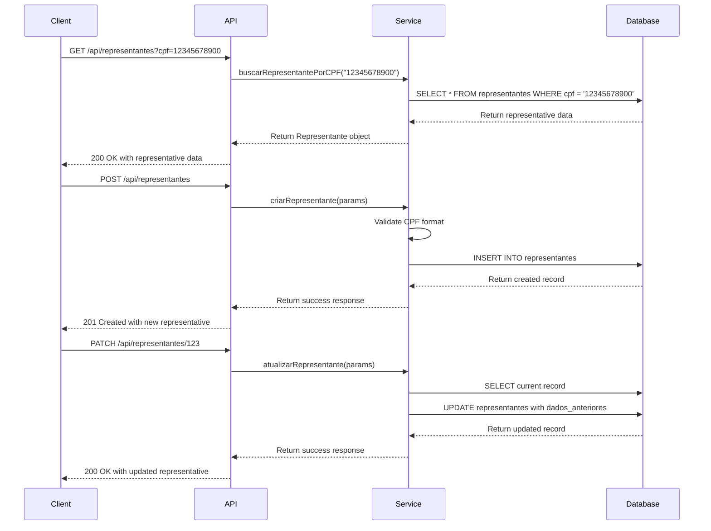

# Representantes Table

<cite>
**Referenced Files in This Document**   
- [18_representantes.sql](file://supabase/schemas/18_representantes.sql)
- [representantes-persistence.service.ts](file://backend/representantes/services/representantes-persistence.service.ts)
- [representantes.ts](file://types/domain/representantes.ts)
- [route.ts](file://app/api/representantes/route.ts)
- [enderecos.ts](file://types/domain/enderecos.ts)
</cite>

## Table of Contents
1. [Introduction](#introduction)
2. [Table Structure](#table-structure)
3. [Field Definitions](#field-definitions)
4. [JSONB Structure Details](#jsonb-structure-details)
5. [Constraints and Indexes](#constraints-and-indexes)
6. [Relationships](#relationships)
7. [API Endpoints](#api-endpoints)
8. [Sample Records](#sample-records)
9. [Usage Scenarios](#usage-scenarios)

## Introduction

The representantes table in the Sinesys system serves as the central repository for managing legal representatives (primarily attorneys) within the legal case management system. This table is designed to store comprehensive information about legal representatives, including their personal details, professional credentials (OAB registration), contact information, and address associations. The table plays a crucial role in the system's ability to track and manage party representation across multiple legal processes.

The design follows a normalized approach where each representative is uniquely identified by their CPF (individual taxpayer registry), ensuring data consistency across the system. The table supports the management of representatives across multiple tribunals through its flexible JSONB structure for OAB information, allowing a single representative to have multiple OAB registrations from different states. This design enables the system to accurately represent the complex reality of legal practice where attorneys may be registered in multiple jurisdictions.

**Section sources**
- [18_representantes.sql](file://supabase/schemas/18_representantes.sql#L1-L63)
- [representantes.ts](file://types/domain/representantes.ts#L1-L66)

## Table Structure

The representantes table is structured with a combination of scalar fields and JSONB fields to balance normalization with flexibility. The table uses a surrogate primary key (id) while maintaining CPF as a unique business key, ensuring both database integrity and business rule enforcement.



**Diagram sources**
- [18_representantes.sql](file://supabase/schemas/18_representantes.sql#L7-L37)
- [enderecos.ts](file://types/domain/enderecos.ts#L30-L63)

**Section sources**
- [18_representantes.sql](file://supabase/schemas/18_representantes.sql#L7-L37)

## Field Definitions

The representantes table contains the following fields that collectively define a legal representative:

| Field | Type | Nullable | Description |
|-------|------|----------|-------------|
| id | bigint | No | Surrogate primary key, auto-generated |
| cpf | text | No | Unique CPF (individual taxpayer registry) of the representative |
| nome | text | No | Full name of the representative |
| sexo | text | Yes | Gender of the representative |
| tipo | text | Yes | Type of representative (e.g., ADVOGADO, PROCURADOR) |
| oabs | jsonb | Yes | Array of OAB registrations with tribunal and registration details |
| emails | jsonb | Yes | Array of email addresses |
| email | text | Yes | Primary email address |
| ddd_celular | text | Yes | Area code for mobile phone |
| numero_celular | text | Yes | Mobile phone number |
| ddd_residencial | text | Yes | Area code for residential phone |
| numero_residencial | text | Yes | Residential phone number |
| ddd_comercial | text | Yes | Area code for commercial phone |
| numero_comercial | text | Yes | Commercial phone number |
| endereco_id | bigint | Yes | Foreign key to enderecos table |
| dados_anteriores | jsonb | Yes | Historical data for audit purposes |
| created_at | timestamptz | No | Timestamp of record creation |
| updated_at | timestamptz | No | Timestamp of last record update |

The table is designed to store only information about individual representatives (pessoas físicas), as legal representation in the Brazilian system is typically performed by individual attorneys rather than corporate entities. The CPF field serves as the unique business identifier, ensuring that each individual is represented only once in the system regardless of the number of cases they participate in.

**Section sources**
- [18_representantes.sql](file://supabase/schemas/18_representantes.sql#L10-L37)
- [representantes.ts](file://types/domain/representantes.ts#L45-L65)

## JSONB Structure Details

The representantes table utilizes JSONB fields to store flexible, semi-structured data for OAB registrations and contact information. The oabs field is particularly important as it stores an array of OAB registration objects, enabling a single representative to have multiple registrations across different state tribunals.

The structure of the oabs JSONB field is defined as an array of objects, where each object represents a single OAB registration:

```json
[
  {
    "numero": "MG128404",
    "uf": "MG",
    "situacao": "REGULAR"
  },
  {
    "numero": "SP234567",
    "uf": "SP",
    "situacao": "REGULAR"
  }
]
```

Each OAB registration object contains three key fields:
- **numero**: The complete OAB number including the state abbreviation (e.g., "MG128404")
- **uf**: The two-letter state code where the OAB is registered
- **situacao**: The current status of the OAB registration (REGULAR, SUSPENSO, CANCELADO, LICENCIADO, FALECIDO)

This JSONB structure provides several advantages:
1. **Flexibility**: New fields can be added to the OAB registration without requiring database schema changes
2. **Efficiency**: Multiple OAB registrations can be stored and retrieved in a single field
3. **Queryability**: PostgreSQL's JSONB operators allow for efficient querying of specific OAB attributes
4. **Normalization**: Avoids the need for a separate normalized table for OAB registrations while still maintaining data integrity

The system provides validation functions to ensure that OAB numbers follow the correct format (two letters followed by 3-6 digits) and that the state code is valid according to the official list of Brazilian states.

**Section sources**
- [representantes.ts](file://types/domain/representantes.ts#L35-L39)
- [representantes-persistence.service.ts](file://backend/representantes/services/representantes-persistence.service.ts#L104-L117)

## Constraints and Indexes

The representantes table implements several constraints and indexes to ensure data integrity and optimize query performance. These database-level features are critical for maintaining the reliability and efficiency of the system.

### Constraints

The table enforces the following constraints:

1. **Primary Key Constraint**: The id field is defined as a generated identity column serving as the primary key
2. **Unique Constraint**: The cpf field has a unique constraint to ensure each individual is represented only once
3. **Foreign Key Constraint**: The endereco_id field references the id field in the enderecos table
4. **Not Null Constraints**: Critical fields like cpf, nome, created_at, and updated_at are defined as NOT NULL

The unique constraint on CPF is particularly important as it prevents duplicate entries for the same individual, which could lead to data inconsistencies when tracking representation across multiple cases.

### Indexes

The table includes the following indexes to optimize query performance:

```sql
create index if not exists idx_representantes_cpf on public.representantes(cpf);
create index if not exists idx_representantes_oabs on public.representantes using gin (oabs);
create index if not exists idx_representantes_endereco on public.representantes(endereco_id);
```

These indexes serve specific purposes:
- **idx_representantes_cpf**: Optimizes queries that search by CPF, which is a common operation when creating or updating representative records
- **idx_representantes_oabs**: A GIN (Generalized Inverted Index) index on the oabs JSONB field, enabling efficient querying of OAB registration data (e.g., finding all representatives with a specific OAB number or from a specific state)
- **idx_representantes_endereco**: Speeds up queries that join the representantes table with the enderecos table, which is common when displaying representative information with their address details

The GIN index on the oabs field is particularly valuable as it allows for efficient containment queries, such as finding all representatives who have an OAB registration in a specific state, without requiring a full table scan.

**Section sources**
- [18_representantes.sql](file://supabase/schemas/18_representantes.sql#L45-L48)
- [representantes-persistence.service.ts](file://backend/representantes/services/representantes-persistence.service.ts#L233-L237)

## Relationships

The representantes table maintains a critical relationship with the enderecos table through the endereco_id foreign key. This relationship enables the system to associate each representative with their primary address, facilitating complete party representation management.



**Diagram sources**
- [18_representantes.sql](file://supabase/schemas/18_representantes.sql#L31)
- [representantes-persistence.service.ts](file://backend/representantes/services/representantes-persistence.service.ts#L739-L842)

The relationship with the enderecos table is implemented as a one-to-many relationship from enderecos to representantes (via the entidade_tipo and entidade_id fields in the enderecos table), but a one-to-zero/one relationship from representantes to enderecos (via the endereco_id field). This design allows a representative to have a primary address reference while still permitting multiple address records for historical or alternative addresses.

The table also has indirect relationships with other entities:
- **Processos**: Through the processo_partes table, which links representatives to specific legal processes
- **PJE Identifiers**: Through the cadastros_pje table, which stores the PJE (Processo Judicial Eletrônico) identifiers for representatives, allowing the system to track multiple PJE IDs for the same individual

These relationships enable the system to provide a comprehensive view of a representative's involvement in legal processes, including their contact information, professional credentials, and case history.

**Section sources**
- [18_representantes.sql](file://supabase/schemas/18_representantes.sql#L31)
- [representantes-persistence.service.ts](file://backend/representantes/services/representantes-persistence.service.ts#L624-L654)

## API Endpoints

The representantes table is accessed through a set of RESTful API endpoints that provide CRUD (Create, Read, Update, Delete) operations for managing representative data. These endpoints are implemented in the Next.js API routes and serve as the interface between the frontend application and the database.

### GET /api/representantes

This endpoint retrieves a list of representatives with optional filtering, pagination, and sorting parameters. It supports various query parameters including:
- pagina: Page number for pagination
- limite: Number of items per page
- nome: Filter by representative name (partial match)
- cpf: Filter by CPF (exact match)
- oab: Filter by OAB number
- busca: General search across multiple fields
- incluir_endereco: Flag to include address information in the response
- incluir_processos: Flag to include associated processes in the response

The endpoint can return different response structures based on the incluir_endereco and incluir_processos parameters, allowing clients to request only the data they need.

### POST /api/representantes

This endpoint creates a new representative record. It validates the required fields (CPF and nome) and ensures data integrity by checking CPF format. The request body includes all representative details, and the response returns the created record with its assigned ID.

### GET /api/representantes/[id]

This endpoint retrieves a specific representative by ID. It supports retrieving the representative with or without associated address information based on query parameters.

### PATCH /api/representantes/[id]

This endpoint updates an existing representative record. It implements a data auditing feature by storing the previous state of the record in the dados_anteriores field, allowing for historical tracking of changes.

### DELETE /api/representantes/[id]

This endpoint removes a representative record from the system. It includes proper error handling for cases where the representative is not found or cannot be deleted due to referential integrity constraints.



**Diagram sources**
- [route.ts](file://app/api/representantes/route.ts#L122-L294)
- [representantes-persistence.service.ts](file://backend/representantes/services/representantes-persistence.service.ts#L209-L615)

**Section sources**
- [route.ts](file://app/api/representantes/route.ts#L1-L294)
- [representantes-persistence.service.ts](file://backend/representantes/services/representantes-persistence.service.ts#L209-L615)

## Sample Records

The following sample records illustrate different types of representatives and their OAB configurations:

**Individual Attorney with Single OAB Registration:**
```json
{
  "id": 1,
  "cpf": "123.456.789-00",
  "nome": "João Silva Oliveira",
  "sexo": "MASCULINO",
  "tipo": "ADVOGADO",
  "oabs": [
    {
      "numero": "SP123456",
      "uf": "SP",
      "situacao": "REGULAR"
    }
  ],
  "email": "joao.silva@adv.oab.sp.gov.br",
  "ddd_celular": "11",
  "numero_celular": "98765-4321",
  "endereco_id": 101,
  "created_at": "2025-01-15T10:30:00Z",
  "updated_at": "2025-01-15T10:30:00Z"
}
```

**Attorney with Multiple OAB Registrations:**
```json
{
  "id": 2,
  "cpf": "987.654.321-00",
  "nome": "Maria Santos Pereira",
  "sexo": "FEMININO",
  "tipo": "ADVOGADO",
  "oabs": [
    {
      "numero": "RJ789012",
      "uf": "RJ",
      "situacao": "REGULAR"
    },
    {
      "numero": "ES345678",
      "uf": "ES",
      "situacao": "REGULAR"
    }
  ],
  "email": "maria.santos@adv.oab.rj.gov.br",
  "ddd_celular": "21",
  "numero_celular": "91234-5678",
  "emails": [
    "maria.santos@adv.oab.rj.gov.br",
    "msantos@outlook.com"
  ],
  "endereco_id": 102,
  "created_at": "2025-01-16T14:20:00Z",
  "updated_at": "2025-01-16T14:20:00Z"
}
```

**Procurator with Suspended OAB:**
```json
{
  "id": 3,
  "cpf": "456.789.123-00",
  "nome": "Carlos Mendes Almeida",
  "sexo": "MASCULINO",
  "tipo": "PROCURADOR",
  "oabs": [
    {
      "numero": "MG998877",
      "uf": "MG",
      "situacao": "SUSPENSO"
    }
  ],
  "email": "carlos.mendes@procurador.mg.gov.br",
  "ddd_celular": "31",
  "numero_celular": "98877-6655",
  "endereco_id": 103,
  "created_at": "2025-01-17T09:15:00Z",
  "updated_at": "2025-01-17T09:15:00Z"
}
```

These sample records demonstrate the flexibility of the representantes table in handling different types of legal representatives and their varying OAB registration statuses. The first example shows a typical attorney with a single OAB registration in good standing. The second example illustrates an attorney who is registered in multiple states, which is common for legal professionals who practice in different jurisdictions. The third example shows a procurator (legal representative) with a suspended OAB registration, demonstrating how the system can track the status of professional credentials.

**Section sources**
- [representantes-persistence.service.ts](file://backend/representantes/services/representantes-persistence.service.ts#L213-L219)
- [representantes.ts](file://types/domain/representantes.ts#L45-L65)

## Usage Scenarios

The representantes table supports several key usage scenarios in the Sinesys system, enabling comprehensive management of legal representatives across multiple tribunals and their association with legal processes.

### Representative Management Workflow

The primary workflow involves creating, updating, and retrieving representative information. When a new representative is added to the system, their CPF is validated to ensure it follows the correct format, and a check is performed to prevent duplicate entries. The system allows for the creation of representatives with multiple OAB registrations, reflecting the reality that attorneys may be registered in more than one state.

When updating a representative's information, the system implements an auditing mechanism by storing the previous state of the record in the dados_anteriores field. This feature is crucial for maintaining a historical record of changes, which may be required for compliance or dispute resolution purposes.

### Cross-Tribunal Representation

One of the key capabilities enabled by the representantes table is the management of representatives across multiple tribunals. The JSONB structure of the oabs field allows a single representative to have registrations in different states, which is essential for attorneys who practice in multiple jurisdictions. This design eliminates the need to create separate representative records for the same individual in different states, maintaining data consistency across the system.

The system provides search functionality that can query the oabs field to find representatives based on their OAB number or state of registration. This is particularly useful when assigning representatives to cases in specific jurisdictions or when verifying the credentials of a representative.

### Integration with Legal Processes

The representantes table is integrated with the legal process management system through the processo_partes table, which links representatives to specific legal processes. This relationship allows the system to track which representatives are involved in which cases, their role (active or passive party), and their relationship to the main parties in the case.

When a new legal process is created, the system can search for existing representatives by CPF or OAB number, preventing the creation of duplicate records. This integration ensures that all information about a representative is centralized and consistent across all cases they participate in.

### Data Synchronization with PJE

The representantes table is designed to synchronize with external systems like PJE (Processo Judicial Eletrônico). The system can import representative data from PJE, matching records by CPF to ensure that existing representatives are updated rather than duplicated. The cadastros_pje table stores the PJE identifiers for each representative, allowing the system to track multiple PJE IDs for the same individual, which may occur due to system migrations or data entry variations.

This synchronization capability ensures that the Sinesys system maintains accurate and up-to-date information about legal representatives, reducing manual data entry and minimizing errors.

**Section sources**
- [representantes-persistence.service.ts](file://backend/representantes/services/representantes-persistence.service.ts#L332-L452)
- [route.ts](file://app/api/representantes/route.ts#L122-L294)