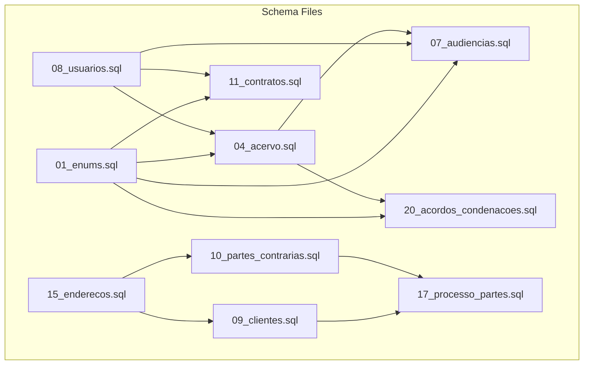
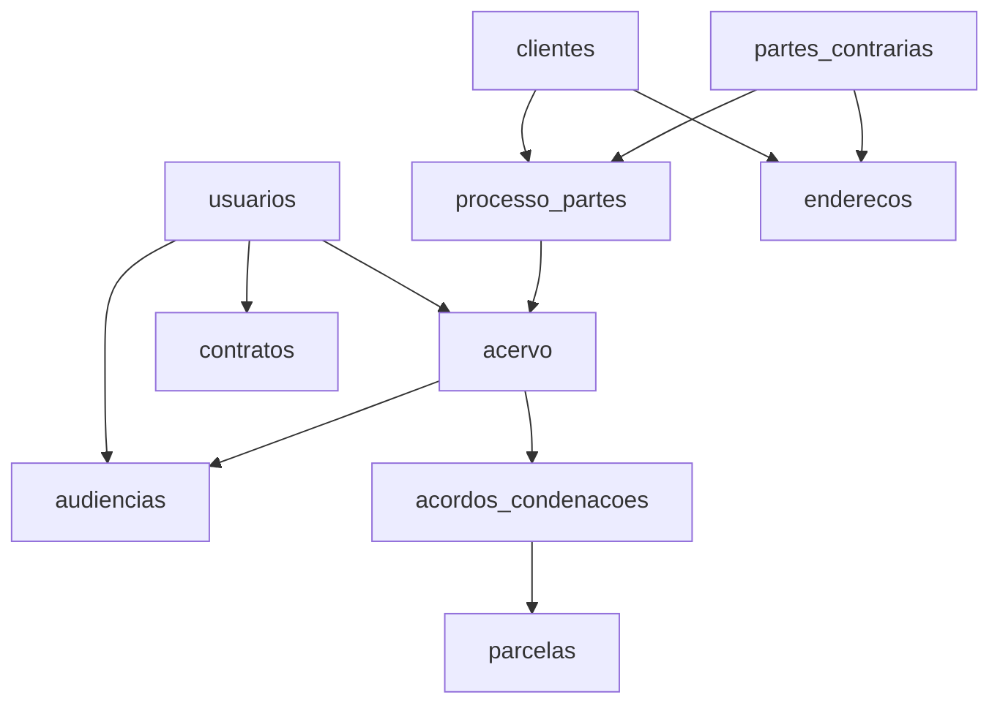
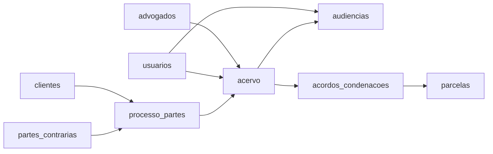

# Table Descriptions

<cite>
**Referenced Files in This Document**
- [04_acervo.sql](file://supabase/schemas/04_acervo.sql)
- [07_audiencias.sql](file://supabase/schemas/07_audiencias.sql)
- [11_contratos.sql](file://supabase/schemas/11_contratos.sql)
- [20_acordos_condenacoes.sql](file://supabase/schemas/20_acordos_condenacoes.sql)
- [01_enums.sql](file://supabase/schemas/01_enums.sql)
- [15_enderecos.sql](file://supabase/schemas/15_enderecos.sql)
- [09_clientes.sql](file://supabase/schemas/09_clientes.sql)
- [10_partes_contrarias.sql](file://supabase/schemas/10_partes_contrarias.sql)
- [17_processo_partes.sql](file://supabase/schemas/17_processo_partes.sql)
- [08_usuarios.sql](file://supabase/schemas/08_usuarios.sql)
- [distribuicao-inicial-processos.sql](file://scripts/api-acervo-geral/distribuicao-inicial-processos.sql)
- [distribuicao-inicial-audiencias.sql](file://scripts/api-audiencias/distribuicao-inicial-audiencias.sql)
- [populate-modalidade-trigger.sql](file://scripts/api-audiencias/populate-tabelas-auxiliares-audiencias.ts)
</cite>

## Table of Contents
1. [Introduction](#introduction)
2. [Project Structure](#project-structure)
3. [Core Components](#core-components)
4. [Architecture Overview](#architecture-overview)
5. [Detailed Component Analysis](#detailed-component-analysis)
6. [Dependency Analysis](#dependency-analysis)
7. [Performance Considerations](#performance-considerations)
8. [Troubleshooting Guide](#troubleshooting-guide)
9. [Conclusion](#conclusion)
10. [Appendices](#appendices)

## Introduction
This document provides comprehensive table descriptions for the Sinesys database, focusing on four major tables: acervo, audiencias, contratos, and acordos_condenacoes. It details field names, data types, constraints, defaults, purposes, and business significance. It also documents computed columns, triggers, and stored procedures, along with data validation rules enforced at the database level and embedded business logic.

## Project Structure
The database schema is organized under supabase/schemas with separate files for each table and shared enums/types. Additional scripts demonstrate initial distributions and auxiliary population logic.

**Diagram sources**
- [01_enums.sql](file://supabase/schemas/01_enums.sql#L1-L400)
- [04_acervo.sql](file://supabase/schemas/04_acervo.sql#L1-L77)
- [07_audiencias.sql](file://supabase/schemas/07_audiencias.sql#L1-L159)
- [11_contratos.sql](file://supabase/schemas/11_contratos.sql#L1-L86)
- [20_acordos_condenacoes.sql](file://supabase/schemas/20_acordos_condenacoes.sql#L1-L128)
- [09_clientes.sql](file://supabase/schemas/09_clientes.sql#L1-L139)
- [10_partes_contrarias.sql](file://supabase/schemas/10_partes_contrarias.sql#L1-L139)
- [17_processo_partes.sql](file://supabase/schemas/17_processo_partes.sql#L1-L144)
- [15_enderecos.sql](file://supabase/schemas/15_enderecos.sql#L1-L94)
- [08_usuarios.sql](file://supabase/schemas/08_usuarios.sql#L1-L94)

**Section sources**
- [04_acervo.sql](file://supabase/schemas/04_acervo.sql#L1-L77)
- [07_audiencias.sql](file://supabase/schemas/07_audiencias.sql#L1-L159)
- [11_contratos.sql](file://supabase/schemas/11_contratos.sql#L1-L86)
- [20_acordos_condenacoes.sql](file://supabase/schemas/20_acordos_condenacoes.sql#L1-L128)
- [01_enums.sql](file://supabase/schemas/01_enums.sql#L1-L400)

## Core Components
This section summarizes the four target tables with their roles and key constraints.

- acervo
  - Purpose: Central repository for captured legal processes (general archive and archived).
  - Key constraints: Unique combination on (id_pje, trt, grau, numero_processo); foreign key to advogados; RLS enabled.
  - Notable fields: numero_processo, tribunal/trt, grau, classe_judicial, data_autuacao, data_proxima_audiencia, prioridade_processual, segredo_justica, juizo_digital, tem_associacao.
  - Business significance: Uniqueness ensures multiple attorneys can view the same process without duplication; responsible for legal process tracking and distribution.

- audiencias
  - Purpose: Scheduled hearings for processes, including virtual, presential, and hybrid modalities.
  - Key constraints: Unique on (id_pje, trt, grau, numero_processo); foreign keys to acervo and advogados; RLS enabled.
  - Notable fields: data_audiencia (start/end), sala_virtual/url_virtual, responsavel_id, presenca_hibrida, status, modalidade.
  - Business significance: Supports hearing management, responsibility assignment, and automated modalities.

- contratos
  - Purpose: Legal contracts of the law firm, linking clients, opposing parties, and process-related parts.
  - Key constraints: Foreign keys to clientes and partes_contrarias; JSONB arrays for multiple parties; RLS enabled.
  - Notable fields: contract_type, valor (not present in schema), periodicidade (not present in schema), cliente_id.
  - Business significance: Contract lifecycle tracking and party composition.

- acordos_condenacoes
  - Purpose: Agreements, condemnations, and procedural costs linked to processes, plus their installments.
  - Key constraints: Foreign key to acervo; computed column percentual_cliente; RLS policies; parcelas table holds installments.
  - Notable fields: valor_total, data_inicio (first installment due), status, numero_parcelas, percentual_escritorio, honorarios_sucumbenciais_total.
  - Business significance: Financial tracking of outcomes and distributions.

**Section sources**
- [04_acervo.sql](file://supabase/schemas/04_acervo.sql#L1-L77)
- [07_audiencias.sql](file://supabase/schemas/07_audiencias.sql#L1-L159)
- [11_contratos.sql](file://supabase/schemas/11_contratos.sql#L1-L86)
- [20_acordos_condenacoes.sql](file://supabase/schemas/20_acordos_condenacoes.sql#L1-L128)

## Architecture Overview
The tables are interconnected through shared enums and foreign keys. Users (usuarios) are linked to acervo and audiencias via responsavel_id. Clients and opposing parties are linked to processes via processo_partes. Enderecos provides address context for clients and opposing parties.

**Diagram sources**
- [08_usuarios.sql](file://supabase/schemas/08_usuarios.sql#L1-L94)
- [04_acervo.sql](file://supabase/schemas/04_acervo.sql#L1-L77)
- [07_audiencias.sql](file://supabase/schemas/07_audiencias.sql#L1-L159)
- [11_contratos.sql](file://supabase/schemas/11_contratos.sql#L1-L86)
- [20_acordos_condenacoes.sql](file://supabase/schemas/20_acordos_condenacoes.sql#L1-L128)
- [17_processo_partes.sql](file://supabase/schemas/17_processo_partes.sql#L1-L144)
- [09_clientes.sql](file://supabase/schemas/09_clientes.sql#L1-L139)
- [10_partes_contrarias.sql](file://supabase/schemas/10_partes_contrarias.sql#L1-L139)
- [15_enderecos.sql](file://supabase/schemas/15_enderecos.sql#L1-L94)

## Detailed Component Analysis

### acervo
- Identity and keys
  - id: auto-incrementing primary key
  - Unique: (id_pje, trt, grau, numero_processo)
  - Foreign key: advogado_id -> advogados(id) with cascade delete
- Fields and constraints
  - id_pje: bigint, not null
  - advogado_id: bigint, not null
  - origem: text, not null, check in ('acervo_geral','arquivado')
  - trt: public.codigo_tribunal, not null
  - grau: public.grau_tribunal, not null
  - numero_processo: text, not null
  - numero: bigint, not null
  - descricao_orgao_julgador: text, not null
  - classe_judicial: text, not null
  - segredo_justica: boolean, not null, default false
  - codigo_status_processo: text, not null
  - prioridade_processual: integer, not null, default 0
  - nome_parte_autora: text, not null
  - qtde_parte_autora: integer, not null, default 1
  - nome_parte_re: text, not null
  - qtde_parte_re: integer, not null, default 1
  - data_autuacao: timestamptz, not null
  - juizo_digital: boolean, not null, default false
  - data_arquivamento: timestamptz
  - data_proxima_audiencia: timestamptz
  - tem_associacao: boolean, not null, default false
  - created_at/updated_at: timestamptz, not null, default now()
- Comments and purposes
  - Uniqueness ensures multiple attorneys can view the same process without duplication.
  - Fields like numero_processo, trt, grau, and data_proxima_audiencia support legal process tracking and scheduling.
- Indices
  - Primary and composite indices on advogado_id, origem, trt, grau, numero_processo, id_pje, data_autuacao, data_arquivamento, and combinations.
- Triggers
  - update_acervo_updated_at: updates updated_at before any update.
- RLS
  - Row Level Security enabled.

Sample record illustration
- Typical record would include a unique combination of id_pje, trt, grau, and numero_processo, with advogado_id pointing to a specific attorney, and timestamps for data_autuacao and data_proxima_audiencia.

Validation rules
- Enum checks via public.codigo_tribunal and public.grau_tribunal.
- origem constrained to specific values.
- Default values for boolean and integer fields ensure consistent baseline states.

Computed columns
- None identified for acervo.

Triggers and stored procedures
- update_acervo_updated_at trigger automatically refreshes updated_at on updates.

**Section sources**
- [04_acervo.sql](file://supabase/schemas/04_acervo.sql#L1-L77)
- [01_enums.sql](file://supabase/schemas/01_enums.sql#L1-L400)
- [distribuicao-inicial-processos.sql](file://scripts/api-acervo-geral/distribuicao-inicial-processos.sql#L1-L162)

### audiencias
- Identity and keys
  - id: auto-incrementing primary key
  - Unique: (id_pje, trt, grau, numero_processo)
  - Foreign keys: advogado_id -> advogados(id) with cascade delete; processo_id -> acervo(id) with cascade delete; orgao_julgador_id -> orgao_julgador(id) with set null; responsavel_id -> usuarios(id) with set null.
- Fields and constraints
  - id_pje: bigint, not null
  - advogado_id: bigint, not null
  - processo_id: bigint, not null
  - orgao_julgador_id: bigint
  - trt: public.codigo_tribunal, not null
  - grau: public.grau_tribunal, not null
  - numero_processo: text, not null
  - data_inicio: timestamptz, not null
  - data_fim: timestamptz, not null
  - hora_inicio/hora_fim: time
  - modalidade: public.modalidade_audiencia
  - sala_audiencia_nome: text
  - sala_audiencia_id: bigint
  - status: text, not null
  - status_descricao: text
  - tipo_audiencia_id: bigint with set null
  - classe_judicial_id: bigint with set null
  - designada/em_andamento/documento_ativo: booleans, default false
  - polo_ativo_nome/polo_passivo_nome: text
  - polo_ativo_representa_varios/polo_passivo_representa_varios: booleans, default false
  - url_audiencia_virtual: text
  - endereco_presencial: jsonb
  - presenca_hibrida: check null or in ('advogado','cliente')
  - ata_audiencia_id: bigint
  - url_ata_audiencia: text
  - segredo_justica/juizo_digital: booleans, default false
  - responsavel_id: bigint with set null
  - observacoes: text
  - dados_anteriores: jsonb
  - created_at/updated_at: timestamptz, not null, default now()
- Comments and purposes
  - Modalidade is populated automatically by a trigger based on url_audiencia_virtual, endereco_presencial, or tipo_audiencia_id.
  - presenca_hibrida defines who attends in hybrid modalities.
  - Responsavel_id tracks the user responsible for the hearing; changes are logged.
- Indices
  - Primary and composite indices on advogado_id, processo_id, orgao_julgador_id, trt, grau, id_pje, numero_processo, status, data_inicio, data_fim, responsavel_id, and combinations.
- Triggers and stored procedures
  - populate_modalidade_audiencia: sets modalidade based on URL, type, or address presence.
  - update_audiencias_updated_at: updates updated_at before any update.
- RLS
  - Row Level Security enabled.

Sample record illustration
- Typical record includes data_inicio/data_fim, modalidade (virtual/presencial/hibrida), url_audiencia_virtual or endereco_presencial, and responsavel_id.

Validation rules
- Enum checks via public.codigo_tribunal, public.grau_tribunal, public.modalidade_audiencia, and status.
- presenca_hibrida constrained to specific values or null.
- Unique constraint prevents duplicate audiências for the same process across degrees.

**Section sources**
- [07_audiencias.sql](file://supabase/schemas/07_audiencias.sql#L1-L159)
- [01_enums.sql](file://supabase/schemas/01_enums.sql#L1-L400)
- [distribuicao-inicial-audiencias.sql](file://scripts/api-audiencias/distribuicao-inicial-audiencias.sql#L1-L114)
- [populate-modalidade-trigger.sql](file://scripts/api-audiencias/populate-tabelas-auxiliares-audiencias.ts#L1-L200)

### contratos
- Identity and keys
  - id: auto-incrementing primary key
  - Foreign keys: cliente_id -> clientes(id) with restrict; parte_contraria_id -> partes_contrarias(id) with set null; responsavel_id/created_by -> usuarios(id) with set null.
- Fields and constraints
  - area_direito: public.area_direito, not null
  - tipo_contrato: public.tipo_contrato, not null
  - tipo_cobranca: public.tipo_cobranca, not null
  - cliente_id: bigint, not null
  - polo_cliente: public.polo_processual, not null
  - parte_contraria_id: bigint
  - parte_autora: jsonb (array of objects with type/id/nome)
  - parte_re: jsonb (array of objects with type/id/nome)
  - qtde_parte_autora/qtde_parte_re: integers, default 1
  - status: public.status_contrato, default 'em_contratacao'
  - data_contratacao: timestamptz, default now()
  - data_assinatura/data_distribuicao/data_desistencia: dates
  - responsavel_id/created_by: bigint with set null
  - observacoes: text
  - dados_anteriores: jsonb
  - created_at/updated_at: timestamptz, not null, default now()
- Comments and purposes
  - JSONB arrays support multiple parties per side.
  - Status and dates track contract lifecycle.
- Indices
  - Primary and composite indices on area_direito, tipo_contrato, status, cliente_id, parte_contraria_id, responsavel_id, created_by, and selective date indices.
- Triggers and stored procedures
  - update_contratos_updated_at: updates updated_at before any update.
- RLS
  - Row Level Security enabled.

Sample record illustration
- Typical record includes cliente_id, polo_cliente, parte_autora/parte_re arrays, status, and dates for data_contratacao, data_assinatura, data_distribuicao.

Validation rules
- Enum checks via area_direito, tipo_contrato, tipo_cobranca, polo_processual, status_contrato.
- JSONB arrays validated by application logic; constraints ensure structure consistency.

Computed columns
- None identified for contratos.

**Section sources**
- [11_contratos.sql](file://supabase/schemas/11_contratos.sql#L1-L86)
- [01_enums.sql](file://supabase/schemas/01_enums.sql#L1-L400)

### acordos_condenacoes
- Identity and keys
  - id: auto-incrementing primary key
  - Foreign key: processo_id -> acervo(id)
- Fields and constraints
  - processo_id: bigint, not null
  - tipo: text, not null, check in ('acordo','condenacao','custas_processuais')
  - direcao: text, not null, check in ('recebimento','pagamento')
  - valor_total: numeric, not null, check > 0
  - data_vencimento_primeira_parcela: date, not null
  - status: text, not null, default 'pendente', check in ('pendente','pago_parcial','pago_total','atrasado')
  - numero_parcelas: integer, not null, check > 0
  - forma_distribuicao: text, check in ('integral','dividido')
  - percentual_escritorio: numeric, default 30.00, check 0..100
  - percentual_cliente: numeric (computed as 100 - percentual_escritorio, stored)
  - honorarios_sucumbenciais_total: numeric, default 0, check >= 0
  - created_by: uuid referencing auth.users(id)
  - created_at/updated_at: timestamps with timezone
- Comments and purposes
  - Computed column percentual_cliente ensures automatic client percentage calculation.
  - Status reflects installment-level aggregation.
- Indices
  - Primary and composite indices on processo_id, tipo, status, direcao.
- RLS
  - Row Level Security enabled with policies for service_role and authenticated users.

Sample record illustration
- Typical record includes valor_total, data_vencimento_primeira_parcela, numero_parcelas, percentual_escritorio, and status.

Validation rules
- Enum checks via tipo, direcao, status, forma_distribuicao.
- Numeric checks enforce positive amounts and bounded percentages.

Computed columns
- percentual_cliente: generated always as 100 - percentual_escritorio, stored.

**Section sources**
- [20_acordos_condenacoes.sql](file://supabase/schemas/20_acordos_condenacoes.sql#L1-L128)
- [01_enums.sql](file://supabase/schemas/01_enums.sql#L1-L400)

## Dependency Analysis
- acervo depends on advogados and usuarios via responsavel_id; supports audiencias and acordos_condenacoes.
- audiencias depends on acervo and usuarios; modalidade populated by trigger.
- contratos depends on clientes and partes_contrarias; links via processo_partes.
- acordos_condenacoes depends on acervo; parcelas depends on acordos_condenacoes.
- usuarios enables responsibility assignment across acervo and audiencias.

**Diagram sources**
- [04_acervo.sql](file://supabase/schemas/04_acervo.sql#L1-L77)
- [07_audiencias.sql](file://supabase/schemas/07_audiencias.sql#L1-L159)
- [20_acordos_condenacoes.sql](file://supabase/schemas/20_acordos_condenacoes.sql#L1-L128)
- [17_processo_partes.sql](file://supabase/schemas/17_processo_partes.sql#L1-L144)
- [09_clientes.sql](file://supabase/schemas/09_clientes.sql#L1-L139)
- [10_partes_contrarias.sql](file://supabase/schemas/10_partes_contrarias.sql#L1-L139)
- [08_usuarios.sql](file://supabase/schemas/08_usuarios.sql#L1-L94)

**Section sources**
- [04_acervo.sql](file://supabase/schemas/04_acervo.sql#L1-L77)
- [07_audiencias.sql](file://supabase/schemas/07_audiencias.sql#L1-L159)
- [11_contratos.sql](file://supabase/schemas/11_contratos.sql#L1-L86)
- [20_acordos_condenacoes.sql](file://supabase/schemas/20_acordos_condenacoes.sql#L1-L128)
- [17_processo_partes.sql](file://supabase/schemas/17_processo_partes.sql#L1-L144)

## Performance Considerations
- Indexes on frequently filtered and joined columns (e.g., trt, grau, numero_processo, advogado_id, status) improve query performance.
- JSONB fields (e.g., parte_autora, parte_re, endereco_presencial, dados_anteriores) benefit from GIN or targeted B-tree indexes where applicable.
- Triggers for updating timestamps reduce application-side overhead.

[No sources needed since this section provides general guidance]

## Troubleshooting Guide
Common issues and remedies:
- Unique violations on (id_pje, trt, grau, numero_processo)
  - Ensure process identifiers are consistent across degrees and jurisdictions.
  - Verify that origem values are correct for acervo entries.
- Modalidade inconsistencies in audiencias
  - Confirm that populate_modalidade_audiencia trigger conditions match actual data (url_audiencia_virtual, endereco_presencial, tipo_audiencia_id).
- Responsibility assignment gaps
  - Use initial distribution scripts to assign responsavel_id to acervo and audiencias consistently.
- RLS access denied
  - Verify authenticated user permissions and policies for each table.

**Section sources**
- [04_acervo.sql](file://supabase/schemas/04_acervo.sql#L1-L77)
- [07_audiencias.sql](file://supabase/schemas/07_audiencias.sql#L1-L159)
- [20_acordos_condenacoes.sql](file://supabase/schemas/20_acordos_condenacoes.sql#L1-L128)
- [distribuicao-inicial-processos.sql](file://scripts/api-acervo-geral/distribuicao-inicial-processos.sql#L1-L162)
- [distribuicao-inicial-audiencias.sql](file://scripts/api-audiencias/distribuicao-inicial-audiencias.sql#L1-L114)

## Conclusion
The Sinesys database organizes legal process data with strong uniqueness guarantees, robust validation via enums and checks, and clear inter-table relationships. Triggers automate timestamp updates and modalities for hearings, while RLS enforces access control. The four target tables—acervo, audiencias, contratos, and acordos_condenacoes—cover core legal operations and financial outcomes, with computed columns and indices supporting efficient querying and reporting.

[No sources needed since this section summarizes without analyzing specific files]

## Appendices

### Field Reference Tables

- acervo
  - numero_processo: text, not null
  - tribunal/trt: public.codigo_tribunal, not null
  - grau: public.grau_tribunal, not null
  - classe_judicial: text, not null
  - data_autuacao: timestamptz, not null
  - data_proxima_audiencia: timestamptz
  - prioridade_processual: integer, not null, default 0
  - segredo_justica: boolean, not null, default false
  - juizo_digital: boolean, not null, default false
  - tem_associacao: boolean, not null, default false

- audiencias
  - data_audiencia: timestamptz (start/end via data_inicio/data_fim)
  - sala_virtual: text
  - url_virtual: text
  - responsavel_id: bigint
  - presenca_hibrida: text check null or in ('advogado','cliente')

- contratos
  - contract_type: public.tipo_contrato, not null
  - valor: not present in schema
  - periodicidade: not present in schema
  - cliente_id: bigint, not null

- acordos_condenacoes
  - valor_total: numeric, not null, check > 0
  - data_inicio: date (first installment due)
  - status: text, not null, default 'pendente', check in ('pendente','pago_parcial','pago_total','atrasado')
  - percentual_escritorio: numeric, default 30.00, check 0..100
  - percentual_cliente: numeric (computed as 100 - percentual_escritorio, stored)

**Section sources**
- [04_acervo.sql](file://supabase/schemas/04_acervo.sql#L1-L77)
- [07_audiencias.sql](file://supabase/schemas/07_audiencias.sql#L1-L159)
- [11_contratos.sql](file://supabase/schemas/11_contratos.sql#L1-L86)
- [20_acordos_condenacoes.sql](file://supabase/schemas/20_acordos_condenacoes.sql#L1-L128)
- [01_enums.sql](file://supabase/schemas/01_enums.sql#L1-L400)

### Sample Records Illustration
- acervo
  - Example: A record with numero_processo matching CNJ format, trt in ('TRT1'..'TRT24','TST'), grau in ('primeiro_grau','segundo_grau','tribunal_superior'), data_autuacao set appropriately, and data_proxima_audiencia indicating upcoming hearing.
- audiencias
  - Example: A record with data_inicio/data_fim spanning the hearing period, modalidade derived from url_audiencia_virtual or endereco_presencial, and responsavel_id assigned.
- contratos
  - Example: A record with cliente_id, polo_cliente, parte_autora/parte_re arrays reflecting multiple parties, and status tracking contract lifecycle.
- acordos_condenacoes
  - Example: A record with valor_total, data_vencimento_primeira_parcela, numero_parcelas, percentual_escritorio, and percentual_cliente computed accordingly.

**Section sources**
- [04_acervo.sql](file://supabase/schemas/04_acervo.sql#L1-L77)
- [07_audiencias.sql](file://supabase/schemas/07_audiencias.sql#L1-L159)
- [11_contratos.sql](file://supabase/schemas/11_contratos.sql#L1-L86)
- [20_acordos_condenacoes.sql](file://supabase/schemas/20_acordos_condenacoes.sql#L1-L128)

### Triggers and Stored Procedures
- acervo
  - update_acervo_updated_at: updates updated_at before any update.
- audiencias
  - populate_modalidade_audiencia: sets modalidade based on URL, type, or address presence.
  - update_audiencias_updated_at: updates updated_at before any update.
- contratos
  - update_contratos_updated_at: updates updated_at before any update.
- acordos_condenacoes
  - No triggers defined in schema; percentual_cliente is computed at row level.

**Section sources**
- [04_acervo.sql](file://supabase/schemas/04_acervo.sql#L1-L77)
- [07_audiencias.sql](file://supabase/schemas/07_audiencias.sql#L1-L159)
- [11_contratos.sql](file://supabase/schemas/11_contratos.sql#L1-L86)
- [20_acordos_condenacoes.sql](file://supabase/schemas/20_acordos_condenacoes.sql#L1-L128)

### Data Validation Rules
- Enums
  - public.codigo_tribunal: TRT1..TRT24, TST
  - public.grau_tribunal: primeiro_grau, segundo_grau, tribunal_superior
  - public.modalidade_audiencia: virtual, presencial, hibrida
  - public.status_audiencia: C, M, F
  - public.area_direito: trabalhista, civil, previdenciario, criminal, empresarial, administrativo
  - public.tipo_contrato: ajuizamento, defesa, ato_processual, assessoria, consultoria, extrajudicial, parecer
  - public.tipo_cobranca: pro_exito, pro_labore
  - public.status_contrato: em_contratacao, contratado, distribuido, desistencia
  - public.polo_processual: autor, re
- Checks
  - acervo.origem: 'acervo_geral' or 'arquivado'
  - audiencias.presenca_hibrida: null or 'advogado' or 'cliente'
  - acordos_condenacoes.valor_total > 0
  - acordos_condenacoes.numero_parcelas > 0
  - acordos_condenacoes.percentual_escritorio between 0 and 100

**Section sources**
- [01_enums.sql](file://supabase/schemas/01_enums.sql#L1-L400)
- [04_acervo.sql](file://supabase/schemas/04_acervo.sql#L1-L77)
- [07_audiencias.sql](file://supabase/schemas/07_audiencias.sql#L1-L159)
- [20_acordos_condenacoes.sql](file://supabase/schemas/20_acordos_condenacoes.sql#L1-L128)