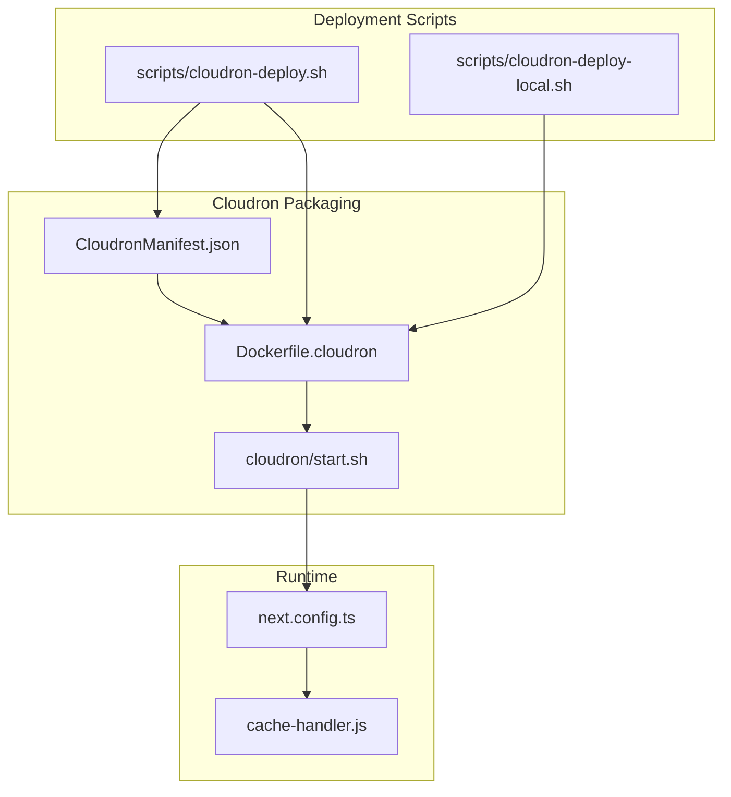
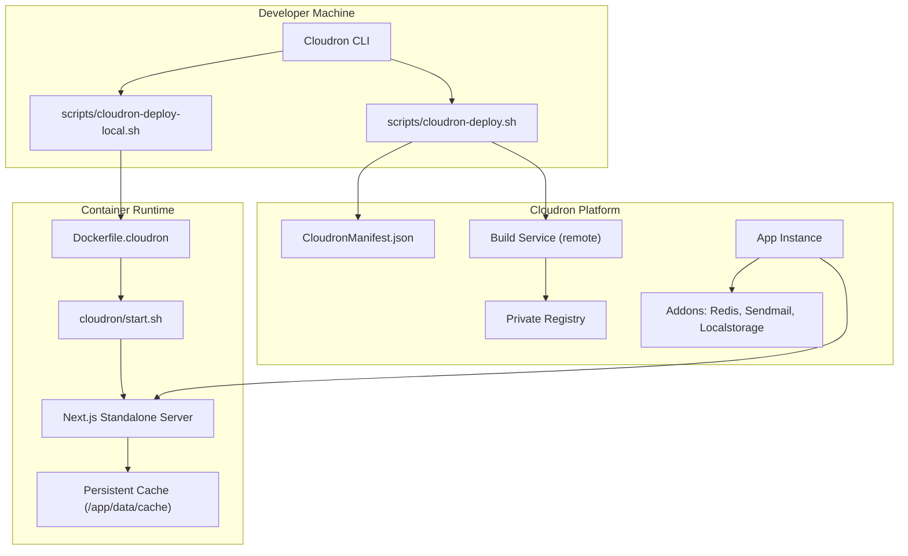
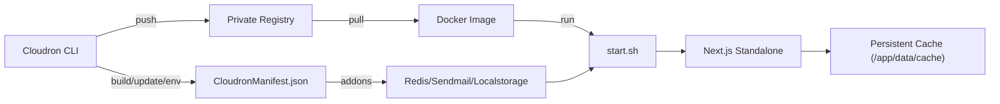

# Cloudron Deployment

<cite>
**Referenced Files in This Document**
- [CloudronManifest.json](file://CloudronManifest.json)
- [Dockerfile.cloudron](file://Dockerfile.cloudron)
- [cloudron/CLI-REFERENCE.md](file://cloudron/CLI-REFERENCE.md)
- [cloudron/start.sh](file://cloudron/start.sh)
- [scripts/cloudron-deploy.sh](file://scripts/cloudron-deploy.sh)
- [scripts/cloudron-deploy-local.sh](file://scripts/cloudron-deploy-local.sh)
- [package.json](file://package.json)
- [next.config.ts](file://next.config.ts)
- [cache-handler.js](file://cache-handler.js)
</cite>

## Table of Contents
1. [Introduction](#introduction)
2. [Project Structure](#project-structure)
3. [Core Components](#core-components)
4. [Architecture Overview](#architecture-overview)
5. [Detailed Component Analysis](#detailed-component-analysis)
6. [Dependency Analysis](#dependency-analysis)
7. [Performance Considerations](#performance-considerations)
8. [Troubleshooting Guide](#troubleshooting-guide)
9. [Conclusion](#conclusion)
10. [Appendices](#appendices)

## Introduction
This document explains how to package and deploy the Zattar OS application on the Cloudron platform. It covers the Cloudron manifest, Docker containerization strategy, environment variable management, registry configuration, and the automated deployment pipeline. It also documents the Cloudron CLI reference, including authentication, build, and update commands, and provides practical examples for CI/CD integration and troubleshooting.

## Project Structure
The Cloudron packaging and deployment rely on a small set of focused files:
- Cloudron manifest defines app metadata, ports, health checks, and addons.
- Dockerfile.cloudron defines a multi-stage build and runtime image tailored for Cloudron’s base image and Node.js upgrade.
- start.sh bridges Cloudron environment variables to the Next.js application and starts the server.
- Two deployment scripts orchestrate remote and local builds, updates, and environment configuration.
- Next.js configuration enables a production-optimized standalone output and a custom cache handler for persistence.
- The CLI reference documents Cloudron CLI usage, authentication, and environment management.

**Diagram sources**
- [CloudronManifest.json:1-31](file://CloudronManifest.json#L1-L31)
- [Dockerfile.cloudron:1-96](file://Dockerfile.cloudron#L1-L96)
- [cloudron/start.sh:1-128](file://cloudron/start.sh#L1-L128)
- [scripts/cloudron-deploy.sh:1-490](file://scripts/cloudron-deploy.sh#L1-L490)
- [scripts/cloudron-deploy-local.sh:1-484](file://scripts/cloudron-deploy-local.sh#L1-L484)
- [next.config.ts:79-95](file://next.config.ts#L79-L95)
- [cache-handler.js:1-140](file://cache-handler.js#L1-L140)

**Section sources**
- [CloudronManifest.json:1-31](file://CloudronManifest.json#L1-L31)
- [Dockerfile.cloudron:1-96](file://Dockerfile.cloudron#L1-L96)
- [cloudron/start.sh:1-128](file://cloudron/start.sh#L1-L128)
- [scripts/cloudron-deploy.sh:1-490](file://scripts/cloudron-deploy.sh#L1-L490)
- [scripts/cloudron-deploy-local.sh:1-484](file://scripts/cloudron-deploy-local.sh#L1-L484)
- [next.config.ts:79-95](file://next.config.ts#L79-L95)
- [cache-handler.js:1-140](file://cache-handler.js#L1-L140)

## Core Components
- CloudronManifest.json: Defines app identity, health check endpoint, HTTP port, optional addons (localstorage, redis, sendmail), memory limit, and metadata.
- Dockerfile.cloudron: Multi-stage build with pinned Node.js version, dependency installation, Next.js build, and a Cloudron base image stage that upgrades Node.js to 22.
- cloudron/start.sh: Runtime entrypoint that maps Cloudron environment variables to Next.js-compatible variables, sets runtime options, and starts the standalone server.
- scripts/cloudron-deploy.sh: Orchestrates remote build via Cloudron Build Service, app update, and environment variable configuration.
- scripts/cloudron-deploy-local.sh: Alternative pipeline using local Docker builds and pushes to the Cloudron registry.
- next.config.ts: Production-optimized output mode and custom cache handler configuration.
- cache-handler.js: Persistent cache handler that stores cache entries on disk for long-term persistence across redeployments.

**Section sources**
- [CloudronManifest.json:1-31](file://CloudronManifest.json#L1-L31)
- [Dockerfile.cloudron:1-96](file://Dockerfile.cloudron#L1-L96)
- [cloudron/start.sh:1-128](file://cloudron/start.sh#L1-L128)
- [scripts/cloudron-deploy.sh:1-490](file://scripts/cloudron-deploy.sh#L1-L490)
- [scripts/cloudron-deploy-local.sh:1-484](file://scripts/cloudron-deploy-local.sh#L1-L484)
- [next.config.ts:79-95](file://next.config.ts#L79-L95)
- [cache-handler.js:1-140](file://cache-handler.js#L1-L140)

## Architecture Overview
The deployment architecture integrates Cloudron’s packaging model with a Next.js standalone server and persistent caches.

**Diagram sources**
- [cloudron/CLI-REFERENCE.md:1-180](file://cloudron/CLI-REFERENCE.md#L1-L180)
- [CloudronManifest.json:1-31](file://CloudronManifest.json#L1-L31)
- [Dockerfile.cloudron:1-96](file://Dockerfile.cloudron#L1-L96)
- [cloudron/start.sh:1-128](file://cloudron/start.sh#L1-L128)
- [scripts/cloudron-deploy.sh:1-490](file://scripts/cloudron-deploy.sh#L1-L490)
- [scripts/cloudron-deploy-local.sh:1-484](file://scripts/cloudron-deploy-local.sh#L1-L484)

## Detailed Component Analysis

### Cloudron Manifest (CloudronManifest.json)
- Identity and metadata: app id, title, author, description, version, icon, tags.
- Runtime: HTTP port, health check path, memory limit.
- Addons: localstorage (persistent data), redis (optional), sendmail (with display name support).
- Optional SSO flag included.

Key implications:
- The health check path is aligned with the container’s exposed port and the start script’s runtime behavior.
- Addon variables are mapped automatically by the start script to environment variables consumed by the application.

**Section sources**
- [CloudronManifest.json:1-31](file://CloudronManifest.json#L1-L31)

### Dockerfile.cloudron
- Stage 1: Alpine-based dependency installation with pinned Node.js version and environment flags to reduce build noise.
- Stage 2: Build stage copying node_modules and application, preparing static assets and standalone server.
- Stage 3: Cloudron base image with Node.js upgrade to 22, symlink cache to persistent directory, and healthcheck.
- Exposes port 3000 and runs the start script as the container entrypoint.

Optimization highlights:
- Uses a standalone Next.js output for faster startup and smaller runtime footprint.
- Persists cache under /app/data for long-term cache continuity across redeployments.

**Section sources**
- [Dockerfile.cloudron:1-96](file://Dockerfile.cloudron#L1-L96)

### Start Script (cloudron/start.sh)
Responsibilities:
- Prepare persistent directories in /app/data and set ownership.
- Map Cloudron environment variables to Next.js-friendly variables:
  - Redis: CLOUDRON_REDIS_* to REDIS_* and ENABLE_REDIS_CACHE.
  - Mail: CLOUDRON_MAIL_* to SYSTEM_SMTP_* and SYSTEM_MAIL_*.
- Set application URLs and runtime options (host, port, telemetry).
- Configure memory limits by deriving Node.js heap size from Cloudron memory limit.
- Launch the Next.js standalone server.

Operational notes:
- Ensures runtime variables are set before starting the server.
- Aligns with manifest’s memory limit and port configuration.

**Section sources**
- [cloudron/start.sh:1-128](file://cloudron/start.sh#L1-L128)

### Remote Build Pipeline (scripts/cloudron-deploy.sh)
Workflow:
- Validates prerequisites (.env.local presence, CLI availability).
- Generates a temporary .env.production containing build-time variables (NEXT_PUBLIC_*, STRAPI_*).
- Automatically configures the Cloudron CLI’s build service and repository in ~/.cloudron.json to ensure the correct builder is used.
- Creates a temporary symlink to Dockerfile.cloudron for the build.
- Executes cloudron build with repository targeting the private registry.
- Cleans up symlink and temporary environment file.
- Updates the app to the latest built image and waits for health check.
- Sets runtime environment variables via cloudron env set.

CI/CD integration:
- Accepts server and token via flags or environment variables.
- Supports dry-run mode and rollback via explicit image selection.

**Section sources**
- [scripts/cloudron-deploy.sh:1-490](file://scripts/cloudron-deploy.sh#L1-L490)

### Local Build Pipeline (scripts/cloudron-deploy-local.sh)
Workflow:
- Validates prerequisites (Docker availability, registry accessibility, memory).
- Generates .env.production for build-time variables.
- Builds the image locally with platform targeting amd64.
- Pushes the image to the Cloudron private registry.
- Updates the app to the pushed image and waits for health check.
- Optionally cleans up old local images.

Use cases:
- When the remote builder lacks sufficient memory.
- When local development resources are preferred.

**Section sources**
- [scripts/cloudron-deploy-local.sh:1-484](file://scripts/cloudron-deploy-local.sh#L1-L484)

### Next.js Configuration and Cache Persistence
- Standalone output: production-optimized output mode for fast startup.
- Custom cache handler: persists cache entries to disk for long-term continuity.
- Environment exposure: build ID exposed for version tracking.
- Server actions allowed origins: configurable via environment variables.

Integration with Cloudron:
- The cache handler detects Cloudron runtime and writes to /app/data/cache/next-custom.
- The start script sets runtime environment variables consumed by Next.js.

**Section sources**
- [next.config.ts:79-95](file://next.config.ts#L79-L95)
- [cache-handler.js:1-140](file://cache-handler.js#L1-L140)

### Cloudron CLI Reference
- Authentication: interactive login and token-based non-interactive usage.
- Build: remote build via Build Service and local Docker build alternatives.
- Update: update to last built image or a specific image.
- Environment: set/unset/get/list environment variables.
- Other commands: list apps, logs, exec, status.
- Configuration: ~/.cloudron.json stores build service, apps, and cloudron servers.

Practical guidance:
- Always pass --server to avoid operating against the wrong Cloudron instance.
- Use jq to programmatically adjust ~/.cloudron.json when switching builders or repositories.

**Section sources**
- [cloudron/CLI-REFERENCE.md:1-180](file://cloudron/CLI-REFERENCE.md#L1-L180)

## Dependency Analysis
The deployment pipeline depends on:
- Cloudron CLI for orchestration and environment management.
- Private registry for image distribution.
- Next.js standalone server and custom cache handler for runtime behavior.
- Cloudron base image and addons for runtime services.

**Diagram sources**
- [cloudron/CLI-REFERENCE.md:1-180](file://cloudron/CLI-REFERENCE.md#L1-L180)
- [CloudronManifest.json:1-31](file://CloudronManifest.json#L1-L31)
- [Dockerfile.cloudron:1-96](file://Dockerfile.cloudron#L1-L96)
- [cloudron/start.sh:1-128](file://cloudron/start.sh#L1-L128)
- [next.config.ts:79-95](file://next.config.ts#L79-L95)
- [cache-handler.js:1-140](file://cache-handler.js#L1-L140)

**Section sources**
- [cloudron/CLI-REFERENCE.md:1-180](file://cloudron/CLI-REFERENCE.md#L1-L180)
- [CloudronManifest.json:1-31](file://CloudronManifest.json#L1-L31)
- [Dockerfile.cloudron:1-96](file://Dockerfile.cloudron#L1-L96)
- [cloudron/start.sh:1-128](file://cloudron/start.sh#L1-L128)
- [next.config.ts:79-95](file://next.config.ts#L79-L95)
- [cache-handler.js:1-140](file://cache-handler.js#L1-L140)

## Performance Considerations
- Standalone output: reduces startup time and runtime footprint.
- Custom cache handler: persists cache to disk for improved performance across redeployments.
- Build worker limits: reduced concurrency in Docker builds to fit within Cloudron builder memory constraints.
- Node.js heap sizing: derived from Cloudron memory limit to leave headroom for the OS.

Recommendations:
- Monitor cache sizes and prune periodically if needed.
- Keep build workers low in constrained environments to avoid OOM.
- Use the local build pipeline when the remote builder is memory-constrained.

[No sources needed since this section provides general guidance]

## Troubleshooting Guide
Common issues and resolutions:
- Health check failures after update:
  - Use cloudron status and cloudron logs -f to diagnose.
  - The deployment scripts wait for health; if it fails, inspect logs and verify environment variables.
- Missing or incorrect environment variables:
  - Ensure .env.local contains runtime variables; the scripts filter out addon, build-only, and skip variables.
  - Use cloudron env list to confirm applied values.
- Build Service misconfiguration:
  - The scripts automatically correct ~/.cloudron.json to use the intended builder and repository.
  - Verify registry credentials and permissions.
- Remote builder memory constraints:
  - Switch to the local build pipeline using scripts/cloudron-deploy-local.sh.
- Cache not persisting:
  - Confirm the cache handler is active and /app/data/cache exists and is writable.
  - Check for permission issues or missing directories.

**Section sources**
- [scripts/cloudron-deploy.sh:221-247](file://scripts/cloudron-deploy.sh#L221-L247)
- [scripts/cloudron-deploy-local.sh:247-273](file://scripts/cloudron-deploy-local.sh#L247-L273)
- [cloudron/start.sh:21-33](file://cloudron/start.sh#L21-L33)
- [cache-handler.js:16-33](file://cache-handler.js#L16-L33)

## Conclusion
The Zattar OS Cloudron packaging and deployment pipeline leverages a clear manifest, a robust multi-stage Docker build, and two complementary deployment scripts. The start script bridges Cloudron’s environment to Next.js, while the CLI reference provides a comprehensive operational guide. Together, these components enable reliable, reproducible deployments with persistent caching and addon integration.

[No sources needed since this section summarizes without analyzing specific files]

## Appendices

### Practical Examples

- Remote build and deploy:
  - Run the remote pipeline with default behavior.
  - Use --skip-build to update without rebuilding.
  - Use --image to retry or roll back to a specific image.

- Local build and deploy:
  - Use the local pipeline when the remote builder lacks memory.
  - Use --no-cache to bypass Docker cache.
  - Use --cleanup to remove old local images after successful deployment.

- CI/CD integration:
  - Provide CLOUDRON_SERVER and CLOUDRON_TOKEN to scripts.
  - Use cloudron build --set-build-service once to configure the builder.
  - Use cloudron env set to manage runtime variables.

**Section sources**
- [scripts/cloudron-deploy.sh:7-120](file://scripts/cloudron-deploy.sh#L7-L120)
- [scripts/cloudron-deploy-local.sh:64-114](file://scripts/cloudron-deploy-local.sh#L64-L114)
- [cloudron/CLI-REFERENCE.md:160-180](file://cloudron/CLI-REFERENCE.md#L160-L180)

### Relationship Between Cloudron Platform and Legal Management System Architecture
- Cloudron provides the hosting infrastructure, persistent storage, and addon services (Redis, Sendmail, Localstorage) that the legal management system relies on.
- The system’s Next.js standalone server benefits from Cloudron’s runtime guarantees, health checks, and addon variable mapping.
- Scaling considerations:
  - Adjust Cloudron memory limit in the manifest to influence Node.js heap sizing.
  - Use Redis for session caching and rate limiting.
  - Persist logs and temporary files under /app/data for reliability.
- Maintenance procedures:
  - Use cloudron logs -f to monitor application logs.
  - Use cloudron status to verify run state.
  - Use cloudron exec to troubleshoot inside the container.

**Section sources**
- [CloudronManifest.json:28-29](file://CloudronManifest.json#L28-L29)
- [cloudron/start.sh:102-108](file://cloudron/start.sh#L102-L108)
- [cloudron/CLI-REFERENCE.md:110-124](file://cloudron/CLI-REFERENCE.md#L110-L124)