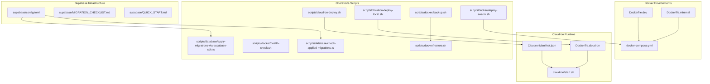
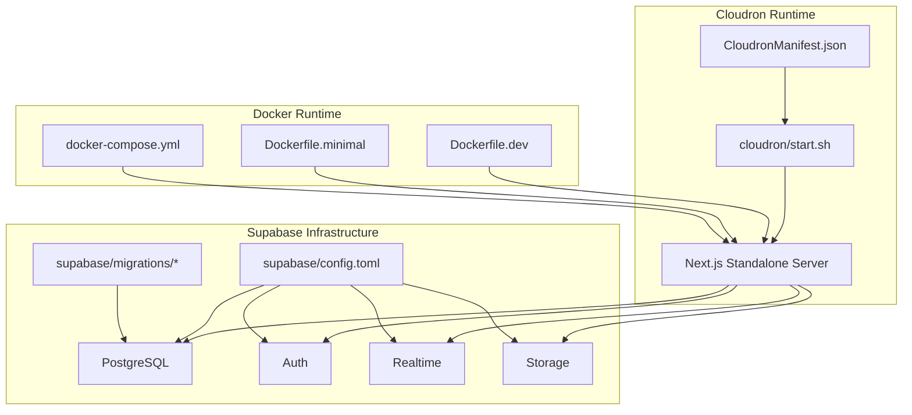
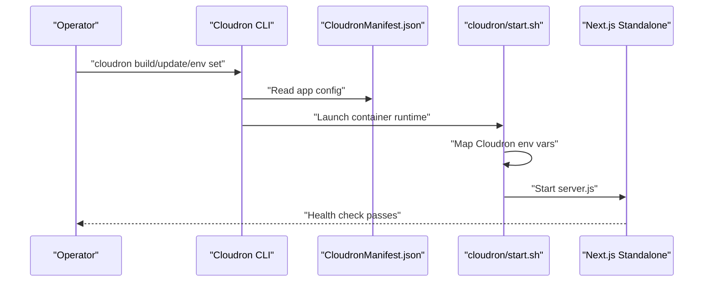
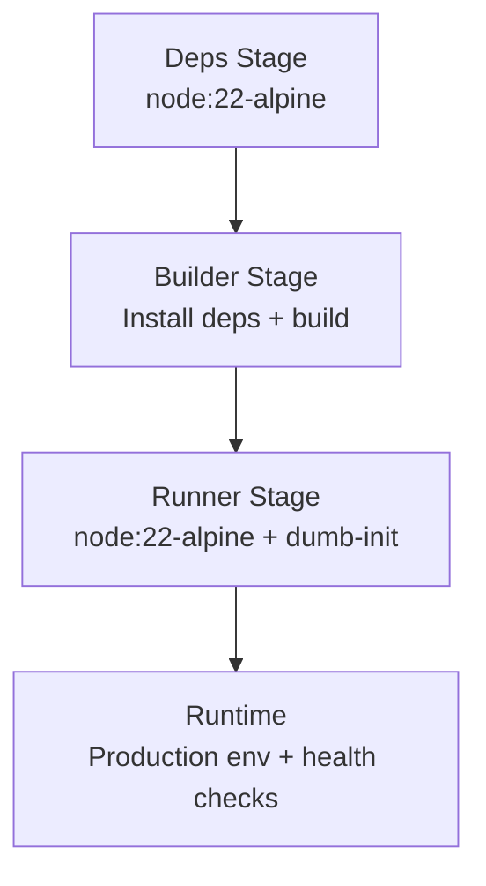
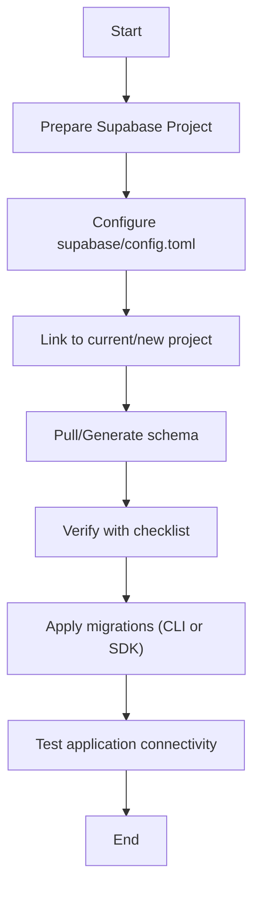
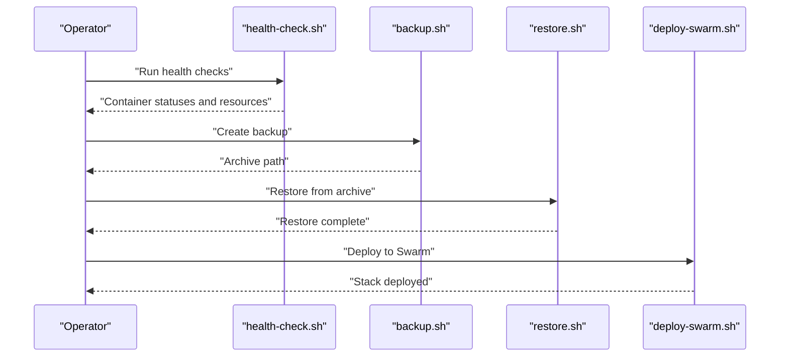
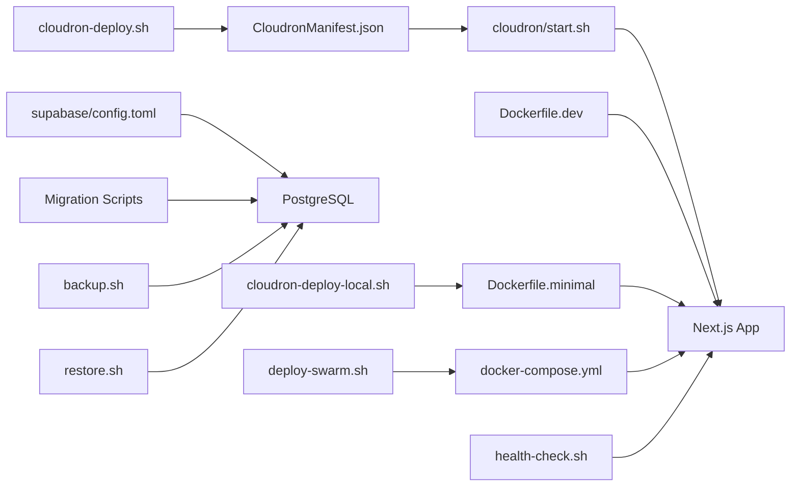

# Deployment and Operations

<cite>
**Referenced Files in This Document**
- [CloudronManifest.json](file://CloudronManifest.json)
- [Dockerfile.cloudron](file://Dockerfile.cloudron)
- [Dockerfile.dev](file://Dockerfile.dev)
- [Dockerfile.minimal](file://Dockerfile.minimal)
- [docker-compose.yml](file://docker-compose.yml)
- [package.json](file://package.json)
- [cloudron/start.sh](file://cloudron/start.sh)
- [scripts/cloudron-deploy.sh](file://scripts/cloudron-deploy.sh)
- [scripts/cloudron-deploy-local.sh](file://scripts/cloudron-deploy-local.sh)
- [supabase/config.toml](file://supabase/config.toml)
- [supabase/MIGRATION_CHECKLIST.md](file://supabase/MIGRATION_CHECKLIST.md)
- [supabase/QUICK_START.md](file://supabase/QUICK_START.md)
- [scripts/database/apply-migrations-via-supabase-sdk.ts](file://scripts/database/apply-migrations-via-supabase-sdk.ts)
- [scripts/database/check-applied-migrations.ts](file://scripts/database/check-applied-migrations.ts)
- [scripts/docker/backup.sh](file://scripts/docker/backup.sh)
- [scripts/docker/restore.sh](file://scripts/docker/restore.sh)
- [scripts/docker/health-check.sh](file://scripts/docker/health-check.sh)
- [scripts/docker/deploy-swarm.sh](file://scripts/docker/deploy-swarm.sh)
</cite>

## Table of Contents
1. [Introduction](#introduction)
2. [Project Structure](#project-structure)
3. [Core Components](#core-components)
4. [Architecture Overview](#architecture-overview)
5. [Detailed Component Analysis](#detailed-component-analysis)
6. [Dependency Analysis](#dependency-analysis)
7. [Performance Considerations](#performance-considerations)
8. [Troubleshooting Guide](#troubleshooting-guide)
9. [Conclusion](#conclusion)
10. [Appendices](#appendices)

## Introduction
This document provides comprehensive deployment and operations guidance for the legal management system. It covers production deployment via Cloudron, Docker-based environments, Supabase infrastructure provisioning and migrations, monitoring and maintenance procedures, and operational best practices. It also includes practical examples of deployment scripts, environment setup, and rollback procedures to ensure reliable operations in production.

## Project Structure
The repository includes multiple deployment targets and operational tooling:
- Cloudron packaging and runtime configuration
- Dockerfiles for development and production
- Docker Compose for local development and optional Swarm deployments
- Supabase configuration and migration tooling
- Operational scripts for backup, restore, health checks, and Swarm deployments

**Diagram sources**
- [Dockerfile.cloudron:1-96](file://Dockerfile.cloudron#L1-L96)
- [cloudron/start.sh:1-128](file://cloudron/start.sh#L1-L128)
- [CloudronManifest.json:1-31](file://CloudronManifest.json#L1-L31)
- [Dockerfile.dev:1-28](file://Dockerfile.dev#L1-L28)
- [Dockerfile.minimal:1-88](file://Dockerfile.minimal#L1-L88)
- [docker-compose.yml:1-87](file://docker-compose.yml#L1-L87)
- [supabase/config.toml:1-385](file://supabase/config.toml#L1-L385)
- [supabase/MIGRATION_CHECKLIST.md:1-354](file://supabase/MIGRATION_CHECKLIST.md#L1-L354)
- [supabase/QUICK_START.md:1-252](file://supabase/QUICK_START.md#L1-L252)
- [scripts/cloudron-deploy.sh:1-490](file://scripts/cloudron-deploy.sh#L1-L490)
- [scripts/cloudron-deploy-local.sh:1-484](file://scripts/cloudron-deploy-local.sh#L1-L484)
- [scripts/docker/backup.sh:1-43](file://scripts/docker/backup.sh#L1-L43)
- [scripts/docker/restore.sh:1-51](file://scripts/docker/restore.sh#L1-L51)
- [scripts/docker/health-check.sh:1-43](file://scripts/docker/health-check.sh#L1-L43)
- [scripts/docker/deploy-swarm.sh:1-45](file://scripts/docker/deploy-swarm.sh#L1-L45)
- [scripts/database/apply-migrations-via-supabase-sdk.ts:1-162](file://scripts/database/apply-migrations-via-supabase-sdk.ts#L1-L162)
- [scripts/database/check-applied-migrations.ts:1-223](file://scripts/database/check-applied-migrations.ts#L1-L223)

**Section sources**
- [CloudronManifest.json:1-31](file://CloudronManifest.json#L1-L31)
- [Dockerfile.cloudron:1-96](file://Dockerfile.cloudron#L1-L96)
- [Dockerfile.dev:1-28](file://Dockerfile.dev#L1-L28)
- [Dockerfile.minimal:1-88](file://Dockerfile.minimal#L1-L88)
- [docker-compose.yml:1-87](file://docker-compose.yml#L1-L87)
- [supabase/config.toml:1-385](file://supabase/config.toml#L1-L385)
- [supabase/MIGRATION_CHECKLIST.md:1-354](file://supabase/MIGRATION_CHECKLIST.md#L1-L354)
- [supabase/QUICK_START.md:1-252](file://supabase/QUICK_START.md#L1-L252)

## Core Components
- Cloudron application packaging and runtime:
  - Manifest defines health checks, ports, addons, and resource limits.
  - Container runtime uses a start script to map Cloudron environment variables and launch the Next.js standalone server.
- Docker containerization:
  - Development Dockerfile optimized for hot reload and debugging.
  - Minimal production Dockerfile with multi-stage build, hardened runtime, and health checks.
  - Docker Compose for local development and optional Swarm deployments.
- Supabase infrastructure:
  - Configuration for API, database, realtime, studio, storage, auth, and analytics.
  - Migration checklist and quick start guide for reproducible schema provisioning.
- Operational scripts:
  - Cloudron deployment automation (remote and local build).
  - Backup, restore, health checks, and Swarm deployment utilities.
  - Database migration verification and application scripts.

**Section sources**
- [CloudronManifest.json:1-31](file://CloudronManifest.json#L1-L31)
- [cloudron/start.sh:1-128](file://cloudron/start.sh#L1-L128)
- [Dockerfile.dev:1-28](file://Dockerfile.dev#L1-L28)
- [Dockerfile.minimal:1-88](file://Dockerfile.minimal#L1-L88)
- [docker-compose.yml:1-87](file://docker-compose.yml#L1-L87)
- [supabase/config.toml:1-385](file://supabase/config.toml#L1-L385)
- [supabase/MIGRATION_CHECKLIST.md:1-354](file://supabase/MIGRATION_CHECKLIST.md#L1-L354)
- [supabase/QUICK_START.md:1-252](file://supabase/QUICK_START.md#L1-L252)
- [scripts/cloudron-deploy.sh:1-490](file://scripts/cloudron-deploy.sh#L1-L490)
- [scripts/cloudron-deploy-local.sh:1-484](file://scripts/cloudron-deploy-local.sh#L1-L484)
- [scripts/docker/backup.sh:1-43](file://scripts/docker/backup.sh#L1-L43)
- [scripts/docker/restore.sh:1-51](file://scripts/docker/restore.sh#L1-L51)
- [scripts/docker/health-check.sh:1-43](file://scripts/docker/health-check.sh#L1-L43)
- [scripts/docker/deploy-swarm.sh:1-45](file://scripts/docker/deploy-swarm.sh#L1-L45)
- [scripts/database/apply-migrations-via-supabase-sdk.ts:1-162](file://scripts/database/apply-migrations-via-supabase-sdk.ts#L1-L162)
- [scripts/database/check-applied-migrations.ts:1-223](file://scripts/database/check-applied-migrations.ts#L1-L223)

## Architecture Overview
The system integrates a Next.js application with Supabase for authentication, database, and storage, orchestrated via Cloudron or Docker. Cloudron manages runtime, persistence, and addon integrations (Redis, SMTP). Docker provides portable development and production images, with optional Swarm orchestration.

**Diagram sources**
- [CloudronManifest.json:1-31](file://CloudronManifest.json#L1-L31)
- [cloudron/start.sh:1-128](file://cloudron/start.sh#L1-L128)
- [Dockerfile.dev:1-28](file://Dockerfile.dev#L1-L28)
- [Dockerfile.minimal:1-88](file://Dockerfile.minimal#L1-L88)
- [docker-compose.yml:1-87](file://docker-compose.yml#L1-L87)
- [supabase/config.toml:1-385](file://supabase/config.toml#L1-L385)

## Detailed Component Analysis

### Cloudron Application Packaging and Runtime
- Manifest configuration:
  - Defines health check path, HTTP port, addons (localstorage, Redis, SMTP), memory limit, and metadata.
- Runtime start script:
  - Maps Cloudron environment variables to application variables.
  - Prepares persistent directories under /app/data.
  - Launches the Next.js standalone server with production settings.
- Deployment automation:
  - Remote build and update via Cloudron CLI.
  - Local build and push to Cloudron registry with retry and rollback support.

**Diagram sources**
- [CloudronManifest.json:1-31](file://CloudronManifest.json#L1-L31)
- [cloudron/start.sh:1-128](file://cloudron/start.sh#L1-L128)
- [scripts/cloudron-deploy.sh:1-490](file://scripts/cloudron-deploy.sh#L1-L490)
- [scripts/cloudron-deploy-local.sh:1-484](file://scripts/cloudron-deploy-local.sh#L1-L484)

**Section sources**
- [CloudronManifest.json:1-31](file://CloudronManifest.json#L1-L31)
- [cloudron/start.sh:1-128](file://cloudron/start.sh#L1-L128)
- [scripts/cloudron-deploy.sh:1-490](file://scripts/cloudron-deploy.sh#L1-L490)
- [scripts/cloudron-deploy-local.sh:1-484](file://scripts/cloudron-deploy-local.sh#L1-L484)

### Docker Containerization and Multi-Stage Builds
- Development image:
  - Optimized for hot reload and debugging with development tools.
- Minimal production image:
  - Multi-stage build with caching, hardened runtime, dumb-init, and health checks.
- Docker Compose:
  - Provides environment variables for Supabase, Redis, storage, AI providers, and security settings.
  - Includes health checks aligned with production health endpoints.

**Diagram sources**
- [Dockerfile.minimal:1-88](file://Dockerfile.minimal#L1-L88)
- [Dockerfile.dev:1-28](file://Dockerfile.dev#L1-L28)
- [docker-compose.yml:1-87](file://docker-compose.yml#L1-L87)

**Section sources**
- [Dockerfile.dev:1-28](file://Dockerfile.dev#L1-L28)
- [Dockerfile.minimal:1-88](file://Dockerfile.minimal#L1-L88)
- [docker-compose.yml:1-87](file://docker-compose.yml#L1-L87)

### Supabase Deployment, Database Migrations, and Infrastructure Provisioning
- Configuration:
  - Supabase CLI configuration for API, database, realtime, studio, storage, auth, and analytics.
- Migration workflow:
  - Use migration checklist to track schema, constraints, indexes, views, functions, triggers, and RLS policies.
  - Quick start guide for recreating the database using CLI or manual SQL execution.
- Migration verification and application:
  - Scripts to verify applied migrations and to apply pending migrations via Supabase SDK.

**Diagram sources**
- [supabase/config.toml:1-385](file://supabase/config.toml#L1-L385)
- [supabase/MIGRATION_CHECKLIST.md:1-354](file://supabase/MIGRATION_CHECKLIST.md#L1-L354)
- [supabase/QUICK_START.md:1-252](file://supabase/QUICK_START.md#L1-L252)
- [scripts/database/apply-migrations-via-supabase-sdk.ts:1-162](file://scripts/database/apply-migrations-via-supabase-sdk.ts#L1-L162)
- [scripts/database/check-applied-migrations.ts:1-223](file://scripts/database/check-applied-migrations.ts#L1-L223)

**Section sources**
- [supabase/config.toml:1-385](file://supabase/config.toml#L1-L385)
- [supabase/MIGRATION_CHECKLIST.md:1-354](file://supabase/MIGRATION_CHECKLIST.md#L1-L354)
- [supabase/QUICK_START.md:1-252](file://supabase/QUICK_START.md#L1-L252)
- [scripts/database/apply-migrations-via-supabase-sdk.ts:1-162](file://scripts/database/apply-migrations-via-supabase-sdk.ts#L1-L162)
- [scripts/database/check-applied-migrations.ts:1-223](file://scripts/database/check-applied-migrations.ts#L1-L223)

### Monitoring and Maintenance Procedures
- Health checks:
  - Cloudron and Docker health checks configured for the application.
  - Utility script to check Docker daemon, local services, Swarm status, and resource usage.
- Logging and diagnostics:
  - Persistent logs directory in Cloudron runtime.
  - Use Cloudron logs and status commands for diagnostics.
- Backup and restore:
  - Backup script to capture PostgreSQL, Redis, and environment configurations.
  - Restore script to restore from compressed archives.
- Swarm deployments:
  - Automated Swarm initialization, secret creation, and stack deployment.

**Diagram sources**
- [scripts/docker/health-check.sh:1-43](file://scripts/docker/health-check.sh#L1-L43)
- [scripts/docker/backup.sh:1-43](file://scripts/docker/backup.sh#L1-L43)
- [scripts/docker/restore.sh:1-51](file://scripts/docker/restore.sh#L1-L51)
- [scripts/docker/deploy-swarm.sh:1-45](file://scripts/docker/deploy-swarm.sh#L1-L45)

**Section sources**
- [cloudron/start.sh:1-128](file://cloudron/start.sh#L1-L128)
- [scripts/docker/health-check.sh:1-43](file://scripts/docker/health-check.sh#L1-L43)
- [scripts/docker/backup.sh:1-43](file://scripts/docker/backup.sh#L1-L43)
- [scripts/docker/restore.sh:1-51](file://scripts/docker/restore.sh#L1-L51)
- [scripts/docker/deploy-swarm.sh:1-45](file://scripts/docker/deploy-swarm.sh#L1-L45)

## Dependency Analysis
- Cloudron runtime depends on:
  - Manifest for configuration and health checks.
  - Start script for environment mapping and process lifecycle.
- Docker runtime depends on:
  - Development and minimal Dockerfiles for image variants.
  - Docker Compose for environment variable wiring and health checks.
- Supabase infrastructure depends on:
  - Configuration file for service endpoints and policies.
  - Migration scripts for schema verification and application.
- Operational scripts depend on:
  - Environment variables for Supabase and storage.
  - Docker and Cloudron CLIs for orchestration.

**Diagram sources**
- [CloudronManifest.json:1-31](file://CloudronManifest.json#L1-L31)
- [cloudron/start.sh:1-128](file://cloudron/start.sh#L1-L128)
- [Dockerfile.dev:1-28](file://Dockerfile.dev#L1-L28)
- [Dockerfile.minimal:1-88](file://Dockerfile.minimal#L1-L88)
- [docker-compose.yml:1-87](file://docker-compose.yml#L1-L87)
- [supabase/config.toml:1-385](file://supabase/config.toml#L1-L385)
- [scripts/database/apply-migrations-via-supabase-sdk.ts:1-162](file://scripts/database/apply-migrations-via-supabase-sdk.ts#L1-L162)
- [scripts/database/check-applied-migrations.ts:1-223](file://scripts/database/check-applied-migrations.ts#L1-L223)
- [scripts/cloudron-deploy.sh:1-490](file://scripts/cloudron-deploy.sh#L1-L490)
- [scripts/cloudron-deploy-local.sh:1-484](file://scripts/cloudron-deploy-local.sh#L1-L484)
- [scripts/docker/backup.sh:1-43](file://scripts/docker/backup.sh#L1-L43)
- [scripts/docker/restore.sh:1-51](file://scripts/docker/restore.sh#L1-L51)
- [scripts/docker/health-check.sh:1-43](file://scripts/docker/health-check.sh#L1-L43)
- [scripts/docker/deploy-swarm.sh:1-45](file://scripts/docker/deploy-swarm.sh#L1-L45)

**Section sources**
- [package.json:1-409](file://package.json#L1-L409)

## Performance Considerations
- Container runtime:
  - Use the minimal production Dockerfile to reduce image size and attack surface.
  - Configure health checks and resource limits to ensure predictable performance.
- Supabase:
  - Follow migration checklist to maintain indexes, constraints, and RLS policies.
  - Use Supabase CLI for schema verification and performance tuning.
- Monitoring:
  - Leverage Docker health checks and Cloudron status/logs for early detection of issues.

[No sources needed since this section provides general guidance]

## Troubleshooting Guide
- Cloudron deployment failures:
  - Use the local build script to bypass insufficient memory in the remote build service.
  - Retry updates with previously built images using the image flag.
- Database migrations:
  - Use the migration verification script to identify missing migrations.
  - Apply pending migrations via the Supabase SDK script.
- Backup and restore:
  - Use the backup script to create compressed archives.
  - Use the restore script to restore from archives, including database and Redis dumps.
- Health checks:
  - Use the health-check script to diagnose container and resource issues.

**Section sources**
- [scripts/cloudron-deploy.sh:1-490](file://scripts/cloudron-deploy.sh#L1-L490)
- [scripts/cloudron-deploy-local.sh:1-484](file://scripts/cloudron-deploy-local.sh#L1-L484)
- [scripts/database/check-applied-migrations.ts:1-223](file://scripts/database/check-applied-migrations.ts#L1-L223)
- [scripts/database/apply-migrations-via-supabase-sdk.ts:1-162](file://scripts/database/apply-migrations-via-supabase-sdk.ts#L1-L162)
- [scripts/docker/backup.sh:1-43](file://scripts/docker/backup.sh#L1-L43)
- [scripts/docker/restore.sh:1-51](file://scripts/docker/restore.sh#L1-L51)
- [scripts/docker/health-check.sh:1-43](file://scripts/docker/health-check.sh#L1-L43)

## Conclusion
This document outlined a complete deployment and operations strategy for the legal management system across Cloudron and Docker environments, with robust Supabase infrastructure provisioning and migration management. By leveraging the provided scripts and configurations, teams can achieve reliable, repeatable deployments, effective monitoring, and resilient maintenance procedures in production.

[No sources needed since this section summarizes without analyzing specific files]

## Appendices

### Practical Examples and Procedures
- Cloudron deployment (remote build):
  - Build, update, and environment set using the remote deployment script.
  - Example flags: skip build, env-only, dry-run, and image reuse for rollback.
- Cloudron deployment (local build):
  - Build locally, push to registry, update, and environment set.
  - Example flags: no-cache, cleanup, and image reuse for retry.
- Supabase migration application:
  - Apply pending migrations via the Supabase SDK script.
  - Verify applied migrations with the verification script.
- Backup and restore:
  - Create backups including PostgreSQL, Redis, and environment files.
  - Restore from compressed archives with database and Redis restoration steps.
- Swarm deployment:
  - Initialize Swarm, create secrets, deploy stack, and monitor convergence.

**Section sources**
- [scripts/cloudron-deploy.sh:1-490](file://scripts/cloudron-deploy.sh#L1-L490)
- [scripts/cloudron-deploy-local.sh:1-484](file://scripts/cloudron-deploy-local.sh#L1-L484)
- [scripts/database/apply-migrations-via-supabase-sdk.ts:1-162](file://scripts/database/apply-migrations-via-supabase-sdk.ts#L1-L162)
- [scripts/database/check-applied-migrations.ts:1-223](file://scripts/database/check-applied-migrations.ts#L1-L223)
- [scripts/docker/backup.sh:1-43](file://scripts/docker/backup.sh#L1-L43)
- [scripts/docker/restore.sh:1-51](file://scripts/docker/restore.sh#L1-L51)
- [scripts/docker/deploy-swarm.sh:1-45](file://scripts/docker/deploy-swarm.sh#L1-L45)