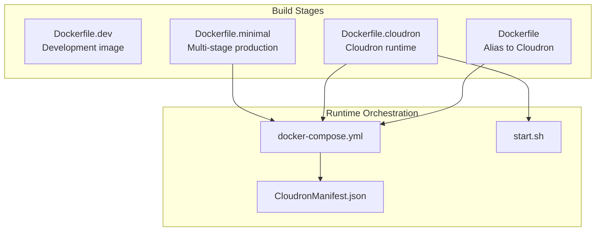
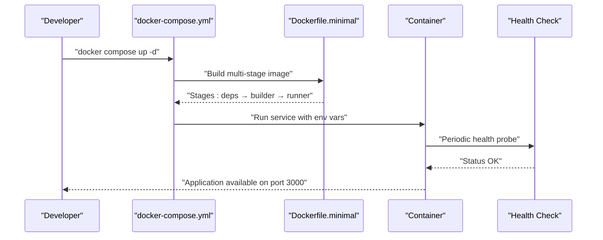
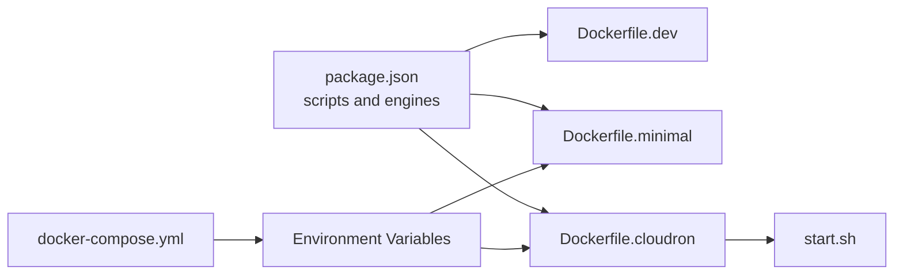

# Docker Containerization

<cite>
**Referenced Files in This Document**
- [Dockerfile.dev](file://Dockerfile.dev)
- [Dockerfile.minimal](file://Dockerfile.minimal)
- [Dockerfile.cloudron](file://Dockerfile.cloudron)
- [Dockerfile](file://Dockerfile)
- [docker-compose.yml](file://docker-compose.yml)
- [.dockerignore](file://.dockerignore)
- [start.sh](file://start.sh)
- [CloudronManifest.json](file://CloudronManifest.json)
- [scripts/docker/init-dev.sh](file://scripts/docker/init-dev.sh)
- [scripts/docker/dev.sh](file://scripts/docker/dev.sh)
- [scripts/docker/prod.sh](file://scripts/docker/prod.sh)
- [package.json](file://package.json)
</cite>

## Table of Contents
1. [Introduction](#introduction)
2. [Project Structure](#project-structure)
3. [Core Components](#core-components)
4. [Architecture Overview](#architecture-overview)
5. [Detailed Component Analysis](#detailed-component-analysis)
6. [Dependency Analysis](#dependency-analysis)
7. [Performance Considerations](#performance-considerations)
8. [Troubleshooting Guide](#troubleshooting-guide)
9. [Conclusion](#conclusion)
10. [Appendices](#appendices)

## Introduction
This document explains the Docker containerization strategy for the project, focusing on multi-stage builds, production optimization, and development environment setup. It documents the different Dockerfiles for various environments, container orchestration with docker-compose, and image optimization strategies. It also covers volume mounting, network configuration, environment variable handling, security best practices, resource limits, health checks, and troubleshooting techniques for container startup and performance.

## Project Structure
The repository provides multiple Dockerfiles tailored to different deployment targets and workflows:
- A development-focused Dockerfile optimized for hot reload and debugging
- A minimal production Dockerfile implementing a three-stage build for ultra-lightweight runtime images
- A Cloudron-specific Dockerfile for platform deployments
- A docker-compose configuration for local development orchestration

Key supporting files include a comprehensive .dockerignore to reduce build context, a Cloudron start script for runtime environment mapping, and scripts to manage development and production lifecycles.

**Diagram sources**
- [Dockerfile.dev:1-28](file://Dockerfile.dev#L1-L28)
- [Dockerfile.minimal:1-88](file://Dockerfile.minimal#L1-L88)
- [Dockerfile.cloudron:1-96](file://Dockerfile.cloudron#L1-L96)
- [Dockerfile:1-96](file://Dockerfile#L1-L96)
- [docker-compose.yml:1-87](file://docker-compose.yml#L1-L87)
- [CloudronManifest.json:1-31](file://CloudronManifest.json#L1-L31)
- [start.sh:1-128](file://start.sh#L1-L128)

**Section sources**
- [Dockerfile.dev:1-28](file://Dockerfile.dev#L1-L28)
- [Dockerfile.minimal:1-88](file://Dockerfile.minimal#L1-L88)
- [Dockerfile.cloudron:1-96](file://Dockerfile.cloudron#L1-L96)
- [Dockerfile:1-96](file://Dockerfile#L1-L96)
- [docker-compose.yml:1-87](file://docker-compose.yml#L1-L87)
- [.dockerignore:1-145](file://.dockerignore#L1-L145)
- [CloudronManifest.json:1-31](file://CloudronManifest.json#L1-L31)
- [start.sh:1-128](file://start.sh#L1-L128)

## Core Components
- Development image (Dockerfile.dev): Optimized for rapid iteration with hot reload and minimal tooling overhead.
- Minimal production image (Dockerfile.minimal): Multi-stage build producing a small, secure runtime image with a dedicated non-root user and health checks.
- Cloudron image (Dockerfile.cloudron): Platform-specific build that installs Node.js 22 into the Cloudron base image, prepares persistent directories, and exposes a start script for runtime.
- Orchestration (docker-compose.yml): Defines the application service, environment variables, health checks, and network configuration for local development.
- Runtime bridge (start.sh): Maps Cloudron environment variables to Next.js-compatible variables, sets runtime directories, and starts the standalone server.
- Build and lifecycle scripts: Helper scripts for development bootstrapping and production swarm management.

**Section sources**
- [Dockerfile.dev:1-28](file://Dockerfile.dev#L1-L28)
- [Dockerfile.minimal:1-88](file://Dockerfile.minimal#L1-L88)
- [Dockerfile.cloudron:1-96](file://Dockerfile.cloudron#L1-L96)
- [docker-compose.yml:1-87](file://docker-compose.yml#L1-L87)
- [start.sh:1-128](file://start.sh#L1-L128)
- [scripts/docker/init-dev.sh:1-91](file://scripts/docker/init-dev.sh#L1-L91)
- [scripts/docker/dev.sh:1-41](file://scripts/docker/dev.sh#L1-L41)
- [scripts/docker/prod.sh:1-41](file://scripts/docker/prod.sh#L1-L41)

## Architecture Overview
The containerization architecture separates concerns across build stages and runtime environments:
- Build-time: Dependencies are resolved and compiled in isolated stages to minimize final image size.
- Runtime: The application runs as a non-root user with hardened defaults, health checks, and optional persistent caches.
- Orchestration: docker-compose coordinates the application service and environment variables for local development.
- Platform: Cloudron-specific runtime adapts environment variables and persists data under /app/data.

**Diagram sources**
- [docker-compose.yml:1-87](file://docker-compose.yml#L1-L87)
- [Dockerfile.minimal:1-88](file://Dockerfile.minimal#L1-L88)

## Detailed Component Analysis

### Development Image (Dockerfile.dev)
Purpose:
- Enable fast iteration with hot reload and debugging capabilities.
- Keep a minimal footprint for local development.

Key characteristics:
- Uses Node.js Alpine base.
- Installs essential developer tools (git, bash, curl, libc6-compat).
- Skips Playwright browser downloads for remote execution.
- Exposes port 3000 and runs the development server.

Optimization highlights:
- Watches for filesystem changes with polling enabled.
- Avoids installing dev dependencies in production images.

Operational notes:
- Intended for local development; not suitable for production.

**Section sources**
- [Dockerfile.dev:1-28](file://Dockerfile.dev#L1-L28)

### Minimal Production Image (Dockerfile.minimal)
Purpose:
- Produce a compact, secure runtime image suitable for production deployments.

Multi-stage build:
- Stage 1 (deps): Resolves dependencies with caching and disables telemetry.
- Stage 2 (builder): Copies node_modules and builds the Next.js standalone output with environment variables injected at build time.
- Stage 3 (runner): Creates a non-root user, copies static and standalone artifacts, sets labels, defines health checks, and starts the server with dumb-init.

Security and hardening:
- Non-root user (nextjs:nodejs) with restricted permissions.
- Health checks configured for readiness monitoring.
- OCI labels included for provenance metadata.

Runtime configuration:
- Environment variables for Next.js and the server process are set explicitly.
- Standalone server started via dumb-init to handle signals properly.

**Section sources**
- [Dockerfile.minimal:1-88](file://Dockerfile.minimal#L1-L88)

### Cloudron Image (Dockerfile.cloudron)
Purpose:
- Provide a Cloudron-compatible runtime with Node.js 22 and persistent data directories.

Build and runtime specifics:
- Pin Node.js version and Cloudron base image for reproducibility.
- Installs Node.js 22 into the Cloudron base image and replaces binaries in place.
- Prepares /app/code (read-only) and /app/data (persistent) directories.
- Symlinks Next.js cache to a writable location under /app/data.
- Includes a start script to map Cloudron environment variables and launch the server.

Health checks:
- Embedded health check instruction for local inspection and compatibility with Cloudron’s health endpoint.

**Section sources**
- [Dockerfile.cloudron:1-96](file://Dockerfile.cloudron#L1-L96)
- [start.sh:1-128](file://start.sh#L1-L128)
- [CloudronManifest.json:1-31](file://CloudronManifest.json#L1-L31)

### Orchestration with docker-compose
Purpose:
- Define and run the application service locally with environment variables and health checks.

Service definition:
- Builds from the default Dockerfile with build args for public Next.js variables.
- Publishes port 3000 and sets environment variables for Supabase, service keys, optional Redis, storage, AI providers, browser service, security, and logging.
- Adds a health check aligned with the application’s health endpoint.

Networking:
- Creates a bridge network for internal service communication.

**Section sources**
- [docker-compose.yml:1-87](file://docker-compose.yml#L1-L87)

### Runtime Environment Mapping (start.sh)
Purpose:
- Bridge Cloudron environment variables to Next.js-compatible variables and prepare runtime directories.

Responsibilities:
- Ensures persistent directories exist and have correct ownership.
- Maps Redis and email (sendmail) variables from Cloudron to application variables.
- Sets application URLs, memory limits, and runtime environment variables.
- Starts the Next.js standalone server.

**Section sources**
- [start.sh:1-128](file://start.sh#L1-L128)

### Build and Lifecycle Scripts
- Development bootstrap: Initializes environment files, starts services, waits for dependencies, and prints helpful links.
- Development commands: Start, stop, restart, logs, shell access, and database migration/seed helpers.
- Production commands: Deploy to Swarm, scale services, rollback, check status, stream logs, and trigger backups.

**Section sources**
- [scripts/docker/init-dev.sh:1-91](file://scripts/docker/init-dev.sh#L1-L91)
- [scripts/docker/dev.sh:1-41](file://scripts/docker/dev.sh#L1-L41)
- [scripts/docker/prod.sh:1-41](file://scripts/docker/prod.sh#L1-L41)

## Dependency Analysis
The containerization relies on:
- Node.js 22 as the base runtime across development and production images.
- Next.js standalone output for efficient runtime execution.
- Optional external services (Redis, storage providers, AI providers) configured via environment variables.
- Cloudron-specific runtime and start script for platform deployments.

**Diagram sources**
- [package.json:1-200](file://package.json#L1-L200)
- [Dockerfile.dev:1-28](file://Dockerfile.dev#L1-L28)
- [Dockerfile.minimal:1-88](file://Dockerfile.minimal#L1-L88)
- [Dockerfile.cloudron:1-96](file://Dockerfile.cloudron#L1-L96)
- [start.sh:1-128](file://start.sh#L1-L128)
- [docker-compose.yml:1-87](file://docker-compose.yml#L1-L87)

**Section sources**
- [package.json:1-200](file://package.json#L1-L200)
- [Dockerfile.dev:1-28](file://Dockerfile.dev#L1-L28)
- [Dockerfile.minimal:1-88](file://Dockerfile.minimal#L1-L88)
- [Dockerfile.cloudron:1-96](file://Dockerfile.cloudron#L1-L96)
- [start.sh:1-128](file://start.sh#L1-L128)
- [docker-compose.yml:1-87](file://docker-compose.yml#L1-L87)

## Performance Considerations
- Build caching: Multi-stage builds leverage npm and Next.js caches to speed up rebuilds.
- Image size: The minimal image reduces layers and avoids unnecessary packages, targeting a small footprint.
- Runtime memory: The Cloudron start script derives Node.js heap size from Cloudron’s memory limit to prevent OOM conditions.
- Telemetry disabled: Environment variables disable Next.js telemetry and related overhead during builds and runtime.
- Health checks: Periodic probes ensure quick detection of unresponsive instances.

[No sources needed since this section provides general guidance]

## Troubleshooting Guide
Common startup and performance issues:
- Build context bloat: Ensure .dockerignore excludes large or irrelevant directories to avoid slow builds and excessive memory usage.
- Missing environment variables: Verify required environment variables are present in docker-compose or Cloudron configuration.
- Health check failures: Confirm the application responds to the health endpoint and that the container port is exposed.
- Memory pressure: Adjust Node.js heap size via environment variables or Cloudron memory mapping.
- Volume permissions (Cloudron): Ensure persistent directories under /app/data have correct ownership after symlink creation.

Operational commands:
- Inspect health: Use docker-compose healthcheck or embedded health checks.
- View logs: Stream service logs via the production script or docker logs.
- Interactive shell: Access the running container for diagnostics.

**Section sources**
- [.dockerignore:1-145](file://.dockerignore#L1-L145)
- [docker-compose.yml:1-87](file://docker-compose.yml#L1-L87)
- [start.sh:1-128](file://start.sh#L1-L128)
- [scripts/docker/prod.sh:1-41](file://scripts/docker/prod.sh#L1-L41)

## Conclusion
The project’s Docker strategy combines multi-stage builds, platform-specific runtime adaptations, and robust orchestration to deliver a secure, efficient, and maintainable containerized application. Development and production workflows are clearly separated, with strong emphasis on minimizing image size, enforcing non-root execution, and providing reliable health monitoring.

[No sources needed since this section summarizes without analyzing specific files]

## Appendices

### Practical Examples

- Building a production image with the minimal Dockerfile:
  - Use the multi-stage build to produce a small, hardened runtime image suitable for deployment.
  - Reference: [Dockerfile.minimal:1-88](file://Dockerfile.minimal#L1-L88)

- Running a development container:
  - Use docker-compose to spin up the service with environment variables and health checks.
  - Reference: [docker-compose.yml:1-87](file://docker-compose.yml#L1-L87)

- Preparing a Cloudron deployment:
  - Build the Cloudron-specific image and rely on the start script to map environment variables and persist data.
  - References: [Dockerfile.cloudron:1-96](file://Dockerfile.cloudron#L1-L96), [start.sh:1-128](file://start.sh#L1-L128), [CloudronManifest.json:1-31](file://CloudronManifest.json#L1-L31)

- Managing development lifecycle:
  - Bootstrap the environment, start services, and run migrations/seed as needed.
  - References: [scripts/docker/init-dev.sh:1-91](file://scripts/docker/init-dev.sh#L1-L91), [scripts/docker/dev.sh:1-41](file://scripts/docker/dev.sh#L1-L41)

- Managing production lifecycle:
  - Deploy to Swarm, scale services, and monitor status and logs.
  - Reference: [scripts/docker/prod.sh:1-41](file://scripts/docker/prod.sh#L1-L41)

### Security Best Practices
- Non-root execution: The minimal image runs as a non-root user; maintain this practice in all environments.
- Health checks: Configure health checks to detect and recover from unhealthy states.
- Secrets handling: Avoid embedding secrets in images; pass them via environment variables or secret managers.
- Network isolation: Use dedicated networks for internal service communication.
- Resource limits: Set CPU/memory limits in orchestrators to prevent noisy-neighbor issues.

[No sources needed since this section provides general guidance]

### Environment Variables Reference
- Supabase: NEXT_PUBLIC_SUPABASE_URL, NEXT_PUBLIC_SUPABASE_PUBLISHABLE_OR_ANON_KEY, SUPABASE_SECRET_KEY
- System authentication: SERVICE_API_KEY, CRON_SECRET
- Optional Redis: ENABLE_REDIS_CACHE, REDIS_URL, REDIS_PASSWORD, REDIS_CACHE_TTL
- Storage (Backblaze B2): STORAGE_PROVIDER, B2_ENDPOINT, B2_REGION, B2_BUCKET, B2_KEY_ID, B2_APPLICATION_KEY
- AI/Embeddings: OPENAI_API_KEY, OPENAI_EMBEDDING_MODEL, AI_EMBEDDING_PROVIDER, AI_GATEWAY_API_KEY, GOOGLE_API_KEY, ENABLE_AI_INDEXING
- Browser service: BROWSER_WS_ENDPOINT, BROWSER_SERVICE_URL, BROWSER_SERVICE_TOKEN
- Security: RATE_LIMIT_FAIL_MODE, IP_BLOCKING_ENABLED, CSP_REPORT_ONLY
- Debugging: DEBUG_SUPABASE, LOG_LEVEL

**Section sources**
- [docker-compose.yml:31-74](file://docker-compose.yml#L31-L74)