# Monitoring and Maintenance

<cite>
**Referenced Files in This Document**
- [logger/index.ts](file://src/lib/logger/index.ts)
- [cron-auth.ts](file://src/lib/cron/cron-auth.ts)
- [vacuum-maintenance/route.ts](file://src/app/api/cron/vacuum-maintenance/route.ts)
- [alertas-disk-io/route.ts](file://src/app/api/cron/alertas-disk-io/route.ts)
- [scripts/docker/backup.sh](file://scripts/docker/backup.sh)
- [scripts/docker/restore.sh](file://scripts/docker/restore.sh)
- [scripts/docker/test-backup-restore.sh](file://scripts/docker/test-backup-restore.sh)
- [scripts/docker/health-check.sh](file://scripts/docker/health-check.sh)
- [scripts/security/check-secrets.js](file://scripts/security/check-secrets.js)
- [scripts/security/check-plaintext-storage.js](file://scripts/security/check-plaintext-storage.js)
- [scripts/database/diagnostico-disk-io.ts](file://scripts/database/diagnostico-disk-io.ts)
- [scripts/database/populate-database.ts](file://scripts/database/populate-database.ts)
- [supabase/functions/alertas-disk-io/index.ts](file://supabase/functions/alertas-disk-io/index.ts)
- [supabase/COMMANDS_REFERENCE.sh](file://supabase/COMMANDS_REFERENCE.sh)
- [src/app/(authenticated)/admin/services/upgrade-advisor.ts](file://src/app/(authenticated)/admin/services/upgrade-advisor.ts)
- [src/app/(authenticated)/financeiro/components/dashboard/widgets/alertas-widget.tsx](file://src/app/(authenticated)/financeiro/components/dashboard/widgets/alertas-widget.tsx)
- [src/app/(authenticated)/captura/services/api-client.ts](file://src/app/(authenticated)/captura/services/api-client.ts)
</cite>

## Table of Contents
1. [Introduction](#introduction)
2. [Project Structure](#project-structure)
3. [Core Components](#core-components)
4. [Architecture Overview](#architecture-overview)
5. [Detailed Component Analysis](#detailed-component-analysis)
6. [Dependency Analysis](#dependency-analysis)
7. [Performance Considerations](#performance-considerations)
8. [Troubleshooting Guide](#troubleshooting-guide)
9. [Conclusion](#conclusion)
10. [Appendices](#appendices)

## Introduction
This document provides comprehensive monitoring and maintenance guidance for the legal management system. It covers observability, performance tracking, operational procedures, logging strategies, metrics collection, alerting mechanisms, database maintenance, backup and recovery, security audits, and system health checks. Practical examples illustrate monitoring dashboards, log analysis, and troubleshooting workflows, along with maintenance schedules, update procedures, and incident response protocols tailored for the platform.

## Project Structure
The monitoring and maintenance capabilities span client-side logging utilities, serverless cron routes, Supabase Edge Functions, Docker-based backup/restore tooling, and CLI scripts for diagnostics and population. These components collaborate to deliver structured logging, automated health checks, alerting, and operational safety nets.

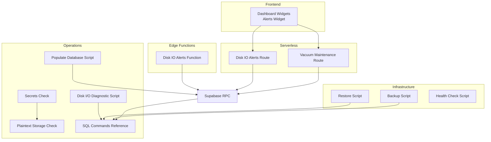

**Diagram sources**
- [vacuum-maintenance/route.ts:1-133](file://src/app/api/cron/vacuum-maintenance/route.ts#L1-L133)
- [alertas-disk-io/route.ts:1-115](file://src/app/api/cron/alertas-disk-io/route.ts#L1-L115)
- [scripts/docker/backup.sh:1-43](file://scripts/docker/backup.sh#L1-L43)
- [scripts/docker/restore.sh:1-51](file://scripts/docker/restore.sh#L1-L51)
- [scripts/docker/health-check.sh:1-43](file://scripts/docker/health-check.sh#L1-L43)
- [scripts/security/check-secrets.js:1-60](file://scripts/security/check-secrets.js#L1-L60)
- [scripts/security/check-plaintext-storage.js:1-74](file://scripts/security/check-plaintext-storage.js#L1-L74)
- [scripts/database/diagnostico-disk-io.ts:1-416](file://scripts/database/diagnostico-disk-io.ts#L1-L416)
- [scripts/database/populate-database.ts:1-384](file://scripts/database/populate-database.ts#L1-L384)
- [supabase/functions/alertas-disk-io/index.ts:1-342](file://supabase/functions/alertas-disk-io/index.ts#L1-L342)
- [supabase/COMMANDS_REFERENCE.sh:56-251](file://supabase/COMMANDS_REFERENCE.sh#L56-L251)

**Section sources**
- [logger/index.ts:1-57](file://src/lib/logger/index.ts#L1-L57)
- [cron-auth.ts:1-98](file://src/lib/cron/cron-auth.ts#L1-L98)
- [vacuum-maintenance/route.ts:1-133](file://src/app/api/cron/vacuum-maintenance/route.ts#L1-L133)
- [alertas-disk-io/route.ts:1-115](file://src/app/api/cron/alertas-disk-io/route.ts#L1-L115)
- [scripts/docker/backup.sh:1-43](file://scripts/docker/backup.sh#L1-L43)
- [scripts/docker/restore.sh:1-51](file://scripts/docker/restore.sh#L1-L51)
- [scripts/docker/health-check.sh:1-43](file://scripts/docker/health-check.sh#L1-L43)
- [scripts/security/check-secrets.js:1-60](file://scripts/security/check-secrets.js#L1-L60)
- [scripts/security/check-plaintext-storage.js:1-74](file://scripts/security/check-plaintext-storage.js#L1-L74)
- [scripts/database/diagnostico-disk-io.ts:1-416](file://scripts/database/diagnostico-disk-io.ts#L1-L416)
- [scripts/database/populate-database.ts:1-384](file://scripts/database/populate-database.ts#L1-L384)
- [supabase/functions/alertas-disk-io/index.ts:1-342](file://supabase/functions/alertas-disk-io/index.ts#L1-L342)
- [supabase/COMMANDS_REFERENCE.sh:56-251](file://supabase/COMMANDS_REFERENCE.sh#L56-L251)

## Core Components
- Logging and correlation: Structured logging with correlation IDs for traceability across requests.
- Cron-based maintenance: Automated vacuum diagnostics and Disk IO budget alerts.
- Edge Function alerting: Disk IO and bloat detection with notifications and optional email.
- Backup and restore: Containerized scripts for Postgres and Redis, plus archive handling.
- Security checks: Lint-based secrets scanning and plaintext storage detection.
- Diagnostics: Comprehensive Disk I/O diagnostic script leveraging Supabase CLI and SQL views.
- Operational scripts: Populate database from captured results and health checks for Docker environments.

**Section sources**
- [logger/index.ts:1-57](file://src/lib/logger/index.ts#L1-L57)
- [vacuum-maintenance/route.ts:1-133](file://src/app/api/cron/vacuum-maintenance/route.ts#L1-L133)
- [alertas-disk-io/route.ts:1-115](file://src/app/api/cron/alertas-disk-io/route.ts#L1-L115)
- [supabase/functions/alertas-disk-io/index.ts:1-342](file://supabase/functions/alertas-disk-io/index.ts#L1-L342)
- [scripts/docker/backup.sh:1-43](file://scripts/docker/backup.sh#L1-L43)
- [scripts/docker/restore.sh:1-51](file://scripts/docker/restore.sh#L1-L51)
- [scripts/security/check-secrets.js:1-60](file://scripts/security/check-secrets.js#L1-L60)
- [scripts/security/check-plaintext-storage.js:1-74](file://scripts/security/check-plaintext-storage.js#L1-L74)
- [scripts/database/diagnostico-disk-io.ts:1-416](file://scripts/database/diagnostico-disk-io.ts#L1-L416)
- [scripts/database/populate-database.ts:1-384](file://scripts/database/populate-database.ts#L1-L384)

## Architecture Overview
The monitoring and maintenance architecture integrates frontend dashboards, serverless cron endpoints, Supabase RPCs, and Edge Functions to provide continuous visibility and automated remediation signals. Docker tooling ensures repeatable backups and restores, while security scripts enforce safe development practices.

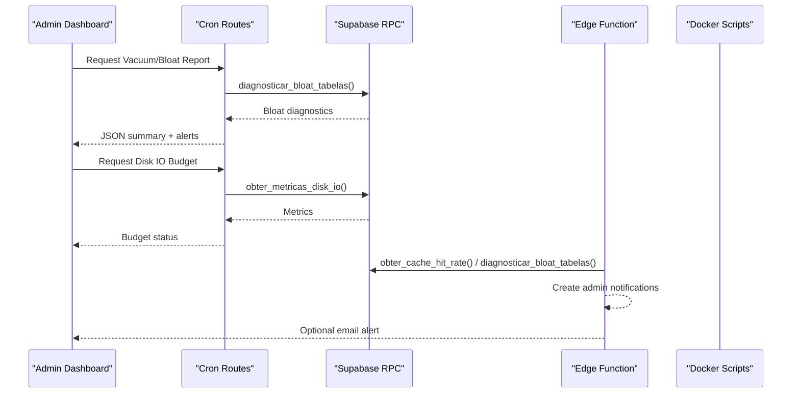

**Diagram sources**
- [vacuum-maintenance/route.ts:35-111](file://src/app/api/cron/vacuum-maintenance/route.ts#L35-L111)
- [alertas-disk-io/route.ts:61-96](file://src/app/api/cron/alertas-disk-io/route.ts#L61-L96)
- [supabase/functions/alertas-disk-io/index.ts:233-297](file://supabase/functions/alertas-disk-io/index.ts#L233-L297)

**Section sources**
- [vacuum-maintenance/route.ts:1-133](file://src/app/api/cron/vacuum-maintenance/route.ts#L1-L133)
- [alertas-disk-io/route.ts:1-115](file://src/app/api/cron/alertas-disk-io/route.ts#L1-L115)
- [supabase/functions/alertas-disk-io/index.ts:1-342](file://supabase/functions/alertas-disk-io/index.ts#L1-L342)

## Detailed Component Analysis

### Logging and Correlation
- Structured logging with ISO timestamps and optional pretty-printing in development.
- AsyncLocalStorage-backed correlation IDs propagated across logs for end-to-end tracing.
- Context-aware child loggers enriched with correlation identifiers.

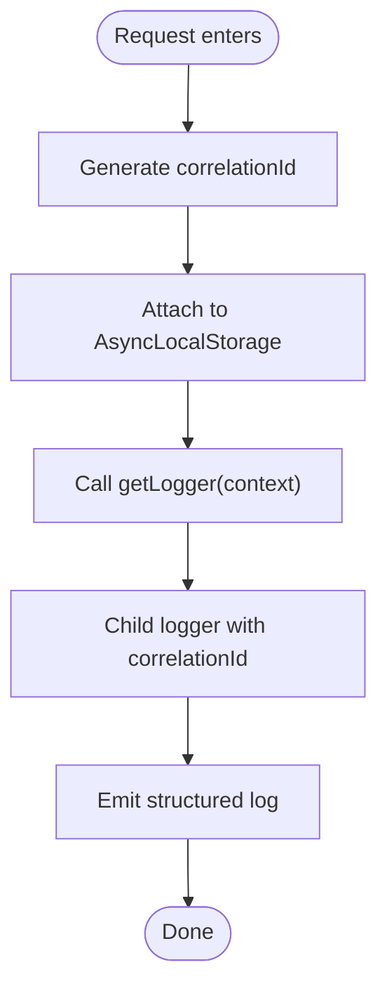

**Diagram sources**
- [logger/index.ts:45-51](file://src/lib/logger/index.ts#L45-L51)

**Section sources**
- [logger/index.ts:1-57](file://src/lib/logger/index.ts#L1-L57)

### Cron Authentication
- Timing-safe comparison for bearer tokens and X-Cron-Secret header.
- Supports multiple configured secrets and fallback parsing.
- Returns standardized unauthorized responses with debug hints.

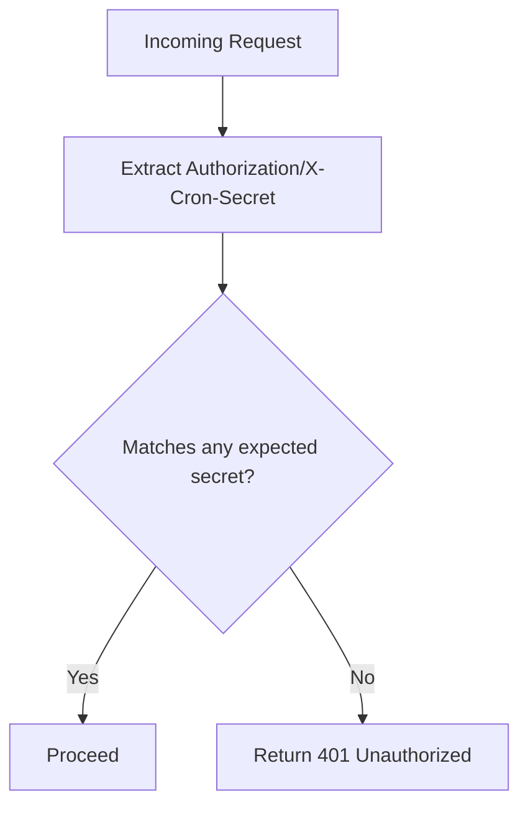

**Diagram sources**
- [cron-auth.ts:35-97](file://src/lib/cron/cron-auth.ts#L35-L97)

**Section sources**
- [cron-auth.ts:1-98](file://src/lib/cron/cron-auth.ts#L1-L98)

### Vacuum and Bloat Maintenance (Cron Route)
- Executes a diagnostic RPC to assess table bloat and logs structured results.
- Filters critical tables (>50% bloat) and moderate bloat (20-50%) with recommended actions.
- Returns summary and alert arrays for downstream consumption.

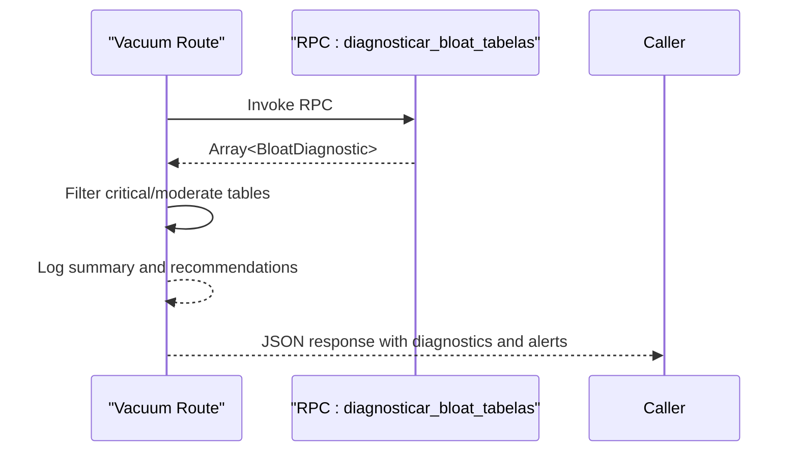

**Diagram sources**
- [vacuum-maintenance/route.ts:35-111](file://src/app/api/cron/vacuum-maintenance/route.ts#L35-L111)

**Section sources**
- [vacuum-maintenance/route.ts:1-133](file://src/app/api/cron/vacuum-maintenance/route.ts#L1-L133)

### Disk IO Budget Alerts (Cron Route)
- Retrieves Disk IO budget metrics via RPC and creates admin notifications when thresholds are exceeded.
- Provides structured response with duration, timestamp, and alert flags.

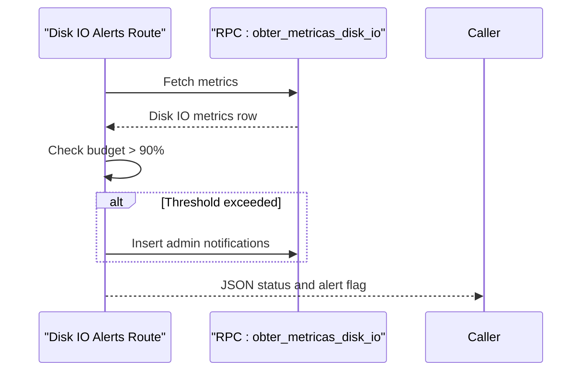

**Diagram sources**
- [alertas-disk-io/route.ts:61-96](file://src/app/api/cron/alertas-disk-io/route.ts#L61-L96)

**Section sources**
- [alertas-disk-io/route.ts:1-115](file://src/app/api/cron/alertas-disk-io/route.ts#L1-L115)

### Disk IO Alerts (Edge Function)
- Attempts to fetch Disk IO metrics via Supabase Management API; falls back to RPC-based heuristics.
- Creates admin notifications and optionally sends emails to super admins.
- Aggregates bloat diagnostics as secondary signal.

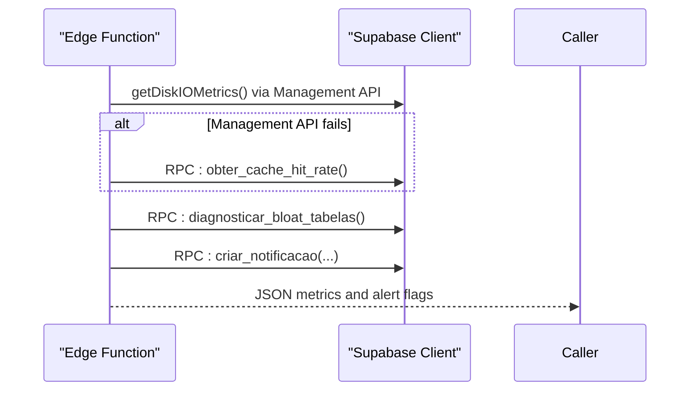

**Diagram sources**
- [supabase/functions/alertas-disk-io/index.ts:223-297](file://supabase/functions/alertas-disk-io/index.ts#L223-L297)

**Section sources**
- [supabase/functions/alertas-disk-io/index.ts:1-342](file://supabase/functions/alertas-disk-io/index.ts#L1-L342)

### Backup and Restore Procedures
- Backup script captures Postgres and Redis dumps, exports .env configs, and archives the result.
- Restore script decompresses and applies Postgres and Redis snapshots, with safe restarts.
- Health check script validates Docker daemon, service health, and resource usage.

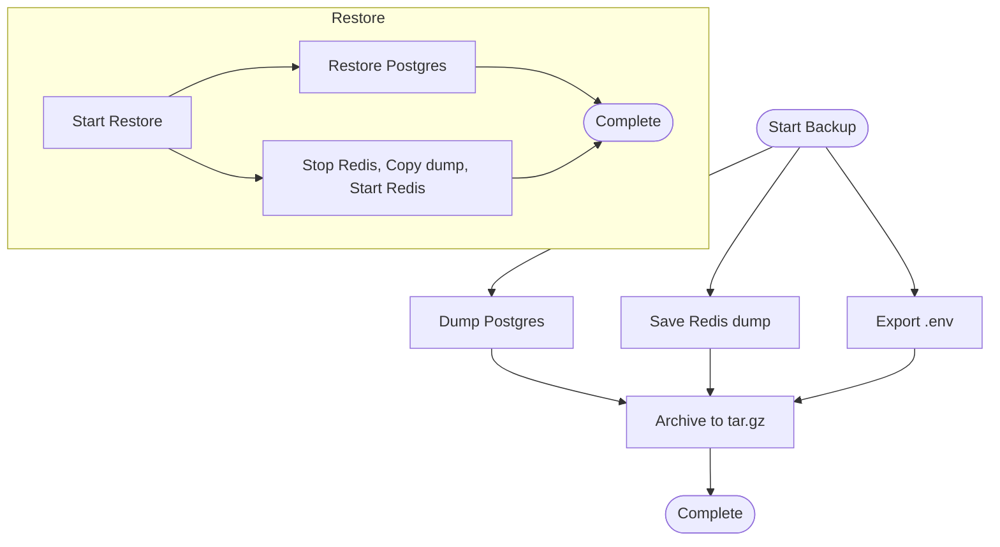

**Diagram sources**
- [scripts/docker/backup.sh:1-43](file://scripts/docker/backup.sh#L1-L43)
- [scripts/docker/restore.sh:1-51](file://scripts/docker/restore.sh#L1-L51)

**Section sources**
- [scripts/docker/backup.sh:1-43](file://scripts/docker/backup.sh#L1-L43)
- [scripts/docker/restore.sh:1-51](file://scripts/docker/restore.sh#L1-L51)
- [scripts/docker/health-check.sh:1-43](file://scripts/docker/health-check.sh#L1-L43)

### Security Audits
- Secrets check runs ESLint and verifies .env files are not committed or misconfigured.
- Plaintext storage scanner detects direct localStorage usage outside secure utilities.

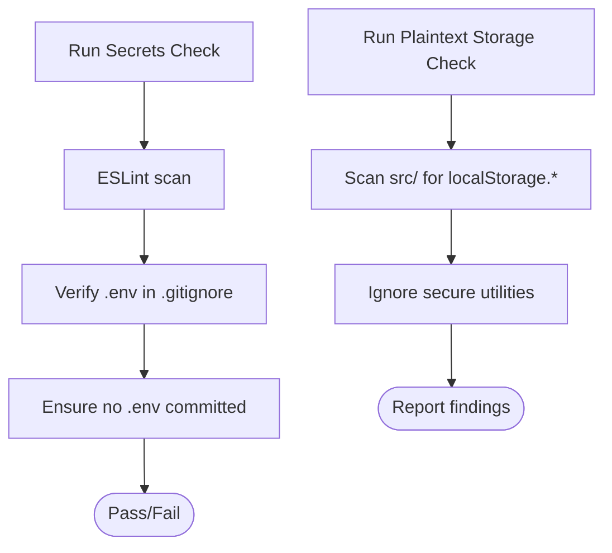

**Diagram sources**
- [scripts/security/check-secrets.js:1-60](file://scripts/security/check-secrets.js#L1-L60)
- [scripts/security/check-plaintext-storage.js:1-74](file://scripts/security/check-plaintext-storage.js#L1-L74)

**Section sources**
- [scripts/security/check-secrets.js:1-60](file://scripts/security/check-secrets.js#L1-L60)
- [scripts/security/check-plaintext-storage.js:1-74](file://scripts/security/check-plaintext-storage.js#L1-L74)

### Database Diagnostics and Population
- Disk I/O diagnostic script collects cache hit rates, slow queries, sequential scans, and runs Supabase CLI inspections for bloat and unused indexes, generating a Markdown report.
- Populate database script ingests captured results into the database with deduplication and error handling.

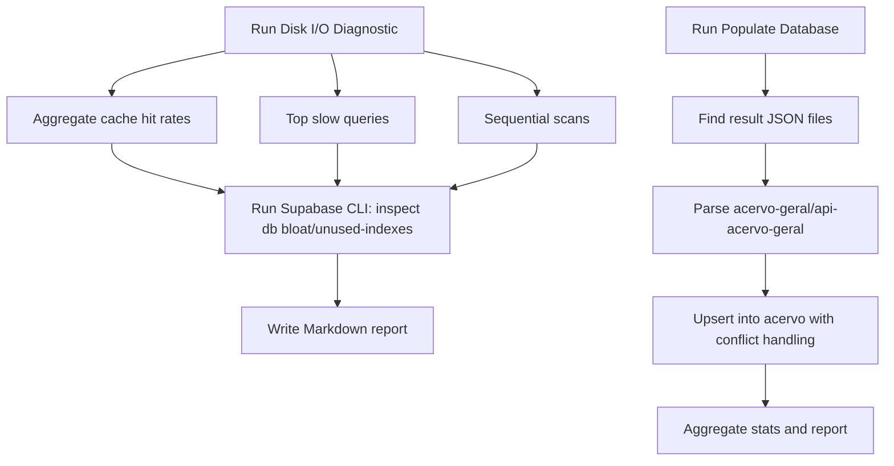

**Diagram sources**
- [scripts/database/diagnostico-disk-io.ts:359-416](file://scripts/database/diagnostico-disk-io.ts#L359-L416)
- [scripts/database/populate-database.ts:242-376](file://scripts/database/populate-database.ts#L242-L376)

**Section sources**
- [scripts/database/diagnostico-disk-io.ts:1-416](file://scripts/database/diagnostico-disk-io.ts#L1-L416)
- [scripts/database/populate-database.ts:1-384](file://scripts/database/populate-database.ts#L1-L384)

### Monitoring Dashboards and Alerting
- Dashboard widgets surface active alerts and severity categories for quick triage.
- Upgrade advisor evaluates Disk IO budget, compute tier, and cache hit rate to recommend upgrades.

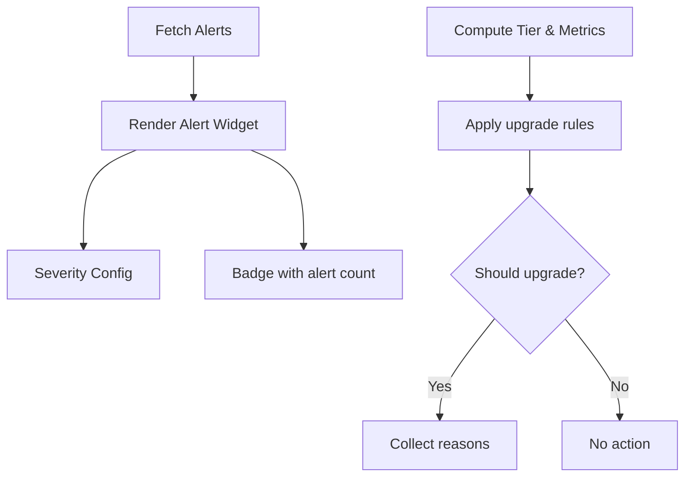

**Diagram sources**
- [src/app/(authenticated)/financeiro/components/dashboard/widgets/alertas-widget.tsx](file://src/app/(authenticated)/financeiro/components/dashboard/widgets/alertas-widget.tsx#L82-L113)
- [src/app/(authenticated)/admin/services/upgrade-advisor.ts](file://src/app/(authenticated)/admin/services/upgrade-advisor.ts#L43-L60)

**Section sources**
- [src/app/(authenticated)/financeiro/components/dashboard/widgets/alertas-widget.tsx](file://src/app/(authenticated)/financeiro/components/dashboard/widgets/alertas-widget.tsx#L82-L113)
- [src/app/(authenticated)/admin/services/upgrade-advisor.ts](file://src/app/(authenticated)/admin/services/upgrade-advisor.ts#L43-L60)

### Recovery and Captura Logs
- Frontend services expose APIs to list recovery logs, fetch analyses, and reprocess elements, enabling targeted troubleshooting of capture pipelines.

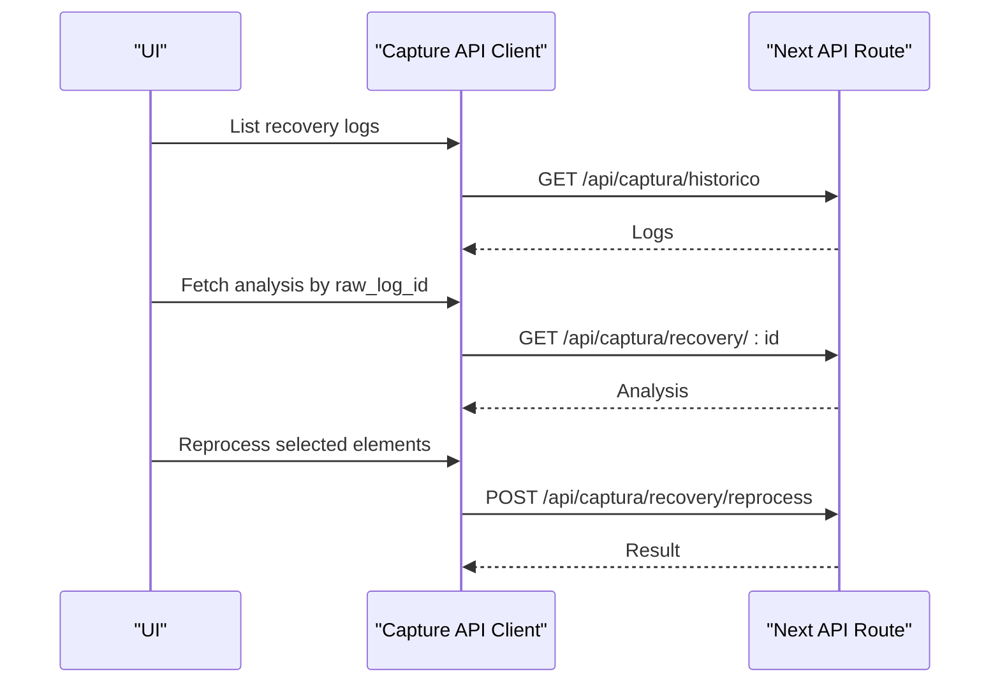

**Diagram sources**
- [src/app/(authenticated)/captura/services/api-client.ts](file://src/app/(authenticated)/captura/services/api-client.ts#L390-L516)

**Section sources**
- [src/app/(authenticated)/captura/services/api-client.ts](file://src/app/(authenticated)/captura/services/api-client.ts#L357-L516)

## Dependency Analysis
- Cron routes depend on Supabase service clients and RPCs for diagnostics and notifications.
- Edge Function depends on Supabase client and environment variables for Management API access.
- Backup/restore scripts depend on Docker and container availability.
- Security checks depend on ESLint and Git state.
- Diagnostics depend on Supabase CLI and Postgres catalog views.

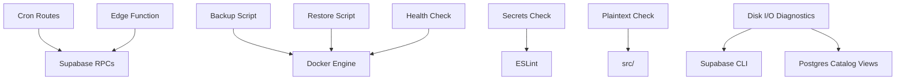

**Diagram sources**
- [vacuum-maintenance/route.ts:16-48](file://src/app/api/cron/vacuum-maintenance/route.ts#L16-L48)
- [alertas-disk-io/route.ts:10-70](file://src/app/api/cron/alertas-disk-io/route.ts#L10-L70)
- [supabase/functions/alertas-disk-io/index.ts:212-242](file://supabase/functions/alertas-disk-io/index.ts#L212-L242)
- [scripts/docker/backup.sh:12-19](file://scripts/docker/backup.sh#L12-L19)
- [scripts/docker/restore.sh:30-45](file://scripts/docker/restore.sh#L30-L45)
- [scripts/docker/health-check.sh:10-40](file://scripts/docker/health-check.sh#L10-L40)
- [scripts/security/check-secrets.js:8-16](file://scripts/security/check-secrets.js#L8-L16)
- [scripts/security/check-plaintext-storage.js:20-53](file://scripts/security/check-plaintext-storage.js#L20-L53)
- [scripts/database/diagnostico-disk-io.ts:223-249](file://scripts/database/diagnostico-disk-io.ts#L223-L249)

**Section sources**
- [vacuum-maintenance/route.ts:1-133](file://src/app/api/cron/vacuum-maintenance/route.ts#L1-L133)
- [alertas-disk-io/route.ts:1-115](file://src/app/api/cron/alertas-disk-io/route.ts#L1-L115)
- [supabase/functions/alertas-disk-io/index.ts:1-342](file://supabase/functions/alertas-disk-io/index.ts#L1-L342)
- [scripts/docker/backup.sh:1-43](file://scripts/docker/backup.sh#L1-L43)
- [scripts/docker/restore.sh:1-51](file://scripts/docker/restore.sh#L1-L51)
- [scripts/docker/health-check.sh:1-43](file://scripts/docker/health-check.sh#L1-L43)
- [scripts/security/check-secrets.js:1-60](file://scripts/security/check-secrets.js#L1-L60)
- [scripts/security/check-plaintext-storage.js:1-74](file://scripts/security/check-plaintext-storage.js#L1-L74)
- [scripts/database/diagnostico-disk-io.ts:1-416](file://scripts/database/diagnostico-disk-io.ts#L1-L416)

## Performance Considerations
- Maintain cache hit rates above 99% to minimize Disk IO; investigate sequential scans and add appropriate indexes.
- Monitor Disk IO budget; consider upgrading compute tier if consistently above 80–90%.
- Schedule VACUUM ANALYZE for moderate bloat and VACUUM FULL for critical cases during low-traffic windows.
- Use the Disk I/O diagnostic script to identify slow queries and unused indexes for targeted optimization.

[No sources needed since this section provides general guidance]

## Troubleshooting Guide
- Unauthorized cron access: Verify CRON_SECRET/VERCEL_CRON_SECRET configuration and correct Authorization header format.
- Disk IO budget alerts: Review admin notifications and Disk IO metrics; consider compute tier upgrade or workload optimization.
- Bloat detection: Use vacuum route output to identify tables requiring VACUUM ANALYZE or VACUUM FULL.
- Backup/restore issues: Confirm Docker containers are running, backup archives exist, and restore steps are executed in order.
- Security violations: Fix ESLint findings, ensure .env files are excluded from commits, and replace direct localStorage usage with secure storage utilities.
- Recovery pipeline problems: Use capture API client to list recovery logs, fetch analyses, and reprocess elements as needed.

**Section sources**
- [cron-auth.ts:35-97](file://src/lib/cron/cron-auth.ts#L35-L97)
- [alertas-disk-io/route.ts:61-96](file://src/app/api/cron/alertas-disk-io/route.ts#L61-L96)
- [vacuum-maintenance/route.ts:56-88](file://src/app/api/cron/vacuum-maintenance/route.ts#L56-L88)
- [scripts/docker/backup.sh:12-19](file://scripts/docker/backup.sh#L12-L19)
- [scripts/docker/restore.sh:30-45](file://scripts/docker/restore.sh#L30-L45)
- [scripts/security/check-secrets.js:8-16](file://scripts/security/check-secrets.js#L8-L16)
- [scripts/security/check-plaintext-storage.js:55-71](file://scripts/security/check-plaintext-storage.js#L55-L71)
- [src/app/(authenticated)/captura/services/api-client.ts](file://src/app/(authenticated)/captura/services/api-client.ts#L390-L516)

## Conclusion
The legal management system incorporates robust monitoring and maintenance practices through structured logging, automated cron jobs, Edge Function alerting, and operational scripts. By following the documented procedures—covering observability, performance tuning, backup/recovery, security audits, and troubleshooting—the platform can maintain reliability, performance, and security across environments.

[No sources needed since this section summarizes without analyzing specific files]

## Appendices

### Maintenance Schedules
- Daily: Vacuum and analyze routine; review Disk IO budget and cache hit rate.
- Weekly: Full Disk I/O diagnostic run; review slow queries and sequential scans.
- Monthly: Upgrade assessment based on compute tier and metrics; reindex as needed.
- Quarterly: Backup verification and disaster recovery drills.

[No sources needed since this section provides general guidance]

### Update Procedures
- Apply database migrations via Supabase CLI and verify schema exports.
- Validate cron routes and Edge Function configurations after updates.
- Re-run security checks and diagnostics post-update.

**Section sources**
- [supabase/COMMANDS_REFERENCE.sh:56-251](file://supabase/COMMANDS_REFERENCE.sh#L56-L251)

### Incident Response Protocols
- Critical Disk IO (>90%): Pause non-essential writes, scale compute tier, and investigate slow queries.
- Critical bloat (>50%): Perform VACUUM FULL during maintenance window; monitor recovery.
- Unauthorized access attempts: Rotate secrets, audit headers, and review logs.
- Backup failure: Validate Docker connectivity, retry restore, and confirm data integrity.

**Section sources**
- [alertas-disk-io/route.ts:78-85](file://src/app/api/cron/alertas-disk-io/route.ts#L78-L85)
- [vacuum-maintenance/route.ts:66-88](file://src/app/api/cron/vacuum-maintenance/route.ts#L66-L88)
- [cron-auth.ts:70-94](file://src/lib/cron/cron-auth.ts#L70-L94)