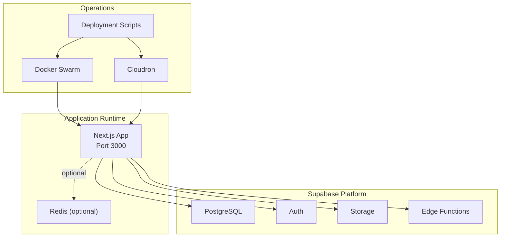
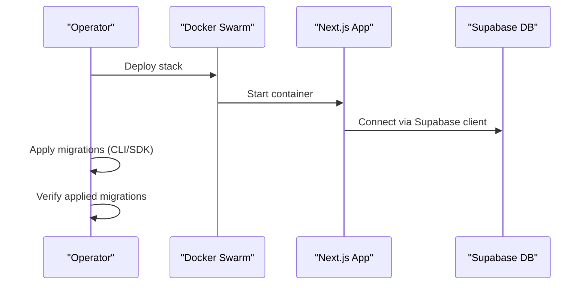
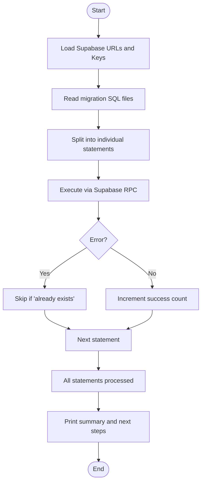
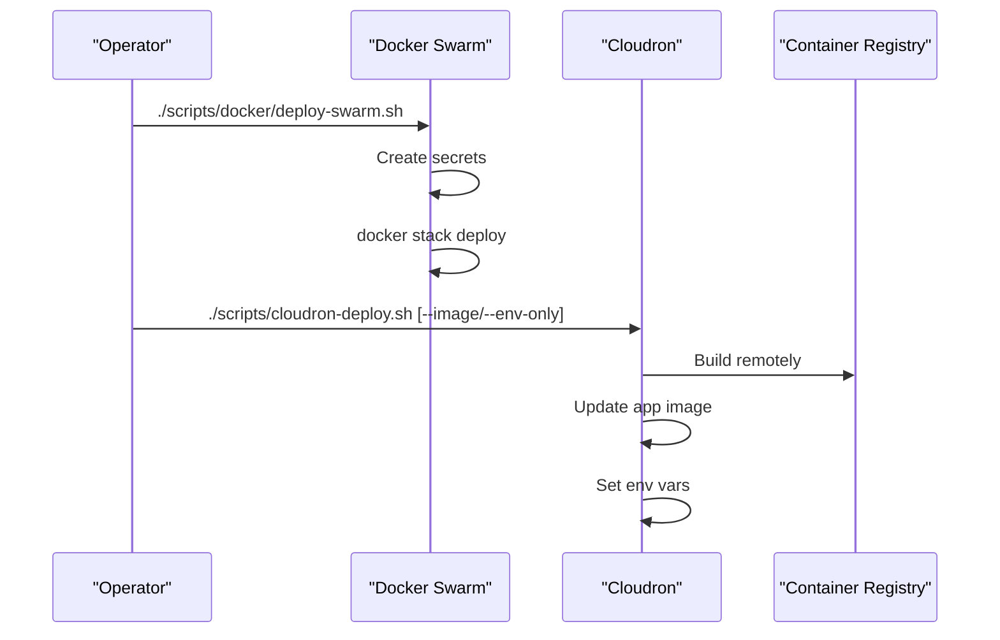
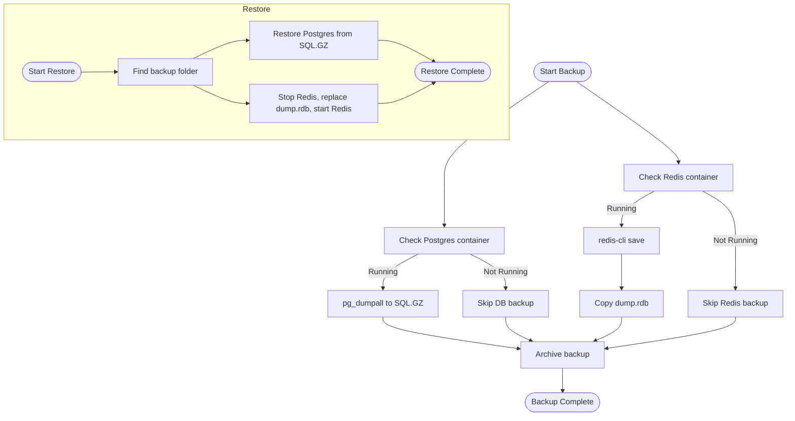
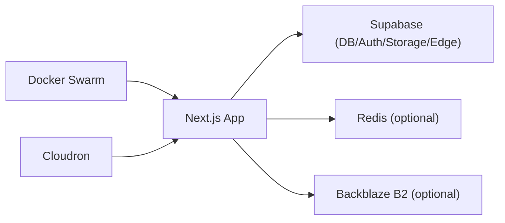

# Production Deployment

<cite>
**Referenced Files in This Document**
- [supabase/config.toml](file://supabase/config.toml)
- [package.json](file://package.json)
- [docker-compose.yml](file://docker-compose.yml)
- [scripts/docker/prod.sh](file://scripts/docker/prod.sh)
- [scripts/docker/deploy-swarm.sh](file://scripts/docker/deploy-swarm.sh)
- [scripts/docker/backup.sh](file://scripts/docker/backup.sh)
- [scripts/docker/restore.sh](file://scripts/docker/restore.sh)
- [scripts/docker/test-backup-restore.sh](file://scripts/docker/test-backup-restore.sh)
- [scripts/database/README.md](file://scripts/database/README.md)
- [scripts/database/apply-migrations-via-supabase-sdk.ts](file://scripts/database/apply-migrations-via-supabase-sdk.ts)
- [scripts/database/check-applied-migrations.ts](file://scripts/database/check-applied-migrations.ts)
- [scripts/cloudron-deploy.sh](file://scripts/cloudron-deploy.sh)
</cite>

## Table of Contents
1. [Introduction](#introduction)
2. [Project Structure](#project-structure)
3. [Core Components](#core-components)
4. [Architecture Overview](#architecture-overview)
5. [Detailed Component Analysis](#detailed-component-analysis)
6. [Dependency Analysis](#dependency-analysis)
7. [Performance Considerations](#performance-considerations)
8. [Troubleshooting Guide](#troubleshooting-guide)
9. [Conclusion](#conclusion)
10. [Appendices](#appendices)

## Introduction
This document provides comprehensive production deployment guidance for the legal management system. It covers infrastructure provisioning, environment configuration, Supabase deployment and database migrations, secrets management, operational procedures, monitoring and logging, backup and disaster recovery, scaling and high availability, and maintenance practices. The content is grounded in the repository’s configuration and scripts to ensure accurate, actionable steps for production readiness.

## Project Structure
The deployment pipeline integrates:
- Frontend application built with Next.js and containerized via Docker
- Supabase backend (PostgreSQL, Auth, Storage, Edge Functions)
- Optional Redis caching and external storage (Backblaze B2)
- Orchestration via Docker Swarm and Cloudron deployments
- Automated database migration and verification scripts

**Diagram sources**
- [docker-compose.yml:12-82](file://docker-compose.yml#L12-L82)
- [supabase/config.toml:7-385](file://supabase/config.toml#L7-L385)
- [scripts/docker/deploy-swarm.sh:1-45](file://scripts/docker/deploy-swarm.sh#L1-L45)
- [scripts/cloudron-deploy.sh:1-490](file://scripts/cloudron-deploy.sh#L1-L490)

**Section sources**
- [docker-compose.yml:1-87](file://docker-compose.yml#L1-L87)
- [supabase/config.toml:1-385](file://supabase/config.toml#L1-L385)
- [package.json:125-133](file://package.json#L125-L133)

## Core Components
- Application container: Next.js app exposing API routes and serving the UI on port 3000
- Supabase integration: configured via environment variables for URL, publishable/anon keys, and service key
- Optional caches and storage: Redis and Backblaze B2 via environment variables
- Operational orchestration: Docker Swarm and Cloudron deployment scripts
- Database lifecycle: migration application and verification scripts

Key environment variables for production:
- Supabase: NEXT_PUBLIC_SUPABASE_URL, NEXT_PUBLIC_SUPABASE_PUBLISHABLE_OR_ANON_KEY, SUPABASE_SECRET_KEY
- System API: SERVICE_API_KEY, CRON_SECRET
- Redis: ENABLE_REDIS_CACHE, REDIS_URL, REDIS_PASSWORD, REDIS_CACHE_TTL
- Storage: STORAGE_PROVIDER, B2_ENDPOINT, B2_REGION, B2_BUCKET, B2_KEY_ID, B2_APPLICATION_KEY
- AI/Embeddings: OPENAI_API_KEY, OPENAI_EMBEDDING_MODEL, AI_EMBEDDING_PROVIDER, AI_GATEWAY_API_KEY, GOOGLE_API_KEY, ENABLE_AI_INDEXING
- Security: RATE_LIMIT_FAIL_MODE, IP_BLOCKING_ENABLED, CSP_REPORT_ONLY
- Debugging: DEBUG_SUPABASE, LOG_LEVEL

**Section sources**
- [docker-compose.yml:25-75](file://docker-compose.yml#L25-L75)
- [package.json:125-133](file://package.json#L125-L133)

## Architecture Overview
The production architecture centers on a containerized Next.js application communicating with Supabase. Docker Swarm orchestrates services, while Cloudron automates remote builds and updates. Database migrations are managed via Supabase CLI and custom scripts.

**Diagram sources**
- [scripts/docker/deploy-swarm.sh:30-42](file://scripts/docker/deploy-swarm.sh#L30-L42)
- [scripts/database/apply-migrations-via-supabase-sdk.ts:118-155](file://scripts/database/apply-migrations-via-supabase-sdk.ts#L118-L155)
- [scripts/database/check-applied-migrations.ts:150-208](file://scripts/database/check-applied-migrations.ts#L150-L208)

## Detailed Component Analysis

### Supabase Deployment and Configuration
Supabase is configured via a dedicated configuration file and environment variables. The configuration defines API ports, schemas, database settings, authentication, storage, and analytics.

- API and database ports are set for local development; adjust for production networking
- Database major version aligns with remote Supabase
- Auth settings include site URL, JWT expiry, and rate limits
- Storage supports S3-compatible protocol and file size limits
- Edge runtime and experimental S3-backed storage are configurable

Operational notes:
- Environment variables for Supabase credentials are injected at runtime
- Auth providers and third-party integrations are configured under [auth] and related sections
- Analytics and experimental S3 settings are available for advanced setups

**Section sources**
- [supabase/config.toml:7-385](file://supabase/config.toml#L7-L385)
- [docker-compose.yml:32-34](file://docker-compose.yml#L32-L34)

### Database Migrations and Verification
Two complementary scripts manage database migrations:

- Migration application via Supabase SDK:
  - Reads migration SQL files and executes statements against the Supabase SQL RPC endpoint
  - Handles errors per statement and skips benign “already exists” conditions
  - Provides a summary and guidance for manual remediation if needed

- Applied migrations checker:
  - Uses Supabase client to verify presence of tables/columns/functions
  - Produces a structured report saved to migration-status.json
  - Treats missing checks conservatively as applied

**Diagram sources**
- [scripts/database/apply-migrations-via-supabase-sdk.ts:64-116](file://scripts/database/apply-migrations-via-supabase-sdk.ts#L64-L116)

**Section sources**
- [scripts/database/apply-migrations-via-supabase-sdk.ts:1-162](file://scripts/database/apply-migrations-via-supabase-sdk.ts#L1-L162)
- [scripts/database/check-applied-migrations.ts:1-223](file://scripts/database/check-applied-migrations.ts#L1-L223)

### Infrastructure Provisioning and Orchestration
Docker Swarm deployment:
- Initializes Swarm if not active
- Creates secrets for database and Redis passwords
- Deploys stack from a production compose file
- Provides status and logs commands

Cloudron deployment:
- Automates remote build via a dedicated build service
- Updates the application image and sets runtime environment variables
- Supports dry-run, rollback via explicit image tag, and CI/CD automation

**Diagram sources**
- [scripts/docker/deploy-swarm.sh:9-42](file://scripts/docker/deploy-swarm.sh#L9-L42)
- [scripts/cloudron-deploy.sh:386-467](file://scripts/cloudron-deploy.sh#L386-L467)

**Section sources**
- [scripts/docker/deploy-swarm.sh:1-45](file://scripts/docker/deploy-swarm.sh#L1-L45)
- [scripts/docker/prod.sh:9-40](file://scripts/docker/prod.sh#L9-L40)
- [scripts/cloudron-deploy.sh:1-490](file://scripts/cloudron-deploy.sh#L1-L490)

### Environment Variables and Secrets Management
- Supabase credentials and keys are passed via environment variables
- System API keys and cron secrets are required for internal operations
- Redis and storage providers are configured via environment variables
- Cloudron automatically maps addon variables (Redis and mail) to runtime environment

Best practices:
- Store sensitive values as Docker secrets or Cloudron env vars
- Avoid committing secrets to version control
- Use distinct keys for different environments

**Section sources**
- [docker-compose.yml:25-75](file://docker-compose.yml#L25-L75)
- [scripts/cloudron-deploy.sh:49-56](file://scripts/cloudron-deploy.sh#L49-L56)

### Monitoring and Log Aggregation
- Health checks are defined for the Next.js service
- Logs can be streamed from Docker services
- For production, integrate container logs to centralized logging systems (e.g., ELK, Loki, Cloudron logs)

**Section sources**
- [docker-compose.yml:77-82](file://docker-compose.yml#L77-L82)
- [scripts/docker/prod.sh:26-32](file://scripts/docker/prod.sh#L26-L32)

### Backup and Disaster Recovery
Backup script:
- Backs up PostgreSQL using pg_dumpall and compresses output
- Backs up Redis RDB snapshot if the service is running
- Archives environment backups and creates a compressed archive

Restore script:
- Extracts backup archive and restores PostgreSQL and Redis from dumps
- Stops Redis, replaces RDB, and restarts the service

Test script:
- Executes backup and restore cycle and verifies Postgres readiness

**Diagram sources**
- [scripts/docker/backup.sh:12-42](file://scripts/docker/backup.sh#L12-L42)
- [scripts/docker/restore.sh:30-45](file://scripts/docker/restore.sh#L30-L45)

**Section sources**
- [scripts/docker/backup.sh:1-43](file://scripts/docker/backup.sh#L1-L43)
- [scripts/docker/restore.sh:1-51](file://scripts/docker/restore.sh#L1-L51)
- [scripts/docker/test-backup-restore.sh:1-35](file://scripts/docker/test-backup-restore.sh#L1-L35)

### Scaling and High Availability
- Docker Swarm scaling: scale services by updating replica counts
- Horizontal scaling of the Next.js service is supported by Swarm
- For high availability, deploy multiple replicas behind a load balancer and enable sticky sessions if required by the application

**Section sources**
- [scripts/docker/prod.sh:13-19](file://scripts/docker/prod.sh#L13-L19)

### Maintenance Procedures
- Regularly run the disk I/O diagnostic script to monitor database performance
- Periodically verify applied migrations and reconcile discrepancies
- Review Supabase configuration for schema and policy updates

**Section sources**
- [scripts/database/README.md:1-37](file://scripts/database/README.md#L1-L37)
- [scripts/database/check-applied-migrations.ts:150-208](file://scripts/database/check-applied-migrations.ts#L150-L208)

## Dependency Analysis
The deployment relies on:
- Docker Compose for local development and Swarm for production
- Supabase for database, auth, storage, and edge functions
- Cloudron for remote builds and updates
- Optional Redis and Backblaze B2 for caching and storage

**Diagram sources**
- [docker-compose.yml:12-82](file://docker-compose.yml#L12-L82)
- [supabase/config.toml:7-385](file://supabase/config.toml#L7-L385)
- [scripts/cloudron-deploy.sh:386-467](file://scripts/cloudron-deploy.sh#L386-L467)

**Section sources**
- [docker-compose.yml:12-82](file://docker-compose.yml#L12-L82)
- [supabase/config.toml:7-385](file://supabase/config.toml#L7-L385)
- [scripts/cloudron-deploy.sh:386-467](file://scripts/cloudron-deploy.sh#L386-L467)

## Performance Considerations
- Use Redis for caching frequently accessed data to reduce database load
- Monitor disk I/O and query performance using the provided diagnostic script
- Keep Supabase configuration aligned with workload patterns (indexes, RLS policies, vacuum tuning)
- Scale horizontally by increasing replicas and ensuring proper load distribution

[No sources needed since this section provides general guidance]

## Troubleshooting Guide
Common issues and remedies:
- Migration failures: Use the migration application script to apply pending changes and the verification script to confirm outcomes
- Backup/restore problems: Validate container health and ensure dump files are present before restoration
- Cloudron build failures: Use the local deploy script as an alternative or adjust memory settings
- Swarm service issues: Inspect service logs and verify secrets and environment variables

**Section sources**
- [scripts/database/apply-migrations-via-supabase-sdk.ts:118-155](file://scripts/database/apply-migrations-via-supabase-sdk.ts#L118-L155)
- [scripts/database/check-applied-migrations.ts:150-208](file://scripts/database/check-applied-migrations.ts#L150-L208)
- [scripts/docker/restore.sh:30-45](file://scripts/docker/restore.sh#L30-L45)
- [scripts/cloudron-deploy.sh:108-113](file://scripts/cloudron-deploy.sh#L108-L113)
- [scripts/docker/prod.sh:26-32](file://scripts/docker/prod.sh#L26-L32)

## Conclusion
This guide consolidates production deployment practices for the legal management system, covering Supabase configuration, migration management, infrastructure orchestration, secrets handling, monitoring, backups, scaling, and maintenance. By following the documented procedures and leveraging the provided scripts, operators can achieve reliable, observable, and resilient operations.

[No sources needed since this section summarizes without analyzing specific files]

## Appendices

### Practical Examples
- Deploy with Docker Swarm: run the Swarm deploy script to initialize the cluster, create secrets, and deploy the stack
- Rollback with Cloudron: use the Cloudron deploy script with an explicit image tag to roll back to a previous version
- Apply migrations: execute the migration application script to run pending SQL files and review the summary
- Verify migrations: run the migration verification script to produce a structured report and decide next steps
- Backup and restore: use the backup script to create archives and the restore script to recover from backups

**Section sources**
- [scripts/docker/deploy-swarm.sh:30-42](file://scripts/docker/deploy-swarm.sh#L30-L42)
- [scripts/cloudron-deploy.sh:108-113](file://scripts/cloudron-deploy.sh#L108-L113)
- [scripts/database/apply-migrations-via-supabase-sdk.ts:118-155](file://scripts/database/apply-migrations-via-supabase-sdk.ts#L118-L155)
- [scripts/database/check-applied-migrations.ts:150-208](file://scripts/database/check-applied-migrations.ts#L150-L208)
- [scripts/docker/backup.sh:12-42](file://scripts/docker/backup.sh#L12-L42)
- [scripts/docker/restore.sh:30-45](file://scripts/docker/restore.sh#L30-L45)