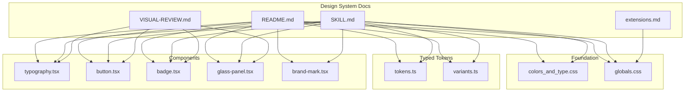
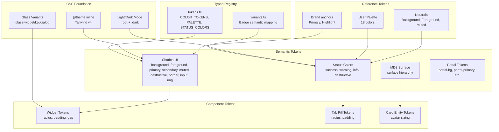
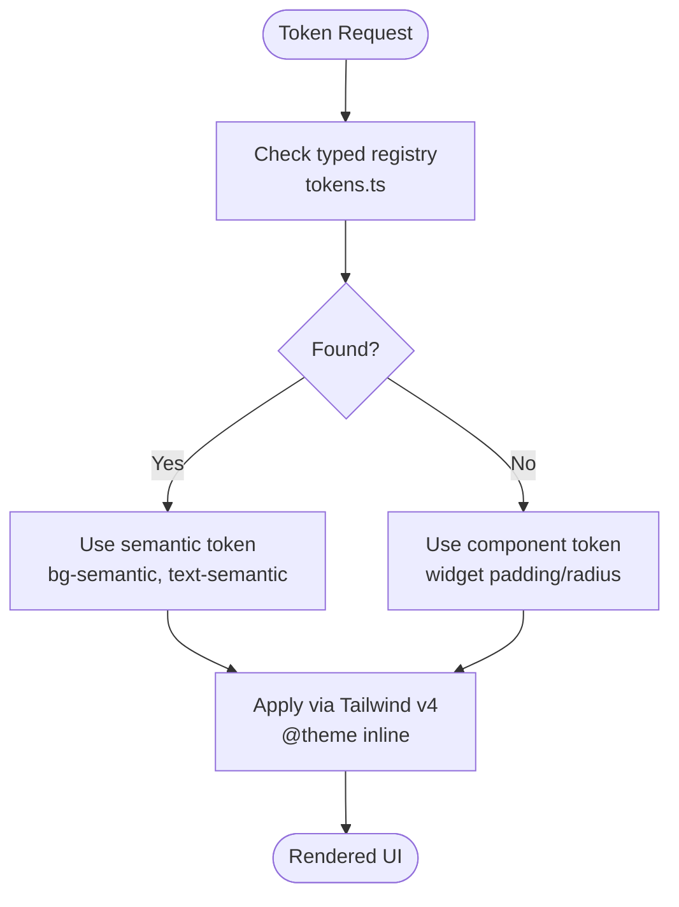
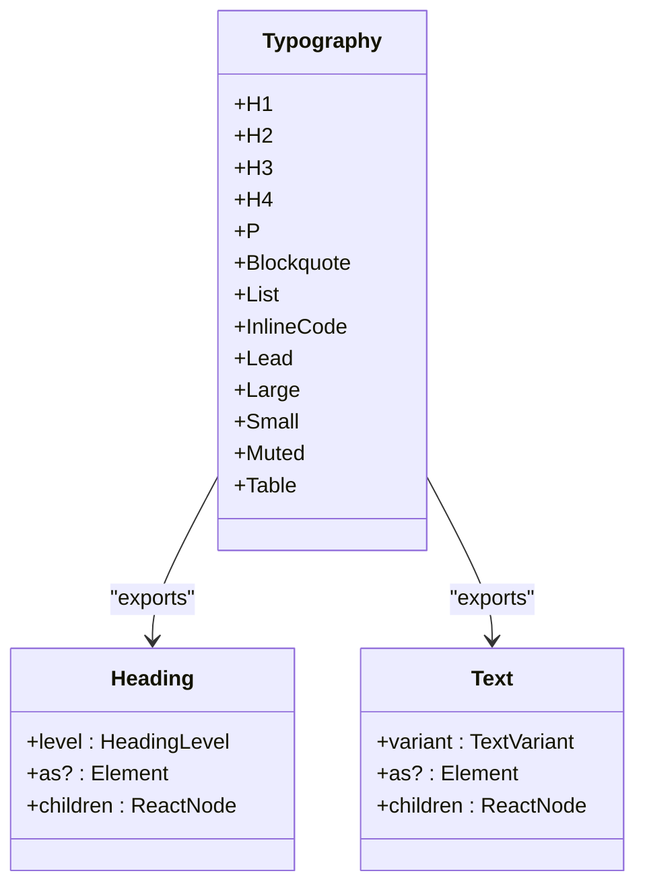
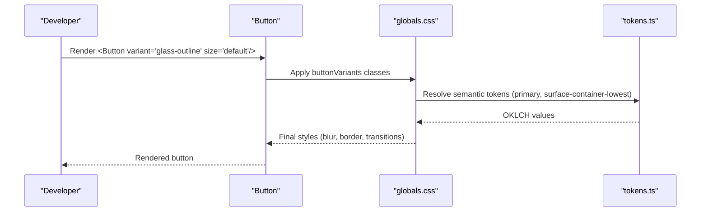
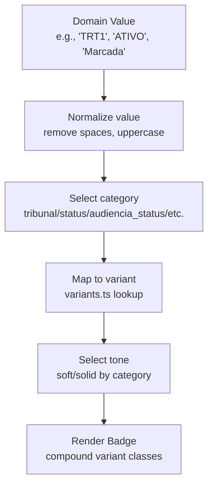
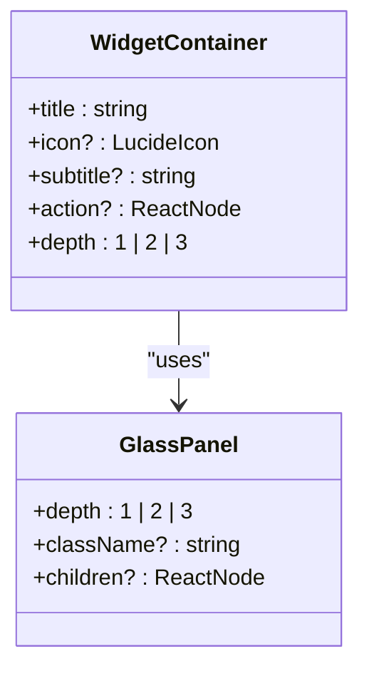
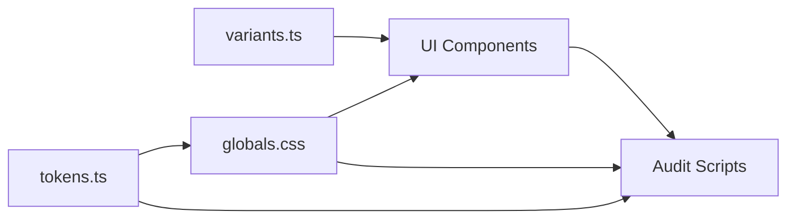

# Design System

<cite>
**Referenced Files in This Document**
- [README.md](file://design-system/README.md)
- [SKILL.md](file://design-system/SKILL.md)
- [VISUAL-REVIEW.md](file://design-system/VISUAL-REVIEW.md)
- [extensions.md](file://design-system/extensions.md)
- [colors_and_type.css](file://design-system/colors_and_type.css)
- [globals.css](file://design-system/src/app/globals.css)
- [tokens.ts](file://design-system/src/lib/design-system/tokens.ts)
- [variants.ts](file://design-system/src/lib/design-system/variants.ts)
- [typography.tsx](file://design-system/src/components/ui/typography.tsx)
- [button.tsx](file://design-system/src/components/ui/button.tsx)
- [badge.tsx](file://design-system/src/components/ui/badge.tsx)
- [glass-panel.tsx](file://design-system/src/components/shared/glass-panel.tsx)
- [brand-mark.tsx](file://design-system/src/components/shared/brand-mark.tsx)
</cite>

## Table of Contents
1. [Introduction](#introduction)
2. [Project Structure](#project-structure)
3. [Core Components](#core-components)
4. [Architecture Overview](#architecture-overview)
5. [Detailed Component Analysis](#detailed-component-analysis)
6. [Dependency Analysis](#dependency-analysis)
7. [Performance Considerations](#performance-considerations)
8. [Troubleshooting Guide](#troubleshooting-guide)
9. [Conclusion](#conclusion)
10. [Appendices](#appendices)

## Introduction
This document describes the ZattarOS Design System, a comprehensive visual and interaction framework for the legal management platform. It covers design tokens, component library, visual guidelines, theming, and Tailwind CSS 4 integration. It also documents shadcn/ui usage patterns, custom component development, design token hierarchy, color systems, typography scales, spacing guidelines, component composition patterns, accessibility compliance, responsive design principles, and practical examples for maintainability and design-to-development handoff.

## Project Structure
The design system is organized around:
- Canonical specification and guidelines in the design-system README and SKILL
- Foundation tokens and CSS in globals.css and colors_and_type.css
- Typed token registry and semantic mapping in tokens.ts and variants.ts
- UI primitives and shared components in src/components
- Preview assets and UI kits for prototyping in design-system/preview and design-system/ui_kits

**Diagram sources**
- [README.md:1-341](file://design-system/README.md#L1-L341)
- [SKILL.md:1-45](file://design-system/SKILL.md#L1-L45)
- [VISUAL-REVIEW.md:1-203](file://design-system/VISUAL-REVIEW.md#L1-L203)
- [extensions.md:1-377](file://design-system/extensions.md#L1-L377)
- [colors_and_type.css:1-474](file://design-system/colors_and_type.css#L1-L474)
- [globals.css:1-800](file://design-system/src/app/globals.css#L1-L800)
- [tokens.ts:1-800](file://design-system/src/lib/design-system/tokens.ts#L1-L800)
- [variants.ts:1-800](file://design-system/src/lib/design-system/variants.ts#L1-L800)
- [typography.tsx:1-193](file://design-system/src/components/ui/typography.tsx#L1-L193)
- [button.tsx:1-71](file://design-system/src/components/ui/button.tsx#L1-L71)
- [badge.tsx:1-141](file://design-system/src/components/ui/badge.tsx#L1-L141)
- [glass-panel.tsx:1-103](file://design-system/src/components/shared/glass-panel.tsx#L1-L103)
- [brand-mark.tsx:1-153](file://design-system/src/components/shared/brand-mark.tsx#L1-L153)

**Section sources**
- [README.md:281-324](file://design-system/README.md#L281-L324)
- [SKILL.md:11-27](file://design-system/SKILL.md#L11-L27)

## Core Components
This section outlines the foundational elements of the design system.

- Design tokens hierarchy and enforcement
  - Reference tokens (OKLCH anchors, brand scales)
  - Semantic tokens (shadcn-compatible, MD3 surface hierarchy)
  - Component tokens (widget, tab pill, card entity, etc.)
  - Enforcement via audit scripts and ESLint rules

- Color system
  - Primary brand anchor at hue 281° (Zattar Purple)
  - Action accent at hue 45° (orange)
  - Status colors (success, warning, info, destructive)
  - Sidebar always dark in both themes
  - User-selectable palette (18 colors) for tags, labels, events
  - Event colors mapped to palette slots for legal domain semantics

- Typography system
  - Inter for body/sans, Montserrat for headings/display, Manrope for special headlines, Geist Mono for numeric/monospace
  - Semantic typography classes (.text-page-title, .text-kpi-value, .text-meta-label, etc.)
  - Font-size grid aligned to 4px spacing units

- Spacing and layout
  - Grid-based spacing (4px steps) with semantic groups (page, section, card, dialog, form, table)
  - Density axis controlled via data-density attribute cascading through shells
  - Page max-width and detail panel fixed width

- Glass system
  - Depth variants: glass-widget, glass-kpi, glass-card, glass-dialog, glass-dropdown
  - Depth 3 for maximum emphasis with backdrop blur and primary tint border
  - Ambient shadow utility and surface tokens

- Component primitives
  - Typography components with typed levels and variants
  - Button variants (default, destructive, outline, glass-outline, marketing-outline, secondary, ghost, link) and sizes
  - Badge variants (default, secondary, destructive, outline, success, info, warning, neutral, accent) with soft/solid tones
  - GlassPanel with depth 1–3 and WidgetContainer header pattern
  - BrandMark with auto/light/dark variants and collapsible behavior

**Section sources**
- [globals.css:23-228](file://design-system/src/app/globals.css#L23-L228)
- [colors_and_type.css:12-166](file://design-system/colors_and_type.css#L12-L166)
- [tokens.ts:30-800](file://design-system/src/lib/design-system/tokens.ts#L30-L800)
- [typography.tsx:123-193](file://design-system/src/components/ui/typography.tsx#L123-L193)
- [button.tsx:7-46](file://design-system/src/components/ui/button.tsx#L7-L46)
- [badge.tsx:9-121](file://design-system/src/components/ui/badge.tsx#L9-L121)
- [glass-panel.tsx:28-64](file://design-system/src/components/shared/glass-panel.tsx#L28-L64)
- [brand-mark.tsx:38-76](file://design-system/src/components/shared/brand-mark.tsx#L38-L76)

## Architecture Overview
The design system architecture follows a strict token hierarchy and enforces usage patterns through code and CSS.

**Diagram sources**
- [globals.css:23-228](file://design-system/src/app/globals.css#L23-L228)
- [tokens.ts:64-200](file://design-system/src/lib/design-system/tokens.ts#L64-L200)
- [variants.ts:19-113](file://design-system/src/lib/design-system/variants.ts#L19-L113)
- [colors_and_type.css:12-166](file://design-system/colors_and_type.css#L12-L166)

**Section sources**
- [extensions.md:1-377](file://design-system/extensions.md#L1-L377)
- [tokens.ts:781-800](file://design-system/src/lib/design-system/tokens.ts#L781-L800)

## Detailed Component Analysis

### Design Tokens and Theming
- Token coverage and audit
  - 226 tokens documented in extensions.md
  - Audit scripts enforce usage of semantic tokens and prevent raw CSS values
  - ESLint rules prevent manual typography and spacing overrides

- Tailwind CSS 4 integration
  - @theme inline defines token mapping to Tailwind utilities
  - data-density attribute cascades density tokens across shells
  - Theme presets and runtime radius adjustments supported

- Color system
  - Primary brand token drives CTAs and focus states
  - Status tokens consistently map to semantic variants
  - User palette supports dynamic tagging and labeling

- Typography and spacing
  - Semantic typography classes enforce consistent scale and weights
  - Grid-based spacing ensures proportional layouts across breakpoints

**Diagram sources**
- [tokens.ts:64-120](file://design-system/src/lib/design-system/tokens.ts#L64-L120)
- [globals.css:23-228](file://design-system/src/app/globals.css#L23-L228)

**Section sources**
- [extensions.md:1-377](file://design-system/extensions.md#L1-L377)
- [tokens.ts:328-437](file://design-system/src/lib/design-system/tokens.ts#L328-L437)
- [globals.css:23-228](file://design-system/src/app/globals.css#L23-L228)

### Typography Components
- Heading and Text components
  - Typed levels and variants ensure consistent hierarchy and style
  - Polymorphic support allows custom element tags
  - Marketing variants reserved for website pages

**Diagram sources**
- [typography.tsx:100-193](file://design-system/src/components/ui/typography.tsx#L100-L193)

**Section sources**
- [typography.tsx:123-193](file://design-system/src/components/ui/typography.tsx#L123-L193)
- [colors_and_type.css:216-370](file://design-system/colors_and_type.css#L216-L370)

### Button Component
- Variants and sizes
  - Default, destructive, outline, glass-outline, marketing-outline, secondary, ghost, link
  - Sizes: default, sm, lg, icon, icon-sm, icon-lg
  - Consistent height and focus states using ring tokens

- Accessibility and interaction
  - Focus-visible rings and aria-invalid handling
  - SVG sizing normalization

**Diagram sources**
- [button.tsx:7-46](file://design-system/src/components/ui/button.tsx#L7-L46)
- [globals.css:23-228](file://design-system/src/app/globals.css#L23-L228)
- [tokens.ts:781-800](file://design-system/src/lib/design-system/tokens.ts#L781-L800)

**Section sources**
- [button.tsx:1-71](file://design-system/src/components/ui/button.tsx#L1-L71)
- [tokens.ts:781-800](file://design-system/src/lib/design-system/tokens.ts#L781-L800)

### Badge Component and Semantic Mapping
- Badge variants and tones
  - Variants: default, secondary, destructive, outline, success, info, warning, neutral, accent
  - Tones: soft (low intensity) and solid (high intensity)
  - Compound variants derive from semantic tokens

- Semantic mapping
  - variants.ts maps domain values (tribunal, status, audiencia_status, expediente_tipo, etc.) to badge variants
  - Normalization handles spaces and case differences

**Diagram sources**
- [variants.ts:750-800](file://design-system/src/lib/design-system/variants.ts#L750-L800)
- [badge.tsx:9-121](file://design-system/src/components/ui/badge.tsx#L9-L121)

**Section sources**
- [variants.ts:19-113](file://design-system/src/lib/design-system/variants.ts#L19-L113)
- [variants.ts:750-800](file://design-system/src/lib/design-system/variants.ts#L750-L800)
- [badge.tsx:1-141](file://design-system/src/components/ui/badge.tsx#L1-L141)

### GlassPanel and Widget Containers
- GlassPanel depth system
  - Depth 1: glass-widget (container)
  - Depth 2: glass-kpi (KPIs)
  - Depth 3: primary tint with backdrop blur (emphasis)
- WidgetContainer
  - Header with icon, title, subtitle, and action slot
  - Built on GlassPanel with consistent padding and typography

**Diagram sources**
- [glass-panel.tsx:28-103](file://design-system/src/components/shared/glass-panel.tsx#L28-L103)

**Section sources**
- [glass-panel.tsx:1-103](file://design-system/src/components/shared/glass-panel.tsx#L1-L103)
- [tokens.ts:567-590](file://design-system/src/lib/design-system/tokens.ts#L567-L590)

### BrandMark Component
- Auto/light/dark variants
- Collapsible behavior for sidebar icon mode
- Responsive sizing and optional link wrapping

**Section sources**
- [brand-mark.tsx:1-153](file://design-system/src/components/shared/brand-mark.tsx#L1-L153)

## Dependency Analysis
The design system maintains low coupling and high cohesion:
- tokens.ts and variants.ts centralize semantic mappings and token definitions
- globals.css and colors_and_type.css provide the canonical CSS foundation
- Components consume typed tokens and semantic classes, avoiding raw values
- Audit and ESLint rules enforce adherence to the design system

**Diagram sources**
- [tokens.ts:1-800](file://design-system/src/lib/design-system/tokens.ts#L1-L800)
- [variants.ts:1-800](file://design-system/src/lib/design-system/variants.ts#L1-L800)
- [globals.css:1-800](file://design-system/src/app/globals.css#L1-L800)

**Section sources**
- [extensions.md:1-377](file://design-system/extensions.md#L1-L377)
- [VISUAL-REVIEW.md:1-203](file://design-system/VISUAL-REVIEW.md#L1-L203)

## Performance Considerations
- CSS variables and Tailwind v4 reduce style recalculation and enable efficient theme switching
- Glass effects rely on backdrop-filter; floating overlays disable backdrop-filter to preserve readability
- Minimal JavaScript in components reduces hydration overhead; focus on semantic tokens and CSS
- Grid-based spacing and consistent typography minimize layout thrashing

## Troubleshooting Guide
Common issues and resolutions:
- Using raw OKLCH values instead of semantic tokens
  - Resolution: Replace with tokens.ts COLOR_TOKENS keys or component tokens
- Violating typography and spacing rules
  - Resolution: Use Heading/Text components and SPACING/SPACING_SEMANTIC tokens
- Inconsistent badge variants
  - Resolution: Use getSemanticBadgeVariant from variants.ts and ensure normalized values
- Glass panel readability problems
  - Resolution: Use appropriate depth (1–3) and avoid backdrop-filter in floating overlays
- Visual regression after bulk token migration
  - Resolution: Use VISUAL-REVIEW checklist and harness pages to compare before/after

**Section sources**
- [VISUAL-REVIEW.md:1-203](file://design-system/VISUAL-REVIEW.md#L1-L203)
- [SKILL.md:28-37](file://design-system/SKILL.md#L28-L37)

## Conclusion
The ZattarOS Design System establishes a robust, auditable, and scalable foundation for building consistent, accessible, and visually coherent legal management interfaces. By enforcing a strict token hierarchy, leveraging Tailwind CSS 4, integrating shadcn/ui patterns, and providing typed registries and semantic mapping, teams can confidently develop features while maintaining design integrity across admin, portal, and website surfaces.

## Appendices

### Practical Examples and Customization Options
- Applying density axis
  - Wrap shells with data-density="compact" or "comfortable" to adjust control heights and spacing
- Theming customization
  - Use theme presets and runtime radius adjustments via data attributes
- Component composition patterns
  - Typography: use Heading and Text with typed levels/variants
  - Buttons: choose variants and sizes aligned with user intent
  - Badges: select variant and tone based on domain semantics
  - Glass panels: pick depth according to visual emphasis needs
- Design-to-development handoff
  - Use preview assets and UI kits for rapid prototyping
  - Follow manifestos and SKILL guidance for consistent branding and iconography

**Section sources**
- [README.md:122-134](file://design-system/README.md#L122-L134)
- [SKILL.md:18-37](file://design-system/SKILL.md#L18-L37)
- [typography.tsx:123-193](file://design-system/src/components/ui/typography.tsx#L123-L193)
- [button.tsx:1-71](file://design-system/src/components/ui/button.tsx#L1-L71)
- [badge.tsx:1-141](file://design-system/src/components/ui/badge.tsx#L1-L141)
- [glass-panel.tsx:1-103](file://design-system/src/components/shared/glass-panel.tsx#L1-L103)