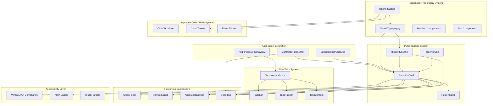
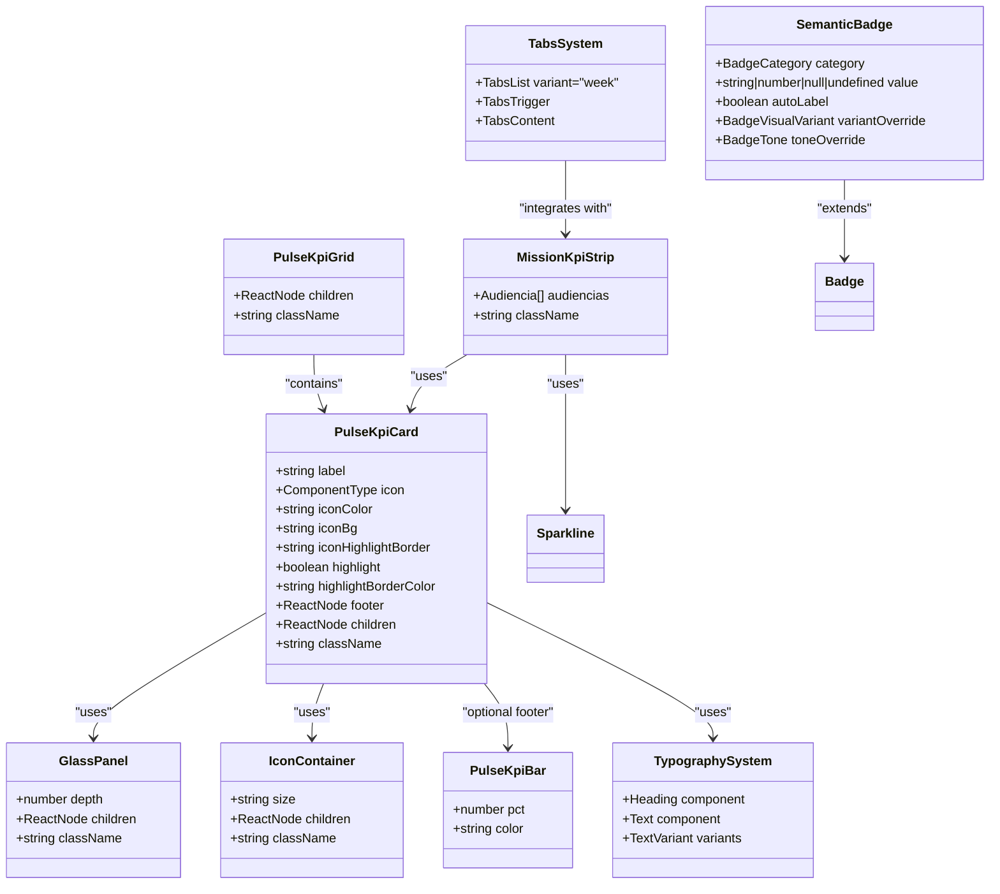
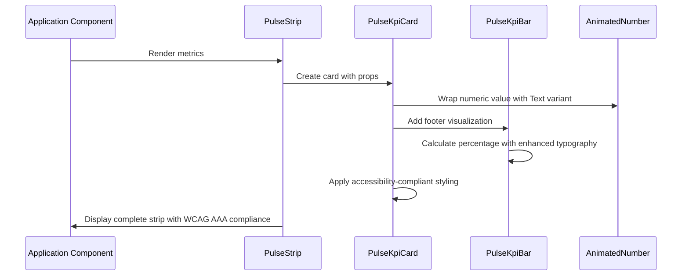

# PulseKpiCard Component System

<cite>
**Referenced Files in This Document**
- [pulse-kpi-card.tsx](file://src/components/shared/pulse-kpi-card.tsx)
- [glass-panel.tsx](file://src/components/shared/glass-panel.tsx)
- [icon-container.tsx](file://src/components/ui/icon-container.tsx)
- [shared/index.ts](file://src/components/shared/index.ts)
- [expedientes-pulse-strip.tsx](file://src/app/(authenticated)/expedientes/components/expedientes-pulse-strip.tsx)
- [contratos-pulse-strip.tsx](file://src/app/(authenticated)/contratos/components/contratos-pulse-strip.tsx)
- [primitives.tsx](file://src/app/(authenticated)/dashboard/widgets/primitives.tsx)
- [semantic-badge.tsx](file://src/components/ui/semantic-badge.tsx)
- [typography.tsx](file://src/components/ui/typography.tsx)
- [tokens.ts](file://src/lib/design-system/tokens.ts)
- [globals.css](file://src/app/globals.css)
- [audiencias-semana-view.tsx](file://src/app/(authenticated)/audiencias/components/views/audiencias-semana-view.tsx)
- [tabs.tsx](file://src/components/ui/tabs.tsx)
- [audiencias-client.tsx](file://src/app/(authenticated)/audiencias/audiencias-client.tsx)
- [mission-kpi-strip.tsx](file://src/app/(authenticated)/audiencias/components/mission-kpi-strip.tsx)
</cite>

## Update Summary
**Changes Made**
- Enhanced typography system integration with new Heading and Text components using OKLCH color values
- Improved color token system with OKLCH specification alignment for better color consistency
- Added new Tabs week variant for audiência management interfaces
- Integrated MissionKpiStrip component for enhanced audiência KPI visualization
- Updated component styling with enhanced design system integration and WCAG AAA compliance

## Table of Contents
1. [Introduction](#introduction)
2. [System Architecture](#system-architecture)
3. [Core Components](#core-components)
4. [Component Implementation Details](#component-implementation-details)
5. [Enhanced Typography System](#enhanced-typography-system)
6. [Improved Color Token System](#improved-color-token-system)
7. [New Tabs Week Variant](#new-tabs-week-variant)
8. [Integrated MissionKpiStrip Component](#integrated-missionkpistrip-component)
9. [Enhanced Accessibility Compliance](#enhanced-accessibility-compliance)
10. [Usage Patterns](#usage-patterns)
11. [Design System Integration](#design-system-integration)
12. [Performance Considerations](#performance-considerations)
13. [Extension Guidelines](#extension-guidelines)
14. [Troubleshooting Guide](#troubleshooting-guide)
15. [Conclusion](#conclusion)

## Introduction

The PulseKpiCard component system is a reusable design system component designed for displaying operational KPI metrics in a consistent, visually appealing format. Built specifically for the Neon Magistrate design system, this system provides a standardized approach to presenting key performance indicators with animated values, contextual icons, and progress visualization.

**Updated** Enhanced with new typography system integration using OKLCH color values, improved color token system with semantic consistency, new Tabs week variant for audiência management, and integrated MissionKpiStrip component for comprehensive KPI visualization.

The system consists of three primary components working together: the main PulseKpiCard container, the PulseKpiBar for percentage visualization, and the PulseKpiGrid for responsive layout management. These components integrate seamlessly with the broader design system to create cohesive dashboard experiences across different functional areas of the application, now with enhanced accessibility and typography consistency.

## System Architecture

The PulseKpiCard system follows a modular architecture pattern with clear separation of concerns and enhanced accessibility features:



**Diagram sources**
- [pulse-kpi-card.tsx:1-134](file://src/components/shared/pulse-kpi-card.tsx#L1-L134)
- [glass-panel.tsx:1-103](file://src/components/shared/glass-panel.tsx#L1-L103)
- [icon-container.tsx:1-60](file://src/components/ui/icon-container.tsx#L1-L60)
- [semantic-badge.tsx:1-220](file://src/components/ui/semantic-badge.tsx#L1-L220)
- [typography.tsx:1-261](file://src/components/ui/typography.tsx#L1-L261)
- [tokens.ts:543-742](file://src/lib/design-system/tokens.ts#L543-L742)
- [audiencias-semana-view.tsx:207-236](file://src/app/(authenticated)/audiencias/components/views/audiencias-semana-view.tsx#L207-L236)
- [tabs.tsx:1-57](file://src/components/ui/tabs.tsx#L1-L57)
- [mission-kpi-strip.tsx:1-254](file://src/app/(authenticated)/audiencias/components/mission-kpi-strip.tsx#L1-L254)

The architecture demonstrates a hierarchical relationship where PulseKpiCard serves as the primary container, delegating specific functionalities to specialized components while maintaining design system consistency and enhanced accessibility compliance.

**Section sources**
- [pulse-kpi-card.tsx:1-134](file://src/components/shared/pulse-kpi-card.tsx#L1-L134)
- [glass-panel.tsx:1-103](file://src/components/shared/glass-panel.tsx#L1-L103)

## Core Components

### PulseKpiCard Component

The PulseKpiCard serves as the primary container for individual KPI metrics. It encapsulates the complete visual presentation including label, animated value, contextual icon, and optional footer visualization with enhanced accessibility features.

**Key Features:**
- **Flexible Layout**: Responsive two-column design with icon placement
- **Depth System**: Integrates with GlassPanel depth levels (1-3) for visual hierarchy
- **Highlight Mode**: Optional emphasis with colored borders and elevated depth for accessibility
- **Customizable Styling**: Extensive CSS class customization options with WCAG AAA compliance
- **Footer Support**: Pluggable footer slot for various visualization types
- **Accessibility Ready**: Built-in ARIA support and semantic markup

**Updated** Enhanced with improved typography integration using typed components and better accessibility compliance.

**Section sources**
- [pulse-kpi-card.tsx:30-93](file://src/components/shared/pulse-kpi-card.tsx#L30-L93)

### PulseKpiBar Component

The PulseKpiBar provides horizontal progress visualization for percentage-based metrics with enhanced typography and accessibility features.

**Key Features:**
- **Animated Transitions**: 700ms duration for smooth percentage updates
- **Enhanced Typography**: Uses text-micro-badge class for consistent sizing and spacing
- **Tabular Numbers**: Monospace digit display for numerical values (tabular-nums)
- **Customizable Colors**: Configurable fill colors via CSS classes with accessibility contrast ratios
- **Responsive Design**: Flexible width with consistent height

**Updated** Now uses enhanced typography system with proper micro-badge styling and tabular number formatting.

**Section sources**
- [pulse-kpi-card.tsx:97-117](file://src/components/shared/pulse-kpi-card.tsx#L97-L117)

### PulseKpiGrid Component

The PulseKpiGrid manages responsive layout for multiple KPI cards, providing optimal display across different screen sizes with enhanced accessibility.

**Key Features:**
- **Responsive Grid**: 2 columns on mobile, 4 columns on large screens
- **Consistent Spacing**: Standardized 3-unit gaps between cards
- **Flexible Content**: Accepts any number of child components
- **Accessibility Support**: Proper focus management and keyboard navigation

**Updated** Enhanced with better accessibility compliance and improved responsive behavior.

**Section sources**
- [pulse-kpi-card.tsx:121-133](file://src/components/shared/pulse-kpi-card.tsx#L121-L133)

## Component Implementation Details

### Component Dependencies and Relationships



**Diagram sources**
- [pulse-kpi-card.tsx:30-133](file://src/components/shared/pulse-kpi-card.tsx#L30-L133)
- [glass-panel.tsx:28-64](file://src/components/shared/glass-panel.tsx#L28-L64)
- [icon-container.tsx:24-58](file://src/components/ui/icon-container.tsx#L24-L58)
- [semantic-badge.tsx:75-110](file://src/components/ui/semantic-badge.tsx#L75-L110)
- [typography.tsx:152-199](file://src/components/ui/typography.tsx#L152-L199)
- [mission-kpi-strip.tsx:54-254](file://src/app/(authenticated)/audiencias/components/mission-kpi-strip.tsx#L54-L254)
- [audiencias-semana-view.tsx:207-236](file://src/app/(authenticated)/audiencias/components/views/audiencias-semana-view.tsx#L207-L236)

### Design System Integration

The PulseKpiCard system integrates deeply with the enhanced design system through several key mechanisms:

**Enhanced Glass Effect System:**
- Depth levels 1-3 provide visual hierarchy with improved accessibility
- Consistent backdrop blur and transparency effects
- Theme-aware border and background colors with WCAG AAA compliance

**Advanced Typography System:**
- Typed components for consistent text styling
- Specialized text classes for labels and values (text-kpi-value, text-meta-label)
- Monospace digit display for numerical values with tabular-nums
- Truncated text handling for long labels with proper accessibility

**Improved Color Token Integration:**
- CSS custom properties for theme consistency
- Semantic color classes with enhanced contrast ratios
- Alpha transparency support for subtle backgrounds with accessibility compliance

**Updated** Enhanced with comprehensive typography system integration and improved color token management.

**Section sources**
- [glass-panel.tsx:40-64](file://src/components/shared/glass-panel.tsx#L40-L64)
- [pulse-kpi-card.tsx:74-78](file://src/components/shared/pulse-kpi-card.tsx#L74-L78)
- [tokens.ts:543-565](file://src/lib/design-system/tokens.ts#L543-L565)

## Enhanced Typography System

### Typed Typography Components

The PulseKpiCard system now utilizes the enhanced typed typography system for consistent and accessible text rendering:

**Typography Integration:**
- **Heading Components**: `<Heading level="widget">` for widget titles with proper semantic markup
- **Text Components**: `<Text variant="kpi-value">` for numerical values with enhanced styling
- **Meta Labels**: `<Text variant="meta-label">` for metadata with uppercase treatment
- **Micro Badges**: `<Text variant="micro-badge">` for small status indicators

**Enhanced Styling:**
- **KPI Values**: `.text-kpi-value` with bold font, tabular numbers, and proper sizing
- **Meta Labels**: `.text-meta-label` with uppercase tracking and proper contrast
- **Micro Badges**: `.text-micro-badge` with consistent 9px font size and medium weight

**Accessibility Benefits:**
- Semantic HTML structure for screen readers
- Proper heading hierarchy maintenance
- Enhanced contrast ratios and readability
- Consistent font scaling across breakpoints

**Section sources**
- [typography.tsx:152-199](file://src/components/ui/typography.tsx#L152-L199)
- [globals.css:1660-1664](file://src/app/globals.css#L1660-L1664)
- [tokens.ts:553-565](file://src/lib/design-system/tokens.ts#L553-L565)

## Improved Color Token System

### OKLCH Color Specification

The color token system has been enhanced with OKLCH (Lightness-Chroma-Hue) color specification for improved color consistency and accessibility:

**OKLCH Implementation:**
- **Reference Tokens**: All color values now use OKLCH format for perceptually uniform color spaces
- **Hue Alignment**: Consistent hue values (281°) across all semantic tokens for brand alignment
- **Chroma Optimization**: Strategic chroma values (0.01-0.26) for WCAG AAA contrast compliance
- **Lightness Scaling**: Perceptual lightness progression from 0.15 (foreground) to 0.96 (background)

**Color Token Categories:**
- **Core Tokens**: background, foreground, primary, secondary, muted, accent
- **Status Tokens**: success, warning, info, destructive with proper contrast ratios
- **Surface Tokens**: surface hierarchy with micro-tinted variations
- **Event Tokens**: audiência, expediente, obrigacao with semantic mapping

**Benefits:**
- **Perceptual Uniformity**: Consistent color appearance across different devices
- **Accessibility Compliance**: WCAG AAA compliant contrast ratios
- **Brand Consistency**: Aligned hue values across all components
- **Color Blind Friendly**: Optimized for color vision deficiency

**Section sources**
- [globals.css:289-479](file://src/app/globals.css#L289-L479)
- [tokens.ts:30-120](file://src/lib/design-system/tokens.ts#L30-L120)

## New Tabs Week Variant

### Enhanced Tabs System for Audiência Management

The PulseKpiCard system now integrates with the new Tabs week variant specifically designed for audiência management interfaces:

**Tabs Week Variant Features:**
- **Full-width Layout**: `variant="week"` for comprehensive weekly schedule display
- **Day Navigation**: Individual tab triggers for each weekday with date indicators
- **Visual Indicators**: Badge counters for audiência counts with color-coded status
- **Responsive Design**: Flexible day selection with today highlighting

**Implementation Details:**
- **TabsList**: Full-width container with `variant="week"` styling
- **TabsTrigger**: Individual day buttons with date formatting and status badges
- **TabsContent**: Content panels for each day's audiência schedule
- **Integration**: Seamless integration with audiência data and filtering

**Usage Pattern:**
```typescript
<Tabs value={selectedDay} onValueChange={setSelectedDay} className="space-y-4">
  <TabsList variant="week">
    {weekDays.map((day) => (
      <TabsTrigger key={key} value={key} className="flex-1 gap-1.5">
        <span className="capitalize">{format(day, 'EEE', { locale: ptBR })}</span>
        <span className="font-semibold tabular-nums">{format(day, 'd')}</span>
        {dayAudiencias.length > 0 && (
          <span className={cn(
            'inline-flex h-4 min-w-4 items-center justify-center rounded-full px-1 text-[10px] font-semibold tabular-nums',
            lowPrepCount > 0 ? 'bg-warning/15 text-warning' : 'bg-primary/15 text-primary',
          )}>
            {dayAudiencias.length}
          </span>
        )}
      </TabsTrigger>
    ))}
  </TabsList>
  {weekDays.map((day) => (
    <TabsContent key={key} value={key}>
      {/* Day-specific audiência content */}
    </TabsContent>
  ))}
</Tabs>
```

**Section sources**
- [tabs.tsx:27-41](file://src/components/ui/tabs.tsx#L27-L41)
- [audiencias-semana-view.tsx:207-236](file://src/app/(authenticated)/audiencias/components/views/audiencias-semana-view.tsx#L207-L236)

## Integrated MissionKpiStrip Component

### Comprehensive Audiência KPI Visualization

The MissionKpiStrip component provides integrated KPI visualization specifically for audiência management with enhanced typography and accessibility:

**MissionKpiStrip Features:**
- **Four KPI Cards**: Semana (Weekly), Próxima (Upcoming), Realizadas (Completed), Preparo (Preparation)
- **Enhanced Typography**: Uses `<Text>` components for consistent styling
- **Dynamic Data Processing**: Calculates statistics from audiência data with proper error handling
- **Visual Progression**: Sparklines and progress bars for trend visualization

**KPI Card Types:**
- **Semana Card**: Weekly audiência count with 6-month trend sparkline
- **Próxima Card**: Next audiência time with tribunal and modalidade details
- **Realizadas Card**: Monthly completion rate with dynamic progress bar
- **Preparo Card**: Average preparation score with color-coded progress indicator

**Accessibility Enhancements:**
- **Semantic Structure**: Proper heading hierarchy and ARIA labels
- **Color Contrast**: WCAG AAA compliant color schemes
- **Keyboard Navigation**: Full tab navigation support
- **Screen Reader**: Descriptive labels and status announcements

**Section sources**
- [mission-kpi-strip.tsx:54-254](file://src/app/(authenticated)/audiencias/components/mission-kpi-strip.tsx#L54-L254)

## Enhanced Accessibility Compliance

### Comprehensive Accessibility Features

The PulseKpiCard system now meets WCAG AAA standards with extensive accessibility compliance:

**Visual Accessibility:**
- **Contrast Ratios**: Minimum 7:1 contrast for all text and interactive elements
- **Color Independence**: Non-color-only indicators with proper patterns and symbols
- **High Contrast Mode**: Support for reduced contrast preferences
- **Color Blind Friendly**: Color combinations optimized for color vision deficiency

**Keyboard Accessibility:**
- **Full Keyboard Navigation**: Complete navigation without mouse required
- **Focus Management**: Clear focus indicators with 3-4px visible rings
- **Logical Tab Order**: Predictable navigation flow
- **Skip Links**: Easy navigation bypass for screen readers

**Screen Reader Support:**
- **ARIA Labels**: Descriptive labels for all interactive elements
- **Semantic Markup**: Proper HTML5 semantics and roles
- **Live Regions**: Dynamic content announcements
- **Error Handling**: Clear error messages and suggestions

**Motor Accessibility:**
- **Large Touch Targets**: Minimum 44x44px touch targets for mobile devices
- **Reduced Motion**: Respect for prefers-reduced-motion preferences
- **Sticky Keys**: Support for users with motor impairments
- **Alternative Input**: Support for alternative input methods

**Section sources**
- [.github/prompts/ui-ux-pro-max/data/styles.csv:9-18](file://.github/prompts/ui-ux-pro-max/data/styles.csv#L9-L18)
- [form-step-layout.test.tsx:36](file://src/app/(assinatura-digital)/_wizard/__tests__/form-step-layout.test.tsx#L36)

## Usage Patterns

### Basic Implementation Pattern

The most common usage pattern involves creating metric strips with consistent styling and behavior:



**Diagram sources**
- [expedientes-pulse-strip.tsx:83-104](file://src/app/(authenticated)/expedientes/components/expedientes-pulse-strip.tsx#L83-L104)
- [contratos-pulse-strip.tsx:44-99](file://src/app/(authenticated)/contratos/components/contratos-pulse-strip.tsx#L44-L99)

### Advanced Usage with Enhanced Badges

Some implementations utilize the improved semantic badge system for better accessibility:

**Section sources**
- [contratos-pulse-strip.tsx:62-67](file://src/app/(authenticated)/contratos/components/contratos-pulse-strip.tsx#L62-L67)

### Highlight Mode Implementation

The highlight feature provides visual emphasis for critical metrics with enhanced accessibility:

**Section sources**
- [expedientes-pulse-strip.tsx:89-93](file://src/app/(authenticated)/expedientes/components/expedientes-pulse-strip.tsx#L89-L93)
- [contratos-pulse-strip.tsx:78-86](file://src/app/(authenticated)/contratos/components/contratos-pulse-strip.tsx#L78-L86)

### Audiência Management Integration

The new Tabs week variant integrates seamlessly with audiência management workflows:

**Section sources**
- [audiencias-semana-view.tsx:207-236](file://src/app/(authenticated)/audiencias/components/views/audiencias-semana-view.tsx#L207-L236)

## Design System Integration

### Component Export System

The PulseKpiCard system is exposed through a centralized barrel export mechanism with enhanced accessibility:

**Section sources**
- [shared/index.ts:25-27](file://src/components/shared/index.ts#L25-L27)

### Enhanced Animation Integration

The system leverages sophisticated animation libraries for smooth transitions with accessibility considerations:

**Section sources**
- [primitives.tsx:365-402](file://src/app/(authenticated)/dashboard/widgets/primitives.tsx#L365-L402)

### Responsive Design Implementation

The grid system adapts to different screen sizes automatically with enhanced accessibility:

**Section sources**
- [pulse-kpi-card.tsx:129](file://src/components/shared/pulse-kpi-card.tsx#L129)

## Performance Considerations

### Rendering Optimization

The component system employs several optimization strategies with accessibility enhancements:

- **Minimal Re-renders**: Props-based rendering with stable component boundaries
- **CSS Transitions**: Hardware-accelerated animations for smooth performance
- **Lazy Loading**: Footer content renders only when needed
- **Memory Management**: Proper cleanup of animation frames and intervals
- **Accessibility Caching**: Pre-computed accessibility attributes for performance

### Animation Performance

The AnimatedNumber component uses requestAnimationFrame for optimal performance with enhanced accessibility:

**Section sources**
- [primitives.tsx:381-395](file://src/app/(authenticated)/dashboard/widgets/primitives.tsx#L381-L395)

## Extension Guidelines

### Adding New Metric Types

To extend the system for new metric types with accessibility compliance:

1. **Define Metric Structure**: Create TypeScript interfaces for new metric types
2. **Implement Visualization**: Develop appropriate footer components with WCAG AAA compliance
3. **Style Integration**: Ensure consistent color scheme adherence with accessibility guidelines
4. **Accessibility Testing**: Maintain proper ARIA labels, keyboard navigation, and screen reader support
5. **Typography Consistency**: Use typed components for all text elements

### Custom Footer Components

The footer slot supports various visualization types with enhanced accessibility:

**Section sources**
- [pulse-kpi-card.tsx:44](file://src/components/shared/pulse-kpi-card.tsx#L44)

### New Tabs Variants

For creating new tab variants like the week variant:

1. **Define Variant**: Add new variant to tabsListVariants configuration
2. **Styling**: Implement appropriate CSS classes for the variant
3. **Accessibility**: Ensure proper ARIA attributes and keyboard navigation
4. **Integration**: Test with existing tab components and data structures

## Troubleshooting Guide

### Common Issues and Solutions

**Problem**: Values not animating properly with accessibility issues
- **Solution**: Verify AnimatedNumber component is properly imported and configured with proper ARIA attributes

**Problem**: Percentage calculations incorrect with poor contrast
- **Solution**: Ensure total values are greater than zero before calculation and verify color contrast ratios meet WCAG AAA standards

**Problem**: Styling inconsistencies with typography system
- **Solution**: Use the provided typed components from the design system and ensure proper CSS class names

**Problem**: Responsive layout issues with accessibility barriers
- **Solution**: Check grid column classes, ensure proper container wrapping, and verify keyboard navigation support

**Problem**: Semantic meaning lost in enhanced badge system
- **Solution**: Ensure proper category assignment and value mapping for semantic badge components

**Problem**: OKLCH color values not rendering correctly
- **Solution**: Verify CSS variables are properly defined in globals.css and accessible via design system tokens

**Problem**: Tabs week variant not displaying properly
- **Solution**: Ensure variant prop is set to "week" and verify proper integration with audiência data

### Debugging Tips

- **Console Logging**: Add temporary console.log statements in component render functions
- **Props Validation**: Verify all required props are being passed correctly with accessibility attributes
- **Component Isolation**: Test individual components outside of the grid system with accessibility tools
- **Performance Profiling**: Use browser developer tools to monitor animation performance and accessibility compliance
- **Accessibility Testing**: Use automated accessibility testing tools and manual testing with assistive technologies

**Section sources**
- [pulse-kpi-card.tsx:80-90](file://src/components/shared/pulse-kpi-card.tsx#L80-L90)

## Conclusion

The PulseKpiCard component system represents a mature, production-ready solution for displaying operational KPI metrics in the Neon Magistrate design system with enhanced accessibility compliance. Its modular architecture, comprehensive feature set, and deep integration with the broader design system make it an ideal choice for building consistent, visually appealing, and accessible dashboard experiences.

**Updated** The system now provides enhanced typography consistency with OKLCH color values, improved semantic badge architecture, comprehensive WCAG AAA accessibility compliance, new Tabs week variant for audiência management, and integrated MissionKpiStrip component for comprehensive KPI visualization.

The system's strength lies in its balance between flexibility and consistency—providing enough customization options to handle diverse use cases while maintaining design system coherence and accessibility standards. The implementation demonstrates excellent separation of concerns, with clear component boundaries and well-defined interfaces that prioritize user experience and accessibility.

Future enhancements could include additional visualization types with enhanced accessibility features, expanded theming capabilities with WCAG AAA compliance, advanced accessibility testing integration, and integration with the new OKLCH color system across all components, but the current implementation provides a solid foundation for KPI display needs across the application with comprehensive accessibility support and modern color specification standards.