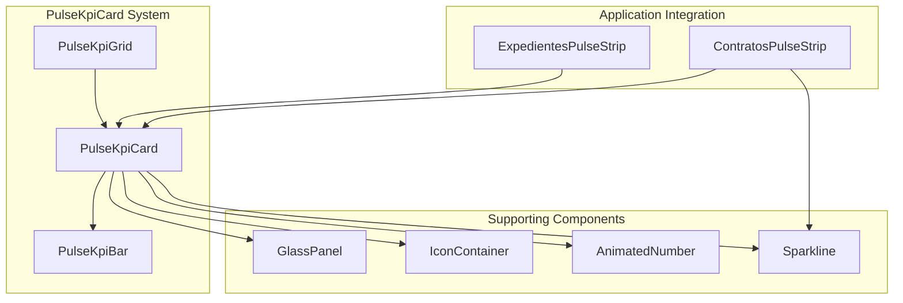
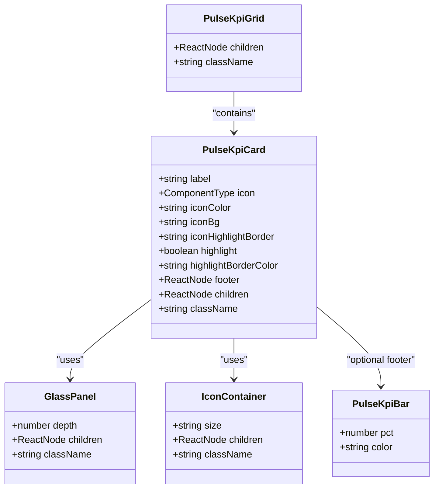
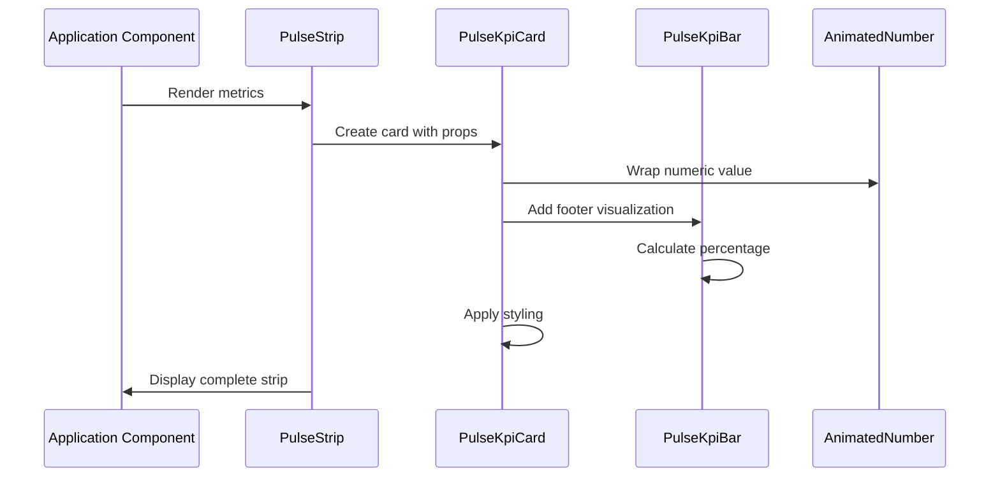

# PulseKpiCard Component System

<cite>
**Referenced Files in This Document**
- [pulse-kpi-card.tsx](file://src/components/shared/pulse-kpi-card.tsx)
- [glass-panel.tsx](file://src/components/shared/glass-panel.tsx)
- [icon-container.tsx](file://src/components/ui/icon-container.tsx)
- [shared/index.ts](file://src/components/shared/index.ts)
- [expedientes-pulse-strip.tsx](file://src/app/(authenticated)/expedientes/components/expedientes-pulse-strip.tsx)
- [contratos-pulse-strip.tsx](file://src/app/(authenticated)/contratos/components/contratos-pulse-strip.tsx)
- [primitives.tsx](file://src/app/(authenticated)/dashboard/widgets/primitives.tsx)
</cite>

## Table of Contents
1. [Introduction](#introduction)
2. [System Architecture](#system-architecture)
3. [Core Components](#core-components)
4. [Component Implementation Details](#component-implementation-details)
5. [Usage Patterns](#usage-patterns)
6. [Design System Integration](#design-system-integration)
7. [Performance Considerations](#performance-considerations)
8. [Extension Guidelines](#extension-guidelines)
9. [Troubleshooting Guide](#troubleshooting-guide)
10. [Conclusion](#conclusion)

## Introduction

The PulseKpiCard component system is a reusable design system component designed for displaying operational KPI metrics in a consistent, visually appealing format. Built specifically for the Neon Magistrate design system, this system provides a standardized approach to presenting key performance indicators with animated values, contextual icons, and progress visualization.

The system consists of three primary components working together: the main PulseKpiCard container, the PulseKpiBar for percentage visualization, and the PulseKpiGrid for responsive layout management. These components integrate seamlessly with the broader design system to create cohesive dashboard experiences across different functional areas of the application.

## System Architecture

The PulseKpiCard system follows a modular architecture pattern with clear separation of concerns:

**Diagram sources**
- [pulse-kpi-card.tsx:1-134](file://src/components/shared/pulse-kpi-card.tsx#L1-L134)
- [glass-panel.tsx:1-103](file://src/components/shared/glass-panel.tsx#L1-L103)
- [icon-container.tsx:1-60](file://src/components/ui/icon-container.tsx#L1-L60)

The architecture demonstrates a hierarchical relationship where PulseKpiCard serves as the primary container, delegating specific functionalities to specialized components while maintaining design system consistency.

**Section sources**
- [pulse-kpi-card.tsx:1-134](file://src/components/shared/pulse-kpi-card.tsx#L1-L134)
- [glass-panel.tsx:1-103](file://src/components/shared/glass-panel.tsx#L1-L103)

## Core Components

### PulseKpiCard Component

The PulseKpiCard serves as the primary container for individual KPI metrics. It encapsulates the complete visual presentation including label, animated value, contextual icon, and optional footer visualization.

**Key Features:**
- **Flexible Layout**: Responsive two-column design with icon placement
- **Depth System**: Integrates with GlassPanel depth levels (1-3)
- **Highlight Mode**: Optional emphasis with colored borders and elevated depth
- **Customizable Styling**: Extensive CSS class customization options
- **Footer Support**: Pluggable footer slot for various visualization types

**Section sources**
- [pulse-kpi-card.tsx:30-93](file://src/components/shared/pulse-kpi-card.tsx#L30-L93)

### PulseKpiBar Component

The PulseKpiBar provides horizontal progress visualization for percentage-based metrics. It features smooth transitions and customizable color schemes.

**Key Features:**
- **Animated Transitions**: 700ms duration for smooth percentage updates
- **Percentage Display**: Right-aligned percentage indicator
- **Customizable Colors**: Configurable fill colors via CSS classes
- **Responsive Design**: Flexible width with consistent height

**Section sources**
- [pulse-kpi-card.tsx:97-117](file://src/components/shared/pulse-kpi-card.tsx#L97-L117)

### PulseKpiGrid Component

The PulseKpiGrid manages responsive layout for multiple KPI cards, providing optimal display across different screen sizes.

**Key Features:**
- **Responsive Grid**: 2 columns on mobile, 4 columns on large screens
- **Consistent Spacing**: Standardized 3-unit gaps between cards
- **Flexible Content**: Accepts any number of child components

**Section sources**
- [pulse-kpi-card.tsx:121-133](file://src/components/shared/pulse-kpi-card.tsx#L121-L133)

## Component Implementation Details

### Component Dependencies and Relationships

**Diagram sources**
- [pulse-kpi-card.tsx:30-133](file://src/components/shared/pulse-kpi-card.tsx#L30-L133)
- [glass-panel.tsx:28-64](file://src/components/shared/glass-panel.tsx#L28-L64)
- [icon-container.tsx:24-58](file://src/components/ui/icon-container.tsx#L24-L58)

### Design System Integration

The PulseKpiCard system integrates deeply with the broader design system through several key mechanisms:

**Glass Effect System:**
- Depth levels 1-3 provide visual hierarchy
- Consistent backdrop blur and transparency effects
- Theme-aware border and background colors

**Typography System:**
- Specialized text classes for labels and values
- Monospace digit display for numerical values
- Truncated text handling for long labels

**Color Token Integration:**
- CSS custom properties for theme consistency
- Semantic color classes (primary, warning, destructive, success)
- Alpha transparency support for subtle backgrounds

**Section sources**
- [glass-panel.tsx:40-64](file://src/components/shared/glass-panel.tsx#L40-L64)
- [pulse-kpi-card.tsx:74-78](file://src/components/shared/pulse-kpi-card.tsx#L74-L78)

## Usage Patterns

### Basic Implementation Pattern

The most common usage pattern involves creating metric strips with consistent styling and behavior:

**Diagram sources**
- [expedientes-pulse-strip.tsx:83-104](file://src/app/(authenticated)/expedientes/components/expedientes-pulse-strip.tsx#L83-L104)
- [contratos-pulse-strip.tsx:44-99](file://src/app/(authenticated)/contratos/components/contratos-pulse-strip.tsx#L44-L99)

### Advanced Usage with Sparklines

Some implementations utilize sparkline charts instead of percentage bars for trend visualization:

**Section sources**
- [contratos-pulse-strip.tsx:62-67](file://src/app/(authenticated)/contratos/components/contratos-pulse-strip.tsx#L62-L67)

### Highlight Mode Implementation

The highlight feature provides visual emphasis for critical metrics:

**Section sources**
- [expedientes-pulse-strip.tsx:89-93](file://src/app/(authenticated)/expedientes/components/expedientes-pulse-strip.tsx#L89-L93)
- [contratos-pulse-strip.tsx:78-86](file://src/app/(authenticated)/contratos/components/contratos-pulse-strip.tsx#L78-L86)

## Design System Integration

### Component Export System

The PulseKpiCard system is exposed through a centralized barrel export mechanism:

**Section sources**
- [shared/index.ts:25-27](file://src/components/shared/index.ts#L25-L27)

### Animation Integration

The system leverages sophisticated animation libraries for smooth transitions:

**Section sources**
- [primitives.tsx:365-402](file://src/app/(authenticated)/dashboard/widgets/primitives.tsx#L365-L402)

### Responsive Design Implementation

The grid system adapts to different screen sizes automatically:

**Section sources**
- [pulse-kpi-card.tsx:129](file://src/components/shared/pulse-kpi-card.tsx#L129)

## Performance Considerations

### Rendering Optimization

The component system employs several optimization strategies:

- **Minimal Re-renders**: Props-based rendering with stable component boundaries
- **CSS Transitions**: Hardware-accelerated animations for smooth performance
- **Lazy Loading**: Footer content renders only when needed
- **Memory Management**: Proper cleanup of animation frames and intervals

### Animation Performance

The AnimatedNumber component uses requestAnimationFrame for optimal performance:

**Section sources**
- [primitives.tsx:381-395](file://src/app/(authenticated)/dashboard/widgets/primitives.tsx#L381-L395)

## Extension Guidelines

### Adding New Metric Types

To extend the system for new metric types:

1. **Define Metric Structure**: Create TypeScript interfaces for new metric types
2. **Implement Visualization**: Develop appropriate footer components
3. **Style Integration**: Ensure consistent color scheme adherence
4. **Accessibility**: Maintain proper ARIA labels and keyboard navigation

### Custom Footer Components

The footer slot supports various visualization types:

**Section sources**
- [pulse-kpi-card.tsx:44](file://src/components/shared/pulse-kpi-card.tsx#L44)

## Troubleshooting Guide

### Common Issues and Solutions

**Problem**: Values not animating properly
- **Solution**: Verify AnimatedNumber component is properly imported and configured

**Problem**: Percentage calculations incorrect
- **Solution**: Ensure total values are greater than zero before calculation

**Problem**: Styling inconsistencies
- **Solution**: Use the provided CSS class names from the design system

**Problem**: Responsive layout issues
- **Solution**: Check grid column classes and ensure proper container wrapping

### Debugging Tips

- **Console Logging**: Add temporary console.log statements in component render functions
- **Props Validation**: Verify all required props are being passed correctly
- **Component Isolation**: Test individual components outside of the grid system
- **Performance Profiling**: Use browser developer tools to monitor animation performance

**Section sources**
- [pulse-kpi-card.tsx:80-90](file://src/components/shared/pulse-kpi-card.tsx#L80-L90)

## Conclusion

The PulseKpiCard component system represents a mature, production-ready solution for displaying operational KPI metrics in the Neon Magistrate design system. Its modular architecture, comprehensive feature set, and deep integration with the broader design system make it an ideal choice for building consistent, visually appealing dashboard experiences.

The system's strength lies in its balance between flexibility and consistency—providing enough customization options to handle diverse use cases while maintaining design system coherence. The implementation demonstrates excellent separation of concerns, with clear component boundaries and well-defined interfaces.

Future enhancements could include additional visualization types, enhanced accessibility features, and expanded theming capabilities, but the current implementation provides a solid foundation for KPI display needs across the application.