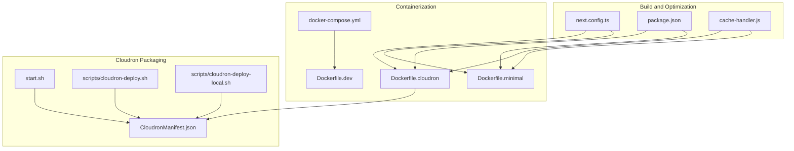
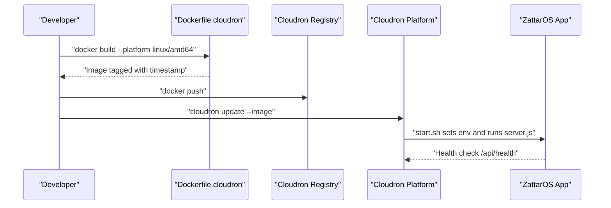
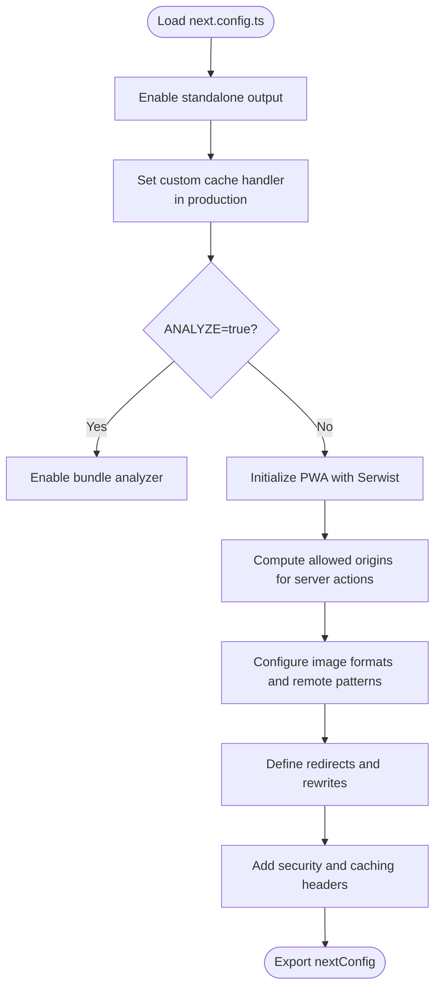
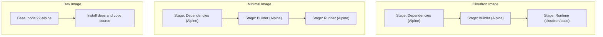
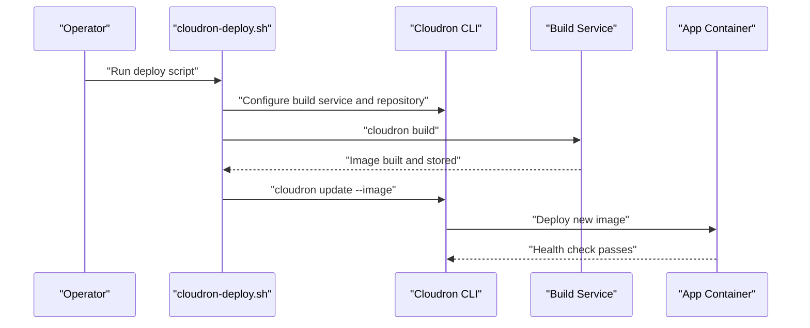
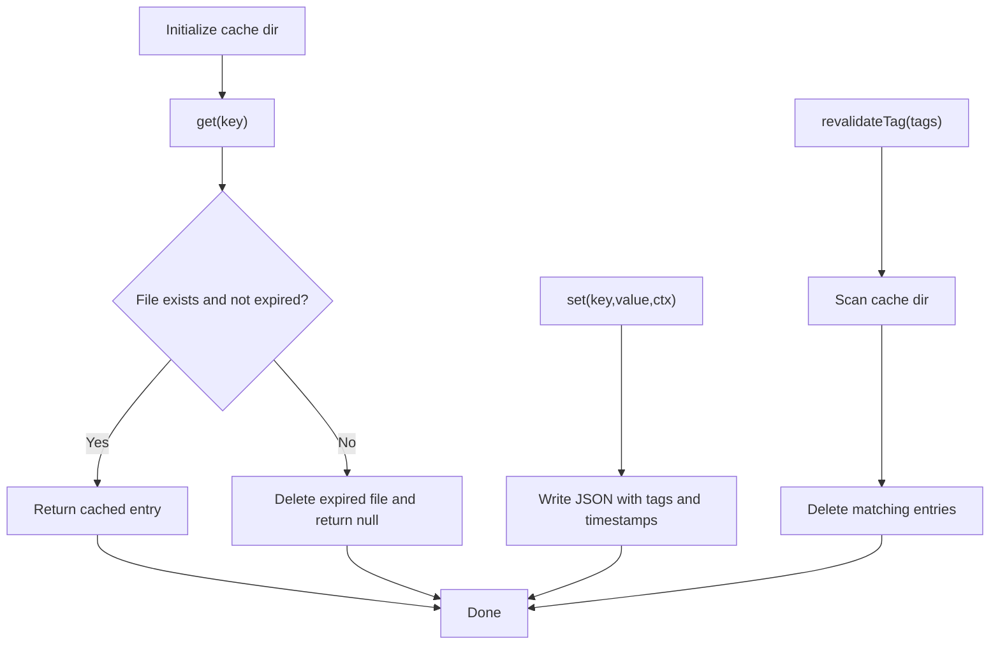
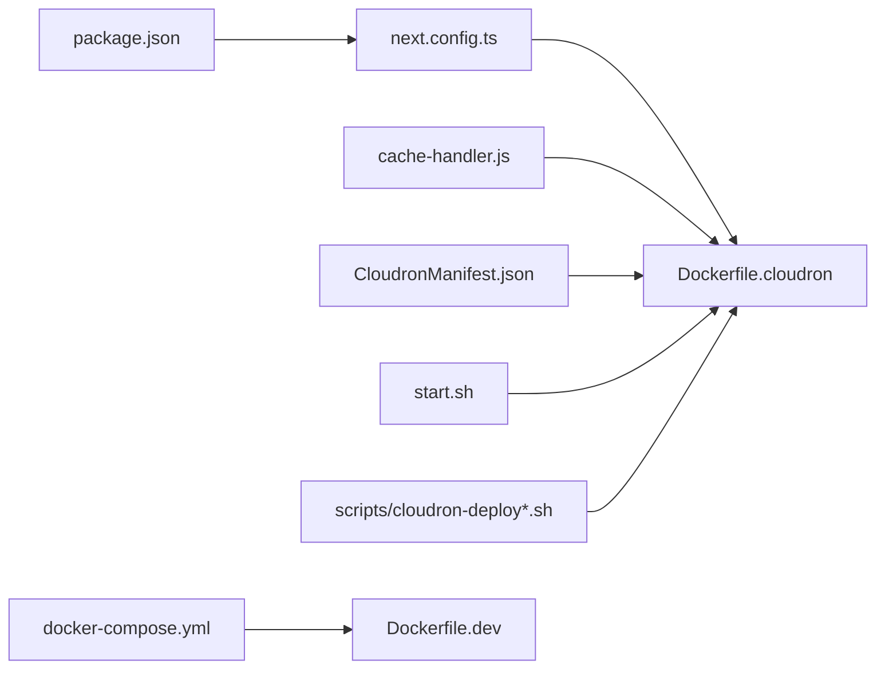

# Build Process and Deployment

<cite>
**Referenced Files in This Document**
- [next.config.ts](file://next.config.ts)
- [package.json](file://package.json)
- [Dockerfile.cloudron](file://Dockerfile.cloudron)
- [Dockerfile.dev](file://Dockerfile.dev)
- [Dockerfile.minimal](file://Dockerfile.minimal)
- [CloudronManifest.json](file://CloudronManifest.json)
- [scripts/cloudron-deploy.sh](file://scripts/cloudron-deploy.sh)
- [scripts/cloudron-deploy-local.sh](file://scripts/cloudron-deploy-local.sh)
- [cache-handler.js](file://cache-handler.js)
- [docker-compose.yml](file://docker-compose.yml)
- [start.sh](file://start.sh)
- [scripts/docker/prod.sh](file://scripts/docker/prod.sh)
</cite>

## Table of Contents
1. [Introduction](#introduction)
2. [Project Structure](#project-structure)
3. [Core Components](#core-components)
4. [Architecture Overview](#architecture-overview)
5. [Detailed Component Analysis](#detailed-component-analysis)
6. [Dependency Analysis](#dependency-analysis)
7. [Performance Considerations](#performance-considerations)
8. [Troubleshooting Guide](#troubleshooting-guide)
9. [Conclusion](#conclusion)
10. [Appendices](#appendices)

## Introduction
This document explains the ZattarOS build process and deployment strategies. It covers Next.js build configuration and production optimizations, Docker containerization with multi-stage builds, Cloudron packaging and deployment automation, environment-specific configurations, and practical examples for building and deploying across environments. It also includes guidance for performance optimization during build and deployment, asset optimization, and troubleshooting.

## Project Structure
ZattarOS uses a modern Next.js 16 application with a focus on production-grade containerization and automated deployments. Key build and deployment assets include:
- Next.js configuration with advanced optimization flags and PWA support
- Multiple Dockerfiles for development, minimal production, and Cloudron packaging
- Cloudron manifest and deployment scripts for automated CI/CD
- Custom cache handler for persistent cache across deployments
- Docker Compose for local development and orchestration

**Diagram sources**
- [next.config.ts:1-435](file://next.config.ts#L1-L435)
- [package.json:1-409](file://package.json#L1-L409)
- [Dockerfile.cloudron:1-96](file://Dockerfile.cloudron#L1-L96)
- [Dockerfile.dev:1-28](file://Dockerfile.dev#L1-L28)
- [Dockerfile.minimal:1-88](file://Dockerfile.minimal#L1-L88)
- [CloudronManifest.json:1-31](file://CloudronManifest.json#L1-L31)
- [start.sh:1-128](file://start.sh#L1-L128)
- [scripts/cloudron-deploy.sh:1-490](file://scripts/cloudron-deploy.sh#L1-L490)
- [scripts/cloudron-deploy-local.sh:1-484](file://scripts/cloudron-deploy-local.sh#L1-L484)
- [cache-handler.js:1-140](file://cache-handler.js#L1-L140)
- [docker-compose.yml:1-87](file://docker-compose.yml#L1-L87)

**Section sources**
- [next.config.ts:1-435](file://next.config.ts#L1-L435)
- [package.json:1-409](file://package.json#L1-L409)
- [Dockerfile.cloudron:1-96](file://Dockerfile.cloudron#L1-L96)
- [Dockerfile.dev:1-28](file://Dockerfile.dev#L1-L28)
- [Dockerfile.minimal:1-88](file://Dockerfile.minimal#L1-L88)
- [CloudronManifest.json:1-31](file://CloudronManifest.json#L1-L31)
- [start.sh:1-128](file://start.sh#L1-L128)
- [scripts/cloudron-deploy.sh:1-490](file://scripts/cloudron-deploy.sh#L1-L490)
- [scripts/cloudron-deploy-local.sh:1-484](file://scripts/cloudron-deploy-local.sh#L1-L484)
- [cache-handler.js:1-140](file://cache-handler.js#L1-L140)
- [docker-compose.yml:1-87](file://docker-compose.yml#L1-L87)

## Core Components
- Next.js build configuration with:
  - Standalone output for fast container startup
  - Custom cache handler for persistent cache
  - Bundle analyzer toggle
  - PWA support via Serwist
  - Optimizations for Turbopack and Webpack
  - Server actions allowed origins resolution
  - Image optimization and remote pattern configuration
  - Redirects and rewrites for app routing
  - Security and performance headers
- Docker multi-stage builds:
  - Cloudron-specific image with Node upgrade and symlinked cache
  - Minimal production image with standalone output and dumb-init
  - Development image optimized for hot reload
- Cloudron packaging:
  - Manifest with health checks and addons
  - Start script mapping Cloudron environment variables
  - Deployment scripts for remote and local builds
- Persistent cache:
  - Custom cache handler supporting tag invalidation and expiration

**Section sources**
- [next.config.ts:79-435](file://next.config.ts#L79-L435)
- [Dockerfile.cloudron:12-96](file://Dockerfile.cloudron#L12-L96)
- [Dockerfile.minimal:1-88](file://Dockerfile.minimal#L1-L88)
- [Dockerfile.dev:1-28](file://Dockerfile.dev#L1-L28)
- [CloudronManifest.json:1-31](file://CloudronManifest.json#L1-L31)
- [start.sh:1-128](file://start.sh#L1-L128)
- [scripts/cloudron-deploy.sh:1-490](file://scripts/cloudron-deploy.sh#L1-L490)
- [scripts/cloudron-deploy-local.sh:1-484](file://scripts/cloudron-deploy-local.sh#L1-L484)
- [cache-handler.js:1-140](file://cache-handler.js#L1-L140)

## Architecture Overview
The build and deployment pipeline integrates Next.js optimizations with Docker and Cloudron automation. The Cloudron image upgrades Node, prepares persistent caches, and exposes a health endpoint. Deployment scripts automate environment variable injection and image updates.

**Diagram sources**
- [Dockerfile.cloudron:38-96](file://Dockerfile.cloudron#L38-L96)
- [scripts/cloudron-deploy.sh:410-467](file://scripts/cloudron-deploy.sh#L410-L467)
- [start.sh:113-128](file://start.sh#L113-L128)

## Detailed Component Analysis

### Next.js Build Configuration
Key optimizations and settings:
- Standalone output for reduced startup time and smaller footprint
- Custom cache handler for persistent cache across deployments
- Bundle analyzer toggle via environment variable
- PWA support via Serwist with service worker configuration
- Server actions allowed origins computed from environment variables
- Image formats and remote patterns for optimized delivery
- Redirects and rewrites for app routing
- Security headers for SW, Workbox, and manifest caching
- Turbopack and Webpack toggles via build scripts

**Diagram sources**
- [next.config.ts:79-435](file://next.config.ts#L79-L435)

**Section sources**
- [next.config.ts:79-435](file://next.config.ts#L79-L435)

### Docker Multi-Stage Builds
- Cloudron image:
  - Upgrades Node from 18 to 22, symlinks persistent cache to /app/data
  - Copies standalone output and public assets
  - Sets health check and entrypoint
- Minimal production image:
  - Uses standalone output and dumb-init
  - Reduces attack surface with non-root user
  - Adds OCI labels and health check
- Development image:
  - Enables hot reload and development tools
  - Skips browser downloads for CI-friendly builds

**Diagram sources**
- [Dockerfile.cloudron:12-96](file://Dockerfile.cloudron#L12-L96)
- [Dockerfile.minimal:1-88](file://Dockerfile.minimal#L1-L88)
- [Dockerfile.dev:1-28](file://Dockerfile.dev#L1-L28)

**Section sources**
- [Dockerfile.cloudron:12-96](file://Dockerfile.cloudron#L12-L96)
- [Dockerfile.minimal:1-88](file://Dockerfile.minimal#L1-L88)
- [Dockerfile.dev:1-28](file://Dockerfile.dev#L1-L28)

### Cloudron Packaging and Deployment
- Manifest defines health check path, ports, addons, and tags
- Start script maps Cloudron environment variables to app variables, sets memory limits, and launches the standalone server
- Deployment scripts:
  - Remote build via Cloudron Build Service with repository configuration
  - Local build with Docker, push to registry, and update
  - Support for environment-only updates, image reuse, and cleanup

**Diagram sources**
- [CloudronManifest.json:1-31](file://CloudronManifest.json#L1-L31)
- [start.sh:1-128](file://start.sh#L1-L128)
- [scripts/cloudron-deploy.sh:249-467](file://scripts/cloudron-deploy.sh#L249-L467)

**Section sources**
- [CloudronManifest.json:1-31](file://CloudronManifest.json#L1-L31)
- [start.sh:1-128](file://start.sh#L1-L128)
- [scripts/cloudron-deploy.sh:1-490](file://scripts/cloudron-deploy.sh#L1-L490)
- [scripts/cloudron-deploy-local.sh:1-484](file://scripts/cloudron-deploy-local.sh#L1-L484)

### Persistent Cache Handler
The custom cache handler persists ISR/fetch cache to disk for:
- Cloudron: /app/data/cache/next-custom
- Docker/dev: .next/cache/custom
It supports tag-based invalidation and expiration checks.

**Diagram sources**
- [cache-handler.js:16-140](file://cache-handler.js#L16-L140)

**Section sources**
- [cache-handler.js:1-140](file://cache-handler.js#L1-140)

### Environment-Specific Configurations
- Cloudron:
  - Environment variables mapped by start.sh (Redis, Mail, App origin, memory)
  - Persistent cache symlinked to /app/data
  - Health check via /api/health
- Docker Compose:
  - Local development with environment variables injected at runtime
  - Health checks for the app container
- Package scripts:
  - Multiple build modes: webpack, turbopack, CI-friendly builds
  - Lint, type-check, tests, and Docker-related helpers

**Section sources**
- [start.sh:1-128](file://start.sh#L1-L128)
- [docker-compose.yml:1-87](file://docker-compose.yml#L1-L87)
- [package.json:9-134](file://package.json#L9-L134)

## Dependency Analysis
Build-time and runtime dependencies are managed through Docker stages and environment variables. The Cloudron image depends on:
- Node.js 22 (upgraded from base)
- Persistent cache symlinked to /app/data
- Health check and start script integration

**Diagram sources**
- [package.json:1-409](file://package.json#L1-L409)
- [next.config.ts:1-435](file://next.config.ts#L1-L435)
- [Dockerfile.cloudron:1-96](file://Dockerfile.cloudron#L1-L96)
- [cache-handler.js:1-140](file://cache-handler.js#L1-L140)
- [CloudronManifest.json:1-31](file://CloudronManifest.json#L1-L31)
- [start.sh:1-128](file://start.sh#L1-L128)
- [scripts/cloudron-deploy.sh:1-490](file://scripts/cloudron-deploy.sh#L1-L490)
- [scripts/cloudron-deploy-local.sh:1-484](file://scripts/cloudron-deploy-local.sh#L1-L484)
- [docker-compose.yml:1-87](file://docker-compose.yml#L1-L87)
- [Dockerfile.dev:1-28](file://Dockerfile.dev#L1-L28)

**Section sources**
- [package.json:1-409](file://package.json#L1-L409)
- [next.config.ts:1-435](file://next.config.ts#L1-L435)
- [Dockerfile.cloudron:1-96](file://Dockerfile.cloudron#L1-L96)
- [cache-handler.js:1-140](file://cache-handler.js#L1-L140)
- [CloudronManifest.json:1-31](file://CloudronManifest.json#L1-L31)
- [start.sh:1-128](file://start.sh#L1-L128)
- [scripts/cloudron-deploy.sh:1-490](file://scripts/cloudron-deploy.sh#L1-L490)
- [scripts/cloudron-deploy-local.sh:1-484](file://scripts/cloudron-deploy-local.sh#L1-L484)
- [docker-compose.yml:1-87](file://docker-compose.yml#L1-L87)
- [Dockerfile.dev:1-28](file://Dockerfile.dev#L1-L28)

## Performance Considerations
- Build performance:
  - Use Webpack for production builds and Turbopack for CI to balance speed and stability
  - Limit build workers to fit Cloudron memory constraints
  - Skip type checks and lint in CI builds to reduce overhead
- Asset optimization:
  - Enable image AVIF and WebP formats
  - Configure remote patterns for external image sources
- Runtime performance:
  - Standalone output reduces cold start and image size
  - Persistent cache handler minimizes revalidation overhead
  - Health checks and memory limits improve reliability

[No sources needed since this section provides general guidance]

## Troubleshooting Guide
- Build failures in Cloudron builder:
  - Use local build script to bypass memory constraints
  - Verify registry credentials and push permissions
- Health check failures:
  - Confirm /api/health responds with 200
  - Check start.sh environment mapping and memory limits
- Cache issues:
  - Validate cache directory permissions and symlink
  - Use tag-based invalidation for stale content
- Environment variables:
  - Ensure .env.local is present and mapped correctly
  - For Cloudron, verify addon variables are set (Redis, Mail)

**Section sources**
- [scripts/cloudron-deploy-local.sh:247-273](file://scripts/cloudron-deploy-local.sh#L247-L273)
- [start.sh:113-128](file://start.sh#L113-L128)
- [cache-handler.js:16-140](file://cache-handler.js#L16-L140)
- [scripts/cloudron-deploy.sh:330-367](file://scripts/cloudron-deploy.sh#L330-L367)

## Conclusion
ZattarOS combines Next.js optimizations with robust Docker and Cloudron tooling to deliver a reliable, high-performance application. The build configuration emphasizes standalone output, persistent caching, and PWA support. The deployment pipeline automates environment mapping, image updates, and health monitoring, enabling smooth CI/CD across environments.

[No sources needed since this section summarizes without analyzing specific files]

## Appendices

### Practical Examples

- Building for production with Webpack:
  - Use the production build script to compile with Webpack and standalone output
  - Reference: [package.json:22-24](file://package.json#L22-L24)

- Building for CI with Turbopack:
  - Use the CI build script to leverage Turbopack with reduced lint/type checks
  - Reference: [package.json:18](file://package.json#L18)

- Deploying to Cloudron (remote build):
  - Run the remote deployment script to configure the build service and update the app
  - Reference: [scripts/cloudron-deploy.sh:384-467](file://scripts/cloudron-deploy.sh#L384-L467)

- Deploying to Cloudron (local build):
  - Use the local deployment script to build locally, push to registry, and update
  - Reference: [scripts/cloudron-deploy-local.sh:383-451](file://scripts/cloudron-deploy-local.sh#L383-L451)

- Managing rollbacks:
  - Use the Cloudron CLI to update with a specific image tag or rollback the stack
  - References:
    - [scripts/cloudron-deploy.sh:108-113](file://scripts/cloudron-deploy.sh#L108-L113)
    - [scripts/docker/prod.sh:20-22](file://scripts/docker/prod.sh#L20-L22)

- Environment-specific configuration:
  - Cloudron variables mapped by start.sh
  - Local development via docker-compose with environment variables
  - References:
    - [start.sh:1-128](file://start.sh#L1-L128)
    - [docker-compose.yml:1-87](file://docker-compose.yml#L1-L87)