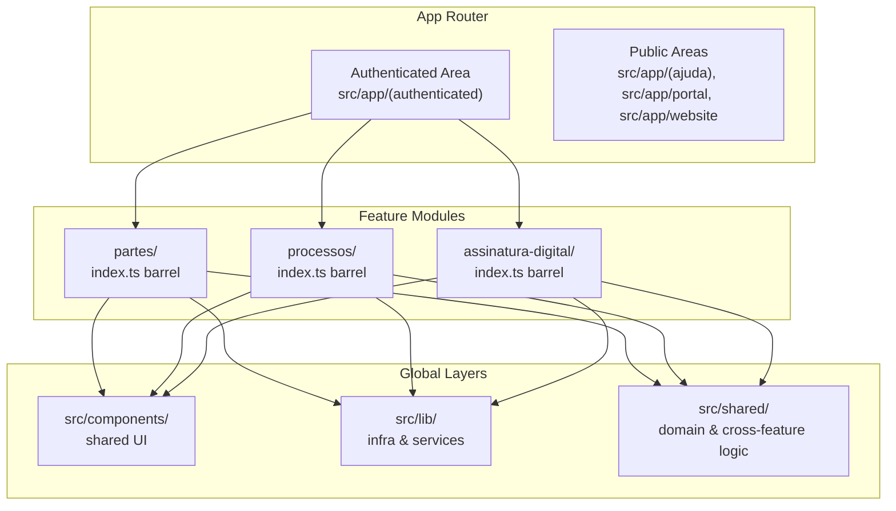
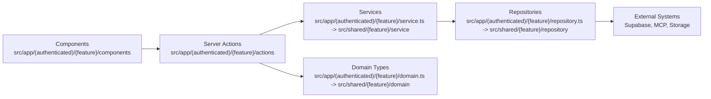
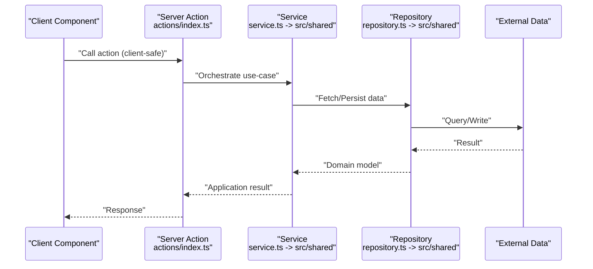
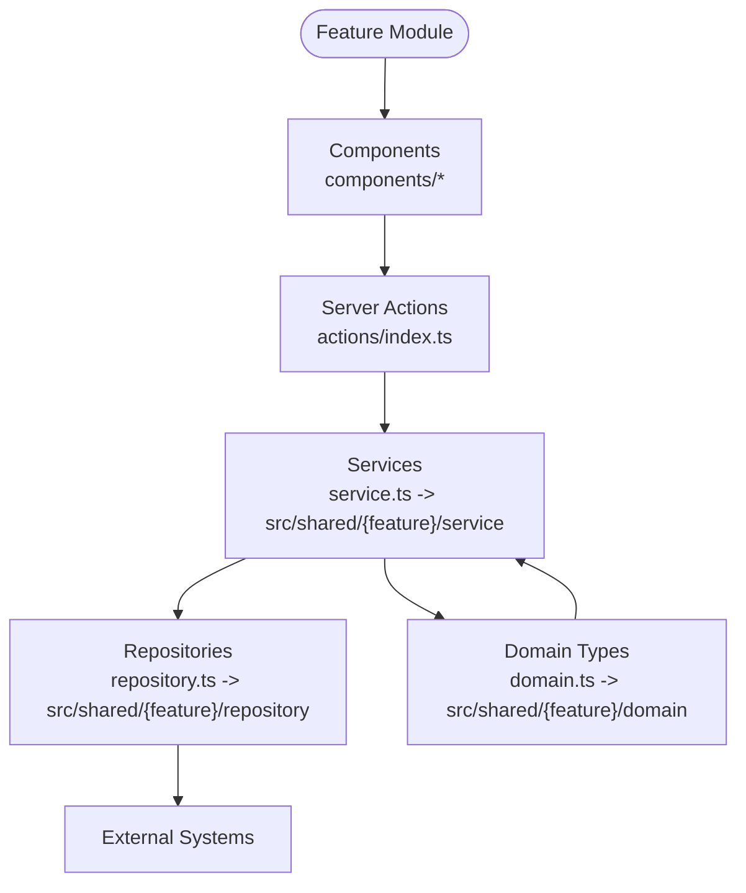
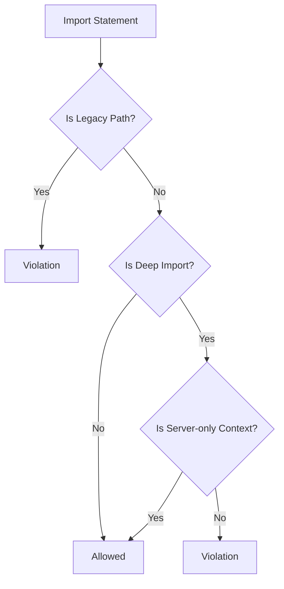
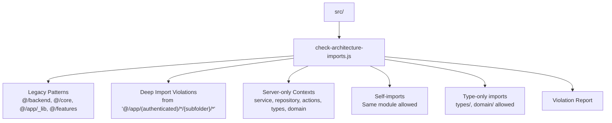

# Code Structure and Architecture Guidelines

<cite>
**Referenced Files in This Document**
- [README.md](file://README.md)
- [package.json](file://package.json)
- [eslint.config.mjs](file://eslint.config.mjs)
- [src/app/(authenticated)/partes/index.ts](file://src/app/(authenticated)/partes/index.ts)
- [src/app/(authenticated)/partes/domain.ts](file://src/app/(authenticated)/partes/domain.ts)
- [src/app/(authenticated)/partes/service.ts](file://src/app/(authenticated)/partes/service.ts)
- [src/app/(authenticated)/partes/repository.ts](file://src/app/(authenticated)/partes/repository.ts)
- [src/app/(authenticated)/partes/actions/index.ts](file://src/app/(authenticated)/partes/actions/index.ts)
- [scripts/dev-tools/architecture/check-architecture-imports.js](file://scripts/dev-tools/architecture/check-architecture-imports.js)
</cite>

## Table of Contents
1. [Introduction](#introduction)
2. [Project Structure](#project-structure)
3. [Core Components](#core-components)
4. [Architecture Overview](#architecture-overview)
5. [Detailed Component Analysis](#detailed-component-analysis)
6. [Dependency Analysis](#dependency-analysis)
7. [Performance Considerations](#performance-considerations)
8. [Troubleshooting Guide](#troubleshooting-guide)
9. [Conclusion](#conclusion)
10. [Appendices](#appendices)

## Introduction
This document defines the code structure and architecture guidelines for ZattarOS, a Next.js 16 application built with TypeScript. The project follows Feature-Sliced Design (FSD) with colocated modules inside the authenticated app router, layered architecture (UI → Server Actions → Services → Repositories), and strict import/export discipline enforced by ESLint and architecture validation scripts. It also documents naming conventions, barrel export patterns, and practical examples for implementing new features while maintaining architectural consistency.

## Project Structure
ZattarOS organizes features as colocated modules under the authenticated app router. Each feature module encapsulates UI, domain logic, server actions, services, repositories, and exports via a single barrel entry point. Global UI components live under src/components, reusable libraries under src/lib, and shared domain logic under src/shared.

Key characteristics:
- Feature modules live under src/app/(authenticated)/{feature}/
- Each feature exposes a barrel export at src/app/(authenticated)/{feature}/index.ts
- Strict import restrictions prevent deep imports from crossing module boundaries
- ESLint enforces design system governance and import rules
- Architecture validation scripts enforce module boundaries during CI builds



**Diagram sources**
- [README.md:43-68](file://README.md#L43-L68)
- [src/app/(authenticated)/partes/index.ts:1-317](file://src/app/(authenticated)/partes/index.ts#L1-L317)

**Section sources**
- [README.md:43-68](file://README.md#L43-L68)

## Core Components
This section explains the core building blocks of a feature module and how they relate to the layered architecture.

- Barrel export (index.ts): Single public API surface for a feature module. It re-exports components, hooks, actions, types, domain, utils, and errors. See [src/app/(authenticated)/partes/index.ts](file://src/app/(authenticated)/partes/index.ts#L1-L317).
- Domain layer: Centralized domain types and validation schemas. Feature domain re-exports from src/shared to avoid cross-group imports. See [src/app/(authenticated)/partes/domain.ts](file://src/app/(authenticated)/partes/domain.ts#L1-L7).
- Service layer: Use-case orchestration and business logic. Feature service re-exports from src/shared. See [src/app/(authenticated)/partes/service.ts](file://src/app/(authenticated)/partes/service.ts#L1-L5).
- Repository layer: Data access and external integrations. Feature repository re-exports from src/shared. See [src/app/(authenticated)/partes/repository.ts](file://src/app/(authenticated)/partes/repository.ts#L1-L5).
- Server Actions: Encapsulated server logic exposed to clients. Organized under actions/ and exported via a barrel. See [src/app/(authenticated)/partes/actions/index.ts](file://src/app/(authenticated)/partes/actions/index.ts#L1-L108).



**Diagram sources**
- [src/app/(authenticated)/partes/index.ts:1-317](file://src/app/(authenticated)/partes/index.ts#L1-L317)
- [src/app/(authenticated)/partes/domain.ts:1-7](file://src/app/(authenticated)/partes/domain.ts#L1-L7)
- [src/app/(authenticated)/partes/service.ts:1-5](file://src/app/(authenticated)/partes/service.ts#L1-L5)
- [src/app/(authenticated)/partes/repository.ts:1-5](file://src/app/(authenticated)/partes/repository.ts#L1-L5)
- [src/app/(authenticated)/partes/actions/index.ts:1-108](file://src/app/(authenticated)/partes/actions/index.ts#L1-L108)

**Section sources**
- [src/app/(authenticated)/partes/index.ts:1-317](file://src/app/(authenticated)/partes/index.ts#L1-L317)
- [src/app/(authenticated)/partes/domain.ts:1-7](file://src/app/(authenticated)/partes/domain.ts#L1-L7)
- [src/app/(authenticated)/partes/service.ts:1-5](file://src/app/(authenticated)/partes/service.ts#L1-L5)
- [src/app/(authenticated)/partes/repository.ts:1-5](file://src/app/(authenticated)/partes/repository.ts#L1-L5)
- [src/app/(authenticated)/partes/actions/index.ts:1-108](file://src/app/(authenticated)/partes/actions/index.ts#L1-L108)

## Architecture Overview
ZattarOS enforces a strict layered architecture and module boundary discipline:

- Layered architecture: UI components → Server Actions → Services → Repositories
- Colocated modules: Each feature module lives under src/app/(authenticated)/{feature}/ with a barrel export
- Import restrictions: No deep imports from internal module subfolders; use barrel exports
- Design system governance: Enforced by ESLint rules for tokens, typography, and restricted imports
- Validation pipeline: Architectural checks run during build and pre-commit



**Diagram sources**
- [src/app/(authenticated)/partes/actions/index.ts:1-108](file://src/app/(authenticated)/partes/actions/index.ts#L1-L108)
- [src/app/(authenticated)/partes/service.ts:1-5](file://src/app/(authenticated)/partes/service.ts#L1-L5)
- [src/app/(authenticated)/partes/repository.ts:1-5](file://src/app/(authenticated)/partes/repository.ts#L1-L5)

**Section sources**
- [README.md:43-68](file://README.md#L43-L68)
- [package.json:102-106](file://package.json#L102-L106)

## Detailed Component Analysis

### Barrel Export Pattern
Each feature module exposes a single public API surface via index.ts. This pattern:
- Prevents accidental deep imports
- Encourages intentional API design
- Enables tree-shaking by allowing direct imports when possible
- Keeps internal structure private until explicitly exported

Example references:
- Barrel exports for components, hooks, actions, types, domain, utils, and errors: [src/app/(authenticated)/partes/index.ts](file://src/app/(authenticated)/partes/index.ts#L23-L317)

```mermaid
classDiagram
class PartesIndex {
"+export components"
"+export hooks"
"+export actions"
"+export types"
"+export domain"
"+export utils"
"+export errors"
}
PartesIndex --> "Re-export" Components["components/*"]
PartesIndex --> "Re-export" Hooks["hooks/*"]
PartesIndex --> "Re-export" Actions["actions/index.ts"]
PartesIndex --> "Re-export" Types["types/*"]
PartesIndex --> "Re-export" Domain["domain.ts -> src/shared"]
PartesIndex --> "Re-export" Utils["utils/*"]
PartesIndex --> "Re-export" Errors["errors/*"]
```

**Diagram sources**
- [src/app/(authenticated)/partes/index.ts:1-317](file://src/app/(authenticated)/partes/index.ts#L1-L317)

**Section sources**
- [src/app/(authenticated)/partes/index.ts:1-317](file://src/app/(authenticated)/partes/index.ts#L1-L317)

### Layered Architecture Implementation
The layered architecture is implemented per feature module:
- UI: React components under components/
- Server Actions: Encapsulated server logic under actions/
- Services: Use-case orchestration under service.ts (re-export from shared)
- Repositories: Data access under repository.ts (re-export from shared)
- Domain: Types and validation under domain.ts (re-export from shared)



**Diagram sources**
- [src/app/(authenticated)/partes/actions/index.ts:1-108](file://src/app/(authenticated)/partes/actions/index.ts#L1-L108)
- [src/app/(authenticated)/partes/service.ts:1-5](file://src/app/(authenticated)/partes/service.ts#L1-L5)
- [src/app/(authenticated)/partes/repository.ts:1-5](file://src/app/(authenticated)/partes/repository.ts#L1-L5)
- [src/app/(authenticated)/partes/domain.ts:1-7](file://src/app/(authenticated)/partes/domain.ts#L1-L7)

**Section sources**
- [src/app/(authenticated)/partes/actions/index.ts:1-108](file://src/app/(authenticated)/partes/actions/index.ts#L1-L108)
- [src/app/(authenticated)/partes/service.ts:1-5](file://src/app/(authenticated)/partes/service.ts#L1-L5)
- [src/app/(authenticated)/partes/repository.ts:1-5](file://src/app/(authenticated)/partes/repository.ts#L1-L5)
- [src/app/(authenticated)/partes/domain.ts:1-7](file://src/app/(authenticated)/partes/domain.ts#L1-L7)

### Import Restriction Rules
ESLint enforces:
- Prohibition of deep imports from internal module subfolders
- Prohibition of legacy import paths (@/backend, @/core, @/app/_lib, @/features)
- Exceptions for server-only contexts (service, repository, actions, types, domain, feature sub-barrels)
- Exceptions for self-imports within the same module
- Exceptions for type-only imports from types/ and domain/

Validation script behavior:
- Scans src/ for imports violating rules
- Allows server-side contexts and feature sub-barrels
- Reports violations with actionable guidance



**Diagram sources**
- [eslint.config.mjs:131-161](file://eslint.config.mjs#L131-L161)
- [scripts/dev-tools/architecture/check-architecture-imports.js:36-58](file://scripts/dev-tools/architecture/check-architecture-imports.js#L36-L58)

**Section sources**
- [eslint.config.mjs:131-161](file://eslint.config.mjs#L131-L161)
- [scripts/dev-tools/architecture/check-architecture-imports.js:36-58](file://scripts/dev-tools/architecture/check-architecture-imports.js#L36-L58)

### Colocated Module Structure and Naming Conventions
- Folder organization: Each feature has a dedicated folder under src/app/(authenticated)/{feature}/
- Required barrel: index.ts serves as the public API entry point
- Subfolders: components/, hooks/, actions/, types/, domain.ts, utils/, errors/
- Service and repository: Provided via re-exports from src/shared/{feature}/
- Naming: Use kebab-case for feature folders; PascalCase for components; kebab-case for hooks and actions

References:
- Feature module example and barrel: [src/app/(authenticated)/partes/index.ts](file://src/app/(authenticated)/partes/index.ts#L1-L317)
- Domain re-export pattern: [src/app/(authenticated)/partes/domain.ts](file://src/app/(authenticated)/partes/domain.ts#L1-L7)
- Service re-export pattern: [src/app/(authenticated)/partes/service.ts](file://src/app/(authenticated)/partes/service.ts#L1-L5)
- Repository re-export pattern: [src/app/(authenticated)/partes/repository.ts](file://src/app/(authenticated)/partes/repository.ts#L1-L5)
- Actions barrel: [src/app/(authenticated)/partes/actions/index.ts](file://src/app/(authenticated)/partes/actions/index.ts#L1-L108)

**Section sources**
- [src/app/(authenticated)/partes/index.ts:1-317](file://src/app/(authenticated)/partes/index.ts#L1-L317)
- [src/app/(authenticated)/partes/domain.ts:1-7](file://src/app/(authenticated)/partes/domain.ts#L1-L7)
- [src/app/(authenticated)/partes/service.ts:1-5](file://src/app/(authenticated)/partes/service.ts#L1-L5)
- [src/app/(authenticated)/partes/repository.ts:1-5](file://src/app/(authenticated)/partes/repository.ts#L1-L5)
- [src/app/(authenticated)/partes/actions/index.ts:1-108](file://src/app/(authenticated)/partes/actions/index.ts#L1-L108)

### Practical Examples: Implementing New Features
Follow these steps to add a new feature module:

1. Create the feature folder under src/app/(authenticated)/{feature}/
2. Add index.ts as the barrel export
3. Create subfolders: components/, hooks/, actions/, types/, utils/, errors/
4. Add domain.ts that re-exports from src/shared/{feature}/domain
5. Add service.ts and repository.ts that re-export from src/shared/{feature}/service and repository respectively
6. Implement Server Actions under actions/ and expose them via actions/index.ts
7. Keep internal structure private; only export through the barrel

References:
- Barrel export template: [src/app/(authenticated)/partes/index.ts](file://src/app/(authenticated)/partes/index.ts#L1-L317)
- Actions barrel: [src/app/(authenticated)/partes/actions/index.ts](file://src/app/(authenticated)/partes/actions/index.ts#L1-L108)

**Section sources**
- [src/app/(authenticated)/partes/index.ts:1-317](file://src/app/(authenticated)/partes/index.ts#L1-L317)
- [src/app/(authenticated)/partes/actions/index.ts:1-108](file://src/app/(authenticated)/partes/actions/index.ts#L1-L108)

## Dependency Analysis
The architecture validation script enforces module boundaries and detects violations. It distinguishes between:
- Legacy import patterns (forbidden)
- Cross-module deep imports (violation unless allowed)
- Server-only subfolders (allowed in server contexts)
- Self-imports (allowed)
- Type-only imports (allowed)



**Diagram sources**
- [scripts/dev-tools/architecture/check-architecture-imports.js:24-58](file://scripts/dev-tools/architecture/check-architecture-imports.js#L24-L58)

**Section sources**
- [scripts/dev-tools/architecture/check-architecture-imports.js:24-58](file://scripts/dev-tools/architecture/check-architecture-imports.js#L24-L58)

## Performance Considerations
- Prefer direct imports from barrel exports when feasible to improve tree-shaking and reduce bundle size
- Keep barrel exports minimal and focused to avoid exporting unused internals
- Use lazy loading for heavy components and avoid importing large modules on the client unless necessary
- Leverage the architecture validation scripts to catch regressions early in CI builds

## Troubleshooting Guide
Common issues and resolutions:

- Deep import violations:
  - Symptom: ESLint error indicating forbidden deep import
  - Resolution: Import from the feature barrel instead of internal subfolders
  - Reference: [eslint.config.mjs:131-161](file://eslint.config.mjs#L131-L161)

- Legacy import violations:
  - Symptom: ESLint error for legacy paths (@/backend, @/core, etc.)
  - Resolution: Migrate to colocated modules under src/app/(authenticated)/{feature}/
  - Reference: [eslint.config.mjs:154-159](file://eslint.config.mjs#L154-L159)

- Server-only import misuse:
  - Symptom: Unexpected server-only code leaking into client bundles
  - Resolution: Import server-only logic via server entrypoints; avoid exporting server-only items in client-facing barrels
  - Reference: [src/app/(authenticated)/partes/index.ts:314-317](file://src/app/(authenticated)/partes/index.ts#L314-L317)

- Architecture validation failures:
  - Symptom: Build fails with architectural violation report
  - Resolution: Run the architecture checker locally and fix reported lines
  - Reference: [scripts/dev-tools/architecture/check-architecture-imports.js:245-277](file://scripts/dev-tools/architecture/check-architecture-imports.js#L245-L277)

**Section sources**
- [eslint.config.mjs:131-161](file://eslint.config.mjs#L131-L161)
- [eslint.config.mjs:154-159](file://eslint.config.mjs#L154-L159)
- [src/app/(authenticated)/partes/index.ts:314-317](file://src/app/(authenticated)/partes/index.ts#L314-L317)
- [scripts/dev-tools/architecture/check-architecture-imports.js:245-277](file://scripts/dev-tools/architecture/check-architecture-imports.js#L245-L277)

## Conclusion
ZattarOS enforces a robust, scalable architecture through Feature-Sliced Design, strict import rules, and automated validation. By adhering to the layered architecture (UI → Server Actions → Services → Repositories), using barrel exports, and following naming conventions, teams can maintain consistency, improve developer velocity, and ensure predictable builds and deployments.

## Appendices

### Code Quality Standards and Tools
- ESLint configuration enforces:
  - No hardcoded secrets
  - No raw HSL/OKLCH tokens outside approved contexts
  - No raw typography spacing outside approved contexts
  - Restricted imports and design system governance
- Architecture validation scripts:
  - check-architecture-imports.js: Detects architectural violations across src/
  - validate-architecture.ts: Validates module boundaries and exports
  - validate-exports.ts: Ensures consistent barrel exports

References:
- ESLint configuration: [eslint.config.mjs:1-327](file://eslint.config.mjs#L1-L327)
- Architecture validation scripts: [scripts/dev-tools/architecture/check-architecture-imports.js:1-281](file://scripts/dev-tools/architecture/check-architecture-imports.js#L1-L281)
- Package scripts for validation: [package.json:102-106](file://package.json#L102-L106)

**Section sources**
- [eslint.config.mjs:1-327](file://eslint.config.mjs#L1-L327)
- [scripts/dev-tools/architecture/check-architecture-imports.js:1-281](file://scripts/dev-tools/architecture/check-architecture-imports.js#L1-L281)
- [package.json:102-106](file://package.json#L102-L106)