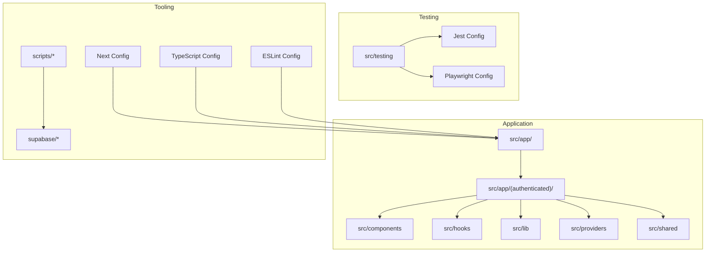
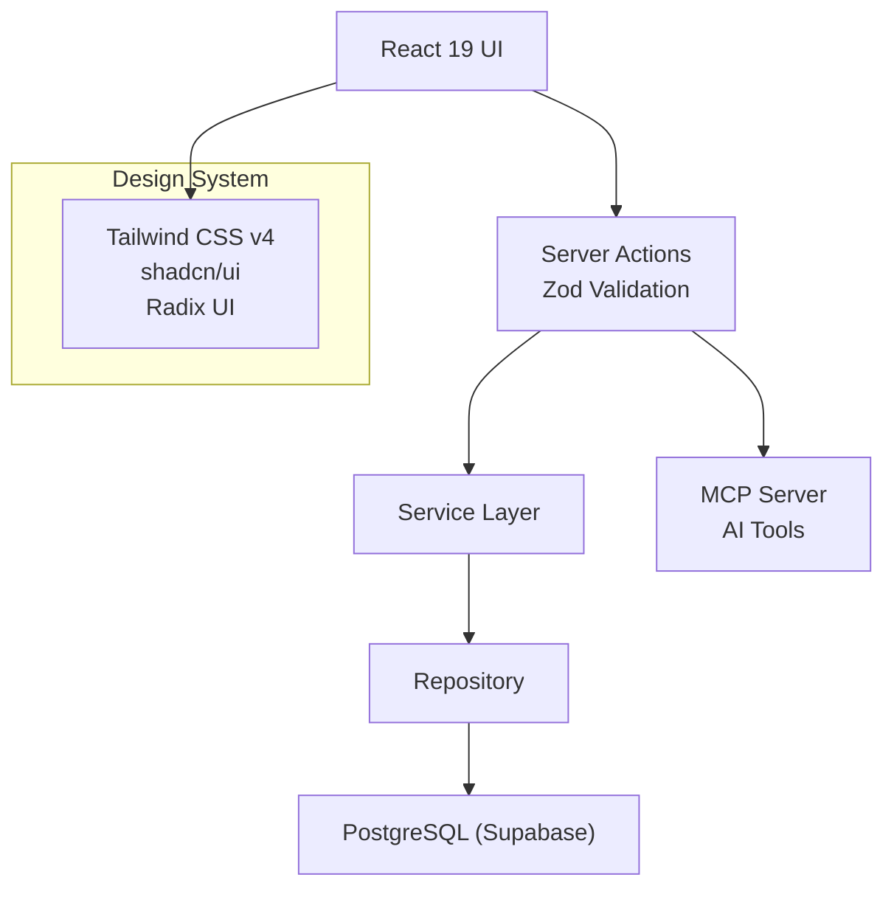
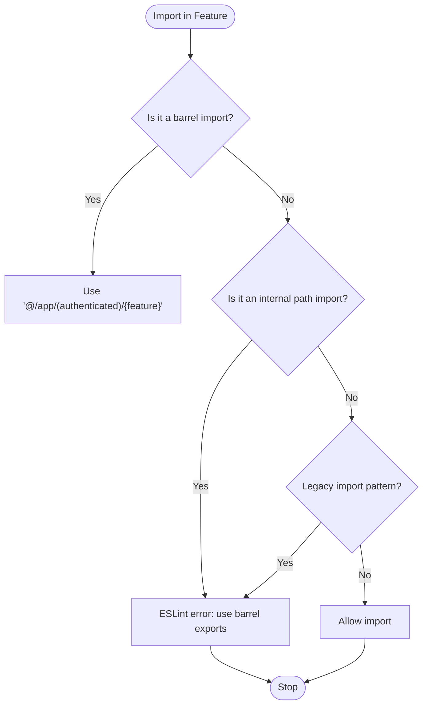
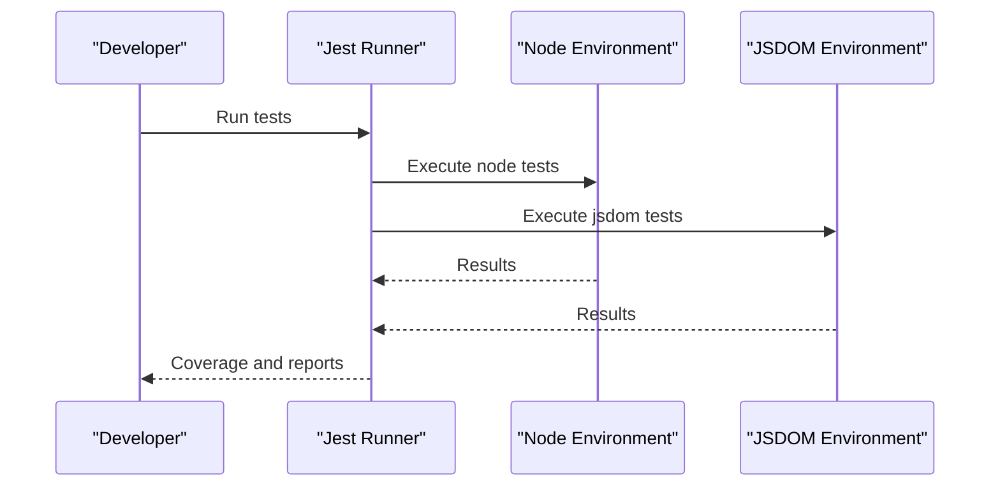
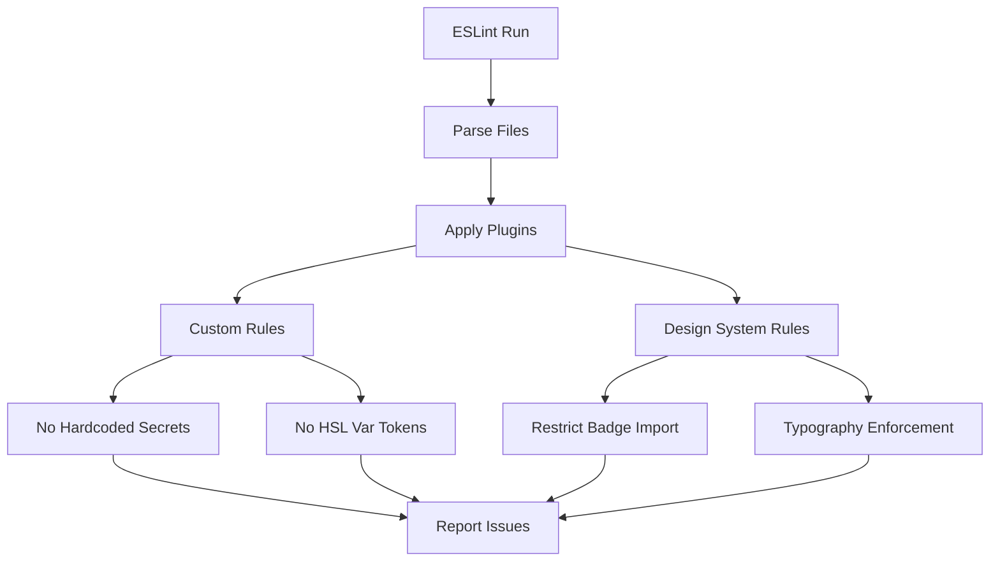
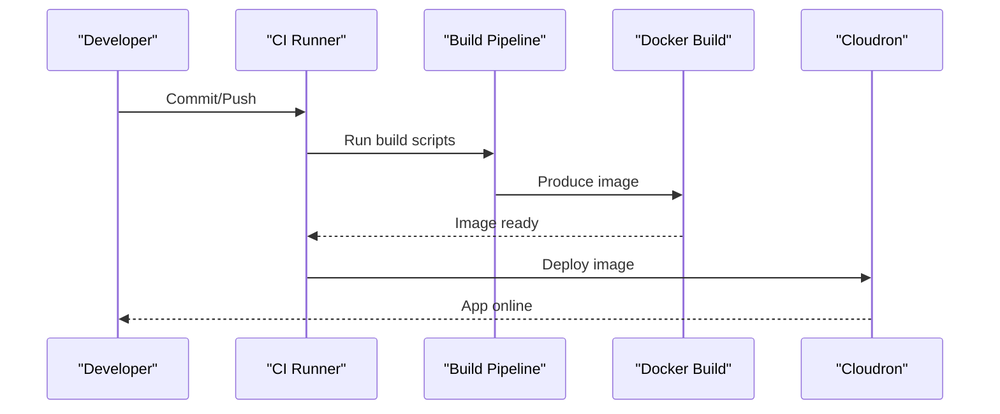
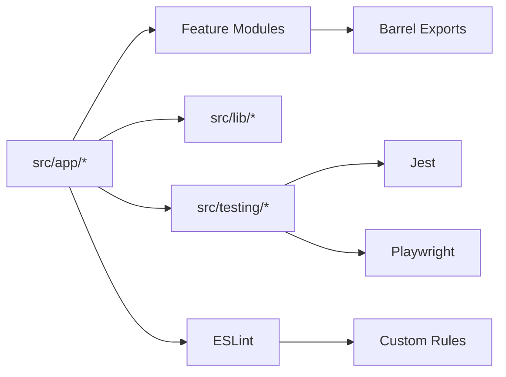

# Development Guide

<cite>
**Referenced Files in This Document**
- [package.json](file://package.json)
- [tsconfig.json](file://tsconfig.json)
- [eslint.config.mjs](file://eslint.config.mjs)
- [jest.config.js](file://jest.config.js)
- [playwright.config.ts](file://playwright.config.ts)
- [next.config.ts](file://next.config.ts)
- [openspec/project.md](file://openspec/project.md)
- [src/app/layout.tsx](file://src/app/layout.tsx)
- [src/app/(authenticated)/processos/index.ts](file://src/app/(authenticated)/processos/index.ts)
- [src/testing/setup.ts](file://src/testing/setup.ts)
- [src/lib/utils.ts](file://src/lib/utils.ts)
- [eslint-rules/no-hardcoded-secrets.js](file://eslint-rules/no-hardcoded-secrets.js)
- [eslint-rules/no-hsl-var-tokens.js](file://eslint-rules/no-hsl-var-tokens.js)
</cite>

## Table of Contents
1. [Introduction](#introduction)
2. [Project Structure](#project-structure)
3. [Core Components](#core-components)
4. [Architecture Overview](#architecture-overview)
5. [Detailed Component Analysis](#detailed-component-analysis)
6. [Dependency Analysis](#dependency-analysis)
7. [Performance Considerations](#performance-considerations)
8. [Troubleshooting Guide](#troubleshooting-guide)
9. [Conclusion](#conclusion)
10. [Appendices](#appendices)

## Introduction
This development guide provides a comprehensive overview of the ZattarOS project’s development environment, architecture, testing strategy, and deployment processes. The project follows an AI-first approach with Next.js 16 App Router, TypeScript, Feature-Sliced Design (FSD), and strict code quality controls enforced by ESLint and custom rules. It integrates Supabase for backend services, implements a robust testing framework with Jest and Playwright, and uses a PWA setup via Serwist. The guide also documents the build pipeline, TypeScript configuration, import restrictions, barrel export patterns, and CI/CD deployment strategies.

## Project Structure
The repository is organized around Next.js App Router conventions with a strong emphasis on modular feature development. Key areas include:
- Application routes under src/app
- Feature modules under src/app/(authenticated) with barrel exports
- Shared utilities under src/lib
- Testing infrastructure under src/testing
- Supabase schema and migrations under supabase
- Developer tooling and scripts under scripts

**Diagram sources**
- [next.config.ts:1-435](file://next.config.ts#L1-L435)
- [tsconfig.json:1-94](file://tsconfig.json#L1-L94)
- [eslint.config.mjs:1-327](file://eslint.config.mjs#L1-L327)
- [jest.config.js:1-119](file://jest.config.js#L1-L119)
- [playwright.config.ts:1-46](file://playwright.config.ts#L1-L46)

**Section sources**
- [openspec/project.md:67-78](file://openspec/project.md#L67-L78)
- [next.config.ts:17-36](file://next.config.ts#L17-L36)

## Core Components
- Feature Modules: Each feature module encapsulates domain, service, repository, actions, components, and types. Barrel exports provide controlled public APIs for cross-module consumption.
- Shared Utilities: Centralized helpers for class merging, casing conversions, HTML stripping, metadata generation, and avatar fallbacks.
- Testing Infrastructure: Jest configuration with dual environments (node and jsdom), extensive mocking for ESM-only and UI libraries, and setup utilities for Next.js App Router and Web Streams.
- Quality Gates: ESLint with Next.js, React, and React Hooks plugins, plus custom rules for secrets, HSL var tokens, and design system governance.

**Section sources**
- [src/app/(authenticated)/processos/index.ts](file://src/app/(authenticated)/processos/index.ts#L1-L225)
- [src/lib/utils.ts:1-161](file://src/lib/utils.ts#L1-L161)
- [jest.config.js:1-119](file://jest.config.js#L1-L119)
- [eslint.config.mjs:1-327](file://eslint.config.mjs#L1-L327)

## Architecture Overview
ZattarOS adopts Feature-Sliced Design with a clear separation of concerns:
- UI (React 19) interacts with Server Actions (validated via Zod)
- Service Layer encapsulates business logic
- Repository Layer abstracts data access
- MCP Server exposes actions as tools for AI agents
- Supabase provides database and auth

**Diagram sources**
- [openspec/project.md:55-65](file://openspec/project.md#L55-L65)
- [src/app/layout.tsx:1-82](file://src/app/layout.tsx#L1-L82)

**Section sources**
- [openspec/project.md:55-65](file://openspec/project.md#L55-L65)
- [src/app/layout.tsx:1-82](file://src/app/layout.tsx#L1-L82)

## Detailed Component Analysis

### Feature-Sliced Design Implementation
- Feature Modules: Each feature module defines a barrel export index that re-exports components, hooks, actions, domain types, and server-only service/repository functions. This enforces controlled imports and reduces coupling.
- Import Restrictions: ESLint restricts direct internal paths within modules and legacy imports from legacy paths, encouraging barrel exports and relative imports within modules.

**Diagram sources**
- [eslint.config.mjs:129-161](file://eslint.config.mjs#L129-L161)
- [src/app/(authenticated)/processos/index.ts](file://src/app/(authenticated)/processos/index.ts#L1-L225)

**Section sources**
- [src/app/(authenticated)/processos/index.ts](file://src/app/(authenticated)/processos/index.ts#L1-L225)
- [eslint.config.mjs:129-161](file://eslint.config.mjs#L129-L161)

### Barrel Export Patterns
- Public API: Feature barrel exports centralize imports and simplify refactoring.
- Internal Access: Prefer direct imports for optimal tree-shaking; use barrel exports sparingly for convenience.

**Section sources**
- [src/app/(authenticated)/processos/index.ts](file://src/app/(authenticated)/processos/index.ts#L10-L16)

### Testing Framework Setup
- Unit/Integration Tests: Jest with ts-jest, dual environments (node and jsdom), and extensive mocking for ESM-only packages, Next.js internals, and UI libraries.
- E2E Tests: Playwright with multiple device targets and a dev server for test execution.
- Test Coverage: Granular coverage reporting per feature area and library.

**Diagram sources**
- [jest.config.js:43-115](file://jest.config.js#L43-L115)
- [playwright.config.ts:1-46](file://playwright.config.ts#L1-L46)

**Section sources**
- [jest.config.js:1-119](file://jest.config.js#L1-L119)
- [playwright.config.ts:1-46](file://playwright.config.ts#L1-L46)
- [src/testing/setup.ts:1-358](file://src/testing/setup.ts#L1-L358)

### Build Process and TypeScript Configuration
- Next.js Configuration: Standalone output, custom cache handler, external server packages, modularize/optimize imports, and PWA integration via Serwist.
- TypeScript Configuration: Strict mode, path aliases, and type roots for consistent resolution across the monorepo-like structure.

**Diagram sources**
- [next.config.ts:79-264](file://next.config.ts#L79-L264)
- [tsconfig.json:1-94](file://tsconfig.json#L1-L94)

**Section sources**
- [next.config.ts:79-264](file://next.config.ts#L79-L264)
- [tsconfig.json:1-94](file://tsconfig.json#L1-L94)

### Code Quality Standards and ESLint Rules
- Standard Rules: TypeScript ESLint, React, React Hooks, and Next.js plugins with recommended configurations.
- Custom Rules:
  - No Hardcoded Secrets: Detects potential secrets in strings.
  - No HSL Var Tokens: Prevents invalid CSS using HSL with var tokens.
- Design System Governance: Prohibits direct Badge imports and enforces semantic typography usage in specific scopes.

**Diagram sources**
- [eslint.config.mjs:1-327](file://eslint.config.mjs#L1-L327)
- [eslint-rules/no-hardcoded-secrets.js:1-43](file://eslint-rules/no-hardcoded-secrets.js#L1-L43)
- [eslint-rules/no-hsl-var-tokens.js:1-77](file://eslint-rules/no-hsl-var-tokens.js#L1-L77)

**Section sources**
- [eslint.config.mjs:1-327](file://eslint.config.mjs#L1-L327)
- [eslint-rules/no-hardcoded-secrets.js:1-43](file://eslint-rules/no-hardcoded-secrets.js#L1-L43)
- [eslint-rules/no-hsl-var-tokens.js:1-77](file://eslint-rules/no-hsl-var-tokens.js#L1-L77)

### Practical Examples

#### Feature Development Example
- Create a new feature module under src/app/(authenticated)/<feature>.
- Define domain types and Zod schemas in domain.ts.
- Implement service.ts with business logic and repository.ts for data access.
- Expose server actions in actions/ and publish a barrel export in index.ts.
- Add components, hooks, and types as needed; keep internal imports private and use barrel exports for public API.

**Section sources**
- [src/app/(authenticated)/processos/index.ts](file://src/app/(authenticated)/processos/index.ts#L1-L225)

#### Testing Implementation Example
- Unit/Integration: Place tests under src/<location>/**/*.test.ts with appropriate jest-environment docblocks.
- E2E: Write spec files under src/testing/e2e/**/*.spec.ts or src/**/__tests__/e2e/**/*.spec.ts.
- Coverage: Use npm run test:coverage:<area> for granular reports.

**Section sources**
- [jest.config.js:25-35](file://jest.config.js#L25-L35)
- [playwright.config.ts:5-8](file://playwright.config.ts#L5-L8)

#### Debugging Techniques
- Use debug memory and prebuild checks during development.
- Enable verbose builds and analyze bundles for performance insights.
- Utilize coverage reports and bundle analyzers to identify hotspots.

**Section sources**
- [package.json:32-43](file://package.json#L32-L43)

### Deployment Processes
- Local Development: Use npm run dev with optional verbose or trace modes.
- Production Builds: Use npm run build with webpack or turbopack variants; standalone output improves container startup.
- PWA: Serwist generates a service worker with runtime caching strategies.
- Docker: Multi-stage builds and scripts are provided for containerization and resource checks.
- Cloud Deployment: Cloudron scripts and manifests are available for Cloudron deployments.

**Diagram sources**
- [package.json:26-31](file://package.json#L26-L31)
- [next.config.ts:84-94](file://next.config.ts#L84-L94)

**Section sources**
- [package.json:26-31](file://package.json#L26-L31)
- [next.config.ts:84-94](file://next.config.ts#L84-L94)

## Dependency Analysis
- Next.js App Router: Routes, layouts, and API endpoints under src/app.
- Feature Modules: Controlled exports via barrel index.ts.
- Shared Libraries: Utilities, design system, and domain logic under src/lib.
- Testing Dependencies: Jest, ts-jest, jsdom, and Playwright.
- Quality Tools: ESLint, custom rules, and Husky for pre-commit enforcement.

**Diagram sources**
- [src/app/(authenticated)/processos/index.ts](file://src/app/(authenticated)/processos/index.ts#L1-L225)
- [jest.config.js:1-119](file://jest.config.js#L1-L119)
- [playwright.config.ts:1-46](file://playwright.config.ts#L1-L46)
- [eslint.config.mjs:1-327](file://eslint.config.mjs#L1-L327)

**Section sources**
- [src/app/(authenticated)/processos/index.ts](file://src/app/(authenticated)/processos/index.ts#L1-L225)
- [jest.config.js:1-119](file://jest.config.js#L1-L119)
- [playwright.config.ts:1-46](file://playwright.config.ts#L1-L46)
- [eslint.config.mjs:1-327](file://eslint.config.mjs#L1-L327)

## Performance Considerations
- Build Optimization: Use standalone output, modularize imports, and optimize package imports for major libraries.
- Memory Management: Prebuild checks and memory-related scripts help diagnose and mitigate memory issues during builds.
- Bundle Analysis: Enable ANALYZE=true to generate bundle analysis reports for performance tuning.

**Section sources**
- [next.config.ts:188-250](file://next.config.ts#L188-L250)
- [package.json:32-43](file://package.json#L32-L43)

## Troubleshooting Guide
- Secret Detection: Run npm run security:check-secrets and gitleaks to detect hardcoded secrets.
- CSS Token Issues: Fix HSL var token violations flagged by custom ESLint rule.
- Test Environment: Ensure proper polyfills and mocks are loaded via src/testing/setup.ts.
- Build Failures: Use verbose builds and prebuild checks to isolate issues.

**Section sources**
- [package.json:47-50](file://package.json#L47-L50)
- [eslint-rules/no-hsl-var-tokens.js:1-77](file://eslint-rules/no-hsl-var-tokens.js#L1-L77)
- [src/testing/setup.ts:1-358](file://src/testing/setup.ts#L1-L358)

## Conclusion
This guide outlines the development workflow, architecture, and operational practices for ZattarOS. By adhering to Feature-Sliced Design, enforcing strict code quality rules, leveraging a robust testing framework, and optimizing the build and deployment pipeline, contributors can maintain a scalable, secure, and high-performance legal management platform.

## Appendices

### Environment Management
- Development: npm run dev with optional flags for verbose or trace output.
- Staging/Production: Use production build scripts and standalone output for improved performance and containerization.

**Section sources**
- [package.json:12-25](file://package.json#L12-L25)
- [next.config.ts:84-94](file://next.config.ts#L84-L94)