# Development Guide

<cite>
**Referenced Files in This Document**
- [package.json](file://package.json)
- [tsconfig.json](file://tsconfig.json)
- [eslint.config.mjs](file://eslint.config.mjs)
- [jest.config.js](file://jest.config.js)
- [playwright.config.ts](file://playwright.config.ts)
- [next.config.ts](file://next.config.ts)
- [openspec/project.md](file://openspec/project.md)
- [src/app/layout.tsx](file://src/app/layout.tsx)
- [src/app/(authenticated)/processos/index.ts](file://src/app/(authenticated)/processos/index.ts)
- [src/testing/setup.ts](file://src/testing/setup.ts)
- [src/lib/utils.ts](file://src/lib/utils.ts)
- [eslint-rules/no-hardcoded-secrets.js](file://eslint-rules/no-hardcoded-secrets.js)
- [eslint-rules/no-hsl-var-tokens.js](file://eslint-rules/no-hsl-var-tokens.js)
- [src/app/(authenticated)/design-system/page.tsx](file://src/app/(authenticated)/design-system/page.tsx)
- [src/app/(authenticated)/design-system/_components/brand-section.tsx](file://src/app/(authenticated)/design-system/_components/brand-section.tsx)
- [design-system/zattaros/Master.md](file://design-system/zattaros/Master.md)
- [design-system/zattaros/pages/captura.md](file://design-system/zattaros/pages/captura.md)
- [src/app/(authenticated)/assinatura-digital/components/editor/MarkdownRichTextEditor.tsx](file://src/app/(authenticated)/assinatura-digital/components/editor/MarkdownRichTextEditor.tsx)
- [src/app/(authenticated)/assinatura-digital/components/editor/MarkdownRichTextEditorDialog.tsx](file://src/app/(authenticated)/assinatura-digital/components/editor/MarkdownRichTextEditorDialog.tsx)
- [src/app/(authenticated)/assinatura-digital/components/editor/MarkdownRichTextEditorDialog.stub.tsx](file://src/app/(authenticated)/assinatura-digital/components/editor/MarkdownRichTextEditorDialog.stub.tsx)
- [src/components/editor/plate/variable-plugin.tsx](file://src/components/editor/plate/variable-plugin.tsx)
- [src/app/(authenticated)/assinatura-digital/components/editor/editor-helpers.ts](file://src/app/(authenticated)/assinatura-digital/components/editor/editor-helpers.ts)
- [src/components/editor/plate/note-editor.tsx](file://src/components/editor/plate/note-editor.tsx)
- [src/components/shared/__tests__/dialog-form-shell.test.tsx](file://src/components/shared/__tests__/dialog-form-shell.test.tsx)
- [src/components/ui/__tests__/responsive-dialog.test.tsx](file://src/components/ui/__tests__/responsive-dialog.test.tsx)
- [src/app/api/ai/command/utils.ts](file://src/app/api/ai/command/utils.ts)
- [src/app/api/plate/ai/prompts.ts](file://src/app/api/plate/ai/prompts.ts)
- [src/app/api/ai/command/prompts.ts](file://src/app/api/ai/command/prompts.ts)
- [src/components/shared/AI_INSTRUCTIONS.md](file://src/components/shared/AI_INSTRUCTIONS.md)
- [src/components/shared/dialog-shell/index.ts](file://src/components/shared/dialog-shell/index.ts)
</cite>

## Update Summary
**Changes Made**
- Enhanced testing infrastructure documentation with comprehensive property-based testing examples for dialogs
- Updated AI instructions formatting documentation with improved structured prompt building utilities
- Added new dialog component patterns section documenting ResponsiveDialog and DialogFormShell implementations
- Expanded testing framework documentation to include fast-check integration and property-based testing strategies
- Updated shared component documentation standards with enhanced dialog component guidelines

## Table of Contents
1. [Introduction](#introduction)
2. [Project Structure](#project-structure)
3. [Core Components](#core-components)
4. [Architecture Overview](#architecture-overview)
5. [Detailed Component Analysis](#detailed-component-analysis)
6. [Enhanced Testing Infrastructure](#enhanced-testing-infrastructure)
7. [Dialog Component Patterns](#dialog-component-patterns)
8. [AI Instructions Formatting](#ai-instructions-formatting)
9. [Dependency Analysis](#dependency-analysis)
10. [Performance Considerations](#performance-considerations)
11. [Troubleshooting Guide](#troubleshooting-guide)
12. [Conclusion](#conclusion)
13. [Appendices](#appendices)

## Introduction
This development guide provides a comprehensive overview of the ZattarOS project's development environment, architecture, testing strategy, and deployment processes. The project follows an AI-first approach with Next.js 16 App Router, TypeScript, Feature-Sliced Design (FSD), and strict code quality controls enforced by ESLint and custom rules. It integrates Supabase for backend services, implements a robust testing framework with Jest, Playwright, and property-based testing using fast-check, and uses a PWA setup via Serwist. The guide also documents the build pipeline, TypeScript configuration, import restrictions, barrel export patterns, and CI/CD deployment strategies.

**Updated** Enhanced with comprehensive property-based testing infrastructure for dialog components, improved AI instructions formatting with structured prompt building utilities, and updated shared component documentation standards with new dialog component patterns.

## Project Structure
The repository is organized around Next.js App Router conventions with a strong emphasis on modular feature development. Key areas include:
- Application routes under src/app
- Feature modules under src/app/(authenticated) with barrel exports
- Shared utilities under src/lib
- Testing infrastructure under src/testing with property-based testing capabilities
- Supabase schema and migrations under supabase
- Developer tooling and scripts under scripts
- Design system showcase pages under src/app/(authenticated)/design-system
- Rich text editors under src/app/(authenticated)/assinatura-digital/components/editor
- Dialog components under src/components/shared/dialog-shell and src/components/ui/responsive-dialog

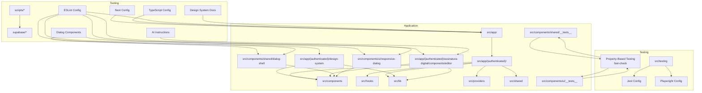

**Diagram sources**
- [next.config.ts:1-435](file://next.config.ts#L1-L435)
- [tsconfig.json:1-94](file://tsconfig.json#L1-L94)
- [eslint.config.mjs:1-273](file://eslint.config.mjs#L1-L273)
- [jest.config.js:1-119](file://jest.config.js#L1-L119)
- [playwright.config.ts:1-46](file://playwright.config.ts#L1-L46)

**Section sources**
- [openspec/project.md:67-78](file://openspec/project.md#L67-L78)
- [next.config.ts:17-36](file://next.config.ts#L17-L36)

## Core Components
- Feature Modules: Each feature module encapsulates domain, service, repository, actions, components, and types. Barrel exports provide controlled public APIs for cross-module consumption.
- Shared Utilities: Centralized helpers for class merging, casing conversions, HTML stripping, metadata generation, and avatar fallbacks.
- Enhanced Testing Infrastructure: Jest configuration with dual environments (node and jsdom), extensive mocking for ESM-only and UI libraries, property-based testing with fast-check for dialog components, and setup utilities for Next.js App Router and Web Streams.
- Quality Gates: ESLint with Next.js, React, and React Hooks plugins, plus custom rules for secrets, HSL var tokens, and design system governance with streamlined enforcement.
- Rich Text Editors: Advanced Markdown editor with variable insertion, conflict resolution, and serialization support.
- Dialog Components: Comprehensive dialog system with ResponsiveDialog for mobile-first design and DialogFormShell for form-based interactions.

**Section sources**
- [src/app/(authenticated)/processos/index.ts](file://src/app/(authenticated)/processos/index.ts#L1-L225)
- [src/lib/utils.ts:1-161](file://src/lib/utils.ts#L1-L161)
- [jest.config.js:1-119](file://jest.config.js#L1-L119)
- [eslint.config.mjs:1-273](file://eslint.config.mjs#L1-L273)

## Architecture Overview
ZattarOS adopts Feature-Sliced Design with a clear separation of concerns:
- UI (React 19) interacts with Server Actions (validated via Zod)
- Service Layer encapsulates business logic
- Repository Layer abstracts data access
- MCP Server exposes actions as tools for AI agents
- Supabase provides database and auth
- Rich text editors utilize Plate.js with custom variable plugins
- Dialog components provide responsive modal interfaces with property-based testing validation

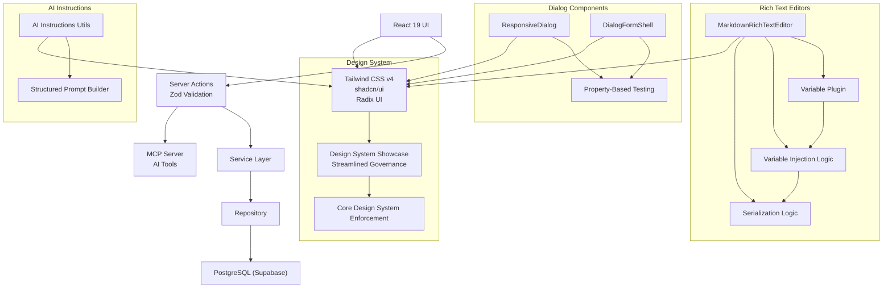

**Diagram sources**
- [openspec/project.md:55-65](file://openspec/project.md#L55-L65)
- [src/app/layout.tsx:1-82](file://src/app/layout.tsx#L1-L82)
- [src/app/(authenticated)/assinatura-digital/components/editor/MarkdownRichTextEditor.tsx:62-104](file://src/app/(authenticated)/assinatura-digital/components/editor/MarkdownRichTextEditor.tsx#L62-L104)
- [src/components/ui/responsive-dialog.tsx](file://src/components/ui/responsive-dialog.tsx)
- [src/components/shared/dialog-shell/dialog-form-shell.tsx](file://src/components/shared/dialog-shell/dialog-form-shell.tsx)

**Section sources**
- [openspec/project.md:55-65](file://openspec/project.md#L55-L65)
- [src/app/layout.tsx:1-82](file://src/app/layout.tsx#L1-L82)

## Detailed Component Analysis

### Feature-Sliced Design Implementation
- Feature Modules: Each feature module defines a barrel export index that re-exports components, hooks, actions, domain types, and server-only service/repository functions. This enforces controlled imports and reduces coupling.
- Import Restrictions: ESLint restricts direct internal paths within modules and legacy imports from legacy paths, encouraging barrel exports and relative imports within modules.


**Diagram sources**
- [eslint.config.mjs:115-145](file://eslint.config.mjs#L115-L145)
- [src/app/(authenticated)/processos/index.ts](file://src/app/(authenticated)/processos/index.ts#L1-L225)

**Section sources**
- [src/app/(authenticated)/processos/index.ts](file://src/app/(authenticated)/processos/index.ts#L1-L225)
- [eslint.config.mjs:115-145](file://eslint.config.mjs#L115-L145)

### Streamlined Design System Showcase Page Configuration

**Updated** The ESLint configuration now focuses on core design system governance with streamlined enforcement for design system showcase pages.

The design system showcase pages under `src/app/(authenticated)/design-system` serve as educational demonstrations of design system components. The streamlined governance approach maintains design system consistency while allowing legitimate raw component usage in demonstrations.

Key aspects of the streamlined governance include:

- **Badge Import Restrictions**: Prevents direct Badge imports in feature code while allowing them in design system showcase pages
- **Core Design System Enforcement**: Focuses on semantic typography usage and color token consistency
- **Targeted Exception Handling**: Only applies to authenticated design system showcase pages, not to product feature code
- **Educational Demonstration Scope**: Enables raw component usage in showcase pages while maintaining strict enforcement in feature modules

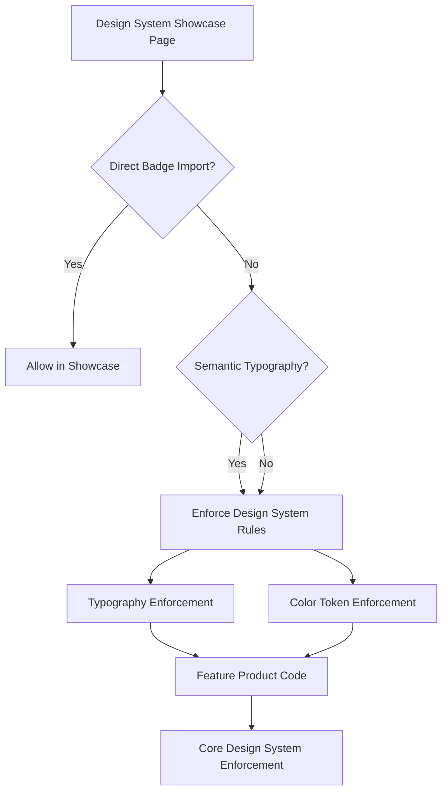

**Diagram sources**
- [eslint.config.mjs:184-206](file://eslint.config.mjs#L184-L206)
- [eslint.config.mjs:206-269](file://eslint.config.mjs#L206-L269)

**Section sources**
- [eslint.config.mjs:184-206](file://eslint.config.mjs#L184-L206)
- [eslint.config.mjs:206-269](file://eslint.config.mjs#L206-L269)
- [src/app/(authenticated)/design-system/page.tsx:30](file://src/app/(authenticated)/design-system/page.tsx#L30)

### Rich Text Editor Architecture and Variable Naming Conflict Resolution

**Updated** Enhanced with comprehensive variable naming conflict resolution improvements in MarkdownRichTextEditor components.

The MarkdownRichTextEditor components implement sophisticated variable injection and conflict prevention mechanisms to ensure reliable markdown processing and variable substitution.

#### Variable Injection and Serialization Logic

The editor uses a two-phase approach for variable handling:

1. **Deserialization Phase**: Converts markdown text to Plate.js Value with variable nodes injected
2. **Serialization Phase**: Converts Plate.js Value back to markdown with proper variable formatting

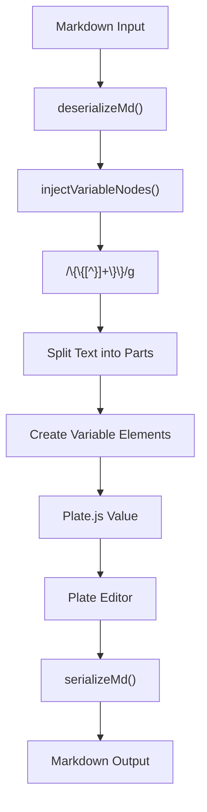

**Diagram sources**
- [src/app/(authenticated)/assinatura-digital/components/editor/MarkdownRichTextEditor.tsx:62-104](file://src/app/(authenticated)/assinatura-digital/components/editor/MarkdownRichTextEditor.tsx#L62-L104)
- [src/app/(authenticated)/assinatura-digital/components/editor/MarkdownRichTextEditor.tsx:211-248](file://src/app/(authenticated)/assinatura-digital/components/editor/MarkdownRichTextEditor.tsx#L211-L248)

#### Variable Plugin Implementation

The variable plugin provides specialized handling for variable elements:

- **Element Type**: Uses `VARIABLE_ELEMENT` constant for consistent identification
- **Component Rendering**: Displays variables as inline spans with proper styling
- **Conflict Prevention**: Prevents variable name collisions through unique key generation
- **Insertion Logic**: Provides controlled insertion of variables at cursor position

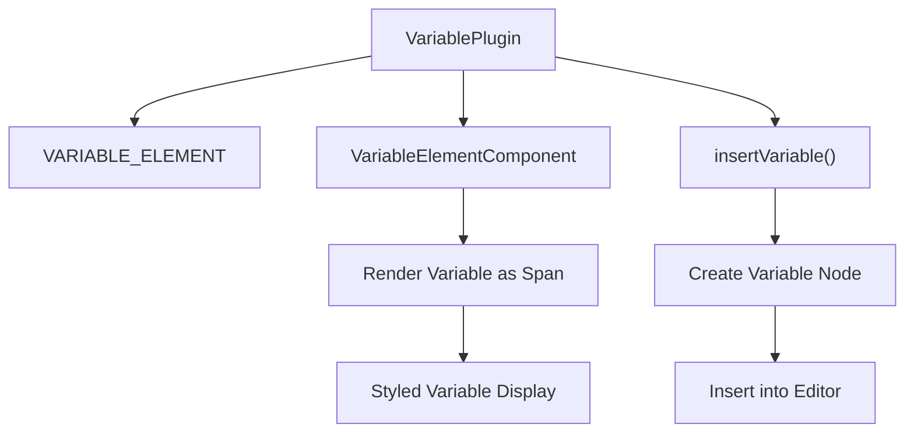

**Diagram sources**
- [src/components/editor/plate/variable-plugin.tsx:10-56](file://src/components/editor/plate/variable-plugin.tsx#L10-L56)

#### Conflict Resolution Mechanisms

The system implements multiple layers of conflict prevention:

1. **Variable Name Normalization**: Ensures consistent variable key formatting
2. **Duplicate Prevention**: Prevents insertion of identical variables
3. **State Synchronization**: Prevents infinite loops during value updates
4. **Regex State Isolation**: Uses separate regex instances to avoid state sharing issues

**Section sources**
- [src/app/(authenticated)/assinatura-digital/components/editor/MarkdownRichTextEditor.tsx:62-104](file://src/app/(authenticated)/assinatura-digital/components/editor/MarkdownRichTextEditor.tsx#L62-L104)
- [src/app/(authenticated)/assinatura-digital/components/editor/MarkdownRichTextEditor.tsx:208-248](file://src/app/(authenticated)/assinatura-digital/components/editor/MarkdownRichTextEditor.tsx#L208-L248)
- [src/components/editor/plate/variable-plugin.tsx:10-56](file://src/components/editor/plate/variable-plugin.tsx#L10-L56)
- [src/app/(authenticated)/assinatura-digital/components/editor/editor-helpers.ts:95-107](file://src/app/(authenticated)/assinatura-digital/components/editor/editor-helpers.ts#L95-L107)

### Barrel Export Patterns
- Public API: Feature barrel exports centralize imports and simplify refactoring.
- Internal Access: Prefer direct imports for optimal tree-shaking; use barrel exports sparingly for convenience.

**Section sources**
- [src/app/(authenticated)/processos/index.ts](file://src/app/(authenticated)/processos/index.ts#L10-L16)

## Enhanced Testing Infrastructure

**New Section** Comprehensive documentation of the enhanced testing infrastructure with property-based testing capabilities.

### Property-Based Testing with fast-check

The testing infrastructure now includes comprehensive property-based testing for dialog components using fast-check, providing mathematical guarantees about component behavior across a wide range of inputs.

#### DialogFormShell Property-Based Tests

The DialogFormShell component undergoes rigorous property-based testing to ensure consistent behavior across different scenarios:

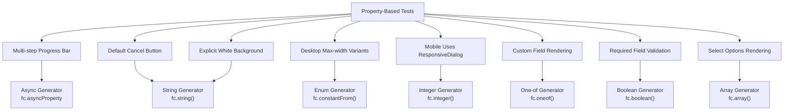

**Diagram sources**
- [src/components/shared/__tests__/dialog-form-shell.test.tsx:28-67](file://src/components/shared/__tests__/dialog-form-shell.test.tsx#L28-L67)
- [src/components/shared/__tests__/dialog-form-shell.test.tsx:76-111](file://src/components/shared/__tests__/dialog-form-shell.test.tsx#L76-L111)
- [src/components/shared/__tests__/dialog-form-shell.test.tsx:120-154](file://src/components/shared/__tests__/dialog-form-shell.test.tsx#L120-L154)
- [src/components/shared/__tests__/dialog-form-shell.test.tsx:163-195](file://src/components/shared/__tests__/dialog-form-shell.test.tsx#L163-L195)
- [src/components/shared/__tests__/dialog-form-shell.test.tsx:204-236](file://src/components/shared/__tests__/dialog-form-shell.test.tsx#L204-L236)
- [src/components/shared/__tests__/dialog-form-shell.test.tsx:284-393](file://src/components/shared/__tests__/dialog-form-shell.test.tsx#L284-L393)
- [src/components/shared/__tests__/dialog-form-shell.test.tsx:402-437](file://src/components/shared/__tests__/dialog-form-shell.test.tsx#L402-L437)
- [src/components/shared/__tests__/dialog-form-shell.test.tsx:446-495](file://src/components/shared/__tests__/dialog-form-shell.test.tsx#L446-L495)

#### ResponsiveDialog Property-Based Tests

The ResponsiveDialog component receives comprehensive property-based testing for mobile responsiveness:

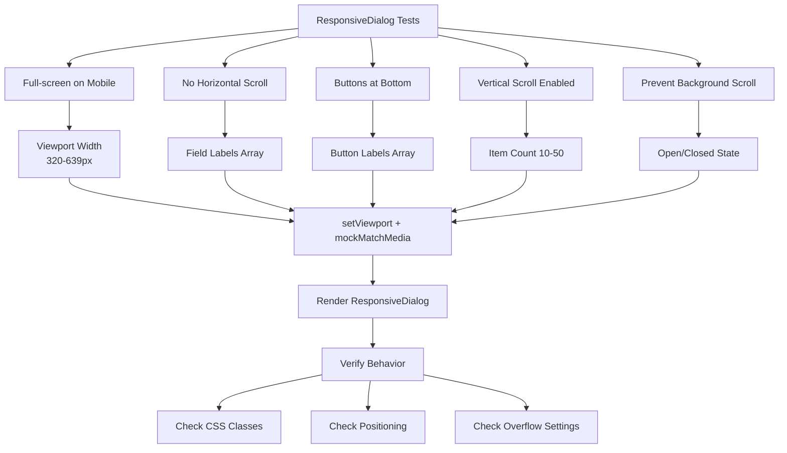

**Diagram sources**
- [src/components/ui/__tests__/responsive-dialog.test.tsx:54-90](file://src/components/ui/__tests__/responsive-dialog.test.tsx#L54-L90)
- [src/components/ui/__tests__/responsive-dialog.test.tsx:99-149](file://src/components/ui/__tests__/responsive-dialog.test.tsx#L99-L149)
- [src/components/ui/__tests__/responsive-dialog.test.tsx:158-202](file://src/components/ui/__tests__/responsive-dialog.test.tsx#L158-L202)
- [src/components/ui/__tests__/responsive-dialog.test.tsx:211-257](file://src/components/ui/__tests__/responsive-dialog.test.tsx#L211-L257)
- [src/components/ui/__tests__/responsive-dialog.test.tsx:266-313](file://src/components/ui/__tests__/responsive-dialog.test.tsx#L266-L313)

### Testing Framework Setup
- Unit/Integration Tests: Jest with ts-jest, dual environments (node and jsdom), and extensive mocking for ESM-only packages, Next.js internals, and UI libraries.
- Property-Based Tests: fast-check integration for comprehensive dialog component validation with mathematical guarantees.
- E2E Tests: Playwright with multiple device targets and a dev server for test execution.
- Test Coverage: Granular coverage reporting per feature area and library.

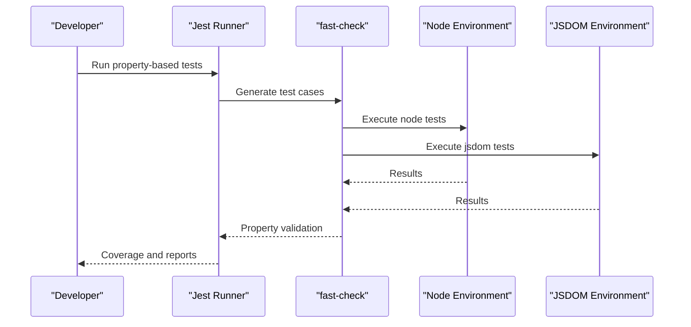

**Diagram sources**
- [jest.config.js:43-115](file://jest.config.js#L43-L115)
- [playwright.config.ts:1-46](file://playwright.config.ts#L1-L46)
- [src/components/shared/__tests__/dialog-form-shell.test.tsx:8](file://src/components/shared/__tests__/dialog-form-shell.test.tsx#L8)
- [src/components/ui/__tests__/responsive-dialog.test.tsx:12](file://src/components/ui/__tests__/responsive-dialog.test.tsx#L12)

**Section sources**
- [jest.config.js:1-119](file://jest.config.js#L1-L119)
- [playwright.config.ts:1-46](file://playwright.config.ts#L1-L46)
- [src/testing/setup.ts:1-358](file://src/testing/setup.ts#L1-L358)

### Build Process and TypeScript Configuration
- Next.js Configuration: Standalone output, custom cache handler, external server packages, modularize/optimize imports, and PWA integration via Serwist.
- TypeScript Configuration: Strict mode, path aliases, and type roots for consistent resolution across the monorepo-like structure.


**Diagram sources**
- [next.config.ts:79-264](file://next.config.ts#L79-L264)
- [tsconfig.json:1-94](file://tsconfig.json#L1-L94)

**Section sources**
- [next.config.ts:79-264](file://next.config.ts#L79-L264)
- [tsconfig.json:1-94](file://tsconfig.json#L1-L94)

### Code Quality Standards and ESLint Rules

**Updated** Enhanced with streamlined design system governance and comprehensive variable naming conflict resolution documentation.

- Standard Rules: TypeScript ESLint, React, React Hooks, and Next.js plugins with recommended configurations.
- Custom Rules:
  - No Hardcoded Secrets: Detects potential secrets in strings.
  - No HSL Var Tokens: Prevents invalid CSS using HSL with var tokens.
- Streamlined Design System Governance: Focuses on core design system enforcement with targeted restrictions for Badge imports and color token usage, while maintaining flexibility for showcase pages.
- Variable Conflict Prevention: Implements strict variable naming conventions and conflict resolution mechanisms in rich text editors.
- Property-Based Testing: Mathematical guarantees for dialog component behavior validation.

The streamlined ESLint configuration focuses on core design system enforcement:

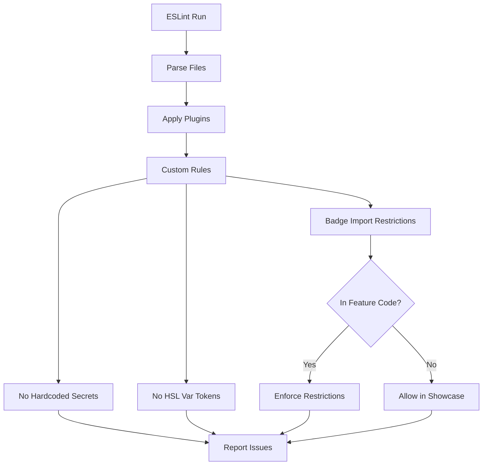

**Diagram sources**
- [eslint.config.mjs:1-273](file://eslint.config.mjs#L1-L273)
- [eslint-rules/no-hardcoded-secrets.js:1-43](file://eslint-rules/no-hardcoded-secrets.js#L1-L43)
- [eslint-rules/no-hsl-var-tokens.js:1-77](file://eslint-rules/no-hsl-var-tokens.js#L1-L77)

**Section sources**
- [eslint.config.mjs:1-273](file://eslint.config.mjs#L1-L273)
- [eslint-rules/no-hardcoded-secrets.js:1-43](file://eslint-rules/no-hardcoded-secrets.js#L1-L43)
- [eslint-rules/no-hsl-var-tokens.js:1-77](file://eslint-rules/no-hsl-var-tokens.js#L1-L77)

### Practical Examples

#### Feature Development Example
- Create a new feature module under src/app/(authenticated)/<feature>.
- Define domain types and Zod schemas in domain.ts.
- Implement service.ts with business logic and repository.ts for data access.
- Expose server actions in actions/ and publish a barrel export in index.ts.
- Add components, hooks, and types as needed; keep internal imports private and use barrel exports for public API.

**Section sources**
- [src/app/(authenticated)/processos/index.ts](file://src/app/(authenticated)/processos/index.ts#L1-L225)

#### Design System Showcase Page Development Example

**Updated** Enhanced showcase page development with streamlined governance and variable conflict prevention.

When creating design system showcase pages:

1. **Follow the streamlined design system governance** with targeted restrictions for Badge imports
2. **Use semantic typography** and color tokens consistently
3. **Implement proper variable naming conventions** to prevent conflicts in educational examples
4. **Focus on core design system principles** rather than raw component demonstrations

Example of proper design system usage:
```typescript
// Using semantic typography and color tokens
<Heading level="section">Design System Components</Heading>
<Text variant="body">Demonstrating semantic typography</Text>
<div className="text-primary bg-background">
  Using semantic color tokens
</div>
```

**Section sources**
- [src/app/(authenticated)/design-system/page.tsx:30](file://src/app/(authenticated)/design-system/page.tsx#L30)
- [design-system/zattaros/Master.md:1-175](file://design-system/zattaros/Master.md#L1-L175)
- [design-system/zattaros/pages/captura.md:1-48](file://design-system/zattaros/pages/captura.md#L1-L48)

#### Rich Text Editor Development Example

**Updated** Enhanced editor development with comprehensive variable conflict resolution.

When implementing rich text editors:

1. **Use the variable plugin system** for consistent variable handling
2. **Implement proper variable injection logic** to prevent naming conflicts
3. **Utilize the injectVariableNodes function** for safe deserialization
4. **Follow the serialization pattern** to maintain variable integrity

Example of variable injection:
```typescript
function injectVariableNodes(value: Value): Value {
  return value.map((block) => injectInNode(block as Record<string, unknown>)) as Value;
}

function injectInNode(node: Record<string, unknown>): Record<string, unknown> {
  const children = node.children as Record<string, unknown>[] | undefined;
  if (!children) return node;

  const newChildren: unknown[] = [];
  for (const child of children) {
    const childText = child.text as string | undefined;
    if (typeof childText === 'string' && VARIABLE_TEST_REGEX.test(childText)) {
      // Use separate regex instance to avoid state sharing
      const varRegex = /\{\{([^}]+)\}\}/g;
      // ... variable injection logic
    }
  }
  return { ...node, children: newChildren };
}
```

**Section sources**
- [src/app/(authenticated)/assinatura-digital/components/editor/MarkdownRichTextEditor.tsx:62-104](file://src/app/(authenticated)/assinatura-digital/components/editor/MarkdownRichTextEditor.tsx#L62-L104)
- [src/components/editor/plate/variable-plugin.tsx:48-56](file://src/components/editor/plate/variable-plugin.tsx#L48-L56)

#### Dialog Component Development Example

**New Section** Comprehensive example of implementing dialog components with property-based testing.

When developing dialog components:

1. **Use ResponsiveDialog for mobile-first design** with automatic Sheet usage on mobile
2. **Implement DialogFormShell for form-based interactions** with comprehensive property validation
3. **Follow the property-based testing patterns** demonstrated in existing tests
4. **Ensure proper accessibility and responsive behavior** across all viewport sizes

Example of property-based testing pattern:
```typescript
test('Property 34: DialogFormShell uses ResponsiveDialog on mobile', async () => {
  fc.assert(
    await fc.asyncProperty(
      fc.integer({ min: 320, max: 639 }),
      async (width) => {
        setViewport({ width, height: 667 });
        
        const { container } = render(
          <DialogFormShell
            open={true}
            onOpenChange={mockOnOpenChange}
            title="Mobile Dialog"
          >
            <div>Content</div>
          </DialogFormShell>
        );

        await waitFor(() => {
          const sheetContent = container.querySelector('[data-slot="sheet-content"]');
          const dialogContent = container.querySelector('[data-slot="responsive-dialog-content"]') ||
            container.querySelector('[data-slot="dialog-content"]');

          expect(sheetContent || dialogContent).toBeInTheDocument();
        });
      }
    ),
    { numRuns: 50 }
  );
});
```

**Section sources**
- [src/components/shared/__tests__/dialog-form-shell.test.tsx:204-236](file://src/components/shared/__tests__/dialog-form-shell.test.tsx#L204-L236)
- [src/components/ui/__tests__/responsive-dialog.test.tsx:54-90](file://src/components/ui/__tests__/responsive-dialog.test.tsx#L54-L90)

#### Testing Implementation Example
- Unit/Integration: Place tests under src/<location>/**/*.test.ts with appropriate jest-environment docblocks.
- Property-Based: Use fast-check generators for comprehensive dialog component validation.
- E2E: Write spec files under src/testing/e2e/**/*.spec.ts or src/**/__tests__/e2e/**/*.spec.ts.
- Coverage: Use npm run test:coverage:<area> for granular reports.

**Section sources**
- [jest.config.js:25-35](file://jest.config.js#L25-L35)
- [playwright.config.ts:5-8](file://playwright.config.ts#L5-L8)

#### Debugging Techniques
- Use debug memory and prebuild checks during development.
- Enable verbose builds and analyze bundles for performance insights.
- Utilize coverage reports and bundle analyzers to identify hotspots.
- Debug variable conflicts using regex state isolation and proper variable key generation.
- Monitor design system governance violations in ESLint output.
- Use property-based testing to identify edge cases in dialog component behavior.
- Leverage fast-check's shrinking capabilities to isolate failing test cases.

**Section sources**
- [package.json:32-43](file://package.json#L32-L43)

### Deployment Processes
- Local Development: Use npm run dev with optional verbose or trace modes.
- Production Builds: Use npm run build with webpack or turbopack variants; standalone output improves container startup.
- PWA: Serwist generates a service worker with runtime caching strategies.
- Docker: Multi-stage builds and scripts are provided for containerization and resource checks.
- Cloud Deployment: Cloudron scripts and manifests are available for Cloudron deployments.

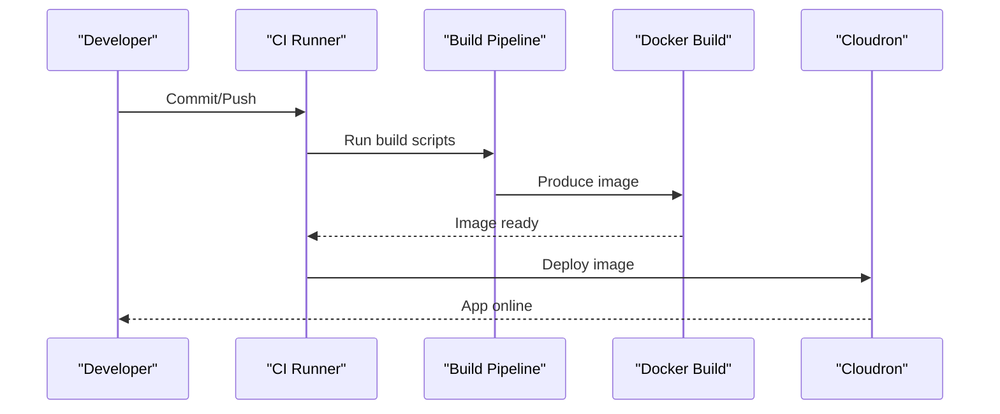

**Diagram sources**
- [package.json:26-31](file://package.json#L26-L31)
- [next.config.ts:84-94](file://next.config.ts#L84-L94)

**Section sources**
- [package.json:26-31](file://package.json#L26-L31)
- [next.config.ts:84-94](file://next.config.ts#L84-L94)

## Dialog Component Patterns

**New Section** Comprehensive documentation of dialog component patterns and best practices.

### ResponsiveDialog Pattern

The ResponsiveDialog component implements a mobile-first design pattern that automatically adapts between Sheet (mobile) and Dialog (desktop) based on viewport size.

#### Mobile Behavior
- Uses Sheet component for full-screen experience on mobile devices
- Implements proper scroll handling and background scroll prevention
- Ensures accessibility compliance with proper ARIA attributes
- Provides sticky footer positioning for action buttons

#### Desktop Behavior
- Uses standard Dialog component for traditional modal experience
- Maintains proper z-index stacking and overlay behavior
- Supports keyboard navigation and focus management
- Provides escape key handling and click-outside-to-close functionality

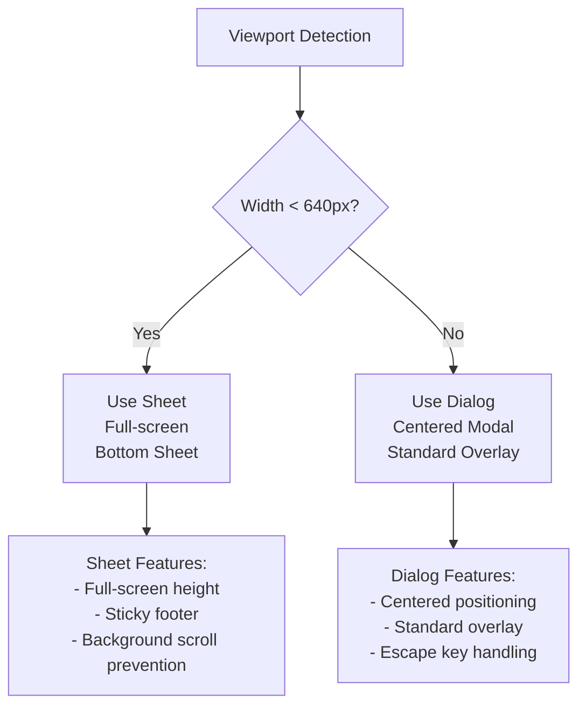

**Diagram sources**
- [src/components/ui/__tests__/responsive-dialog.test.tsx:319-355](file://src/components/ui/__tests__/responsive-dialog.test.tsx#L319-L355)

### DialogFormShell Pattern

The DialogFormShell component provides a comprehensive form-based dialog interface with built-in validation, multi-step support, and responsive behavior.

#### Core Features
- **Multi-step Support**: Built-in progress indication and navigation
- **Responsive Design**: Automatic adaptation to mobile and desktop layouts
- **Accessibility**: Proper ARIA attributes and keyboard navigation
- **Validation**: Integration with form validation libraries
- **Customizable Footer**: Flexible action button placement

#### Property-Based Testing Strategy
The DialogFormShell undergoes comprehensive property-based testing to ensure mathematical guarantees about its behavior:

1. **Multi-step Progress Bar**: Validates progress bar rendering for any valid current/total combination
2. **Default Cancel Button**: Ensures cancel button presence and styling regardless of title content
3. **Max-width Variants**: Tests all supported max-width values on desktop viewports
4. **Background Consistency**: Validates explicit white background across all configurations
5. **Mobile Responsiveness**: Confirms Sheet usage on mobile viewports
6. **Custom Field Rendering**: Validates field properties preservation for all supported field types
7. **Required Field Validation**: Ensures required attribute propagation for form fields
8. **Select Options Rendering**: Tests option rendering for dynamically generated select fields

**Section sources**
- [src/components/shared/__tests__/dialog-form-shell.test.tsx:28-67](file://src/components/shared/__tests__/dialog-form-shell.test.tsx#L28-L67)
- [src/components/shared/__tests__/dialog-form-shell.test.tsx:76-111](file://src/components/shared/__tests__/dialog-form-shell.test.tsx#L76-L111)
- [src/components/shared/__tests__/dialog-form-shell.test.tsx:120-154](file://src/components/shared/__tests__/dialog-form-shell.test.tsx#L120-L154)
- [src/components/shared/__tests__/dialog-form-shell.test.tsx:163-195](file://src/components/shared/__tests__/dialog-form-shell.test.tsx#L163-L195)
- [src/components/shared/__tests__/dialog-form-shell.test.tsx:204-236](file://src/components/shared/__tests__/dialog-form-shell.test.tsx#L204-L236)
- [src/components/shared/__tests__/dialog-form-shell.test.tsx:284-393](file://src/components/shared/__tests__/dialog-form-shell.test.tsx#L284-L393)
- [src/components/shared/__tests__/dialog-form-shell.test.tsx:402-437](file://src/components/shared/__tests__/dialog-form-shell.test.tsx#L402-L437)
- [src/components/shared/__tests__/dialog-form-shell.test.tsx:446-495](file://src/components/shared/__tests__/dialog-form-shell.test.tsx#L446-L495)

### Dialog Shell Index Pattern

The dialog shell components are organized under a centralized index for easy import and usage:

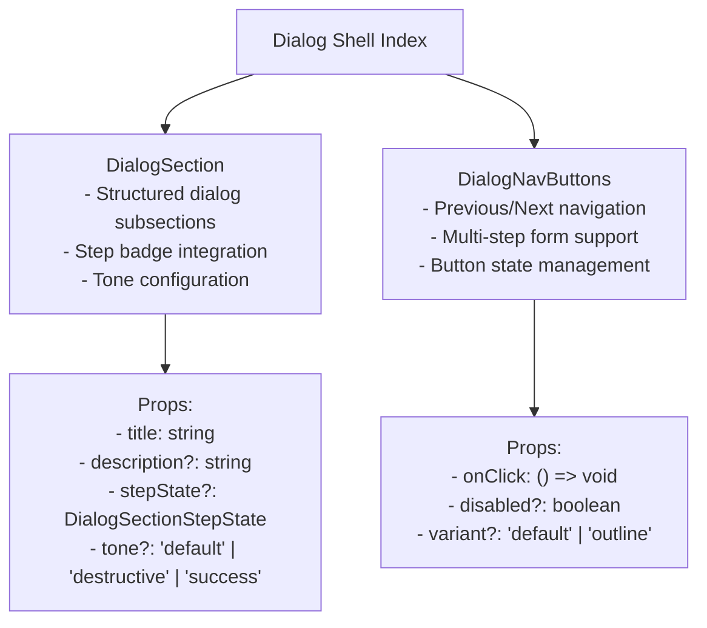

**Diagram sources**
- [src/components/shared/dialog-shell/index.ts:1-10](file://src/components/shared/dialog-shell/index.ts#L1-L10)

**Section sources**
- [src/components/shared/dialog-shell/index.ts:1-10](file://src/components/shared/dialog-shell/index.ts#L1-L10)

## AI Instructions Formatting

**New Section** Comprehensive documentation of AI instructions formatting and structured prompt building utilities.

### Structured Prompt Building

The AI instructions system provides comprehensive utilities for building structured prompts with mathematical guarantees about formatting and content organization.

#### Prompt Structure Components

The `buildStructuredPrompt` function organizes AI interactions into a standardized structure:

1. **Context Section**: Background information, tone, rules, examples, and conversation history
2. **Task Definition**: Clear task statement and immediate instructions
3. **Thinking Phase**: Optional reasoning steps for complex tasks
4. **Output Formatting**: Structured output specifications
5. **Prefilled Response**: Optional response starters

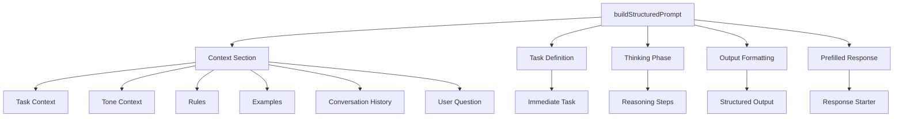

**Diagram sources**
- [src/app/api/ai/command/utils.ts:92-161](file://src/app/api/ai/command/utils.ts#L92-L161)

#### AI Instructions Documentation Standards

The AI instructions documentation provides comprehensive guidelines for agent developers:

##### System Design Mandate: "Neon Magistrate"

The project follows a mandatory "Neon Magistrate" system design that prioritizes advanced primitive injection over native shadcn classes:

1. **Glass Panel Effects**: Use `<GlassPanel depth={1 | 2 | 3}>` instead of basic div backgrounds
2. **Atmospheric Effects**: Inject glow and blur effects behind hero components
3. **Dynamic Numeric Indicators**: Wrap key metrics in `<AnimatedNumber value={value} />`
4. **Trend Visualization**: Use `<Sparkline data={trendArray} />` for dashboard trends
5. **High-Definition Micro-typography**: Use custom font-display fonts for headlines
6. **Uniform Geometric Tokens**: Replace old utilities with modern syntax

##### Component Reference Patterns

The documentation provides standardized component usage patterns:

| Use Case | Component | Import |
|----------|-----------|---------|
| Page Layout | `PageShell` | `@/components/shared/page-shell` |
| Table Page | `DataShell` + `DataTable` | `@/components/shared/data-shell` |
| Table Toolbar | `DataTableToolbar` | `@/components/shared/data-shell` |
| Table Pagination | `DataPagination` | `@/components/shared/data-shell` |
| Sortable Column Header | `DataTableColumnHeader` | `@/components/shared/data-shell` |
| Form Dialog | `DialogFormShell` | `@/components/shared/dialog-form-shell` |
| Empty State | `EmptyState` | `@/components/shared/empty-state` |

##### Deprecated Components

The documentation maintains a comprehensive list of deprecated components with migration instructions:

| Deprecated Component | Reason | Replacement |
|---------------------|--------|-------------|
| `TableToolbar` | Legacy | `DataTableToolbar` |
| `TableWithToolbar` | Legacy | `DataShell` + `DataTable` |
| `ResponsiveTable` | Legacy | `DataTable` |
| `TablePagination` directly | Use wrapper | `DataPagination` |

**Section sources**
- [src/app/api/ai/command/utils.ts:1-304](file://src/app/api/ai/command/utils.ts#L1-L304)
- [src/components/shared/AI_INSTRUCTIONS.md:1-770](file://src/components/shared/AI_INSTRUCTIONS.md#L1-L770)

### AI Prompt Classification

The AI system includes sophisticated prompt classification utilities for determining appropriate AI interaction modes:

#### Classification Modes

The system classifies user requests into three distinct modes:

1. **Generate Mode**: Creative content generation, document creation, summarization
2. **Edit Mode**: Text modification, grammar correction, translation, refinement
3. **Comment Mode**: Feedback provision, annotation, review, analysis

#### Classification Logic

The classification system uses explicit rules to determine the appropriate mode:

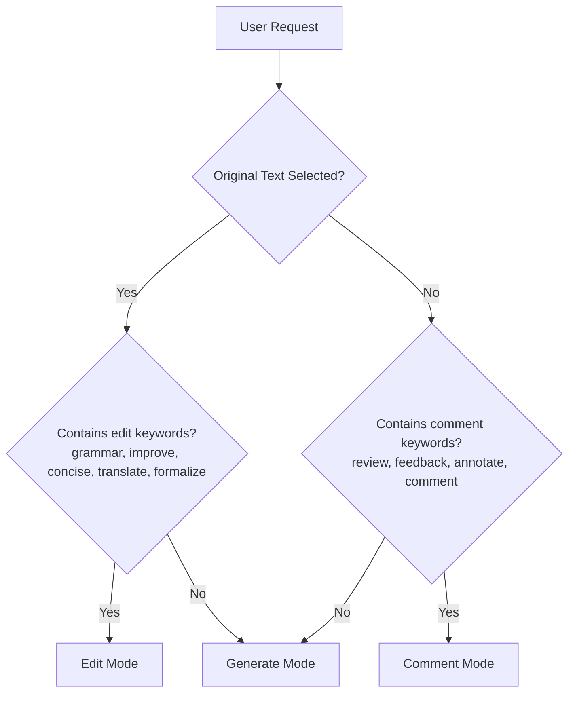

**Diagram sources**
- [src/app/api/ai/command/prompts.ts:28-41](file://src/app/api/ai/command/prompts.ts#L28-L41)

**Section sources**
- [src/app/api/ai/command/prompts.ts:28-41](file://src/app/api/ai/command/prompts.ts#L28-L41)
- [src/app/api/plate/ai/prompts.ts:33-245](file://src/app/api/plate/ai/prompts.ts#L33-L245)

## Dependency Analysis
- Next.js App Router: Routes, layouts, and API endpoints under src/app.
- Feature Modules: Controlled exports via barrel index.ts.
- Shared Libraries: Utilities, design system, and domain logic under src/lib.
- Enhanced Testing Dependencies: Jest, ts-jest, jsdom, Playwright, and fast-check for property-based testing.
- Quality Tools: ESLint, custom rules, and Husky for pre-commit enforcement.
- Design System Documentation: Master guidelines and page-specific overrides.
- Rich Text Editor Dependencies: Plate.js, markdown plugins, and custom variable handling.
- Dialog Component Dependencies: ResponsiveDialog, DialogFormShell, and property-based testing utilities.
- AI Instructions Dependencies: Structured prompt builders, classification utilities, and formatting helpers.

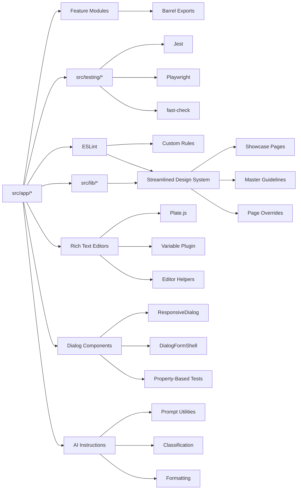

**Diagram sources**
- [src/app/(authenticated)/processos/index.ts](file://src/app/(authenticated)/processos/index.ts#L1-L225)
- [jest.config.js:1-119](file://jest.config.js#L1-L119)
- [playwright.config.ts:1-46](file://playwright.config.ts#L1-L46)
- [eslint.config.mjs:1-273](file://eslint.config.mjs#L1-L273)

**Section sources**
- [src/app/(authenticated)/processos/index.ts](file://src/app/(authenticated)/processos/index.ts#L1-L225)
- [jest.config.js:1-119](file://jest.config.js#L1-L119)
- [playwright.config.ts:1-46](file://playwright.config.ts#L1-L46)
- [eslint.config.mjs:1-273](file://eslint.config.mjs#L1-L273)

## Performance Considerations
- Build Optimization: Use standalone output, modularize imports, and optimize package imports for major libraries.
- Memory Management: Prebuild checks and memory-related scripts help diagnose and mitigate memory issues during builds.
- Bundle Analysis: Enable ANALYZE=true to generate bundle analysis reports for performance tuning.
- Rich Text Editor Optimization: Use efficient variable injection algorithms and avoid unnecessary re-renders through proper state management.
- Property-Based Testing Performance: Configure appropriate `numRuns` values for fast-check to balance test thoroughness and execution time.
- Dialog Component Optimization: Use responsive design patterns to minimize layout thrashing on viewport changes.

**Section sources**
- [next.config.ts:188-250](file://next.config.ts#L188-L250)
- [package.json:32-43](file://package.json#L32-L43)

## Troubleshooting Guide
- Secret Detection: Run npm run security:check-secrets and gitleaks to detect hardcoded secrets.
- CSS Token Issues: Fix HSL var token violations flagged by custom ESLint rule.
- Design System Governance: Use semantic typography and color tokens; avoid direct Badge imports in feature code.
- Test Environment: Ensure proper polyfills and mocks are loaded via src/testing/setup.ts.
- Build Failures: Use verbose builds and prebuild checks to isolate issues.
- Variable Conflicts: Debug using regex state isolation and proper variable key generation in rich text editors.
- Property-Based Test Failures: Use fast-check's shrinking to identify minimal failing cases; adjust generator ranges and constraints.
- Dialog Component Issues: Verify viewport detection and responsive behavior; check for proper slot usage in dialog components.
- AI Instructions Formatting: Validate structured prompt construction and ensure proper tag formatting.

**Updated** Added troubleshooting guidance for streamlined design system governance, CSS token issues, comprehensive variable conflict resolution in rich text editors, property-based testing failures, and dialog component responsiveness.

**Section sources**
- [package.json:47-50](file://package.json#L47-L50)
- [eslint-rules/no-hsl-var-tokens.js:1-77](file://eslint-rules/no-hsl-var-tokens.js#L1-L77)
- [src/testing/setup.ts:1-358](file://src/testing/setup.ts#L1-L358)

## Conclusion
This guide outlines the development workflow, architecture, and operational practices for ZattarOS. By adhering to Feature-Sliced Design, enforcing streamlined design system governance, leveraging comprehensive property-based testing infrastructure, and optimizing the build and deployment pipeline, contributors can maintain a scalable, secure, and high-performance legal management platform.

**Updated** Enhanced with comprehensive property-based testing infrastructure for dialog components, improved AI instructions formatting with structured prompt building utilities, and updated shared component documentation standards with new dialog component patterns.

## Appendices

### Environment Management
- Development: npm run dev with optional flags for verbose or trace output.
- Staging/Production: Use production build scripts and standalone output for improved performance and containerization.

**Section sources**
- [package.json:12-25](file://package.json#L12-L25)
- [next.config.ts:84-94](file://next.config.ts#L84-L94)

### Streamlined Design System Governance Guidelines

**New Section** Comprehensive guidelines for streamlined design system enforcement and exception handling.

#### Core Design System Enforcement
- **Badge Import Restrictions**: Prevent direct Badge imports in feature code; use SemanticBadge or specialized semantic wrappers
- **Semantic Typography**: Use `<Heading>`, `<Text>`, and semantic variants consistently
- **Color Token Usage**: Use design system color tokens from `globals.css` instead of raw Tailwind colors
- **Component Composition**: Use shadcn/ui primitives with semantic wrappers

#### Exception Handling
- **Design System Showcase Pages**: Educational demonstrations in `src/app/(authenticated)/design-system`
- **Documentation Pages**: `.env.example`, `src/app/(ajuda)/**`, and `docs/**`
- **Development Utilities**: `src/app/(dev)/**` and `src/app/(authenticated)/design-system/**`

#### Enforcement Mechanisms
- **ESLint Rules**: Custom rules enforce design system compliance with streamlined restrictions
- **Exception Scoping**: Only applies to designated showcase and documentation areas
- **Badge Import Monitoring**: Specific restriction on direct Badge imports in feature code
- **Color Token Validation**: Automated detection of raw color token usage

**Section sources**
- [eslint.config.mjs:184-206](file://eslint.config.mjs#L184-L206)
- [eslint.config.mjs:206-269](file://eslint.config.mjs#L206-L269)

### Rich Text Editor Development Guidelines

**New Section** Comprehensive guidelines for rich text editor implementation and variable conflict prevention.

#### Variable Naming Conventions
- Use dot notation for hierarchical variable keys (e.g., `cliente.nome_completo`)
- Avoid spaces and special characters in variable names
- Group related variables under common prefixes
- Maintain consistency across form and system variables

#### Conflict Prevention Strategies
- **Regex State Isolation**: Use separate regex instances (`/\{\{[^}]+\}\}/g`) to avoid state sharing
- **Variable Key Normalization**: Normalize variable keys during insertion and lookup
- **Duplicate Prevention**: Check for existing variables before insertion
- **State Synchronization**: Use `isInternalUpdate` ref to prevent infinite loops

#### Editor Architecture Patterns
- **Two-Phase Processing**: Separate deserialization and serialization phases
- **Variable Injection**: Inject variable nodes during deserialization
- **Component Composition**: Use Plate.js plugins for extensible editor functionality
- **State Management**: Properly manage editor state and external value synchronization

#### Testing Best Practices
- Test variable injection with various markdown formats
- Verify serialization preserves variable formatting
- Test conflict scenarios and edge cases
- Validate proper error handling for malformed markdown

**Section sources**
- [src/app/(authenticated)/assinatura-digital/components/editor/MarkdownRichTextEditor.tsx:62-104](file://src/app/(authenticated)/assinatura-digital/components/editor/MarkdownRichTextEditor.tsx#L62-L104)
- [src/app/(authenticated)/assinatura-digital/components/editor/MarkdownRichTextEditor.tsx:208-248](file://src/app/(authenticated)/assinatura-digital/components/editor/MarkdownRichTextEditor.tsx#L208-L248)
- [src/components/editor/plate/variable-plugin.tsx:48-56](file://src/components/editor/plate/variable-plugin.tsx#L48-L56)
- [src/app/(authenticated)/assinatura-digital/components/editor/editor-helpers.ts:95-107](file://src/app/(authenticated)/assinatura-digital/components/editor/editor-helpers.ts#L95-L107)

### Property-Based Testing Guidelines

**New Section** Comprehensive guidelines for implementing and maintaining property-based tests.

#### Test Structure Patterns
- **Async Property Testing**: Use `fc.asyncProperty` for asynchronous component testing
- **Generator Composition**: Combine simple generators into complex property tests
- **Viewport Testing**: Use integer generators for responsive behavior validation
- **Form Field Testing**: Use record generators for comprehensive form validation

#### Test Coverage Strategies
- **Edge Cases**: Test boundary conditions and extreme values
- **Randomized Inputs**: Generate thousands of test cases automatically
- **Mathematical Guarantees**: Properties hold for all valid input combinations
- **Regression Prevention**: Catch subtle bugs that unit tests might miss

#### Performance Considerations
- **Run Limits**: Configure appropriate `numRuns` values (15-100 depending on complexity)
- **Generator Complexity**: Balance test thoroughness with execution time
- **Mocking Strategy**: Minimize expensive operations in property tests
- **Cleanup Procedures**: Ensure proper cleanup between test runs

**Section sources**
- [src/components/shared/__tests__/dialog-form-shell.test.tsx:28-67](file://src/components/shared/__tests__/dialog-form-shell.test.tsx#L28-L67)
- [src/components/ui/__tests__/responsive-dialog.test.tsx:54-90](file://src/components/ui/__tests__/responsive-dialog.test.tsx#L54-L90)

### AI Instructions Development Guidelines

**New Section** Comprehensive guidelines for AI instructions formatting and structured prompt building.

#### Structured Prompt Construction
- **Context Organization**: Use proper section ordering and formatting
- **Tag Usage**: Apply consistent tag patterns for different content types
- **Example Formatting**: Use proper example structure with user/assistant pairs
- **History Management**: Limit conversation history appropriately

#### Classification System
- **Mode Determination**: Use explicit keyword matching for classification
- **Fallback Handling**: Provide sensible defaults for ambiguous requests
- **Validation**: Ensure classification accuracy through testing
- **Documentation**: Maintain clear guidelines for each classification mode

#### Migration Strategies
- **Deprecated Component Handling**: Provide clear migration paths
- **Backward Compatibility**: Maintain compatibility during transitions
- **Developer Education**: Document changes thoroughly
- **Gradual Adoption**: Allow phased migration of existing components

**Section sources**
- [src/app/api/ai/command/utils.ts:92-161](file://src/app/api/ai/command/utils.ts#L92-L161)
- [src/app/api/ai/command/prompts.ts:28-41](file://src/app/api/ai/command/prompts.ts#L28-L41)
- [src/components/shared/AI_INSTRUCTIONS.md:1-770](file://src/components/shared/AI_INSTRUCTIONS.md#L1-L770)