# Development Guide

<cite>
**Referenced Files in This Document**
- [package.json](file://package.json)
- [tsconfig.json](file://tsconfig.json)
- [eslint.config.mjs](file://eslint.config.mjs)
- [jest.config.js](file://jest.config.js)
- [playwright.config.ts](file://playwright.config.ts)
- [next.config.ts](file://next.config.ts)
- [openspec/project.md](file://openspec/project.md)
- [src/app/layout.tsx](file://src/app/layout.tsx)
- [src/app/(authenticated)/processos/index.ts](file://src/app/(authenticated)/processos/index.ts)
- [src/testing/setup.ts](file://src/testing/setup.ts)
- [src/lib/utils.ts](file://src/lib/utils.ts)
- [eslint-rules/no-hardcoded-secrets.js](file://eslint-rules/no-hardcoded-secrets.js)
- [eslint-rules/no-hsl-var-tokens.js](file://eslint-rules/no-hsl-var-tokens.js)
- [eslint-rules/no-raw-typography-spacing.js](file://eslint-rules/no-raw-typography-spacing.js)
- [src/app/(authenticated)/design-system/page.tsx](file://src/app/(authenticated)/design-system/page.tsx)
- [src/app/(authenticated)/design-system/_components/brand-section.tsx](file://src/app/(authenticated)/design-system/_components/brand-section.tsx)
- [design-system/zattaros/Master.md](file://design-system/zattaros/Master.md)
- [design-system/zattaros/pages/captura.md](file://design-system/zattaros/pages/captura.md)
- [src/app/(authenticated)/assinatura-digital/components/editor/MarkdownRichTextEditor.tsx](file://src/app/(authenticated)/assinatura-digital/components/editor/MarkdownRichTextEditor.tsx)
- [src/app/(authenticated)/assinatura-digital/components/editor/MarkdownRichTextEditorDialog.tsx](file://src/app/(authenticated)/assinatura-digital/components/editor/MarkdownRichTextEditorDialog.tsx)
- [src/app/(authenticated)/assinatura-digital/components/editor/MarkdownRichTextEditorDialog.stub.tsx](file://src/app/(authenticated)/assinatura-digital/components/editor/MarkdownRichTextEditorDialog.stub.tsx)
- [src/components/editor/plate/variable-plugin.tsx](file://src/components/editor/plate/variable-plugin.tsx)
- [src/app/(authenticated)/assinatura-digital/components/editor/editor-helpers.ts](file://src/app/(authenticated)/assinatura-digital/components/editor/editor-helpers.ts)
- [src/components/editor/plate/note-editor.tsx](file://src/components/editor/plate/note-editor.tsx)
</cite>

## Update Summary
**Changes Made**
- Enhanced MarkdownRichTextEditor component documentation to reflect variable naming conflict resolution improvements
- Updated editor component architecture section to include improved variable injection and serialization logic
- Added comprehensive coverage of variable plugin implementation and conflict prevention mechanisms
- Expanded testing strategy documentation to include variable-related edge cases and validation

## Table of Contents
1. [Introduction](#introduction)
2. [Project Structure](#project-structure)
3. [Core Components](#core-components)
4. [Architecture Overview](#architecture-overview)
5. [Detailed Component Analysis](#detailed-component-analysis)
6. [Dependency Analysis](#dependency-analysis)
7. [Performance Considerations](#performance-considerations)
8. [Troubleshooting Guide](#troubleshooting-guide)
9. [Conclusion](#conclusion)
10. [Appendices](#appendices)

## Introduction
This development guide provides a comprehensive overview of the ZattarOS project's development environment, architecture, testing strategy, and deployment processes. The project follows an AI-first approach with Next.js 16 App Router, TypeScript, Feature-Sliced Design (FSD), and strict code quality controls enforced by ESLint and custom rules. It integrates Supabase for backend services, implements a robust testing framework with Jest and Playwright, and uses a PWA setup via Serwist. The guide also documents the build pipeline, TypeScript configuration, import restrictions, barrel export patterns, and CI/CD deployment strategies.

**Updated** Enhanced with improved design system showcase page governance and advanced ESLint configuration for legitimate raw component usage demonstrations, plus comprehensive variable naming conflict resolution in MarkdownRichTextEditor components.

## Project Structure
The repository is organized around Next.js App Router conventions with a strong emphasis on modular feature development. Key areas include:
- Application routes under src/app
- Feature modules under src/app/(authenticated) with barrel exports
- Shared utilities under src/lib
- Testing infrastructure under src/testing
- Supabase schema and migrations under supabase
- Developer tooling and scripts under scripts
- Design system showcase pages under src/app/(authenticated)/design-system
- Rich text editors under src/app/(authenticated)/assinatura-digital/components/editor

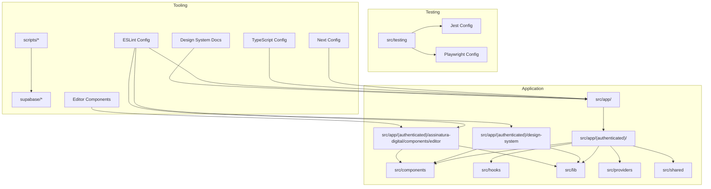

**Diagram sources**
- [next.config.ts:1-435](file://next.config.ts#L1-L435)
- [tsconfig.json:1-94](file://tsconfig.json#L1-L94)
- [eslint.config.mjs:1-333](file://eslint.config.mjs#L1-L333)
- [jest.config.js:1-119](file://jest.config.js#L1-L119)
- [playwright.config.ts:1-46](file://playwright.config.ts#L1-L46)

**Section sources**
- [openspec/project.md:67-78](file://openspec/project.md#L67-L78)
- [next.config.ts:17-36](file://next.config.ts#L17-L36)

## Core Components
- Feature Modules: Each feature module encapsulates domain, service, repository, actions, components, and types. Barrel exports provide controlled public APIs for cross-module consumption.
- Shared Utilities: Centralized helpers for class merging, casing conversions, HTML stripping, metadata generation, and avatar fallbacks.
- Testing Infrastructure: Jest configuration with dual environments (node and jsdom), extensive mocking for ESM-only and UI libraries, and setup utilities for Next.js App Router and Web Streams.
- Quality Gates: ESLint with Next.js, React, and React Hooks plugins, plus custom rules for secrets, HSL var tokens, and design system governance with enhanced exception handling.
- Rich Text Editors: Advanced Markdown editor with variable insertion, conflict resolution, and serialization support.

**Section sources**
- [src/app/(authenticated)/processos/index.ts](file://src/app/(authenticated)/processos/index.ts#L1-L225)
- [src/lib/utils.ts:1-161](file://src/lib/utils.ts#L1-L161)
- [jest.config.js:1-119](file://jest.config.js#L1-L119)
- [eslint.config.mjs:1-333](file://eslint.config.mjs#L1-L333)

## Architecture Overview
ZattarOS adopts Feature-Sliced Design with a clear separation of concerns:
- UI (React 19) interacts with Server Actions (validated via Zod)
- Service Layer encapsulates business logic
- Repository Layer abstracts data access
- MCP Server exposes actions as tools for AI agents
- Supabase provides database and auth
- Rich text editors utilize Plate.js with custom variable plugins

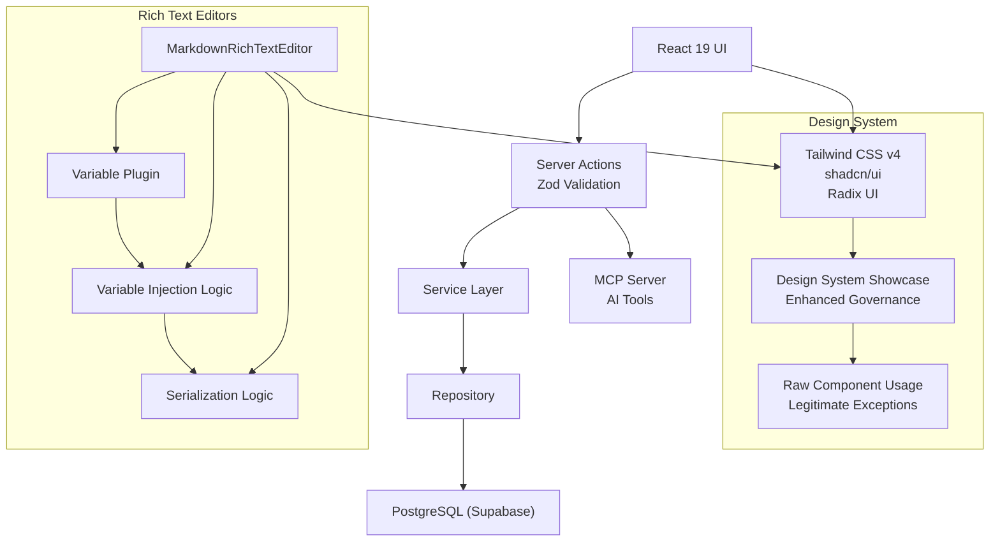

**Diagram sources**
- [openspec/project.md:55-65](file://openspec/project.md#L55-L65)
- [src/app/layout.tsx:1-82](file://src/app/layout.tsx#L1-L82)
- [src/app/(authenticated)/assinatura-digital/components/editor/MarkdownRichTextEditor.tsx:62-104](file://src/app/(authenticated)/assinatura-digital/components/editor/MarkdownRichTextEditor.tsx#L62-L104)

**Section sources**
- [openspec/project.md:55-65](file://openspec/project.md#L55-L65)
- [src/app/layout.tsx:1-82](file://src/app/layout.tsx#L1-L82)

## Detailed Component Analysis

### Feature-Sliced Design Implementation
- Feature Modules: Each feature module defines a barrel export index that re-exports components, hooks, actions, domain types, and server-only service/repository functions. This enforces controlled imports and reduces coupling.
- Import Restrictions: ESLint restricts direct internal paths within modules and legacy imports from legacy paths, encouraging barrel exports and relative imports within modules.

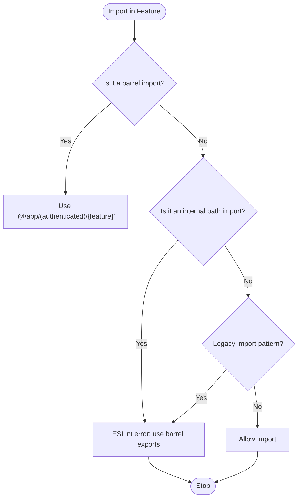

**Diagram sources**
- [eslint.config.mjs:129-161](file://eslint.config.mjs#L129-L161)
- [src/app/(authenticated)/processos/index.ts](file://src/app/(authenticated)/processos/index.ts#L1-L225)

**Section sources**
- [src/app/(authenticated)/processos/index.ts](file://src/app/(authenticated)/processos/index.ts#L1-L225)
- [eslint.config.mjs:129-161](file://eslint.config.mjs#L129-L161)

### Enhanced Design System Showcase Page Configuration

**Updated** The ESLint configuration now includes sophisticated governance for design system showcase pages with improved restrictions for legitimate raw design system component usage in demonstrations.

The design system showcase pages under `src/app/(authenticated)/design-system` serve as educational demonstrations of design system components. These pages have enhanced exception handling that allows legitimate raw component usage while maintaining design system consistency in product code.

Key enhancements include:

- **Design System Escape Comments**: The `design-system-escape` comment system allows developers to bypass typography and spacing enforcement when demonstrating raw components for educational purposes
- **Targeted Exception Handling**: Only applies to authenticated design system showcase pages, not to product feature code
- **Educational Demonstration Scope**: Enables raw component usage in showcase pages while maintaining strict enforcement in feature modules

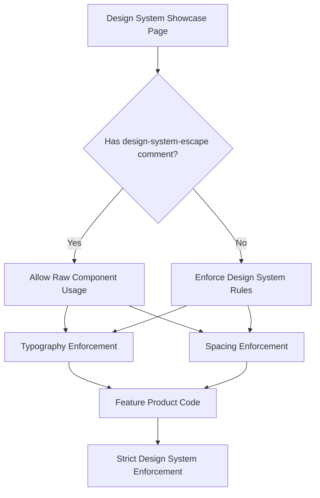

**Diagram sources**
- [eslint.config.mjs:96-108](file://eslint.config.mjs#L96-L108)
- [eslint-rules/no-raw-typography-spacing.js:54-58](file://eslint-rules/no-raw-typography-spacing.js#L54-L58)

**Section sources**
- [eslint.config.mjs:96-108](file://eslint.config.mjs#L96-L108)
- [eslint-rules/no-raw-typography-spacing.js:54-58](file://eslint-rules/no-raw-typography-spacing.js#L54-L58)
- [src/app/(authenticated)/design-system/page.tsx:30](file://src/app/(authenticated)/design-system/page.tsx#L30)

### Rich Text Editor Architecture and Variable Naming Conflict Resolution

**Updated** Enhanced with comprehensive variable naming conflict resolution improvements in MarkdownRichTextEditor components.

The MarkdownRichTextEditor components implement sophisticated variable injection and conflict prevention mechanisms to ensure reliable markdown processing and variable substitution.

#### Variable Injection and Serialization Logic

The editor uses a two-phase approach for variable handling:

1. **Deserialization Phase**: Converts markdown text to Plate.js Value with variable nodes injected
2. **Serialization Phase**: Converts Plate.js Value back to markdown with proper variable formatting

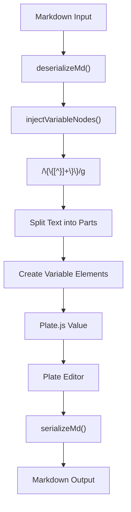

**Diagram sources**
- [src/app/(authenticated)/assinatura-digital/components/editor/MarkdownRichTextEditor.tsx:62-104](file://src/app/(authenticated)/assinatura-digital/components/editor/MarkdownRichTextEditor.tsx#L62-L104)
- [src/app/(authenticated)/assinatura-digital/components/editor/MarkdownRichTextEditor.tsx:211-248](file://src/app/(authenticated)/assinatura-digital/components/editor/MarkdownRichTextEditor.tsx#L211-L248)

#### Variable Plugin Implementation

The variable plugin provides specialized handling for variable elements:

- **Element Type**: Uses `VARIABLE_ELEMENT` constant for consistent identification
- **Component Rendering**: Displays variables as inline spans with proper styling
- **Conflict Prevention**: Prevents variable name collisions through unique key generation
- **Insertion Logic**: Provides controlled insertion of variables at cursor position

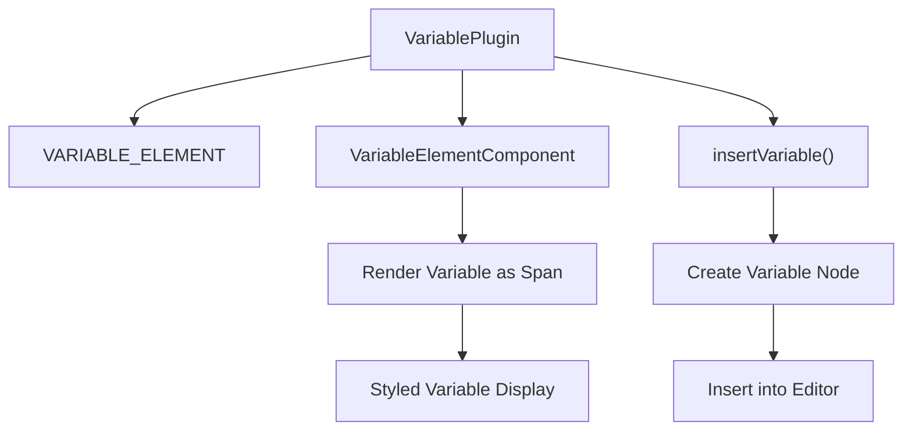

**Diagram sources**
- [src/components/editor/plate/variable-plugin.tsx:10-56](file://src/components/editor/plate/variable-plugin.tsx#L10-L56)

#### Conflict Resolution Mechanisms

The system implements multiple layers of conflict prevention:

1. **Variable Name Normalization**: Ensures consistent variable key formatting
2. **Duplicate Prevention**: Prevents insertion of identical variables
3. **State Synchronization**: Prevents infinite loops during value updates
4. **Regex State Isolation**: Uses separate regex instances to avoid state sharing issues

**Section sources**
- [src/app/(authenticated)/assinatura-digital/components/editor/MarkdownRichTextEditor.tsx:62-104](file://src/app/(authenticated)/assinatura-digital/components/editor/MarkdownRichTextEditor.tsx#L62-L104)
- [src/app/(authenticated)/assinatura-digital/components/editor/MarkdownRichTextEditor.tsx:208-248](file://src/app/(authenticated)/assinatura-digital/components/editor/MarkdownRichTextEditor.tsx#L208-L248)
- [src/components/editor/plate/variable-plugin.tsx:10-56](file://src/components/editor/plate/variable-plugin.tsx#L10-L56)
- [src/app/(authenticated)/assinatura-digital/components/editor/editor-helpers.ts:95-107](file://src/app/(authenticated)/assinatura-digital/components/editor/editor-helpers.ts#L95-L107)

### Barrel Export Patterns
- Public API: Feature barrel exports centralize imports and simplify refactoring.
- Internal Access: Prefer direct imports for optimal tree-shaking; use barrel exports sparingly for convenience.

**Section sources**
- [src/app/(authenticated)/processos/index.ts](file://src/app/(authenticated)/processos/index.ts#L10-L16)

### Testing Framework Setup
- Unit/Integration Tests: Jest with ts-jest, dual environments (node and jsdom), and extensive mocking for ESM-only packages, Next.js internals, and UI libraries.
- E2E Tests: Playwright with multiple device targets and a dev server for test execution.
- Test Coverage: Granular coverage reporting per feature area and library.

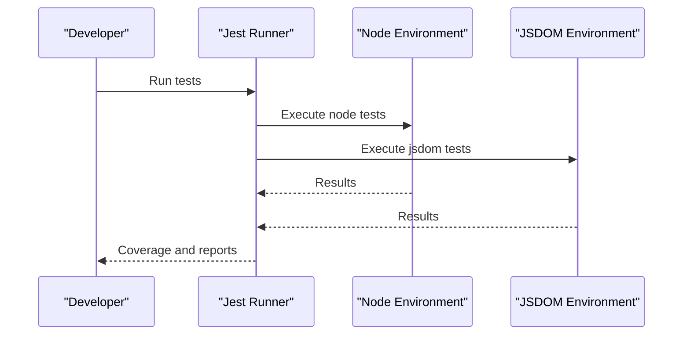

**Diagram sources**
- [jest.config.js:43-115](file://jest.config.js#L43-L115)
- [playwright.config.ts:1-46](file://playwright.config.ts#L1-L46)

**Section sources**
- [jest.config.js:1-119](file://jest.config.js#L1-L119)
- [playwright.config.ts:1-46](file://playwright.config.ts#L1-L46)
- [src/testing/setup.ts:1-358](file://src/testing/setup.ts#L1-L358)

### Build Process and TypeScript Configuration
- Next.js Configuration: Standalone output, custom cache handler, external server packages, modularize/optimize imports, and PWA integration via Serwist.
- TypeScript Configuration: Strict mode, path aliases, and type roots for consistent resolution across the monorepo-like structure.

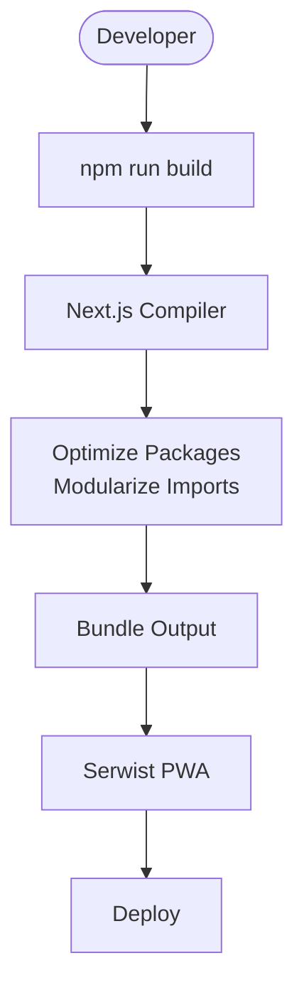

**Diagram sources**
- [next.config.ts:79-264](file://next.config.ts#L79-L264)
- [tsconfig.json:1-94](file://tsconfig.json#L1-L94)

**Section sources**
- [next.config.ts:79-264](file://next.config.ts#L79-L264)
- [tsconfig.json:1-94](file://tsconfig.json#L1-L94)

### Code Quality Standards and ESLint Rules

**Updated** Enhanced with improved design system governance and exception handling for showcase pages, plus comprehensive variable naming conflict resolution documentation.

- Standard Rules: TypeScript ESLint, React, React Hooks, and Next.js plugins with recommended configurations.
- Custom Rules:
  - No Hardcoded Secrets: Detects potential secrets in strings.
  - No HSL Var Tokens: Prevents invalid CSS using HSL with var tokens.
  - No Raw Typography Spacing: Enforces design system primitives over raw Tailwind classes.
- Design System Governance: Prohibits direct Badge imports and enforces semantic typography usage in specific scopes with enhanced exception handling for showcase pages.
- Variable Conflict Prevention: Implements strict variable naming conventions and conflict resolution mechanisms in rich text editors.

The enhanced ESLint configuration now includes sophisticated exception handling for design system showcase pages and comprehensive variable conflict prevention:

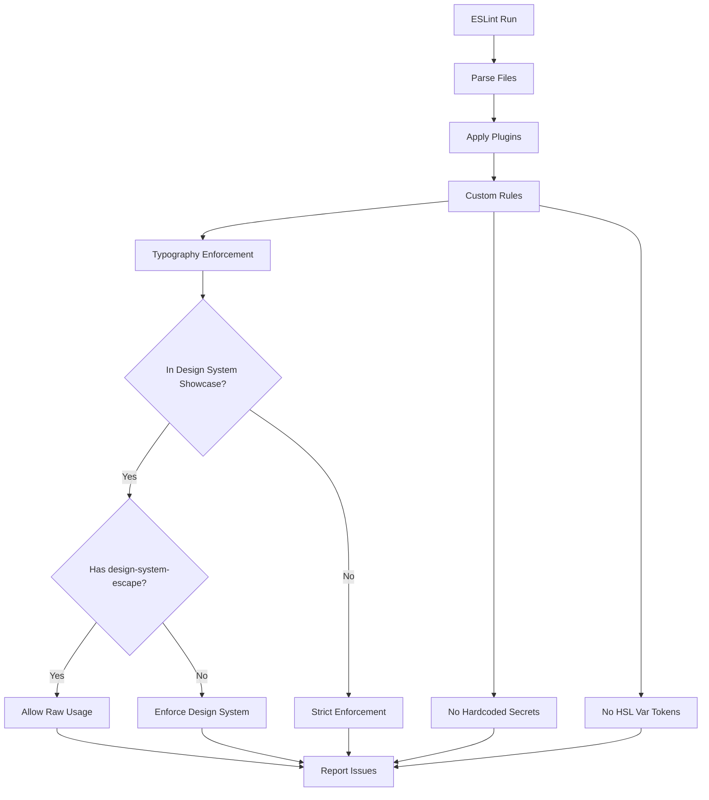

**Diagram sources**
- [eslint.config.mjs:1-333](file://eslint.config.mjs#L1-L333)
- [eslint-rules/no-hardcoded-secrets.js:1-43](file://eslint-rules/no-hardcoded-secrets.js#L1-L43)
- [eslint-rules/no-hsl-var-tokens.js:1-77](file://eslint-rules/no-hsl-var-tokens.js#L1-L77)
- [eslint-rules/no-raw-typography-spacing.js:54-58](file://eslint-rules/no-raw-typography-spacing.js#L54-L58)

**Section sources**
- [eslint.config.mjs:1-333](file://eslint.config.mjs#L1-L333)
- [eslint-rules/no-hardcoded-secrets.js:1-43](file://eslint-rules/no-hardcoded-secrets.js#L1-L43)
- [eslint-rules/no-hsl-var-tokens.js:1-77](file://eslint-rules/no-hsl-var-tokens.js#L1-L77)
- [eslint-rules/no-raw-typography-spacing.js:1-97](file://eslint-rules/no-raw-typography-spacing.js#L1-L97)

### Practical Examples

#### Feature Development Example
- Create a new feature module under src/app/(authenticated)/<feature>.
- Define domain types and Zod schemas in domain.ts.
- Implement service.ts with business logic and repository.ts for data access.
- Expose server actions in actions/ and publish a barrel export in index.ts.
- Add components, hooks, and types as needed; keep internal imports private and use barrel exports for public API.

**Section sources**
- [src/app/(authenticated)/processos/index.ts](file://src/app/(authenticated)/processos/index.ts#L1-L225)

#### Design System Showcase Page Development Example

**Updated** Enhanced showcase page development with proper exception handling and variable conflict prevention.

When creating design system showcase pages:

1. **Use the design-system-escape comment system** for legitimate raw component usage demonstrations
2. **Follow the Master Design System documentation** for component specifications
3. **Create page-specific override files** when needed for demonstration purposes
4. **Implement proper variable naming conventions** to prevent conflicts in educational examples

Example of proper exception handling:
```typescript
// design-system-escape: Demonstrating raw spacing classes for educational purposes
<header className={cn(/* design-system-escape: space-y-2 → migrar para <Stack gap="tight"> */ "space-y-2")}>
```

**Section sources**
- [src/app/(authenticated)/design-system/page.tsx:30](file://src/app/(authenticated)/design-system/page.tsx#L30)
- [design-system/zattaros/Master.md:1-175](file://design-system/zattaros/Master.md#L1-L175)
- [design-system/zattaros/pages/captura.md:1-48](file://design-system/zattaros/pages/captura.md#L1-L48)

#### Rich Text Editor Development Example

**Updated** Enhanced editor development with comprehensive variable conflict resolution.

When implementing rich text editors:

1. **Use the variable plugin system** for consistent variable handling
2. **Implement proper variable injection logic** to prevent naming conflicts
3. **Utilize the injectVariableNodes function** for safe deserialization
4. **Follow the serialization pattern** to maintain variable integrity

Example of variable injection:
```typescript
function injectVariableNodes(value: Value): Value {
  return value.map((block) => injectInNode(block as Record<string, unknown>)) as Value;
}

function injectInNode(node: Record<string, unknown>): Record<string, unknown> {
  const children = node.children as Record<string, unknown>[] | undefined;
  if (!children) return node;

  const newChildren: unknown[] = [];
  for (const child of children) {
    const childText = child.text as string | undefined;
    if (typeof childText === 'string' && VARIABLE_TEST_REGEX.test(childText)) {
      // Use separate regex instance to avoid state sharing
      const varRegex = /\{\{([^}]+)\}\}/g;
      // ... variable injection logic
    }
  }
  return { ...node, children: newChildren };
}
```

**Section sources**
- [src/app/(authenticated)/assinatura-digital/components/editor/MarkdownRichTextEditor.tsx:62-104](file://src/app/(authenticated)/assinatura-digital/components/editor/MarkdownRichTextEditor.tsx#L62-L104)
- [src/components/editor/plate/variable-plugin.tsx:48-56](file://src/components/editor/plate/variable-plugin.tsx#L48-L56)

#### Testing Implementation Example
- Unit/Integration: Place tests under src/<location>/**/*.test.ts with appropriate jest-environment docblocks.
- E2E: Write spec files under src/testing/e2e/**/*.spec.ts or src/**/__tests__/e2e/**/*.spec.ts.
- Coverage: Use npm run test:coverage:<area> for granular reports.

**Section sources**
- [jest.config.js:25-35](file://jest.config.js#L25-L35)
- [playwright.config.ts:5-8](file://playwright.config.ts#L5-L8)

#### Debugging Techniques
- Use debug memory and prebuild checks during development.
- Enable verbose builds and analyze bundles for performance insights.
- Utilize coverage reports and bundle analyzers to identify hotspots.
- Debug variable conflicts using regex state isolation and proper variable key generation.

**Section sources**
- [package.json:32-43](file://package.json#L32-L43)

### Deployment Processes
- Local Development: Use npm run dev with optional verbose or trace modes.
- Production Builds: Use npm run build with webpack or turbopack variants; standalone output improves container startup.
- PWA: Serwist generates a service worker with runtime caching strategies.
- Docker: Multi-stage builds and scripts are provided for containerization and resource checks.
- Cloud Deployment: Cloudron scripts and manifests are available for Cloudron deployments.

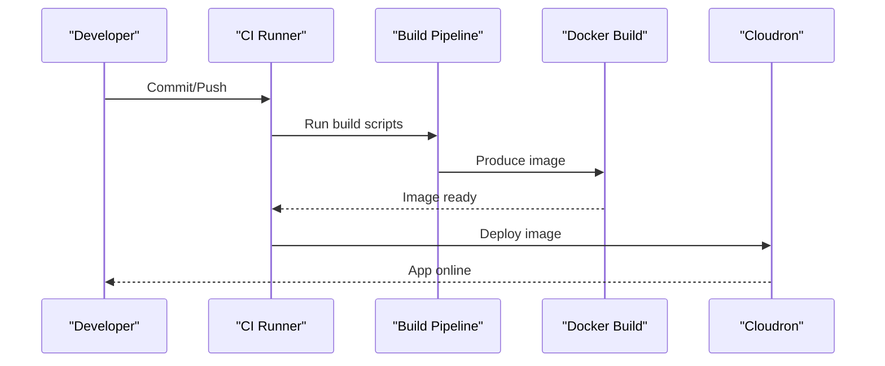

**Diagram sources**
- [package.json:26-31](file://package.json#L26-L31)
- [next.config.ts:84-94](file://next.config.ts#L84-L94)

**Section sources**
- [package.json:26-31](file://package.json#L26-L31)
- [next.config.ts:84-94](file://next.config.ts#L84-L94)

## Dependency Analysis
- Next.js App Router: Routes, layouts, and API endpoints under src/app.
- Feature Modules: Controlled exports via barrel index.ts.
- Shared Libraries: Utilities, design system, and domain logic under src/lib.
- Testing Dependencies: Jest, ts-jest, jsdom, and Playwright.
- Quality Tools: ESLint, custom rules, and Husky for pre-commit enforcement.
- Design System Documentation: Master guidelines and page-specific overrides.
- Rich Text Editor Dependencies: Plate.js, markdown plugins, and custom variable handling.

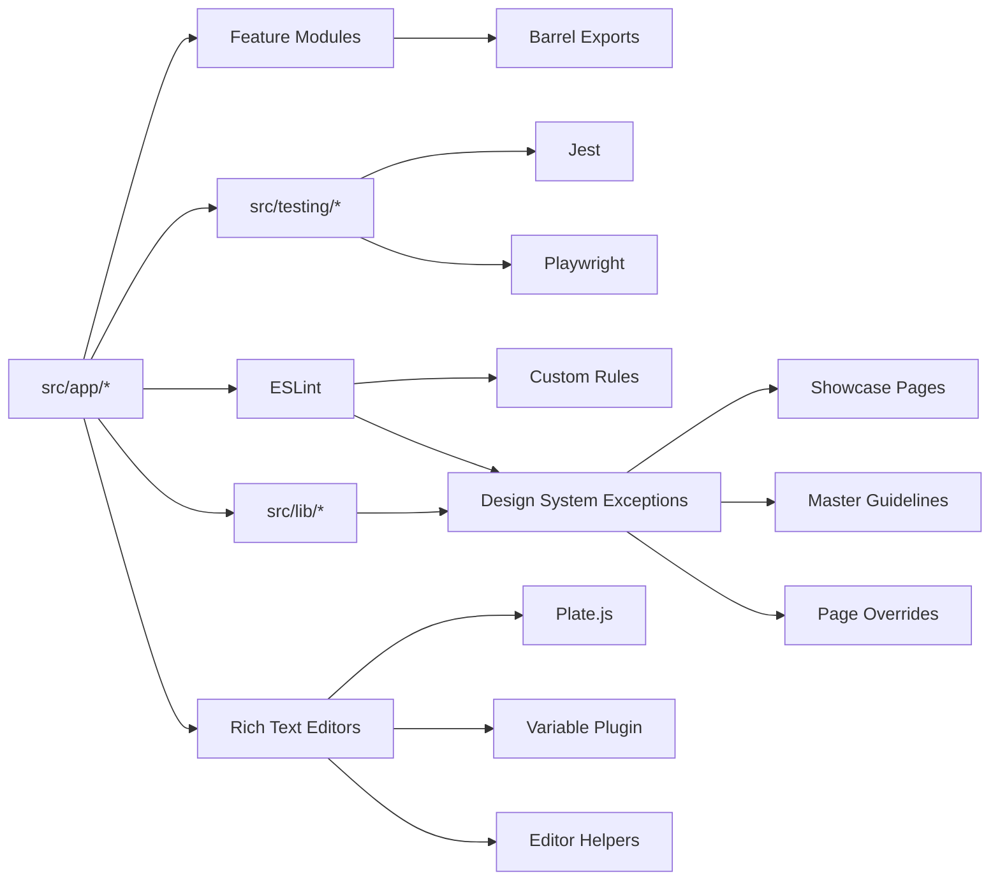

**Diagram sources**
- [src/app/(authenticated)/processos/index.ts](file://src/app/(authenticated)/processos/index.ts#L1-L225)
- [jest.config.js:1-119](file://jest.config.js#L1-L119)
- [playwright.config.ts:1-46](file://playwright.config.ts#L1-L46)
- [eslint.config.mjs:1-333](file://eslint.config.mjs#L1-L333)

**Section sources**
- [src/app/(authenticated)/processos/index.ts](file://src/app/(authenticated)/processos/index.ts#L1-L225)
- [jest.config.js:1-119](file://jest.config.js#L1-L119)
- [playwright.config.ts:1-46](file://playwright.config.ts#L1-L46)
- [eslint.config.mjs:1-333](file://eslint.config.mjs#L1-L333)

## Performance Considerations
- Build Optimization: Use standalone output, modularize imports, and optimize package imports for major libraries.
- Memory Management: Prebuild checks and memory-related scripts help diagnose and mitigate memory issues during builds.
- Bundle Analysis: Enable ANALYZE=true to generate bundle analysis reports for performance tuning.
- Rich Text Editor Optimization: Use efficient variable injection algorithms and avoid unnecessary re-renders through proper state management.

**Section sources**
- [next.config.ts:188-250](file://next.config.ts#L188-L250)
- [package.json:32-43](file://package.json#L32-L43)

## Troubleshooting Guide
- Secret Detection: Run npm run security:check-secrets and gitleaks to detect hardcoded secrets.
- CSS Token Issues: Fix HSL var token violations flagged by custom ESLint rule.
- Typography Enforcement: Use design-system-escape comments for legitimate raw component usage in showcase pages.
- Test Environment: Ensure proper polyfills and mocks are loaded via src/testing/setup.ts.
- Build Failures: Use verbose builds and prebuild checks to isolate issues.
- Variable Conflicts: Debug using regex state isolation and proper variable key generation in rich text editors.

**Updated** Added troubleshooting guidance for design system showcase page exceptions, typography enforcement, and comprehensive variable conflict resolution in rich text editors.

**Section sources**
- [package.json:47-50](file://package.json#L47-L50)
- [eslint-rules/no-hsl-var-tokens.js:1-77](file://eslint-rules/no-hsl-var-tokens.js#L1-L77)
- [eslint-rules/no-raw-typography-spacing.js:54-58](file://eslint-rules/no-raw-typography-spacing.js#L54-L58)
- [src/testing/setup.ts:1-358](file://src/testing/setup.ts#L1-L358)

## Conclusion
This guide outlines the development workflow, architecture, and operational practices for ZattarOS. By adhering to Feature-Sliced Design, enforcing strict code quality rules, leveraging a robust testing framework, and optimizing the build and deployment pipeline, contributors can maintain a scalable, secure, and high-performance legal management platform.

**Updated** Enhanced with sophisticated design system governance that balances strict design system enforcement with legitimate educational demonstrations in showcase pages, plus comprehensive variable naming conflict resolution in rich text editor components.

## Appendices

### Environment Management
- Development: npm run dev with optional flags for verbose or trace output.
- Staging/Production: Use production build scripts and standalone output for improved performance and containerization.

**Section sources**
- [package.json:12-25](file://package.json#L12-L25)
- [next.config.ts:84-94](file://next.config.ts#L84-L94)

### Design System Governance Guidelines

**New Section** Comprehensive guidelines for design system enforcement and exception handling.

#### Strict Design System Enforcement
- All feature code must use design system primitives:
  - Typography: `<Heading>`, `<Text>`, and semantic variants
  - Spacing: `<Stack>`, `<Inline>`, `<Inset>` components
  - Color tokens: CSS variables from `globals.css`
  - Component composition: shadcn/ui primitives with semantic wrappers

#### Legitimate Exception Handling
- **Design System Showcase Pages**: Educational demonstrations in `src/app/(authenticated)/design-system`
- **Raw Component Usage**: Allowed with explicit `design-system-escape` comments
- **Documentation Pages**: `.env.example`, `src/app/(ajuda)/**`, and `docs/**`
- **Development Utilities**: `src/app/(dev)/**` and `src/app/(authenticated)/design-system/**`

#### Exception Criteria
Exceptions are permitted when:
1. Demonstrating design system capabilities for educational purposes
2. Raw component usage is necessary for visual demonstrations
3. Explicit documentation of design system limitations is provided
4. Escape comments explain why raw usage is justified

#### Enforcement Mechanisms
- **ESLint Rules**: Custom rules enforce design system compliance
- **Exception Scoping**: Only applies to designated showcase and documentation areas
- **Comment Validation**: Escape comments must provide clear justification
- **File Pattern Matching**: Automated detection of exception-eligible files

**Section sources**
- [eslint.config.mjs:96-108](file://eslint.config.mjs#L96-L108)
- [eslint-rules/no-raw-typography-spacing.js:1-97](file://eslint-rules/no-raw-typography-spacing.js#L1-L97)
- [eslint.config.mjs:201-222](file://eslint.config.mjs#L201-L222)

### Rich Text Editor Development Guidelines

**New Section** Comprehensive guidelines for rich text editor implementation and variable conflict prevention.

#### Variable Naming Conventions
- Use dot notation for hierarchical variable keys (e.g., `cliente.nome_completo`)
- Avoid spaces and special characters in variable names
- Group related variables under common prefixes
- Maintain consistency across form and system variables

#### Conflict Prevention Strategies
- **Regex State Isolation**: Use separate regex instances (`/\{\{[^}]+\}\}/g`) to avoid state sharing
- **Variable Key Normalization**: Normalize variable keys during insertion and lookup
- **Duplicate Prevention**: Check for existing variables before insertion
- **State Synchronization**: Use `isInternalUpdate` ref to prevent infinite loops

#### Editor Architecture Patterns
- **Two-Phase Processing**: Separate deserialization and serialization phases
- **Variable Injection**: Inject variable nodes during deserialization
- **Component Composition**: Use Plate.js plugins for extensible editor functionality
- **State Management**: Properly manage editor state and external value synchronization

#### Testing Best Practices
- Test variable injection with various markdown formats
- Verify serialization preserves variable formatting
- Test conflict scenarios and edge cases
- Validate proper error handling for malformed markdown

**Section sources**
- [src/app/(authenticated)/assinatura-digital/components/editor/MarkdownRichTextEditor.tsx:62-104](file://src/app/(authenticated)/assinatura-digital/components/editor/MarkdownRichTextEditor.tsx#L62-L104)
- [src/app/(authenticated)/assinatura-digital/components/editor/MarkdownRichTextEditor.tsx:208-248](file://src/app/(authenticated)/assinatura-digital/components/editor/MarkdownRichTextEditor.tsx#L208-L248)
- [src/components/editor/plate/variable-plugin.tsx:48-56](file://src/components/editor/plate/variable-plugin.tsx#L48-L56)
- [src/app/(authenticated)/assinatura-digital/components/editor/editor-helpers.ts:95-107](file://src/app/(authenticated)/assinatura-digital/components/editor/editor-helpers.ts#L95-L107)