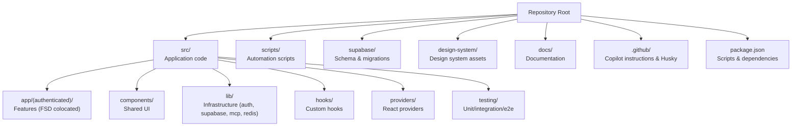
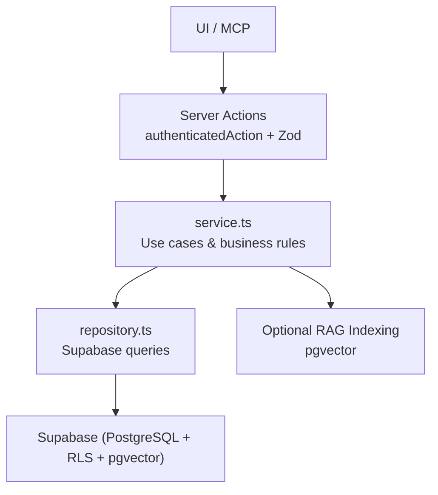
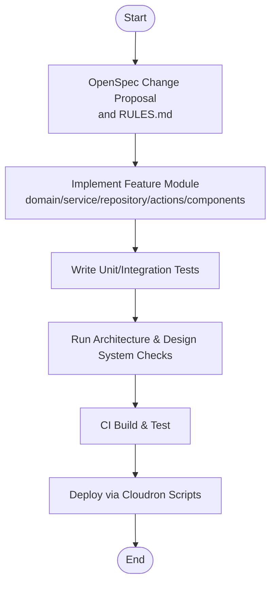
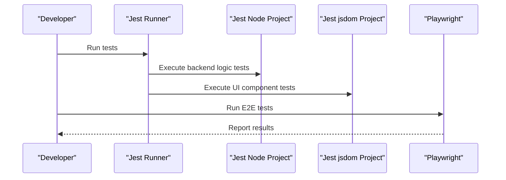
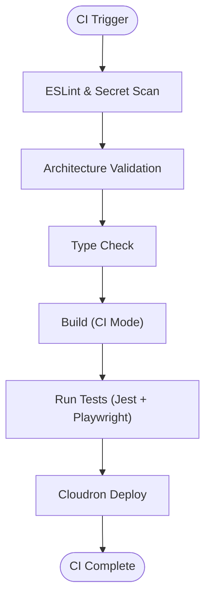
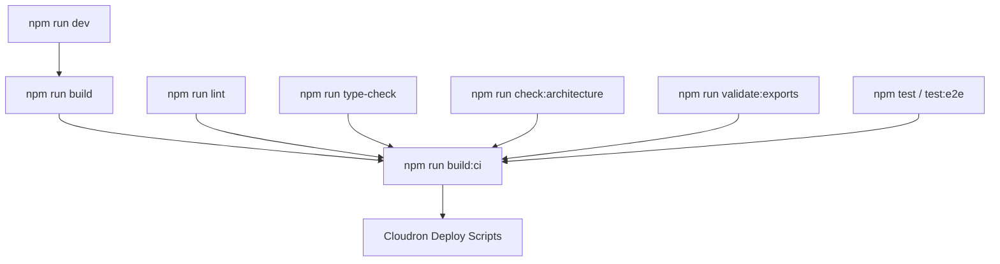

# Development Workflow and Best Practices

<cite>
**Referenced Files in This Document**
- [README.md](file://README.md)
- [package.json](file://package.json)
- [AGENTS.md](file://AGENTS.md)
- [CLAUDE.md](file://CLAUDE.md)
- [jest.config.js](file://jest.config.js)
- [playwright.config.ts](file://playwright.config.ts)
- [.github/copilot-instructions.md](file://.github/copilot-instructions.md)
</cite>

## Table of Contents
1. [Introduction](#introduction)
2. [Project Structure](#project-structure)
3. [Core Components](#core-components)
4. [Architecture Overview](#architecture-overview)
5. [Detailed Component Analysis](#detailed-component-analysis)
6. [Dependency Analysis](#dependency-analysis)
7. [Performance Considerations](#performance-considerations)
8. [Troubleshooting Guide](#troubleshooting-guide)
9. [Conclusion](#conclusion)
10. [Appendices](#appendices)

## Introduction
This document defines the ZattarOS development workflow and best practices. It covers the end-to-end development lifecycle from feature planning to deployment, including branching and commit conventions, pull request guidelines, testing-first development, continuous integration practices, debugging and profiling techniques, and collaborative workflows. It also documents the use of OpenSpec for feature specification and outlines practical examples for feature development, code review, and team collaboration.

## Project Structure
ZattarOS follows a colocated Feature-Sliced Design (FSD) architecture under Next.js App Router. Features are organized as routes under src/app/(authenticated)/{feature}, each containing domain, service, repository, actions, components, and barrel exports. The repository includes:
- Application code under src/
- Scripts for automation under scripts/
- Supabase schema and migrations under supabase/
- Design system assets and reports under design-system/
- Documentation under docs/ and top-level guidance files

**Section sources**
- [README.md:43-68](file://README.md#L43-L68)
- [CLAUDE.md:48-66](file://CLAUDE.md#L48-L66)

## Core Components
- Feature modules: Each feature module under src/app/(authenticated)/{feature} adheres to a strict structure with domain.ts, service.ts, repository.ts, actions/, components/, page.tsx, index.ts, and RULES.md.
- Infrastructure layer: src/lib/ provides shared infrastructure including authentication, Supabase client management, MCP tooling, Redis caching, AI embedding/indexing, and design system utilities.
- Testing framework: Jest runs two parallel projects (node and jsdom) with centralized mocks and coverage targets.
- E2E testing: Playwright tests run against a local dev server with multiple device targets.
- Tooling and scripts: package.json scripts orchestrate development, builds, type checking, linting, architecture validation, MCP tool generation, and Cloudron deployments.

**Section sources**
- [CLAUDE.md:52-64](file://CLAUDE.md#L52-L64)
- [CLAUDE.md:101-112](file://CLAUDE.md#L101-L112)
- [jest.config.js:43-115](file://jest.config.js#L43-L115)
- [playwright.config.ts:1-46](file://playwright.config.ts#L1-L46)
- [package.json:9-134](file://package.json#L9-L134)

## Architecture Overview
ZattarOS enforces a colocated FSD architecture where each feature module is tightly coupled with its route. The data flow moves from UI or MCP through Server Actions (authenticatedAction + Zod) into service orchestration and repository access to Supabase, followed by optional RAG indexing.

**Diagram sources**
- [CLAUDE.md:68-76](file://CLAUDE.md#L68-L76)

**Section sources**
- [CLAUDE.md:68-76](file://CLAUDE.md#L68-L76)

## Detailed Component Analysis

### Development Cycle: From Planning to Deployment
- Feature planning: Use module-specific RULES.md to capture business rules and agent instructions. OpenSpec change proposals live under openspec/changes/ and archived specs under openspec/archive/.
- Implementation: Create or update the feature module under src/app/(authenticated)/{feature} with domain.ts, service.ts, repository.ts, actions/, components/, page.tsx, index.ts, and RULES.md.
- Testing-first: Write unit and integration tests alongside implementation. Use Jest projects to validate services, repositories, actions, and UI components.
- Validation: Run architecture checks to prevent deep imports and enforce barrel exports. Validate design system usage and type generation for Supabase.
- CI/CD: Build and test via scripts designed for CI environments. Deploy using Cloudron scripts.

**Section sources**
- [CLAUDE.md:123-129](file://CLAUDE.md#L123-L129)
- [CLAUDE.md:130-136](file://CLAUDE.md#L130-L136)

### Git Branching and Commit Conventions
- Branching: Direct commits to master are permitted for solo development; avoid PRs for single-person work.
- Staging hygiene: Verify git status before committing; ensure only intended files are staged.
- Commit messages: Use conventional commit prefixes in Portuguese (e.g., feat:, fix:, refactor:, chore:).
- Root cause focus: Avoid quick fixes; address architectural causes.

**Section sources**
- [CLAUDE.md:125-129](file://CLAUDE.md#L125-L129)

### Pull Request Guidelines
- Solo development: No PRs for individual contributors; commits go directly to master.
- Collaborative development: When applicable, follow the repository’s PR process (if defined elsewhere in the project).
- Pre-commit hygiene: Run architecture and design system validations; ensure tests pass locally.

**Section sources**
- [CLAUDE.md:125](file://CLAUDE.md#L125)

### OpenSpec for Feature Specification
- OpenSpec change lifecycle: Propose changes under openspec/changes/, archive completed changes under openspec/archive/, and maintain spec sets under openspec/specs/.
- Agent-driven alignment: Use OpenSpec to guide AI agents in understanding feature scope and business rules.
- Sync and verification: Keep specs synchronized with the codebase and validated during development.

Note: The OpenSpec directory structure and files are present in the repository; ensure change proposals and specs are consistently maintained.

**Section sources**
- [CLAUDE.md:123-129](file://CLAUDE.md#L123-L129)

### Testing-First Development Approach
- Jest configuration: Two parallel projects—node for backend logic and jsdom for UI components—enable comprehensive coverage.
- Coverage targets: Maintain ≥80% global coverage, ≥90% for domain/service, and ≥95% for lib/utils.
- Centralized mocks: Mock Supabase, server-only, next/cache, next/headers, radix-ui, and CopilotKit to isolate tests.
- E2E testing: Playwright tests run against a local dev server with multiple browsers and devices.

**Diagram sources**
- [jest.config.js:43-115](file://jest.config.js#L43-L115)
- [playwright.config.ts:1-46](file://playwright.config.ts#L1-L46)

**Section sources**
- [CLAUDE.md:113-122](file://CLAUDE.md#L113-L122)
- [jest.config.js:43-115](file://jest.config.js#L43-L115)
- [playwright.config.ts:1-46](file://playwright.config.ts#L1-L46)

### Continuous Integration Practices
- CI-friendly builds: Use build:ci script optimized for CI environments to avoid memory issues.
- Architecture validation: Enforce FSD import rules and barrel exports before building.
- Type safety: Run type-check and lint checks to catch issues early.
- Security scanning: Run secret and plaintext storage checks as part of pre-deploy validation.

**Section sources**
- [package.json:17-26](file://package.json#L17-L26)
- [package.json:45-50](file://package.json#L45-L50)
- [package.json:102-106](file://package.json#L102-L106)

### Debugging Techniques and Performance Profiling
- Development server: Use Turbopack-enabled dev server for faster iteration; fallback to webpack mode if needed.
- Memory tuning: Adjust Node heap size via NODE_OPTIONS for builds and dev servers.
- Build performance: Use analyze and validate scripts to inspect bundle sizes and performance metrics.
- Database diagnostics: Run disk I/O diagnostics and vacuum diagnostics scripts to identify bottlenecks.
- Design system audits: Validate and audit design system usage to ensure consistent UI performance.

**Section sources**
- [package.json:12-16](file://package.json#L12-L16)
- [package.json:32-43](file://package.json#L32-L43)
- [package.json:96-98](file://package.json#L96-L98)
- [CLAUDE.md:18-20](file://CLAUDE.md#L18-L20)

### Practical Examples

#### Example: Adding a New Feature Module
- Create a new folder under src/app/(authenticated)/{feature}.
- Add domain.ts, service.ts, repository.ts, actions/, components/, page.tsx, index.ts, and RULES.md.
- Implement authenticated Server Actions using authenticatedAction and export them via the barrel index.ts.
- Write unit tests for service and repository logic; write component tests for UI.
- Validate architecture and design system usage; run type-check and lint.

**Section sources**
- [CLAUDE.md:52-64](file://CLAUDE.md#L52-L64)
- [CLAUDE.md:113-122](file://CLAUDE.md#L113-L122)

#### Example: Writing a Server Action
- Define Zod schemas in domain.ts.
- Implement use cases in service.ts.
- Access Supabase in repository.ts.
- Wrap the action with authenticatedAction and export it from actions/.
- Add tests for the action and its integration with service/repository.

**Section sources**
- [CLAUDE.md:70-76](file://CLAUDE.md#L70-L76)
- [CLAUDE.md:113-122](file://CLAUDE.md#L113-L122)

#### Example: Creating an OpenSpec Change Proposal
- Propose a change under openspec/changes/.
- Document acceptance criteria and business rules in RULES.md within the feature module.
- Reference the change proposal in the feature’s development plan.
- Archive the change after completion under openspec/archive/.

**Section sources**
- [CLAUDE.md:123-129](file://CLAUDE.md#L123-L129)

#### Example: Running E2E Tests
- Start the dev server locally.
- Execute Playwright tests targeting multiple devices and browsers.
- Review traces for failures retained on error.

**Section sources**
- [playwright.config.ts:1-46](file://playwright.config.ts#L1-L46)

### Collaborative Development Workflows
- Solo development: Direct commits to master; no PRs; ensure staging hygiene and conventional commit messages.
- Agent alignment: Use AGENTS.md and CLAUDE.md to align AI agents with architectural rules, naming conventions, and UI patterns.
- Environment parity: Ensure critical environment variables are configured before running actions or AI features.

**Section sources**
- [CLAUDE.md:125-129](file://CLAUDE.md#L125-L129)
- [AGENTS.md:14-31](file://AGENTS.md#L14-L31)
- [CLAUDE.md:137-139](file://CLAUDE.md#L137-L139)

## Dependency Analysis
The development workflow relies on several key scripts and configurations:
- Development and build: npm run dev, build, build:ci
- Quality gates: npm run lint, type-check, check:architecture, validate:exports
- Testing: npm test, test:e2e, and Jest projects
- Infrastructure: MCP tooling, AI indexing, and Cloudron deployment

**Diagram sources**
- [package.json:9-134](file://package.json#L9-L134)

**Section sources**
- [package.json:9-134](file://package.json#L9-L134)

## Performance Considerations
- Build memory: Tune NODE_OPTIONS for dev and CI builds to prevent OOM.
- Bundle analysis: Use analyze and validate scripts to monitor bundle growth.
- Database performance: Apply disk I/O diagnostics and vacuum diagnostics; keep indexes and RLS policies optimized.
- UI performance: Audit design system usage and avoid hardcoded colors; leverage shared UI shells and components.

**Section sources**
- [package.json:12-16](file://package.json#L12-L16)
- [package.json:32-43](file://package.json#L32-L43)
- [package.json:96-98](file://package.json#L96-L98)
- [CLAUDE.md:83-87](file://CLAUDE.md#L83-L87)

## Troubleshooting Guide
- Build fails due to deep imports: Ensure imports use barrel exports and avoid deep imports across feature modules.
- Missing environment variables: Configure critical variables (Supabase keys, service API key, cron secret) before running actions or AI features.
- Test failures: Verify Jest configuration, centralized mocks, and device compatibility for E2E tests.
- Secret leaks: Run security scans for secrets and plaintext storage.
- Architecture violations: Fix imports and exports to satisfy validate:exports and check:architecture.

**Section sources**
- [CLAUDE.md:80-87](file://CLAUDE.md#L80-L87)
- [CLAUDE.md:137-139](file://CLAUDE.md#L137-L139)
- [jest.config.js:43-115](file://jest.config.js#L43-L115)
- [package.json:47-50](file://package.json#L47-L50)
- [package.json:102-106](file://package.json#L102-L106)

## Conclusion
ZattarOS emphasizes a colocated FSD architecture, testing-first development, and robust validation pipelines. By following the documented conventions—commit messages, architecture checks, testing strategies, and CI-friendly builds—you can deliver reliable features efficiently while maintaining code quality and developer productivity.

## Appendices

### Appendix A: Quick Command Reference
- Development: npm run dev, build, build:ci
- Quality: lint, type-check, check:architecture, validate:exports
- Testing: test, test:e2e
- MCP/AI: mcp:check, mcp:dev, ai:reindex
- Types: db:types, db:types:check
- Cloudron: deploy:cloudron, deploy:cloudron:remote

**Section sources**
- [package.json:9-134](file://package.json#L9-L134)