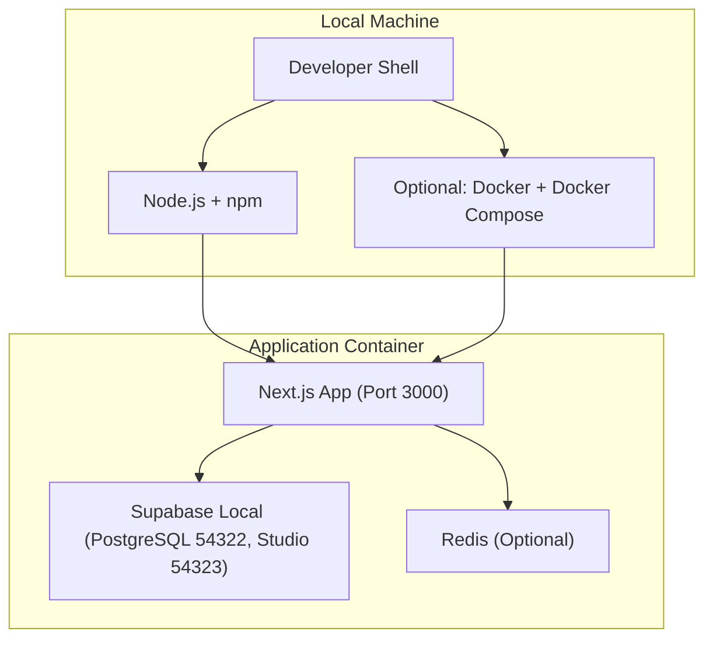
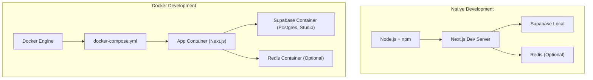
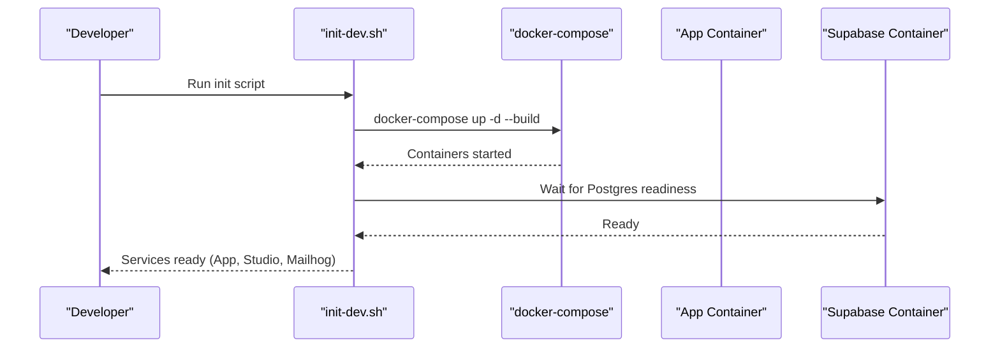
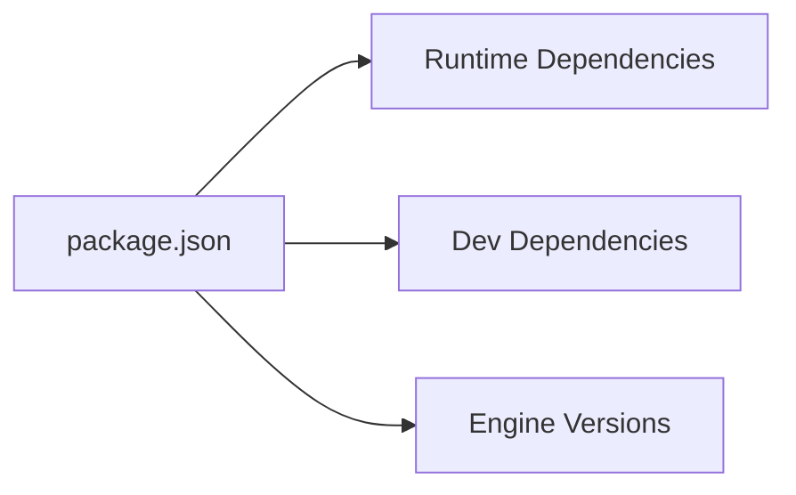

# Environment Setup

<cite>
**Referenced Files in This Document**
- [README.md](file://README.md)
- [package.json](file://package.json)
- [.env.example](file://.env.example)
- [supabase/config.toml](file://supabase/config.toml)
- [docker-compose.yml](file://docker-compose.yml)
- [Dockerfile.dev](file://Dockerfile.dev)
- [Dockerfile.minimal](file://Dockerfile.minimal)
- [scripts/docker/init-dev.sh](file://scripts/docker/init-dev.sh)
</cite>

## Table of Contents
1. [Introduction](#introduction)
2. [Project Structure](#project-structure)
3. [Core Components](#core-components)
4. [Architecture Overview](#architecture-overview)
5. [Detailed Component Analysis](#detailed-component-analysis)
6. [Dependency Analysis](#dependency-analysis)
7. [Performance Considerations](#performance-considerations)
8. [Troubleshooting Guide](#troubleshooting-guide)
9. [Conclusion](#conclusion)
10. [Appendices](#appendices)

## Introduction
This guide provides end-to-end environment setup for ZattarOS development. It covers prerequisites, environment variable configuration, dependency installation, initial project setup, development server startup, database initialization, and local environment configuration. It also includes Docker-based development instructions, troubleshooting, IDE recommendations, and development workflow tips.

## Project Structure
ZattarOS is a Next.js 16 application with Supabase as the backend (PostgreSQL, RLS, pgvector), Redis for caching, and optional integrations for AI, storage, and browser automation. The repository includes:
- Frontend app under src/app and components
- Supabase configuration and migrations under supabase/
- Dockerfiles and docker-compose for containerized development
- Scripts for setup, database operations, and CI/CD

**Diagram sources**
- [docker-compose.yml:1-87](file://docker-compose.yml#L1-L87)
- [Dockerfile.dev:1-28](file://Dockerfile.dev#L1-L28)
- [Dockerfile.minimal:1-88](file://Dockerfile.minimal#L1-L88)
- [supabase/config.toml:27-104](file://supabase/config.toml#L27-L104)

**Section sources**
- [README.md:10-34](file://README.md#L10-L34)
- [package.json:9-44](file://package.json#L9-L44)

## Core Components
- Node.js runtime and npm: Required versions are declared in the project configuration.
- Supabase CLI and local environment: Provides local Postgres, Auth, Storage, Realtime, and Studio.
- Redis: Optional caching layer.
- Docker: Optional containerized development and production builds.

Key capabilities:
- Development server via Next.js
- Supabase local stack with configurable ports and features
- Optional AI integrations (OpenAI, AI Gateway)
- Optional storage integrations (Backblaze B2)
- Optional MCP/Browser services for advanced automation

**Section sources**
- [README.md:10-14](file://README.md#L10-L14)
- [package.json:5-8](file://package.json#L5-L8)
- [supabase/config.toml:1-385](file://supabase/config.toml#L1-L385)
- [.env.example:1-303](file://.env.example#L1-L303)

## Architecture Overview
The development environment can run in two primary ways:
- Native: Node.js + Supabase CLI + optional Redis
- Dockerized: Docker Compose with the app, Supabase local, and optional Redis

**Diagram sources**
- [docker-compose.yml:8-87](file://docker-compose.yml#L8-L87)
- [Dockerfile.dev:5-28](file://Dockerfile.dev#L5-L28)
- [supabase/config.toml:27-104](file://supabase/config.toml#L27-L104)

## Detailed Component Analysis

### Prerequisites and Installation
- Node.js and npm versions are enforced by the project.
- Optional: Docker and Docker Compose for containerized development.

Install dependencies:
- Run the standard install command to fetch all dependencies.

Verify:
- The project’s scripts include checks for memory and architecture during build.

**Section sources**
- [package.json:5-8](file://package.json#L5-L8)
- [package.json:11, 34, 51](file://package.json#L11,L34,L51)
- [README.md:18-21](file://README.md#L18-L21)

### Environment Variables
- Copy the example environment file to a local file and fill in the required values.
- The example file documents required and optional variables, including Supabase credentials, system API keys, Redis, AI providers, storage, and security headers.

Required variables include Supabase URLs and keys, service API key, and cron secret. Optional variables include AI providers, storage provider, Redis, and security controls.

**Section sources**
- [README.md:23-27](file://README.md#L23-L27)
- [README.md:35-42](file://README.md#L35-L42)
- [.env.example:1-303](file://.env.example#L1-L303)

### Development Server Startup
- Start the Next.js development server with Turbopack acceleration.
- Access the app at the default port.

For verbose or specialized runs, the project provides multiple dev scripts.

**Section sources**
- [README.md:28-31](file://README.md#L28-L31)
- [package.json:12-16](file://package.json#L12-L16)

### Database Initialization (Supabase Local)
Supabase local configuration defines ports and features:
- API port, database port, Studio port, and email testing server port
- Auth site URL and redirect URLs
- Seed configuration and migration settings
- Optional analytics and experimental features

To initialize the database:
- Use the Supabase CLI to start the local stack.
- Apply migrations and seed data as configured.

Note: The repository includes Supabase configuration and migration files under the supabase directory.

**Section sources**
- [supabase/config.toml:7-104](file://supabase/config.toml#L7-L104)
- [supabase/config.toml:53-65](file://supabase/config.toml#L53-L65)

### Local Environment Configuration
- Configure Supabase local ports and features in the Supabase configuration file.
- Optionally enable Redis for caching and adjust TTL and memory settings.
- Configure AI providers and embedding models for semantic search.

**Section sources**
- [supabase/config.toml:27-104](file://supabase/config.toml#L27-L104)
- [.env.example:138-147](file://.env.example#L138-L147)
- [.env.example:67-96](file://.env.example#L67-L96)

### Docker-Based Development
The repository provides:
- A development Dockerfile optimized for hot reload and debugging
- A minimal production Dockerfile for ultra-lightweight deployments
- A docker-compose file to orchestrate the app, Supabase local, and optional Redis

Docker development workflow:
- Build and start services with docker-compose
- The script initializes the environment, starts containers, waits for Postgres readiness, and prints service URLs

**Diagram sources**
- [scripts/docker/init-dev.sh:1-91](file://scripts/docker/init-dev.sh#L1-L91)
- [docker-compose.yml:8-87](file://docker-compose.yml#L8-L87)

**Section sources**
- [Dockerfile.dev:1-28](file://Dockerfile.dev#L1-L28)
- [Dockerfile.minimal:1-88](file://Dockerfile.minimal#L1-L88)
- [docker-compose.yml:1-87](file://docker-compose.yml#L1-L87)
- [scripts/docker/init-dev.sh:10-91](file://scripts/docker/init-dev.sh#L10-L91)

## Dependency Analysis
- Application dependencies include Next.js, React, Supabase client libraries, Tailwind CSS, Redis client, and various UI and AI-related packages.
- Development dependencies include testing frameworks, linters, bundlers, and Docker-related tools.
- The project enforces Node.js and npm versions and provides scripts for type checking, linting, testing, and build validation.

**Diagram sources**
- [package.json:135-407](file://package.json#L135-L407)

**Section sources**
- [package.json:135-407](file://package.json#L135-L407)

## Performance Considerations
- Increase Node.js heap size for builds when needed using the provided scripts.
- Use Turbopack for faster development builds.
- Disable telemetry during builds to reduce overhead.
- For Docker builds, use the minimal production Dockerfile to reduce image size and improve cold start times.

[No sources needed since this section provides general guidance]

## Troubleshooting Guide
Common setup issues and resolutions:
- Node.js/npm version mismatch: Ensure your environment matches the required versions.
- Missing environment variables: Copy the example environment file and fill in all required values.
- Supabase local not reachable: Verify the configured ports and that the local stack is running.
- Docker compose not found: Install Docker and Docker Compose; the init script checks for both.
- Postgres readiness timeout: The init script waits for Postgres readiness; if it fails, inspect container logs and configuration.
- Memory issues during build: Use the provided memory-related scripts and increase heap size as needed.

**Section sources**
- [package.json:5-8](file://package.json#L5-L8)
- [README.md:23-27](file://README.md#L23-L27)
- [scripts/docker/init-dev.sh:14-22](file://scripts/docker/init-dev.sh#L14-L22)
- [scripts/docker/init-dev.sh:44-68](file://scripts/docker/init-dev.sh#L44-L68)

## Conclusion
You now have the essential steps to set up ZattarOS for development using either native or Docker-based environments. Ensure your environment variables are configured, dependencies are installed, and the Supabase local stack is initialized. Use the provided scripts and Docker configurations to streamline development and deployment workflows.

[No sources needed since this section summarizes without analyzing specific files]

## Appendices

### Step-by-Step Instructions

- Local development (native)
  1. Install dependencies
  2. Copy and configure environment variables
  3. Start the development server
  4. Initialize Supabase local and seed data as needed

- Docker-based development
  1. Install Docker and Docker Compose
  2. Prepare environment variables in the Docker environment file
  3. Start services with docker-compose
  4. Wait for Postgres readiness and seed data if needed

**Section sources**
- [README.md:18-31](file://README.md#L18-L31)
- [scripts/docker/init-dev.sh:10-91](file://scripts/docker/init-dev.sh#L10-L91)