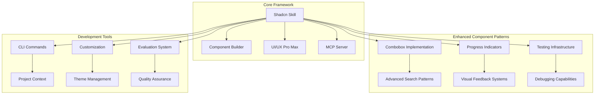
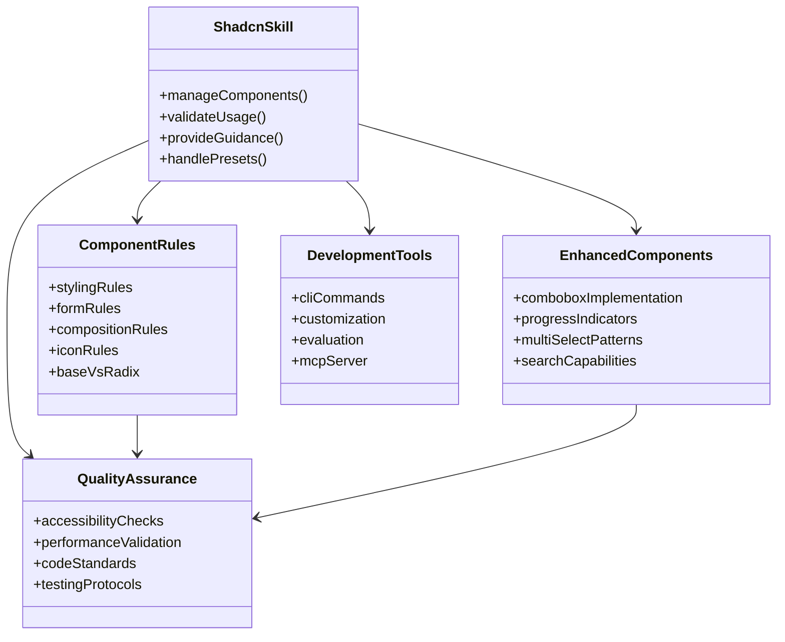
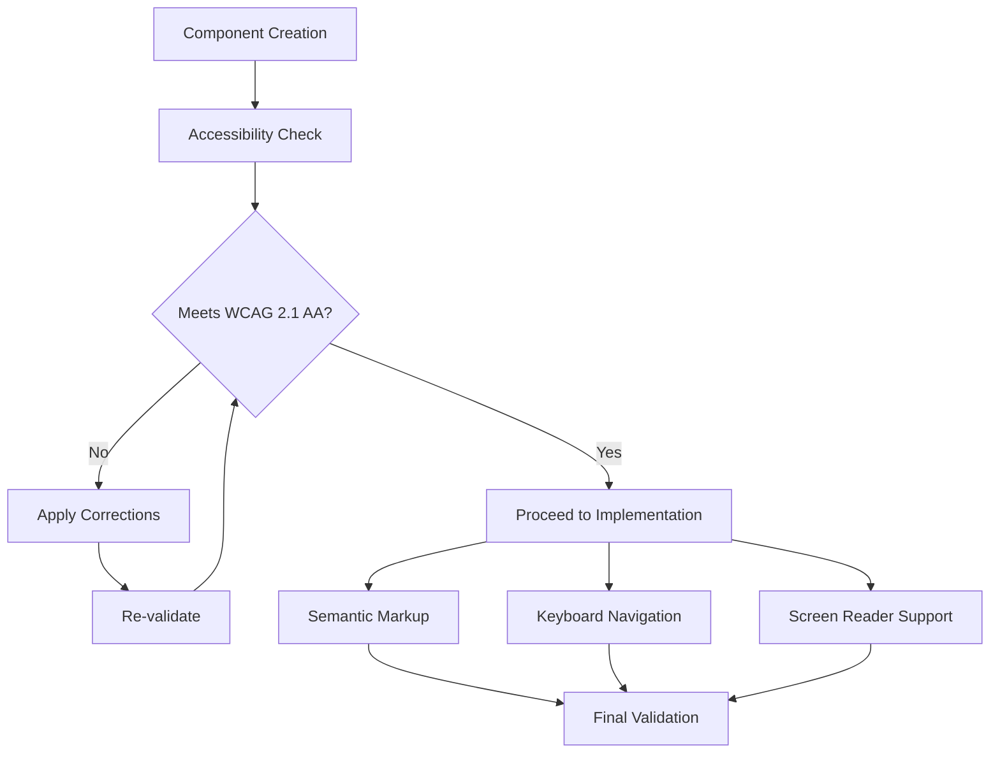
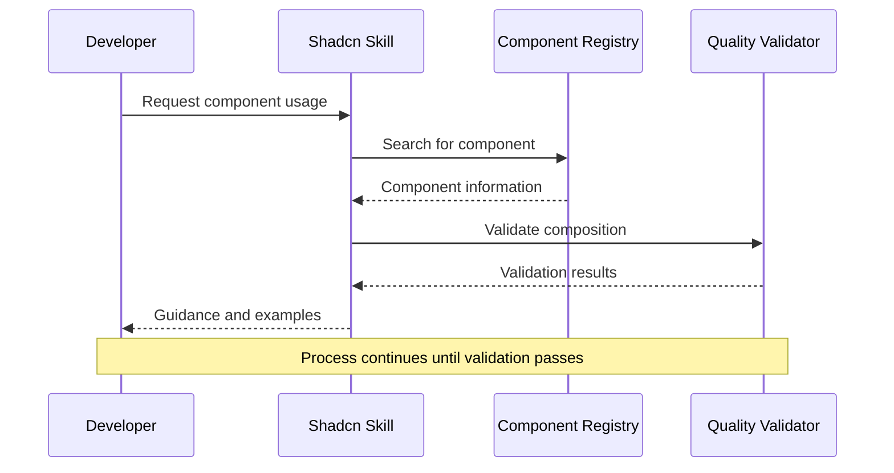
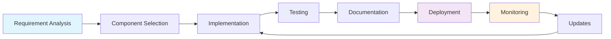
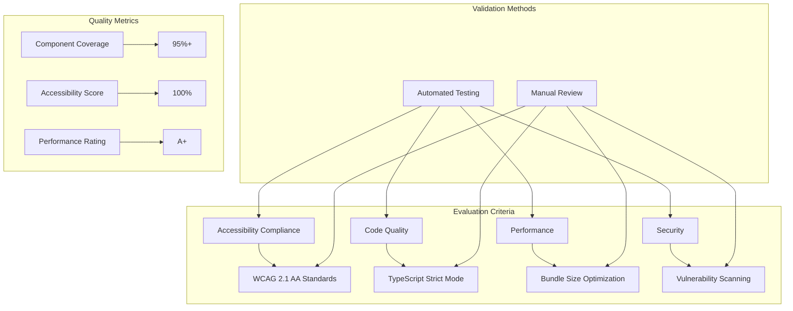

# Shadcn Skills Framework

<cite>
**Referenced Files in This Document**
- [SKILL.md](file://.agents/skills/shadcn/SKILL.md)
- [cli.md](file://.agents/skills/shadcn/cli.md)
- [customization.md](file://.agents/skills/shadcn/customization.md)
- [mcp.md](file://.agents/skills/shadcn/mcp.md)
- [styling.md](file://.agents/skills/shadcn/rules/styling.md)
- [forms.md](file://.agents/skills/shadcn/rules/forms.md)
- [composition.md](file://.agents/skills/shadcn/rules/composition.md)
- [icons.md](file://.agents/skills/shadcn/rules/icons.md)
- [base-vs-radix.md](file://.agents/skills/shadcn/rules/base-vs-radix.md)
- [evals.json](file://.agents/skills/shadcn/evals/evals.json)
- [components.json](file://components.json)
- [SKILL.md](file://.agents/skills/shadcn-component-builder/SKILL.md)
- [SKILL.md](file://.claude/skills/ui-ux-pro-max/SKILL.md)
- [SKILL.md](file://.gemini/skills/ui-ux-pro-max/SKILL.md)
- [combobox.tsx](file://src/components/ui/combobox.tsx)
- [progress.tsx](file://src/components/ui/progress.tsx)
- [setup.ts](file://src/testing/setup.ts)
- [integration-helpers.ts](file://src/testing/integration-helpers.ts)
- [factories.ts](file://src/testing/factories.ts)
- [supabase-test-helpers.ts](file://src/testing/supabase-test-helpers.ts)
</cite>

## Update Summary
**Changes Made**
- Enhanced component patterns documentation with new combobox implementation details
- Updated progress indicators section with improved component specifications
- Expanded testing capabilities documentation with new debugging infrastructure
- Added comprehensive testing utilities and factory patterns
- Integrated advanced mocking infrastructure for component testing

## Table of Contents
1. [Introduction](#introduction)
2. [Framework Overview](#framework-overview)
3. [Core Skills](#core-skills)
4. [Architecture and Design Principles](#architecture-and-design-principles)
5. [Component System](#component-system)
6. [Development Workflow](#development-workflow)
7. [Quality Assurance](#quality-assurance)
8. [Integration Patterns](#integration-patterns)
9. [Best Practices](#best-practices)
10. [Testing and Debugging Infrastructure](#testing-and-debugging-infrastructure)
11. [Troubleshooting Guide](#troubleshooting-guide)
12. [Conclusion](#conclusion)

## Introduction

The Shadcn Skills Framework is a comprehensive system designed to manage and optimize the development workflow for shadcn/ui-based React applications. This framework encompasses multiple specialized skills that work together to provide developers with a complete toolkit for building modern, accessible, and maintainable user interfaces.

The framework consists of several interconnected skills, each focusing on specific aspects of shadcn/ui development, from component management and customization to advanced patterns and quality assurance. The system emphasizes best practices, accessibility compliance, and efficient development workflows.

**Updated** Enhanced with new combobox implementation patterns, improved progress indicators, and expanded testing capabilities through comprehensive debugging infrastructure.

## Framework Overview

The Shadcn Skills Framework operates on a multi-layered architecture that separates concerns across different skill domains while maintaining seamless integration between components.



**Diagram sources**
- [SKILL.md:1-251](file://.agents/skills/shadcn/SKILL.md#L1-L251)
- [cli.md:1-277](file://.agents/skills/shadcn/cli.md#L1-L277)
- [combobox.tsx:1-128](file://src/components/ui/combobox.tsx#L1-L128)
- [progress.tsx:1-40](file://src/components/ui/progress.tsx#L1-L40)

The framework is built around four fundamental principles:

1. **Component Composition**: Prioritize existing components over custom markup
2. **Semantic Styling**: Use design tokens and semantic colors instead of raw values
3. **Accessibility First**: Ensure all components meet WCAG 2.1 AA standards
4. **Developer Experience**: Streamline workflows through automation and intelligent tooling

**Updated** Enhanced with advanced component patterns including sophisticated combobox implementations and improved progress indicators.

## Core Skills

### Shadcn Skill - Primary Framework

The core Shadcn skill serves as the central orchestrator for managing shadcn/ui components and projects. It provides comprehensive guidance for component usage, styling, and project configuration.

Key capabilities include:
- Component discovery and installation via CLI
- Project context management and configuration
- Registry integration for community components
- Preset switching and theme management
- Automated component validation and quality checks

**Section sources**
- [.agents/skills/shadcn/SKILL.md:1-251](file://.agents/skills/shadcn/SKILL.md#L1-L251)

### Component Builder Skill

This specialized skill focuses on advanced component creation, extension, and customization. It provides expert-level guidance for building complex, accessible components using Radix UI primitives and modern React patterns.

Advanced features include:
- Multi-select components with search functionality
- **Enhanced** Combobox implementations with filtering and multiple selection support
- Date range pickers with internationalization
- Accessible menu systems with keyboard navigation
- Custom compound components following shadcn patterns

**Updated** Added sophisticated combobox patterns with enhanced search capabilities and multiple selection support.

**Section sources**
- [.agents/skills/shadcn-component-builder/SKILL.md:1-800](file://.agents/skills/shadcn-component-builder/SKILL.md#L1-L800)

### UI/UX Pro Max Integration

The framework integrates with UI/UX design intelligence systems to provide comprehensive design guidance and best practices. This integration ensures that technical implementation aligns with established design principles.

**Section sources**
- [.claude/skills/ui-ux-pro-max/SKILL.md:1-378](file://.claude/skills/ui-ux-pro-max/SKILL.md#L1-L378)
- [.gemini/skills/ui-ux-pro-max/SKILL.md:1-293](file://.gemini/skills/ui-ux-pro-max/SKILL.md#L1-L293)

### MCP Server Integration

The Model Context Protocol (MCP) server enables AI assistants to interact with the component registry, providing intelligent search and installation capabilities directly within development environments.

**Section sources**
- [.agents/skills/shadcn/mcp.md:1-95](file://.agents/skills/shadcn/mcp.md#L1-L95)

## Architecture and Design Principles

### Component System Architecture

The framework employs a sophisticated component architecture that separates concerns across multiple layers:



**Diagram sources**
- [SKILL.md:22-81](file://.agents/skills/shadcn/SKILL.md#L22-L81)
- [combobox.tsx:14-27](file://src/components/ui/combobox.tsx#L14-L27)
- [progress.tsx:8-17](file://src/components/ui/progress.tsx#L8-L17)

### Design Token System

The framework utilizes a comprehensive design token system that ensures consistency across all components:

| Token Category | Purpose | Examples |
|----------------|---------|----------|
| **Colors** | Semantic color assignments | `--background`, `--primary`, `--secondary` |
| **Typography** | Text hierarchy and styles | `--font-size`, `--line-height`, `--font-weight` |
| **Spacing** | Layout and margin systems | `--spacing-1`, `--spacing-2`, `--spacing-3` |
| **Radius** | Border rounding | `--radius`, `--radius-sm`, `--radius-lg` |
| **Shadows** | Depth and elevation | `--shadow-sm`, `--shadow-md`, `--shadow-lg` |

**Section sources**
- [customization.md:26-47](file://.agents/skills/shadcn/customization.md#L26-L47)

### Accessibility Architecture

Accessibility compliance is embedded throughout the framework with multiple validation layers:



**Diagram sources**
- [composition.md:112-124](file://.agents/skills/shadcn/rules/composition.md#L112-L124)

## Component System

### Core Component Categories

The framework organizes components into logical categories based on their functionality and usage patterns:

#### Interactive Components
- **Buttons**: Primary actions, secondary actions, icon buttons
- **Inputs**: Text inputs, selects, checkboxes, radio groups
- **Navigation**: Breadcrumbs, pagination, tabs, sidebars
- **Feedback**: Alerts, toasts, **Enhanced** Progress indicators, skeletons

#### Overlay Components
- **Dialogs**: Modal dialogs, confirmation dialogs, form modals
- **Sheets**: Side panels, drawers, bottom sheets
- **Popovers**: Context menus, tooltips, hover cards

#### Data Display
- **Tables**: Sortable tables, paginated data grids
- **Cards**: Information cards, stat cards, media cards
- **Badges**: Status indicators, category tags, notification badges

#### **Enhanced** Search and Selection Components
- **Combobox**: Single and multi-select with advanced filtering
- **Multi-select**: Tag-based selection with search capabilities
- **Date Pickers**: Range selection with internationalization support

**Updated** Enhanced component categories now include sophisticated search and selection patterns with advanced filtering capabilities.

**Section sources**
- [SKILL.md:121-138](file://.agents/skills/shadcn/SKILL.md#L121-L138)

### Component Composition Patterns

The framework enforces strict composition patterns to ensure consistency and maintainability:



**Diagram sources**
- [SKILL.md:166-175](file://.agents/skills/shadcn/SKILL.md#L166-L175)

### **Enhanced** Component Patterns

The framework now supports advanced component patterns with sophisticated implementations:

#### Combobox Implementation
The new combobox component provides both single and multi-select capabilities with advanced search functionality:

```typescript
interface ComboboxOption {
  value: string
  label: string
  searchText?: string
  disabled?: boolean
}

interface ComboboxProps {
  options: ComboboxOption[]
  value: string[]
  onValueChange: (value: string[]) => void
  placeholder?: string
  searchPlaceholder?: string
  searchHint?: string
  emptyText?: string
  multiple?: boolean
  disabled?: boolean
  className?: string
  selectAllText?: string
  clearAllText?: string
}
```

#### Progress Indicator Enhancements
The progress component now supports customizable indicators with enhanced styling capabilities:

```typescript
function Progress({
  className,
  value,
  indicatorClassName,
  indicatorColor,
  ...props
}: React.ComponentProps<typeof ProgressPrimitive.Root> & {
  indicatorClassName?: string
  indicatorColor?: string
}) {
  return (
    <ProgressPrimitive.Root
      data-slot="progress"
      className={cn(
        "relative flex h-3 w-full items-center overflow-x-hidden rounded-full bg-muted",
        className
      )}
      {...props}
    >
      <ProgressPrimitive.Indicator
        data-slot="progress-indicator"
        className={cn("size-full flex-1 bg-primary transition-all", indicatorClassName)}
        style={{
          transform: `translateX(-${100 - (value || 0)}%)`,
          backgroundColor: indicatorColor,
        }}
      />
    </ProgressPrimitive.Root>
  )
}
```

**Section sources**
- [combobox.tsx:7-27](file://src/components/ui/combobox.tsx#L7-L27)
- [combobox.tsx:14-27](file://src/components/ui/combobox.tsx#L14-L27)
- [progress.tsx:8-17](file://src/components/ui/progress.tsx#L8-L17)
- [progress.tsx:27-34](file://src/components/ui/progress.tsx#L27-L34)

## Development Workflow

### Component Lifecycle Management

The framework provides a structured workflow for managing component lifecycles from creation to maintenance:



**Diagram sources**
- [SKILL.md:166-182](file://.agents/skills/shadcn/SKILL.md#L166-L182)

### CLI Command Integration

The framework leverages a comprehensive CLI system for automated component management:

| Command Category | Purpose | Examples |
|------------------|---------|----------|
| **Initialization** | Project setup and configuration | `init`, `apply`, `create` |
| **Component Management** | Add, update, remove components | `add`, `search`, `view` |
| **Development Tools** | Testing and validation | `docs`, `info`, `build` |
| **Registry Operations** | Community component integration | `list`, `install`, `audit` |

**Section sources**
- [cli.md:18-277](file://.agents/skills/shadcn/cli.md#L18-L277)

### Project Context Management

The framework maintains comprehensive project context information for intelligent component guidance:

| Context Field | Description | Example Values |
|---------------|-------------|----------------|
| **Framework** | Application framework detection | `next`, `vite`, `react-router` |
| **Base Library** | Primitive library selection | `radix`, `base` |
| **Style Preset** | Visual design system | `nova`, `vega`, `luma` |
| **Icon Library** | Icon package configuration | `lucide`, `tabler`, `hugeicons` |
| **Tailwind Version** | CSS framework version | `v3`, `v4` |

**Section sources**
- [cli.md:177-226](file://.agents/skills/shadcn/cli.md#L177-L226)

## Quality Assurance

### Evaluation System

The framework implements a comprehensive evaluation system to ensure code quality and adherence to best practices:



**Diagram sources**
- [evals.json:1-48](file://.agents/skills/shadcn/evals/evals.json#L1-L48)

### Automated Validation Rules

The framework enforces strict validation rules through multiple layers of automated checks:

#### Styling Validation
- Semantic color usage enforcement
- Spacing and layout consistency
- Dark mode compatibility verification
- Responsive design compliance

#### Component Validation
- Proper composition patterns
- Accessibility attribute completeness
- Icon usage standards
- Event handler implementation

#### Performance Validation
- Bundle size monitoring
- Render optimization checks
- Memory leak prevention
- Loading state management

**Section sources**
- [styling.md:1-163](file://.agents/skills/shadcn/rules/styling.md#L1-L163)
- [forms.md:1-193](file://.agents/skills/shadcn/rules/forms.md#L1-L193)
- [composition.md:1-196](file://.agents/skills/shadcn/rules/composition.md#L1-L196)

## Integration Patterns

### Registry Integration

The framework supports multiple registry integration patterns for accessing community components:

```mermaid
graph LR
A[Local Project] --> B[Primary Registry]
B --> C[@shadcn Registry]
B --> D[Community Registries]
D --> E[@supabase]
D --> F[@shadcn-studio]
D --> G[Private Registries]
H[Third-party Components] --> I[Import Rewriting]
I --> J[Path Resolution]
J --> K[Component Validation]
```

**Diagram sources**
- [components.json:24-33](file://components.json#L24-L33)

### External Tool Integration

The framework integrates with various external tools and services:

| Integration Type | Tool | Purpose |
|------------------|------|---------|
| **Package Managers** | npm, pnpm, yarn, bun | Dependency management |
| **Build Tools** | Next.js, Vite, Webpack | Asset compilation |
| **Testing** | Jest, React Testing Library | Unit and integration tests |
| **Linting** | ESLint, Prettier | Code quality enforcement |
| **CI/CD** | GitHub Actions, Docker | Automated deployment |

**Section sources**
- [cli.md:5-8](file://.agents/skills/shadcn/cli.md#L5-L8)

### Environment Configuration

The framework supports flexible environment configuration for different deployment scenarios:

| Environment | Configuration | Purpose |
|-------------|---------------|---------|
| **Development** | Hot reloading, source maps, verbose logging | Fast iteration and debugging |
| **Staging** | Production-like configuration, performance monitoring | Quality assurance and testing |
| **Production** | Optimized builds, minification, security hardening | Live application delivery |

## Best Practices

### Component Development Guidelines

The framework establishes comprehensive guidelines for component development:

#### Naming Conventions
- Use descriptive component names that reflect functionality
- Follow kebab-case for file names and PascalCase for component exports
- Include proper TypeScript interfaces for props and events

#### Implementation Patterns
- Leverage Radix UI primitives for accessibility and consistency
- Implement proper TypeScript strict mode compliance
- Use composition over inheritance for component extensibility
- Follow the principle of least privilege for component APIs

#### Documentation Standards
- Provide comprehensive prop documentation with TypeScript types
- Include usage examples for common scenarios
- Document accessibility features and keyboard navigation
- Specify performance characteristics and optimization tips

**Section sources**
- [SKILL.md:10-30](file://.agents/skills/shadcn-component-builder/SKILL.md#L10-L30)

### Performance Optimization

The framework emphasizes performance optimization through multiple strategies:

#### Bundle Optimization
- Tree shaking for unused components and utilities
- Dynamic imports for route-based code splitting
- Lazy loading for heavy components and dependencies
- Image optimization and responsive asset delivery

#### Runtime Performance
- Memoization for expensive computations
- Efficient state management with React hooks
- Optimized rendering with proper key usage
- Debounced and throttled event handlers

#### Memory Management
- Proper cleanup of event listeners and subscriptions
- Efficient garbage collection through component lifecycle
- Minimized memory footprint through optimized data structures
- Prevention of memory leaks in long-running applications

### Security Considerations

The framework incorporates security best practices throughout the development lifecycle:

#### Input Validation
- Sanitization of user inputs and dynamic content
- Proper escaping of HTML and script content
- Validation of file uploads and binary data
- Protection against injection attacks

#### Access Control
- Role-based permissions for sensitive operations
- Secure authentication and authorization patterns
- CSRF protection for state-changing operations
- XSS prevention through proper content security policies

#### Data Protection
- Encryption of sensitive data at rest and in transit
- Secure storage of credentials and tokens
- Proper session management and timeout handling
- Audit logging for security-relevant events

## Testing and Debugging Infrastructure

### Comprehensive Testing Framework

The framework provides a robust testing infrastructure with extensive debugging capabilities:

#### Testing Utilities and Factories
The testing suite includes comprehensive utilities for creating test data and mocking external dependencies:

```typescript
export const createTestUser = (overrides = {}) => ({
  id: 1,
  email: 'test@example.com',
  name: 'Test User',
  role: 'admin',
  created_at: new Date().toISOString(),
  updated_at: new Date().toISOString(),
  ...overrides,
});

export const createTestDate = (daysToAdd = 0) => {
  const date = new Date();
  date.setDate(date.getDate() + daysToAdd);
  return date;
};
```

#### Advanced Mocking Infrastructure
The setup includes sophisticated mocking for various external services and browser APIs:

```typescript
// Mock server-only module for unit tests
jest.mock('server-only', () => ({}), { virtual: true });

// Mock Next.js App Router
jest.mock('next/navigation', () => ({
  useRouter: () => ({
    push: jest.fn(),
    replace: jest.fn(),
    prefetch: jest.fn(),
    back: jest.fn(),
    forward: jest.fn(),
    refresh: jest.fn(),
  }),
  usePathname: () => '/audiencias/semana',
  useSearchParams: () => new URLSearchParams(),
}));

// Mock Web Streams for Next.js server code
if (typeof global.ReadableStream === 'undefined' || typeof global.WritableStream === 'undefined') {
  try {
    const webStreams = require('stream/web');
    if (typeof global.ReadableStream === 'undefined') global.ReadableStream = webStreams.ReadableStream;
    if (typeof global.WritableStream === 'undefined') global.WritableStream = webStreams.WritableStream;
  } catch {
    // Fallback mock if stream/web is not available
  }
}
```

#### Integration Testing Helpers
The framework provides specialized helpers for integration testing:

```typescript
export const createMockSupabaseForIntegration = () => {
  const resolvedEmpty = { data: null, error: null };
  return {
    from: jest.fn().mockReturnThis(),
    select: jest.fn().mockReturnThis(),
    insert: jest.fn().mockReturnThis(),
    update: jest.fn().mockReturnThis(),
    delete: jest.fn().mockReturnThis(),
    eq: jest.fn().mockReturnThis(),
    neq: jest.fn().mockReturnThis(),
    gt: jest.fn().mockReturnThis(),
    gte: jest.fn().mockReturnThis(),
    lt: jest.fn().mockReturnThis(),
    lte: jest.fn().mockReturnThis(),
    like: jest.fn().mockReturnThis(),
    ilike: jest.fn().mockReturnThis(),
    is: jest.fn().mockReturnThis(),
    in: jest.fn().mockReturnThis(),
    contains: jest.fn().mockReturnThis(),
    containedBy: jest.fn().mockReturnThis(),
    range: jest.fn().mockReturnThis(),
    order: jest.fn().mockReturnThis(),
    limit: jest.fn().mockReturnThis(),
    single: jest.fn<Promise<typeof resolvedEmpty>, []>().mockResolvedValue(resolvedEmpty),
    maybeSingle: jest.fn<Promise<typeof resolvedEmpty>, []>().mockResolvedValue(resolvedEmpty),
    rpc: jest.fn<Promise<typeof resolvedEmpty>, []>().mockResolvedValue(resolvedEmpty),
  };
};
```

#### Conditional Testing Support
Environment-aware testing utilities enable selective execution based on service availability:

```typescript
export function hasSupabaseServiceEnv(): boolean {
  return Boolean(process.env.NEXT_PUBLIC_SUPABASE_URL) &&
    Boolean(process.env.SUPABASE_SECRET_KEY || process.env.SUPABASE_SERVICE_ROLE_KEY);
}

export function describeIf(condition: boolean) {
  return condition ? describe : describe.skip;
}

export function itIf(condition: boolean) {
  return condition ? it : it.skip;
}
```

**Section sources**
- [factories.ts:1-17](file://src/testing/factories.ts#L1-L17)
- [setup.ts:1-358](file://src/testing/setup.ts#L1-L358)
- [integration-helpers.ts:103-134](file://src/testing/integration-helpers.ts#L103-L134)
- [supabase-test-helpers.ts:1-17](file://src/testing/supabase-test-helpers.ts#L1-L17)

### Debugging Strategies

The framework provides systematic approaches to debugging component issues:

#### Development Tools
- Browser developer tools for DOM inspection and network analysis
- React DevTools for component hierarchy and state debugging
- Console logging with structured error reporting
- Performance profiling for runtime optimization

#### Testing Approaches
- Unit tests for component logic and prop validation
- Integration tests for component interactions
- Accessibility tests for compliance validation
- Performance tests for optimization verification

#### Monitoring and Analytics
- Application performance monitoring for production insights
- Error tracking for user-reported issues
- Usage analytics for feature adoption metrics
- Security monitoring for vulnerability detection

### Support Resources

The framework provides comprehensive support resources for developers:

#### Documentation
- Comprehensive API reference with examples
- Best practice guides for common scenarios
- Migration guides for framework updates
- Troubleshooting articles for frequent issues

#### Community Support
- Active community forums for peer assistance
- Regular office hours for direct support
- Contributing guidelines for community involvement
- Recognition programs for community contributions

#### Maintenance and Updates
- Regular security updates and patches
- Compatibility updates for framework changes
- Deprecation notices and migration timelines
- Backward compatibility guarantees where applicable

## Troubleshooting Guide

### Common Issues and Solutions

#### Component Installation Problems
**Issue**: Components fail to install or import correctly
**Solution**: 
1. Verify registry configuration in components.json
2. Check for conflicting dependencies
3. Ensure proper import paths match project aliases
4. Validate component compatibility with current base library

#### Styling Conflicts
**Issue**: Components appear incorrectly styled or inconsistent
**Solution**:
1. Verify CSS variable definitions in globals.css
2. Check for conflicting utility class usage
3. Ensure proper semantic color token usage
4. Validate Tailwind configuration compatibility

#### Accessibility Issues
**Issue**: Components fail accessibility validation
**Solution**:
1. Implement proper ARIA attributes and roles
2. Ensure keyboard navigation support
3. Verify color contrast ratios meet WCAG standards
4. Test screen reader compatibility

#### Performance Degradation
**Issue**: Application performance deteriorates with component usage
**Solution**:
1. Analyze bundle size and identify oversized components
2. Implement lazy loading for heavy components
3. Optimize rendering with proper React.memo usage
4. Monitor memory usage and prevent leaks

#### **Enhanced** Testing and Debugging Issues
**Issue**: Tests fail or debugging becomes difficult
**Solution**:
1. Verify test setup includes all necessary mocks
2. Check environment configuration for service dependencies
3. Ensure proper factory usage for test data generation
4. Validate integration helper configurations

**Section sources**
- [SKILL.md:166-182](file://.agents/skills/shadcn/SKILL.md#L166-L182)

### Debugging Strategies

The framework provides systematic approaches to debugging component issues:

#### Development Tools
- Browser developer tools for DOM inspection and network analysis
- React DevTools for component hierarchy and state debugging
- Console logging with structured error reporting
- Performance profiling for runtime optimization

#### Testing Approaches
- Unit tests for component logic and prop validation
- Integration tests for component interactions
- Accessibility tests for compliance validation
- Performance tests for optimization verification

#### Monitoring and Analytics
- Application performance monitoring for production insights
- Error tracking for user-reported issues
- Usage analytics for feature adoption metrics
- Security monitoring for vulnerability detection

### Support Resources

The framework provides comprehensive support resources for developers:

#### Documentation
- Comprehensive API reference with examples
- Best practice guides for common scenarios
- Migration guides for framework updates
- Troubleshooting articles for frequent issues

#### Community Support
- Active community forums for peer assistance
- Regular office hours for direct support
- Contributing guidelines for community involvement
- Recognition programs for community contributions

#### Maintenance and Updates
- Regular security updates and patches
- Compatibility updates for framework changes
- Deprecation notices and migration timelines
- Backward compatibility guarantees where applicable

## Conclusion

The Shadcn Skills Framework represents a comprehensive solution for modern React component development, combining powerful automation tools with rigorous quality standards and accessibility compliance. The framework's multi-layered architecture ensures scalability, maintainability, and developer productivity while enforcing industry best practices.

**Updated** Recent enhancements include sophisticated component patterns with enhanced combobox implementations, improved progress indicators with customizable styling, and comprehensive testing infrastructure with advanced debugging capabilities.

Key strengths of the framework include:

- **Comprehensive Coverage**: From basic component usage to advanced customization patterns
- **Quality Assurance**: Built-in validation and testing throughout the development lifecycle  
- **Accessibility Focus**: WCAG 2.1 AA compliance integrated at the framework level
- **Developer Experience**: Streamlined workflows through automation and intelligent tooling
- **Extensibility**: Modular design supporting custom components and third-party integrations
- **Advanced Testing**: Comprehensive testing infrastructure with sophisticated debugging capabilities

The framework's emphasis on semantic styling, proper component composition, and performance optimization positions it as a leading solution for enterprise-grade React applications. By following the established patterns and guidelines, developers can create maintainable, accessible, and high-performance user interfaces that scale effectively with growing application complexity.

Future enhancements will likely focus on expanded AI-assisted development capabilities, enhanced performance monitoring, and improved integration with emerging web technologies, ensuring the framework remains at the forefront of modern React development practices.

**Enhanced** The recent additions of sophisticated combobox patterns, improved progress indicators, and comprehensive testing infrastructure demonstrate the framework's commitment to staying current with modern development practices and developer needs.