# Testing Strategy and Implementation

<cite>
**Referenced Files in This Document**
- [jest.config.js](file://jest.config.js)
- [playwright.config.ts](file://playwright.config.ts)
- [src/testing/INTEGRATION_TESTING_GUIDE.md](file://src/testing/INTEGRATION_TESTING_GUIDE.md)
- [src/testing/setup.ts](file://src/testing/setup.ts)
- [src/testing/integration-helpers.ts](file://src/testing/integration-helpers.ts)
- [src/testing/supabase-test-helpers.ts](file://src/testing/supabase-test-helpers.ts)
- [src/__mocks__/jest-dom-setup.ts](file://src/__mocks__/jest-dom-setup.ts)
- [src/__mocks__/env-setup.js](file://src/__mocks__/env-setup.js)
- [src/testing/factories.ts](file://src/testing/factories.ts)
- [src/app/__tests__/layout.test.tsx](file://src/app/__tests__/layout.test.tsx)
- [src/app/(authenticated)/expedientes/__tests__/unit/resumo-ultima-captura.test.ts](file://src/app/(authenticated)/expedientes/__tests__/unit/resumo-ultima-captura.test.ts)
- [src/app/(authenticated)/expedientes/repository.ts](file://src/app/(authenticated)/expedientes/repository.ts)
- [src/app/(authenticated)/expedientes/service.ts](file://src/app/(authenticated)/expedientes/service.ts)
- [src/app/(authenticated)/expedientes/domain.ts](file://src/app/(authenticated)/expedientes/domain.ts)
</cite>

## Update Summary
**Changes Made**
- Added comprehensive unit testing documentation for the `obterResumoUltimaCaptura` function
- Updated component testing patterns to include advanced mocking strategies
- Enhanced database testing approaches with sequential mock patterns
- Expanded integration testing patterns to cover complex business logic validation

## Table of Contents
1. [Introduction](#introduction)
2. [Project Structure](#project-structure)
3. [Core Components](#core-components)
4. [Architecture Overview](#architecture-overview)
5. [Detailed Component Analysis](#detailed-component-analysis)
6. [Advanced Testing Patterns](#advanced-testing-patterns)
7. [Dependency Analysis](#dependency-analysis)
8. [Performance Considerations](#performance-considerations)
9. [Troubleshooting Guide](#troubleshooting-guide)
10. [Conclusion](#conclusion)
11. [Appendices](#appendices)

## Introduction
This document defines the testing strategy and implementation for ZattarOS across unit, integration, and end-to-end (E2E) testing. It explains the Jest configuration, test file organization, and testing patterns used in the codebase. It also covers component testing with React Testing Library, server action testing, database testing approaches, Playwright configuration for E2E testing, test data management, and mocking strategies. Practical examples are provided via file references to guide writing tests for different component types, testing asynchronous operations, and validating real-time features. Finally, it documents best practices, coverage expectations, and CI testing workflows.

**Updated** Added comprehensive unit testing suite documentation for the `obterResumoUltimaCaptura` function, including advanced mocking patterns and business logic validation.

## Project Structure
Testing in ZattarOS is organized around three layers:
- Unit and component tests: Jest with dual environments (Node and jsdom) for server-side and client-side logic.
- Integration tests: Feature-focused flows with mocked external services and Supabase client.
- E2E tests: Playwright-driven browser automation across multiple devices/browsers.

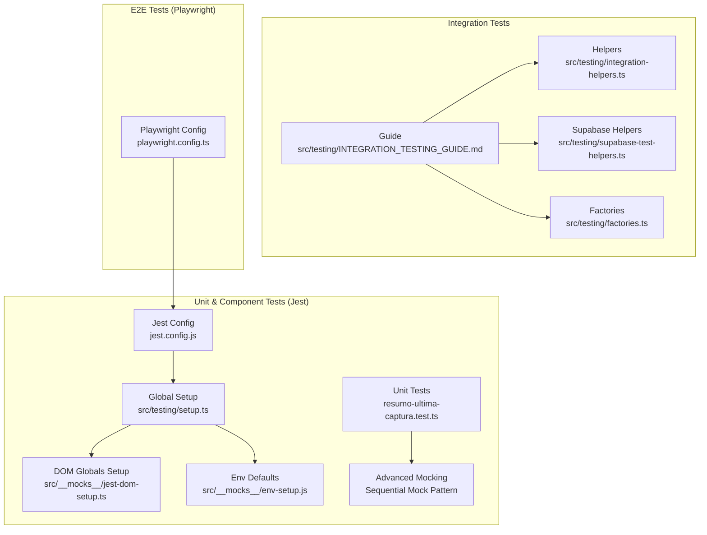

**Diagram sources**
- [jest.config.js:1-119](file://jest.config.js#L1-L119)
- [src/testing/setup.ts:1-358](file://src/testing/setup.ts#L1-L358)
- [src/__mocks__/jest-dom-setup.ts:1-36](file://src/__mocks__/jest-dom-setup.ts#L1-L36)
- [src/__mocks__/env-setup.js:1-14](file://src/__mocks__/env-setup.js#L1-L14)
- [src/testing/INTEGRATION_TESTING_GUIDE.md:1-530](file://src/testing/INTEGRATION_TESTING_GUIDE.md#L1-L530)
- [src/testing/integration-helpers.ts:1-265](file://src/testing/integration-helpers.ts#L1-L265)
- [src/testing/supabase-test-helpers.ts:1-17](file://src/testing/supabase-test-helpers.ts#L1-L17)
- [src/testing/factories.ts:1-17](file://src/testing/factories.ts#L1-L17)
- [playwright.config.ts:1-46](file://playwright.config.ts#L1-L46)
- [src/app/(authenticated)/expedientes/__tests__/unit/resumo-ultima-captura.test.ts:1-140](file://src/app/(authenticated)/expedientes/__tests__/unit/resumo-ultima-captura.test.ts#L1-L140)

**Section sources**
- [jest.config.js:1-119](file://jest.config.js#L1-L119)
- [playwright.config.ts:1-46](file://playwright.config.ts#L1-L46)
- [src/testing/INTEGRATION_TESTING_GUIDE.md:1-530](file://src/testing/INTEGRATION_TESTING_GUIDE.md#L1-L530)
- [src/testing/setup.ts:1-358](file://src/testing/setup.ts#L1-L358)
- [src/testing/integration-helpers.ts:1-265](file://src/testing/integration-helpers.ts#L1-L265)
- [src/testing/supabase-test-helpers.ts:1-17](file://src/testing/supabase-test-helpers.ts#L1-L17)
- [src/testing/factories.ts:1-17](file://src/testing/factories.ts#L1-L17)
- [src/__mocks__/jest-dom-setup.ts:1-36](file://src/__mocks__/jest-dom-setup.ts#L1-L36)
- [src/__mocks__/env-setup.js:1-14](file://src/__mocks__/env-setup.js#L1-L14)
- [src/app/(authenticated)/expedientes/__tests__/unit/resumo-ultima-captura.test.ts:1-140](file://src/app/(authenticated)/expedientes/__tests__/unit/resumo-ultima-captura.test.ts#L1-L140)

## Core Components
- Jest configuration supports:
  - Dual test environments: Node for server-side logic and jsdom for component tests.
  - Module name mapping and asset mocking.
  - ESM transformation for selected packages.
  - Environment-specific setup files and module mocks.
- Global setup initializes Web APIs, Next.js navigation mocks, and polyfills for streams and encoders.
- Integration testing guide and helpers provide AAA-style flows, factory builders, assertion helpers, and Supabase mock factories.
- Playwright configuration orchestrates local development server startup, cross-browser/device testing, and tracing on failure.

**Section sources**
- [jest.config.js:12-119](file://jest.config.js#L12-L119)
- [src/testing/setup.ts:25-118](file://src/testing/setup.ts#L25-L118)
- [src/testing/INTEGRATION_TESTING_GUIDE.md:38-114](file://src/testing/INTEGRATION_TESTING_GUIDE.md#L38-L114)
- [src/testing/integration-helpers.ts:102-133](file://src/testing/integration-helpers.ts#L102-L133)
- [playwright.config.ts:3-46](file://playwright.config.ts#L3-L46)

## Architecture Overview
The testing architecture separates concerns across layers and environments, enabling fast feedback loops and reliable validations.

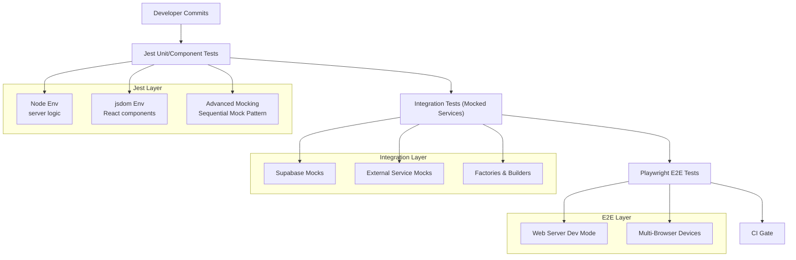

**Diagram sources**
- [jest.config.js:43-115](file://jest.config.js#L43-L115)
- [src/testing/INTEGRATION_TESTING_GUIDE.md:15-32](file://src/testing/INTEGRATION_TESTING_GUIDE.md#L15-L32)
- [src/testing/integration-helpers.ts:17-92](file://src/testing/integration-helpers.ts#L17-L92)
- [playwright.config.ts:17-44](file://playwright.config.ts#L17-L44)
- [src/app/(authenticated)/expedientes/__tests__/unit/resumo-ultima-captura.test.ts:4-22](file://src/app/(authenticated)/expedientes/__tests__/unit/resumo-ultima-captura.test.ts#L4-L22)

## Detailed Component Analysis

### Jest Configuration and Environments
- Projects:
  - Node project: server-side routes, libraries, and authenticated app tests.
  - jsdom project: components, hooks, providers, and shared UI tests.
- Environment-specific mocks and transforms:
  - ESM packages whitelisted for transformation.
  - Asset and module mocks for CSS, images, and Next.js modules.
  - Setup files inject DOM globals and environment defaults.
- Test discovery:
  - Matches files under __tests__ and *.test.* with ts/tsx/js/jsx.

**Diagram sources**
- [jest.config.js:43-115](file://jest.config.js#L43-L115)

**Section sources**
- [jest.config.js:12-119](file://jest.config.js#L12-L119)
- [src/__mocks__/jest-dom-setup.ts:1-36](file://src/__mocks__/jest-dom-setup.ts#L1-L36)
- [src/__mocks__/env-setup.js:1-14](file://src/__mocks__/env-setup.js#L1-L14)

### Global Setup and Polyfills
- Ensures presence of Web APIs (TextEncoder/TextDecoder, ReadableStream/WritableStream/TransformStream).
- Provides Next.js navigation mocks for client components.
- Mocks server-only and cache modules for server actions.
- Initializes UUID and editor-related libraries for component tests.

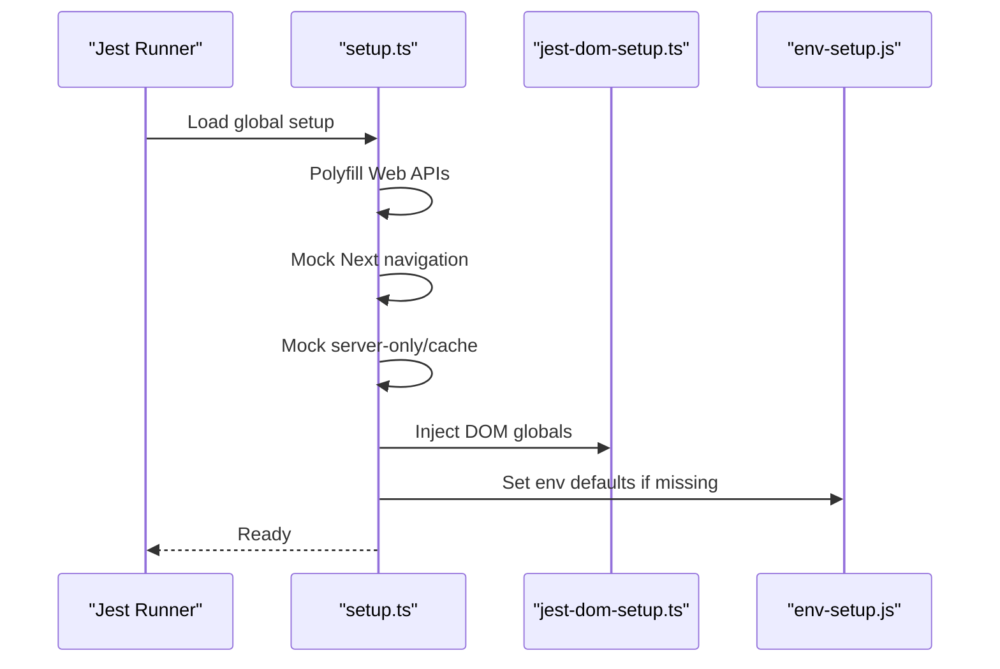

**Diagram sources**
- [src/testing/setup.ts:25-118](file://src/testing/setup.ts#L25-L118)
- [src/__mocks__/jest-dom-setup.ts:7-35](file://src/__mocks__/jest-dom-setup.ts#L7-L35)
- [src/__mocks__/env-setup.js:8-13](file://src/__mocks__/env-setup.js#L8-L13)

**Section sources**
- [src/testing/setup.ts:1-358](file://src/testing/setup.ts#L1-L358)
- [src/__mocks__/jest-dom-setup.ts:1-36](file://src/__mocks__/jest-dom-setup.ts#L1-L36)
- [src/__mocks__/env-setup.js:1-14](file://src/__mocks__/env-setup.js#L1-L14)

### Integration Testing Patterns and Helpers
- AAA pattern: Arrange (prepare data/mocks), Act (execute action), Assert (validate outcomes).
- Mock factories for domain entities (contracts, dockets) and builders for bulk generation.
- Supabase mock factory returning a fluent API for queries, inserts, updates, deletes, and RPC calls.
- Assertion helpers for pagination correctness and error shaping.
- Date helpers for relative dates and formatting.
- Conditional execution helpers for Supabase-dependent tests.

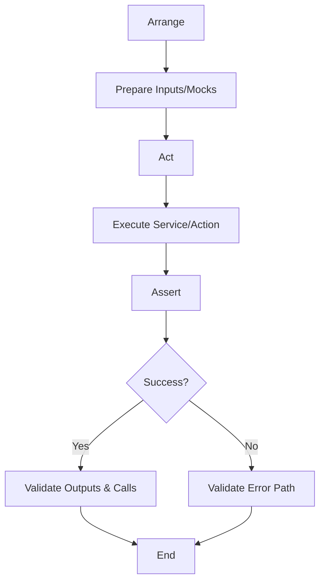

**Diagram sources**
- [src/testing/INTEGRATION_TESTING_GUIDE.md:40-55](file://src/testing/INTEGRATION_TESTING_GUIDE.md#L40-L55)
- [src/testing/integration-helpers.ts:17-92](file://src/testing/integration-helpers.ts#L17-L92)
- [src/testing/integration-helpers.ts:102-133](file://src/testing/integration-helpers.ts#L102-L133)
- [src/testing/integration-helpers.ts:147-158](file://src/testing/integration-helpers.ts#L147-L158)

**Section sources**
- [src/testing/INTEGRATION_TESTING_GUIDE.md:38-114](file://src/testing/INTEGRATION_TESTING_GUIDE.md#L38-L114)
- [src/testing/integration-helpers.ts:1-265](file://src/testing/integration-helpers.ts#L1-L265)
- [src/testing/supabase-test-helpers.ts:1-17](file://src/testing/supabase-test-helpers.ts#L1-L17)
- [src/testing/factories.ts:1-17](file://src/testing/factories.ts#L1-L17)

### Component Testing with React Testing Library
- jsdom project enables DOM rendering and React Testing Library assertions.
- Global setup ensures Next.js navigation mocks and Web APIs are available.
- Example component test exists under the app's test directory.

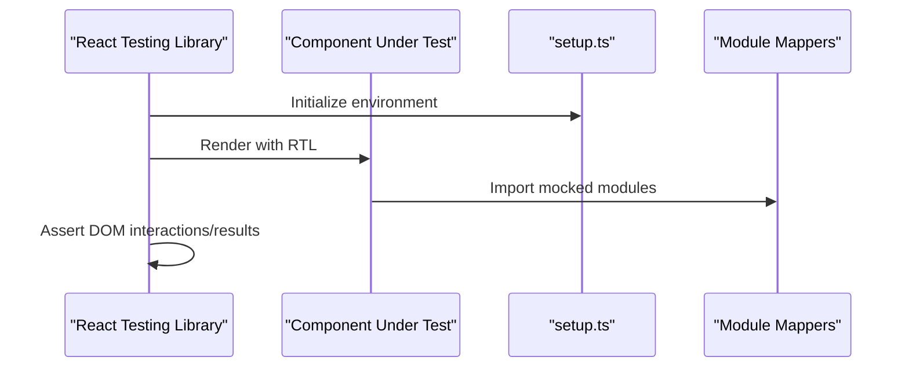

**Diagram sources**
- [jest.config.js:71-115](file://jest.config.js#L71-L115)
- [src/testing/setup.ts:25-118](file://src/testing/setup.ts#L25-L118)
- [src/app/__tests__/layout.test.tsx:1-50](file://src/app/__tests__/layout.test.tsx#L1-L50)

**Section sources**
- [jest.config.js:71-115](file://jest.config.js#L71-L115)
- [src/testing/setup.ts:25-118](file://src/testing/setup.ts#L25-L118)
- [src/app/__tests__/layout.test.tsx:1-50](file://src/app/__tests__/layout.test.tsx#L1-L50)

### Server Action Testing
- Node project configuration allows testing server actions and route handlers.
- Environment defaults prevent Supabase client initialization errors.
- Mocks for server-only and cache modules support server action scenarios.

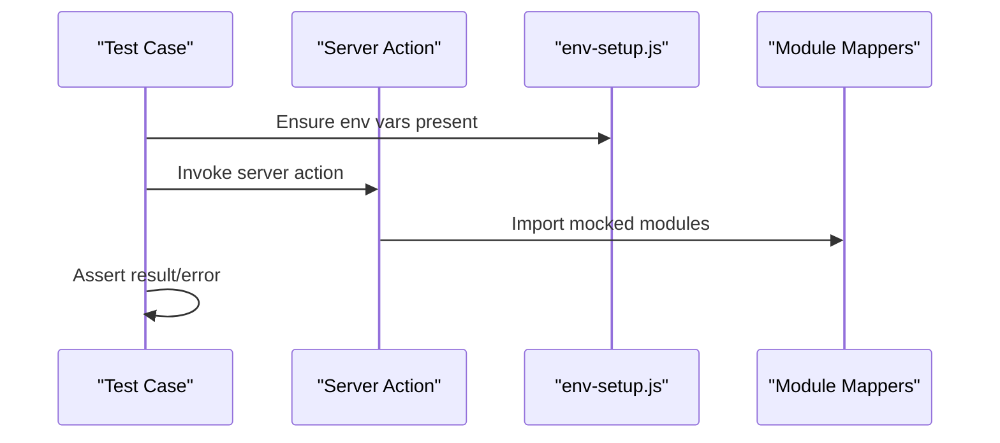

**Diagram sources**
- [jest.config.js:43-70](file://jest.config.js#L43-L70)
- [src/__mocks__/env-setup.js:8-13](file://src/__mocks__/env-setup.js#L8-L13)

**Section sources**
- [jest.config.js:43-70](file://jest.config.js#L43-L70)
- [src/__mocks__/env-setup.js:1-14](file://src/__mocks__/env-setup.js#L1-L14)

### Database Testing Approaches
- Integration tests mock Supabase client with a fluent API for queries and RPCs.
- Helpers provide paginated response and error mocks aligned with Supabase conventions.
- Conditional execution helpers enable tests to run only when Supabase credentials are available.

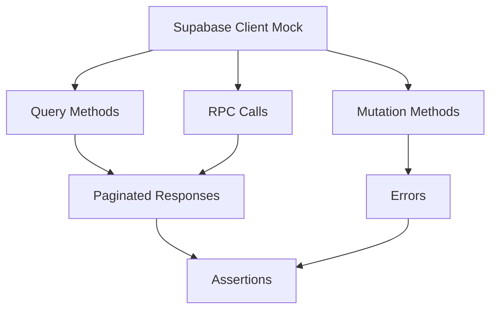

**Diagram sources**
- [src/testing/integration-helpers.ts:102-133](file://src/testing/integration-helpers.ts#L102-L133)
- [src/testing/integration-helpers.ts:166-188](file://src/testing/integration-helpers.ts#L166-L188)
- [src/testing/supabase-test-helpers.ts:3-14](file://src/testing/supabase-test-helpers.ts#L3-L14)

**Section sources**
- [src/testing/integration-helpers.ts:1-265](file://src/testing/integration-helpers.ts#L1-L265)
- [src/testing/supabase-test-helpers.ts:1-17](file://src/testing/supabase-test-helpers.ts#L1-L17)

### Playwright Configuration for E2E Testing
- Test discovery under src for E2E specs.
- Timeout, retries, and parallelization configured for reliability.
- Tracing retained on failure for diagnostics.
- Web server launched via npm run dev with port 3000 and reuse policy.
- Multi-project matrix for Chromium, Firefox, Safari, and mobile devices.

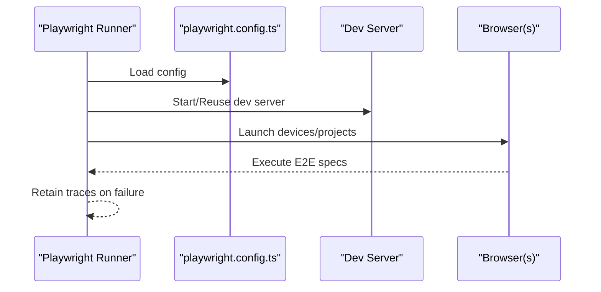

**Diagram sources**
- [playwright.config.ts:3-46](file://playwright.config.ts#L3-L46)

**Section sources**
- [playwright.config.ts:1-46](file://playwright.config.ts#L1-L46)

### Test Data Management and Mocking Strategies
- Factories produce realistic test users and dates.
- Integration helpers provide entity factories and builders for bulk generation.
- Supabase mock factory centralizes query/mutation/RPC stubbing.
- Global setup and module mappers ensure consistent mocking across tests.

**Section sources**
- [src/testing/factories.ts:1-17](file://src/testing/factories.ts#L1-L17)
- [src/testing/integration-helpers.ts:17-92](file://src/testing/integration-helpers.ts#L17-L92)
- [src/testing/integration-helpers.ts:102-133](file://src/testing/integration-helpers.ts#L102-L133)
- [src/testing/setup.ts:113-118](file://src/testing/setup.ts#L113-L118)

## Advanced Testing Patterns

### Comprehensive Unit Testing Suite for Business Logic Functions
The `obterResumoUltimaCaptura` function demonstrates advanced unit testing patterns with comprehensive coverage of edge cases, error handling, and business logic validation.

#### Sequential Mock Pattern
The test suite implements a sophisticated sequential mock pattern that simulates database query chains with controlled responses:

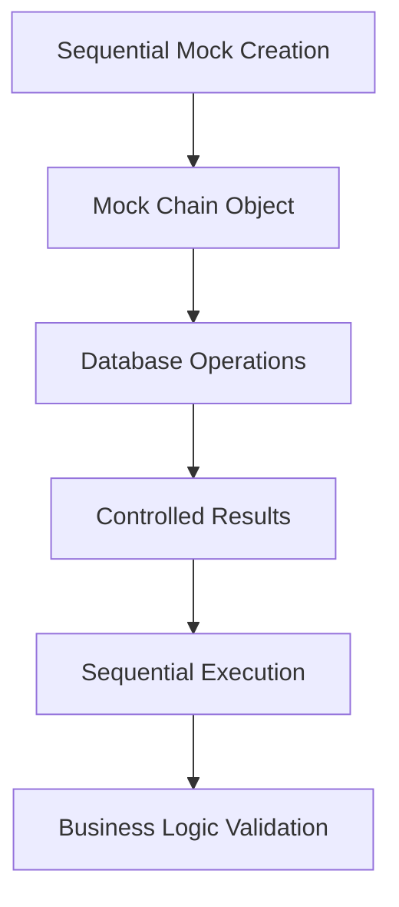

**Diagram sources**
- [src/app/(authenticated)/expedientes/__tests__/unit/resumo-ultima-captura.test.ts:4-22](file://src/app/(authenticated)/expedientes/__tests__/unit/resumo-ultima-captura.test.ts#L4-L22)

#### Edge Case Coverage
The test suite covers critical edge cases:
- **Empty State**: No completed captures found returns null safely
- **Count Null Handling**: Database null values properly handled as zeros
- **Business Logic Validation**: Created vs updated calculations based on timestamps
- **Error Propagation**: Database errors properly converted to application errors

#### Mock Factory Implementation
The sequential mock factory provides:
- **Chained Method Calls**: Simulates Supabase query builder pattern
- **Sequential Results**: Different responses for each database operation
- **Flexible Configuration**: Customizable results for different test scenarios
- **Call Tracking**: Verifies correct method calls and parameters

**Section sources**
- [src/app/(authenticated)/expedientes/__tests__/unit/resumo-ultima-captura.test.ts:1-140](file://src/app/(authenticated)/expedientes/__tests__/unit/resumo-ultima-captura.test.ts#L1-L140)
- [src/app/(authenticated)/expedientes/repository.ts:758-810](file://src/app/(authenticated)/expedientes/repository.ts#L758-L810)
- [src/app/(authenticated)/expedientes/service.ts:268-271](file://src/app/(authenticated)/expedientes/service.ts#L268-L271)
- [src/app/(authenticated)/expedientes/domain.ts:304-311](file://src/app/(authenticated)/expedientes/domain.ts#L304-L311)

### Business Logic Validation Patterns
The test suite validates complex business logic through multiple scenarios:

#### Scenario-Based Testing
- **Normal Operation**: Successful capture with expected counts
- **Edge Cases**: Null values, empty results, partial data
- **Error Conditions**: Database failures, connection timeouts
- **Complex Calculations**: Derived metrics from raw data

#### Data Flow Validation
The tests verify the complete data flow from database queries to business logic calculations:

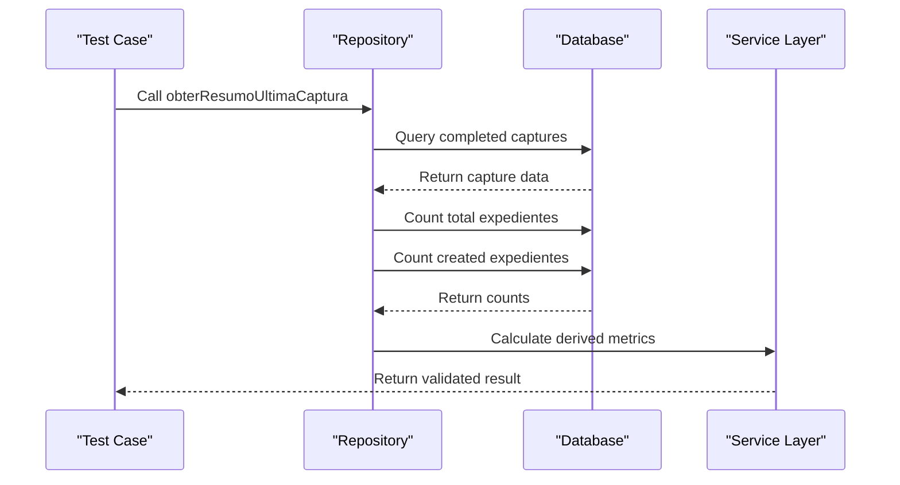

**Diagram sources**
- [src/app/(authenticated)/expedientes/repository.ts:759-809](file://src/app/(authenticated)/expedientes/repository.ts#L759-L809)
- [src/app/(authenticated)/expedientes/service.ts:269-271](file://src/app/(authenticated)/expedientes/service.ts#L269-L271)

**Section sources**
- [src/app/(authenticated)/expedientes/repository.ts:758-810](file://src/app/(authenticated)/expedientes/repository.ts#L758-L810)
- [src/app/(authenticated)/expedientes/service.ts:268-271](file://src/app/(authenticated)/expedientes/service.ts#L268-L271)

### Practical Examples and Patterns
- Writing unit tests for hooks and providers using jsdom environment and React Testing Library.
- Writing integration tests for service-layer flows with mocked repositories and Supabase client.
- Writing E2E tests for user journeys across desktop and mobile browsers with Playwright.
- Testing async operations with proper awaits and promise-based assertions.
- Validating real-time features by asserting reactive updates after state changes.
- Implementing advanced mocking patterns for complex business logic validation.

**Updated** Added comprehensive examples for sequential mock patterns and business logic validation.

## Dependency Analysis
Testing dependencies are decoupled via module mappers and global setup, minimizing circular dependencies and enabling isolated test runs.

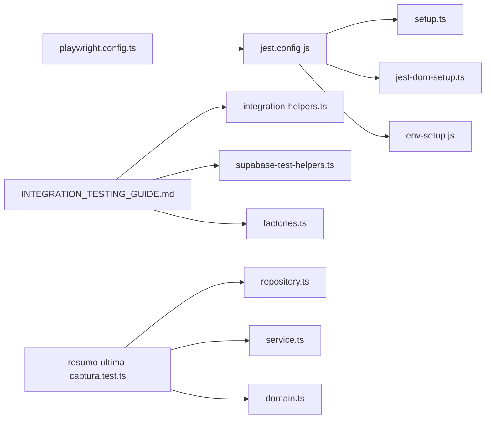

**Diagram sources**
- [jest.config.js:12-119](file://jest.config.js#L12-L119)
- [src/testing/setup.ts:1-358](file://src/testing/setup.ts#L1-L358)
- [src/__mocks__/jest-dom-setup.ts:1-36](file://src/__mocks__/jest-dom-setup.ts#L1-L36)
- [src/__mocks__/env-setup.js:1-14](file://src/__mocks__/env-setup.js#L1-L14)
- [src/testing/INTEGRATION_TESTING_GUIDE.md:1-530](file://src/testing/INTEGRATION_TESTING_GUIDE.md#L1-L530)
- [src/testing/integration-helpers.ts:1-265](file://src/testing/integration-helpers.ts#L1-L265)
- [src/testing/supabase-test-helpers.ts:1-17](file://src/testing/supabase-test-helpers.ts#L1-L17)
- [src/testing/factories.ts:1-17](file://src/testing/factories.ts#L1-L17)
- [playwright.config.ts:1-46](file://playwright.config.ts#L1-L46)
- [src/app/(authenticated)/expedientes/__tests__/unit/resumo-ultima-captura.test.ts:1-140](file://src/app/(authenticated)/expedientes/__tests__/unit/resumo-ultima-captura.test.ts#L1-L140)
- [src/app/(authenticated)/expedientes/repository.ts:758-810](file://src/app/(authenticated)/expedientes/repository.ts#L758-L810)
- [src/app/(authenticated)/expedientes/service.ts:268-271](file://src/app/(authenticated)/expedientes/service.ts#L268-L271)
- [src/app/(authenticated)/expedientes/domain.ts:304-311](file://src/app/(authenticated)/expedientes/domain.ts#L304-L311)

**Section sources**
- [jest.config.js:12-119](file://jest.config.js#L12-L119)
- [src/testing/INTEGRATION_TESTING_GUIDE.md:1-530](file://src/testing/INTEGRATION_TESTING_GUIDE.md#L1-L530)
- [playwright.config.ts:1-46](file://playwright.config.ts#L1-L46)
- [src/app/(authenticated)/expedientes/__tests__/unit/resumo-ultima-captura.test.ts:1-140](file://src/app/(authenticated)/expedientes/__tests__/unit/resumo-ultima-captura.test.ts#L1-L140)

## Performance Considerations
- Prefer mocking external services to avoid flaky network-bound tests.
- Use factory builders for bulk data to reduce duplication and speed up tests.
- Keep test suites focused and isolated to minimize teardown overhead.
- Leverage parallelism in Playwright projects judiciously while controlling timeouts.
- Implement efficient sequential mock patterns to avoid excessive test setup complexity.

**Updated** Added performance considerations for advanced mocking patterns.

## Troubleshooting Guide
- Missing Web APIs in jsdom:
  - Ensure global setup polyfills TextEncoder/TextDecoder and streams.
- Supabase client initialization errors:
  - Confirm environment defaults are set via env-setup or override locally.
- Next.js navigation mocks failing:
  - Verify Next.js navigation mocks are applied in setup.
- E2E tests timing out:
  - Increase timeout or adjust device emulation; confirm dev server reuse policy.
- Conditional Supabase tests:
  - Use helpers to skip tests when credentials are not available.
- Advanced mocking issues:
  - Verify sequential mock patterns match expected database query sequences.
  - Check that mock chain methods return consistent types across calls.

**Updated** Added troubleshooting guidance for advanced mocking patterns.

**Section sources**
- [src/testing/setup.ts:39-86](file://src/testing/setup.ts#L39-L86)
- [src/__mocks__/env-setup.js:8-13](file://src/__mocks__/env-setup.js#L8-L13)
- [src/testing/supabase-test-helpers.ts:3-14](file://src/testing/supabase-test-helpers.ts#L3-L14)
- [playwright.config.ts:9-22](file://playwright.config.ts#L9-L22)
- [src/app/(authenticated)/expedientes/__tests__/unit/resumo-ultima-captura.test.ts:4-22](file://src/app/(authenticated)/expedientes/__tests__/unit/resumo-ultima-captura.test.ts#L4-L22)

## Conclusion
ZattarOS employs a layered testing strategy with Jest for unit and integration tests and Playwright for E2E validation. The configuration supports dual environments, robust global setup, and reusable integration helpers. The addition of comprehensive unit testing for business logic functions like `obterResumoUltimaCaptura` demonstrates advanced testing patterns including sequential mocking, edge case coverage, and business logic validation. By following the AAA pattern, leveraging factories and builders, implementing sophisticated mocking strategies, and mocking external services, teams can write reliable, maintainable tests across components, server actions, and complex business logic scenarios. Coverage targets and CI workflows should emphasize critical business flows and user journeys while maintaining high-quality unit test coverage for core business functions.

**Updated** Enhanced conclusion to reflect the comprehensive unit testing capabilities and advanced patterns demonstrated in the codebase.

## Appendices
- Example test files:
  - Component test: [layout.test.tsx](file://src/app/__tests__/layout.test.tsx)
  - Business logic unit test: [resumo-ultima-captura.test.ts](file://src/app/(authenticated)/expedientes/__tests__/unit/resumo-ultima-captura.test.ts)
- Integration testing guide and helpers:
  - [INTEGRATION_TESTING_GUIDE.md](file://src/testing/INTEGRATION_TESTING_GUIDE.md)
  - [integration-helpers.ts](file://src/testing/integration-helpers.ts)
  - [supabase-test-helpers.ts](file://src/testing/supabase-test-helpers.ts)
  - [factories.ts](file://src/testing/factories.ts)
- Configuration files:
  - [jest.config.js](file://jest.config.js)
  - [playwright.config.ts](file://playwright.config.ts)
  - [jest-dom-setup.ts](file://src/__mocks__/jest-dom-setup.ts)
  - [env-setup.js](file://src/__mocks__/env-setup.js)
- Business logic components:
  - [repository.ts](file://src/app/(authenticated)/expedientes/repository.ts)
  - [service.ts](file://src/app/(authenticated)/expedientes/service.ts)
  - [domain.ts](file://src/app/(authenticated)/expedientes/domain.ts)

**Updated** Added references to the comprehensive unit testing suite and related business logic components.