# Testing Strategy and Implementation

<cite>
**Referenced Files in This Document**
- [jest.config.js](file://jest.config.js)
- [playwright.config.ts](file://playwright.config.ts)
- [src/testing/INTEGRATION_TESTING_GUIDE.md](file://src/testing/INTEGRATION_TESTING_GUIDE.md)
- [src/testing/setup.ts](file://src/testing/setup.ts)
- [src/testing/integration-helpers.ts](file://src/testing/integration-helpers.ts)
- [src/testing/supabase-test-helpers.ts](file://src/testing/supabase-test-helpers.ts)
- [src/__mocks__/jest-dom-setup.ts](file://src/__mocks__/jest-dom-setup.ts)
- [src/__mocks__/env-setup.js](file://src/__mocks__/env-setup.js)
- [src/testing/factories.ts](file://src/testing/factories.ts)
- [src/app/__tests__/layout.test.tsx](file://src/app/__tests__/layout.test.tsx)
- [src/app/(authenticated)/expedientes/__tests__/unit/resumo-ultima-captura.test.ts](file://src/app/(authenticated)/expedientes/__tests__/unit/resumo-ultima-captura.test.ts)
- [src/app/(authenticated)/expedientes/repository.ts](file://src/app/(authenticated)/expedientes/repository.ts)
- [src/app/(authenticated)/expedientes/service.ts](file://src/app/(authenticated)/expedientes/service.ts)
- [src/app/(authenticated)/expedientes/domain.ts](file://src/app/(authenticated)/expedientes/domain.ts)
- [scripts/captura/pendentes/debug-expedientes-trt3-direto.ts](file://scripts/captura/pendentes/debug-expedientes-trt3-direto.ts)
- [scripts/captura/audiencias/debug-audiencias-trt3-direto.ts](file://scripts/captura/audiencias/debug-audiencias-trt3-direto.ts)
- [scripts/captura/pericias/debug-pericias-trt3-direto.ts](file://scripts/captura/pericias/debug-pericias-trt3-direto.ts)
- [test-expedientes/2026-04-28T20-00-06-091Z_00_log.txt](file://test-expedientes/2026-04-28T20-00-06-091Z_00_log.txt)
- [test-expedientes/2026-04-28T20-00-06-091Z_01_config_trt3.json](file://test-expedientes/2026-04-28T20-00-06-091Z_01_config_trt3.json)
- [test-expedientes/2026-04-28T20-00-06-091Z_02_totalizadores.json](file://test-expedientes/2026-04-28T20-00-06-091Z_02_totalizadores.json)
- [test-expedientes/2026-04-28T20-00-06-091Z_03_no_prazo_processos.json](file://test-expedientes/2026-04-28T20-00-06-091Z_03_no_prazo_processos.json)
- [test-expedientes/2026-04-28T20-00-06-091Z_04_sem_prazo_processos.json](file://test-expedientes/2026-04-28T20-00-06-091Z_04_sem_prazo_processos.json)
- [test-expedientes/2026-04-28T20-00-06-091Z_05_analise_duplicatas.json](file://test-expedientes/2026-04-28T20-00-06-091Z_05_analise_duplicatas.json)
- [test-expedientes/2026-04-28T20-00-06-091Z_06_comparacao_banco.json](file://test-expedientes/2026-04-28T20-00-06-091Z_06_comparacao_banco.json)
- [test-expedientes/2026-04-28T20-00-06-091Z_07_relatorio_final.json](file://test-expedientes/2026-04-28T20-00-06-091Z_07_relatorio_final.json)
- [test-audiencias/2026-04-28T21-34-53-129Z_00_log.txt](file://test-audiencias/2026-04-28T21-34-53-129Z_00_log.txt)
- [test-audiencias/2026-04-28T21-34-53-129Z_01_config_trt3.json](file://test-audiencias/2026-04-28T21-34-53-129Z_01_config_trt3.json)
- [test-audiencias/2026-04-28T21-34-53-129Z_02_designadas_audiencias.json](file://test-audiencias/2026-04-28T21-34-53-129Z_02_designadas_audiencias.json)
- [test-audiencias/2026-04-28T21-34-53-129Z_03_analise_audiencias.json](file://test-audiencias/2026-04-28T21-34-53-129Z_03_analise_audiencias.json)
- [test-audiencias/2026-04-28T21-34-53-129Z_04_constraint_check.json](file://test-audiencias/2026-04-28T21-34-53-129Z_04_constraint_check.json)
- [test-audiencias/2026-04-28T21-34-53-129Z_05_comparacao_banco.json](file://test-audiencias/2026-04-28T21-34-53-129Z_05_comparacao_banco.json)
- [test-audiencias/2026-04-28T21-34-53-129Z_06_relatorio_final.json](file://test-audiencias/2026-04-28T21-34-53-129Z_06_relatorio_final.json)
- [test-pericias/2026-04-28T21-48-33-942Z_00_log.txt](file://test-pericias/2026-04-28T21-48-33-942Z_00_log.txt)
- [test-pericias/2026-04-28T21-48-33-942Z_01_config_trt3.json](file://test-pericias/2026-04-28T21-48-33-942Z_01_config_trt3.json)
- [test-pericias/2026-04-28T21-48-33-942Z_02_pericias_raw.json](file://test-pericias/2026-04-28T21-48-33-942Z_02_pericias_raw.json)
- [test-pericias/2026-04-28T21-48-33-942Z_03_analise_pericias.json](file://test-pericias/2026-04-28T21-48-33-942Z_03_analise_pericias.json)
- [test-pericias/2026-04-28T21-48-33-942Z_04_constraint_check.json](file://test-pericias/2026-04-28T21-48-33-942Z_04_constraint_check.json)
- [test-pericias/2026-04-28T21-48-33-942Z_05_comparacao_banco.json](file://test-pericias/2026-04-28T21-48-33-942Z_05_comparacao_banco.json)
- [test-pericias/2026-04-28T21-48-33-942Z_06_relatorio_final.json](file://test-pericias/2026-04-28T21-48-33-942Z_06_relatorio_final.json)
- [supabase/migrations/20260427090510_add_ultima_captura_id_to_expedientes.sql](file://supabase/migrations/20260427090510_add_ultima_captura_id_to_expedientes.sql)
- [src/app/(authenticated)/expedientes/__tests__/integration/expedientes-flow.test.ts](file://src/app/(authenticated)/expedientes/__tests__/integration/expedientes-flow.test.ts)
- [src/app/(authenticated)/expedientes/__tests__/unit/expedientes.service.test.ts](file://src/app/(authenticated)/expedientes/__tests__/unit/expedientes.service.test.ts)
- [src/app/(authenticated)/expedientes/__tests__/components/expediente-dialog.test.tsx](file://src/app/(authenticated)/expedientes/__tests__/components/expediente-dialog.test.tsx)
- [src/app/(authenticated)/expedientes/__tests__/actions/expedientes-actions.test.ts](file://src/app/(authenticated)/expedientes/__tests__/actions/expedientes-actions.test.ts)
- [src/app/(authenticated)/expedientes/__tests__/integration/alterar-responsavel-flow.test.ts](file://src/app/(authenticated)/expedientes/__tests__/integration/alterar-responsavel-flow.test.ts)
</cite>

## Update Summary
**Changes Made**
- Added comprehensive JSON reporting system documentation with automatic report generation during capture processes
- Integrated analysis summaries, constraint checks, and final reports for expediente, audiencia, and pericia capture processes
- Enhanced debugging framework with standardized artifact generation and comparison capabilities
- Updated test artifact structure with standardized naming conventions and metadata
- Added constraint validation and diagnostic reporting for capture integrity

## Table of Contents
1. [Introduction](#introduction)
2. [Project Structure](#project-structure)
3. [Core Components](#core-components)
4. [Architecture Overview](#architecture-overview)
5. [Detailed Component Analysis](#detailed-component-analysis)
6. [Advanced Testing Patterns](#advanced-testing-patterns)
7. [Debugging and Artifact Generation Framework](#debugging-and-artifact-generation-framework)
8. [JSON Reporting System](#json-reporting-system)
9. [Database Testing and Migration Integration](#database-testing-and-migration-integration)
10. [Component Testing with React Testing Library](#component-testing-with-react-testing-library)
11. [Server Action Testing](#server-action-testing)
12. [Integration Testing Patterns](#integration-testing-patterns)
13. [Playwright E2E Testing Framework](#playwright-e2e-testing-framework)
14. [Test Data Management and Mocking Strategies](#test-data-management-and-mocking-strategies)
15. [Performance Considerations](#performance-considerations)
16. [Troubleshooting Guide](#troubleshooting-guide)
17. [Conclusion](#conclusion)
18. [Appendices](#appendices)

## Introduction
This document defines the comprehensive testing strategy and implementation for ZattarOS across unit, integration, and end-to-end (E2E) testing. The framework has been significantly enhanced with a new comprehensive JSON reporting system featuring automatic report generation during capture processes, including analysis summaries, constraint checks, and final reports. The system provides standardized artifact generation for expediente, audiencia, and pericia capture processes, enabling detailed analysis and validation of capture operations.

**Updated** Enhanced with comprehensive JSON reporting system documentation and standardized artifact generation capabilities.

## Project Structure
Testing in ZattarOS is organized around four comprehensive layers with enhanced artifact generation:
- Unit and component tests: Jest with dual environments (Node and jsdom) for server-side and client-side logic
- Integration tests: Feature-focused flows with mocked external services and Supabase client
- E2E tests: Playwright-driven browser automation with comprehensive artifact generation
- Debugging framework: Direct TRT3 capture testing with standardized JSON reporting system

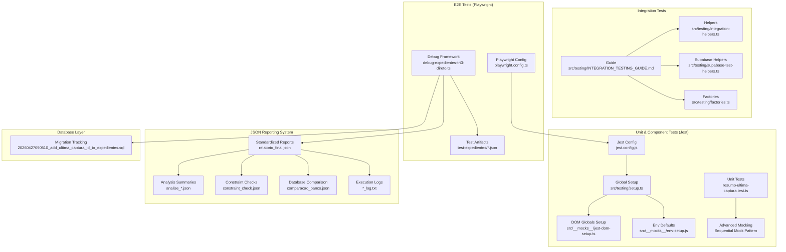

**Diagram sources**
- [jest.config.js:1-119](file://jest.config.js#L1-L119)
- [src/testing/setup.ts:1-358](file://src/testing/setup.ts#L1-L358)
- [src/__mocks__/jest-dom-setup.ts:1-36](file://src/__mocks__/jest-dom-setup.ts#L1-L36)
- [src/__mocks__/env-setup.js:1-14](file://src/__mocks__/env-setup.js#L1-L14)
- [src/testing/INTEGRATION_TESTING_GUIDE.md:1-530](file://src/testing/INTEGRATION_TESTING_GUIDE.md#L1-L530)
- [src/testing/integration-helpers.ts:1-265](file://src/testing/integration-helpers.ts#L1-L265)
- [src/testing/supabase-test-helpers.ts:1-17](file://src/testing/supabase-test-helpers.ts#L1-L17)
- [src/testing/factories.ts:1-17](file://src/testing/factories.ts#L1-L17)
- [playwright.config.ts:1-46](file://playwright.config.ts#L1-L46)
- [src/app/(authenticated)/expedientes/__tests__/unit/resumo-ultima-captura.test.ts:1-140](file://src/app/(authenticated)/expedientes/__tests__/unit/resumo-ultima-captura.test.ts#L1-L140)
- [scripts/captura/pendentes/debug-expedientes-trt3-direto.ts:1-836](file://scripts/captura/pendentes/debug-expedientes-trt3-direto.ts#L1-L836)
- [test-expedientes/2026-04-28T20-00-06-091Z_00_log.txt:1-76](file://test-expedientes/2026-04-28T20-00-06-091Z_00_log.txt#L1-L76)
- [test-expedientes/2026-04-28T20-00-06-091Z_07_relatorio_final.json:1-26](file://test-expedientes/2026-04-28T20-00-06-091Z_07_relatorio_final.json#L1-L26)
- [test-audiencias/2026-04-28T21-34-53-129Z_06_relatorio_final.json:1-39](file://test-audiencias/2026-04-28T21-34-53-129Z_06_relatorio_final.json#L1-L39)
- [test-pericias/2026-04-28T21-48-33-942Z_06_relatorio_final.json:1-47](file://test-pericias/2026-04-28T21-48-33-942Z_06_relatorio_final.json#L1-L47)
- [supabase/migrations/20260427090510_add_ultima_captura_id_to_expedientes.sql:1-14](file://supabase/migrations/20260427090510_add_ultima_captura_id_to_expedientes.sql#L1-L14)

**Section sources**
- [jest.config.js:1-119](file://jest.config.js#L1-L119)
- [playwright.config.ts:1-46](file://playwright.config.ts#L1-L46)
- [src/testing/INTEGRATION_TESTING_GUIDE.md:1-530](file://src/testing/INTEGRATION_TESTING_GUIDE.md#L1-L530)
- [src/testing/setup.ts:1-358](file://src/testing/setup.ts#L1-L358)
- [src/testing/integration-helpers.ts:1-265](file://src/testing/integration-helpers.ts#L1-L265)
- [src/testing/supabase-test-helpers.ts:1-17](file://src/testing/supabase-test-helpers.ts#L1-L17)
- [src/testing/factories.ts:1-17](file://src/testing/factories.ts#L1-L17)
- [src/__mocks__/jest-dom-setup.ts:1-36](file://src/__mocks__/jest-dom-setup.ts#L1-L36)
- [src/__mocks__/env-setup.js:1-14](file://src/__mocks__/env-setup.js#L1-L14)
- [src/app/(authenticated)/expedientes/__tests__/unit/resumo-ultima-captura.test.ts:1-140](file://src/app/(authenticated)/expedientes/__tests__/unit/resumo-ultima-captura.test.ts#L1-L140)
- [scripts/captura/pendentes/debug-expedientes-trt3-direto.ts:1-836](file://scripts/captura/pendentes/debug-expedientes-trt3-direto.ts#L1-L836)
- [test-expedientes/2026-04-28T20-00-06-091Z_00_log.txt:1-76](file://test-expedientes/2026-04-28T20-00-06-091Z_00_log.txt#L1-L76)
- [test-expedientes/2026-04-28T20-00-06-091Z_07_relatorio_final.json:1-26](file://test-expedientes/2026-04-28T20-00-06-091Z_07_relatorio_final.json#L1-L26)
- [test-audiencias/2026-04-28T21-34-53-129Z_06_relatorio_final.json:1-39](file://test-audiencias/2026-04-28T21-34-53-129Z_06_relatorio_final.json#L1-L39)
- [test-pericias/2026-04-28T21-48-33-942Z_06_relatorio_final.json:1-47](file://test-pericias/2026-04-28T21-48-33-942Z_06_relatorio_final.json#L1-L47)
- [supabase/migrations/20260427090510_add_ultima_captura_id_to_expedientes.sql:1-14](file://supabase/migrations/20260427090510_add_ultima_captura_id_to_expedientes.sql#L1-L14)

## Core Components
- Jest configuration supports dual test environments: Node for server-side logic and jsdom for component tests, with comprehensive module name mapping and asset mocking
- Global setup initializes Web APIs, Next.js navigation mocks, and polyfills for streams and encoders
- Integration testing guide and helpers provide AAA-style flows, factory builders, assertion helpers, and Supabase mock factories
- Playwright configuration orchestrates local development server startup, cross-browser/device testing, and tracing on failure
- **New**: Comprehensive JSON reporting system with automatic report generation during capture processes
- **New**: Standardized artifact generation with analysis summaries, constraint checks, and final reports
- **New**: Database migration integration with tracking of last capture ID for audit and validation purposes

**Section sources**
- [jest.config.js:12-119](file://jest.config.js#L12-L119)
- [src/testing/setup.ts:25-118](file://src/testing/setup.ts#L25-L118)
- [src/testing/INTEGRATION_TESTING_GUIDE.md:38-114](file://src/testing/INTEGRATION_TESTING_GUIDE.md#L38-L114)
- [src/testing/integration-helpers.ts:102-133](file://src/testing/integration-helpers.ts#L102-L133)
- [playwright.config.ts:3-46](file://playwright.config.ts#L3-L46)
- [scripts/captura/pendentes/debug-expedientes-trt3-direto.ts:1-836](file://scripts/captura/pendentes/debug-expedientes-trt3-direto.ts#L1-L836)
- [scripts/captura/audiencias/debug-audiencias-trt3-direto.ts:898-960](file://scripts/captura/audiencias/debug-audiencias-trt3-direto.ts#L898-L960)
- [scripts/captura/pericias/debug-pericias-trt3-direto.ts:630-682](file://scripts/captura/pericias/debug-pericias-trt3-direto.ts#L630-L682)
- [supabase/migrations/20260427090510_add_ultima_captura_id_to_expedientes.sql:1-14](file://supabase/migrations/20260427090510_add_ultima_captura_id_to_expedientes.sql#L1-L14)

## Architecture Overview
The testing architecture separates concerns across layers and environments, enabling comprehensive validation of capture workflows with detailed artifact generation and standardized reporting capabilities.

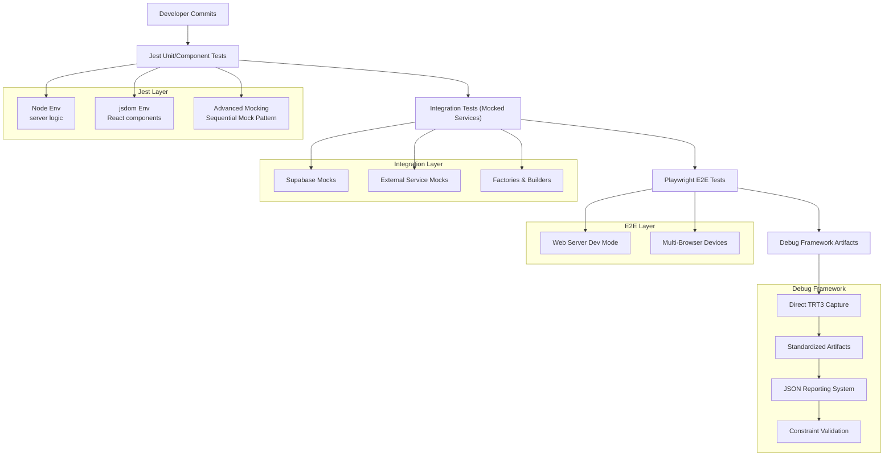

**Diagram sources**
- [jest.config.js:43-115](file://jest.config.js#L43-L115)
- [src/testing/INTEGRATION_TESTING_GUIDE.md:15-32](file://src/testing/INTEGRATION_TESTING_GUIDE.md#L15-L32)
- [src/testing/integration-helpers.ts:17-92](file://src/testing/integration-helpers.ts#L17-L92)
- [playwright.config.ts:17-44](file://playwright.config.ts#L17-L44)
- [src/app/(authenticated)/expedientes/__tests__/unit/resumo-ultima-captura.test.ts:4-22](file://src/app/(authenticated)/expedientes/__tests__/unit/resumo-ultima-captura.test.ts#L4-L22)
- [scripts/captura/pendentes/debug-expedientes-trt3-direto.ts:669-836](file://scripts/captura/pendentes/debug-expedientes-trt3-direto.ts#L669-L836)
- [scripts/captura/audiencias/debug-audiencias-trt3-direto.ts:898-960](file://scripts/captura/audiencias/debug-audiencias-trt3-direto.ts#L898-L960)
- [scripts/captura/pericias/debug-pericias-trt3-direto.ts:630-682](file://scripts/captura/pericias/debug-pericias-trt3-direto.ts#L630-L682)

## Detailed Component Analysis

### Jest Configuration and Environments
- Projects: Node project for server-side routes, libraries, and authenticated app tests; jsdom project for components, hooks, providers, and shared UI tests
- Environment-specific mocks and transforms: ESM packages whitelisted for transformation, asset and module mocks for CSS, images, and Next.js modules, setup files inject DOM globals and environment defaults
- Test discovery: Matches files under __tests__ and *.test.* with ts/tsx/js/jsx

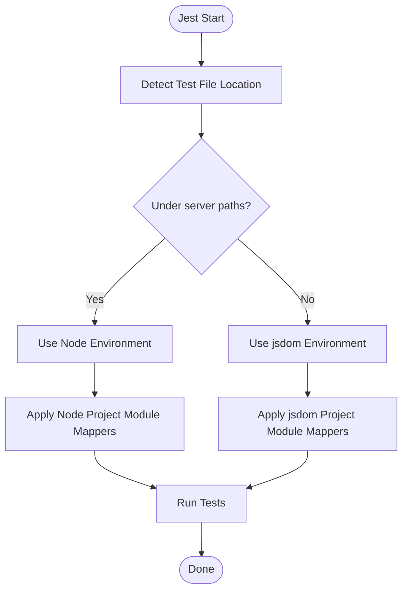

**Diagram sources**
- [jest.config.js:43-115](file://jest.config.js#L43-L115)

**Section sources**
- [jest.config.js:12-119](file://jest.config.js#L12-L119)
- [src/__mocks__/jest-dom-setup.ts:1-36](file://src/__mocks__/jest-dom-setup.ts#L1-L36)
- [src/__mocks__/env-setup.js:1-14](file://src/__mocks__/env-setup.js#L1-L14)

### Global Setup and Polyfills
- Ensures presence of Web APIs (TextEncoder/TextDecoder, ReadableStream/WritableStream/TransformStream)
- Provides Next.js navigation mocks for client components
- Mocks server-only and cache modules for server actions
- Initializes UUID and editor-related libraries for component tests

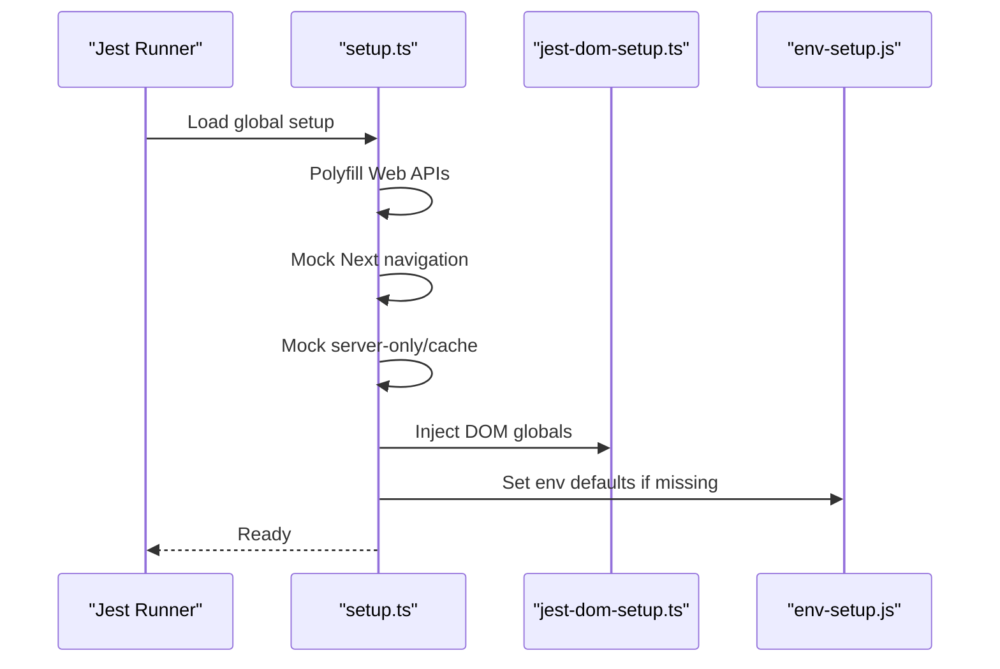

**Diagram sources**
- [src/testing/setup.ts:25-118](file://src/testing/setup.ts#L25-L118)
- [src/__mocks__/jest-dom-setup.ts:7-35](file://src/__mocks__/jest-dom-setup.ts#L7-L35)
- [src/__mocks__/env-setup.js:8-13](file://src/__mocks__/env-setup.js#L8-L13)

**Section sources**
- [src/testing/setup.ts:1-358](file://src/testing/setup.ts#L1-L358)
- [src/__mocks__/jest-dom-setup.ts:1-36](file://src/__mocks__/jest-dom-setup.ts#L1-L36)
- [src/__mocks__/env-setup.js:1-14](file://src/__mocks__/env-setup.js#L1-L14)

### Integration Testing Patterns and Helpers
- AAA pattern: Arrange (prepare data/mocks), Act (execute action), Assert (validate outcomes)
- Mock factories for domain entities (contracts, dockets) and builders for bulk generation
- Supabase mock factory returning a fluent API for queries, inserts, updates, deletes, and RPC calls
- Assertion helpers for pagination correctness and error shaping
- Date helpers for relative dates and formatting
- Conditional execution helpers for Supabase-dependent tests

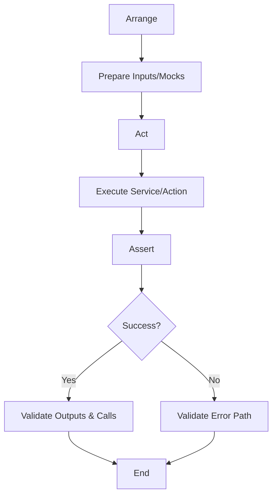

**Diagram sources**
- [src/testing/INTEGRATION_TESTING_GUIDE.md:40-55](file://src/testing/INTEGRATION_TESTING_GUIDE.md#L40-L55)
- [src/testing/integration-helpers.ts:17-92](file://src/testing/integration-helpers.ts#L17-L92)
- [src/testing/integration-helpers.ts:102-133](file://src/testing/integration-helpers.ts#L102-L133)
- [src/testing/integration-helpers.ts:147-158](file://src/testing/integration-helpers.ts#L147-L158)

**Section sources**
- [src/testing/INTEGRATION_TESTING_GUIDE.md:38-114](file://src/testing/INTEGRATION_TESTING_GUIDE.md#L38-L114)
- [src/testing/integration-helpers.ts:1-265](file://src/testing/integration-helpers.ts#L1-L265)
- [src/testing/supabase-test-helpers.ts:1-17](file://src/testing/supabase-test-helpers.ts#L1-L17)
- [src/testing/factories.ts:1-17](file://src/testing/factories.ts#L1-L17)

### Playwright Configuration for E2E Testing
- Test discovery under src for E2E specs
- Timeout, retries, and parallelization configured for reliability
- Tracing retained on failure for diagnostics
- Web server launched via npm run dev with port 3000 and reuse policy
- Multi-project matrix for Chromium, Firefox, Safari, and mobile devices

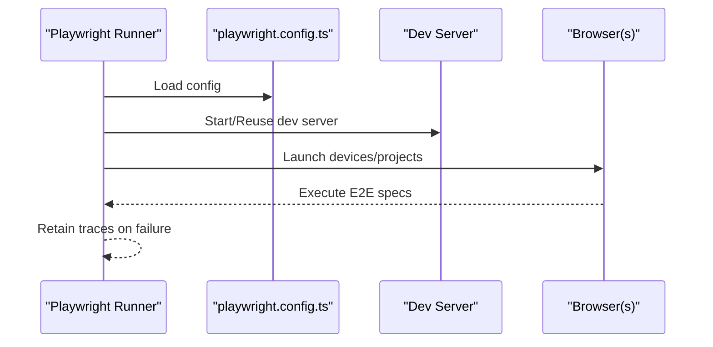

**Diagram sources**
- [playwright.config.ts:3-46](file://playwright.config.ts#L3-L46)

**Section sources**
- [playwright.config.ts:1-46](file://playwright.config.ts#L1-L46)

## Advanced Testing Patterns

### Comprehensive Unit Testing Suite for Business Logic Functions
The `obterResumoUltimaCaptura` function demonstrates advanced unit testing patterns with comprehensive coverage of edge cases, error handling, and business logic validation.

#### Sequential Mock Pattern
The test suite implements a sophisticated sequential mock pattern that simulates database query chains with controlled responses:

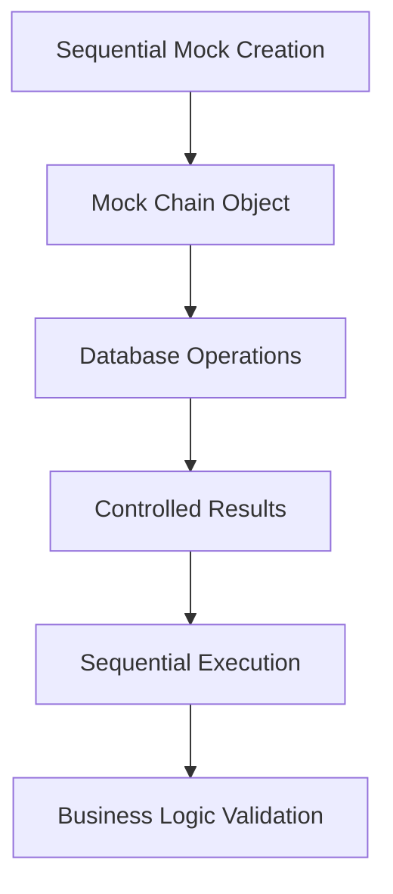

**Diagram sources**
- [src/app/(authenticated)/expedientes/__tests__/unit/resumo-ultima-captura.test.ts:4-22](file://src/app/(authenticated)/expedientes/__tests__/unit/resumo-ultima-captura.test.ts#L4-L22)

#### Edge Case Coverage
The test suite covers critical edge cases:
- **Empty State**: No completed captures found returns null safely
- **Count Null Handling**: Database null values properly handled as zeros
- **Business Logic Validation**: Created vs updated calculations based on timestamps
- **Error Propagation**: Database errors properly converted to application errors

#### Mock Factory Implementation
The sequential mock factory provides:
- **Chained Method Calls**: Simulates Supabase query builder pattern
- **Sequential Results**: Different responses for each database operation
- **Flexible Configuration**: Customizable results for different test scenarios
- **Call Tracking**: Verifies correct method calls and parameters

**Section sources**
- [src/app/(authenticated)/expedientes/__tests__/unit/resumo-ultima-captura.test.ts:1-140](file://src/app/(authenticated)/expedientes/__tests__/unit/resumo-ultima-captura.test.ts#L1-L140)
- [src/app/(authenticated)/expedientes/repository.ts:758-810](file://src/app/(authenticated)/expedientes/repository.ts#L758-L810)
- [src/app/(authenticated)/expedientes/service.ts:268-271](file://src/app/(authenticated)/expedientes/service.ts#L268-L271)
- [src/app/(authenticated)/expedientes/domain.ts:304-311](file://src/app/(authenticated)/expedientes/domain.ts#L304-L311)

### Business Logic Validation Patterns
The test suite validates complex business logic through multiple scenarios:

#### Scenario-Based Testing
- **Normal Operation**: Successful capture with expected counts
- **Edge Cases**: Null values, empty results, partial data
- **Error Conditions**: Database failures, connection timeouts
- **Complex Calculations**: Derived metrics from raw data

#### Data Flow Validation
The tests verify the complete data flow from database queries to business logic calculations:

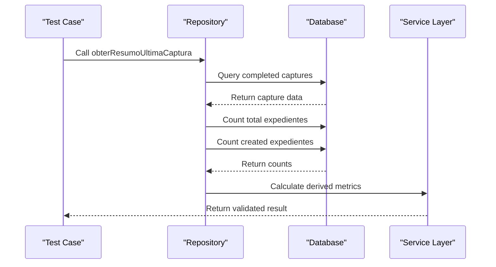

**Diagram sources**
- [src/app/(authenticated)/expedientes/repository.ts:759-809](file://src/app/(authenticated)/expedientes/repository.ts#L759-L809)
- [src/app/(authenticated)/expedientes/service.ts:269-271](file://src/app/(authenticated)/expedientes/service.ts#L269-L271)

**Section sources**
- [src/app/(authenticated)/expedientes/repository.ts:758-810](file://src/app/(authenticated)/expedientes/repository.ts#L758-L810)
- [src/app/(authenticated)/expedientes/service.ts:268-271](file://src/app/(authenticated)/expedientes/service.ts#L268-L271)

## Debugging and Artifact Generation Framework

### Direct TRT3 Capture Debugging with JSON Reporting System
The debugging framework provides comprehensive testing capabilities for TRT3 capture processes with standardized JSON reporting:

- **Direct Playwright Integration**: Operates directly via Playwright + Supabase without passing through Next.js HTTP API
- **Standardized Artifact Generation**: Creates structured JSON files with standardized naming conventions and metadata
- **Comprehensive Analysis**: Generates analysis summaries, constraint checks, and final reports automatically
- **Execution Logging**: Produces detailed execution logs with timestamps and step-by-step progress
- **Database Comparison**: Compares captured data with existing database records to identify discrepancies

### Standardized JSON Reporting System
The framework generates multiple standardized artifact types for comprehensive analysis:

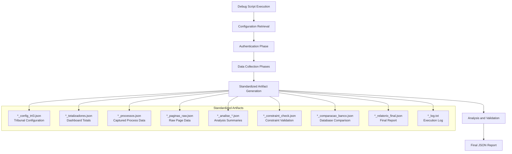

**Diagram sources**
- [scripts/captura/pendentes/debug-expedientes-trt3-direto.ts:669-836](file://scripts/captura/pendentes/debug-expedientes-trt3-direto.ts#L669-L836)
- [scripts/captura/audiencias/debug-audiencias-trt3-direto.ts:898-960](file://scripts/captura/audiencias/debug-audiencias-trt3-direto.ts#L898-L960)
- [scripts/captura/pericias/debug-pericias-trt3-direto.ts:630-682](file://scripts/captura/pericias/debug-pericias-trt3-direto.ts#L630-L682)
- [test-expedientes/2026-04-28T20-00-06-091Z_00_log.txt:1-76](file://test-expedientes/2026-04-28T20-00-06-091Z_00_log.txt#L1-L76)
- [test-expedientes/2026-04-28T20-00-06-091Z_07_relatorio_final.json:1-26](file://test-expedientes/2026-04-28T20-00-06-091Z_07_relatorio_final.json#L1-L26)

### Key Features of the JSON Reporting System
- **Automatic Report Generation**: Final reports generated automatically at the end of each capture process
- **Analysis Summaries**: Comprehensive analysis of captured data including duplicates, constraints, and distributions
- **Constraint Validation**: Automated constraint checking to ensure data integrity
- **Database Comparison**: Detailed comparison between captured data and existing database records
- **Standardized Metadata**: Consistent timestamping, process identification, and execution metrics
- **Diagnostic Information**: Built-in diagnostic capabilities for detecting data quality issues

**Section sources**
- [scripts/captura/pendentes/debug-expedientes-trt3-direto.ts:1-836](file://scripts/captura/pendentes/debug-expedientes-trt3-direto.ts#L1-L836)
- [scripts/captura/audiencias/debug-audiencias-trt3-direto.ts:898-960](file://scripts/captura/audiencias/debug-audiencias-trt3-direto.ts#L898-L960)
- [scripts/captura/pericias/debug-pericias-trt3-direto.ts:630-682](file://scripts/captura/pericias/debug-pericias-trt3-direto.ts#L630-L682)
- [test-expedientes/2026-04-28T20-00-06-091Z_00_log.txt:1-76](file://test-expedientes/2026-04-28T20-00-06-091Z_00_log.txt#L1-L76)
- [test-expedientes/2026-04-28T20-00-06-091Z_07_relatorio_final.json:1-26](file://test-expedientes/2026-04-28T20-00-06-091Z_07_relatorio_final.json#L1-L26)
- [test-audiencias/2026-04-28T21-34-53-129Z_06_relatorio_final.json:1-39](file://test-audiencias/2026-04-28T21-34-53-129Z_06_relatorio_final.json#L1-L39)
- [test-pericias/2026-04-28T21-48-33-942Z_06_relatorio_final.json:1-47](file://test-pericias/2026-04-28T21-48-33-942Z_06_relatorio_final.json#L1-L47)

## JSON Reporting System

### Standardized Report Structure
The JSON reporting system provides standardized structure across all capture processes:

#### Common Report Fields
- **Metadata**: Timestamps, tribunal identification, process duration
- **Totals**: Process counts, unique identifiers, totals by category
- **Analysis**: Duplicate detection, distribution analysis, constraint validation
- **Comparison**: Database comparison results and metrics
- **Diagnostics**: Quality indicators and issue detection

#### Expediente Report Structure
```json
{
  "iniciado": "2026-04-28T20:00:06.105Z",
  "finalizado": "2026-04-28T20:00:38.284Z",
  "duracao_segundos": 32.18,
  "trt": "TRT3",
  "grau": "primeiro_grau",
  "idAdvogado": "29203",
  "totais": {
    "no_prazo": 37,
    "sem_prazo": 9,
    "total": 46
  },
  "analise_ids": {
    "total": 46,
    "idsUnicos": 43,
    "idsDuplicados": 1,
    "processosComIdRepetido": 4,
    "processosIdDuplicadoComNumerosDiferentes": 0
  },
  "comparacao_banco": {
    "capturado_agora": 43,
    "ja_no_banco": 40,
    "novos_nao_no_banco": 3,
    "sumidos_apenas_no_banco": 0
  }
}
```

#### Audiência Report Structure
```json
{
  "iniciado": "2026-04-28T21:34:53.137Z",
  "finalizado": "2026-04-28T21:35:20.240Z",
  "duracao_segundos": 27.103,
  "trt": "TRT3",
  "grau": "primeiro_grau",
  "idAdvogado": "29203",
  "periodo": {
    "dataInicio": "2026-04-28",
    "dataFim": "2027-04-28"
  },
  "totais": {
    "designadas": 31
  },
  "analise_ids": {
    "total": 31,
    "idsUnicos": 31,
    "idsDuplicados": 0,
    "audienciasComIdRepetido": 0,
    "idsDuplicadosComProcessosDiferentes": 0,
    "processosComMultiplasAudiencias": 0,
    "audienciasComNrProcessoVazio": 0
  },
  "constraint_check": {
    "conflitos": 0,
    "status": "OK"
  },
  "comparacao_banco": {
    "capturado_agora": 31,
    "ja_no_banco": 28,
    "novas_nao_no_banco": 3,
    "sumidas_apenas_no_banco": 0,
    "conflitos_constraint_no_banco": 0
  },
  "diagnostico": {
    "reuso_de_ids_detectado": false,
    "ids_duplicados_sem_diferenca": 0
  }
}
```

#### Perícia Report Structure
```json
{
  "iniciado": "2026-04-28T21:48:33.948Z",
  "finalizado": "2026-04-28T21:49:07.571Z",
  "duracao_segundos": 33.623,
  "trt": "TRT3",
  "grau": "primeiro_grau",
  "idAdvogado": "29203",
  "analise_ids": {
    "total": 669,
    "idsUnicos": 669,
    "idsDuplicados": 0,
    "periciasComIdRepetido": 0,
    "idsDuplicadosComProcessosDiferentes": 0,
    "processosComMultiplasPericias": 103,
    "periciasComNrProcessoVazio": 0
  },
  "distribuicao_situacoes": {
    "F": 492,
    "C": 56,
    "R": 84,
    "L": 5,
    "P": 28,
    "S": 4
  },
  "constraint_check": {
    "conflitos": 0,
    "status": "OK"
  },
  "comparacao_banco": {
    "capturado_agora": 669,
    "ja_no_banco": 664,
    "novas_nao_no_banco": 5,
    "sumidas_apenas_no_banco": 0,
    "distribuicao_banco": {
      "F": 487,
      "C": 54,
      "R": 83,
      "P": 31,
      "L": 5,
      "S": 4
    }
  },
  "diagnostico": {
    "reuso_de_ids_detectado": false,
    "ids_duplicados_sem_diferenca": 0
  }
}
```

### Analysis and Constraint Systems
The reporting system includes sophisticated analysis and validation capabilities:

#### Duplicate Detection Analysis
- **ID Duplication**: Identifies duplicated process IDs across capture sessions
- **Process Number Validation**: Detects cases where the same ID has different process numbers
- **Distribution Analysis**: Analyzes frequency and distribution of duplicates
- **Impact Assessment**: Quantifies the impact of duplicates on data integrity

#### Constraint Validation
- **Database Constraints**: Validates adherence to database constraints
- **Business Rules**: Checks compliance with business logic rules
- **Data Integrity**: Ensures data meets quality standards
- **Conflict Detection**: Identifies potential conflicts before data insertion

#### Diagnostic Capabilities
- **Quality Indicators**: Built-in metrics for data quality assessment
- **Issue Detection**: Automated detection of potential problems
- **Recommendations**: Suggestions for data quality improvements
- **Alert Systems**: Warning systems for critical issues

**Section sources**
- [test-expedientes/2026-04-28T20-00-06-091Z_07_relatorio_final.json:1-26](file://test-expedientes/2026-04-28T20-00-06-091Z_07_relatorio_final.json#L1-L26)
- [test-audiencias/2026-04-28T21-34-53-129Z_06_relatorio_final.json:1-39](file://test-audiencias/2026-04-28T21-34-53-129Z_06_relatorio_final.json#L1-L39)
- [test-pericias/2026-04-28T21-48-33-942Z_06_relatorio_final.json:1-47](file://test-pericias/2026-04-28T21-48-33-942Z_06_relatorio_final.json#L1-L47)
- [test-expedientes/2026-04-28T20-00-06-091Z_05_analise_duplicatas.json:1-24](file://test-expedientes/2026-04-28T20-00-06-091Z_05_analise_duplicatas.json#L1-L24)
- [test-audiencias/2026-04-28T21-34-53-129Z_04_constraint_check.json:1-4](file://test-audiencias/2026-04-28T21-34-53-129Z_04_constraint_check.json#L1-L4)

## Database Testing and Migration Integration

### Migration-Based Tracking System
The database testing framework includes sophisticated tracking capabilities through migration-based enhancements:

- **Last Capture ID Tracking**: New column `ultima_captura_id` in expedientes table for audit trail
- **Foreign Key Relationships**: References to `capturas_log` table for capture provenance
- **Index Optimization**: Dedicated index for efficient querying of expedientes by last capture ID
- **Audit Trail Support**: Enables identification of which expedientes were created/updated in each capture execution

### Database Testing Patterns
- **Integration Tests**: Comprehensive coverage of CRUD operations, business logic validation, and audit trails
- **Migration Testing**: Validates database schema changes and their impact on existing functionality
- **Edge Case Handling**: Tests for concurrent operations, error conditions, and data consistency
- **Performance Validation**: Ensures optimal query performance with proper indexing strategies

**Section sources**
- [supabase/migrations/20260427090510_add_ultima_captura_id_to_expedientes.sql:1-14](file://supabase/migrations/20260427090510_add_ultima_captura_id_to_expedientes.sql#L1-L14)
- [src/app/(authenticated)/expedientes/__tests__/integration/expedientes-flow.test.ts:1-631](file://src/app/(authenticated)/expedientes/__tests__/integration/expedientes-flow.test.ts#L1-L631)

## Component Testing with React Testing Library
- jsdom project enables DOM rendering and React Testing Library assertions
- Global setup ensures Next.js navigation mocks and Web APIs are available
- Example component test exists under the app's test directory with comprehensive coverage of server actions and UI interactions

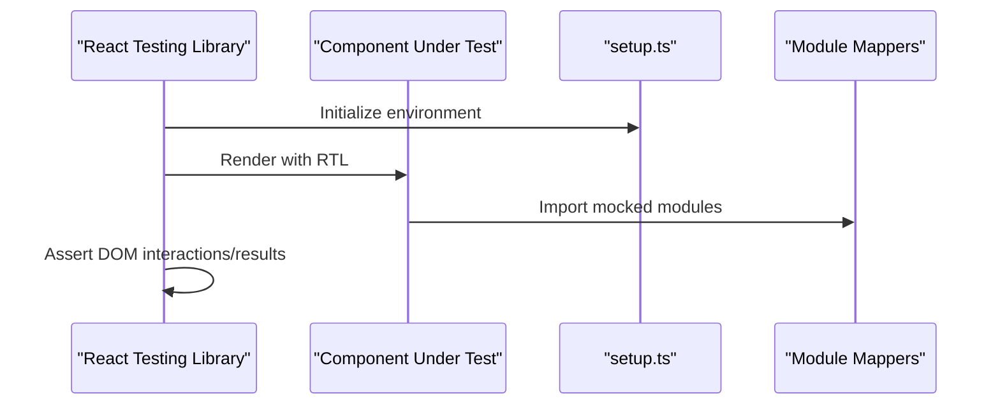

**Diagram sources**
- [jest.config.js:71-115](file://jest.config.js#L71-L115)
- [src/testing/setup.ts:25-118](file://src/testing/setup.ts#L25-L118)
- [src/app/__tests__/layout.test.tsx:1-50](file://src/app/__tests__/layout.test.tsx#L1-L50)

**Section sources**
- [jest.config.js:71-115](file://jest.config.js#L71-L115)
- [src/testing/setup.ts:25-118](file://src/testing/setup.ts#L25-L118)
- [src/app/__tests__/layout.test.tsx:1-50](file://src/app/__tests__/layout.test.tsx#L1-L50)

## Server Action Testing
- Node project configuration allows testing server actions and route handlers
- Environment defaults prevent Supabase client initialization errors
- Mocks for server-only and cache modules support server action scenarios
- Comprehensive coverage of authentication patterns, authorization checks, and error handling

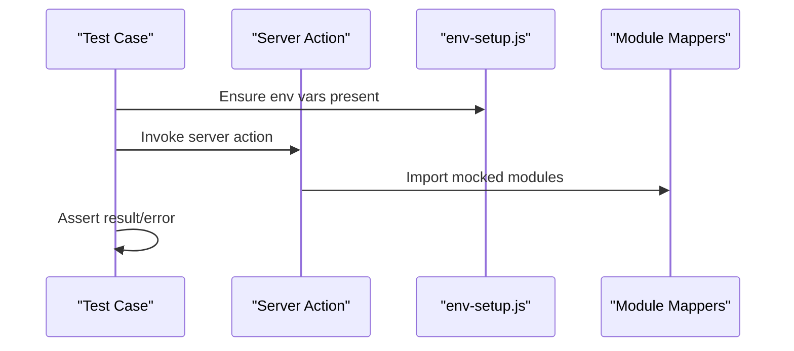

**Diagram sources**
- [jest.config.js:43-70](file://jest.config.js#L43-L70)
- [src/__mocks__/env-setup.js:8-13](file://src/__mocks__/env-setup.js#L8-L13)

**Section sources**
- [jest.config.js:43-70](file://jest.config.js#L43-L70)
- [src/__mocks__/env-setup.js:1-14](file://src/__mocks__/env-setup.js#L1-L14)

## Integration Testing Patterns
The integration testing framework provides comprehensive coverage of business logic flows with sophisticated mocking strategies:

### Business Logic Integration Tests
- **Atomic Operations**: Tests for create, update, delete operations with proper transaction handling
- **Cross-layer Validation**: Ensures proper coordination between service layer, repository layer, and database
- **Error Propagation**: Validates that database errors are properly converted to application errors
- **Authorization Testing**: Comprehensive coverage of RLS policies and permission checking

### Complex Business Flow Testing
- **Multi-step Workflows**: Tests for complex business processes involving multiple operations
- **Concurrent Access**: Validates handling of concurrent operations and race conditions
- **Partial Failures**: Tests for scenarios where some operations succeed while others fail
- **Rollback Validation**: Ensures proper rollback behavior in case of transaction failures

**Section sources**
- [src/app/(authenticated)/expedientes/__tests__/integration/expedientes-flow.test.ts:1-631](file://src/app/(authenticated)/expedientes/__tests__/integration/expedientes-flow.test.ts#L1-L631)
- [src/app/(authenticated)/expedientes/__tests__/integration/alterar-responsavel-flow.test.ts:1-433](file://src/app/(authenticated)/expedientes/__tests__/integration/alterar-responsavel-flow.test.ts#L1-L433)

## Playwright E2E Testing Framework
The Playwright testing framework provides comprehensive end-to-end testing capabilities with detailed artifact generation:

### E2E Testing Architecture
- **Multi-browser Support**: Tests run across Chromium, Firefox, Safari, and mobile devices
- **Device Emulation**: Comprehensive testing across different screen sizes and device capabilities
- **State Management**: Proper handling of user authentication and session management
- **Visual Regression Testing**: Integration with visual testing capabilities for UI consistency

### Test Artifact Integration
- **Execution Logs**: Detailed logs for each test run with timestamps and execution steps
- **Performance Metrics**: Timing information for critical operations and page loads
- **Error Screenshots**: Visual evidence of test failures for quick diagnosis
- **Network Analysis**: Detailed network request/response analysis for API testing

**Section sources**
- [playwright.config.ts:1-46](file://playwright.config.ts#L1-L46)

## Test Data Management and Mocking Strategies
- Factories produce realistic test users and dates
- Integration helpers provide entity factories and builders for bulk generation
- Supabase mock factory centralizes query/mutation/RPC stubbing
- Global setup and module mappers ensure consistent mocking across tests
- **New**: Debugging framework uses real database credentials for authentic testing scenarios
- **New**: JSON reporting system standardizes artifact generation across all capture processes

**Section sources**
- [src/testing/factories.ts:1-17](file://src/testing/factories.ts#L1-L17)
- [src/testing/integration-helpers.ts:17-92](file://src/testing/integration-helpers.ts#L17-L92)
- [src/testing/integration-helpers.ts:102-133](file://src/testing/integration-helpers.ts#L102-L133)
- [src/testing/setup.ts:113-118](file://src/testing/setup.ts#L113-L118)
- [scripts/captura/pendentes/debug-expedientes-trt3-direto.ts:29-40](file://scripts/captura/pendentes/debug-expedientes-trt3-direto.ts#L29-L40)

## Performance Considerations
- Prefer mocking external services to avoid flaky network-bound tests
- Use factory builders for bulk data to reduce duplication and speed up tests
- Keep test suites focused and isolated to minimize teardown overhead
- Leverage parallelism in Playwright projects judiciously while controlling timeouts
- Implement efficient sequential mock patterns to avoid excessive test setup complexity
- **New**: Debugging framework optimizes resource usage by avoiding database persistence during testing
- **New**: JSON reporting system minimizes I/O overhead through efficient artifact generation

**Updated** Added performance considerations for the new JSON reporting system and debugging framework.

## Troubleshooting Guide
- Missing Web APIs in jsdom: Ensure global setup polyfills TextEncoder/TextDecoder and streams
- Supabase client initialization errors: Confirm environment defaults are set via env-setup or override locally
- Next.js navigation mocks failing: Verify Next.js navigation mocks are applied in setup
- E2E tests timing out: Increase timeout or adjust device emulation; confirm dev server reuse policy
- Conditional Supabase tests: Use helpers to skip tests when credentials are not available
- Advanced mocking issues: Verify sequential mock patterns match expected database query sequences
- **New**: Debugging framework issues: Check 2FAuth API connectivity and tribunal configuration retrieval
- **New**: Artifact generation problems: Verify test-* directories have sufficient permissions and disk space
- **New**: JSON reporting errors: Check artifact naming conventions and metadata consistency
- **New**: Analysis validation failures: Review constraint check configurations and database connection

**Updated** Added troubleshooting guidance for the new JSON reporting system and artifact generation.

**Section sources**
- [src/testing/setup.ts:39-86](file://src/testing/setup.ts#L39-L86)
- [src/__mocks__/env-setup.js:8-13](file://src/__mocks__/env-setup.js#L8-L13)
- [src/testing/supabase-test-helpers.ts:3-14](file://src/testing/supabase-test-helpers.ts#L3-L14)
- [playwright.config.ts:9-22](file://playwright.config.ts#L9-L22)
- [src/app/(authenticated)/expedientes/__tests__/unit/resumo-ultima-captura.test.ts:4-22](file://src/app/(authenticated)/expedientes/__tests__/unit/resumo-ultima-captura.test.ts#L4-L22)
- [scripts/captura/pendentes/debug-expedientes-trt3-direto.ts:36-40](file://scripts/captura/pendentes/debug-expedientes-trt3-direto.ts#L36-L40)

## Conclusion
ZattarOS employs a comprehensive layered testing strategy with Jest for unit and integration tests, Playwright for E2E validation, and a sophisticated debugging framework for expediente capture testing. The new comprehensive JSON reporting system provides automatic report generation during capture processes, including analysis summaries, constraint checks, and final reports. The system features standardized artifact generation with consistent naming conventions, metadata, and validation capabilities across expediente, audiencia, and pericia capture processes. The debugging framework operates directly via Playwright + Supabase without persisting data to the database, generating comprehensive test artifacts for detailed analysis and comparison. The configuration supports dual environments, robust global setup, and reusable integration helpers. The addition of comprehensive unit testing for business logic functions like `obterResumoUltimaCaptura`, along with the new debugging framework, migration-based tracking, and standardized JSON reporting system, demonstrates advanced testing patterns including sequential mocking, edge case coverage, and business logic validation. By following the AAA pattern, leveraging factories and builders, implementing sophisticated mocking strategies, and integrating comprehensive artifact generation with standardized reporting, teams can write reliable, maintainable tests across components, server actions, complex business logic scenarios, and capture validation processes. Coverage targets and CI workflows should emphasize critical business flows, user journeys, and the new debugging framework capabilities while maintaining high-quality unit test coverage for core business functions.

**Updated** Enhanced conclusion to reflect the comprehensive JSON reporting system and standardized artifact generation capabilities.

## Appendices
- Example test files:
  - Component test: [layout.test.tsx](file://src/app/__tests__/layout.test.tsx)
  - Business logic unit test: [resumo-ultima-captura.test.ts](file://src/app/(authenticated)/expedientes/__tests__/unit/resumo-ultima-captura.test.ts)
  - Service unit test: [expedientes.service.test.ts](file://src/app/(authenticated)/expedientes/__tests__/unit/expedientes.service.test.ts)
  - Component test: [expediente-dialog.test.tsx](file://src/app/(authenticated)/expedientes/__tests__/components/expediente-dialog.test.tsx)
  - Server action test: [expedientes-actions.test.ts](file://src/app/(authenticated)/expedientes/__tests__/actions/expedientes-actions.test.ts)
  - Integration test: [expedientes-flow.test.ts](file://src/app/(authenticated)/expedientes/__tests__/integration/expedientes-flow.test.ts)
  - Integration test: [alterar-responsavel-flow.test.ts](file://src/app/(authenticated)/expedientes/__tests__/integration/alterar-responsavel-flow.test.ts)
- Debugging framework files:
  - Debug script: [debug-expedientes-trt3-direto.ts](file://scripts/captura/pendentes/debug-expedientes-trt3-direto.ts)
  - Debug script: [debug-audiencias-trt3-direto.ts](file://scripts/captura/audiencias/debug-audiencias-trt3-direto.ts)
  - Debug script: [debug-pericias-trt3-direto.ts](file://scripts/captura/pericias/debug-pericias-trt3-direto.ts)
  - Test artifacts: [test-expedientes/](file://test-expedientes/)
  - Test artifacts: [test-audiencias/](file://test-audiencias/)
  - Test artifacts: [test-pericias/](file://test-pericias/)
- Integration testing guide and helpers:
  - [INTEGRATION_TESTING_GUIDE.md](file://src/testing/INTEGRATION_TESTING_GUIDE.md)
  - [integration-helpers.ts](file://src/testing/integration-helpers.ts)
  - [supabase-test-helpers.ts](file://src/testing/supabase-test-helpers.ts)
  - [factories.ts](file://src/testing/factories.ts)
- Configuration files:
  - [jest.config.js](file://jest.config.js)
  - [playwright.config.ts](file://playwright.config.ts)
  - [jest-dom-setup.ts](file://src/__mocks__/jest-dom-setup.ts)
  - [env-setup.js](file://src/__mocks__/env-setup.js)
- Business logic components:
  - [repository.ts](file://src/app/(authenticated)/expedientes/repository.ts)
  - [service.ts](file://src/app/(authenticated)/expedientes/service.ts)
  - [domain.ts](file://src/app/(authenticated)/expedientes/domain.ts)
- Database migration:
  - [20260427090510_add_ultima_captura_id_to_expedientes.sql](file://supabase/migrations/20260427090510_add_ultima_captura_id_to_expedientes.sql)

**Updated** Added references to the comprehensive JSON reporting system and related business logic components.