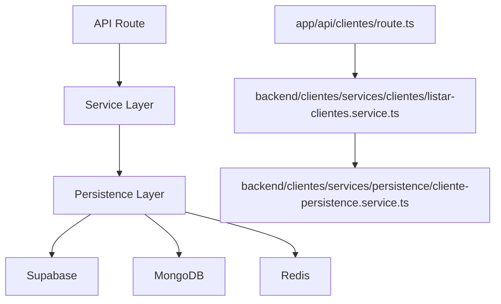
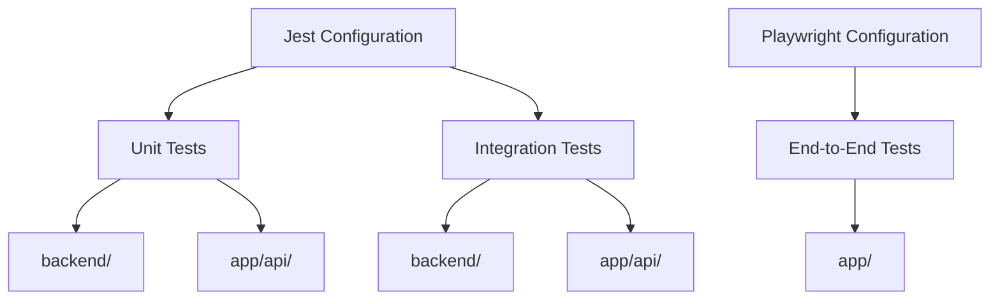
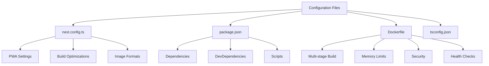

# Directory Structure

<cite>
**Referenced Files in This Document**   
- [next.config.ts](file://next.config.ts)
- [package.json](file://package.json)
- [Dockerfile](file://Dockerfile)
- [README.md](file://README.md)
- [tsconfig.json](file://tsconfig.json)
- [components.json](file://components.json)
- [jest.config.js](file://jest.config.js)
- [playwright.config.ts](file://playwright.config.ts)
- [app/layout.tsx](file://app/layout.tsx)
- [components/ui/button.tsx](file://components/ui/button.tsx)
- [lib/utils.ts](file://lib/utils.ts)
- [backend/assinatura-digital/services/dashboard.service.ts](file://backend/assinatura-digital/services/dashboard.service.ts)
- [app/api/clientes/route.ts](file://app/api/clientes/route.ts)
</cite>

## Table of Contents
1. [Introduction](#introduction)
2. [Top-Level Directory Overview](#top-level-directory-overview)
3. [Frontend Structure](#frontend-structure)
4. [Backend Structure](#backend-structure)
5. [Shared Components and Libraries](#shared-components-and-libraries)
6. [Testing Structure](#testing-structure)
7. [Configuration Files](#configuration-files)
8. [Development Workflow](#development-workflow)
9. [Conclusion](#conclusion)

## Introduction

The Sinesys project follows a well-organized directory structure designed to promote scalability, maintainability, and clear separation of concerns. This documentation provides a comprehensive overview of the directory organization, explaining the purpose of each top-level directory, the principles guiding the organization of code within key directories, and practical examples of how developers navigate and contribute to different parts of the codebase.

The structure combines Next.js conventions with domain-driven design principles, creating a scalable architecture for a complex legal management system. The organization emphasizes feature-based grouping, clear separation between frontend and backend logic, and standardized patterns for components, services, and testing.

**Section sources**
- [README.md](file://README.md#L687-L775)

## Top-Level Directory Overview

The Sinesys project structure is organized around several key top-level directories, each serving a specific purpose in the application architecture:

- **app/**: Contains the Next.js App Router structure with pages, layouts, and API routes
- **backend/**: Houses business logic, services, and backend functionality
- **components/**: Stores reusable React components organized by feature and type
- **docs/**: Contains project documentation and user guides
- **e2e/**: Holds end-to-end tests using Playwright
- **hooks/**: Contains custom React hooks for state and side-effect management
- **lib/**: Stores shared libraries, utilities, and infrastructure code
- **openspec/**: Contains OpenSpec documentation and API specifications
- **public/**: Stores static assets accessible to the public
- **scripts/**: Contains utility scripts for development, testing, and deployment
- **supabase/**: Contains database schemas and migration files
- **types/**: Stores shared TypeScript types across the application
- **test-results/**: Stores output from test executions
- **tests/**: Contains unit and integration tests

This structure follows a modular approach that separates concerns while maintaining clear relationships between frontend and backend components.

**Section sources**
- [README.md](file://README.md#L687-L775)
- [project_structure](file://project_structure)

## Frontend Structure

The frontend structure is built on Next.js App Router conventions with additional organization principles for scalability.

### App Directory Organization

The `app/` directory follows the Next.js App Router pattern with several organizational features:

- **(dashboard)/**: Route group for protected dashboard pages, using parentheses to denote a logical grouping that doesn't appear in the URL
- Feature-based routing: Each major feature (acordos-condenacoes, audiencias, captura, etc.) has its own subdirectory
- API routes: The `api/` subdirectory contains REST endpoints organized by feature
- Authentication pages: The `auth/` directory contains login, registration, and password management pages
- Layout components: Shared layouts are defined in `layout.tsx` files at various levels

The directory uses a feature-first organization where related pages, components, and API routes are grouped together by functionality rather than by technical type.

### Component Categorization

The `components/` directory organizes reusable UI elements with a clear categorization system:

- **ui/**: Base UI components from shadcn/ui and Radix UI primitives
- **layout/**: Structural components like sidebars, navigation, and page layouts
- **plate/**: Components related to the Plate.js rich text editor
- **chat/**: Components specific to chat functionality
- **documents/**: Components for document management
- **financeiro/**: Components for financial features
- **assinatura-digital/**: Components for digital signature functionality

This categorization allows developers to quickly locate components by both feature and type, promoting reuse and consistency across the application.

```mermaid
graph TD
A[app/] --> B[(dashboard)/]
A --> C[api/]
A --> D[auth/]
A --> E[layout.tsx]
A --> F[globals.css]
B --> G[acordos-condenacoes/]
B --> H[audiencias/]
B --> I[captura/]
B --> J[clientes/]
B --> K[contratos/]
C --> L[acordos-condenacoes/]
C --> M[audiencias/]
C --> N[captura/]
C --> O[clientes/]
C --> P[contratos/]
Q[components/] --> R[ui/]
Q --> S[layout/]
Q --> T[plate/]
Q --> U[chat/]
Q --> V[documents/]
Q --> W[financeiro/]
Q --> X[assinatura-digital/]
R --> Y[Button.tsx]
R --> Z[Card.tsx]
S --> AA[AppSidebar.tsx]
S --> AB[NavMain.tsx]
```

**Diagram sources **
- [app/layout.tsx](file://app/layout.tsx)
- [components/ui/button.tsx](file://components/ui/button.tsx)

**Section sources**
- [app/layout.tsx](file://app/layout.tsx)
- [components/ui/button.tsx](file://components/ui/button.tsx)
- [project_structure](file://project_structure)

## Backend Structure

The backend structure follows domain-driven design principles with clear separation of concerns.

### Feature-Based Service Organization

The `backend/` directory organizes business logic by feature domain, with each feature having its own subdirectory:

- **acervo/**: Services for managing legal case inventory
- **acordos-condenacoes/**: Services for managing settlements and convictions
- **advogados/**: Services for managing attorneys
- **audiencias/**: Services for managing court hearings
- **captura/**: Services for data capture from external systems
- **clientes/**: Services for managing clients
- **contratos/**: Services for managing contracts
- **financeiro/**: Services for financial operations
- **usuarios/**: Services for user management

Each feature directory follows a consistent internal structure with `services/` and `persistence/` subdirectories, separating business logic from data access concerns.

### Layered Architecture Pattern

The backend implements a layered architecture pattern with three distinct layers:

1. **API Layer** (`app/api/`): Handles HTTP requests, authentication, and response formatting
2. **Service Layer** (`backend/*/services/`): Contains business logic and orchestrates operations
3. **Persistence Layer** (`backend/*/services/persistence/`): Manages database interactions and data access

This pattern ensures separation of concerns, making the codebase more maintainable and testable. The service layer contains pure business logic independent of infrastructure details, while the persistence layer handles database-specific operations.



**Diagram sources **
- [app/api/clientes/route.ts](file://app/api/clientes/route.ts)
- [backend/assinatura-digital/services/dashboard.service.ts](file://backend/assinatura-digital/services/dashboard.service.ts)

**Section sources**
- [app/api/clientes/route.ts](file://app/api/clientes/route.ts)
- [backend/assinatura-digital/services/dashboard.service.ts](file://backend/assinatura-digital/services/dashboard.service.ts)
- [README.md](file://README.md#L74-L137)

## Shared Components and Libraries

The project includes several directories for shared code that can be used across different parts of the application.

### Component Reusability Strategy

The `components/` directory implements a reusability strategy with multiple levels of abstraction:

- **Base components** in `components/ui/` provide foundational UI elements (buttons, cards, dialogs)
- **Composite components** in feature-specific directories combine base components for specific use cases
- **Layout components** in `components/layout/` provide structural elements for page organization
- **Utility components** in `components/` provide cross-cutting functionality like PWA installation prompts

This hierarchy allows for consistent styling and behavior while enabling customization for specific features.

### Shared Libraries and Utilities

The `lib/` directory contains shared libraries and utilities used throughout the application:

- **API clients**: Centralized API access with consistent error handling
- **Supabase utilities**: Helper functions for Supabase integration
- **Redis utilities**: Caching functions and cache key management
- **TypeScript utilities**: Common type definitions and utility functions
- **Yjs collaboration**: Real-time collaboration utilities
- **PWA utilities**: Progressive Web App functionality

These libraries abstract common patterns and reduce code duplication across features.

### Type System Organization

The `types/` directory implements a comprehensive type system with domain-driven organization:

- **domain/**: Core domain types representing business entities and value objects
- **contracts/**: Data transfer objects and service interfaces
- Feature-specific type directories for backend infrastructure types

This organization separates pure domain concepts from implementation details, making the type system more maintainable and easier to understand.

**Section sources**
- [lib/utils.ts](file://lib/utils.ts)
- [components.json](file://components.json)
- [tsconfig.json](file://tsconfig.json)

## Testing Structure

The testing structure is organized to support different levels of testing with appropriate tools and organization.

### End-to-End Testing

The `e2e/` directory contains end-to-end tests using Playwright:

- Tests are organized by feature area (documentos, dashboard, formsign)
- Configuration in `playwright.config.ts` sets up the test environment
- Tests run against the actual application server
- Supports multiple browsers and device types

The end-to-end tests verify complete user workflows and ensure that different parts of the system work together correctly.

### Unit and Integration Testing

The `tests/` directory contains unit and integration tests:

- **unit/**: Tests for individual functions and classes in isolation
- **integration/**: Tests for interactions between components or services
- Configuration in `jest.config.js` sets up the test environment
- Tests cover both frontend and backend code

The testing strategy emphasizes testing business logic in isolation while also verifying integration points between components.

### Test Configuration

Key configuration files define the testing environment:

- **jest.config.js**: Configures Jest for unit and integration testing
- **playwright.config.ts**: Configures Playwright for end-to-end testing
- **test-results/**: Stores output from test executions

These configurations ensure consistent test execution across different environments and provide detailed reporting.



**Diagram sources **
- [jest.config.js](file://jest.config.js)
- [playwright.config.ts](file://playwright.config.ts)

**Section sources**
- [jest.config.js](file://jest.config.js)
- [playwright.config.ts](file://playwright.config.ts)
- [project_structure](file://project_structure)

## Configuration Files

The project includes several key configuration files that define build, runtime, and development settings.

### Next.js Configuration

The `next.config.ts` file configures the Next.js application with several important settings:

- **output: 'standalone'**: Generates a build optimized for Docker deployment
- **PWA integration**: Configures the Progressive Web App with service worker caching strategies
- **Webpack optimizations**: Includes memory optimizations and build worker configuration
- **TypeScript settings**: Allows builds to proceed with type errors during development
- **Image optimization**: Configures supported image formats

The configuration is optimized for production deployment while maintaining good developer experience.

### Package Configuration

The `package.json` file defines the project's dependencies and scripts:

- **Dependencies**: Includes Next.js, React, Supabase, and various UI libraries
- **DevDependencies**: Includes testing tools, ESLint, and TypeScript
- **Scripts**: Provides commands for development, building, testing, and deployment
- **Build variants**: Includes different build scripts for development and production

The script configuration supports multiple development workflows and deployment scenarios.

### Docker Configuration

The `Dockerfile` defines the containerization strategy:

- **Multi-stage build**: Reduces final image size by separating build and runtime stages
- **Memory optimization**: Limits Node.js heap size to prevent OOM errors
- **Security**: Runs the application with a non-root user
- **Health checks**: Includes built-in health check for container orchestration
- **Environment variables**: Configures required environment variables

The Docker configuration is optimized for deployment on CapRover with appropriate resource limits and monitoring.



**Diagram sources **
- [next.config.ts](file://next.config.ts)
- [package.json](file://package.json)
- [Dockerfile](file://Dockerfile)

**Section sources**
- [next.config.ts](file://next.config.ts)
- [package.json](file://package.json)
- [Dockerfile](file://Dockerfile)
- [tsconfig.json](file://tsconfig.json)

## Development Workflow

The directory structure supports a streamlined development workflow with clear patterns for adding new features.

### Feature Development Process

When adding a new feature, developers follow a consistent process:

1. Create feature directories in `app/`, `backend/`, and `components/`
2. Define API routes in `app/api/feature-name/`
3. Implement service logic in `backend/feature-name/services/`
4. Create React components in `components/feature-name/`
5. Add tests in `tests/` and `e2e/`
6. Update documentation in `docs/`

This process ensures that all aspects of a feature are properly organized and tested.

### Navigation and Contribution

Developers navigate the codebase using several key principles:

- **Feature-first navigation**: Look for the feature name in top-level directories
- **Consistent patterns**: Each feature follows the same internal structure
- **Type-driven development**: Use TypeScript types to understand data structures
- **Configuration awareness**: Understand how configuration files affect behavior

The structure enables developers to quickly locate relevant code and understand how different parts of the system interact.

### Best Practices

Key best practices for contributing to the codebase include:

- Follow existing patterns for new code
- Use feature-based organization for new components
- Separate concerns between API, service, and persistence layers
- Write tests for new functionality
- Update documentation when adding or changing features
- Use TypeScript types to ensure type safety

These practices maintain consistency and quality across the codebase as it evolves.

**Section sources**
- [README.md](file://README.md#L535-L643)
- [package.json](file://package.json)
- [project_structure](file://project_structure)

## Conclusion

The Sinesys directory structure represents a well-organized, scalable architecture for a complex legal management system. By following Next.js conventions and domain-driven design principles, the structure promotes maintainability, reusability, and clear separation of concerns.

The organization of directories by feature and responsibility makes it easy for developers to navigate the codebase and understand how different parts of the system interact. The consistent patterns for services, components, and testing reduce cognitive load and make it easier to contribute to the project.

The configuration files are thoughtfully designed to support both development and production environments, with optimizations for performance, security, and deployability. The testing structure provides comprehensive coverage at multiple levels, ensuring the reliability of the application.

Overall, the directory structure supports the long-term maintainability and evolution of the Sinesys application, providing a solid foundation for ongoing development and feature expansion.