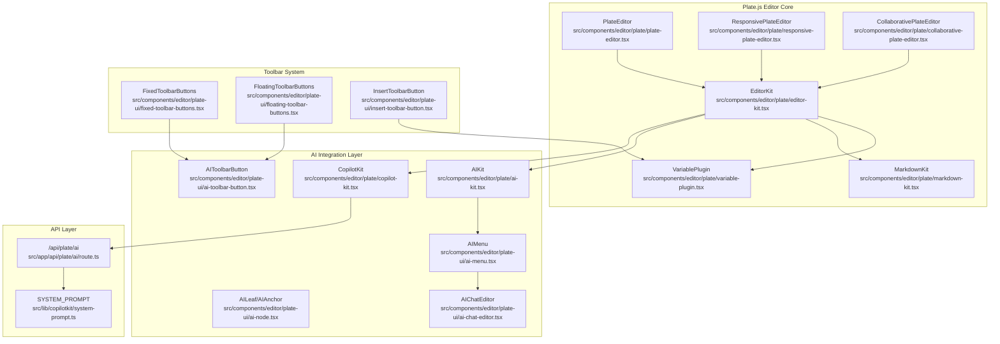
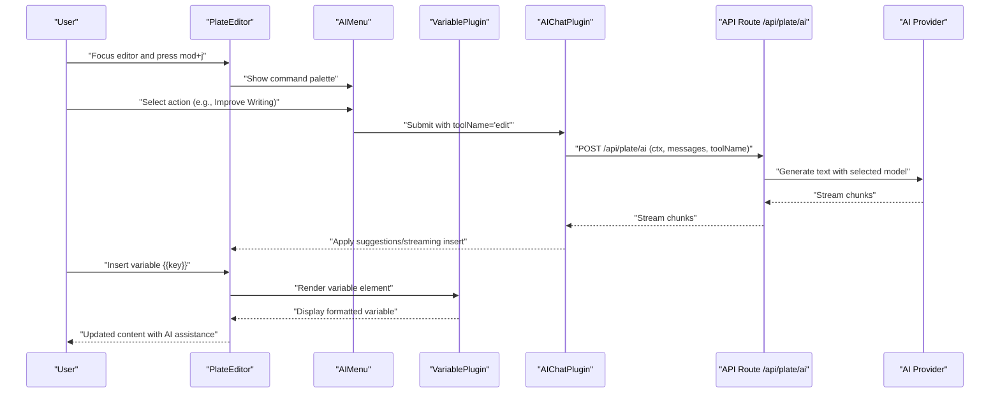
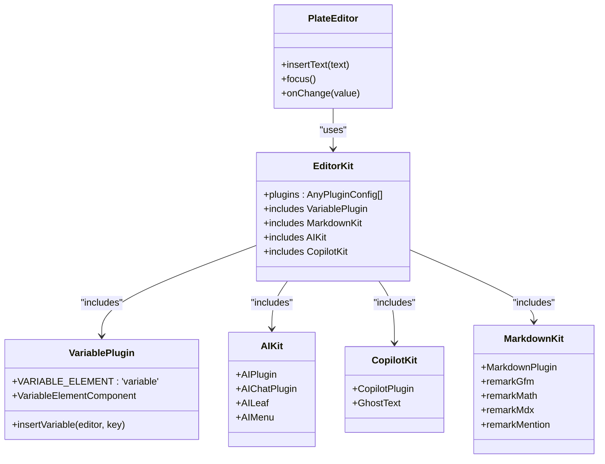
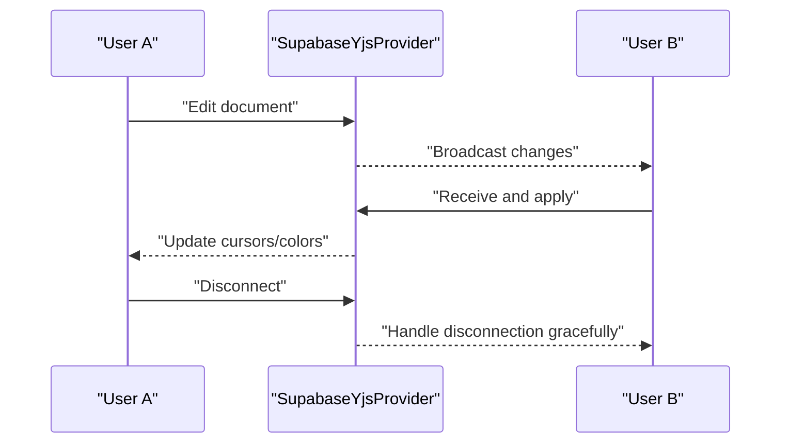
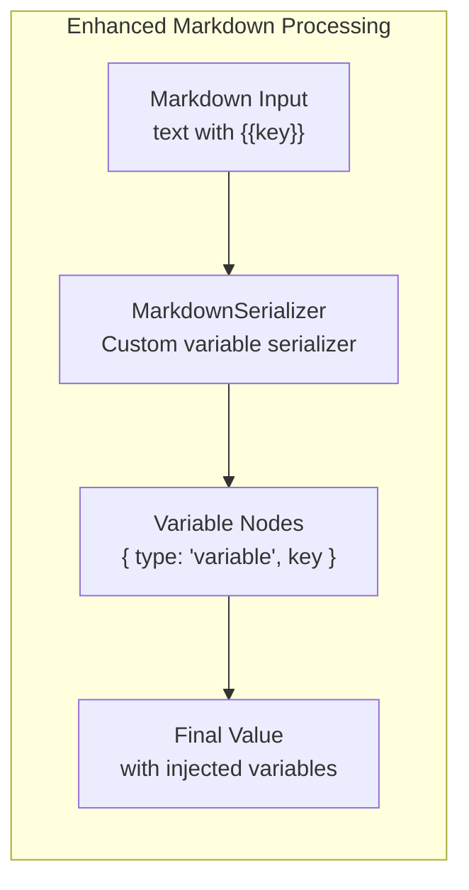
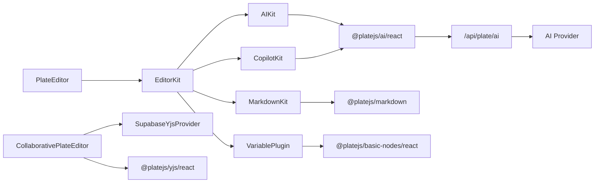

# AI-Assisted Document Editing

<cite>
**Referenced Files in This Document**
- [variable-plugin.tsx](file://src/components/editor/plate/variable-plugin.tsx)
- [editor-kit.tsx](file://src/components/editor/plate/editor-kit.tsx)
- [plate-editor.tsx](file://src/components/editor/plate/plate-editor.tsx)
- [responsive-plate-editor.tsx](file://src/components/editor/plate/responsive-plate-editor.tsx)
- [collaborative-plate-editor.tsx](file://src/components/editor/plate/collaborative-plate-editor.tsx)
- [ai-kit.tsx](file://src/components/editor/plate/ai-kit.tsx)
- [copilot-kit.tsx](file://src/components/editor/plate/copilot-kit.tsx)
- [markdown-kit.tsx](file://src/components/editor/plate/markdown-kit.tsx)
- [MarkdownRichTextEditor.tsx](file://src/app/(authenticated)/assinatura-digital/components/editor/MarkdownRichTextEditor.tsx)
- [editor-helpers.ts](file://src/app/(authenticated)/assinatura-digital/components/editor/editor-helpers.ts)
- [fixed-toolbar-buttons.tsx](file://src/components/editor/plate-ui/fixed-toolbar-buttons.tsx)
- [floating-toolbar-buttons.tsx](file://src/components/editor/plate-ui/floating-toolbar-buttons.tsx)
- [ai-toolbar-button.tsx](file://src/components/editor/plate-ui/ai-toolbar-button.tsx)
- [insert-toolbar-button.tsx](file://src/components/editor/plate-ui/insert-toolbar-button.tsx)
- [ai-menu.tsx](file://src/components/editor/plate-ui/ai-menu.tsx)
- [ai-node.tsx](file://src/components/editor/plate-ui/ai-node.tsx)
- [ai-chat-editor.tsx](file://src/components/editor/plate-ui/ai-chat-editor.tsx)
- [use-chat-api.ts](file://src/components/editor/hooks/use-chat-api.ts)
- [use-chat-streaming.ts](file://src/components/editor/hooks/use-chat-streaming.ts)
- [route.ts](file://src/app/api/plate/ai/route.ts)
- [system-prompt.ts](file://src/lib/copilotkit/system-prompt.ts)
- [export-toolbar-button.tsx](file://src/components/editor/plate-ui/export-toolbar-button.tsx)
</cite>

## Update Summary
**Changes Made**
- Migrated from TipTap to Plate.js architecture with enhanced plugin system
- Integrated new VariablePlugin for inline variable elements with markdown serialization
- Enhanced EditorKit with comprehensive plugin aggregation including markdown support
- Updated toolbar components with new AI toolbar buttons and improved UI
- Implemented responsive editor architecture with breakpoint-aware toolbars
- Enhanced collaborative editing with Yjs integration and real-time cursors
- Improved markdown conversion system with variable node serialization

## Table of Contents
1. [Introduction](#introduction)
2. [Project Structure](#project-structure)
3. [Core Components](#core-components)
4. [Architecture Overview](#architecture-overview)
5. [Detailed Component Analysis](#detailed-component-analysis)
6. [Variable System Integration](#variable-system-integration)
7. [Migration Architecture](#migration-architecture)
8. [Dependency Analysis](#dependency-analysis)
9. [Performance Considerations](#performance-considerations)
10. [Troubleshooting Guide](#troubleshooting-guide)
11. [Conclusion](#conclusion)

## Introduction
This document describes the AI-assisted document editing capabilities built with Plate.js and the CopilotKit framework. The system has been completely migrated from TipTap to Plate.js architecture, featuring enhanced plugin systems, comprehensive variable management, improved markdown serialization, and new toolbar components. The implementation provides seamless AI-assisted editing with collaborative capabilities, responsive design, and robust performance optimizations.

## Project Structure
The AI-assisted editing system is organized around a comprehensive Plate.js architecture with enhanced plugin integration:
- **Editor Core**: Plate.js-based editors with modular plugin kits and enhanced variable support
- **AI Integration**: Plate.js AI plugin with CopilotKit and custom hooks
- **Toolbar System**: Responsive toolbar components with AI integration
- **Collaboration**: Real-time editing with Yjs and Supabase integration
- **Markdown Processing**: Enhanced markdown serialization with variable support
- **API Layer**: Secure server-side endpoints for AI processing and rate limiting



**Diagram sources**
- [plate-editor.tsx:22-77](file://src/components/editor/plate/plate-editor.tsx#L22-L77)
- [responsive-plate-editor.tsx:24-55](file://src/components/editor/plate/responsive-plate-editor.tsx#L24-L55)
- [collaborative-plate-editor.tsx:72-187](file://src/components/editor/plate/collaborative-plate-editor.tsx#L72-L187)
- [editor-kit.tsx:41-91](file://src/components/editor/plate/editor-kit.tsx#L41-L91)
- [markdown-kit.tsx:6-13](file://src/components/editor/plate/markdown-kit.tsx#L6-L13)
- [variable-plugin.tsx:38-55](file://src/components/editor/plate/variable-plugin.tsx#L38-L55)
- [ai-kit.tsx:106-112](file://src/components/editor/plate/ai-kit.tsx#L106-L112)
- [copilot-kit.tsx:12-75](file://src/components/editor/plate/copilot-kit.tsx#L12-L75)
- [ai-menu.tsx:51-247](file://src/components/editor/plate-ui/ai-menu.tsx#L51-L247)
- [ai-node.tsx:14-43](file://src/components/editor/plate-ui/ai-node.tsx#L14-L43)
- [ai-chat-editor.tsx:12-25](file://src/components/editor/plate-ui/ai-chat-editor.tsx#L12-L25)
- [ai-toolbar-button.tsx:10-26](file://src/components/editor/plate-ui/ai-toolbar-button.tsx#L10-L26)
- [fixed-toolbar-buttons.tsx:48-167](file://src/components/editor/plate-ui/fixed-toolbar-buttons.tsx#L48-L167)
- [floating-toolbar-buttons.tsx:24-82](file://src/components/editor/plate-ui/floating-toolbar-buttons.tsx#L24-L82)
- [insert-toolbar-button.tsx:220-256](file://src/components/editor/plate-ui/insert-toolbar-button.tsx#L220-L256)
- [route.ts:99-297](file://src/app/api/plate/ai/route.ts#L99-L297)
- [system-prompt.ts:16-32](file://src/lib/copilotkit/system-prompt.ts#L16-L32)

**Section sources**
- [variable-plugin.tsx:1-56](file://src/components/editor/plate/variable-plugin.tsx#L1-L56)
- [editor-kit.tsx:1-96](file://src/components/editor/plate/editor-kit.tsx#L1-L96)
- [plate-editor.tsx:1-635](file://src/components/editor/plate/plate-editor.tsx#L1-L635)

## Core Components
The enhanced Plate.js architecture provides comprehensive document editing capabilities:

- **PlateEditor**: Primary editor component with configurable plugins, placeholder, and imperative methods for text insertion and focus
- **EditorKit**: Central plugin aggregator combining AI, Copilot, UI, collaboration, parsers, markdown, and the new VariablePlugin
- **AIKit**: Integrates Plate.js AI plugin with streaming, suggestions, and UI hooks for AI-powered editing
- **CopilotKit**: Provides ghost text predictions and keyboard shortcuts for AI-assisted writing
- **VariablePlugin**: New inline variable element plugin for Plate.js with proper rendering and markdown serialization
- **MarkdownKit**: Enhanced markdown processing with GFM, math, MDX, and mention support
- **Responsive Toolbar System**: Adaptive toolbar components with breakpoint-aware layouts
- **Collaborative Editing**: Real-time editing with Yjs, Supabase, and cursor synchronization
- **Enhanced AI Menu**: Comprehensive command palette with 20+ AI actions and streaming support

**Section sources**
- [plate-editor.tsx:11-77](file://src/components/editor/plate/plate-editor.tsx#L11-L77)
- [editor-kit.tsx:41-91](file://src/components/editor/plate/editor-kit.tsx#L41-L91)
- [variable-plugin.tsx:10-55](file://src/components/editor/plate/variable-plugin.tsx#L10-L55)
- [markdown-kit.tsx:6-13](file://src/components/editor/plate/markdown-kit.tsx#L6-L13)
- [ai-kit.tsx:21-112](file://src/components/editor/plate/ai-kit.tsx#L21-L112)
- [copilot-kit.tsx:12-75](file://src/components/editor/plate/copilot-kit.tsx#L12-L75)
- [ai-menu.tsx:275-503](file://src/components/editor/plate-ui/ai-menu.tsx#L275-L503)
- [route.ts:99-297](file://src/app/api/plate/ai/route.ts#L99-L297)

## Architecture Overview
The enhanced AI-assisted editing pipeline leverages Plate.js's advanced plugin architecture to provide seamless AI integration, collaborative editing, and responsive design.



**Diagram sources**
- [ai-menu.tsx:107-131](file://src/components/editor/plate-ui/ai-menu.tsx#L107-L131)
- [variable-plugin.tsx:18-36](file://src/components/editor/plate/variable-plugin.tsx#L18-L36)
- [ai-kit.tsx:36-104](file://src/components/editor/plate/ai-kit.tsx#L36-L104)
- [route.ts:171-271](file://src/app/api/plate/ai/route.ts#L171-L271)

## Detailed Component Analysis

### Enhanced PlateEditor and Plugin System
The PlateEditor now initializes with the comprehensive EditorKit, featuring the new VariablePlugin and enhanced markdown support:



**Diagram sources**
- [plate-editor.tsx:22-77](file://src/components/editor/plate/plate-editor.tsx#L22-L77)
- [editor-kit.tsx:41-91](file://src/components/editor/plate/editor-kit.tsx#L41-L91)
- [variable-plugin.tsx:38-55](file://src/components/editor/plate/variable-plugin.tsx#L38-L55)
- [ai-kit.tsx:106-112](file://src/components/editor/plate/ai-kit.tsx#L106-L112)
- [copilot-kit.tsx:12-75](file://src/components/editor/plate/copilot-kit.tsx#L12-L75)
- [markdown-kit.tsx:6-13](file://src/components/editor/plate/markdown-kit.tsx#L6-L13)

**Section sources**
- [plate-editor.tsx:11-77](file://src/components/editor/plate/plate-editor.tsx#L11-L77)
- [editor-kit.tsx:41-91](file://src/components/editor/plate/editor-kit.tsx#L41-L91)
- [variable-plugin.tsx:10-55](file://src/components/editor/plate/variable-plugin.tsx#L10-L55)

### AI Assistant Integration (Plate.js AI + CopilotKit)
The AI integration provides comprehensive assistance through multiple channels:

- **AIKit**: Extends AIChatPlugin with streaming, suggestions, and UI hooks, supporting 20+ AI actions
- **CopilotKit**: Provides intelligent ghost text completions with Brazilian legal context
- **AIMenu**: Advanced command palette with contextual suggestions and streaming responses
- **AIChatEditor**: Static editor for reviewing AI-generated content before acceptance


**Diagram sources**
- [ai-kit.tsx:36-104](file://src/components/editor/plate/ai-kit.tsx#L36-L104)
- [ai-menu.tsx:275-503](file://src/components/editor/plate-ui/ai-menu.tsx#L275-L503)
- [route.ts:195-267](file://src/app/api/plate/ai/route.ts#L195-L267)

**Section sources**
- [ai-kit.tsx:21-112](file://src/components/editor/plate/ai-kit.tsx#L21-L112)
- [copilot-kit.tsx:12-75](file://src/components/editor/plate/copilot-kit.tsx#L12-L75)
- [ai-menu.tsx:51-247](file://src/components/editor/plate-ui/ai-menu.tsx#L51-L247)
- [ai-chat-editor.tsx:12-25](file://src/components/editor/plate-ui/ai-chat-editor.tsx#L12-L25)

### Collaborative Editing with Yjs
Enhanced collaborative editing provides real-time synchronization with advanced features:

- **Real-time Cursors**: Color-coded cursors for multiple users with smooth animations
- **Connection Management**: Robust connection handling with automatic reconnection
- **Sync Status**: Visual indicators for connection and synchronization states
- **Fallback Support**: Non-collaborative mode for offline or unsupported scenarios



**Diagram sources**
- [collaborative-plate-editor.tsx:72-187](file://src/components/editor/plate/collaborative-plate-editor.tsx#L72-L187)

**Section sources**
- [collaborative-plate-editor.tsx:38-219](file://src/components/editor/plate/collaborative-plate-editor.tsx#L38-L219)

### Responsive Toolbar System
The toolbar system adapts to different screen sizes with optimized layouts:

- **FixedToolbarButtons**: Desktop-optimized toolbar with comprehensive formatting options
- **FloatingToolbarButtons**: Mobile-first floating toolbar with essential actions
- **AI Toolbar Button**: Dedicated AI command button with tooltip support
- **Insert Toolbar Button**: Advanced dropdown with categorized content insertion options

**Section sources**
- [fixed-toolbar-buttons.tsx:48-167](file://src/components/editor/plate-ui/fixed-toolbar-buttons.tsx#L48-L167)
- [floating-toolbar-buttons.tsx:24-82](file://src/components/editor/plate-ui/floating-toolbar-buttons.tsx#L24-L82)
- [ai-toolbar-button.tsx:10-26](file://src/components/editor/plate-ui/ai-toolbar-button.tsx#L10-L26)
- [insert-toolbar-button.tsx:220-256](file://src/components/editor/plate-ui/insert-toolbar-button.tsx#L220-L256)

### Export and Accessibility
Enhanced export capabilities with comprehensive format support:

- **Export Toolbar**: Supports PDF, image, HTML, and Markdown exports
- **HTML Export**: Includes Tailwind and KaTeX styles for faithful rendering
- **Accessibility**: Keyboard navigation, focus management, and ARIA attributes
- **Responsive Design**: Adaptive toolbar layouts for mobile and desktop

**Section sources**
- [export-toolbar-button.tsx:75-148](file://src/components/editor/plate-ui/export-toolbar-button.tsx#L75-L148)
- [ai-menu.tsx:133-136](file://src/components/editor/plate-ui/ai-menu.tsx#L133-L136)

## Variable System Integration

### VariablePlugin Implementation
The new VariablePlugin provides comprehensive inline variable support with enhanced markdown serialization:

- **Element Type**: `VARIABLE_ELEMENT = 'variable'` defines the custom element type
- **Interface**: `VariableElementType` extends TElement with key property for variable identification
- **Rendering**: Custom `VariableElementComponent` renders variables as styled inline spans with `{{key}}` notation
- **Insertion**: `insertVariable` function programmatically inserts variable nodes at cursor position
- **Serialization**: MarkdownKit includes custom serializer for `{{key}}` format during markdown export
- **Properties**: Variables are rendered as non-editable inline elements with dark/light theme support

```mermaid
classDiagram
class VariablePlugin {
+key : 'variable'
+node : {
+isElement : true
+isInline : true
+isVoid : true
+component : VariableElementComponent
+}
+insertVariable(editor, key)
}
class VariableElementComponent {
+render() : JSX.Element
+props.element.key
+data-variable-key attribute
+monospace styling
+non-editable content
}
class VariableElementType {
+type : 'variable'
+key : string
+children : [{ text : '' }]
}
class MarkdownKit {
+serialize : {
+[VARIABLE_ELEMENT] : {
+serialize : (node) => "{{key}}"
+}
+}
}
VariablePlugin --> VariableElementComponent : "uses"
VariablePlugin --> VariableElementType : "defines"
VariablePlugin --> MarkdownKit : "integrates with"
```

**Diagram sources**
- [variable-plugin.tsx:38-46](file://src/components/editor/plate/variable-plugin.tsx#L38-L46)
- [variable-plugin.tsx:18-36](file://src/components/editor/plate/variable-plugin.tsx#L18-L36)
- [variable-plugin.tsx:12-16](file://src/components/editor/plate/variable-plugin.tsx#L12-L16)
- [markdown-kit.tsx:6-13](file://src/components/editor/plate/markdown-kit.tsx#L6-L13)

**Section sources**
- [variable-plugin.tsx:10-55](file://src/components/editor/plate/variable-plugin.tsx#L10-L55)

### Variable Management in Rich Text Editors
The VariablePlugin integrates seamlessly with existing rich text editors and markdown processors:

- **Toolbar Integration**: Variable insertion button in signature document editors
- **Command Palette**: Searchable variable selection with grouping and filtering
- **Markdown Serialization**: Custom serializer converts variable nodes to `{{key}}` format
- **Deserialization**: Injects variable nodes during markdown import processing
- **Data Management**: Comprehensive variable catalog covering clients, parties, segments, and system variables

**Section sources**
- [MarkdownRichTextEditor.tsx:150-196](file://src/app/(authenticated)/assinatura-digital/components/editor/MarkdownRichTextEditor.tsx#L150-L196)
- [MarkdownRichTextEditor.tsx:64-104](file://src/app/(authenticated)/assinatura-digital/components/editor/MarkdownRichTextEditor.tsx#L64-L104)
- [editor-helpers.ts:21-93](file://src/app/(authenticated)/assinatura-digital/components/editor/editor-helpers.ts#L21-L93)

## Migration Architecture

### Enhanced Markdown Processing
The migration system provides seamless compatibility with enhanced markdown processing:

- **Custom Serializer**: MarkdownKit includes custom serializer for variable nodes
- **Injection Processing**: Deserializes markdown and injects variable nodes automatically
- **Bidirectional Conversion**: Maintains compatibility with existing markdown content
- **Variable Extraction**: Enhanced extraction of variables from Plate content for processing



**Diagram sources**
- [MarkdownRichTextEditor.tsx:119-131](file://src/app/(authenticated)/assinatura-digital/components/editor/MarkdownRichTextEditor.tsx#L119-L131)
- [MarkdownRichTextEditor.tsx:64-104](file://src/app/(authenticated)/assinatura-digital/components/editor/MarkdownRichTextEditor.tsx#L64-L104)

**Section sources**
- [MarkdownRichTextEditor.tsx:106-148](file://src/app/(authenticated)/assinatura-digital/components/editor/MarkdownRichTextEditor.tsx#L106-L148)

### Migration Benefits
The enhanced migration architecture provides several key advantages:

- **Zero Data Loss**: All existing markdown data maintains variable formatting
- **Seamless Transition**: Enhanced markdown processing preserves content integrity
- **Future-Proof**: Plate.js provides better performance and extensibility
- **Plugin Compatibility**: All existing plugins and functionality preserved
- **Developer Experience**: Simplified dependency management and reduced conflicts

**Section sources**
- [MarkdownRichTextEditor.tsx:1-308](file://src/app/(authenticated)/assinatura-digital/components/editor/MarkdownRichTextEditor.tsx#L1-L308)

## Dependency Analysis
The enhanced AI-assisted editor relies on a comprehensive Plate.js ecosystem with improved architecture:

- **Plate.js Core**: Advanced editor framework with plugin architecture
- **@platejs/ai**: AI chat, suggestions, and streaming integration
- **@copilotkit/react-core**: CopilotKit integration with ghost text
- **@platejs/yjs**: Real-time collaboration with Yjs
- **@platejs/markdown**: Enhanced markdown processing with GFM, math, MDX, mentions
- **@platejs/basic-nodes**: Essential formatting plugins
- **@platejs/list**: Advanced list handling
- **@platejs/link**: Enhanced link management
- **@platejs/basic-styles**: Core styling plugins
- **Next.js API Routes**: Secure AI processing endpoints
- **Supabase**: Real-time collaboration infrastructure



**Diagram sources**
- [editor-kit.tsx:41-91](file://src/components/editor/plate/editor-kit.tsx#L41-L91)
- [variable-plugin.tsx:38-46](file://src/components/editor/plate/variable-plugin.tsx#L38-L46)
- [ai-kit.tsx:106-112](file://src/components/editor/plate/ai-kit.tsx#L106-L112)
- [copilot-kit.tsx:12-75](file://src/components/editor/plate/copilot-kit.tsx#L12-L75)
- [markdown-kit.tsx:6-13](file://src/components/editor/plate/markdown-kit.tsx#L6-L13)
- [route.ts:99-297](file://src/app/api/plate/ai/route.ts#L99-L297)
- [collaborative-plate-editor.tsx:72-187](file://src/components/editor/plate/collaborative-plate-editor.tsx#L72-L187)

**Section sources**
- [editor-kit.tsx:1-96](file://src/components/editor/plate/editor-kit.tsx#L1-L96)
- [variable-plugin.tsx:1-56](file://src/components/editor/plate/variable-plugin.tsx#L1-L56)
- [route.ts:99-297](file://src/app/api/plate/ai/route.ts#L99-L297)

## Performance Considerations
Enhanced performance optimizations include:

- **Streaming Responses**: AIKit uses streamInsertChunk and applyAISuggestions for optimal responsiveness
- **Debounced Predictions**: CopilotKit includes configurable debounce delays to reduce API calls
- **Rate Limiting**: API endpoint enforces tiered rate limits with activity monitoring
- **Bundle Optimization**: Lazy loading of editor components reduces initial bundle size
- **Rendering Optimizations**: VariablePlugin renders efficiently as non-editable inline elements
- **Collaboration Efficiency**: Yjs provides efficient conflict-free replication
- **Markdown Processing**: Optimized injection and serialization for variable nodes

**Section sources**
- [ai-kit.tsx:42-104](file://src/components/editor/plate/ai-kit.tsx#L42-L104)
- [copilot-kit.tsx:42-43](file://src/components/editor/plate/copilot-kit.tsx#L42-L43)
- [route.ts:104-133](file://src/app/api/plate/ai/route.ts#L104-L133)
- [plate-editor.tsx:13-16](file://src/components/editor/plate/plate-editor.tsx#L13-L16)
- [variable-plugin.tsx:18-36](file://src/components/editor/plate/variable-plugin.tsx#L18-L36)

## Troubleshooting Guide
Enhanced troubleshooting guidance for the Plate.js architecture:

**Common Issues and Resolutions:**
- **AI Unavailable (401)**: Server requires configured API key; client shows user-friendly notification
- **Rate Limit Exceeded (409)**: Endpoint throttles requests; clients should retry after indicated interval
- **Collaboration Failures**: Yjs provider handles connection errors gracefully with fallback modes
- **Variable Rendering Issues**: Ensure VariablePlugin is included and variables use proper `{{key}}` format
- **Markdown Serialization Errors**: Verify custom serializer is configured in MarkdownKit
- **Toolbar Responsiveness**: Check responsive breakpoints and toolbar component configurations

**Enhanced Error Handling:**
- **useChatApi**: Intercepts HTTP errors and displays user-friendly notifications
- **useChatStreaming**: Processes streaming events with proper error recovery
- **Collaborative Editor**: Handles provider lifecycle with cleanup and reconnection logic
- **Variable Injection**: Robust parsing with fallback to plain text for malformed variables

**Section sources**
- [use-chat-api.ts:16-131](file://src/components/editor/hooks/use-chat-api.ts#L16-L131)
- [use-chat-streaming.ts:22-55](file://src/components/editor/hooks/use-chat-streaming.ts#L22-L55)
- [route.ts:154-162](file://src/app/api/plate/ai/route.ts#L154-L162)
- [collaborative-plate-editor.tsx:135-151](file://src/components/editor/plate/collaborative-plate-editor.tsx#L135-L151)

## Conclusion
The enhanced AI-assisted document editing system represents a comprehensive migration to Plate.js architecture with significant improvements in plugin integration, variable management, and user experience. The new VariablePlugin provides robust inline variable support with markdown serialization, while the enhanced EditorKit delivers comprehensive functionality through modular plugin architecture. The responsive toolbar system ensures optimal user experience across devices, and the collaborative editing capabilities leverage Yjs for real-time synchronization. The system maintains all existing AI-assisted features while adding improved performance, extensibility, and developer experience through the advanced Plate.js ecosystem.