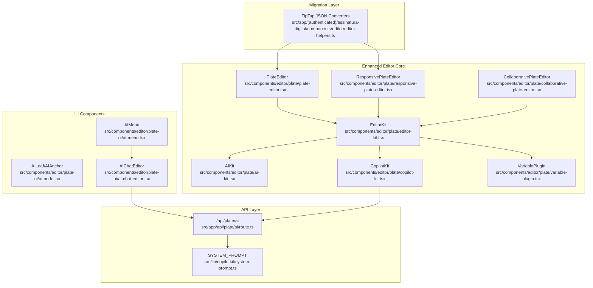
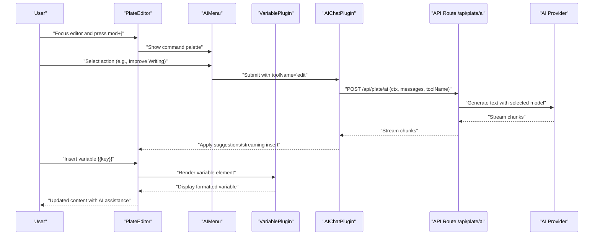
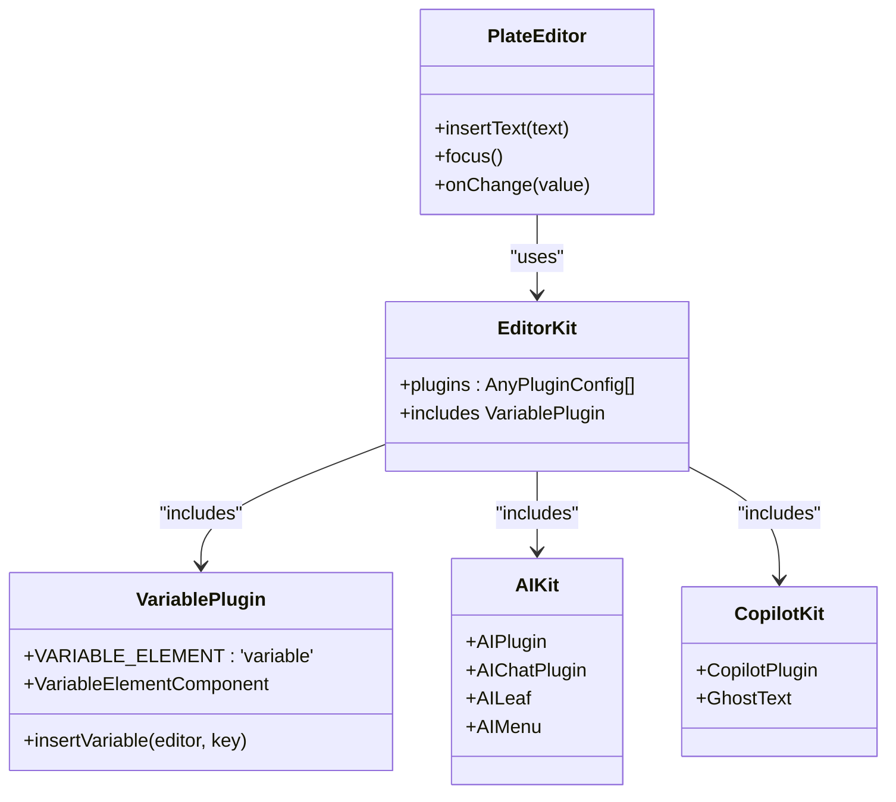
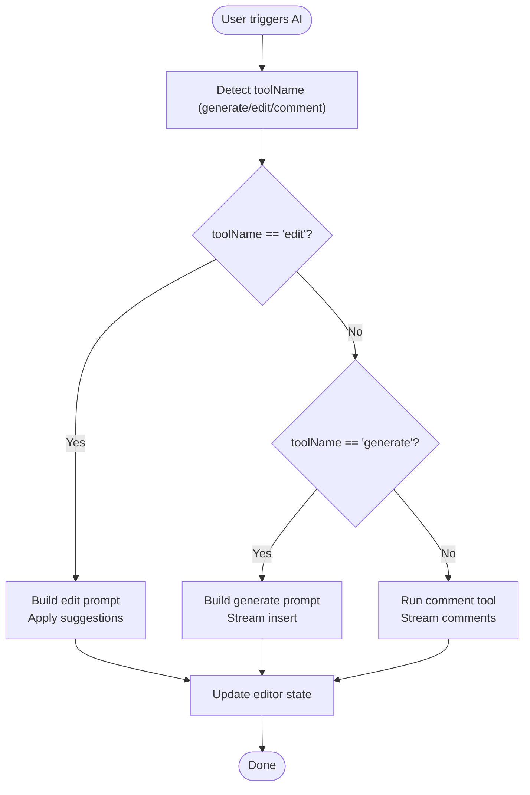
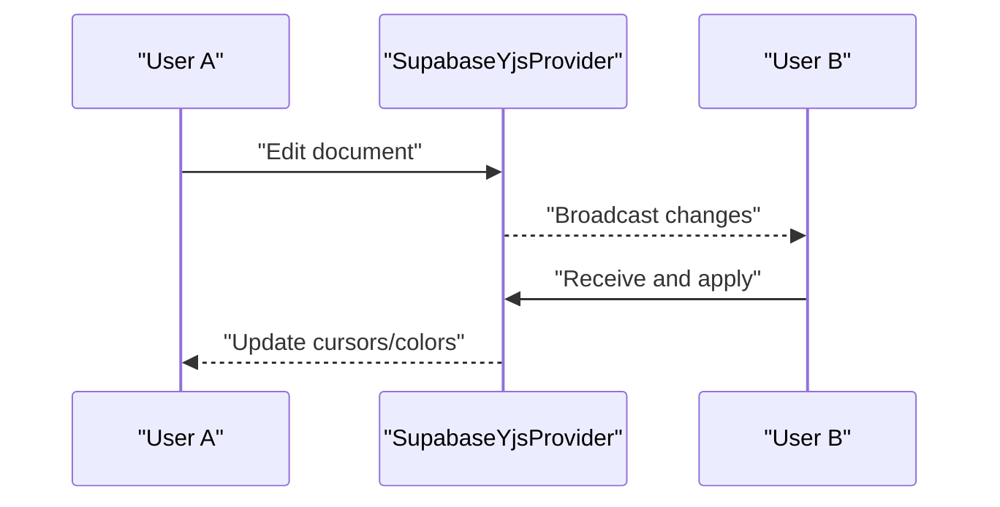
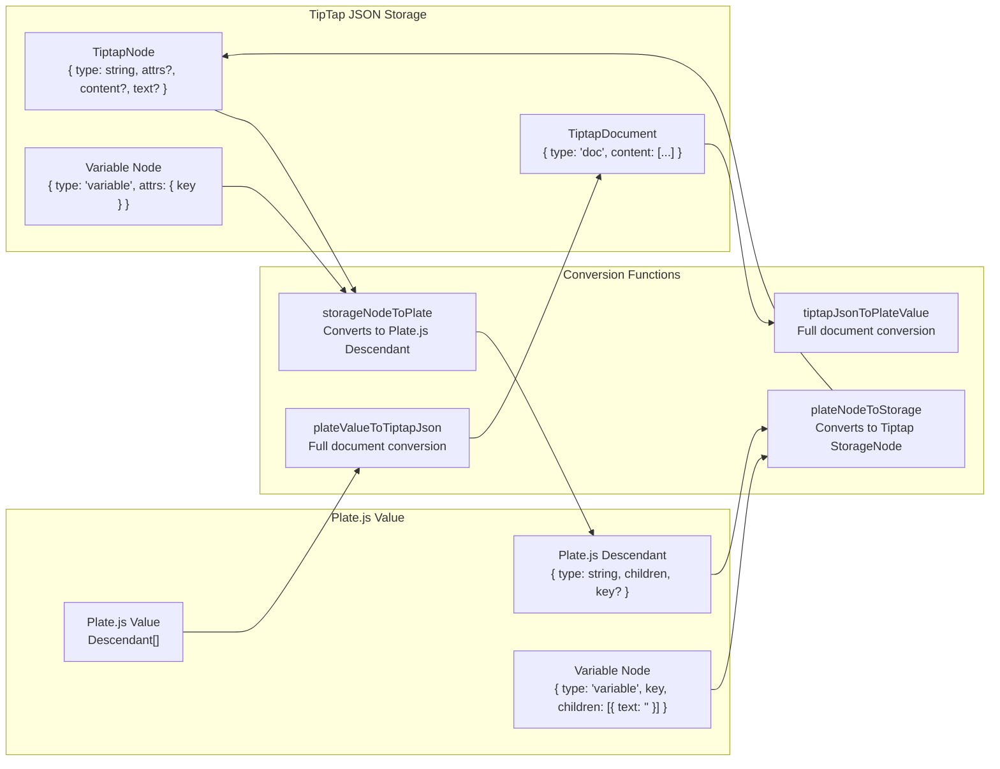
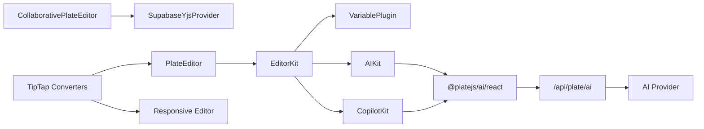

# AI-Assisted Document Editing

<cite>
**Referenced Files in This Document**
- [variable-plugin.tsx](file://src/components/editor/plate/variable-plugin.tsx)
- [editor-kit.tsx](file://src/components/editor/plate/editor-kit.tsx)
- [plate-editor.tsx](file://src/components/editor/plate/plate-editor.tsx)
- [responsive-plate-editor.tsx](file://src/components/editor/plate/responsive-plate-editor.tsx)
- [collaborative-plate-editor.tsx](file://src/components/editor/plate/collaborative-plate-editor.tsx)
- [ai-kit.tsx](file://src/components/editor/plate/ai-kit.tsx)
- [copilot-kit.tsx](file://src/components/editor/plate/copilot-kit.tsx)
- [editor-helpers.ts](file://src/app/(authenticated)/assinatura-digital/components/editor/editor-helpers.ts)
- [RichTextEditor.tsx](file://src/app/(authenticated)/assinatura-digital/components/editor/RichTextEditor.tsx)
- [ai-menu.tsx](file://src/components/editor/plate-ui/ai-menu.tsx)
- [ai-node.tsx](file://src/components/editor/plate-ui/ai-node.tsx)
- [ai-chat-editor.tsx](file://src/components/editor/plate-ui/ai-chat-editor.tsx)
- [use-chat-api.ts](file://src/components/editor/hooks/use-chat-api.ts)
- [use-chat-streaming.ts](file://src/components/editor/hooks/use-chat-streaming.ts)
- [route.ts](file://src/app/api/plate/ai/route.ts)
- [system-prompt.ts](file://src/lib/copilotkit/system-prompt.ts)
- [export-toolbar-button.tsx](file://src/components/editor/plate-ui/export-toolbar-button.tsx)
</cite>

## Update Summary
**Changes Made**
- Added new VariablePlugin for Plate.js inline variable elements
- Enhanced EditorKit with VariablePlugin integration
- Implemented bidirectional TipTap ↔ Plate.js JSON converters
- Updated editor architecture to support seamless migration from TipTap
- Added comprehensive variable insertion and management system

## Table of Contents
1. [Introduction](#introduction)
2. [Project Structure](#project-structure)
3. [Core Components](#core-components)
4. [Architecture Overview](#architecture-overview)
5. [Detailed Component Analysis](#detailed-component-analysis)
6. [Variable System Integration](#variable-system-integration)
7. [Migration Architecture](#migration-architecture)
8. [Dependency Analysis](#dependency-analysis)
9. [Performance Considerations](#performance-considerations)
10. [Troubleshooting Guide](#troubleshooting-guide)
11. [Conclusion](#conclusion)

## Introduction
This document describes the AI-assisted document editing capabilities built with Plate.js and the CopilotKit framework. The system has been enhanced with a new VariablePlugin for inline variable insertion, bidirectional TipTap ↔ Plate.js JSON converters, and improved editor architecture. The implementation maintains backward compatibility while migrating from TipTap to Plate.js, ensuring seamless data preservation and feature continuity.

## Project Structure
The AI-assisted editing system is organized around four enhanced layers:
- Editor Core: Plate.js-based editors with modular plugin kits and variable support
- AI Integration: Plate.js AI plugin with CopilotKit and custom hooks
- Migration Layer: Bidirectional JSON converters for TipTap compatibility
- API Layer: Secure server-side endpoints for AI processing and rate limiting



**Diagram sources**
- [variable-plugin.tsx:38-46](file://src/components/editor/plate/variable-plugin.tsx#L38-L46)
- [editor-kit.tsx:41-91](file://src/components/editor/plate/editor-kit.tsx#L41-L91)
- [editor-helpers.ts:227-355](file://src/app/(authenticated)/assinatura-digital/components/editor/editor-helpers.ts#L227-L355)
- [plate-editor.tsx:22-77](file://src/components/editor/plate/plate-editor.tsx#L22-L77)
- [responsive-plate-editor.tsx:24-55](file://src/components/editor/plate/responsive-plate-editor.tsx#L24-L55)
- [collaborative-plate-editor.tsx:72-187](file://src/components/editor/plate/collaborative-plate-editor.tsx#L72-L187)
- [ai-kit.tsx:106-112](file://src/components/editor/plate/ai-kit.tsx#L106-L112)
- [copilot-kit.tsx:12-75](file://src/components/editor/plate/copilot-kit.tsx#L12-L75)
- [ai-menu.tsx:51-247](file://src/components/editor/plate-ui/ai-menu.tsx#L51-L247)
- [ai-node.tsx:14-43](file://src/components/editor/plate-ui/ai-node.tsx#L14-L43)
- [ai-chat-editor.tsx:12-25](file://src/components/editor/plate-ui/ai-chat-editor.tsx#L12-L25)
- [route.ts:99-297](file://src/app/api/plate/ai/route.ts#L99-L297)
- [system-prompt.ts:16-32](file://src/lib/copilotkit/system-prompt.ts#L16-L32)

**Section sources**
- [variable-plugin.tsx:1-56](file://src/components/editor/plate/variable-plugin.tsx#L1-L56)
- [editor-kit.tsx:1-96](file://src/components/editor/plate/editor-kit.tsx#L1-L96)
- [editor-helpers.ts:1-358](file://src/app/(authenticated)/assinatura-digital/components/editor/editor-helpers.ts#L1-L358)

## Core Components
- **PlateEditor**: The primary editor component with configurable plugins, placeholder, and imperative methods for text insertion and focus.
- **EditorKit**: Central plugin aggregator combining AI, Copilot, UI, collaboration, parsers, and the new VariablePlugin.
- **AIKit**: Integrates Plate.js AI plugin with streaming, suggestions, and UI hooks.
- **CopilotKit**: Provides ghost text predictions and keyboard shortcuts for AI-assisted writing.
- **VariablePlugin**: New inline variable element plugin for Plate.js with proper rendering and insertion functionality.
- **Migration Converters**: Bidirectional JSON converters enabling seamless TipTap to Plate.js migration.
- **AIMenu**: Command palette UI for AI actions (generate, edit, comment, grammar fixes).
- **API Route**: Secure server endpoint for AI processing with rate limiting and tool orchestration.

**Section sources**
- [plate-editor.tsx:11-77](file://src/components/editor/plate/plate-editor.tsx#L11-L77)
- [editor-kit.tsx:41-91](file://src/components/editor/plate/editor-kit.tsx#L41-L91)
- [variable-plugin.tsx:10-55](file://src/components/editor/plate/variable-plugin.tsx#L10-L55)
- [editor-helpers.ts:227-355](file://src/app/(authenticated)/assinatura-digital/components/editor/editor-helpers.ts#L227-L355)
- [ai-kit.tsx:21-112](file://src/components/editor/plate/ai-kit.tsx#L21-L112)
- [copilot-kit.tsx:12-75](file://src/components/editor/plate/copilot-kit.tsx#L12-L75)
- [ai-menu.tsx:51-247](file://src/components/editor/plate-ui/ai-menu.tsx#L51-L247)
- [route.ts:99-297](file://src/app/api/plate/ai/route.ts#L99-L297)

## Architecture Overview
The enhanced AI-assisted editing pipeline now includes variable management and seamless TipTap migration capabilities, connecting the client-side editor to server-side AI processing with robust error handling and streaming support.



**Diagram sources**
- [ai-menu.tsx:107-131](file://src/components/editor/plate-ui/ai-menu.tsx#L107-L131)
- [variable-plugin.tsx:18-36](file://src/components/editor/plate/variable-plugin.tsx#L18-L36)
- [ai-kit.tsx:36-104](file://src/components/editor/plate/ai-kit.tsx#L36-L104)
- [route.ts:171-271](file://src/app/api/plate/ai/route.ts#L171-L271)

## Detailed Component Analysis

### Enhanced PlateEditor and Plugin System
PlateEditor initializes a Plate.js editor with the enhanced EditorKit, now including the VariablePlugin. The EditorKit aggregates:
- AI and Copilot plugins for AI assistance
- Basic blocks, code, tables, toggles, TOC, media, callouts, columns, math, dates, links, mentions
- Marks (basic styles, fonts)
- Block styles (lists, alignment, line height)
- Collaboration (discussion, comments, suggestions)
- Editing aids (slash commands, autoformat, cursor overlay, block menu, drag-and-drop, emoji, exit break)
- Parsers (DOCX, Markdown)
- **VariablePlugin**: Inline variable element support
- UI components (placeholders, fixed and floating toolbars)



**Diagram sources**
- [plate-editor.tsx:22-77](file://src/components/editor/plate/plate-editor.tsx#L22-L77)
- [editor-kit.tsx:41-91](file://src/components/editor/plate/editor-kit.tsx#L41-L91)
- [variable-plugin.tsx:38-55](file://src/components/editor/plate/variable-plugin.tsx#L38-L55)
- [ai-kit.tsx:106-112](file://src/components/editor/plate/ai-kit.tsx#L106-L112)
- [copilot-kit.tsx:12-75](file://src/components/editor/plate/copilot-kit.tsx#L12-L75)

**Section sources**
- [plate-editor.tsx:11-77](file://src/components/editor/plate/plate-editor.tsx#L11-L77)
- [editor-kit.tsx:41-91](file://src/components/editor/plate/editor-kit.tsx#L41-L91)
- [variable-plugin.tsx:10-55](file://src/components/editor/plate/variable-plugin.tsx#L10-L55)

### AI Assistant Integration (Plate.js AI + CopilotKit)
The AI integration consists of:
- AIKit: Extends AIChatPlugin with streaming, suggestions, and UI hooks. It renders an AI loading bar and menu, and handles chunked responses to insert or apply suggestions.
- CopilotKit: Provides ghost text completions with customizable system prompts and keyboard shortcuts (Tab, Ctrl+Space, arrow keys).
- AIMenu: A command palette offering actions like "Continue writing", "Summarize", "Explain", "Improve writing", "Fix spelling", "Simplify language", and "Replace selection".
- AIChatEditor: Renders AI-generated content in a static editor for review and acceptance.



**Diagram sources**
- [ai-kit.tsx:36-104](file://src/components/editor/plate/ai-kit.tsx#L36-L104)
- [ai-menu.tsx:275-503](file://src/components/editor/plate-ui/ai-menu.tsx#L275-L503)
- [route.ts:195-267](file://src/app/api/plate/ai/route.ts#L195-L267)

**Section sources**
- [ai-kit.tsx:21-112](file://src/components/editor/plate/ai-kit.tsx#L21-L112)
- [copilot-kit.tsx:12-75](file://src/components/editor/plate/copilot-kit.tsx#L12-L75)
- [ai-menu.tsx:51-247](file://src/components/editor/plate-ui/ai-menu.tsx#L51-L247)
- [ai-chat-editor.tsx:12-25](file://src/components/editor/plate-ui/ai-chat-editor.tsx#L12-L25)

### Collaborative Editing
CollaborativePlateEditor integrates Yjs via Supabase for real-time synchronization. It supports:
- Real-time cursors with user colors
- Connection and sync status callbacks
- Non-colaborative fallback (SimplePlateEditor)



**Diagram sources**
- [collaborative-plate-editor.tsx:72-187](file://src/components/editor/plate/collaborative-plate-editor.tsx#L72-L187)

**Section sources**
- [collaborative-plate-editor.tsx:38-219](file://src/components/editor/plate/collaborative-plate-editor.tsx#L38-L219)

### Export and Accessibility
Export toolbar supports PDF, image, HTML, and Markdown exports. The HTML export includes Tailwind and KaTeX styles for faithful rendering. Accessibility features include:
- Keyboard navigation for AI menu (Esc to stop, Enter to submit)
- Focus management and ARIA attributes in command components
- Responsive breakpoints for mobile and desktop toolbars

**Section sources**
- [export-toolbar-button.tsx:75-148](file://src/components/editor/plate-ui/export-toolbar-button.tsx#L75-L148)
- [ai-menu.tsx:133-136](file://src/components/editor/plate-ui/ai-menu.tsx#L133-L136)

## Variable System Integration

### VariablePlugin Implementation
The new VariablePlugin provides comprehensive inline variable support for Plate.js:

- **Element Type**: `VARIABLE_ELEMENT = 'variable'` defines the custom element type
- **Interface**: `VariableElementType` extends TElement with key property for variable identification
- **Rendering**: Custom `VariableElementComponent` renders variables as styled inline spans with `{{key}}` notation
- **Insertion**: `insertVariable` function programmatically inserts variable nodes at cursor position
- **Properties**: Variables are rendered as non-editable inline elements with dark/light theme support

```mermaid
classDiagram
class VariablePlugin {
+key : 'variable'
+node : {
+isElement : true
+isInline : true
+isVoid : true
+component : VariableElementComponent
+}
+insertVariable(editor, key)
}
class VariableElementComponent {
+render() : JSX.Element
+props.element.key
+data-variable-key attribute
+monospace styling
+non-editable content
}
class VariableElementType {
+type : 'variable'
+key : string
+children : [{ text : '' }]
}
VariablePlugin --> VariableElementComponent : "uses"
VariablePlugin --> VariableElementType : "defines"
```

**Diagram sources**
- [variable-plugin.tsx:38-46](file://src/components/editor/plate/variable-plugin.tsx#L38-L46)
- [variable-plugin.tsx:18-36](file://src/components/editor/plate/variable-plugin.tsx#L18-L36)
- [variable-plugin.tsx:12-16](file://src/components/editor/plate/variable-plugin.tsx#L12-L16)

**Section sources**
- [variable-plugin.tsx:10-55](file://src/components/editor/plate/variable-plugin.tsx#L10-L55)

### Variable Management in Rich Text Editors
The VariablePlugin integrates seamlessly with existing rich text editors:

- **Toolbar Integration**: Variable insertion button in signature document editors
- **Command Palette**: Searchable variable selection with grouping and filtering
- **Data Management**: Comprehensive variable catalog covering clients, parties, segments, and system variables
- **Migration Support**: Automatic conversion between TipTap and Plate.js variable formats

**Section sources**
- [RichTextEditor.tsx:152-186](file://src/app/(authenticated)/assinatura-digital/components/editor/RichTextEditor.tsx#L152-L186)
- [editor-helpers.ts:21-93](file://src/app/(authenticated)/assinatura-digital/components/editor/editor-helpers.ts#L21-L93)

## Migration Architecture

### Bidirectional JSON Converters
The migration system provides seamless compatibility between TipTap and Plate.js through comprehensive JSON conversion:

- **Storage Format**: Maintains TipTap-compatible JSON structure in database fields
- **Converters**: Bidirectional functions for seamless data transformation
- **Variable Support**: Special handling for variable nodes during conversion
- **Backward Compatibility**: Existing TipTap data loads correctly in Plate.js editors



**Diagram sources**
- [editor-helpers.ts:227-355](file://src/app/(authenticated)/assinatura-digital/components/editor/editor-helpers.ts#L227-L355)

**Section sources**
- [editor-helpers.ts:212-355](file://src/app/(authenticated)/assinatura-digital/components/editor/editor-helpers.ts#L212-L355)

### Migration Benefits
The migration architecture provides several key advantages:

- **Zero Data Loss**: All existing TipTap JSON data remains compatible
- **Seamless Transition**: No downtime or data reprocessing required
- **Future-Proof**: Plate.js provides better performance and extensibility
- **Plugin Compatibility**: All existing plugins and functionality preserved
- **Developer Experience**: Simplified dependency management and reduced conflicts

**Section sources**
- [editor-helpers.ts:1-20](file://src/app/(authenticated)/assinatura-digital/components/editor/editor-helpers.ts#L1-L20)

## Dependency Analysis
The enhanced AI-assisted editor relies on external libraries and internal modules with improved architecture:

- Plate.js ecosystem for editor core and plugins
- @platejs/ai for AI chat, suggestions, and streaming
- @copilotkit/react-core for CopilotKit integration
- **@platejs/yjs for collaborative editing**
- **New VariablePlugin for inline variable support**
- Next.js API routes for secure AI processing
- Supabase for Yjs collaboration



**Diagram sources**
- [editor-kit.tsx:41-91](file://src/components/editor/plate/editor-kit.tsx#L41-L91)
- [variable-plugin.tsx:38-46](file://src/components/editor/plate/variable-plugin.tsx#L38-L46)
- [ai-kit.tsx:106-112](file://src/components/editor/plate/ai-kit.tsx#L106-L112)
- [copilot-kit.tsx:12-75](file://src/components/editor/plate/copilot-kit.tsx#L12-L75)
- [route.ts:99-297](file://src/app/api/plate/ai/route.ts#L99-L297)
- [collaborative-plate-editor.tsx:72-187](file://src/components/editor/plate/collaborative-plate-editor.tsx#L72-L187)
- [editor-helpers.ts:227-355](file://src/app/(authenticated)/assinatura-digital/components/editor/editor-helpers.ts#L227-L355)

**Section sources**
- [editor-kit.tsx:1-96](file://src/components/editor/plate/editor-kit.tsx#L1-L96)
- [variable-plugin.tsx:1-56](file://src/components/editor/plate/variable-plugin.tsx#L1-L56)
- [route.ts:99-297](file://src/app/api/plate/ai/route.ts#L99-L297)

## Performance Considerations
Enhanced performance optimizations include:

- **Streaming Responses**: AIKit uses streamInsertChunk and applyAISuggestions to minimize DOM updates and maintain responsiveness during long generations.
- **Debounced Predictions**: CopilotKit includes a debounce delay to reduce unnecessary API calls.
- **Rate Limiting**: The API endpoint enforces tiered rate limits and records suspicious activity to protect backend resources.
- **Bundle Optimization**: The editor is loaded lazily in the application route to avoid pulling heavy dependencies into barrel imports.
- **Rendering**: AIChatEditor uses a static editor instance for previews to avoid full editor re-initialization.
- **Variable Optimization**: VariablePlugin renders efficiently as non-editable inline elements with minimal DOM overhead.
- **Migration Efficiency**: JSON converters operate during editor initialization, minimizing runtime conversion costs.

**Section sources**
- [ai-kit.tsx:42-104](file://src/components/editor/plate/ai-kit.tsx#L42-L104)
- [copilot-kit.tsx:42-43](file://src/components/editor/plate/copilot-kit.tsx#L42-L43)
- [route.ts:104-133](file://src/app/api/plate/ai/route.ts#L104-L133)
- [plate-editor.tsx:13-16](file://src/components/editor/plate/plate-editor.tsx#L13-L16)
- [variable-plugin.tsx:18-36](file://src/components/editor/plate/variable-plugin.tsx#L18-L36)

## Troubleshooting Guide
Enhanced troubleshooting guidance for the migrated system:

**Common Issues and Resolutions:**
- **AI Unavailable (401)**: The server requires a configured API key. The client displays a toast notification and continues editing.
- **Rate Limit Exceeded (409)**: The endpoint throttles requests; clients should retry after the indicated interval.
- **Forbidden Access (403)**: Authentication failure; verify credentials and permissions.
- **Bad Request (400)**: Invalid request payload; check the structure of ctx and messages.
- **Server Errors (500+)**: Temporary failures; the client shows a generic error and suggests retrying.
- **Variable Rendering Issues**: Ensure VariablePlugin is included in EditorKit and variables are properly formatted as `{{key}}`.
- **Migration Data Problems**: Verify JSON converters are functioning correctly and TipTap JSON structure is maintained.

**Enhanced Error Handling:**
- **useChatApi**: Wraps DefaultChatTransport to intercept HTTP errors and display user-friendly notifications.
- **useChatStreaming**: Processes streaming events for toolName updates and comment creation.
- **Migration Converters**: Include error handling for malformed JSON and missing variable keys.

**Section sources**
- [use-chat-api.ts:16-131](file://src/components/editor/hooks/use-chat-api.ts#L16-L131)
- [use-chat-streaming.ts:22-55](file://src/components/editor/hooks/use-chat-streaming.ts#L22-L55)
- [route.ts:154-162](file://src/app/api/plate/ai/route.ts#L154-L162)
- [editor-helpers.ts:227-355](file://src/app/(authenticated)/assinatura-digital/components/editor/editor-helpers.ts#L227-L355)

## Conclusion
The enhanced AI-assisted document editing system represents a significant architectural advancement with the migration from TipTap to Plate.js. The new VariablePlugin provides robust inline variable support, while bidirectional JSON converters ensure seamless data migration and backward compatibility. The system maintains all existing AI-assisted features while adding improved performance, extensibility, and developer experience. The modular design allows easy customization, while streaming, rate limiting, and responsive UI ensure performance and usability across devices and browsers.