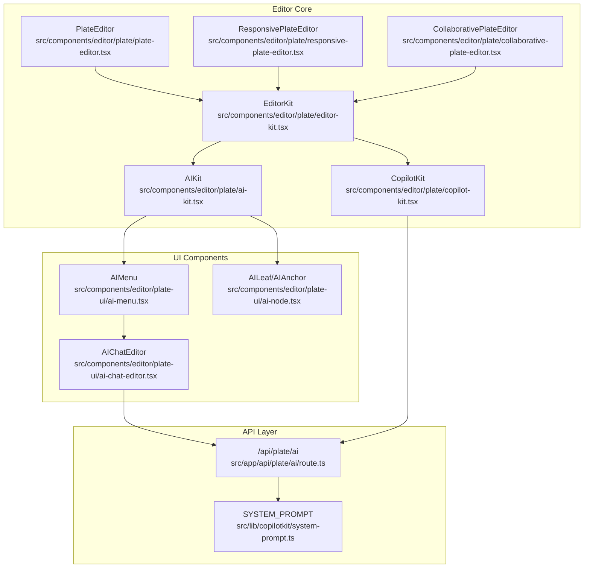
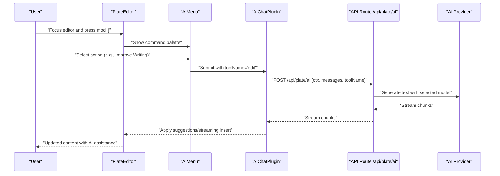
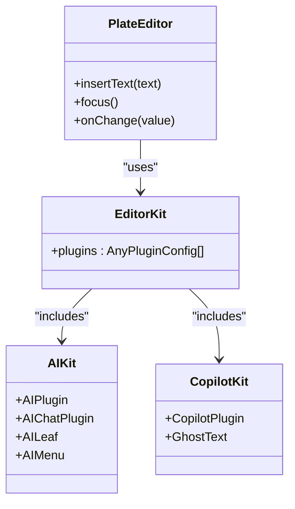
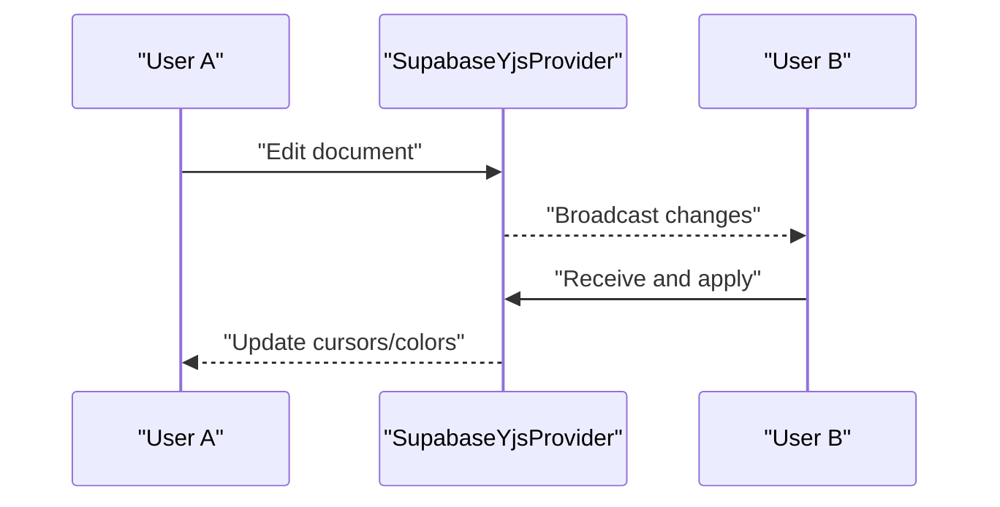
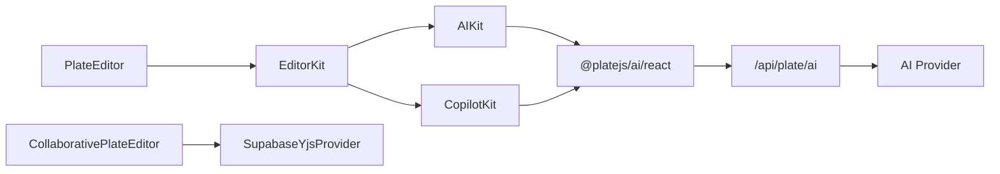

# AI-Assisted Document Editing

<cite>
**Referenced Files in This Document**
- [plate-editor.tsx](file://src/components/editor/plate/plate-editor.tsx)
- [responsive-plate-editor.tsx](file://src/components/editor/plate/responsive-plate-editor.tsx)
- [collaborative-plate-editor.tsx](file://src/components/editor/plate/collaborative-plate-editor.tsx)
- [editor-kit.tsx](file://src/components/editor/plate/editor-kit.tsx)
- [ai-kit.tsx](file://src/components/editor/plate/ai-kit.tsx)
- [copilot-kit.tsx](file://src/components/editor/plate/copilot-kit.tsx)
- [ai-menu.tsx](file://src/components/editor/plate-ui/ai-menu.tsx)
- [ai-node.tsx](file://src/components/editor/plate-ui/ai-node.tsx)
- [ai-chat-editor.tsx](file://src/components/editor/plate-ui/ai-chat-editor.tsx)
- [use-chat-api.ts](file://src/components/editor/hooks/use-chat-api.ts)
- [use-chat-streaming.ts](file://src/components/editor/hooks/use-chat-streaming.ts)
- [route.ts](file://src/app/api/plate/ai/route.ts)
- [system-prompt.ts](file://src/lib/copilotkit/system-prompt.ts)
- [template-texto-pdf.service.ts](file://src/shared/assinatura-digital/services/template-texto-pdf.service.ts)
- [export-toolbar-button.tsx](file://src/components/editor/plate-ui/export-toolbar-button.tsx)
</cite>

## Table of Contents
1. [Introduction](#introduction)
2. [Project Structure](#project-structure)
3. [Core Components](#core-components)
4. [Architecture Overview](#architecture-overview)
5. [Detailed Component Analysis](#detailed-component-analysis)
6. [Dependency Analysis](#dependency-analysis)
7. [Performance Considerations](#performance-considerations)
8. [Troubleshooting Guide](#troubleshooting-guide)
9. [Conclusion](#conclusion)

## Introduction
This document describes the AI-assisted document editing capabilities built with Plate.js and the CopilotKit framework. It covers the rich text editor architecture, plugin system, AI assistant integration, content suggestions, grammar checking, collaborative editing, export capabilities, and practical configuration examples. The implementation emphasizes extensibility, performance, accessibility, and cross-browser compatibility.

## Project Structure
The AI-assisted editing system is organized around three layers:
- Editor Core: Plate.js-based editors with modular plugin kits
- AI Integration: Plate.js AI plugin with CopilotKit and custom hooks
- API Layer: Secure server-side endpoints for AI processing and rate limiting

**Diagram sources**
- [plate-editor.tsx:22-77](file://src/components/editor/plate/plate-editor.tsx#L22-L77)
- [responsive-plate-editor.tsx:24-55](file://src/components/editor/plate/responsive-plate-editor.tsx#L24-L55)
- [collaborative-plate-editor.tsx:72-187](file://src/components/editor/plate/collaborative-plate-editor.tsx#L72-L187)
- [editor-kit.tsx:41-91](file://src/components/editor/plate/editor-kit.tsx#L41-L91)
- [ai-kit.tsx:106-112](file://src/components/editor/plate/ai-kit.tsx#L106-L112)
- [copilot-kit.tsx:12-75](file://src/components/editor/plate/copilot-kit.tsx#L12-L75)
- [ai-menu.tsx:51-247](file://src/components/editor/plate-ui/ai-menu.tsx#L51-L247)
- [ai-node.tsx:14-43](file://src/components/editor/plate-ui/ai-node.tsx#L14-L43)
- [ai-chat-editor.tsx:12-25](file://src/components/editor/plate-ui/ai-chat-editor.tsx#L12-L25)
- [route.ts:99-297](file://src/app/api/plate/ai/route.ts#L99-L297)
- [system-prompt.ts:16-32](file://src/lib/copilotkit/system-prompt.ts#L16-L32)

**Section sources**
- [plate-editor.tsx:1-77](file://src/components/editor/plate/plate-editor.tsx#L1-L77)
- [responsive-plate-editor.tsx:1-80](file://src/components/editor/plate/responsive-plate-editor.tsx#L1-L80)
- [collaborative-plate-editor.tsx:38-219](file://src/components/editor/plate/collaborative-plate-editor.tsx#L38-L219)
- [editor-kit.tsx:1-96](file://src/components/editor/plate/editor-kit.tsx#L1-L96)

## Core Components
- PlateEditor: The primary editor component with configurable plugins, placeholder, and imperative methods for text insertion and focus.
- EditorKit: Central plugin aggregator combining AI, Copilot, UI, collaboration, and parser plugins.
- AIKit: Integrates Plate.js AI plugin with streaming, suggestions, and UI hooks.
- CopilotKit: Provides ghost text predictions and keyboard shortcuts for AI-assisted writing.
- AIMenu: Command palette UI for AI actions (generate, edit, comment, grammar fixes).
- API Route: Secure server endpoint for AI processing with rate limiting and tool orchestration.

**Section sources**
- [plate-editor.tsx:11-77](file://src/components/editor/plate/plate-editor.tsx#L11-L77)
- [editor-kit.tsx:41-91](file://src/components/editor/plate/editor-kit.tsx#L41-L91)
- [ai-kit.tsx:21-112](file://src/components/editor/plate/ai-kit.tsx#L21-L112)
- [copilot-kit.tsx:12-75](file://src/components/editor/plate/copilot-kit.tsx#L12-L75)
- [ai-menu.tsx:51-247](file://src/components/editor/plate-ui/ai-menu.tsx#L51-L247)
- [route.ts:99-297](file://src/app/api/plate/ai/route.ts#L99-L297)

## Architecture Overview
The AI-assisted editing pipeline connects the client-side editor to server-side AI processing with robust error handling and streaming support.

**Diagram sources**
- [ai-menu.tsx:107-131](file://src/components/editor/plate-ui/ai-menu.tsx#L107-L131)
- [ai-kit.tsx:36-104](file://src/components/editor/plate/ai-kit.tsx#L36-L104)
- [route.ts:171-271](file://src/app/api/plate/ai/route.ts#L171-L271)

## Detailed Component Analysis

### PlateEditor and Plugin System
PlateEditor initializes a Plate.js editor with EditorKit, exposing imperative methods for programmatic text insertion and focus. The EditorKit aggregates:
- AI and Copilot plugins for AI assistance
- Basic blocks, code, tables, toggles, TOC, media, callouts, columns, math, dates, links, mentions
- Marks (basic styles, fonts)
- Block styles (lists, alignment, line height)
- Collaboration (discussion, comments, suggestions)
- Editing aids (slash commands, autoformat, cursor overlay, block menu, drag-and-drop, emoji, exit break)
- Parsers (DOCX, Markdown)
- UI components (placeholders, fixed and floating toolbars)

**Diagram sources**
- [plate-editor.tsx:22-77](file://src/components/editor/plate/plate-editor.tsx#L22-L77)
- [editor-kit.tsx:41-91](file://src/components/editor/plate/editor-kit.tsx#L41-L91)
- [ai-kit.tsx:106-112](file://src/components/editor/plate/ai-kit.tsx#L106-L112)
- [copilot-kit.tsx:12-75](file://src/components/editor/plate/copilot-kit.tsx#L12-L75)

**Section sources**
- [plate-editor.tsx:11-77](file://src/components/editor/plate/plate-editor.tsx#L11-L77)
- [editor-kit.tsx:41-91](file://src/components/editor/plate/editor-kit.tsx#L41-L91)

### AI Assistant Integration (Plate.js AI + CopilotKit)
The AI integration consists of:
- AIKit: Extends AIChatPlugin with streaming, suggestions, and UI hooks. It renders an AI loading bar and menu, and handles chunked responses to insert or apply suggestions.
- CopilotKit: Provides ghost text completions with customizable system prompts and keyboard shortcuts (Tab, Ctrl+Space, arrow keys).
- AIMenu: A command palette offering actions like "Continue writing", "Summarize", "Explain", "Improve writing", "Fix spelling", "Simplify language", and "Replace selection".
- AIChatEditor: Renders AI-generated content in a static editor for review and acceptance.

**Diagram sources**
- [ai-kit.tsx:36-104](file://src/components/editor/plate/ai-kit.tsx#L36-L104)
- [ai-menu.tsx:275-503](file://src/components/editor/plate-ui/ai-menu.tsx#L275-L503)
- [route.ts:195-267](file://src/app/api/plate/ai/route.ts#L195-L267)

**Section sources**
- [ai-kit.tsx:21-112](file://src/components/editor/plate/ai-kit.tsx#L21-L112)
- [copilot-kit.tsx:12-75](file://src/components/editor/plate/copilot-kit.tsx#L12-L75)
- [ai-menu.tsx:51-247](file://src/components/editor/plate-ui/ai-menu.tsx#L51-L247)
- [ai-chat-editor.tsx:12-25](file://src/components/editor/plate-ui/ai-chat-editor.tsx#L12-L25)

### Collaborative Editing
CollaborativePlateEditor integrates Yjs via Supabase for real-time synchronization. It supports:
- Real-time cursors with user colors
- Connection and sync status callbacks
- Non-colaborative fallback (SimplePlateEditor)

**Diagram sources**
- [collaborative-plate-editor.tsx:72-187](file://src/components/editor/plate/collaborative-plate-editor.tsx#L72-L187)

**Section sources**
- [collaborative-plate-editor.tsx:38-219](file://src/components/editor/plate/collaborative-plate-editor.tsx#L38-L219)

### Export and Accessibility
Export toolbar supports PDF, image, HTML, and Markdown exports. The HTML export includes Tailwind and KaTeX styles for faithful rendering. Accessibility features include:
- Keyboard navigation for AI menu (Esc to stop, Enter to submit)
- Focus management and ARIA attributes in command components
- Responsive breakpoints for mobile and desktop toolbars

**Section sources**
- [export-toolbar-button.tsx:75-148](file://src/components/editor/plate-ui/export-toolbar-button.tsx#L75-L148)
- [ai-menu.tsx:133-136](file://src/components/editor/plate-ui/ai-menu.tsx#L133-L136)

## Dependency Analysis
The AI-assisted editor relies on external libraries and internal modules:
- Plate.js ecosystem for editor core and plugins
- @platejs/ai for AI chat, suggestions, and streaming
- @copilotkit/react-core for CopilotKit integration
- Next.js API routes for secure AI processing
- Supabase for Yjs collaboration

**Diagram sources**
- [editor-kit.tsx:41-91](file://src/components/editor/plate/editor-kit.tsx#L41-L91)
- [ai-kit.tsx:106-112](file://src/components/editor/plate/ai-kit.tsx#L106-L112)
- [copilot-kit.tsx:12-75](file://src/components/editor/plate/copilot-kit.tsx#L12-L75)
- [route.ts:99-297](file://src/app/api/plate/ai/route.ts#L99-L297)
- [collaborative-plate-editor.tsx:72-187](file://src/components/editor/plate/collaborative-plate-editor.tsx#L72-L187)

**Section sources**
- [editor-kit.tsx:1-96](file://src/components/editor/plate/editor-kit.tsx#L1-L96)
- [route.ts:99-297](file://src/app/api/plate/ai/route.ts#L99-L297)

## Performance Considerations
- Streaming Responses: AIKit uses streamInsertChunk and applyAISuggestions to minimize DOM updates and maintain responsiveness during long generations.
- Debounced Predictions: CopilotKit includes a debounce delay to reduce unnecessary API calls.
- Rate Limiting: The API endpoint enforces tiered rate limits and records suspicious activity to protect backend resources.
- Bundle Optimization: The editor is loaded lazily in the application route to avoid pulling heavy dependencies into barrel imports.
- Rendering: AIChatEditor uses a static editor instance for previews to avoid full editor re-initialization.

**Section sources**
- [ai-kit.tsx:42-104](file://src/components/editor/plate/ai-kit.tsx#L42-L104)
- [copilot-kit.tsx:42-43](file://src/components/editor/plate/copilot-kit.tsx#L42-L43)
- [route.ts:104-133](file://src/app/api/plate/ai/route.ts#L104-L133)
- [plate-editor.tsx:13-16](file://src/components/editor/plate/plate-editor.tsx#L13-L16)

## Troubleshooting Guide
Common issues and resolutions:
- AI Unavailable (401): The server requires a configured API key. The client displays a toast notification and continues editing.
- Rate Limit Exceeded (429): The endpoint throttles requests; clients should retry after the indicated interval.
- Forbidden Access (403): Authentication failure; verify credentials and permissions.
- Bad Request (400): Invalid request payload; check the structure of ctx and messages.
- Server Errors (500+): Temporary failures; the client shows a generic error and suggests retrying.

Error handling hooks:
- useChatApi: Wraps DefaultChatTransport to intercept HTTP errors and display user-friendly notifications.
- useChatStreaming: Processes streaming events for toolName updates and comment creation.

**Section sources**
- [use-chat-api.ts:16-131](file://src/components/editor/hooks/use-chat-api.ts#L16-L131)
- [use-chat-streaming.ts:22-55](file://src/components/editor/hooks/use-chat-streaming.ts#L22-L55)
- [route.ts:154-162](file://src/app/api/plate/ai/route.ts#L154-L162)

## Conclusion
The AI-assisted document editing system combines Plate.js’s extensible plugin architecture with CopilotKit and a secure API layer to deliver powerful, accessible, and collaborative editing experiences. The modular design allows easy customization, while streaming, rate limiting, and responsive UI ensure performance and usability across devices and browsers.