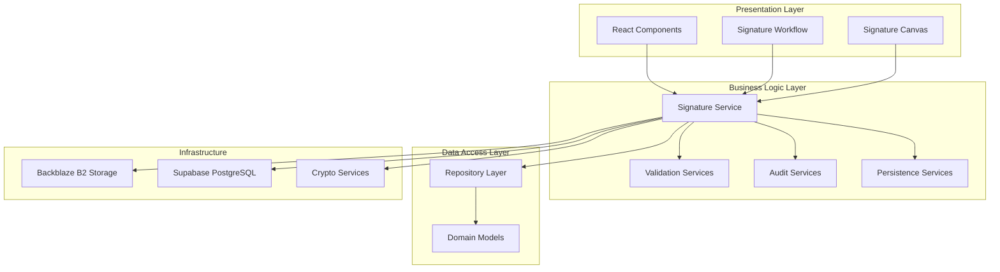
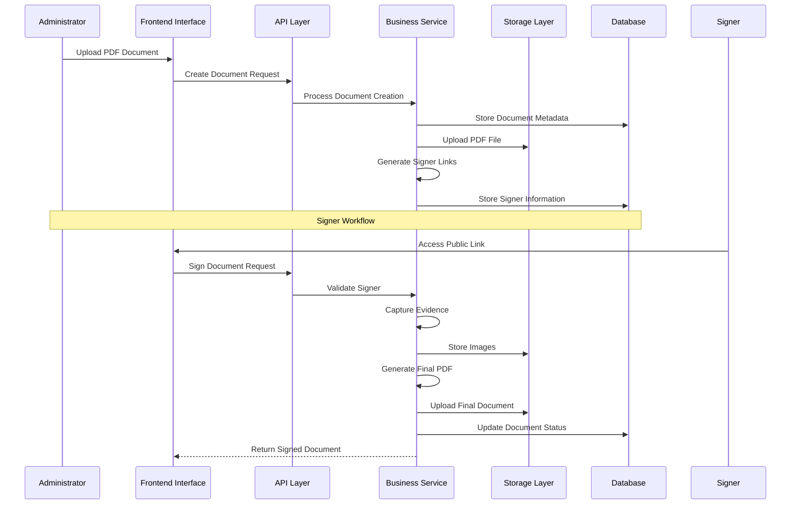
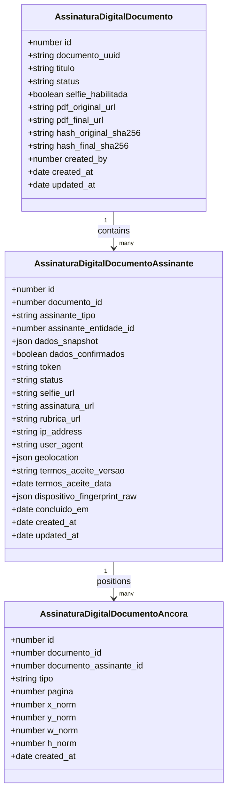
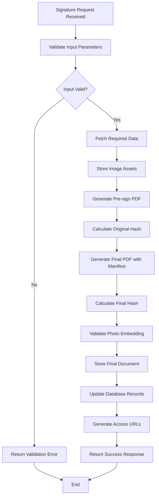
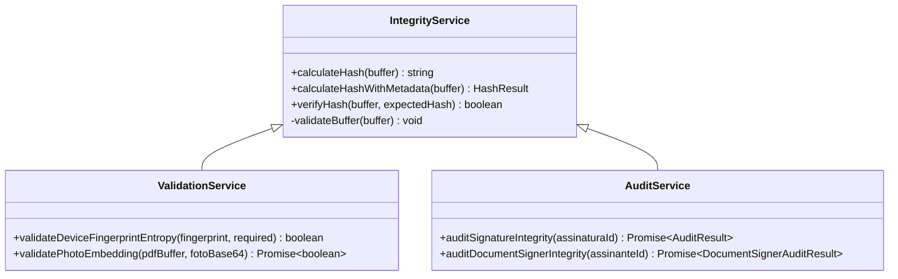
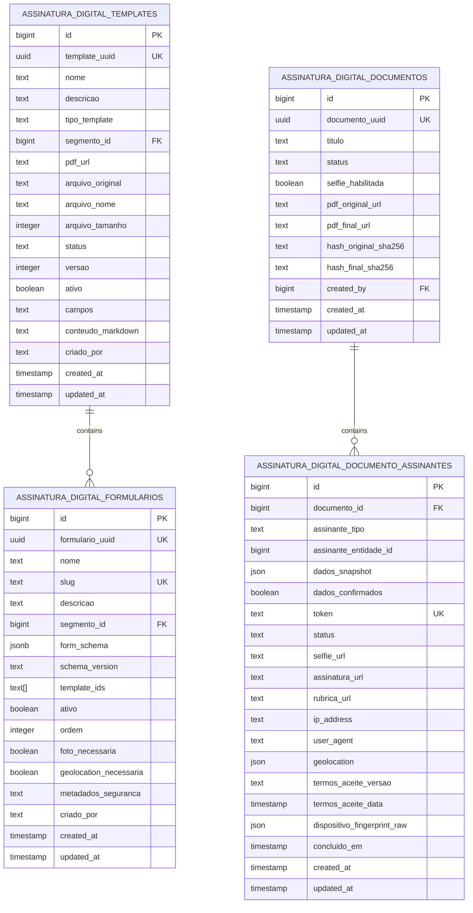
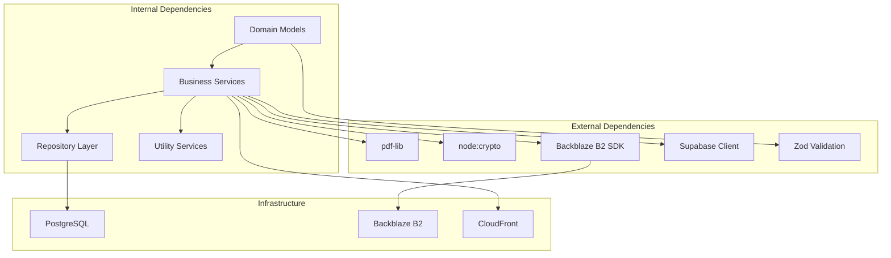
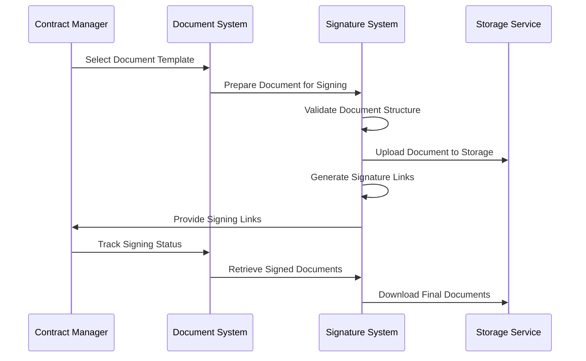

# Digital Signature Workflows

<cite>
**Referenced Files in This Document**
- [domain.ts](file://src/shared/assinatura-digital/domain.ts)
- [service.ts](file://src/shared/assinatura-digital/service.ts)
- [repository.ts](file://src/shared/assinatura-digital/repository.ts)
- [signature.service.ts](file://src/shared/assinatura-digital/services/signature.service.ts)
- [finalization.service.ts](file://src/shared/assinatura-digital/services/signature/finalization.service.ts)
- [validation.service.ts](file://src/shared/assinatura-digital/services/signature/validation.service.ts)
- [audit.service.ts](file://src/shared/assinatura-digital/services/signature/audit.service.ts)
- [persistence.service.ts](file://src/shared/assinatura-digital/services/signature/persistence.service.ts)
- [integrity.service.ts](file://src/shared/assinatura-digital/services/integrity.service.ts)
- [storage.service.ts](file://src/shared/assinatura-digital/services/storage.service.ts)
- [25_assinatura_digital.sql](file://supabase/schemas/25_assinatura_digital.sql)
- [20260105160000_add_assinatura_digital_documentos_tables.sql](file://supabase/migrations/20260105160000_add_assinatura_digital_documentos_tables.sql)
- [20251203120000_rename_formsign_to_assinatura_digital.sql](file://supabase/migrations/20251203120000_rename_formsign_to_assinatura_digital.sql)
- [FEATURE-README.md](file://src/app/(authenticated)/assinatura-digital/docs/FEATURE-README.md)
- [conformidade-legal.md](file://src/app/(authenticated)/assinatura-digital/docs/conformidade-legal.md)
- [workflow/README.md](file://src/app/(authenticated)/assinatura-digital/components/workflow/README.md)
- [canvas-assinatura.tsx](file://src/shared/assinatura-digital/components/signature/canvas-assinatura.tsx)
- [preview-assinatura.tsx](file://src/shared/assinatura-digital/components/signature/preview-assinatura.tsx)
</cite>

## Table of Contents
1. [Introduction](#introduction)
2. [Project Structure](#project-structure)
3. [Core Components](#core-components)
4. [Architecture Overview](#architecture-overview)
5. [Detailed Component Analysis](#detailed-component-analysis)
6. [Dependency Analysis](#dependency-analysis)
7. [Performance Considerations](#performance-considerations)
8. [Security and Compliance](#security-and-compliance)
9. [Integration Examples](#integration-examples)
10. [Troubleshooting Guide](#troubleshooting-guide)
11. [Conclusion](#conclusion)

## Introduction

The Digital Signature Workflows module implements a comprehensive electronic signature system compliant with Brazil's MP 2.200-2/2001 (ICP-Brasil framework). This system supports two distinct workflows: document-based signing via PDF upload with multiple signers, and template-based signing through dynamic forms. The implementation ensures legal validity, document integrity verification, and comprehensive audit trails while maintaining high security standards.

The system provides a complete solution for digital document signing with features including multi-party workflows, custom branding capabilities, automated notifications, and compliance with Brazilian electronic signature regulations. It leverages modern technologies including PDF manipulation, cryptographic hashing, and secure storage infrastructure.

## Project Structure

The digital signature system is organized into several key layers within the ZattarOS architecture:

**Diagram sources**
- [service.ts:40-189](file://src/shared/assinatura-digital/service.ts#L40-L189)
- [repository.ts:38-352](file://src/shared/assinatura-digital/repository.ts#L38-L352)

The system follows a layered architecture pattern with clear separation of concerns:

- **Domain Layer**: Defines core business entities and validation schemas
- **Service Layer**: Implements business logic and workflow orchestration
- **Repository Layer**: Handles data persistence and database operations
- **Infrastructure Layer**: Manages external integrations and storage

**Section sources**
- [domain.ts:1-610](file://src/shared/assinatura-digital/domain.ts#L1-L610)
- [service.ts:40-189](file://src/shared/assinatura-digital/service.ts#L40-L189)

## Core Components

### Document-Based Signing Workflow

The document-based workflow enables administrators to upload PDF documents and invite multiple signers through unique public links. This workflow supports:

- **Multi-party signing**: Multiple signers can sign the same document
- **Custom branding**: Document-specific branding and styling
- **Flexible signer types**: Support for clients, parties, representatives, third parties, users, and guests
- **Anchor positioning**: Precise placement of signature and initials fields
- **Selfie requirements**: Optional biometric verification

### Template-Based Signing Workflow

The template-based workflow provides dynamic form generation with:

- **Dynamic forms**: JSON schema-driven form creation
- **Template management**: PDF and Markdown template support
- **Variable interpolation**: Mustache-based content generation
- **Form validation**: Comprehensive input validation
- **Preview functionality**: Real-time document preview

### Security and Compliance Services

The system implements comprehensive security measures:

- **Dual hashing**: SHA-256 hashing for document integrity verification
- **Device fingerprinting**: Multi-factor device identification
- **Biometric verification**: Selfie capture and validation
- **Audit trails**: Complete transaction logging
- **Legal compliance**: MP 2.200-2/2001 adherence

**Section sources**
- [domain.ts:303-362](file://src/shared/assinatura-digital/domain.ts#L303-L362)
- [signature.service.ts:1-175](file://src/shared/assinatura-digital/services/signature.service.ts#L1-L175)

## Architecture Overview

The digital signature system implements a microservices-like architecture within the Next.js application:

**Diagram sources**
- [finalization.service.ts:578-698](file://src/shared/assinatura-digital/services/signature/finalization.service.ts#L578-L698)
- [storage.service.ts:10-50](file://src/shared/assinatura-digital/services/storage.service.ts#L10-L50)

The architecture ensures scalability, maintainability, and compliance through:

- **Separation of concerns**: Clear boundaries between components
- **Asynchronous processing**: Background tasks for heavy operations
- **Transaction management**: Atomic operations for data consistency
- **Error handling**: Comprehensive failure recovery mechanisms

## Detailed Component Analysis

### Document Management System

The document management system handles PDF document lifecycle management:

**Diagram sources**
- [domain.ts:303-362](file://src/shared/assinatura-digital/domain.ts#L303-L362)
- [domain.ts:318-356](file://src/shared/assinatura-digital/domain.ts#L318-L356)

### Signature Processing Pipeline

The signature processing pipeline implements a multi-stage validation and processing workflow:

**Diagram sources**
- [finalization.service.ts:578-698](file://src/shared/assinatura-digital/services/signature/finalization.service.ts#L578-L698)
- [validation.service.ts:186-269](file://src/shared/assinatura-digital/services/signature/validation.service.ts#L186-L269)

### Security and Integrity Services

The integrity service implements cryptographic operations for document verification:

**Diagram sources**
- [integrity.service.ts:110-254](file://src/shared/assinatura-digital/services/integrity.service.ts#L110-L254)
- [validation.service.ts:60-269](file://src/shared/assinatura-digital/services/signature/validation.service.ts#L60-L269)
- [audit.service.ts:73-539](file://src/shared/assinatura-digital/services/signature/audit.service.ts#L73-L539)

**Section sources**
- [domain.ts:44-104](file://src/shared/assinatura-digital/domain.ts#L44-L104)
- [finalization.service.ts:578-698](file://src/shared/assinatura-digital/services/signature/finalization.service.ts#L578-L698)

### Database Schema Design

The database schema supports both signing workflows with comprehensive indexing and security policies:

**Diagram sources**
- [25_assinatura_digital.sql:8-321](file://supabase/schemas/25_assinatura_digital.sql#L8-L321)
- [20260105160000_add_assinatura_digital_documentos_tables.sql:10-96](file://supabase/migrations/20260105160000_add_assinatura_digital_documentos_tables.sql#L10-L96)

**Section sources**
- [25_assinatura_digital.sql:1-321](file://supabase/schemas/25_assinatura_digital.sql#L1-L321)
- [20260105160000_add_assinatura_digital_documentos_tables.sql:1-164](file://supabase/migrations/20260105160000_add_assinatura_digital_documentos_tables.sql#L1-L164)

## Dependency Analysis

The digital signature system exhibits strong internal cohesion with clear external dependencies:

**Diagram sources**
- [service.ts:1-189](file://src/shared/assinatura-digital/service.ts#L1-L189)
- [repository.ts:1-352](file://src/shared/assinatura-digital/repository.ts#L1-L352)

The dependency structure ensures:

- **Low coupling**: Services depend on abstractions, not concrete implementations
- **High cohesion**: Related functionality is grouped within service boundaries
- **Clear interfaces**: Well-defined contracts between layers
- **Testability**: Easy mocking and testing of dependencies

**Section sources**
- [service.ts:1-189](file://src/shared/assinatura-digital/service.ts#L1-L189)
- [repository.ts:1-352](file://src/shared/assinatura-digital/repository.ts#L1-L352)

## Performance Considerations

The system implements several performance optimization strategies:

### Asynchronous Processing
- PDF generation and manipulation operations are performed asynchronously
- Large file uploads utilize streaming to minimize memory usage
- Background jobs handle time-consuming operations

### Caching Strategies
- Frequently accessed templates and configurations are cached
- Database query results are cached for read-heavy operations
- CDN caching for static assets and generated documents

### Scalability Features
- Horizontal scaling support through stateless service design
- Database connection pooling for efficient resource utilization
- Load balancing for high-traffic scenarios

### Memory Management
- Proper disposal of PDF buffers and image data
- Streaming operations for large file processing
- Garbage collection optimization for Node.js runtime

## Security and Compliance

### Legal Compliance Framework

The system adheres to MP 2.200-2/2001 requirements for Advanced Electronic Signatures:

#### Four Essential Requirements Implementation

1. **Unambiguous Association (Alínea a)**: Device fingerprinting with minimum 6 identifying attributes
2. **Inequivocal Identification (Alínea b)**: Biometric selfie capture plus personal data validation
3. **Exclusive Control (Alínea c)**: Real-time capture via webcam/canvas, no file uploads allowed
4. **Document Linkage (Alínea d)**: SHA-256 hashing with immutable document structure

### Security Measures

#### Cryptographic Implementation
- SHA-256 hashing for document integrity verification
- Timing-safe hash comparison to prevent timing attacks
- Secure random token generation for public links
- Encrypted storage of sensitive biometric data

#### Access Control
- Row-level security policies for data isolation
- Role-based access control for administrative functions
- Token-based authentication for public signing links
- Session management with expiration controls

#### Audit and Monitoring
- Comprehensive logging of all signature operations
- Real-time monitoring of security events
- Automated compliance reporting
- Forensic audit trail maintenance

### Data Protection

#### Privacy Controls
- Minimal data collection principle
- Data retention policies with automatic cleanup
- Right to erasure implementation
- Consent management for biometric data

#### Data Integrity
- Immutable document structure through PDF flattening
- Cryptographic verification of document modifications
- Chain of custody documentation
- Tamper-evident storage mechanisms

**Section sources**
- [conformidade-legal.md](file://src/app/(authenticated)/assinatura-digital/docs/conformidade-legal.md#L1-L233)
- [validation.service.ts:60-150](file://src/shared/assinatura-digital/services/signature/validation.service.ts#L60-L150)

## Integration Examples

### Document Preparation Integration

The system integrates seamlessly with document management workflows:

**Diagram sources**
- [FEATURE-README.md](file://src/app/(authenticated)/assinatura-digital/docs/FEATURE-README.md#L38-L110)

### Multi-Party Signing Configuration

The system supports complex multi-signer scenarios:

#### Basic Multi-Signer Setup
- Define signer roles and permissions
- Configure anchor positions for each signer
- Set approval workflows and routing
- Establish notification preferences

#### Advanced Configuration Options
- Conditional signing based on document clauses
- Hierarchical approval chains
- Proxy signing authorization
- Batch processing capabilities

### Custom Branding Implementation

The system provides extensive branding customization:

#### Visual Branding Elements
- Logo integration in document headers
- Color scheme customization
- Font selection and typography
- Layout template configuration

#### Functional Branding Features
- Custom field labels and placeholders
- Brand-specific validation rules
- Custom notification templates
- White-label distribution options

### Notification System Configuration

The notification system supports multiple communication channels:

#### Automated Notifications
- Email notifications for signing requests
- SMS alerts for reminder functionality
- In-app notifications for status updates
- Webhook integration for external systems

#### Custom Notification Templates
- Brand-specific email templates
- Custom SMS message formats
- Dynamic content based on document type
- Multi-language support

**Section sources**
- [FEATURE-README.md](file://src/app/(authenticated)/assinatura-digital/docs/FEATURE-README.md#L348-L517)

## Troubleshooting Guide

### Common Issues and Solutions

#### Document Upload Failures
**Symptoms**: Upload errors, timeout issues, corrupted files
**Causes**: Network connectivity, file size limits, unsupported formats
**Solutions**: 
- Verify file format compatibility (PDF, JPG, PNG)
- Check file size limitations (max 50MB)
- Ensure stable network connection
- Retry upload during off-peak hours

#### Signature Processing Errors
**Symptoms**: Failed signature validation, hash mismatches
**Causes**: Corrupted PDF files, missing evidence, processing timeouts
**Solutions**:
- Verify PDF integrity before processing
- Check that all required evidence is captured
- Monitor system resources during processing
- Review audit logs for specific error details

#### Storage Access Issues
**Symptoms**: Unable to download signed documents, storage quota exceeded
**Causes**: Permission issues, storage limits, network connectivity
**Solutions**:
- Verify storage permissions and quotas
- Check network connectivity to storage provider
- Monitor storage usage and cleanup old files
- Implement storage tiering for large volumes

### Diagnostic Tools

#### Audit Trail Analysis
The system provides comprehensive audit capabilities:
- Transaction logging with timestamps
- Evidence chain verification
- Compliance report generation
- Forensic analysis tools

#### Performance Monitoring
Key metrics to monitor:
- Processing time per document
- Storage utilization trends
- Error rate statistics
- User engagement analytics

#### Debug Mode Operations
- Enable verbose logging for development
- Simulate various error scenarios
- Test edge cases and boundary conditions
- Validate compliance requirements

**Section sources**
- [audit.service.ts:73-314](file://src/shared/assinatura-digital/services/signature/audit.service.ts#L73-L314)
- [integrity.service.ts:110-254](file://src/shared/assinatura-digital/services/integrity.service.ts#L110-L254)

## Conclusion

The Digital Signature Workflows module provides a comprehensive, legally compliant solution for electronic document signing within the ZattarOS ecosystem. The system successfully balances functionality, security, and compliance while maintaining high performance and scalability.

### Key Achievements

**Legal Compliance**: Full adherence to MP 2.200-2/2001 requirements with comprehensive evidence collection and audit capabilities.

**Technical Excellence**: Robust architecture supporting both document-based and template-based signing workflows with multi-party capabilities.

**Security Implementation**: Advanced cryptographic measures, secure storage, and comprehensive access controls ensuring data protection and privacy.

**Integration Capabilities**: Seamless integration with document management systems, notification platforms, and external compliance frameworks.

### Future Enhancements

The system is designed for continuous improvement with planned enhancements including enhanced notification systems, bulk processing capabilities, and expanded integration options. The modular architecture ensures smooth evolution while maintaining backward compatibility and system stability.

The implementation demonstrates best practices in electronic signature technology, providing organizations with a reliable foundation for digital transformation while meeting all regulatory requirements for legal validity and document integrity.