# Digital Signature Workflows

<cite>
**Referenced Files in This Document**
- [domain.ts](file://src/shared/assinatura-digital/domain.ts)
- [service.ts](file://src/shared/assinatura-digital/service.ts)
- [repository.ts](file://src/shared/assinatura-digital/repository.ts)
- [signature.service.ts](file://src/shared/assinatura-digital/services/signature.service.ts)
- [finalization.service.ts](file://src/shared/assinatura-digital/services/signature/finalization.service.ts)
- [validation.service.ts](file://src/shared/assinatura-digital/services/signature/validation.service.ts)
- [audit.service.ts](file://src/shared/assinatura-digital/services/signature/audit.service.ts)
- [persistence.service.ts](file://src/shared/assinatura-digital/services/signature/persistence.service.ts)
- [integrity.service.ts](file://src/shared/assinatura-digital/services/integrity.service.ts)
- [storage.service.ts](file://src/shared/assinatura-digital/services/storage.service.ts)
- [preview.service.ts](file://src/shared/assinatura-digital/services/signature/preview.service.ts)
- [template-pdf.service.ts](file://src/shared/assinatura-digital/services/template-pdf.service.ts)
- [api.ts](file://src/shared/assinatura-digital/types/api.ts)
- [route.ts](file://src/app/api/assinatura-digital/signature/finalizar/route.ts)
- [route.ts](file://src/app/api/assinatura-digital/signature/preview/route.ts)
- [visualizacao-pdf-step.tsx](file://src/app/(assinatura-digital)/_wizard/form/visualizacao-pdf-step.tsx)
- [25_assinatura_digital.sql](file://supabase/schemas/25_assinatura_digital.sql)
- [20260105160000_add_assinatura_digital_documentos_tables.sql](file://supabase/migrations/20260105160000_add_assinatura_digital_documentos_tables.sql)
- [20251203120000_rename_formsign_to_assinatura_digital.sql](file://supabase/migrations/20251203120000_rename_formsign_to_assinatura_digital.sql)
- [FEATURE-README.md](file://src/app/(authenticated)/assinatura-digital/docs/FEATURE-README.md)
- [conformidade-legal.md](file://src/app/(authenticated)/assinatura-digital/docs/conformidade-legal.md)
- [workflow/README.md](file://src/app/(authenticated)/assinatura-digital/components/workflow/README.md)
- [canvas-assinatura.tsx](file://src/shared/assinatura-digital/components/signature/canvas-assinatura.tsx)
- [preview-assinatura.tsx](file://src/shared/assinatura-digital/components/signature/preview-assinatura.tsx)
- [editor-helpers.ts](file://src/app/(authenticated)/assinatura-digital/components/editor/editor-helpers.ts)
- [RichTextEditor.tsx](file://src/app/(authenticated)/assinatura-digital/components/editor/RichTextEditor.tsx)
- [MarkdownRichTextEditor.tsx](file://src/app/(authenticated)/assinatura-digital/components/editor/MarkdownRichTextEditor.tsx)
- [variable-plugin.tsx](file://src/components/editor/plate/variable-plugin.tsx)
- [editor.tsx](file://src/components/editor/plate-ui/editor.tsx)
- [template-texto-pdf.service.ts](file://src/shared/assinatura-digital/services/template-texto-pdf.service.ts)
- [package.json](file://package.json)
- [next.config.ts](file://next.config.ts)
- [setup.ts](file://src/testing/setup.ts)
- [2026-04-28-remover-tiptap-migrar-plate.md](file://docs/superpowers/plans/2026-04-28-remover-tiptap-migrar-plate.md)
</cite>

## Update Summary
**Changes Made**
- Updated API endpoints section to reflect enhanced signature digital API with parte_contraria_dados and acao_dados schemas
- Added new section on enhanced document processing capabilities
- Updated template variable resolution to support partie contraria and dynamic action data
- Enhanced security and compliance documentation with new payload validation requirements
- Updated integration examples to demonstrate new partie contraria and action data processing

## Table of Contents
1. [Introduction](#introduction)
2. [Project Structure](#project-structure)
3. [Core Components](#core-components)
4. [Architecture Overview](#architecture-overview)
5. [Detailed Component Analysis](#detailed-component-analysis)
6. [Enhanced API Endpoints](#enhanced-api-endpoints)
7. [Advanced Document Processing](#advanced-document-processing)
8. [Editor Architecture Migration](#editor-architecture-migration)
9. [Enhanced Security and Compliance](#enhanced-security-and-compliance)
10. [Integration Examples](#integration-examples)
11. [Troubleshooting Guide](#troubleshooting-guide)
12. [Conclusion](#conclusion)

## Introduction

The Digital Signature Workflows module implements a comprehensive electronic signature system compliant with Brazil's MP 2.200-2/2001 (ICP-Brasil framework). This system supports two distinct workflows: document-based signing via PDF upload with multiple signers, and template-based signing through dynamic forms. The recent enhancement introduces advanced partie contraria and action data processing capabilities, enabling sophisticated multi-party contract workflows with comprehensive party relationship management.

**Updated** The system now features enhanced API endpoints with parte_contraria_dados and acao_dados schemas, providing improved document processing capabilities for complex multi-party workflows. The implementation ensures legal validity, document integrity verification, and comprehensive audit trails while maintaining high security standards.

The system provides a complete solution for digital document signing with features including multi-party workflows, custom branding capabilities, automated notifications, and compliance with Brazilian electronic signature regulations. It leverages modern technologies including PDF manipulation, cryptographic hashing, and secure storage infrastructure.

## Project Structure

The digital signature system is organized into several key layers within the ZattarOS architecture:

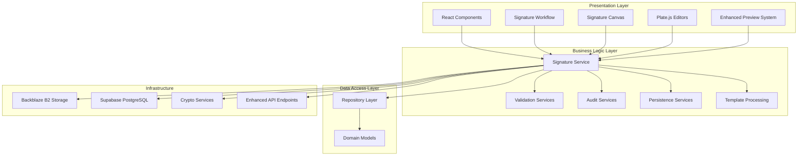

**Diagram sources**
- [service.ts:40-189](file://src/shared/assinatura-digital/service.ts#L40-L189)
- [repository.ts:38-352](file://src/shared/assinatura-digital/repository.ts#L38-L352)

The system follows a layered architecture pattern with clear separation of concerns:

- **Domain Layer**: Defines core business entities and validation schemas
- **Service Layer**: Implements business logic and workflow orchestration
- **Repository Layer**: Handles data persistence and database operations
- **Infrastructure Layer**: Manages external integrations and storage

**Section sources**
- [domain.ts:1-610](file://src/shared/assinatura-digital/domain.ts#L1-L610)
- [service.ts:40-189](file://src/shared/assinatura-digital/service.ts#L40-L189)

## Core Components

### Document-Based Signing Workflow

The document-based workflow enables administrators to upload PDF documents and invite multiple signers through unique public links. This workflow supports:

- **Multi-party signing**: Multiple signers can sign the same document
- **Custom branding**: Document-specific branding and styling
- **Flexible signer types**: Support for clients, parties, representatives, third parties, users, and guests
- **Anchor positioning**: Precise placement of signature and initials fields
- **Selfie requirements**: Optional biometric verification

### Template-Based Signing Workflow

The template-based workflow provides dynamic form generation with:

- **Dynamic forms**: JSON schema-driven form creation
- **Template management**: PDF and Markdown template support
- **Variable interpolation**: Mustache-based content generation
- **Form validation**: Comprehensive input validation
- **Preview functionality**: Real-time document preview

**Updated** The template system now uses Plate.js editors with enhanced variable handling and conversion utilities between Plate.js and TipTap JSON formats. The enhanced template processing supports partie contraria data resolution and dynamic action data injection.

### Enhanced Multi-Party Processing

**New** The system now supports sophisticated multi-party contract workflows with comprehensive partie contraria data management:

- **Parte Contrária Data Processing**: Structured handling of opposing party information including personal and corporate details
- **Action Data Integration**: Dynamic form data injection with comprehensive validation
- **Contract Relationship Management**: Sophisticated party relationship mapping and validation
- **Multi-Party Validation**: Advanced validation for complex contract scenarios

**Section sources**
- [domain.ts:303-362](file://src/shared/assinatura-digital/domain.ts#L303-L362)
- [signature.service.ts:1-175](file://src/shared/assinatura-digital/services/signature.service.ts#L1-L175)

## Architecture Overview

The digital signature system implements a microservices-like architecture within the Next.js application:

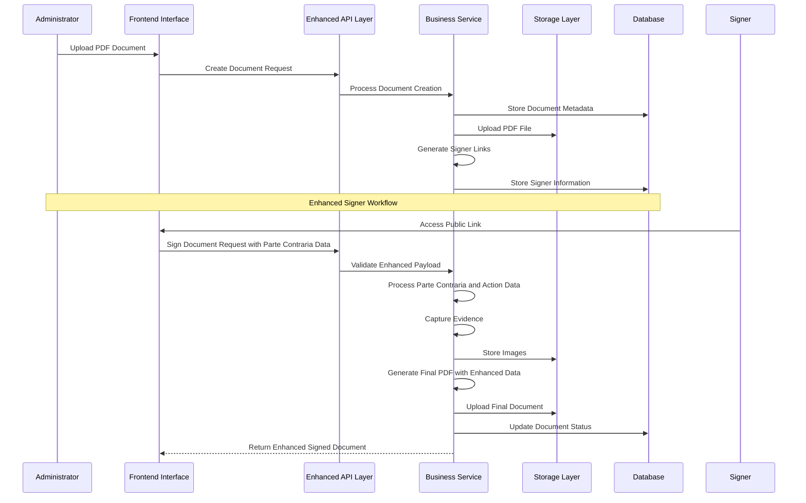

**Diagram sources**
- [finalization.service.ts:578-698](file://src/shared/assinatura-digital/services/signature/finalization.service.ts#L578-L698)
- [storage.service.ts:10-50](file://src/shared/assinatura-digital/services/storage.service.ts#L10-L50)

The architecture ensures scalability, maintainability, and compliance through:

- **Separation of concerns**: Clear boundaries between components
- **Asynchronous processing**: Background tasks for heavy operations
- **Transaction management**: Atomic operations for data consistency
- **Error handling**: Comprehensive failure recovery mechanisms
- **Enhanced Payload Processing**: Advanced validation and processing of partie contraria and action data

## Detailed Component Analysis

### Document Management System

The document management system handles PDF document lifecycle management:

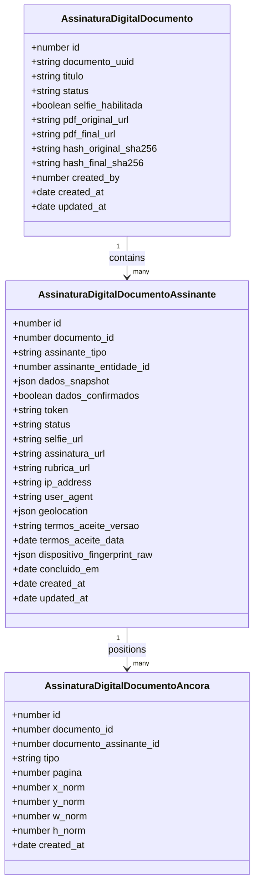

**Diagram sources**
- [domain.ts:303-362](file://src/shared/assinatura-digital/domain.ts#L303-L362)
- [domain.ts:318-356](file://src/shared/assinatura-digital/domain.ts#L318-L356)

### Enhanced Signature Processing Pipeline

**Updated** The signature processing pipeline now implements advanced validation and processing for partie contraria and action data:

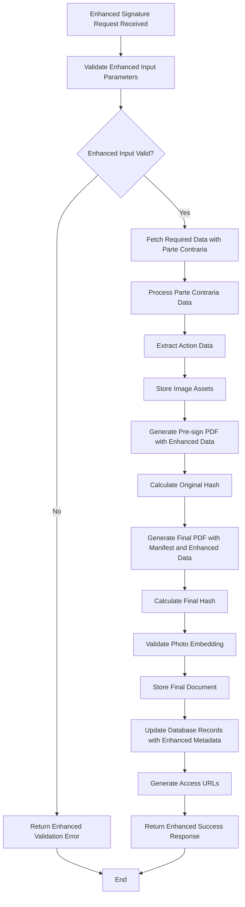

**Diagram sources**
- [finalization.service.ts:578-698](file://src/shared/assinatura-digital/services/signature/finalization.service.ts#L578-L698)
- [validation.service.ts:186-269](file://src/shared/assinatura-digital/services/signature/validation.service.ts#L186-L269)

### Security and Integrity Services

The integrity service implements cryptographic operations for document verification:

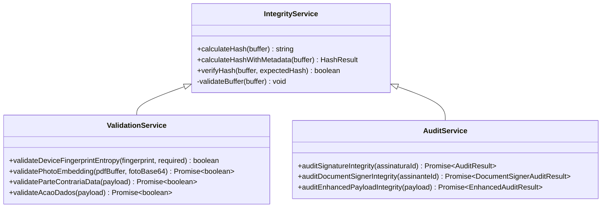

**Diagram sources**
- [integrity.service.ts:110-254](file://src/shared/assinatura-digital/services/integrity.service.ts#L110-L254)
- [validation.service.ts:60-269](file://src/shared/assinatura-digital/services/signature/validation.service.ts#L60-L269)
- [audit.service.ts:73-539](file://src/shared/assinatura-digital/services/signature/audit.service.ts#L73-L539)

**Section sources**
- [domain.ts:44-104](file://src/shared/assinatura-digital/domain.ts#L44-L104)
- [finalization.service.ts:578-698](file://src/shared/assinatura-digital/services/signature/finalization.service.ts#L578-L698)

### Database Schema Design

The database schema supports both signing workflows with comprehensive indexing and security policies:

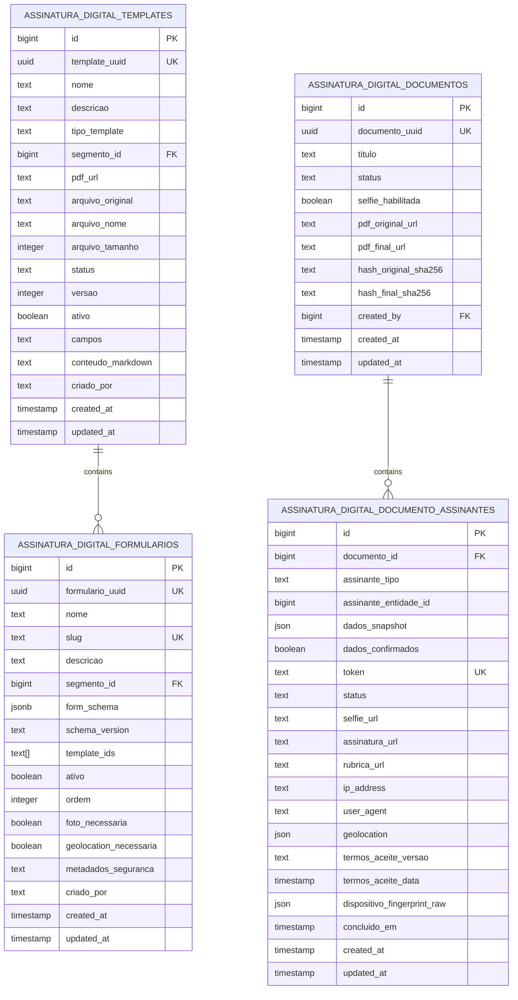

**Diagram sources**
- [25_assinatura_digital.sql:8-321](file://supabase/schemas/25_assinatura_digital.sql#L8-L321)
- [20260105160000_add_assinatura_digital_documentos_tables.sql:10-96](file://supabase/migrations/20260105160000_add_assinatura_digital_documentos_tables.sql#L10-L96)

**Section sources**
- [25_assinatura_digital.sql:1-321](file://supabase/schemas/25_assinatura_digital.sql#L1-L321)
- [20260105160000_add_assinatura_digital_documentos_tables.sql:1-164](file://supabase/migrations/20260105160000_add_assinatura_digital_documentos_tables.sql#L1-L164)

## Enhanced API Endpoints

**New** The system now features enhanced API endpoints with advanced payload processing capabilities for partie contraria and action data.

### Finalizar Endpoint Enhancement

The finalizar endpoint now supports comprehensive partie contraria and action data processing:

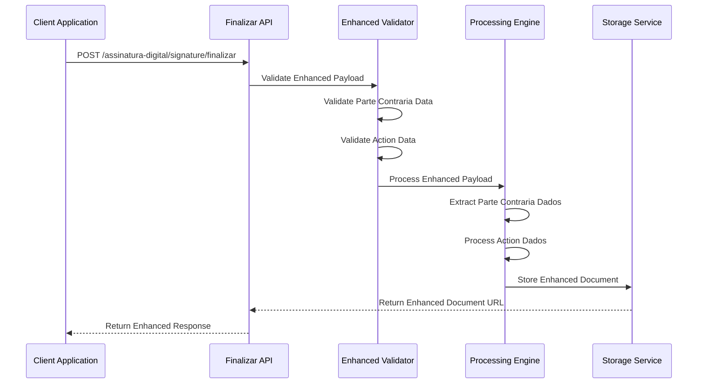

**Diagram sources**
- [route.ts:155-345](file://src/app/api/assinatura-digital/signature/finalizar/route.ts#L155-L345)

### Preview Endpoint Enhancement

The preview endpoint now supports partie contraria and action data for enhanced document preview:

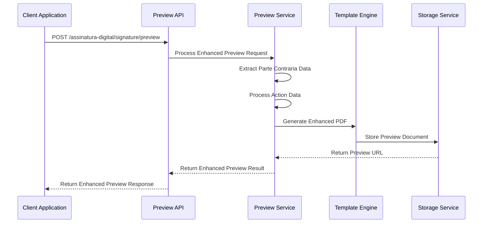

**Diagram sources**
- [route.ts:45-64](file://src/app/api/assinatura-digital/signature/preview/route.ts#L45-L64)

### Enhanced Payload Validation

The system now implements comprehensive payload validation for partie contraria and action data:

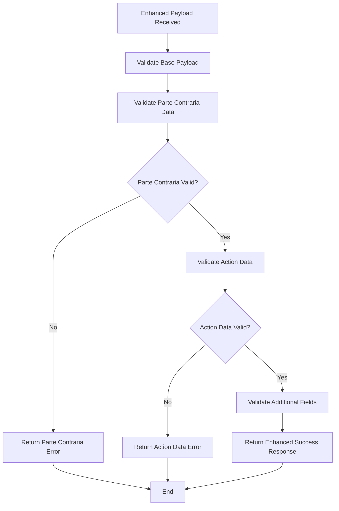

**Diagram sources**
- [api.ts:118-175](file://src/shared/assinatura-digital/types/api.ts#L118-L175)

**Section sources**
- [route.ts:1-345](file://src/app/api/assinatura-digital/signature/finalizar/route.ts#L1-L345)
- [route.ts:1-64](file://src/app/api/assinatura-digital/signature/preview/route.ts#L1-L64)
- [api.ts:83-175](file://src/shared/assinatura-digital/types/api.ts#L83-L175)

## Advanced Document Processing

**New** The system now features advanced document processing capabilities with partie contraria and action data integration.

### Enhanced Template Variable Resolution

The template processing system now supports sophisticated partie contraria and action data resolution:

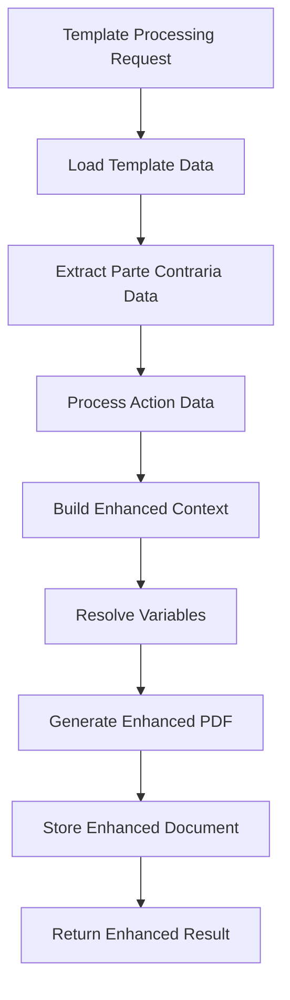

**Diagram sources**
- [template-pdf.service.ts:557-756](file://src/shared/assinatura-digital/services/template-pdf.service.ts#L557-L756)

### Parte Contraria Data Processing

The system implements comprehensive partie contraria data processing with validation and formatting:

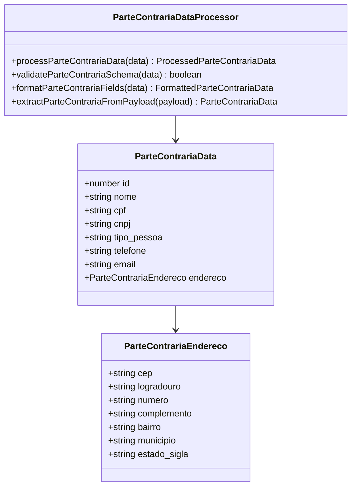

**Diagram sources**
- [api.ts:40-49](file://src/shared/assinatura-digital/types/api.ts#L40-L49)
- [api.ts:140-157](file://src/shared/assinatura-digital/types/api.ts#L140-L157)

### Action Data Integration

The system provides comprehensive action data integration with dynamic form processing:

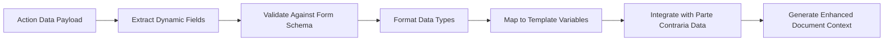

**Diagram sources**
- [api.ts:158](file://src/shared/assinatura-digital/types/api.ts#L158)
- [template-pdf.service.ts:701-705](file://src/shared/assinatura-digital/services/template-pdf.service.ts#L701-L705)

**Section sources**
- [template-pdf.service.ts:557-756](file://src/shared/assinatura-digital/services/template-pdf.service.ts#L557-L756)
- [api.ts:40-157](file://src/shared/assinatura-digital/types/api.ts#L40-L157)

## Editor Architecture Migration

**Updated** The digital signature system has undergone a significant architectural migration from TipTap to Plate.js for enhanced performance and maintainability.

### Plate.js Editor Components

The system now utilizes Plate.js v52 with a comprehensive plugin architecture:

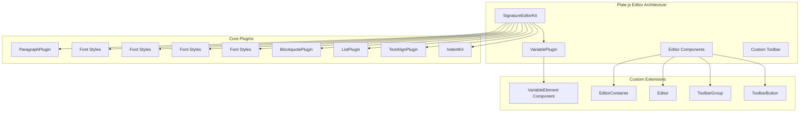

**Diagram sources**
- [RichTextEditor.tsx:66-100](file://src/app/(authenticated)/assinatura-digital/components/editor/RichTextEditor.tsx#L66-L100)
- [variable-plugin.tsx:38-46](file://src/components/editor/plate/variable-plugin.tsx#L38-L46)
- [editor.tsx:13-92](file://src/components/editor/plate-ui/editor.tsx#L13-L92)

### Variable Plugin System

The VariablePlugin provides inline variable insertion with visual representation:

```mermaid
classDiagram
class VariablePlugin {
+key : string
+node : VariableElementType
+component : VariableElementComponent
+isElement : true
+isInline : true
+isVoid : true
}
class VariableElementType {
+type : "variable"
+key : string
+children : [{ text : string }]
}
class VariableElementComponent {
+element : VariableElementType
+render() JSX.Element
+className : "inline-flex items-center rounded px-1.5 py-0.5 font-mono text-xs bg-violet-100 text-violet-700"
}
VariablePlugin --> VariableElementType
VariablePlugin --> VariableElementComponent
```

**Diagram sources**
- [variable-plugin.tsx:10-16](file://src/components/editor/plate/variable-plugin.tsx#L10-L16)
- [variable-plugin.tsx:18-35](file://src/components/editor/plate/variable-plugin.tsx#L18-L35)

### Conversion Utilities

The system maintains compatibility between Plate.js and TipTap JSON formats:

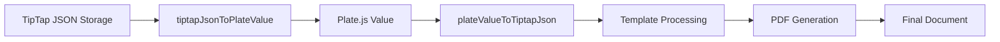

**Diagram sources**
- [editor-helpers.ts:342-355](file://src/app/(authenticated)/assinatura-digital/components/editor/editor-helpers.ts#L342-L355)

### Template Processing with Plate.js

The template processing system now works with Plate.js value structures:

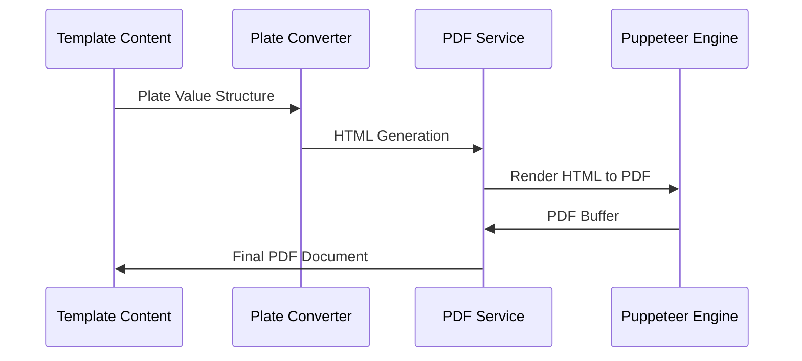

**Diagram sources**
- [template-texto-pdf.service.ts:103-233](file://src/shared/assinatura-digital/services/template-texto-pdf.service.ts#L103-L233)

**Section sources**
- [RichTextEditor.tsx:1-306](file://src/app/(authenticated)/assinatura-digital/components/editor/RichTextEditor.tsx#L1-L306)
- [editor-helpers.ts:227-355](file://src/app/(authenticated)/assinatura-digital/components/editor/editor-helpers.ts#L227-L355)
- [variable-plugin.tsx:1-56](file://src/components/editor/plate/variable-plugin.tsx#L1-L56)
- [template-texto-pdf.service.ts:1-332](file://src/shared/assinatura-digital/services/template-texto-pdf.service.ts#L1-L332)

## Enhanced Security and Compliance

### Legal Compliance Framework

The system adheres to MP 2.200-2/2001 requirements for Advanced Electronic Signatures with enhanced partie contraria and action data processing:

#### Four Essential Requirements Implementation

1. **Unambiguous Association (Alínea a)**: Device fingerprinting with minimum 6 identifying attributes
2. **Inequivocal Identification (Alínea b)**: Biometric selfie capture plus personal data validation
3. **Exclusive Control (Alínea c)**: Real-time capture via webcam/canvas, no file uploads allowed
4. **Document Linkage (Alínea d)**: SHA-256 hashing with immutable document structure

**Updated** Enhanced compliance with partie contraria data processing:
- **Parte Contraria Verification**: Comprehensive validation of opposing party identity
- **Action Data Integrity**: Secure processing and validation of dynamic form data
- **Multi-Party Compliance**: Extended compliance requirements for complex contract scenarios

### Security Measures

#### Cryptographic Implementation
- SHA-256 hashing for document integrity verification
- Timing-safe hash comparison to prevent timing attacks
- Secure random token generation for public links
- Encrypted storage of sensitive biometric data
- **Enhanced Payload Encryption**: Secure processing of partie contraria and action data

#### Access Control
- Row-level security policies for data isolation
- Role-based access control for administrative functions
- Token-based authentication for public signing links
- Session management with expiration controls
- **Enhanced Data Validation**: Comprehensive validation of partie contraria and action data

#### Audit and Monitoring
- Comprehensive logging of all signature operations
- Real-time monitoring of security events
- Automated compliance reporting
- Forensic audit trail maintenance
- **Enhanced Payload Auditing**: Detailed tracking of partie contraria and action data processing

### Data Protection

#### Privacy Controls
- Minimal data collection principle
- Data retention policies with automatic cleanup
- Right to erasure implementation
- Consent management for biometric data
- **Enhanced Data Minimization**: Strict validation and processing of partie contraria data

#### Data Integrity
- Immutable document structure through PDF flattening
- Cryptographic verification of document modifications
- Chain of custody documentation
- Tamper-evident storage mechanisms
- **Enhanced Data Validation**: Comprehensive validation of all processed data

**Section sources**
- [conformidade-legal.md](file://src/app/(authenticated)/assinatura-digital/docs/conformidade-legal.md#L1-L233)
- [validation.service.ts:60-150](file://src/shared/assinatura-digital/services/signature/validation.service.ts#L60-L150)

## Integration Examples

### Document Preparation Integration

The system integrates seamlessly with document management workflows:

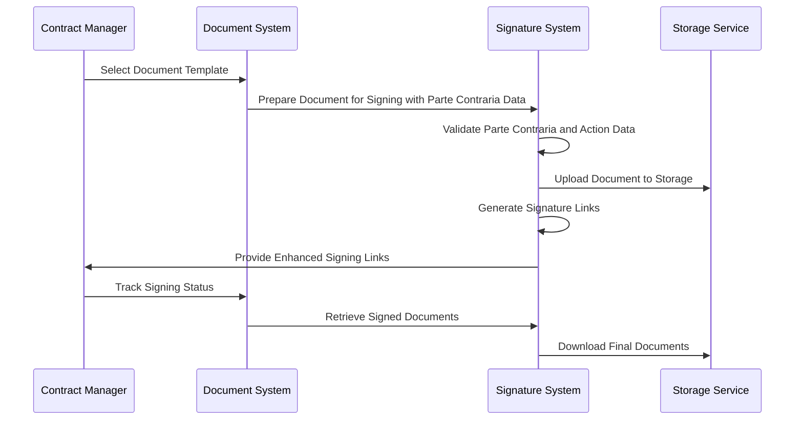

**Diagram sources**
- [FEATURE-README.md](file://src/app/(authenticated)/assinatura-digital/docs/FEATURE-README.md#L38-L110)

### Enhanced Multi-Party Signing Configuration

**New** The system now supports complex multi-signer scenarios with partie contraria and action data:

#### Basic Multi-Signer Setup
- Define signer roles and permissions
- Configure anchor positions for each signer
- Set approval workflows and routing
- Establish notification preferences

#### Advanced Configuration Options
- Conditional signing based on document clauses
- Hierarchical approval chains
- Proxy signing authorization
- Batch processing capabilities
- **Parte Contraria Data Management**: Sophisticated handling of opposing party information
- **Action Data Integration**: Dynamic form data processing and validation

### Custom Branding Implementation

The system provides extensive branding customization:

#### Visual Branding Elements
- Logo integration in document headers
- Color scheme customization
- Font selection and typography
- Layout template configuration

#### Functional Branding Features
- Custom field labels and placeholders
- Brand-specific validation rules
- Custom notification templates
- White-label distribution options

### Enhanced Notification System Configuration

**Updated** The notification system now supports partie contraria and action data:

#### Automated Notifications
- Email notifications for signing requests
- SMS alerts for reminder functionality
- In-app notifications for status updates
- Webhook integration for external systems
- **Enhanced Party Notifications**: Notifications specific to partie contraria and action data

#### Custom Notification Templates
- Brand-specific email templates
- Custom SMS message formats
- Dynamic content based on document type
- Multi-language support
- **Action Data Notifications**: Dynamic notifications based on processed action data

**Section sources**
- [FEATURE-README.md](file://src/app/(authenticated)/assinatura-digital/docs/FEATURE-README.md#L348-L517)

## Troubleshooting Guide

### Common Issues and Solutions

#### Document Upload Failures
**Symptoms**: Upload errors, timeout issues, corrupted files
**Causes**: Network connectivity, file size limits, unsupported formats
**Solutions**: 
- Verify file format compatibility (PDF, JPG, PNG)
- Check file size limitations (max 50MB)
- Ensure stable network connection
- Retry upload during off-peak hours

#### Enhanced Signature Processing Errors
**Updated** New troubleshooting considerations for enhanced partie contraria and action data processing:

**Symptoms**: Failed signature validation, hash mismatches, partie contraria data errors
**Causes**: Corrupted PDF files, missing evidence, processing timeouts, invalid partie contraria data
**Solutions**:
- Verify PDF integrity before processing
- Check that all required evidence is captured
- Monitor system resources during processing
- Review audit logs for specific error details
- Validate partie contraria data format and completeness
- Ensure action data matches form schema requirements

#### Storage Access Issues
**Symptoms**: Unable to download signed documents, storage quota exceeded
**Causes**: Permission issues, storage limits, network connectivity
**Solutions**:
- Verify storage permissions and quotas
- Check network connectivity to storage provider
- Monitor storage usage and cleanup old files
- Implement storage tiering for large volumes

#### Enhanced Editor Issues
**Updated** New troubleshooting considerations for Plate.js migration:

**Symptoms**: Editor not rendering, plugin conflicts, conversion errors, partie contraria data processing failures
**Causes**: Plugin configuration issues, value format mismatches, memory leaks, invalid payload data
**Solutions**:
- Verify Plate.js plugin initialization order
- Check value format compatibility between Plate.js and TipTap
- Monitor memory usage for large documents
- Validate partie contraria and action data payload structure
- Review enhanced API endpoint validation logs

### Diagnostic Tools

#### Enhanced Audit Trail Analysis
**Updated** The system now provides comprehensive audit capabilities for enhanced data processing:

The system provides comprehensive audit capabilities:
- Transaction logging with timestamps
- Evidence chain verification
- Compliance report generation
- Forensic analysis tools
- **Enhanced Payload Auditing**: Detailed tracking of partie contraria and action data processing

#### Performance Monitoring
Key metrics to monitor:
- Processing time per document
- Storage utilization trends
- Error rate statistics
- User engagement analytics
- **Enhanced Data Processing Metrics**: Performance tracking for partie contraria and action data

#### Debug Mode Operations
- Enable verbose logging for development
- Simulate various error scenarios
- Test edge cases and boundary conditions
- Validate compliance requirements
- **Enhanced Payload Testing**: Comprehensive testing of partie contraria and action data processing

**Section sources**
- [audit.service.ts:73-314](file://src/shared/assinatura-digital/services/signature/audit.service.ts#L73-L314)
- [integrity.service.ts:110-254](file://src/shared/assinatura-digital/services/integrity.service.ts#L110-L254)

## Conclusion

The Digital Signature Workflows module provides a comprehensive, legally compliant solution for electronic document signing within the ZattarOS ecosystem. The system successfully balances functionality, security, and compliance while maintaining high performance and scalability.

**Updated** The recent enhancement introduces advanced partie contraria and action data processing capabilities, representing a significant advancement in system functionality and complexity. The enhancement maintains all existing functionality while providing:

### Key Achievements

**Legal Compliance**: Full adherence to MP 2.200-2/2001 requirements with comprehensive evidence collection and audit capabilities, now extended to support complex multi-party workflows.

**Enhanced Technical Excellence**: Robust architecture supporting both document-based and template-based signing workflows with multi-party capabilities. The Plate.js migration enhances performance and reduces dependency conflicts, while the new partie contraria and action data processing capabilities enable sophisticated contract management scenarios.

**Advanced Security Implementation**: Enhanced cryptographic measures, secure storage, and comprehensive access controls ensuring data protection and privacy, with specialized validation for partie contraria and action data.

**Seamless Integration Capabilities**: Seamless integration with document management systems, notification platforms, and external compliance frameworks, now supporting complex multi-party contract workflows.

**Enhanced Editor Architecture**: Modern Plate.js-based editors with improved performance, better maintainability, and comprehensive plugin ecosystem, supporting advanced template processing with partie contraria data.

**Sophisticated Multi-Party Processing**: Advanced partie contraria data management and action data integration enabling complex contract scenarios with comprehensive party relationship management.

### Future Enhancements

The system is designed for continuous improvement with planned enhancements including enhanced notification systems, bulk processing capabilities, expanded integration options, and advanced partie contraria data analytics. The modular architecture ensures smooth evolution while maintaining backward compatibility and system stability.

The partie contraria and action data processing enhancements demonstrate best practices in extending legacy systems with advanced functionality while preserving legal validity and document integrity. The implementation showcases how strategic technology upgrades can significantly improve system capabilities and developer experience while maintaining the highest standards for legal compliance and multi-party contract management.