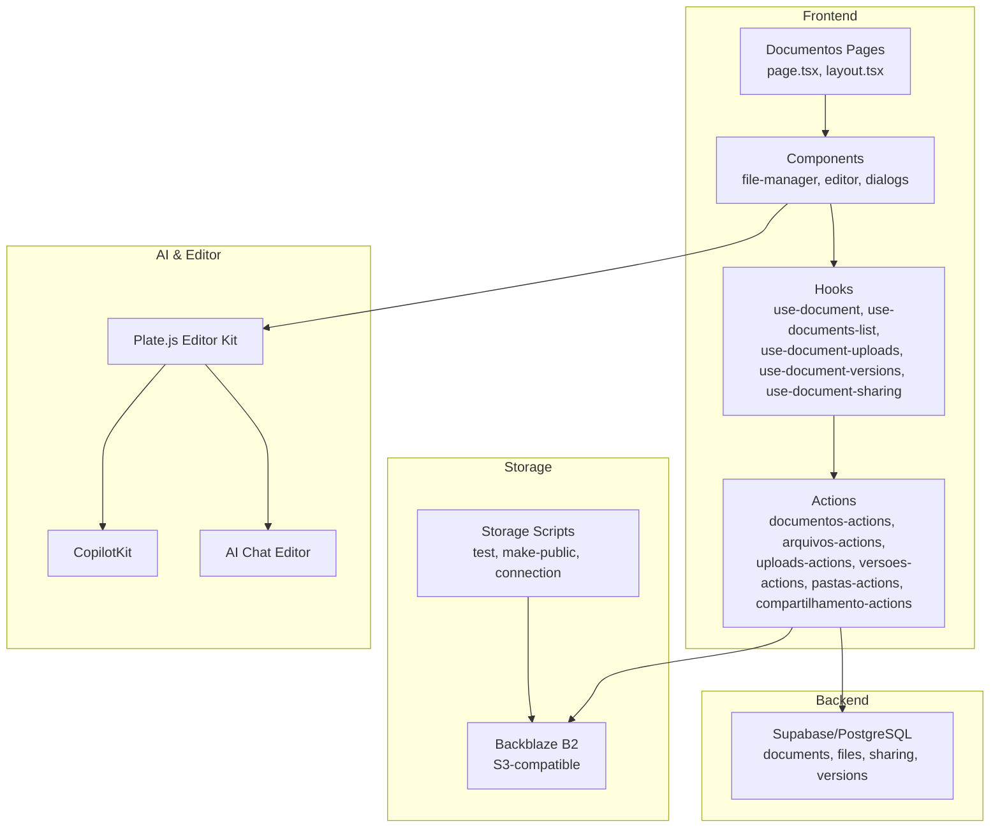
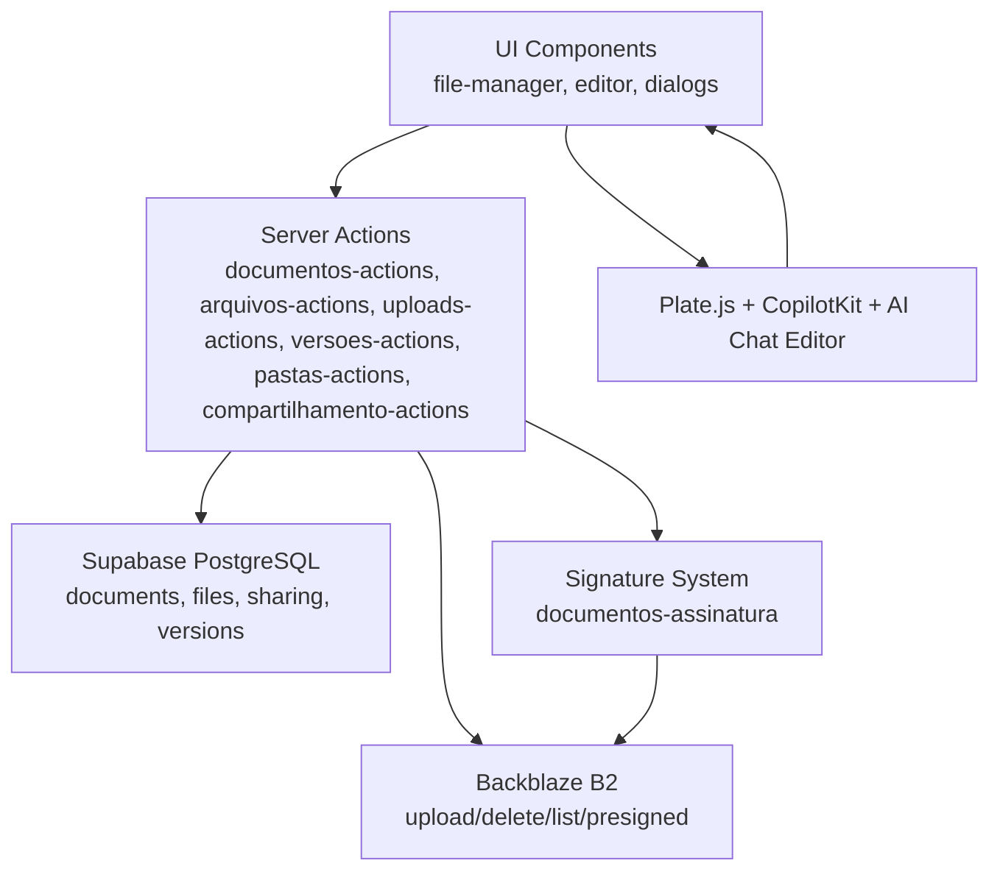
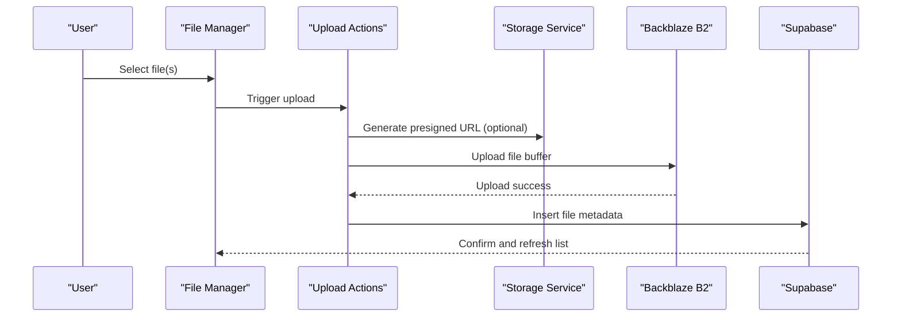
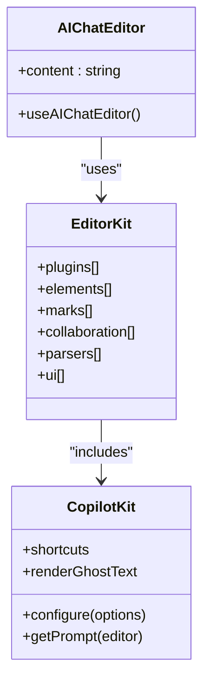
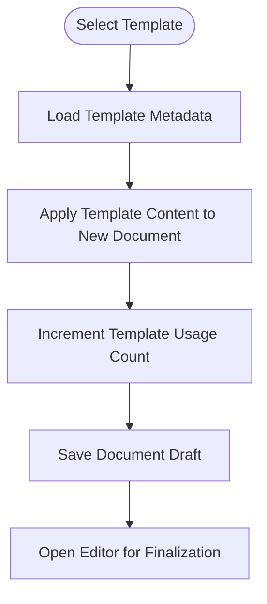
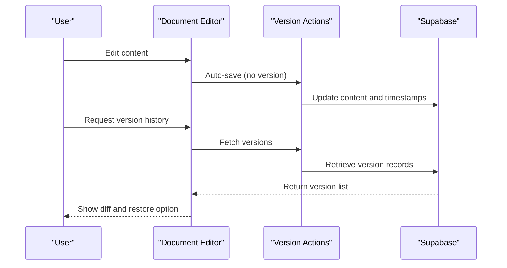
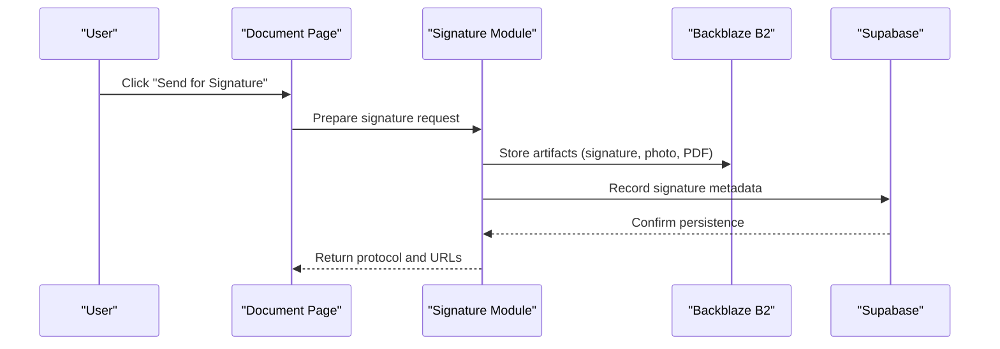
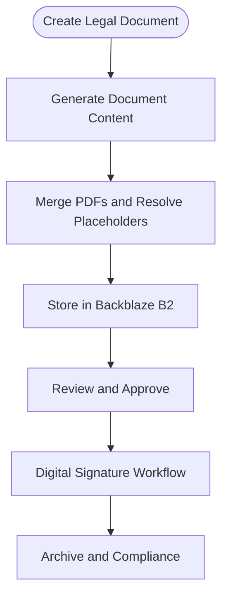
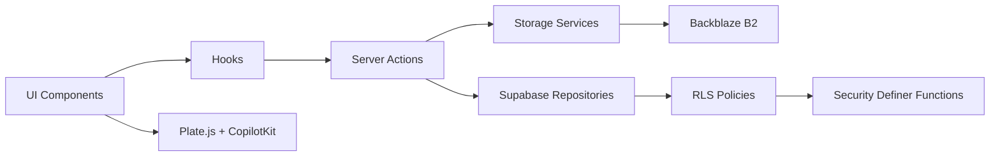

# Document Management and AI Editor

<cite>
**Referenced Files in This Document**
- [b2-upload.service.ts](file://src/app/(authenticated)/documentos/services/b2-upload.service.ts)
- [backblaze-b2.service.ts](file://src/lib/storage/backblaze-b2.service.ts)
- [editor-kit.tsx](file://src/components/editor/plate/editor-kit.tsx)
- [copilot-kit.tsx](file://src/components/editor/plate/copilot-kit.tsx)
- [ai-chat-editor.tsx](file://src/components/editor/plate-ui/ai-chat-editor.tsx)
- [documentos.service.test.ts](file://src/app/(authenticated)/documentos/__tests__/unit/documentos.service.test.ts)
- [compartilhamento.service.test.ts](file://src/app/(authenticated)/documentos/__tests__/unit/compartilhamento.service.test.ts)
- [documentos-actions.ts](file://src/app/(authenticated)/documentos/actions/documentos-actions.ts)
- [arquivos-actions.ts](file://src/app/(authenticated)/documentos/actions/arquivos-actions.ts)
- [uploads-actions.ts](file://src/app/(authenticated)/documentos/actions/uploads-actions.ts)
- [versoes-actions.ts](file://src/app/(authenticated)/documentos/actions/versoes-actions.ts)
- [pastas-actions.ts](file://src/app/(authenticated)/documentos/actions/pastas-actions.ts)
- [compartilhamento-actions.ts](file://src/app/(authenticated)/documentos/actions/compartilhamento-actions.ts)
- [documentos.page.tsx](file://src/app/(authenticated)/documentos/page.tsx)
- [documentos.layout.tsx](file://src/app/(authenticated)/documentos/layout.tsx)
- [documentos.repository.ts](file://src/app/(authenticated)/documentos/repository.ts)
- [documentos.domain.ts](file://src/app/(authenticated)/documentos/domain.ts)
- [documentos.utils.ts](file://src/app/(authenticated)/documentos/utils.ts)
- [documentos.hooks.ts](file://src/app/(authenticated)/documentos/hooks/use-document.ts)
- [documentos.hooks.use-documents-list.ts](file://src/app/(authenticated)/documentos/hooks/use-documents-list.ts)
- [documentos.hooks.use-document-uploads.ts](file://src/app/(authenticated)/documentos/hooks/use-document-uploads.ts)
- [documentos.hooks.use-document-versions.ts](file://src/app/(authenticated)/documentos/hooks/use-document-versions.ts)
- [documentos.hooks.use-document-sharing.ts](file://src/app/(authenticated)/documentos/hooks/use-document-sharing.ts)
- [documentos.components.file-manager.tsx](file://src/app/(authenticated)/documentos/components/file-manager.tsx)
- [documentos.components.document-editor.tsx](file://src/app/(authenticated)/documentos/components/document-editor.tsx)
- [documentos.components.document-list.tsx](file://src/app/(authenticated)/documentos/components/document-list.tsx)
- [documentos.components.document-table.tsx](file://src/app/(authenticated)/documentos/components/document-table.tsx)
- [documentos.components.version-history-dialog.tsx](file://src/app/(authenticated)/documentos/components/version-history-dialog.tsx)
- [documentos.components.share-document-dialog.tsx](file://src/app/(authenticated)/documentos/components/share-document-dialog.tsx)
- [documentos.components.upload-dialog.tsx](file://src/app/(authenticated)/documentos/components/upload-dialog.tsx)
- [documentos.components.create-document-dialog.tsx](file://src/app/(authenticated)/documentos/components/create-document-dialog.tsx)
- [documentos.components.template-library-dialog.tsx](file://src/app/(authenticated)/documentos/components/template-library-dialog.tsx)
- [documentos.components.template-card.tsx](file://src/app/(authenticated)/documentos/components/template-card.tsx)
- [documentos.components.document-card.tsx](file://src/app/(authenticated)/documentos/components/document-card.tsx)
- [documentos.components.collaborators-avatars.tsx](file://src/app/(authenticated)/documentos/components/collaborators-avatars.tsx)
- [documentos.components.remote-cursors-overlay.tsx](file://src/app/(authenticated)/documentos/components/remote-cursors-overlay.tsx)
- [documentos.components.document-chat.tsx](file://src/app/(authenticated)/documentos/components/document-chat.tsx)
- [documentos.components.document-detail-dialog.tsx](file://src/app/(authenticated)/documentos/components/document-detail-dialog.tsx)
- [documentos.components.documentos-filter-bar.tsx](file://src/app/(authenticated)/documentos/components/documentos-filter-bar.tsx)
- [documentos.components.documentos-glass-cards.tsx](file://src/app/(authenticated)/documentos/components/documentos-glass-cards.tsx)
- [documentos.components.documentos-glass-list.tsx](file://src/app/(authenticated)/documentos/components/documentos-glass-list.tsx)
- [documentos.components.documentos-kpi-strip.tsx](file://src/app/(authenticated)/documentos/components/documentos-kpi-strip.tsx)
- [documentos.components.command-menu.tsx](file://src/app/(authenticated)/documentos/components/command-menu.tsx)
- [documentos.components.folder-tree.tsx](file://src/app/(authenticated)/documentos/components/folder-tree.tsx)
- [documentos.components.upload-dialog-unified.tsx](file://src/app/(authenticated)/documentos/components/upload-dialog-unified.tsx)
- [documentos.lixeira.page.tsx](file://src/app/(authenticated)/documentos/lixeira/page.tsx)
- [documentos.lixeira.page-client.tsx](file://src/app/(authenticated)/documentos/lixeira/page-client.tsx)
- [documentos.spec.md](file://openspec/specs/documentos-editor/spec.md)
- [assinatura-digital.arquitetura-conceitual.md](file://src/app/(authenticated)/assinatura-digital/docs/arquitetura-conceitual.md)
- [assinatura-digital.spec.md](file://openspec/specs/assinatura-digital-assinatura/spec.md)
- [assinatura-digital.audit.service.ts](file://src/shared/assinatura-digital/services/signature/audit.service.ts)
- [assinatura-digital.documentos.doc.tsx](file://src/app/(authenticated)/ajuda/content/assinatura-digital/documentos.tsx)
- [pecas-juridicas.gerar-peca-actions.ts](file://src/app/(authenticated)/pecas-juridicas/actions/gerar-peca-actions.ts)
- [supabase.rls.fix_rls_circular_dependency.sql](file://supabase/migrations/20251221180000_fix_rls_circular_dependency.sql)
- [supabase.documentos.system.sql](file://supabase/migrations/20251221160000_create_documentos_system.sql)
- [supabase.arquivos.table.sql](file://supabase/migrations/20251221180000_create_arquivos_table.sql)
- [supabase.assinatura_digital_documentos.tables.sql](file://supabase/migrations/20260105150000_add_assinatura_digital_documentos_tables.sql)
- [scripts.storage.index.ts](file://scripts/storage/index.ts)
- [scripts.storage.test-backblaze-connection.ts](file://scripts/storage/test-backblaze-connection.ts)
- [scripts.storage.make-bucket-public.ts](file://scripts/storage/make-bucket-public.ts)
- [scripts.storage.test-n8n-upload.ts](file://scripts/storage/test-n8n-upload.ts)
- [.kiro.steering.create-rls-policies.md](file://.kiro/steering/create-rls-policies.md)
</cite>

## Table of Contents
1. [Introduction](#introduction)
2. [Project Structure](#project-structure)
3. [Core Components](#core-components)
4. [Architecture Overview](#architecture-overview)
5. [Detailed Component Analysis](#detailed-component-analysis)
6. [Dependency Analysis](#dependency-analysis)
7. [Performance Considerations](#performance-considerations)
8. [Troubleshooting Guide](#troubleshooting-guide)
9. [Conclusion](#conclusion)
10. [Appendices](#appendices)

## Introduction
This document describes the Document Management and AI Editor systems, focusing on:
- Document processing pipeline and lifecycle (upload, storage, indexing, collaboration)
- AI-assisted editing using Plate.js and CopilotKit
- Template system for document generation and reuse
- Storage integration with Backblaze B2 (S3-compatible)
- Version control and sharing workflows
- Signature system integration and digital document workflows
- Compliance and security controls (access control, retention, audit)
- Practical examples of document creation, editing, review, and approval processes
- Relationship to contract workflows and legal processes

## Project Structure
The document management system is organized around:
- Frontend pages and components under the authenticated area
- Actions for server-side mutations
- Services for storage and editor integration
- Supabase database schema supporting documents, files, sharing, and versions
- Open specifications and architecture docs for signature and editor systems

**Diagram sources**
- [documentos.page.tsx](file://src/app/(authenticated)/documentos/page.tsx#L1-L42)
- [documentos.layout.tsx](file://src/app/(authenticated)/documentos/layout.tsx)
- [documentos.actions.documentos-actions.ts](file://src/app/(authenticated)/documentos/actions/documentos-actions.ts)
- [documentos.actions.arquivos-actions.ts](file://src/app/(authenticated)/documentos/actions/arquivos-actions.ts)
- [documentos.actions.uploads-actions.ts](file://src/app/(authenticated)/documentos/actions/uploads-actions.ts)
- [documentos.actions.versoes-actions.ts](file://src/app/(authenticated)/documentos/actions/versoes-actions.ts)
- [documentos.actions.pastas-actions.ts](file://src/app/(authenticated)/documentos/actions/pastas-actions.ts)
- [documentos.actions.compartilhamento-actions.ts](file://src/app/(authenticated)/documentos/actions/compartilhamento-actions.ts)
- [b2-upload.service.ts](file://src/app/(authenticated)/documentos/services/b2-upload.service.ts#L1-L227)
- [backblaze-b2.service.ts:1-271](file://src/lib/storage/backblaze-b2.service.ts#L1-L271)
- [editor-kit.tsx:1-96](file://src/components/editor/plate/editor-kit.tsx#L1-L96)
- [copilot-kit.tsx:1-75](file://src/components/editor/plate/copilot-kit.tsx#L1-L75)
- [ai-chat-editor.tsx:1-24](file://src/components/editor/plate-ui/ai-chat-editor.tsx#L1-L24)
- [supabase.documentos.system.sql](file://supabase/migrations/20251221160000_create_documentos_system.sql)
- [supabase.arquivos.table.sql](file://supabase/migrations/20251221180000_create_arquivos_table.sql)

**Section sources**
- [documentos.page.tsx](file://src/app/(authenticated)/documentos/page.tsx#L1-L42)
- [documentos.layout.tsx](file://src/app/(authenticated)/documentos/layout.tsx)
- [b2-upload.service.ts](file://src/app/(authenticated)/documentos/services/b2-upload.service.ts#L1-L227)
- [backblaze-b2.service.ts:1-271](file://src/lib/storage/backblaze-b2.service.ts#L1-L271)
- [editor-kit.tsx:1-96](file://src/components/editor/plate/editor-kit.tsx#L1-L96)
- [copilot-kit.tsx:1-75](file://src/components/editor/plate/copilot-kit.tsx#L1-L75)
- [ai-chat-editor.tsx:1-24](file://src/components/editor/plate-ui/ai-chat-editor.tsx#L1-L24)
- [supabase.documentos.system.sql](file://supabase/migrations/20251221160000_create_documentos_system.sql)
- [supabase.arquivos.table.sql](file://supabase/migrations/20251221180000_create_arquivos_table.sql)

## Core Components
- Document management UI: file manager, document editor, list/table views, filters, and KPIs
- Storage services: Backblaze B2 upload/delete/list and presigned URL generation
- AI editor: Plate.js with CopilotKit for AI-assisted writing and AI Chat Editor for collaborative editing
- Actions: server-side mutations for CRUD, uploads, versioning, sharing, and folders
- Domain and repository: typed domain entities and repository patterns for data access
- Security: Row Level Security (RLS) policies and helper functions to prevent circular dependencies

**Section sources**
- [documentos.components.file-manager.tsx](file://src/app/(authenticated)/documentos/components/file-manager.tsx)
- [documentos.components.document-editor.tsx](file://src/app/(authenticated)/documentos/components/document-editor.tsx)
- [documentos.components.document-list.tsx](file://src/app/(authenticated)/documentos/components/document-list.tsx)
- [documentos.components.document-table.tsx](file://src/app/(authenticated)/documentos/components/document-table.tsx)
- [documentos.components.version-history-dialog.tsx](file://src/app/(authenticated)/documentos/components/version-history-dialog.tsx)
- [documentos.components.share-document-dialog.tsx](file://src/app/(authenticated)/documentos/components/share-document-dialog.tsx)
- [documentos.components.upload-dialog.tsx](file://src/app/(authenticated)/documentos/components/upload-dialog.tsx)
- [documentos.components.create-document-dialog.tsx](file://src/app/(authenticated)/documentos/components/create-document-dialog.tsx)
- [documentos.components.template-library-dialog.tsx](file://src/app/(authenticated)/documentos/components/template-library-dialog.tsx)
- [documentos.components.template-card.tsx](file://src/app/(authenticated)/documentos/components/template-card.tsx)
- [documentos.components.document-card.tsx](file://src/app/(authenticated)/documentos/components/document-card.tsx)
- [documentos.components.collaborators-avatars.tsx](file://src/app/(authenticated)/documentos/components/collaborators-avatars.tsx)
- [documentos.components.remote-cursors-overlay.tsx](file://src/app/(authenticated)/documentos/components/remote-cursors-overlay.tsx)
- [documentos.components.document-chat.tsx](file://src/app/(authenticated)/documentos/components/document-chat.tsx)
- [documentos.components.document-detail-dialog.tsx](file://src/app/(authenticated)/documentos/components/document-detail-dialog.tsx)
- [documentos.components.documentos-filter-bar.tsx](file://src/app/(authenticated)/documentos/components/documentos-filter-bar.tsx)
- [documentos.components.documentos-glass-cards.tsx](file://src/app/(authenticated)/documentos/components/documentos-glass-cards.tsx)
- [documentos.components.documentos-glass-list.tsx](file://src/app/(authenticated)/documentos/components/documentos-glass-list.tsx)
- [documentos.components.documentos-kpi-strip.tsx](file://src/app/(authenticated)/documentos/components/documentos-kpi-strip.tsx)
- [documentos.components.command-menu.tsx](file://src/app/(authenticated)/documentos/components/command-menu.tsx)
- [documentos.components.folder-tree.tsx](file://src/app/(authenticated)/documentos/components/folder-tree.tsx)
- [documentos.components.upload-dialog-unified.tsx](file://src/app/(authenticated)/documentos/components/upload-dialog-unified.tsx)
- [b2-upload.service.ts](file://src/app/(authenticated)/documentos/services/b2-upload.service.ts#L1-L227)
- [backblaze-b2.service.ts:1-271](file://src/lib/storage/backblaze-b2.service.ts#L1-L271)
- [editor-kit.tsx:1-96](file://src/components/editor/plate/editor-kit.tsx#L1-L96)
- [copilot-kit.tsx:1-75](file://src/components/editor/plate/copilot-kit.tsx#L1-L75)
- [ai-chat-editor.tsx:1-24](file://src/components/editor/plate-ui/ai-chat-editor.tsx#L1-L24)
- [documentos.actions.documentos-actions.ts](file://src/app/(authenticated)/documentos/actions/documentos-actions.ts)
- [documentos.actions.arquivos-actions.ts](file://src/app/(authenticated)/documentos/actions/arquivos-actions.ts)
- [documentos.actions.uploads-actions.ts](file://src/app/(authenticated)/documentos/actions/uploads-actions.ts)
- [documentos.actions.versoes-actions.ts](file://src/app/(authenticated)/documentos/actions/versoes-actions.ts)
- [documentos.actions.pastas-actions.ts](file://src/app/(authenticated)/documentos/actions/pastas-actions.ts)
- [documentos.actions.compartilhamento-actions.ts](file://src/app/(authenticated)/documentos/actions/compartilhamento-actions.ts)
- [documentos.domain.ts](file://src/app/(authenticated)/documentos/domain.ts)
- [documentos.repository.ts](file://src/app/(authenticated)/documentos/repository.ts)
- [supabase.documentos.system.sql](file://supabase/migrations/20251221160000_create_documentos_system.sql)
- [supabase.arquivos.table.sql](file://supabase/migrations/20251221180000_create_arquivos_table.sql)

## Architecture Overview
The system integrates:
- Frontend pages and components for document management
- Actions orchestrating server-side operations
- Storage via Backblaze B2 (S3-compatible)
- AI editing powered by Plate.js, CopilotKit, and AI Chat Editor
- Supabase for relational data, RLS, and triggers
- Signature system for digital document workflows

**Diagram sources**
- [documentos.page.tsx](file://src/app/(authenticated)/documentos/page.tsx#L1-L42)
- [documentos.actions.documentos-actions.ts](file://src/app/(authenticated)/documentos/actions/documentos-actions.ts)
- [documentos.actions.arquivos-actions.ts](file://src/app/(authenticated)/documentos/actions/arquivos-actions.ts)
- [documentos.actions.uploads-actions.ts](file://src/app/(authenticated)/documentos/actions/uploads-actions.ts)
- [documentos.actions.versoes-actions.ts](file://src/app/(authenticated)/documentos/actions/versoes-actions.ts)
- [documentos.actions.pastas-actions.ts](file://src/app/(authenticated)/documentos/actions/pastas-actions.ts)
- [documentos.actions.compartilhamento-actions.ts](file://src/app/(authenticated)/documentos/actions/compartilhamento-actions.ts)
- [b2-upload.service.ts](file://src/app/(authenticated)/documentos/services/b2-upload.service.ts#L1-L227)
- [backblaze-b2.service.ts:1-271](file://src/lib/storage/backblaze-b2.service.ts#L1-L271)
- [editor-kit.tsx:1-96](file://src/components/editor/plate/editor-kit.tsx#L1-L96)
- [copilot-kit.tsx:1-75](file://src/components/editor/plate/copilot-kit.tsx#L1-L75)
- [ai-chat-editor.tsx:1-24](file://src/components/editor/plate-ui/ai-chat-editor.tsx#L1-L24)
- [supabase.documentos.system.sql](file://supabase/migrations/20251221160000_create_documentos_system.sql)
- [supabase.arquivos.table.sql](file://supabase/migrations/20251221180000_create_arquivos_table.sql)
- [assinatura-digital.arquitetura-conceitual.md](file://src/app/(authenticated)/assinatura-digital/docs/arquitetura-conceitual.md#L1-L800)

## Detailed Component Analysis

### Document Management Pipeline
- Upload: client-side selection, optional presigned URL generation, buffer upload to B2, record metadata in Supabase
- Storage: Backblaze B2 with S3-compatible API; public URLs or presigned URLs for private access
- Indexing: searchable content via Supabase and embeddings (integration points)
- Collaboration: real-time cursors, comments, suggestions, and shared access
- Versioning: version history dialog and server-side version actions
- Sharing: share dialog with granular permissions and revocation
- Templates: template library and creation dialogs for reusable document structures

**Diagram sources**
- [documentos.actions.uploads-actions.ts](file://src/app/(authenticated)/documentos/actions/uploads-actions.ts)
- [b2-upload.service.ts](file://src/app/(authenticated)/documentos/services/b2-upload.service.ts#L146-L184)
- [backblaze-b2.service.ts:242-271](file://src/lib/storage/backblaze-b2.service.ts#L242-L271)
- [supabase.arquivos.table.sql](file://supabase/migrations/20251221180000_create_arquivos_table.sql)

**Section sources**
- [documentos.actions.uploads-actions.ts](file://src/app/(authenticated)/documentos/actions/uploads-actions.ts)
- [documentos.actions.arquivos-actions.ts](file://src/app/(authenticated)/documentos/actions/arquivos-actions.ts)
- [b2-upload.service.ts](file://src/app/(authenticated)/documentos/services/b2-upload.service.ts#L1-L227)
- [backblaze-b2.service.ts:1-271](file://src/lib/storage/backblaze-b2.service.ts#L1-L271)
- [documentos.components.upload-dialog.tsx](file://src/app/(authenticated)/documentos/components/upload-dialog.tsx)
- [documentos.components.upload-dialog-unified.tsx](file://src/app/(authenticated)/documentos/components/upload-dialog-unified.tsx)
- [supabase.arquivos.table.sql](file://supabase/migrations/20251221180000_create_arquivos_table.sql)

### AI-Assisted Editing with Plate.js and CopilotKit
- Editor kit aggregates plugins for blocks, marks, collaboration, parsers, and toolbar
- CopilotKit provides AI completion with configurable system prompts and ghost text rendering
- AI Chat Editor enables collaborative editing sessions with AI assistance

**Diagram sources**
- [editor-kit.tsx:1-96](file://src/components/editor/plate/editor-kit.tsx#L1-L96)
- [copilot-kit.tsx:1-75](file://src/components/editor/plate/copilot-kit.tsx#L1-L75)
- [ai-chat-editor.tsx:1-24](file://src/components/editor/plate-ui/ai-chat-editor.tsx#L1-L24)

**Section sources**
- [editor-kit.tsx:1-96](file://src/components/editor/plate/editor-kit.tsx#L1-L96)
- [copilot-kit.tsx:1-75](file://src/components/editor/plate/copilot-kit.tsx#L1-L75)
- [ai-chat-editor.tsx:1-24](file://src/components/editor/plate-ui/ai-chat-editor.tsx#L1-L24)

### Template System Implementation
- Templates are stored in Backblaze B2 and referenced by documents
- Template library dialog provides discovery and selection
- Creating a document from a template increments usage count and applies default title
- Templates support placeholders and structured content for legal and business forms

**Diagram sources**
- [documentos.spec.md:19-27](file://openspec/specs/documentos-editor/spec.md#L19-L27)
- [documentos.components.template-library-dialog.tsx](file://src/app/(authenticated)/documentos/components/template-library-dialog.tsx)
- [documentos.components.template-card.tsx](file://src/app/(authenticated)/documentos/components/template-card.tsx)

**Section sources**
- [documentos.spec.md:1-45](file://openspec/specs/documentos-editor/spec.md#L1-L45)
- [documentos.components.template-library-dialog.tsx](file://src/app/(authenticated)/documentos/components/template-library-dialog.tsx)
- [documentos.components.template-card.tsx](file://src/app/(authenticated)/documentos/components/template-card.tsx)

### Version Control and History
- Version history dialog shows previous edits and allows comparison
- Server-side version actions manage branching and merging of document content
- Auto-save and manual save flows update metadata without creating versions

**Diagram sources**
- [documentos.actions.versoes-actions.ts](file://src/app/(authenticated)/documentos/actions/versoes-actions.ts)
- [documentos.components.version-history-dialog.tsx](file://src/app/(authenticated)/documentos/components/version-history-dialog.tsx)
- [supabase.documentos.system.sql](file://supabase/migrations/20251221160000_create_documentos_system.sql)

**Section sources**
- [documentos.actions.versoes-actions.ts](file://src/app/(authenticated)/documentos/actions/versoes-actions.ts)
- [documentos.components.version-history-dialog.tsx](file://src/app/(authenticated)/documentos/components/version-history-dialog.tsx)

### Signature System Integration
- Documents can be sent for digital signatures via the signature module
- Audit service validates integrity and metadata for signers
- Public and administrative flows documented with security and compliance controls

**Diagram sources**
- [assinatura-digital.arquitetura-conceitual.md](file://src/app/(authenticated)/assinatura-digital/docs/arquitetura-conceitual.md#L1-L800)
- [assinatura-digital.spec.md:1-31](file://openspec/specs/assinatura-digital-assinatura/spec.md#L1-L31)
- [assinatura-digital.audit.service.ts:331-354](file://src/shared/assinatura-digital/services/signature/audit.service.ts#L331-L354)
- [assinatura-digital.documentos.doc.tsx](file://src/app/(authenticated)/ajuda/content/assinatura-digital/documentos.tsx#L1-L45)

**Section sources**
- [assinatura-digital.arquitetura-conceitual.md](file://src/app/(authenticated)/assinatura-digital/docs/arquitetura-conceitual.md#L1-L800)
- [assinatura-digital.spec.md:1-31](file://openspec/specs/assinatura-digital-assinatura/spec.md#L1-L31)
- [assinatura-digital.audit.service.ts:331-354](file://src/shared/assinatura-digital/services/signature/audit.service.ts#L331-L354)
- [assinatura-digital.documentos.doc.tsx](file://src/app/(authenticated)/ajuda/content/assinatura-digital/documentos.tsx#L1-L45)

### Contract Workflows and Legal Processes
- Legal document generation and orchestration actions produce merged PDFs and manage placeholders
- Document lists and tables support filtering and KPI dashboards for legal teams
- Integration with signature workflows ensures compliance and validity

**Diagram sources**
- [pecas-juridicas.gerar-peca-actions.ts](file://src/app/(authenticated)/pecas-juridicas/actions/gerar-peca-actions.ts#L285-L335)
- [documentos.components.document-list.tsx](file://src/app/(authenticated)/documentos/components/document-list.tsx)
- [documentos.components.document-table.tsx](file://src/app/(authenticated)/documentos/components/document-table.tsx)
- [documentos.components.documentos-kpi-strip.tsx](file://src/app/(authenticated)/documentos/components/documentos-kpi-strip.tsx)

**Section sources**
- [pecas-juridicas.gerar-peca-actions.ts](file://src/app/(authenticated)/pecas-juridicas/actions/gerar-peca-actions.ts#L285-L335)
- [documentos.components.document-list.tsx](file://src/app/(authenticated)/documentos/components/document-list.tsx)
- [documentos.components.document-table.tsx](file://src/app/(authenticated)/documentos/components/document-table.tsx)
- [documentos.components.documentos-kpi-strip.tsx](file://src/app/(authenticated)/documentos/components/documentos-kpi-strip.tsx)

## Dependency Analysis
- UI depends on hooks and actions for state and mutations
- Actions depend on Supabase repositories and storage services
- Storage services depend on Backblaze B2 SDK and environment configuration
- Editor plugins depend on CopilotKit and Plate.js ecosystem
- RLS policies depend on helper functions to avoid circular evaluation

**Diagram sources**
- [documentos.hooks.ts](file://src/app/(authenticated)/documentos/hooks/use-document.ts)
- [documentos.hooks.use-documents-list.ts](file://src/app/(authenticated)/documentos/hooks/use-documents-list.ts)
- [documentos.hooks.use-document-uploads.ts](file://src/app/(authenticated)/documentos/hooks/use-document-uploads.ts)
- [documentos.hooks.use-document-versions.ts](file://src/app/(authenticated)/documentos/hooks/use-document-versions.ts)
- [documentos.hooks.use-document-sharing.ts](file://src/app/(authenticated)/documentos/hooks/use-document-sharing.ts)
- [documentos.actions.documentos-actions.ts](file://src/app/(authenticated)/documentos/actions/documentos-actions.ts)
- [documentos.actions.arquivos-actions.ts](file://src/app/(authenticated)/documentos/actions/arquivos-actions.ts)
- [documentos.actions.uploads-actions.ts](file://src/app/(authenticated)/documentos/actions/uploads-actions.ts)
- [documentos.actions.versoes-actions.ts](file://src/app/(authenticated)/documentos/actions/versoes-actions.ts)
- [documentos.actions.pastas-actions.ts](file://src/app/(authenticated)/documentos/actions/pastas-actions.ts)
- [documentos.actions.compartilhamento-actions.ts](file://src/app/(authenticated)/documentos/actions/compartilhamento-actions.ts)
- [b2-upload.service.ts](file://src/app/(authenticated)/documentos/services/b2-upload.service.ts#L1-L227)
- [backblaze-b2.service.ts:1-271](file://src/lib/storage/backblaze-b2.service.ts#L1-L271)
- [supabase.documentos.system.sql](file://supabase/migrations/20251221160000_create_documentos_system.sql)
- [supabase.arquivos.table.sql](file://supabase/migrations/20251221180000_create_arquivos_table.sql)
- [supabase.rls.fix_rls_circular_dependency.sql:43-157](file://supabase/migrations/20251221180000_fix_rls_circular_dependency.sql#L43-L157)
- [.kiro.steering.create-rls-policies.md:156-200](file://.kiro/steering/create-rls-policies.md#L156-L200)

**Section sources**
- [documentos.hooks.ts](file://src/app/(authenticated)/documentos/hooks/use-document.ts)
- [documentos.hooks.use-documents-list.ts](file://src/app/(authenticated)/documentos/hooks/use-documents-list.ts)
- [documentos.hooks.use-document-uploads.ts](file://src/app/(authenticated)/documentos/hooks/use-document-uploads.ts)
- [documentos.hooks.use-document-versions.ts](file://src/app/(authenticated)/documentos/hooks/use-document-versions.ts)
- [documentos.hooks.use-document-sharing.ts](file://src/app/(authenticated)/documentos/hooks/use-document-sharing.ts)
- [documentos.actions.documentos-actions.ts](file://src/app/(authenticated)/documentos/actions/documentos-actions.ts)
- [documentos.actions.arquivos-actions.ts](file://src/app/(authenticated)/documentos/actions/arquivos-actions.ts)
- [documentos.actions.uploads-actions.ts](file://src/app/(authenticated)/documentos/actions/uploads-actions.ts)
- [documentos.actions.versoes-actions.ts](file://src/app/(authenticated)/documentos/actions/versoes-actions.ts)
- [documentos.actions.pastas-actions.ts](file://src/app/(authenticated)/documentos/actions/pastas-actions.ts)
- [documentos.actions.compartilhamento-actions.ts](file://src/app/(authenticated)/documentos/actions/compartilhamento-actions.ts)
- [b2-upload.service.ts](file://src/app/(authenticated)/documentos/services/b2-upload.service.ts#L1-L227)
- [backblaze-b2.service.ts:1-271](file://src/lib/storage/backblaze-b2.service.ts#L1-L271)
- [supabase.documentos.system.sql](file://supabase/migrations/20251221160000_create_documentos_system.sql)
- [supabase.arquivos.table.sql](file://supabase/migrations/20251221180000_create_arquivos_table.sql)
- [supabase.rls.fix_rls_circular_dependency.sql:43-157](file://supabase/migrations/20251221180000_fix_rls_circular_dependency.sql#L43-L157)
- [.kiro.steering.create-rls-policies.md:156-200](file://.kiro/steering/create-rls-policies.md#L156-L200)

## Performance Considerations
- Use presigned URLs for private files to reduce server bandwidth and latency
- Batch operations for uploads and downloads (limits documented in repository rules)
- Optimize RLS queries with indexes and security definer functions to avoid recursion
- Leverage pagination and filtering in file manager and document lists
- Minimize editor plugin overhead by loading only necessary kits

[No sources needed since this section provides general guidance]

## Troubleshooting Guide
Common issues and resolutions:
- Storage connectivity failures: verify environment variables and run connection tests
- Presigned URL expiration: adjust expiry and regenerate as needed
- RLS access denied: confirm user permissions and security definer functions
- Large file uploads: enforce size limits and use chunked uploads if necessary
- Editor conflicts: resolve concurrent edits using version history and collaboration overlays

**Section sources**
- [scripts.storage.test-backblaze-connection.ts](file://scripts/storage/test-backblaze-connection.ts)
- [scripts.storage.make-bucket-public.ts](file://scripts/storage/make-bucket-public.ts)
- [scripts.storage.test-n8n-upload.ts](file://scripts/storage/test-n8n-upload.ts)
- [scripts.storage.index.ts:66-124](file://scripts/storage/index.ts#L66-L124)
- [supabase.rls.fix_rls_circular_dependency.sql:43-157](file://supabase/migrations/20251221180000_fix_rls_circular_dependency.sql#L43-L157)
- [.kiro.steering.create-rls-policies.md:156-200](file://.kiro/steering/create-rls-policies.md#L156-L200)

## Conclusion
The Document Management and AI Editor systems provide a comprehensive platform for creating, editing, reviewing, and approving documents with AI assistance, secure storage, and signature workflows. The architecture balances flexibility with strong security and compliance controls, enabling legal and business teams to collaborate efficiently while maintaining auditability and retention policies.

[No sources needed since this section summarizes without analyzing specific files]

## Appendices

### Practical Examples

- Document Creation
  - Use the create document dialog to initialize a new document
  - Choose a template to pre-populate content and increment usage count
  - Auto-save keeps content current without creating versions

- Document Editing
  - Open the editor to modify content with AI assistance
  - Use CopilotKit shortcuts to accept or reject suggestions
  - Collaborate with real-time cursors and comments

- Review and Approval
  - Share documents with team members using the share dialog
  - Track changes with version history and compare diffs
  - Send documents for digital signature through the signature module

- Compliance and Retention
  - Enforce access control via RLS policies and security definer functions
  - Maintain audit trails with signature integrity checks
  - Archive documents according to retention schedules

**Section sources**
- [documentos.spec.md:1-45](file://openspec/specs/documentos-editor/spec.md#L1-L45)
- [documentos.components.create-document-dialog.tsx](file://src/app/(authenticated)/documentos/components/create-document-dialog.tsx)
- [documentos.components.template-library-dialog.tsx](file://src/app/(authenticated)/documentos/components/template-library-dialog.tsx)
- [documentos.components.document-editor.tsx](file://src/app/(authenticated)/documentos/components/document-editor.tsx)
- [copilot-kit.tsx:1-75](file://src/components/editor/plate/copilot-kit.tsx#L1-L75)
- [documentos.components.share-document-dialog.tsx](file://src/app/(authenticated)/documentos/components/share-document-dialog.tsx)
- [documentos.components.version-history-dialog.tsx](file://src/app/(authenticated)/documentos/components/version-history-dialog.tsx)
- [assinatura-digital.arquitetura-conceitual.md](file://src/app/(authenticated)/assinatura-digital/docs/arquitetura-conceitual.md#L1-L800)
- [assinatura-digital.audit.service.ts:331-354](file://src/shared/assinatura-digital/services/signature/audit.service.ts#L331-L354)