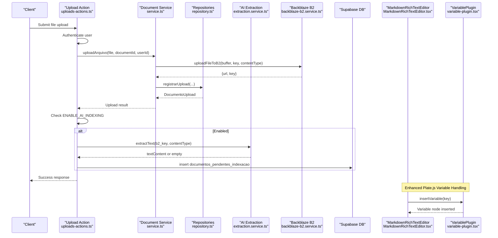
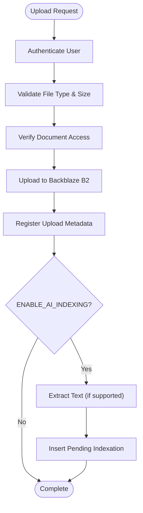
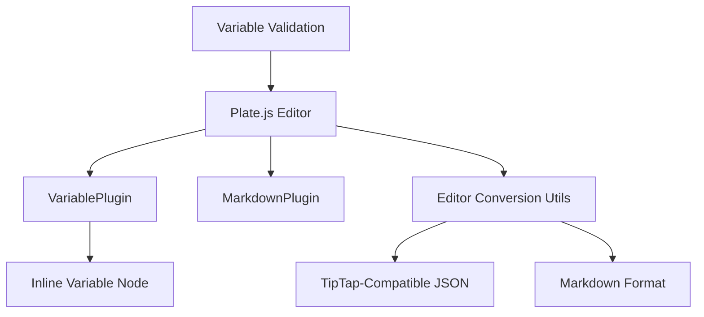
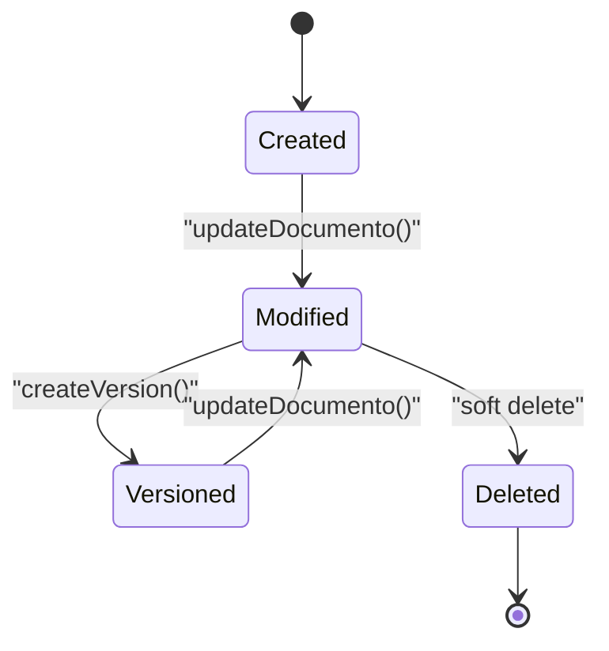
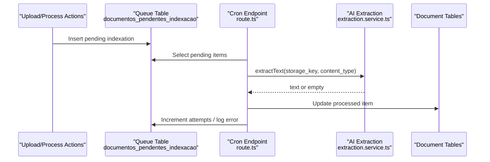
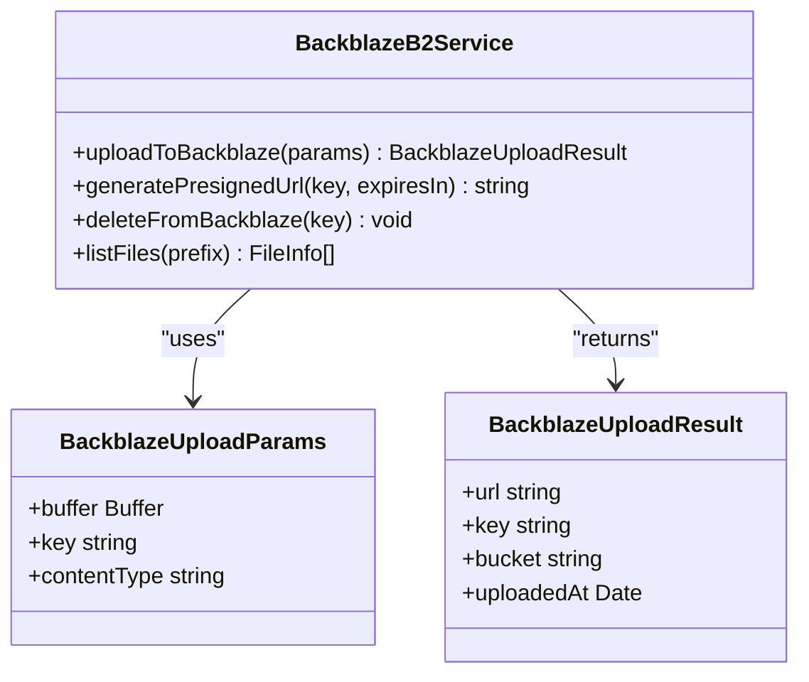
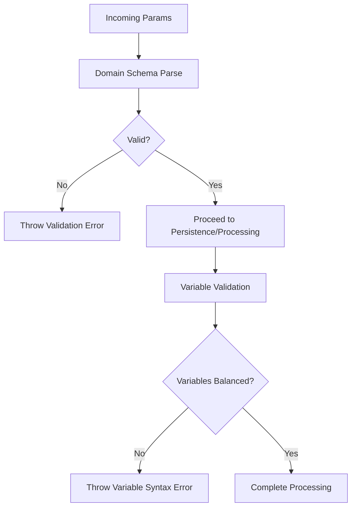
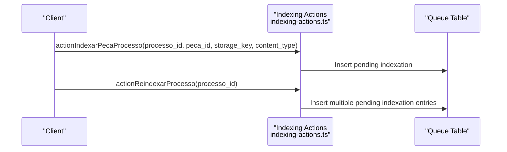
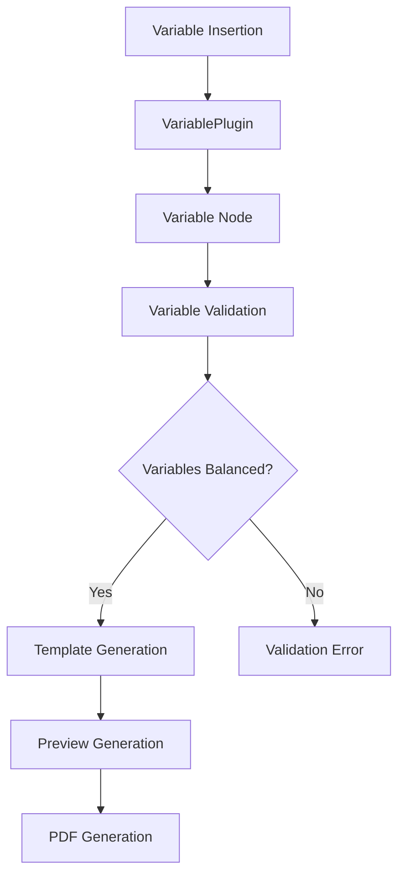
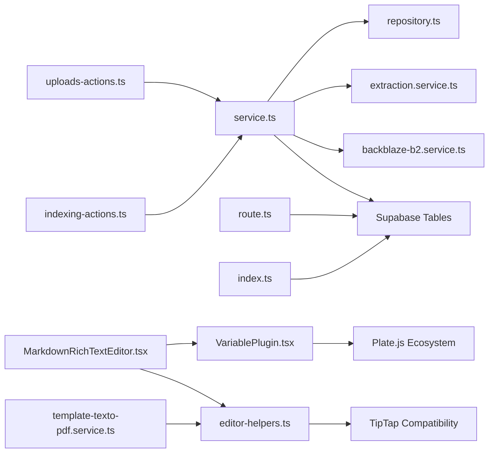

# Document Processing Pipeline

<cite>
**Referenced Files in This Document**
- [uploads-actions.ts](file://src/app/(authenticated)/documentos/actions/uploads-actions.ts)
- [indexing-actions.ts](file://src/app/(authenticated)/processos/actions/indexing-actions.ts)
- [service.ts](file://src/app/(authenticated)/documentos/service.ts)
- [repository.ts](file://src/app/(authenticated)/documentos/repository.ts)
- [extraction.service.ts](file://src/lib/ai/services/extraction.service.ts)
- [route.ts](file://src/app/api/cron/indexar-documentos/route.ts)
- [backblaze-b2.service.ts](file://src/lib/storage/backblaze-b2.service.ts)
- [20251130220000_create_documentos_system.sql](file://supabase/migrations/20251130220000_create_documentos_system.sql)
- [20260109120000_create_documentos_pendentes_indexacao.sql](file://supabase/migrations/20260109120000_create_documentos_pendentes_indexacao.sql)
- [20251221160000_create_arquivos_table.sql](file://supabase/migrations/20251221160000_create_arquivos_table.sql)
- [20251221180000_fix_rls_circular_dependency.sql](file://supabase/migrations/20251221180000_fix_rls_circular_dependency.sql)
- [index.ts](file://supabase/functions/indexar-documentos/index.ts)
- [test-backblaze-connection.ts](file://scripts/storage/test-backblaze-connection.ts)
- [index-existing-documents.ts](file://scripts/ai/index-existing-documents.ts)
- [MarkdownRichTextEditor.tsx](file://src/app/(authenticated)/assinatura-digital/components/editor/MarkdownRichTextEditor.tsx)
- [editor-helpers.ts](file://src/app/(authenticated)/assinatura-digital/components/editor/editor-helpers.ts)
- [variable-plugin.tsx](file://src/components/editor/plate/variable-plugin.tsx)
- [template-texto-pdf.service.ts](file://src/shared/assinatura-digital/services/template-texto-pdf.service.ts)
- [types.ts](file://src/app/(authenticated)/assinatura-digital/components/editor/template-texto/types.ts)
- [20260109120000_create_documentos_pendentes_indexacao.sql](file://supabase/migrations/20260109120000_create_documentos_pendentes_indexacao.sql)
- [20251221160000_create_arquivos_table.sql](file://supabase/migrations/20251221160000_create_arquivos_table.sql)
- [route.ts](file://src/app/api/cron/indexar-documentos/route.ts)
- [index.ts](file://supabase/functions/indexar-documentos/index.ts)
</cite>

## Update Summary
**Changes Made**
- Enhanced AI-assisted document editing with Plate.js migration
- Updated processing pipeline to work with Plate.js editor components
- Integrated markdown serialization and new variable handling system
- Added comprehensive variable plugin support for inline variable nodes
- Updated editor conversion utilities for TipTap-compatible JSON storage
- Enhanced document processing workflow with Plate.js value serialization

## Table of Contents
1. [Introduction](#introduction)
2. [Project Structure](#project-structure)
3. [Core Components](#core-components)
4. [Architecture Overview](#architecture-overview)
5. [Detailed Component Analysis](#detailed-component-analysis)
6. [Dependency Analysis](#dependency-analysis)
7. [Performance Considerations](#performance-considerations)
8. [Troubleshooting Guide](#troubleshooting-guide)
9. [Conclusion](#conclusion)

## Introduction
This document describes the Document Processing Pipeline system responsible for end-to-end document lifecycle management: upload, validation, transformation, asynchronous indexing, and storage. The system has been enhanced with Plate.js migration for improved AI-assisted document editing capabilities, featuring advanced variable handling, markdown serialization, and seamless integration with the existing processing pipeline. It covers the server-side actions architecture, data validation schemas, business logic, document lifecycle (creation, modification, versioning, deletion), and integration with external systems such as Backblaze B2 and AI extraction services. It also outlines error handling strategies and performance optimization techniques.

## Project Structure
The Document Processing Pipeline spans several layers with enhanced Plate.js integration:
- Frontend server actions trigger processing workflows with Plate.js editor components
- Business logic services orchestrate validation, storage, and persistence with variable handling
- Supabase database tables store documents, uploads, versions, and indexing queues
- Storage layer integrates with Backblaze B2 via S3-compatible APIs
- AI extraction utilities transform binary content into searchable text
- Cron-based background jobs process pending indexation requests
- Plate.js editor components provide enhanced variable insertion and markdown serialization

```mermaid
graph TB
subgraph "Frontend - Enhanced with Plate.js"
UA["Upload Action<br/>uploads-actions.ts"]
PA["Process Indexing Actions<br/>indexing-actions.ts"]
MRTE["MarkdownRichTextEditor<br/>MarkdownRichTextEditor.tsx"]
VP["VariablePlugin<br/>variable-plugin.tsx"]
EH["Editor Helpers<br/>editor-helpers.ts"]
END
subgraph "Business Logic"
SVC["Document Service<br/>service.ts"]
REPO["Repositories<br/>repository.ts"]
EXTR["AI Extraction<br/>extraction.service.ts"]
PDF["PDF Service<br/>template-texto-pdf.service.ts"]
END
subgraph "Storage"
B2["Backblaze B2 Service<br/>backblaze-b2.service.ts"]
END
subgraph "Database"
DB1["documentos<br/>20251130220000_create_documentos_system.sql"]
DB2["documentos_uploads<br/>20251130220000_create_documentos_system.sql"]
DB3["documentos_versoes<br/>20251130220000_create_documentos_system.sql"]
DB4["documentos_pendentes_indexacao<br/>20260109120000_create_documentos_pendentes_indexacao.sql"]
DB5["arquivos<br/>20251221160000_create_arquivos_table.sql"]
END
subgraph "Background Processing"
CRON["Cron Endpoint<br/>route.ts"]
EDGE["Edge Function<br/>index.ts"]
END
UA --> SVC
PA --> SVC
SVC --> REPO
SVC --> EXTR
SVC --> B2
SVC --> DB1
SVC --> DB2
SVC --> DB3
SVC --> DB4
SVC --> DB5
CRON --> DB4
EDGE --> DB4
MRTE --> VP
MRTE --> EH
PDF --> EH
```

**Diagram sources**
- [uploads-actions.ts](file://src/app/(authenticated)/documentos/actions/uploads-actions.ts#L1-L112)
- [indexing-actions.ts](file://src/app/(authenticated)/processos/actions/indexing-actions.ts#L27-L171)
- [service.ts](file://src/app/(authenticated)/documentos/service.ts#L1-L200)
- [repository.ts](file://src/app/(authenticated)/documentos/repository.ts#L2151-L2330)
- [extraction.service.ts:92-175](file://src/lib/ai/services/extraction.service.ts#L92-L175)
- [backblaze-b2.service.ts:1-271](file://src/lib/storage/backblaze-b2.service.ts#L1-L271)
- [MarkdownRichTextEditor.tsx](file://src/app/(authenticated)/assinatura-digital/components/editor/MarkdownRichTextEditor.tsx#L1-L308)
- [variable-plugin.tsx:1-56](file://src/components/editor/plate/variable-plugin.tsx#L1-L56)
- [editor-helpers.ts](file://src/app/(authenticated)/assinatura-digital/components/editor/editor-helpers.ts#L1-L358)
- [template-texto-pdf.service.ts:1-332](file://src/shared/assinatura-digital/services/template-texto-pdf.service.ts#L1-L332)
- [20251130220000_create_documentos_system.sql:10-280](file://supabase/migrations/20251130220000_create_documentos_system.sql#L10-L280)
- [20260109120000_create_documentos_pendentes_indexacao.sql:1-26](file://supabase/migrations/20260109120000_create_documentos_pendentes_indexacao.sql#L1-L26)
- [20251221160000_create_arquivos_table.sql:1-49](file://supabase/migrations/20251221160000_create_arquivos_table.sql#L1-L49)
- [route.ts:190-234](file://src/app/api/cron/indexar-documentos/route.ts#L190-L234)
- [index.ts:83-111](file://supabase/functions/indexar-documentos/index.ts#L83-L111)

**Section sources**
- [uploads-actions.ts](file://src/app/(authenticated)/documentos/actions/uploads-actions.ts#L1-L112)
- [service.ts](file://src/app/(authenticated)/documentos/service.ts#L1-L200)
- [repository.ts](file://src/app/(authenticated)/documentos/repository.ts#L2151-L2330)
- [extraction.service.ts:92-175](file://src/lib/ai/services/extraction.service.ts#L92-L175)
- [backblaze-b2.service.ts:1-271](file://src/lib/storage/backblaze-b2.service.ts#L1-L271)
- [MarkdownRichTextEditor.tsx](file://src/app/(authenticated)/assinatura-digital/components/editor/MarkdownRichTextEditor.tsx#L1-L308)
- [variable-plugin.tsx:1-56](file://src/components/editor/plate/variable-plugin.tsx#L1-L56)
- [editor-helpers.ts](file://src/app/(authenticated)/assinatura-digital/components/editor/editor-helpers.ts#L1-L358)
- [template-texto-pdf.service.ts:1-332](file://src/shared/assinatura-digital/services/template-texto-pdf.service.ts#L1-L332)
- [20251130220000_create_documentos_system.sql:10-280](file://supabase/migrations/20251130220000_create_documentos_system.sql#L10-L280)
- [20260109120000_create_documentos_pendentes_indexacao.sql:1-26](file://supabase/migrations/20260109120000_create_documentos_pendentes_indexacao.sql#L1-L26)
- [20251221160000_create_arquivos_table.sql:1-49](file://supabase/migrations/20251221160000_create_arquivos_table.sql#L1-L49)
- [route.ts:190-234](file://src/app/api/cron/indexar-documentos/route.ts#L190-L234)
- [index.ts:83-111](file://supabase/functions/indexar-documentos/index.ts#L83-L111)

## Core Components
- Upload Actions: Authenticate, validate, upload to storage, and enqueue AI indexing when enabled.
- Document Service: Central orchestrator for CRUD, permissions, quotas, and versioning.
- Repositories: Data access layer for documents, uploads, versions, and indexing queue.
- AI Extraction: Text extraction from supported content types (PDF, DOCX placeholder, text variants).
- Storage Service: Backblaze B2 integration via S3-compatible API with presigned URL support.
- Database Schema: Document, upload, version, and indexing queue tables with RLS policies.
- Background Processing: Cron endpoint and Edge Function to process pending indexation.
- **Enhanced Plate.js Integration**: Advanced editor components with variable handling and markdown serialization.
- **Variable System**: Inline variable nodes with comprehensive insertion and validation capabilities.
- **Editor Conversion Utilities**: Bidirectional conversion between Plate.js values and TipTap-compatible JSON.

**Section sources**
- [uploads-actions.ts](file://src/app/(authenticated)/documentos/actions/uploads-actions.ts#L9-L71)
- [service.ts](file://src/app/(authenticated)/documentos/service.ts#L91-L171)
- [repository.ts](file://src/app/(authenticated)/documentos/repository.ts#L2151-L2330)
- [extraction.service.ts:92-175](file://src/lib/ai/services/extraction.service.ts#L92-L175)
- [backblaze-b2.service.ts:1-271](file://src/lib/storage/backblaze-b2.service.ts#L1-L271)
- [MarkdownRichTextEditor.tsx](file://src/app/(authenticated)/assinatura-digital/components/editor/MarkdownRichTextEditor.tsx#L1-L308)
- [variable-plugin.tsx:1-56](file://src/components/editor/plate/variable-plugin.tsx#L1-L56)
- [editor-helpers.ts](file://src/app/(authenticated)/assinatura-digital/components/editor/editor-helpers.ts#L1-L358)
- [20251130220000_create_documentos_system.sql:10-280](file://supabase/migrations/20251130220000_create_documentos_system.sql#L10-L280)
- [20260109120000_create_documentos_pendentes_indexacao.sql:1-26](file://supabase/migrations/20260109120000_create_documentos_pendentes_indexacao.sql#L1-L26)
- [route.ts:190-234](file://src/app/api/cron/indexar-documentos/route.ts#L190-L234)
- [index.ts:83-111](file://supabase/functions/indexar-documentos/index.ts#L83-L111)

## Architecture Overview
The pipeline follows a request-driven upload flow with optional synchronous text extraction followed by asynchronous indexing. The system ensures secure access via RLS and maintains immutable document versions. The enhanced Plate.js integration provides sophisticated variable handling and markdown serialization capabilities.



**Diagram sources**
- [uploads-actions.ts](file://src/app/(authenticated)/documentos/actions/uploads-actions.ts#L9-L71)
- [service.ts](file://src/app/(authenticated)/documentos/service.ts#L716-L757)
- [repository.ts](file://src/app/(authenticated)/documentos/repository.ts#L2151-L2180)
- [extraction.service.ts:92-132](file://src/lib/ai/services/extraction.service.ts#L92-L132)
- [backblaze-b2.service.ts:80-136](file://src/lib/storage/backblaze-b2.service.ts#L80-L136)
- [MarkdownRichTextEditor.tsx](file://src/app/(authenticated)/assinatura-digital/components/editor/MarkdownRichTextEditor.tsx#L48-L56)
- [variable-plugin.tsx:48-56](file://src/components/editor/plate/variable-plugin.tsx#L48-L56)
- [20260109120000_create_documentos_pendentes_indexacao.sql:1-26](file://supabase/migrations/20260109120000_create_documentos_pendentes_indexacao.sql#L1-L26)

## Detailed Component Analysis

### Upload Workflow and Validation
- Authentication and authorization occur at the action boundary.
- File type and size validation are enforced before storage.
- Access checks ensure the uploader has permission to target the document.
- Backblaze B2 upload returns a public URL and key for later retrieval.
- Registration persists upload metadata and ownership.
- Optional synchronous text extraction for supported content types; otherwise, queue for later processing.



**Diagram sources**
- [uploads-actions.ts](file://src/app/(authenticated)/documentos/actions/uploads-actions.ts#L9-L71)
- [service.ts](file://src/app/(authenticated)/documentos/service.ts#L716-L757)
- [extraction.service.ts:92-132](file://src/lib/ai/services/extraction.service.ts#L92-L132)
- [20260109120000_create_documentos_pendentes_indexacao.sql:1-26](file://supabase/migrations/20260109120000_create_documentos_pendentes_indexacao.sql#L1-L26)

**Section sources**
- [uploads-actions.ts](file://src/app/(authenticated)/documentos/actions/uploads-actions.ts#L9-L71)
- [service.ts](file://src/app/(authenticated)/documentos/service.ts#L716-L757)
- [repository.ts](file://src/app/(authenticated)/documentos/repository.ts#L2151-L2180)

### Enhanced Plate.js Editor Integration
The system now features comprehensive Plate.js integration for enhanced document editing capabilities:

- **Variable Plugin**: Inline variable nodes with custom rendering and insertion functionality
- **Markdown Serialization**: Bidirectional conversion between Plate.js values and markdown format
- **Editor Conversion Utilities**: Seamless conversion between Plate.js and TipTap-compatible JSON
- **Variable Validation**: Comprehensive validation for variable syntax and balance checking
- **Template Processing**: Advanced template generation with variable replacement and preview capabilities



**Diagram sources**
- [MarkdownRichTextEditor.tsx](file://src/app/(authenticated)/assinatura-digital/components/editor/MarkdownRichTextEditor.tsx#L1-L308)
- [variable-plugin.tsx:1-56](file://src/components/editor/plate/variable-plugin.tsx#L1-L56)
- [editor-helpers.ts](file://src/app/(authenticated)/assinatura-digital/components/editor/editor-helpers.ts#L212-L358)

**Section sources**
- [MarkdownRichTextEditor.tsx](file://src/app/(authenticated)/assinatura-digital/components/editor/MarkdownRichTextEditor.tsx#L1-L308)
- [variable-plugin.tsx:1-56](file://src/components/editor/plate/variable-plugin.tsx#L1-L56)
- [editor-helpers.ts](file://src/app/(authenticated)/assinatura-digital/components/editor/editor-helpers.ts#L1-L358)
- [template-texto-pdf.service.ts:1-332](file://src/shared/assinatura-digital/services/template-texto-pdf.service.ts#L1-L332)

### Document Lifecycle Management
- Creation: Validates input schema, creates document, and returns enriched data with user context.
- Modification: Parses updates, verifies edit permissions, and conditionally creates a new version when content changes.
- Versioning: Immutable snapshots stored separately; supports listing, restoration, and cleanup of old versions.
- Deletion: Soft delete pattern via a tombstone timestamp; cleanup policies can be applied.



**Diagram sources**
- [service.ts](file://src/app/(authenticated)/documentos/service.ts#L91-L171)
- [repository.ts](file://src/app/(authenticated)/documentos/repository.ts#L528-L560)
- [20251130220000_create_documentos_system.sql:213-232](file://supabase/migrations/20251130220000_create_documentos_system.sql#L213-L232)

**Section sources**
- [service.ts](file://src/app/(authenticated)/documentos/service.ts#L91-L171)
- [repository.ts](file://src/app/(authenticated)/documentos/repository.ts#L528-L560)
- [repository.ts](file://src/app/(authenticated)/documentos/repository.ts#L1937-L1968)
- [repository.ts](file://src/app/(authenticated)/documentos/repository.ts#L1970-L2008)
- [repository.ts](file://src/app/(authenticated)/documentos/repository.ts#L2110-L2145)
- [20251130220000_create_documentos_system.sql:213-232](file://supabase/migrations/20251130220000_create_documentos_system.sql#L213-L232)

### Indexing Pipeline and Background Processing
- Pending Indexation Queue: Dedicated table stores queued items with metadata and retry tracking.
- Cron Endpoint: Processes pending items, extracts text when needed, and handles retries with error logging.
- Edge Function: Alternative processing path for indexation tasks.
- Supported Types: PDF extraction implemented; DOCX placeholder indicates future integration.



**Diagram sources**
- [uploads-actions.ts](file://src/app/(authenticated)/documentos/actions/uploads-actions.ts#L44-L58)
- [indexing-actions.ts](file://src/app/(authenticated)/processos/actions/indexing-actions.ts#L31-L43)
- [route.ts:190-234](file://src/app/api/cron/indexar-documentos/route.ts#L190-L234)
- [extraction.service.ts:92-132](file://src/lib/ai/services/extraction.service.ts#L92-L132)
- [20260109120000_create_documentos_pendentes_indexacao.sql:1-26](file://supabase/migrations/20260109120000_create_documentos_pendentes_indexacao.sql#L1-L26)

**Section sources**
- [uploads-actions.ts](file://src/app/(authenticated)/documentos/actions/uploads-actions.ts#L25-L64)
- [indexing-actions.ts](file://src/app/(authenticated)/processos/actions/indexing-actions.ts#L27-L55)
- [route.ts:190-234](file://src/app/api/cron/indexar-documentos/route.ts#L190-L234)
- [index.ts:83-111](file://supabase/functions/indexar-documentos/index.ts#L83-L111)
- [extraction.service.ts:92-132](file://src/lib/ai/services/extraction.service.ts#L92-L132)

### Storage Integration with Backblaze B2
- S3-compatible client encapsulated for uploads, downloads, and presigned URLs.
- Presigned URLs enable controlled access to private objects.
- Scripts validate connectivity and demonstrate migration steps.



**Diagram sources**
- [backblaze-b2.service.ts:1-271](file://src/lib/storage/backblaze-b2.service.ts#L1-L271)
- [test-backblaze-connection.ts:73-105](file://scripts/storage/test-backblaze-connection.ts#L73-L105)

**Section sources**
- [backblaze-b2.service.ts:1-271](file://src/lib/storage/backblaze-b2.service.ts#L1-L271)
- [test-backblaze-connection.ts:73-105](file://scripts/storage/test-backblaze-connection.ts#L73-L105)

### Data Validation and Schemas
- Document creation and update enforce structured schemas validated at runtime.
- Upload service validates file type and size limits.
- Content-type validation gates extraction to supported formats.
- **Enhanced Variable Validation**: Comprehensive validation for variable syntax and balance checking in markdown content.



**Diagram sources**
- [service.ts](file://src/app/(authenticated)/documentos/service.ts#L95-L106)
- [service.ts](file://src/app/(authenticated)/documentos/service.ts#L114-L130)
- [service.ts](file://src/app/(authenticated)/documentos/service.ts#L716-L721)
- [extraction.service.ts:152-175](file://src/lib/ai/services/extraction.service.ts#L152-L175)
- [editor-helpers.ts](file://src/app/(authenticated)/assinatura-digital/components/editor/editor-helpers.ts#L199-L210)

**Section sources**
- [service.ts](file://src/app/(authenticated)/documentos/service.ts#L95-L106)
- [service.ts](file://src/app/(authenticated)/documentos/service.ts#L114-L130)
- [service.ts](file://src/app/(authenticated)/documentos/service.ts#L716-L721)
- [extraction.service.ts:152-175](file://src/lib/ai/services/extraction.service.ts#L152-L175)
- [editor-helpers.ts](file://src/app/(authenticated)/assinatura-digital/components/editor/editor-helpers.ts#L199-L210)

### Process Indexing Actions (Processos)
- Provides server actions to enqueue process pieces and progress notes for asynchronous indexing.
- Supports reindexation of an entire process by enqueuing all related uploads.



**Diagram sources**
- [indexing-actions.ts](file://src/app/(authenticated)/processos/actions/indexing-actions.ts#L27-L55)
- [indexing-actions.ts](file://src/app/(authenticated)/processos/actions/indexing-actions.ts#L107-L171)

**Section sources**
- [indexing-actions.ts](file://src/app/(authenticated)/processos/actions/indexing-actions.ts#L27-L55)
- [indexing-actions.ts](file://src/app/(authenticated)/processos/actions/indexing-actions.ts#L107-L171)

### Enhanced Variable Handling System
The system now features a comprehensive variable handling system built on Plate.js:

- **Variable Plugin**: Custom inline element for variable nodes with proper rendering and editing support
- **Variable Insertion**: Context-aware variable insertion with categorization and grouping
- **Variable Validation**: Real-time validation of variable syntax and balance checking
- **Template Processing**: Advanced template generation with variable replacement and preview capabilities
- **Bidirectional Conversion**: Seamless conversion between Plate.js values and markdown format



**Diagram sources**
- [MarkdownRichTextEditor.tsx](file://src/app/(authenticated)/assinatura-digital/components/editor/MarkdownRichTextEditor.tsx#L150-L196)
- [variable-plugin.tsx:18-36](file://src/components/editor/plate/variable-plugin.tsx#L18-L36)
- [editor-helpers.ts](file://src/app/(authenticated)/assinatura-digital/components/editor/editor-helpers.ts#L199-L210)
- [template-texto-pdf.service.ts:288-301](file://src/shared/assinatura-digital/services/template-texto-pdf.service.ts#L288-L301)

**Section sources**
- [MarkdownRichTextEditor.tsx](file://src/app/(authenticated)/assinatura-digital/components/editor/MarkdownRichTextEditor.tsx#L1-L308)
- [variable-plugin.tsx:1-56](file://src/components/editor/plate/variable-plugin.tsx#L1-L56)
- [editor-helpers.ts](file://src/app/(authenticated)/assinatura-digital/components/editor/editor-helpers.ts#L1-L358)
- [template-texto-pdf.service.ts:1-332](file://src/shared/assinatura-digital/services/template-texto-pdf.service.ts#L1-L332)

## Dependency Analysis
- Cohesion: Upload actions depend on document service; document service depends on repositories and storage/extraction utilities.
- Coupling: Actions are thin; most logic resides in service layer; repositories isolate database concerns.
- External Dependencies: Backblaze B2 SDK, pdf-parse/pdfjs-dist for extraction, Supabase client, **Plate.js v52 ecosystem**.
- RLS: Security policies prevent unauthorized access across document-related tables.
- **Enhanced Dependencies**: Plate.js plugins, markdown serialization libraries, variable handling utilities.



**Diagram sources**
- [uploads-actions.ts](file://src/app/(authenticated)/documentos/actions/uploads-actions.ts#L1-L112)
- [indexing-actions.ts](file://src/app/(authenticated)/processos/actions/indexing-actions.ts#L27-L171)
- [service.ts](file://src/app/(authenticated)/documentos/service.ts#L1-L200)
- [repository.ts](file://src/app/(authenticated)/documentos/repository.ts#L2151-L2330)
- [extraction.service.ts:92-175](file://src/lib/ai/services/extraction.service.ts#L92-L175)
- [backblaze-b2.service.ts:1-271](file://src/lib/storage/backblaze-b2.service.ts#L1-L271)
- [MarkdownRichTextEditor.tsx](file://src/app/(authenticated)/assinatura-digital/components/editor/MarkdownRichTextEditor.tsx#L1-L308)
- [variable-plugin.tsx:1-56](file://src/components/editor/plate/variable-plugin.tsx#L1-L56)
- [editor-helpers.ts](file://src/app/(authenticated)/assinatura-digital/components/editor/editor-helpers.ts#L1-L358)
- [template-texto-pdf.service.ts:1-332](file://src/shared/assinatura-digital/services/template-texto-pdf.service.ts#L1-L332)
- [route.ts:190-234](file://src/app/api/cron/indexar-documentos/route.ts#L190-L234)
- [index.ts:83-111](file://supabase/functions/indexar-documentos/index.ts#L83-L111)

**Section sources**
- [20251221180000_fix_rls_circular_dependency.sql:14-44](file://supabase/migrations/20251221180000_fix_rls_circular_dependency.sql#L14-L44)
- [20251221180000_fix_rls_circular_dependency.sql:147-194](file://supabase/migrations/20251221180000_fix_rls_circular_dependency.sql#L147-L194)

## Performance Considerations
- Asynchronous Indexing: Offloads heavy text extraction to background jobs to avoid blocking uploads.
- Retry and Error Tracking: Queue table tracks attempts and last error to support resiliency.
- Indexing Strategy: Use supported content types to minimize fallbacks; implement DOCX extraction when needed.
- Storage Efficiency: Backblaze B2 presigned URLs reduce origin bandwidth; ensure proper caching headers.
- Database Optimization: RLS and indexes improve query performance; monitor slow queries and unused indexes.
- **Plate.js Performance**: Optimized rendering and serialization for large documents; consider virtualization for extensive content.
- **Variable Processing**: Efficient variable insertion and validation to minimize editor lag during content editing.

## Troubleshooting Guide
Common issues and resolutions:
- Authentication Failures: Ensure user is authenticated before invoking actions.
- Permission Denied: Verify access checks for document ownership/edit permissions.
- File Type/Size Errors: Respect validation constraints before upload.
- Extraction Failures: Unsupported content types fall back to empty text; enable supported types or handle gracefully.
- Storage Errors: Validate Backblaze credentials and bucket configuration; use connectivity scripts to verify setup.
- Indexing Queue Stalls: Check cron endpoint logs and queue entries for retry counts and error messages.
- **Plate.js Issues**: Verify plugin registration and editor initialization; check for proper variable node rendering.
- **Variable Validation Errors**: Ensure variable syntax is properly balanced; validate variable keys against available options.
- **Editor Conversion Problems**: Confirm bidirectional conversion between Plate.js values and TipTap-compatible JSON.

**Section sources**
- [uploads-actions.ts](file://src/app/(authenticated)/documentos/actions/uploads-actions.ts#L11-L14)
- [service.ts](file://src/app/(authenticated)/documentos/service.ts#L716-L721)
- [extraction.service.ts:126-131](file://src/lib/ai/services/extraction.service.ts#L126-L131)
- [backblaze-b2.service.ts:130-135](file://src/lib/storage/backblaze-b2.service.ts#L130-L135)
- [route.ts:190-234](file://src/app/api/cron/indexar-documentos/route.ts#L190-L234)
- [test-backblaze-connection.ts:73-105](file://scripts/storage/test-backblaze-connection.ts#L73-L105)
- [MarkdownRichTextEditor.tsx](file://src/app/(authenticated)/assinatura-digital/components/editor/MarkdownRichTextEditor.tsx#L1-L308)
- [editor-helpers.ts](file://src/app/(authenticated)/assinatura-digital/components/editor/editor-helpers.ts#L199-L210)

## Conclusion
The Document Processing Pipeline provides a robust, secure, and scalable solution for document lifecycle management. With the enhanced Plate.js integration, the system now offers sophisticated AI-assisted document editing capabilities with advanced variable handling, markdown serialization, and seamless compatibility with existing processing workflows. By combining strict validation, secure storage, asynchronous indexing, and resilient background processing, it supports efficient collaboration and searchability. The modular architecture enables easy maintenance, testing, and extension as requirements evolve, while the comprehensive variable system ensures flexible content templating and dynamic content generation.