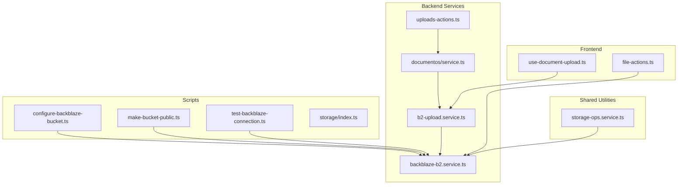
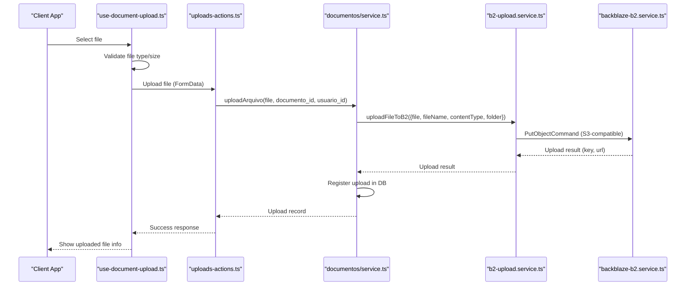
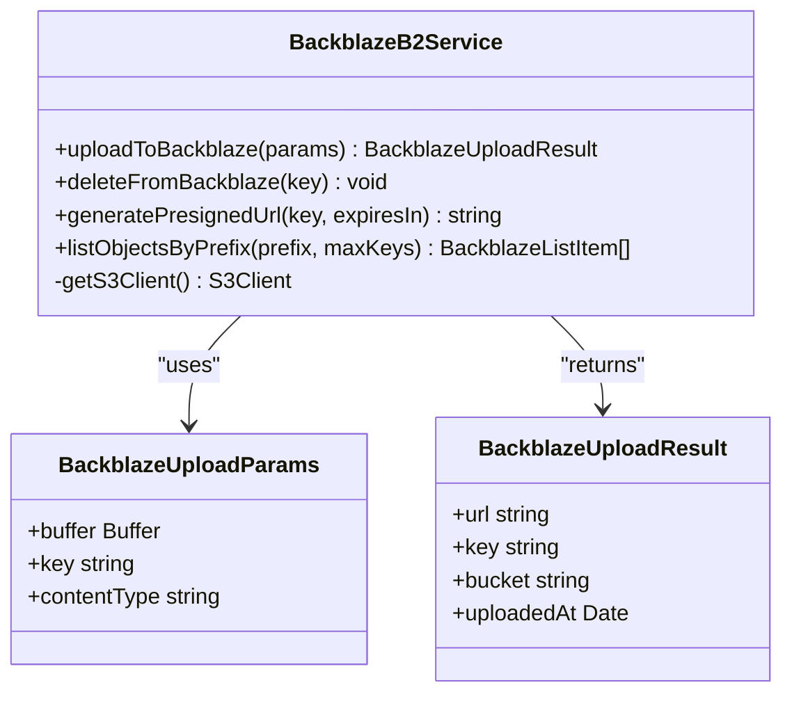
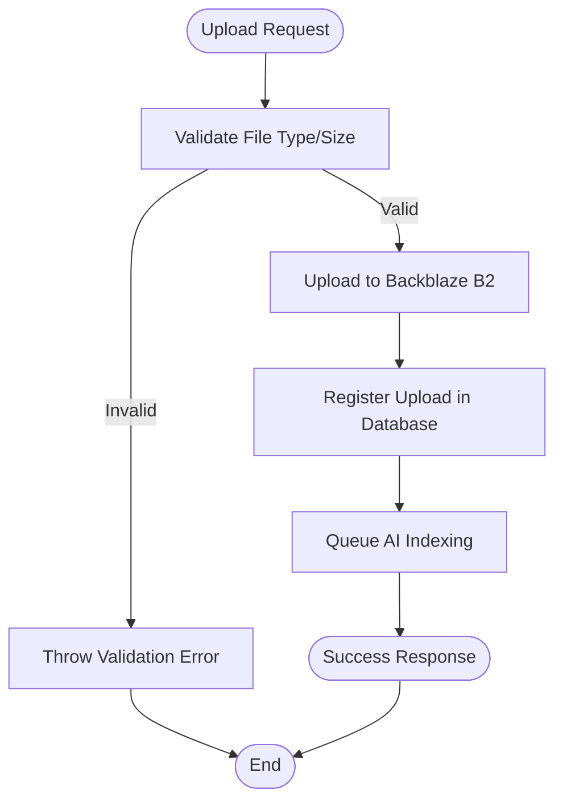
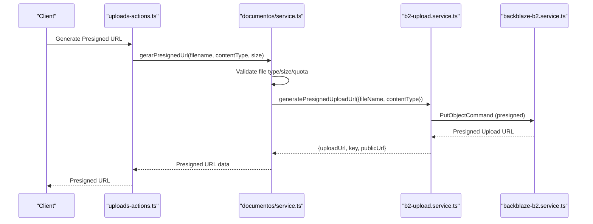
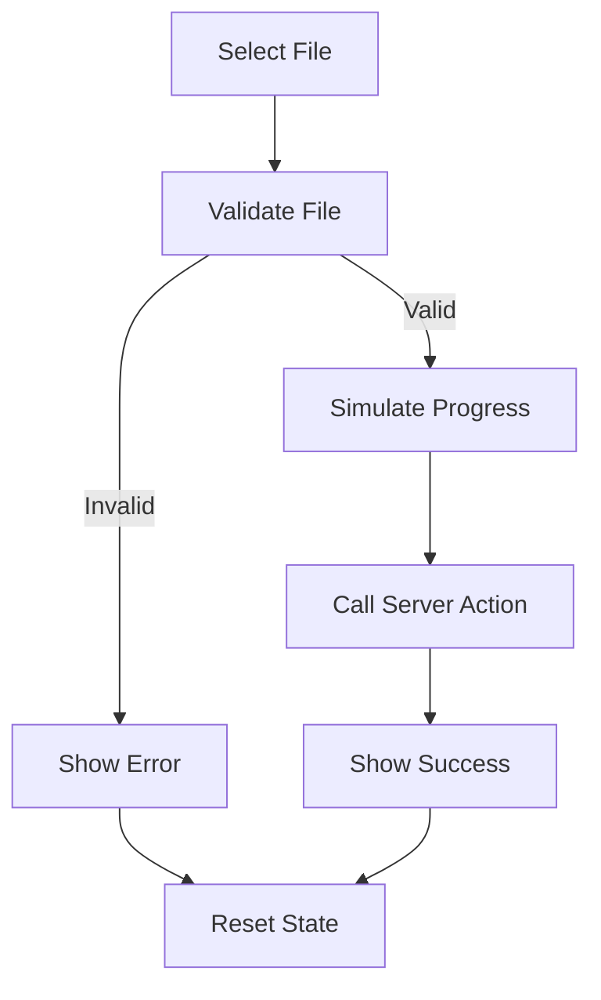
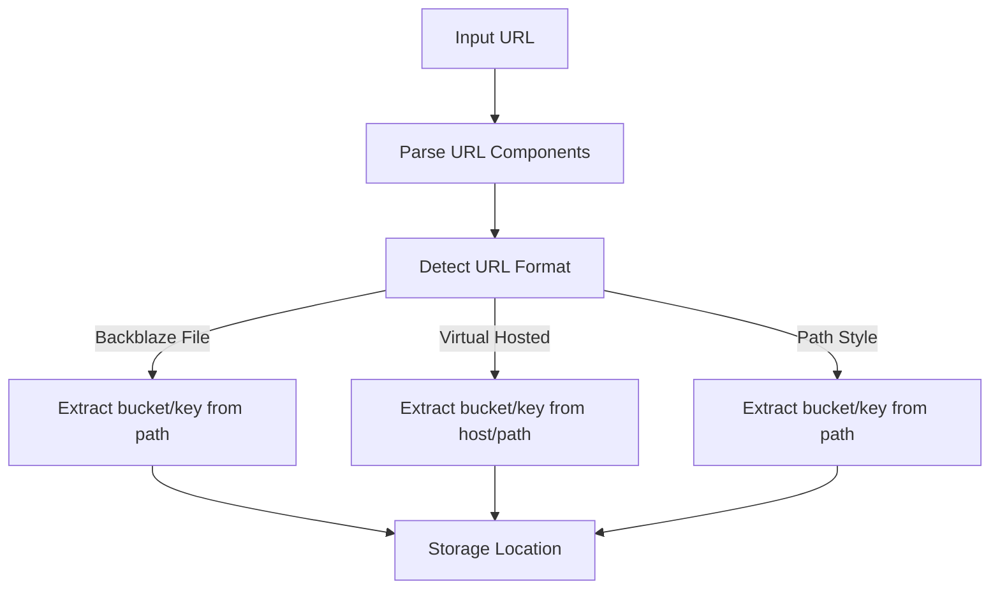
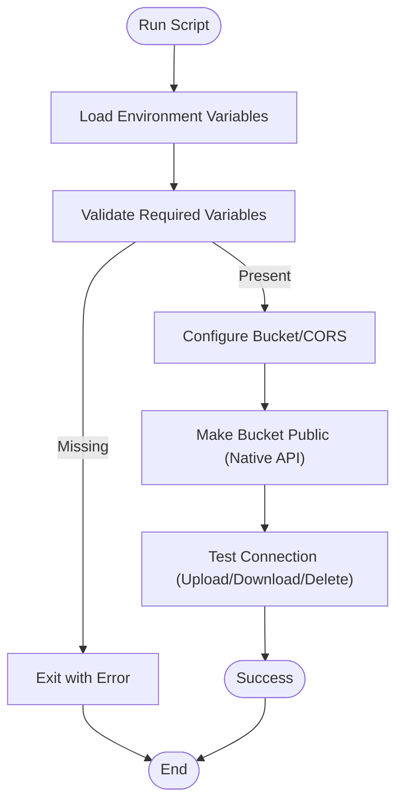
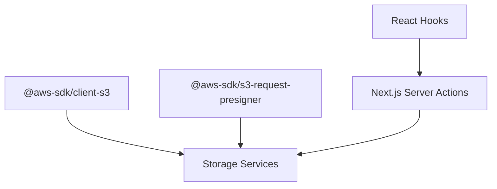

# Storage Integration and Management

<cite>
**Referenced Files in This Document**
- [scripts/storage/index.ts](file://scripts/storage/index.ts)
- [scripts/storage/configure-backblaze-bucket.ts](file://scripts/storage/configure-backblaze-bucket.ts)
- [scripts/storage/make-bucket-public.ts](file://scripts/storage/make-bucket-public.ts)
- [scripts/storage/test-backblaze-connection.ts](file://scripts/storage/test-backblaze-connection.ts)
- [src/lib/storage/backblaze-b2.service.ts](file://src/lib/storage/backblaze-b2.service.ts)
- [src/app/(authenticated)/documentos/services/b2-upload.service.ts](file://src/app/(authenticated)/documentos/services/b2-upload.service.ts)
- [src/app/(authenticated)/documentos/actions/uploads-actions.ts](file://src/app/(authenticated)/documentos/actions/uploads-actions.ts)
- [src/app/(authenticated)/documentos/service.ts](file://src/app/(authenticated)/documentos/service.ts)
- [src/app/(authenticated)/assinatura-digital/components/upload/hooks/use-document-upload.ts](file://src/app/(authenticated)/assinatura-digital/components/upload/hooks/use-document-upload.ts)
- [src/app/(authenticated)/chat/actions/file-actions.ts](file://src/app/(authenticated)/chat/actions/file-actions.ts)
- [src/shared/assinatura-digital/services/signature/storage-ops.service.ts](file://src/shared/assinatura-digital/services/signature/storage-ops.service.ts)
- [src/testing/mocks/backblaze-b2.mock.ts](file://src/testing/mocks/backblaze-b2.mock.ts)
- [src/app/(authenticated)/assinatura-digital/docs/arquitetura-conceitual.md](file://src/app/(authenticated)/assinatura-digital/docs/arquitetura-conceitual.md)
- [package.json](file://package.json)
</cite>

## Table of Contents
1. [Introduction](#introduction)
2. [Project Structure](#project-structure)
3. [Core Components](#core-components)
4. [Architecture Overview](#architecture-overview)
5. [Detailed Component Analysis](#detailed-component-analysis)
6. [Dependency Analysis](#dependency-analysis)
7. [Performance Considerations](#performance-considerations)
8. [Troubleshooting Guide](#troubleshooting-guide)
9. [Conclusion](#conclusion)
10. [Appendices](#appendices)

## Introduction
This document provides comprehensive guidance for the Storage Integration and Management system, focusing on multi-cloud storage architecture with Backblaze B2 (S3-compatible). It covers presigned URL generation, upload/download workflows, file management operations, policies, security measures, cost optimization strategies, and practical configuration examples. The system integrates seamlessly with Next.js server actions, React hooks, and Supabase for document management and AI indexing.

## Project Structure
The storage system spans several layers:
- Scripts for configuration and testing of Backblaze B2
- Backend services for S3-compatible operations
- Frontend hooks and actions for user-driven uploads
- Shared utilities for storage operations and URL parsing
- Documentation and mock utilities for development and testing

**Diagram sources**
- [scripts/storage/configure-backblaze-bucket.ts:1-137](file://scripts/storage/configure-backblaze-bucket.ts#L1-L137)
- [scripts/storage/make-bucket-public.ts:1-159](file://scripts/storage/make-bucket-public.ts#L1-L159)
- [scripts/storage/test-backblaze-connection.ts:1-138](file://scripts/storage/test-backblaze-connection.ts#L1-L138)
- [src/lib/storage/backblaze-b2.service.ts:1-271](file://src/lib/storage/backblaze-b2.service.ts#L1-L271)
- [src/app/(authenticated)/documentos/services/b2-upload.service.ts](file://src/app/(authenticated)/documentos/services/b2-upload.service.ts#L1-L227)
- [src/app/(authenticated)/documentos/actions/uploads-actions.ts](file://src/app/(authenticated)/documentos/actions/uploads-actions.ts#L1-L112)
- [src/app/(authenticated)/documentos/service.ts](file://src/app/(authenticated)/documentos/service.ts#L708-L800)
- [src/app/(authenticated)/assinatura-digital/components/upload/hooks/use-document-upload.ts](file://src/app/(authenticated)/assinatura-digital/components/upload/hooks/use-document-upload.ts#L1-L301)
- [src/app/(authenticated)/chat/actions/file-actions.ts](file://src/app/(authenticated)/chat/actions/file-actions.ts#L51-L102)
- [src/shared/assinatura-digital/services/signature/storage-ops.service.ts:1-51](file://src/shared/assinatura-digital/services/signature/storage-ops.service.ts#L1-L51)

**Section sources**
- [scripts/storage/index.ts:1-279](file://scripts/storage/index.ts#L1-L279)
- [package.json:135-324](file://package.json#L135-L324)

## Core Components
- Backblaze B2 S3-Compatible Service: Provides upload, delete, presigned URL generation, and listing operations using AWS SDK v3.
- Document Upload Service: Handles file validation, unique naming, and registration in the database.
- Server Actions: Orchestrates authentication, quota checks, and AI indexing for uploaded documents.
- Frontend Hooks: Manage upload progress simulation, validation, and state for user interactions.
- Storage Operations Utility: Extracts bucket and key from various Backblaze URL formats.

**Section sources**
- [src/lib/storage/backblaze-b2.service.ts:1-271](file://src/lib/storage/backblaze-b2.service.ts#L1-L271)
- [src/app/(authenticated)/documentos/services/b2-upload.service.ts](file://src/app/(authenticated)/documentos/services/b2-upload.service.ts#L1-L227)
- [src/app/(authenticated)/documentos/actions/uploads-actions.ts](file://src/app/(authenticated)/documentos/actions/uploads-actions.ts#L1-L112)
- [src/app/(authenticated)/documentos/service.ts](file://src/app/(authenticated)/documentos/service.ts#L708-L800)
- [src/app/(authenticated)/assinatura-digital/components/upload/hooks/use-document-upload.ts](file://src/app/(authenticated)/assinatura-digital/components/upload/hooks/use-document-upload.ts#L1-L301)
- [src/shared/assinatura-digital/services/signature/storage-ops.service.ts:1-51](file://src/shared/assinatura-digital/services/signature/storage-ops.service.ts#L1-L51)

## Architecture Overview
The storage architecture leverages Backblaze B2 as the primary file storage with S3-compatible APIs. The system supports two access modes:
- Public Access: Files are accessible via direct URLs when the bucket is configured as public.
- Private Access with Presigned URLs: For sensitive data, presigned URLs grant temporary access.

**Diagram sources**
- [src/app/(authenticated)/assinatura-digital/components/upload/hooks/use-document-upload.ts](file://src/app/(authenticated)/assinatura-digital/components/upload/hooks/use-document-upload.ts#L148-L258)
- [src/app/(authenticated)/documentos/actions/uploads-actions.ts](file://src/app/(authenticated)/documentos/actions/uploads-actions.ts#L9-L71)
- [src/app/(authenticated)/documentos/service.ts](file://src/app/(authenticated)/documentos/service.ts#L708-L757)
- [src/app/(authenticated)/documentos/services/b2-upload.service.ts](file://src/app/(authenticated)/documentos/services/b2-upload.service.ts#L92-L129)
- [src/lib/storage/backblaze-b2.service.ts:80-136](file://src/lib/storage/backblaze-b2.service.ts#L80-L136)

## Detailed Component Analysis

### Backblaze B2 Service (S3-Compatible)
The service encapsulates S3-compatible operations for Backblaze B2:
- Upload: Converts file to Buffer and sends PutObjectCommand.
- Delete: Removes objects using DeleteObjectCommand.
- Presigned URL Generation: Uses getSignedUrl for temporary access.
- Listing: Lists objects by prefix with pagination support.

**Diagram sources**
- [src/lib/storage/backblaze-b2.service.ts:11-136](file://src/lib/storage/backblaze-b2.service.ts#L11-L136)
- [src/lib/storage/backblaze-b2.service.ts:179-271](file://src/lib/storage/backblaze-b2.service.ts#L179-L271)

**Section sources**
- [src/lib/storage/backblaze-b2.service.ts:1-271](file://src/lib/storage/backblaze-b2.service.ts#L1-L271)

### Document Upload Pipeline
The upload pipeline validates files, generates unique keys, uploads to B2, and registers metadata in the database. It also triggers AI indexing asynchronously.

**Diagram sources**
- [src/app/(authenticated)/documentos/service.ts](file://src/app/(authenticated)/documentos/service.ts#L708-L757)
- [src/app/(authenticated)/documentos/actions/uploads-actions.ts](file://src/app/(authenticated)/documentos/actions/uploads-actions.ts#L25-L64)

**Section sources**
- [src/app/(authenticated)/documentos/service.ts](file://src/app/(authenticated)/documentos/service.ts#L708-L800)
- [src/app/(authenticated)/documentos/actions/uploads-actions.ts](file://src/app/(authenticated)/documentos/actions/uploads-actions.ts#L1-L112)

### Presigned URL Generation
Presigned URLs enable secure, temporary access to private files. The system validates quotas and permissions before generating URLs.

**Diagram sources**
- [src/app/(authenticated)/documentos/actions/uploads-actions.ts](file://src/app/(authenticated)/documentos/actions/uploads-actions.ts#L86-L98)
- [src/app/(authenticated)/documentos/service.ts](file://src/app/(authenticated)/documentos/service.ts#L773-L800)
- [src/app/(authenticated)/documentos/services/b2-upload.service.ts](file://src/app/(authenticated)/documentos/services/b2-upload.service.ts#L146-L184)

**Section sources**
- [src/app/(authenticated)/documentos/actions/uploads-actions.ts](file://src/app/(authenticated)/documentos/actions/uploads-actions.ts#L86-L98)
- [src/app/(authenticated)/documentos/service.ts](file://src/app/(authenticated)/documentos/service.ts#L773-L800)
- [src/app/(authenticated)/documentos/services/b2-upload.service.ts](file://src/app/(authenticated)/documentos/services/b2-upload.service.ts#L146-L184)

### Frontend Upload Hooks and Progress Tracking
Frontend hooks manage file selection, validation, and simulated progress during uploads. They coordinate with server actions to finalize uploads.

**Diagram sources**
- [src/app/(authenticated)/assinatura-digital/components/upload/hooks/use-document-upload.ts](file://src/app/(authenticated)/assinatura-digital/components/upload/hooks/use-document-upload.ts#L148-L258)

**Section sources**
- [src/app/(authenticated)/assinatura-digital/components/upload/hooks/use-document-upload.ts](file://src/app/(authenticated)/assinatura-digital/components/upload/hooks/use-document-upload.ts#L1-L301)

### Storage Operations Utility
The utility extracts bucket and key from various Backblaze URL formats, supporting both virtual-hosted and path-style URLs.

**Diagram sources**
- [src/shared/assinatura-digital/services/signature/storage-ops.service.ts:21-51](file://src/shared/assinatura-digital/services/signature/storage-ops.service.ts#L21-L51)

**Section sources**
- [src/shared/assinatura-digital/services/signature/storage-ops.service.ts:1-51](file://src/shared/assinatura-digital/services/signature/storage-ops.service.ts#L1-L51)

### Configuration and Testing Scripts
Configuration scripts automate bucket setup, public access, and connection testing. These scripts ensure proper CORS and bucket type settings.

**Diagram sources**
- [scripts/storage/configure-backblaze-bucket.ts:25-131](file://scripts/storage/configure-backblaze-bucket.ts#L25-L131)
- [scripts/storage/make-bucket-public.ts:104-155](file://scripts/storage/make-bucket-public.ts#L104-L155)
- [scripts/storage/test-backblaze-connection.ts:18-134](file://scripts/storage/test-backblaze-connection.ts#L18-L134)

**Section sources**
- [scripts/storage/index.ts:1-279](file://scripts/storage/index.ts#L1-L279)
- [scripts/storage/configure-backblaze-bucket.ts:1-137](file://scripts/storage/configure-backblaze-bucket.ts#L1-L137)
- [scripts/storage/make-bucket-public.ts:1-159](file://scripts/storage/make-bucket-public.ts#L1-L159)
- [scripts/storage/test-backblaze-connection.ts:1-138](file://scripts/storage/test-backblaze-connection.ts#L1-L138)

## Dependency Analysis
The storage system relies on AWS SDK v3 for S3-compatible operations and integrates with Next.js server actions and React hooks. Key dependencies include:
- @aws-sdk/client-s3 and @aws-sdk/s3-request-presigner for S3 operations
- Next.js server actions for authentication and database operations
- React hooks for frontend state management

**Diagram sources**
- [package.json:142-143](file://package.json#L142-L143)
- [package.json:135-324](file://package.json#L135-L324)

**Section sources**
- [package.json:135-324](file://package.json#L135-L324)

## Performance Considerations
- Use presigned URLs for private files to reduce server load and improve latency.
- Implement chunked uploads for large files to improve reliability and enable resume capability.
- Monitor Backblaze egress costs and consider CDN integration for frequently accessed content.
- Optimize file formats and compression to reduce storage and bandwidth usage.
- Leverage caching strategies for metadata and reduced database queries.

## Troubleshooting Guide
Common issues and resolutions:
- Access Denied: Verify B2_KEY_ID and B2_APPLICATION_KEY; check Application Key permissions.
- CORS Policy Errors: Run configure-backblaze-bucket.ts and ensure AllowedOrigins includes your domains.
- Bucket Not Found: Confirm B2_BUCKET in .env.local matches the bucket name in Backblaze.
- Connection Timeout: Check B2_ENDPOINT connectivity and Backblaze service status.
- Presigned URL Expiration: Adjust expiresIn parameter or regenerate URLs as needed.

**Section sources**
- [scripts/storage/index.ts:230-264](file://scripts/storage/index.ts#L230-L264)

## Conclusion
The Storage Integration and Management system provides a robust, scalable solution for file storage using Backblaze B2 with S3-compatible APIs. It supports both public and private access modes, integrates seamlessly with Next.js and React, and offers comprehensive tooling for configuration, testing, and monitoring. By following the outlined practices and leveraging the provided components, teams can build reliable, secure, and cost-effective storage solutions.

## Appendices

### Practical Examples

#### Storage Configuration
- Set environment variables for Backblaze B2 (B2_ENDPOINT, B2_REGION, B2_KEY_ID, B2_APPLICATION_KEY, B2_BUCKET).
- Run configure-backblaze-bucket.ts to apply CORS rules.
- Execute make-bucket-public.ts to enable public access (if required).
- Validate with test-backblaze-connection.ts.

#### Backup Strategies
- Regularly export and store metadata in PostgreSQL for quick recovery.
- Maintain versioned backups of critical documents.
- Use presigned URLs for temporary access during migration procedures.

#### Disaster Recovery Procedures
- Restore database from backups and rehydrate storage references.
- Reconfigure storage endpoints and credentials if needed.
- Validate access using test-backblaze-connection.ts after restoration.

#### Cost Optimization Strategies
- Monitor Backblaze egress costs and adjust access patterns accordingly.
- Use presigned URLs for controlled access to reduce server-side processing.
- Implement CDN caching for frequently accessed files to reduce origin requests.

#### Performance Tuning and CDN Integration
- Enable CDN caching for static assets and frequently accessed documents.
- Use presigned URLs with shorter expiration times for sensitive content.
- Implement chunked uploads and resume capability for large files to improve reliability.

**Section sources**
- [scripts/storage/index.ts:173-264](file://scripts/storage/index.ts#L173-L264)
- [src/app/(authenticated)/assinatura-digital/docs/arquitetura-conceitual.md](file://src/app/(authenticated)/assinatura-digital/docs/arquitetura-conceitual.md#L644-L700)