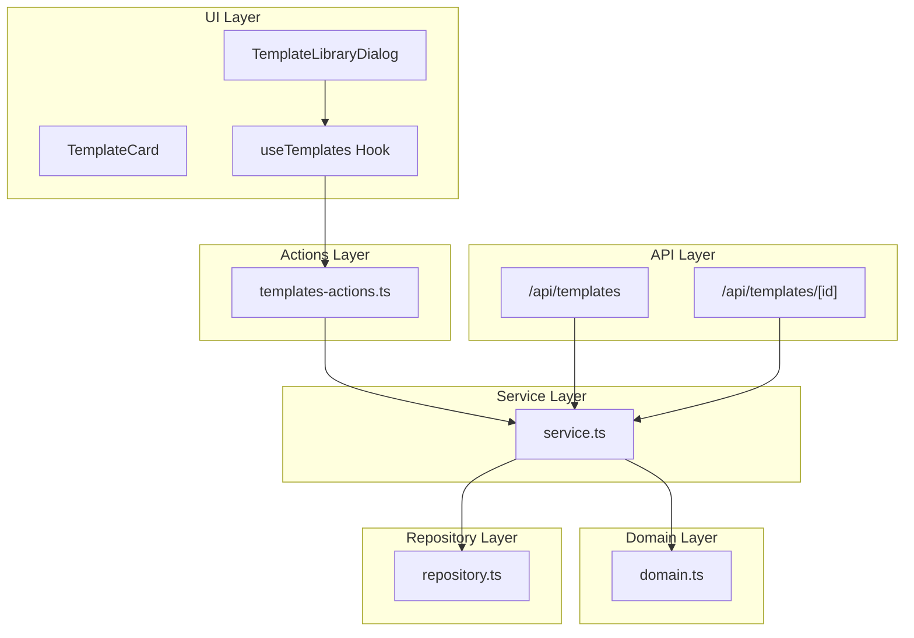
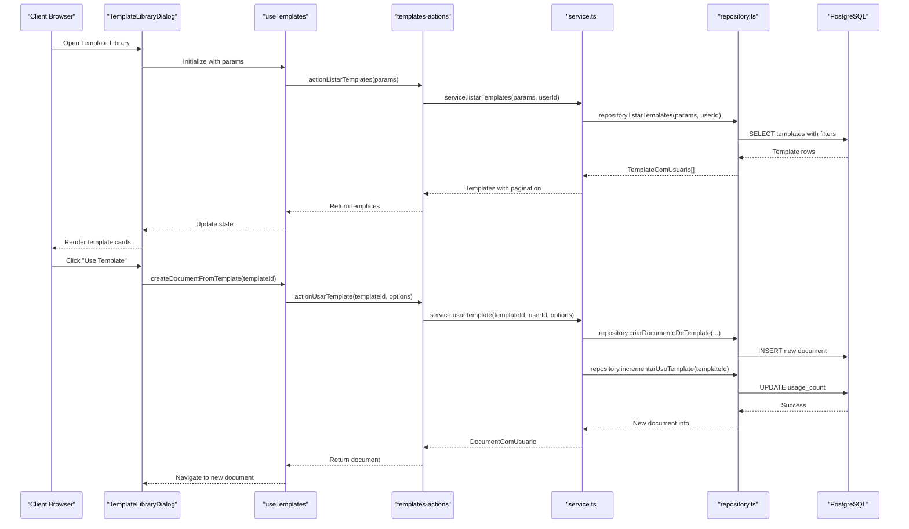
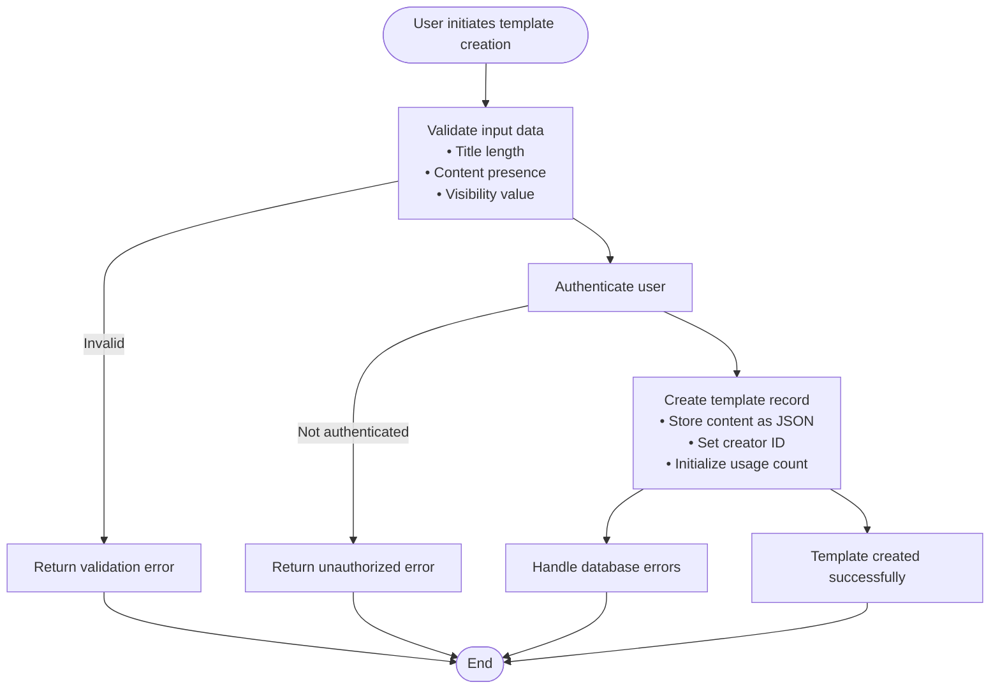
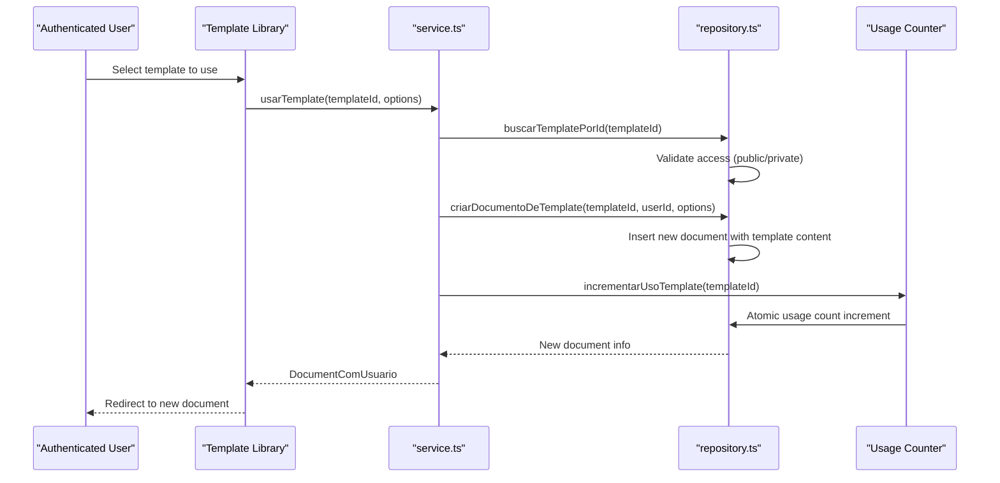
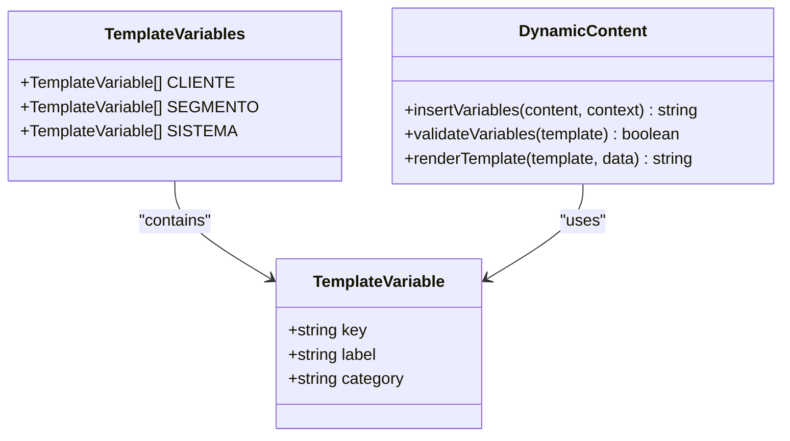
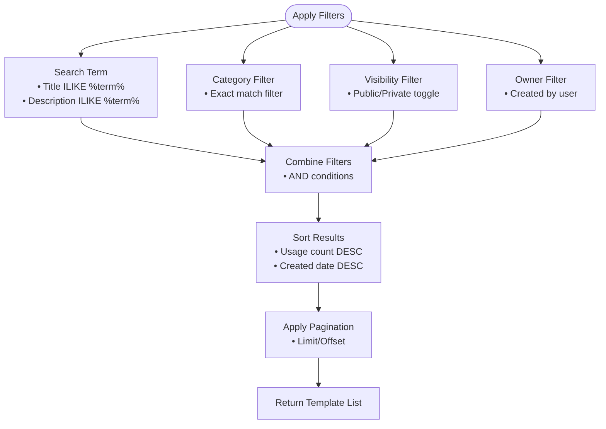
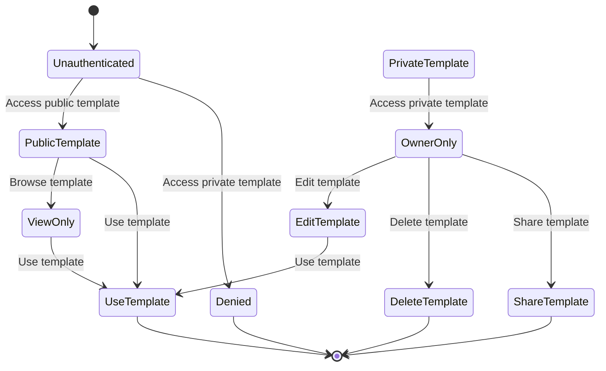
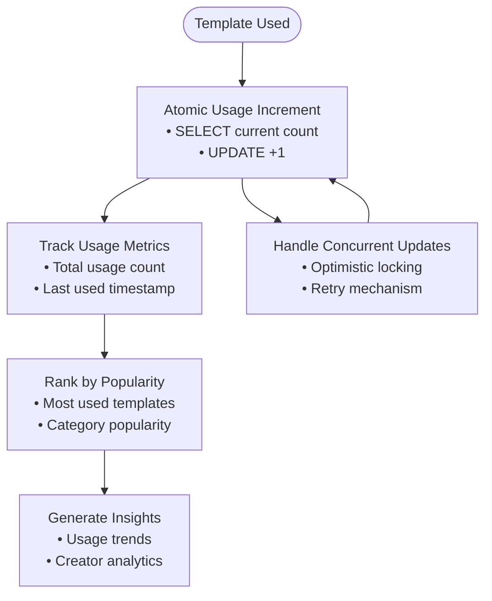
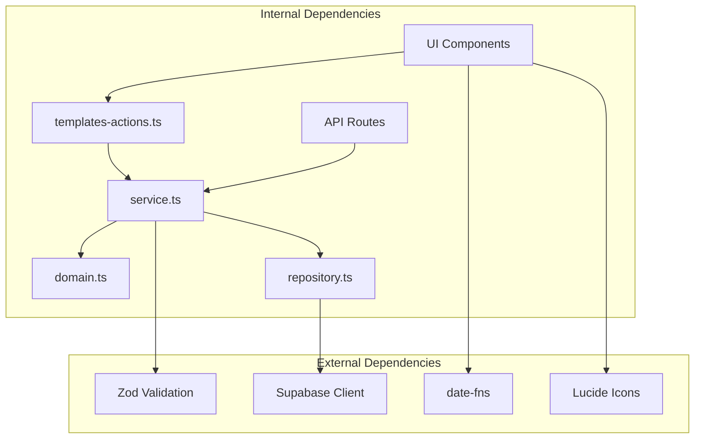

# Template System and Management

<cite>
**Referenced Files in This Document**
- [domain.ts](file://src/app/(authenticated)/documentos/domain.ts)
- [service.ts](file://src/app/(authenticated)/documentos/service.ts)
- [repository.ts](file://src/app/(authenticated)/documentos/repository.ts)
- [templates-actions.ts](file://src/app/(authenticated)/documentos/actions/templates-actions.ts)
- [route.ts](file://src/app/api/templates/route.ts)
- [route.ts](file://src/app/api/templates/[id]/route.ts)
- [template-library-dialog.tsx](file://src/app/(authenticated)/documentos/components/template-library-dialog.tsx)
- [template-card.tsx](file://src/app/(authenticated)/documentos/components/template-card.tsx)
- [use-templates.ts](file://src/app/(authenticated)/documentos/hooks/use-templates.ts)
- [page.tsx](file://src/app/(authenticated)/documentos/page.tsx)
- [visualizacao-markdown-step.tsx](file://src/app/(authenticated)/assinatura-digital/_wizard/form/visualizacao-markdown-step.tsx)
- [types.ts](file://src/app/(authenticated)/assinatura-digital/components/editor/template-texto/types.ts)
- [page.tsx](file://src/app/(authenticated)/assinatura-digital/templates/page.tsx)
</cite>

## Table of Contents
1. [Introduction](#introduction)
2. [Project Structure](#project-structure)
3. [Core Components](#core-components)
4. [Architecture Overview](#architecture-overview)
5. [Detailed Component Analysis](#detailed-component-analysis)
6. [Dependency Analysis](#dependency-analysis)
7. [Performance Considerations](#performance-considerations)
8. [Troubleshooting Guide](#troubleshooting-guide)
9. [Conclusion](#conclusion)

## Introduction
This document provides comprehensive documentation for the Template System and Management functionality within the Zattar OS platform. It covers template creation, categorization, distribution, and usage workflows. The system supports template variables, dynamic content insertion, conditional formatting, and analytics through usage counters. It also documents the template library interface, search and filtering mechanisms, permissions, sharing, and security measures.

## Project Structure
The template system is implemented across several layers:
- Domain layer defines types and validation schemas for templates
- Service layer orchestrates business logic and enforces permissions
- Repository layer handles data persistence and queries
- Actions layer provides server actions for UI interactions
- API routes expose REST endpoints for external clients
- UI components implement the template library dialog, cards, and filters
- Hooks manage client-side state and data fetching

**Diagram sources**
- [template-library-dialog.tsx](file://src/app/(authenticated)/documentos/components/template-library-dialog.tsx#L1-L288)
- [template-card.tsx](file://src/app/(authenticated)/documentos/components/template-card.tsx#L1-L133)
- [use-templates.ts](file://src/app/(authenticated)/documentos/hooks/use-templates.ts#L1-L39)
- [templates-actions.ts](file://src/app/(authenticated)/documentos/actions/templates-actions.ts#L1-L96)
- [service.ts](file://src/app/(authenticated)/documentos/service.ts#L396-L521)
- [domain.ts](file://src/app/(authenticated)/documentos/domain.ts#L343-L403)
- [repository.ts](file://src/app/(authenticated)/documentos/repository.ts#L1196-L1377)
- [route.ts:1-158](file://src/app/api/templates/route.ts#L1-L158)
- [route.ts:1-129](file://src/app/api/templates/[id]/route.ts#L1-L129)

**Section sources**
- [domain.ts](file://src/app/(authenticated)/documentos/domain.ts#L343-L403)
- [service.ts](file://src/app/(authenticated)/documentos/service.ts#L396-L521)
- [repository.ts](file://src/app/(authenticated)/documentos/repository.ts#L1196-L1377)
- [templates-actions.ts](file://src/app/(authenticated)/documentos/actions/templates-actions.ts#L1-L96)
- [route.ts:1-158](file://src/app/api/templates/route.ts#L1-L158)
- [route.ts:1-129](file://src/app/api/templates/[id]/route.ts#L1-L129)
- [template-library-dialog.tsx](file://src/app/(authenticated)/documentos/components/template-library-dialog.tsx#L1-L288)
- [template-card.tsx](file://src/app/(authenticated)/documentos/components/template-card.tsx#L1-L133)
- [use-templates.ts](file://src/app/(authenticated)/documentos/hooks/use-templates.ts#L1-L39)

## Core Components
This section outlines the primary components that implement the template system.

### Template Domain Model
The template domain model defines the structure and validation rules for templates:
- Template interface includes identifiers, title, description, content, visibility, category, thumbnail, creator, usage count, and timestamps
- Validation schemas enforce constraints on title length, content presence, and visibility values
- Permission constants define ownership and access controls

Key characteristics:
- Content stored as structured JSON (Plate.js Value)
- Visibility supports public/private access control
- Usage counting enables popularity analytics
- Category field enables classification and filtering

**Section sources**
- [domain.ts](file://src/app/(authenticated)/documentos/domain.ts#L343-L403)
- [domain.ts](file://src/app/(authenticated)/documentos/domain.ts#L771-L800)

### Service Layer Implementation
The service layer implements business logic for template operations:
- CRUD operations with permission enforcement
- Template usage tracking with atomic increments
- Category and popularity listing
- Integration with document creation workflows

Core operations:
- Listing templates with pagination and filtering
- Creating templates with validation
- Updating templates with ownership checks
- Deleting templates with authorization
- Using templates to create new documents
- Managing usage analytics

**Section sources**
- [service.ts](file://src/app/(authenticated)/documentos/service.ts#L396-L521)
- [service.ts](file://src/app/(authenticated)/documentos/service.ts#L457-L495)

### Repository Layer Implementation
The repository layer handles data persistence and complex queries:
- Template listing with search, filtering, and ordering
- Atomic usage counter increments
- Category extraction and popularity ranking
- Template-to-document conversion

Data access patterns:
- Supabase client integration for PostgreSQL operations
- BuildTemplateWithUserSelect for enriched template data
- Pagination support with count queries
- Access control validation for public/private templates

**Section sources**
- [repository.ts](file://src/app/(authenticated)/documentos/repository.ts#L1196-L1377)
- [repository.ts](file://src/app/(authenticated)/documentos/repository.ts#L1292-L1314)

### API Endpoints
REST API endpoints provide programmatic access to template functionality:
- GET /api/templates: List templates with various modes (list, categories, most used)
- POST /api/templates: Create new templates
- GET /api/templates/[id]: Retrieve specific template
- PUT /api/templates/[id]: Update existing template
- DELETE /api/templates/[id]: Remove template permanently

Request/response handling includes authentication, validation, and error management.

**Section sources**
- [route.ts:25-96](file://src/app/api/templates/route.ts#L25-L96)
- [route.ts:103-157](file://src/app/api/templates/route.ts#L103-L157)
- [route.ts:13-47](file://src/app/api/templates/[id]/route.ts#L13-L47)
- [route.ts:54-86](file://src/app/api/templates/[id]/route.ts#L54-L86)
- [route.ts:93-128](file://src/app/api/templates/[id]/route.ts#L93-L128)

### UI Components and Library Interface
The template library provides a comprehensive interface for browsing and using templates:
- TemplateLibraryDialog: Main dialog with tabs for "All" and "Most Used"
- Filtering: Search, category selection, and visibility toggles
- TemplateCard: Individual template display with metadata and actions
- Hook-based state management for efficient updates

Features:
- Debounced search for responsive filtering
- Category dropdown with dynamic population
- Visibility filtering (public/private)
- Usage statistics and creator information
- One-click template usage with document creation

**Section sources**
- [template-library-dialog.tsx](file://src/app/(authenticated)/documentos/components/template-library-dialog.tsx#L46-L131)
- [template-library-dialog.tsx](file://src/app/(authenticated)/documentos/components/template-library-dialog.tsx#L156-L272)
- [template-card.tsx](file://src/app/(authenticated)/documentos/components/template-card.tsx#L31-L132)
- [use-templates.ts](file://src/app/(authenticated)/documentos/hooks/use-templates.ts#L7-L39)

## Architecture Overview
The template system follows a layered architecture with clear separation of concerns:

**Diagram sources**
- [template-library-dialog.tsx](file://src/app/(authenticated)/documentos/components/template-library-dialog.tsx#L104-L123)
- [use-templates.ts](file://src/app/(authenticated)/documentos/hooks/use-templates.ts#L14-L31)
- [templates-actions.ts](file://src/app/(authenticated)/documentos/actions/templates-actions.ts#L8-L17)
- [service.ts](file://src/app/(authenticated)/documentos/service.ts#L396-L401)
- [repository.ts](file://src/app/(authenticated)/documentos/repository.ts#L1382-L1400)

The architecture ensures:
- Authentication and authorization at every layer
- Data validation through Zod schemas
- Atomic operations for usage tracking
- Efficient caching and debounced search
- Clear separation between UI, business logic, and data access

## Detailed Component Analysis

### Template Creation Workflow
Template creation involves multiple validation steps and permission checks:

**Diagram sources**
- [route.ts:113-139](file://src/app/api/templates/route.ts#L113-L139)
- [templates-actions.ts](file://src/app/(authenticated)/documentos/actions/templates-actions.ts#L19-L41)
- [service.ts](file://src/app/(authenticated)/documentos/service.ts#L403-L412)

Key validation rules:
- Title must be present and under 200 characters
- Content must be provided as structured JSON
- Visibility must be either "publico" or "privado"
- User must be authenticated to create templates

**Section sources**
- [route.ts:113-139](file://src/app/api/templates/route.ts#L113-L139)
- [templates-actions.ts](file://src/app/(authenticated)/documentos/actions/templates-actions.ts#L19-L41)
- [service.ts](file://src/app/(authenticated)/documentos/service.ts#L403-L412)

### Template Usage and Distribution
Template usage creates new documents while tracking popularity:

**Diagram sources**
- [service.ts](file://src/app/(authenticated)/documentos/service.ts#L457-L495)
- [repository.ts](file://src/app/(authenticated)/documentos/repository.ts#L1382-L1400)
- [repository.ts](file://src/app/(authenticated)/documentos/repository.ts#L1292-L1314)

Distribution mechanisms:
- Public templates accessible to all authenticated users
- Private templates restricted to owners
- Usage analytics through incremented counters
- Category-based organization for discoverability

**Section sources**
- [service.ts](file://src/app/(authenticated)/documentos/service.ts#L457-L495)
- [repository.ts](file://src/app/(authenticated)/documentos/repository.ts#L1292-L1314)

### Template Variables and Dynamic Content
The system supports dynamic content insertion through predefined variables:

**Diagram sources**
- [types.ts](file://src/app/(authenticated)/assinatura-digital/components/editor/template-texto/types.ts#L59-L80)

Supported variable categories:
- Client data (name, CPF/CNPJ, email, phone, address)
- Segment information (name, slug, description)
- System context (protocol, client IP, user agent)

**Section sources**
- [types.ts](file://src/app/(authenticated)/assinatura-digital/components/editor/template-texto/types.ts#L59-L80)

### Search and Filtering Mechanisms
The template library implements comprehensive search and filtering:

**Diagram sources**
- [repository.ts](file://src/app/(authenticated)/documentos/repository.ts#L1196-L1240)

Advanced filtering features:
- Debounced search input (300ms delay)
- Multi-category selection
- Visibility toggles (public/private/all)
- Owner-specific views
- Popular templates tab with usage-based ranking

**Section sources**
- [template-library-dialog.tsx](file://src/app/(authenticated)/documentos/components/template-library-dialog.tsx#L68-L102)
- [repository.ts](file://src/app/(authenticated)/documentos/repository.ts#L1196-L1240)

### Permissions, Sharing, and Approval Workflows
Template access control follows a strict permission model:

Permission enforcement:
- Public templates: accessible to all authenticated users
- Private templates: restricted to owners only
- Ownership verification for edits/deletes
- Usage tracking increments atomically
- Category and popularity listings respect visibility

**Section sources**
- [service.ts](file://src/app/(authenticated)/documentos/service.ts#L414-L431)
- [service.ts](file://src/app/(authenticated)/documentos/service.ts#L433-L455)
- [repository.ts](file://src/app/(authenticated)/documentos/repository.ts#L262-L271)

### Template Analytics and Usage Tracking
The system tracks template popularity through usage analytics:

Analytics features:
- Atomic usage counter increments prevent race conditions
- Popular templates ranking based on usage counts
- Category-based popularity analysis
- Creator performance metrics
- Real-time usage statistics

**Section sources**
- [repository.ts](file://src/app/(authenticated)/documentos/repository.ts#L1292-L1314)
- [repository.ts](file://src/app/(authenticated)/documentos/repository.ts#L1319-L1343)

## Dependency Analysis
The template system exhibits strong modularity with clear dependency relationships:

**Diagram sources**
- [domain.ts](file://src/app/(authenticated)/documentos/domain.ts#L1-L10)
- [service.ts](file://src/app/(authenticated)/documentos/service.ts#L1-L46)
- [repository.ts](file://src/app/(authenticated)/documentos/repository.ts#L13-L16)
- [templates-actions.ts](file://src/app/(authenticated)/documentos/actions/templates-actions.ts#L1-L6)
- [route.ts:8-19](file://src/app/api/templates/route.ts#L8-L19)

Key dependency characteristics:
- Loose coupling between UI and business logic through actions
- Strong typing through TypeScript interfaces
- Validation enforced at multiple layers (API, actions, service)
- Database abstraction through repository pattern
- External dependencies managed through npm packages

**Section sources**
- [domain.ts](file://src/app/(authenticated)/documentos/domain.ts#L1-L10)
- [service.ts](file://src/app/(authenticated)/documentos/service.ts#L1-L46)
- [repository.ts](file://src/app/(authenticated)/documentos/repository.ts#L13-L16)

## Performance Considerations
The template system implements several performance optimizations:

### Caching Strategies
- Template metadata caching during batch operations
- Debounced search input (300ms delay) to reduce API calls
- Client-side state management to minimize re-renders
- Efficient pagination with count queries

### Database Optimization
- Atomic usage counter increments prevent race conditions
- Proper indexing on frequently queried fields (title, category, visibility)
- Efficient JOIN queries for enriched template data
- Connection pooling through Supabase client

### UI Performance
- Skeleton loading states during data fetch
- Virtualized scrolling for large template lists
- Conditional rendering to avoid unnecessary computations
- Memoized selectors for derived data

## Troubleshooting Guide
Common issues and their resolutions:

### Authentication and Authorization Issues
**Problem**: Users receive "Unauthorized" errors when accessing templates
**Solution**: Verify authentication middleware and user session validation
**Prevention**: Implement proper error handling and redirect to login

### Template Access Restrictions
**Problem**: Users cannot see private templates they created
**Solution**: Check visibility filtering logic and ownership verification
**Prevention**: Add debug logging for access control decisions

### Performance Issues
**Problem**: Slow template loading or search operations
**Solution**: 
- Implement proper indexing on template fields
- Optimize database queries with EXPLAIN ANALYZE
- Add pagination and lazy loading
- Consider query result caching

### Data Consistency
**Problem**: Usage counters show incorrect values
**Solution**: Verify atomic increment operations and handle concurrent updates
**Prevention**: Implement retry logic and optimistic locking

**Section sources**
- [route.ts:18-47](file://src/app/api/templates/[id]/route.ts#L18-L47)
- [repository.ts](file://src/app/(authenticated)/documentos/repository.ts#L1292-L1314)

## Conclusion
The Template System and Management functionality provides a robust, scalable solution for document templating within the Zattar OS platform. The system's layered architecture ensures maintainability, while comprehensive validation and permission controls guarantee data integrity and security. Key strengths include:

- **Modular Design**: Clear separation between UI, business logic, and data access layers
- **Security**: Multi-layered authentication and authorization checks
- **Scalability**: Atomic operations, efficient queries, and caching strategies
- **User Experience**: Comprehensive filtering, debounced search, and intuitive UI components
- **Analytics**: Usage tracking and popularity metrics for template optimization

The system successfully balances flexibility with security, providing both public template distribution and private template management capabilities. Future enhancements could include template versioning, approval workflows, and advanced conditional formatting features.